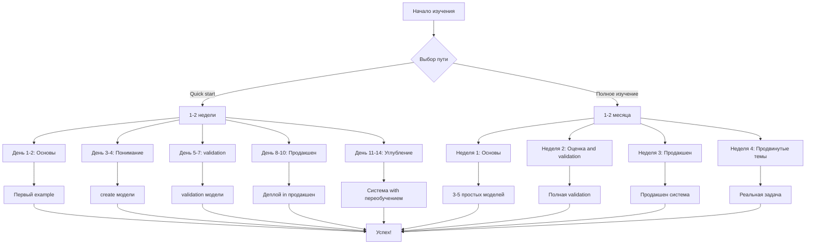
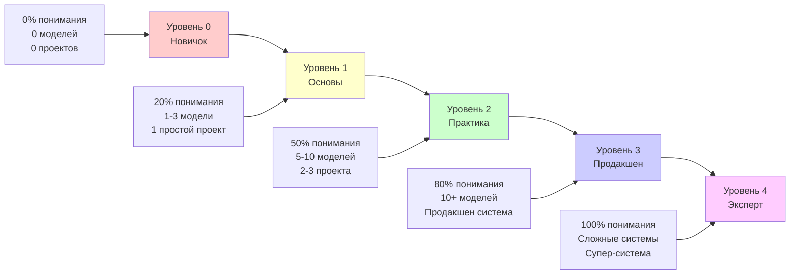
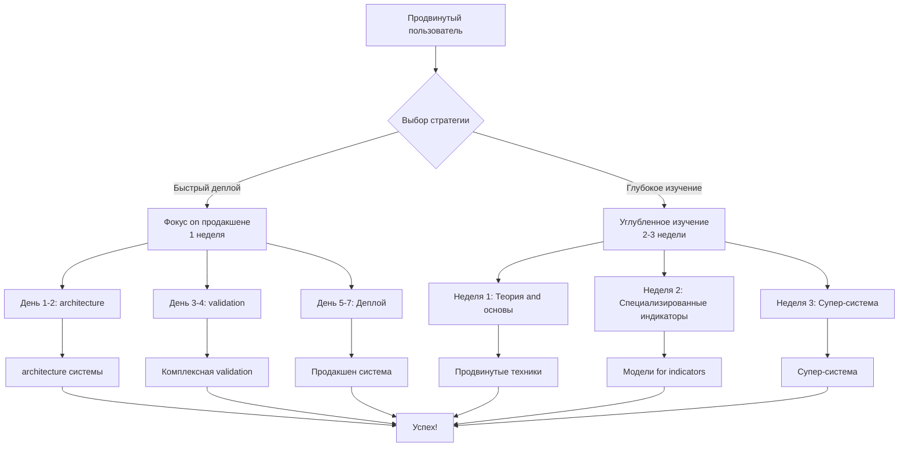
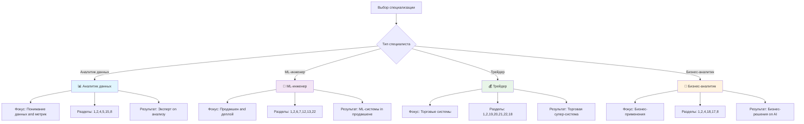
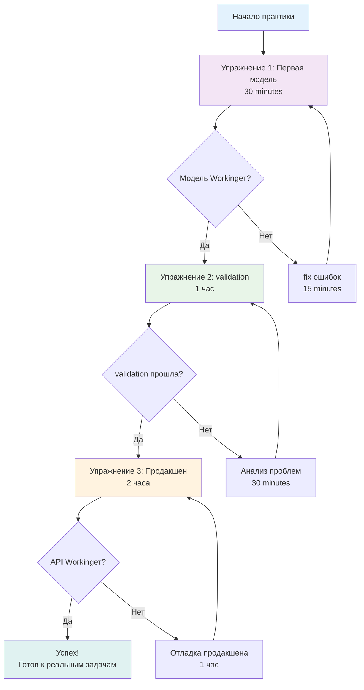
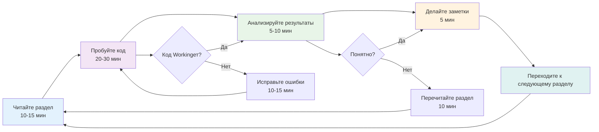
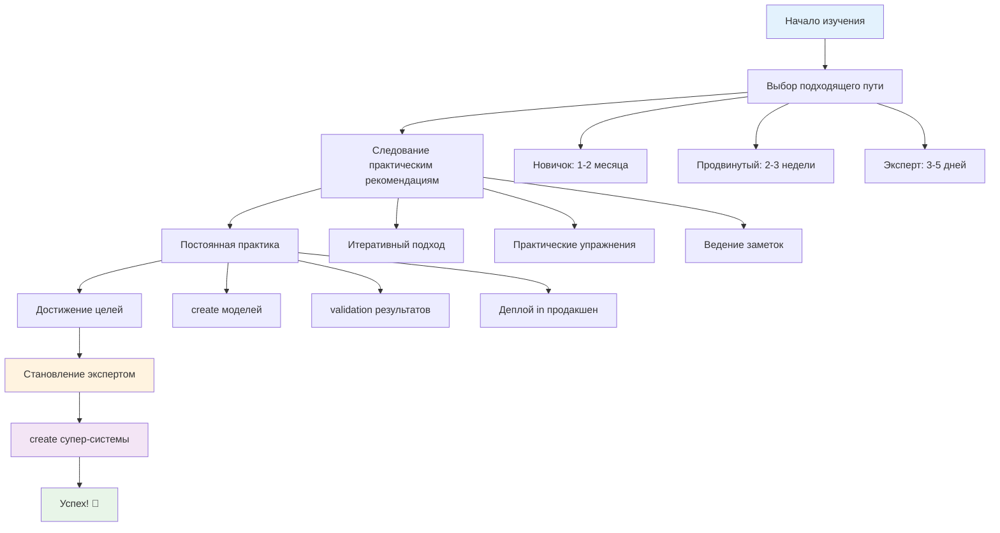

# guide on изучению учебника

**Author:** NeoZorK (Shcherbyna Rostyslav)
**Дата:** 2025
**Местоположение:** Ukraine, Zaporizhzhya
**Version:** 1.0

## Why guide on изучению критически важно

**Почему 90% людей бросают изучение ML, not имея четкого Planа?** Потому что они пытаются изучить все сразу, not понимая, with чего начать and как двигаться дальше. Это как попытка построить дом без чертежей.

### Проблемы без руководства on изучению
- **Перегрузка информацией**: Пытаются изучить все сразу
- **Неправильная последовательность**: Изучают сложное to простого
- **Отсутствие практики**: Только теория без применения
- **Потеря мотивации**: not видят прогресса

### Преимущества правильного руководства
- **Поэтапное изучение**: from простого к сложному
- **Практическая направленность**: Теория сразу применяется
- **Измеримый прогресс**: Видят результаты on каждом этапе
- **Мотивация**: Постоянное чувство достижения

## Введение

**Почему guide on изучению - это карта к успеху?** Потому что оно показывает оптимальный путь изучения, учитывая ваш уровень подготовки and цели.

Это guide поможет вам максимально эффективно изучить учебник AutoML Gluon in dependencies from вашего уровня подготовки and целей.

## for новичков (0-6 месяцев опыта)

**Почему новичкам нужен особый подход?** Потому что они еще not понимают основ ML and могут легко запутаться in сложных Conceptх. Нужен пошаговый подход with быстрыми результатами.

### 🗺️ Путь обучения for новичков



### 🚀 Quick start (1-2 недели)

**Почему Quick start критически важен for новичков?** Потому что они должны увидеть результаты как можно быстрее, чтобы not потерять мотивацию.

**Goal:** Запустить первый example как можно быстрее

#### День 1-2: Основы

**Время:** 2-3 часа in день
**Фокус:** installation and первый Launch

1. **Раздел 1** - Введение and installation
 - **parameters installation:**
- `pip install autogluon.tabular[all]` - полная installation
- `pip install autogluon.tabular` - минимальная installation
- `conda install -c conda-forge autogluon` - через conda
- **Системные требования:**
 - Python 3.8+
- RAM: минимум 4GB, рекомендуется 8GB+
- CPU: 2+ ядра
- Диск: 2GB свободного места

2. **Раздел 2** - Базовое использование
- **Ключевые parameters TabularPredictor:**
- `label`: Целевая переменная (обязательно)
 - `problem_type`: 'binary', 'multiclass', 'regression'
 - `eval_metric`: 'accuracy', 'f1', 'roc_auc', 'log_loss'
- `path`: Путь for сохранения модели
- `verbosity`: Уровень вывода (0-4)

3. **Практика:** install AutoML Gluon and запустите первый example
 ```python
# Минимальный example with параметрами
 from autogluon.tabular import TabularPredictor
 import pandas as pd

# parameters for быстрого старта
 predictor = TabularPredictor(
 label='target',
 problem_type='binary',
 eval_metric='accuracy',
 path='quickstart_model',
 verbosity=2
 )
 ```

#### День 3-4: Понимание

**Время:** 2-3 часа in день
**Фокус:** Понимание параметров and create модели

4. **Раздел 3** - Продвинутая configuration
- **parameters обучения:**
- `time_limit`: Лимит времени (секунды)
 - `presets`: 'best_quality', 'high_quality', 'medium_quality'
- `num_trials`: Количество попыток hyperparameter tuning
- `holdout_frac`: Доля данных for holdout validation

5. **Раздел 4** - metrics and оценка качества
- **Доступные metrics:**
- Классификация: 'accuracy', 'f1', 'roc_auc', 'log_loss'
- Регрессия: 'rmse', 'mae', 'r2', 'pearsonr'
- **parameters оценки:**
- `silent=True/False`: Тихий режим
- `auxiliary_metrics=True/False`: Дополнительные metrics

6. **Практика:** Создайте свою первую модель
 ```python
# Расширенный example with параметрами
 predictor.fit(
 data,
 time_limit=300, # 5 minutes
presets='medium_quality', # Среднее качество
num_trials=10, # 10 попыток
holdout_frac=0.2, # 20% for validation
 verbosity=2
 )
 ```

#### День 5-7: validation

**Время:** 2-3 часа in день
**Фокус:** validation and оценка качества

7. **Раздел 5** - validation моделей
- **parameters validation:**
- `num_bag_folds`: Количество фолдов for бэггинга
- `num_stack_levels`: Уровни стекинга
- `auto_stack`: Автоматический стекинг
- `refit_full`: retraining on all данных

8. **Раздел 8** - Лучшие практики
- **parameters качества:**
- `feature_prune`: Отбор признаков
- `excluded_model_types`: Исключенные типы моделей
- `included_model_types`: Включенные типы моделей

9. **Практика:** Проведите валидацию своей модели
 ```python
# validation with параметрами
 predictor.fit(
 data,
 time_limit=600, # 10 minutes
presets='high_quality', # Высокое качество
num_bag_folds=5, # 5-fold бэггинг
num_stack_levels=1, # 1 уровень стекинга
auto_stack=True, # Автоматический стекинг
refit_full=True, # retraining
feature_prune=True # Отбор признаков
 )
 ```

#### День 8-10: Продакшен

**Время:** 3-4 часа in день
**Фокус:** Деплой in продакшен

10. **Раздел 6** - Продакшен and деплой
- **parameters продакшена:**
- `presets='optimize_for_deployment'`: Оптимизация for деплоя
- `save_space=True`: Экономия места
- `keep_only_best=True`: Только лучшая модель

11. **Раздел 12** - Простой example продакшена
 - **API parameters:**
- `HOST`: Хост сервера
- `PORT`: Порт сервера
- `DEBUG`: Режим отладки
- `MAX_BATCH_SIZE`: Максимальный размер батча

12. **Практика:** Задеплойте модель in продакшен
 ```python
# Продакшен configuration
 predictor.fit(
 data,
 presets='optimize_for_deployment',
 save_space=True,
 keep_only_best=True,
 time_limit=1200
 )
 ```

#### День 11-14: Углубление

**Время:** 2-3 часа in день
**Фокус:** retraining and продвинутые техники

13. **Раздел 7** - retraining моделей
- **parameters retraining:**
- `retrain_frequency`: Частота retraining
- `drift_detection_window`: Окно обнаружения дрифта
- `performance_threshold`: Порог performance

14. **Раздел 9** - examples использования
- **Специализированные parameters:**
- for временных рядов: `time_limit` увеличен
- for больших данных: `num_cpus`, `memory_limit`
 - for GPU: `num_gpus`

15. **Практика:** Создайте system with переобучением
 ```python
# Система retraining
 class Retrainingsystem:
 def __init__(self, retrain_frequency=1000):
 self.retrain_frequency = retrain_frequency
 self.performance_threshold = 0.8

 def should_retrain(self, performance):
 return performance < self.performance_threshold
 ```

### 📚 Полное изучение (1-2 месяца)

**Goal:** Полное понимание AutoML Gluon

### 📊 metrics прогресса обучения



#### Неделя 1: Основы
1. **Раздел 1** - Введение and installation
2. **Раздел 2** - Базовое использование
3. **Раздел 3** - Продвинутая configuration
4. **Практика:** Создайте 3-5 простых моделей

#### Неделя 2: Оценка and validation
5. **Раздел 4** - metrics and оценка качества
6. **Раздел 5** - validation моделей
7. **Раздел 8** - Лучшие практики
8. **Практика:** Проведите полную валидацию

#### Неделя 3: Продакшен
9. **Раздел 6** - Продакшен and деплой
10. **Раздел 7** - retraining моделей
11. **Раздел 12** - Простой example продакшена
12. **Практика:** Создайте продакшен system

#### Неделя 4: Продвинутые темы
13. **Раздел 9** - examples использования
14. **Раздел 10** - Troubleshooting
15. **Раздел 13** - Сложный example продакшена
16. **Практика:** Решите реальную задачу

## for продвинутых пользователей (6+ месяцев опыта)

### 🎯 Путь for продвинутых пользователей



### 🎯 Фокус on продакшене (1 неделя)

**Goal:** Создать робастную продакшен system

#### День 1-2: architecture
1. **Раздел 6** - Продакшен and деплой
2. **Раздел 12** - Простой example продакшена
3. **Раздел 13** - Сложный example продакшена
4. **Практика:** Спроектируйте архитектуру системы

#### День 3-4: validation
5. **Раздел 5** - validation моделей
6. **Раздел 8** - Лучшие практики
7. **Практика:** Проведите комплексную валидацию

#### День 5-7: Деплой
8. **Раздел 7** - retraining моделей
9. **Раздел 9** - examples использования
10. **Практика:** Задеплойте system in продакшен

### 🔬 Углубленное изучение (2-3 недели)

**Goal:** Стать экспертом in AutoML Gluon

#### Неделя 1: Теория and основы
1. **Раздел 14** - Теория and основы AutoML
2. **Раздел 15** - Интерпретируемость and объяснимость
3. **Раздел 16** - Продвинутые темы
4. **Практика:** Реализуйте продвинутые техники

#### Неделя 2: Специализированные индикаторы
5. **Раздел 19** - WAVE2 Индикатор
6. **Раздел 20** - SCHR Levels
7. **Раздел 21** - SCHR SHORT3
8. **Практика:** Создайте модели for каждого индикатора

#### Неделя 3: Супер-система
9. **Раздел 22** - Супер-система
10. **Раздел 17** - Этика and ответственный AI
11. **Раздел 18** - Кейс-стади
12. **Практика:** Создайте супер-system

## for экспертов (2+ года опыта)

### 🚀 Максимальная эффективность (3-5 дней)

**Goal:** Быстро освоить новые техники

#### День 1: Обзор
1. **Раздел 1** - Введение and installation (быстро)
2. **Раздел 14** - Теория and основы AutoML
3. **Раздел 16** - Продвинутые темы
4. **Практика:** Оцените новые возможности

#### День 2: Специализированные техники
5. **Раздел 19** - WAVE2 Индикатор
6. **Раздел 20** - SCHR Levels
7. **Раздел 21** - SCHR SHORT3
8. **Практика:** Протестируйте новые индикаторы

#### День 3: Супер-система
9. **Раздел 22** - Супер-система
10. **Раздел 18** - Кейс-стади (выборочно)
11. **Практика:** Создайте прототип супер-системы

#### День 4-5: Деплой and оптимизация
12. **Раздел 6** - Продакшен and деплой
13. **Раздел 7** - retraining моделей
14. **Практика:** Задеплойте and оптимизируйте system

## Специализированные пути изучения

### 🎯 Карта специализированных путей



### 📊 for аналитиков данных

**Фокус:** Понимание данных and метрик
**Время:** 2-3 недели
**Ключевые навыки:** Анализ данных, интерпретация результатов, выбор метрик

#### parameters for аналитиков данных

1. **Раздел 1** - Введение and installation
 - **parameters installation:**
- `pip install autogluon.tabular[all]` - полная installation with визуализацией
- `pip install matplotlib seaborn plotly` - дополнительные библиотеки визуализации
- **Системные требования:**
- RAM: 8GB+ (for больших датасетов)
- Диск: 5GB+ (for данных and моделей)

2. **Раздел 2** - Базовое использование
- **Ключевые parameters for Analysis:**
 ```python
 predictor = TabularPredictor(
 label='target',
 problem_type='binary',
 eval_metric='roc_auc', # ROC-AUC for Analysis
 path='Analysis_model',
verbosity=3, # Подробный вывод
presets='best_quality' # Лучшее качество for Analysis
 )
 ```

3. **Раздел 4** - metrics and оценка качества
- **parameters метрик for Analysis:**
 - `eval_metric`: 'roc_auc', 'f1', 'precision', 'recall'
- `auxiliary_metrics=True`: Дополнительные metrics
- `silent=False`: Подробный вывод метрик
- **Анализ performance:**
 ```python
# Детальная оценка with параметрами
 performance = predictor.evaluate(
 test_data,
 silent=False,
 auxiliary_metrics=True,
 Detailed_Report=True
 )
 ```

4. **Раздел 5** - validation моделей
- **parameters validation for Analysis:**
- `num_bag_folds=10`: Больше фолдов for стабильности
- `holdout_frac=0.3`: Больше данных for validation
- `auto_stack=True`: Автоматический стекинг
- **Кросс-validation:**
 ```python
 predictor.fit(
 data,
 num_bag_folds=10, # 10-fold CV
 holdout_frac=0.3, # 30% for holdout
auto_stack=True, # Стекинг
refit_full=True # retraining
 )
 ```

5. **Раздел 15** - Интерпретируемость and объяснимость
- **parameters интерпретации:**
- `feature_importance=True`: Важность признаков
- `permutation_importance=True`: Перестановочная важность
- `shap_values=True`: SHAP значения
- **Анализ важности:**
 ```python
# Важность признаков
 importance = predictor.feature_importance(data)

# SHAP значения
 explainer = predictor.get_explainer()
 shap_values = explainer.shap_values(data)
 ```

6. **Раздел 8** - Лучшие практики
- **parameters качества for Analysis:**
- `feature_prune=True`: Отбор признаков
- `excluded_model_types=['KNN']`: Исключение медленных моделей
- `included_model_types=['RF', 'GBM', 'XGB']`: Включение интерпретируемых моделей

### 🤖 for ML-инженеров

**Фокус:** Продакшен and деплой
**Время:** 2-3 недели
**Ключевые навыки:** Деплой, Monitoring, масштабирование, DevOps

#### parameters for ML-инженеров

1. **Раздел 1** - Введение and installation
- **parameters installation for продакшена:**
- `pip install autogluon.tabular[all]` - полная installation
- `pip install gunicorn uwsgi` - WSGI серверы
- `pip install docker kubernetes` - контейнеризация
- **Системные требования:**
- RAM: 16GB+ (for продакшена)
- CPU: 8+ ядер
- Диск: 20GB+ (for моделей and логов)

2. **Раздел 2** - Базовое использование
- **parameters for продакшена:**
 ```python
 predictor = TabularPredictor(
 label='target',
 problem_type='binary',
 eval_metric='accuracy',
 path='production_model',
verbosity=1, # Минимальный вывод in продакшене
presets='optimize_for_deployment' # Оптимизация for деплоя
 )
 ```

3. **Раздел 6** - Продакшен and деплой
- **parameters оптимизации:**
- `presets='optimize_for_deployment'`: Оптимизация for деплоя
- `save_space=True`: Экономия места
- `keep_only_best=True`: Только лучшая модель
- `refit_full=False`: Отключение retraining
- **configuration for продакшена:**
 ```python
 predictor.fit(
 data,
 presets='optimize_for_deployment',
 save_space=True,
 keep_only_best=True,
 refit_full=False,
time_limit=3600, # 1 час максимум
num_trials=50, # Больше попыток
 hyperparameter_tune_kwargs={
 'scheduler': 'local',
 'searcher': 'bayes',
 'num_trials': 50
 }
 )
 ```

4. **Раздел 7** - retraining моделей
- **parameters retraining:**
- `retrain_frequency=1000`: Частота retraining
- `drift_detection_window=200`: Окно обнаружения дрифта
- `performance_threshold=0.8`: Порог performance
- `adaptation_rate=0.1`: Скорость адаптации
- **Система retraining:**
 ```python
 class ProductionRetrainingsystem:
 def __init__(self):
 self.retrain_frequency = 1000
 self.drift_threshold = 0.1
 self.performance_threshold = 0.8
 self.adaptation_rate = 0.1

 def should_retrain(self, performance, drift_score):
 return (performance < self.performance_threshold or
 drift_score > self.drift_threshold)
 ```

5. **Раздел 12** - Простой example продакшена
 - **API parameters:**
- `HOST='0.0.0.0'`: Привязка ко all interfaceам
- `PORT=5000`: Порт сервера
- `DEBUG=False`: Отключение debug in продакшене
- `MAX_BATCH_SIZE=1000`: Максимальный размер батча
- `REQUEST_TIMEOUT=30`: Таймаут запроса
 - **configuration API:**
 ```python
 class ProductionConfig:
 HOST = '0.0.0.0'
 PORT = 5000
 DEBUG = False
 MAX_BATCH_SIZE = 1000
 REQUEST_TIMEOUT = 30
 API_KEY = os.getenv('API_KEY')
 RATE_LIMIT = 100
 ENABLE_METRICS = True
 ```

6. **Раздел 13** - Сложный example продакшена
- **parameters масштабирования:**
- `num_workers=4`: Количество воркеров
- `max_connections=1000`: Максимальные соединения
- `memory_limit='2GB'`: Лимит памяти
- `cpu_limit=2`: Лимит CPU
 - **Docker configuration:**
 ```dockerfile
 FROM python:3.9-slim
 WORKDIR /app
 COPY requirements.txt .
 RUN pip install --no-cache-dir -r requirements.txt
 COPY . .
 EXPOSE 5000
 CMD ["gunicorn", "--bind", "0.0.0.0:5000",
 "--workers", "4", "--timeout", "30", "app:app"]
 ```

7. **Раздел 22** - Супер-система
- **parameters супер-системы:**
 - `ensemble_methods=['adaptive', 'context', 'temporal']`
 - `weight_update_frequency=100`
 - `confidence_threshold=0.7`
 - `min_models_agreement=2`
- **configuration супер-системы:**
 ```python
 super_system_config = {
 'ensemble_methods': ['adaptive', 'context', 'temporal'],
 'weight_update_frequency': 100,
 'confidence_threshold': 0.7,
 'min_models_agreement': 2,
 'performance_window': 500,
 'context_sensitivity': 0.8
 }
 ```

### 💰 for трейдеров

**Фокус:** Торговые системы
**Время:** 3-4 недели
**Ключевые навыки:** Торговые индикаторы, риск-менеджмент, автоматизация торговли

#### parameters for трейдеров

1. **Раздел 1** - Введение and installation
 - **parameters installation for trading:**
- `pip install autogluon.tabular[all]` - полная installation
- `pip install yfinance ccxt` - data with бирж
- `pip install ta-lib` - Technical индикаторы
- **Системные требования:**
- RAM: 16GB+ (for обработки больших объемов данных)
- CPU: 8+ ядер (for быстрых вычислений)
- Диск: 50GB+ (for исторических данных)

2. **Раздел 2** - Базовое использование
- **parameters for торговых систем:**
 ```python
 predictor = TabularPredictor(
 label='target',
problem_type='binary', # Покупка/продажа
 eval_metric='f1', # F1 for trading
 path='trading_model',
 verbosity=2,
presets='best_quality' # Лучшее качество критично
 )
 ```

3. **Раздел 19** - WAVE2 Индикатор
 - **parameters WAVE2:**
- `min_wave_length=5`: Минимальная длина волны
- `max_wave_length=50`: Максимальная длина волны
- `amplitude_threshold=0.02`: Порог амплитуды (2%)
- `frequency_threshold=0.1`: Порог частоты
- `phase_threshold=0.3`: Порог фазы
 - **configuration WAVE2:**
 ```python
 wave2_config = {
 'min_wave_length': 5,
 'max_wave_length': 50,
 'amplitude_threshold': 0.02,
 'frequency_threshold': 0.1,
 'phase_threshold': 0.3,
 'signal_threshold': 0.6,
 'risk_reward_ratio': 2.0
 }
 ```

4. **Раздел 20** - SCHR Levels
 - **parameters SCHR Levels:**
- `lookback_period=50`: Период Analysis уровней
- `min_touches=3`: Минимальные касания
- `tolerance=0.001`: Допуск (0.1%)
- `pressure_threshold=0.7`: Порог давления
- `breakout_threshold=0.8`: Порог пробоя
 - **configuration SCHR Levels:**
 ```python
 schr_config = {
 'lookback_period': 50,
 'min_touches': 3,
 'tolerance': 0.001,
 'pressure_threshold': 0.7,
 'breakout_threshold': 0.8,
 'volume_weight': 0.3,
 'volume_confirmation': True
 }
 ```

5. **Раздел 21** - SCHR SHORT3
 - **parameters SCHR SHORT3:**
- `short_period=3`: Краткосрочный период
- `volatility_window=10`: Окно волатильности
- `momentum_threshold=0.5`: Порог момента
- `volatility_threshold=0.02`: Порог волатильности (2%)
- `signal_strength=0.6`: Сила сигнала
 - **configuration SCHR SHORT3:**
 ```python
 short3_config = {
 'short_period': 3,
 'volatility_window': 10,
 'momentum_threshold': 0.5,
 'volatility_threshold': 0.02,
 'signal_strength': 0.6,
 'pattern_types': ['candlestick', 'price_action'],
 'min_pattern_strength': 0.7
 }
 ```

6. **Раздел 22** - Супер-система
- **parameters супер-системы for trading:**
 - `ensemble_methods=['adaptive', 'context', 'temporal']`
- `weight_update_frequency=50`: Частое update весов
- `confidence_threshold=0.8`: Высокий порог уверенности
- `min_models_agreement=2`: Минимум 2 согласных модели
- **Торговая configuration:**
 ```python
 trading_system_config = {
 'ensemble_methods': ['adaptive', 'context', 'temporal'],
 'weight_update_frequency': 50,
 'confidence_threshold': 0.8,
 'min_models_agreement': 2,
 'risk_Management': {
'max_position_size': 0.1, # 10% капитала
'stop_loss_threshold': 0.02, # 2% стоп-лосс
'take_profit_threshold': 0.04, # 4% тейк-профит
'max_drawdown': 0.05 # 5% максимальная просадка
 },
 'trading_hours': {
 'start': '09:00',
 'end': '17:00',
 'timezone': 'UTC'
 }
 }
 ```

7. **Раздел 18** - Кейс-стади (криптотрейдинг)
- **parameters for криптотрейдинга:**
- `Timeframe='1h'`: Timeframe (1 час)
- `lookback_days=365`: Год исторических данных
- `volatility_adjustment=True`: Корректировка on волатильности
- `market_hours_24_7=True`: Круглосуточная торговля
- **Крипто configuration:**
 ```python
 crypto_config = {
 'Timeframe': '1h',
 'lookback_days': 365,
 'volatility_adjustment': True,
 'market_hours_24_7': True,
 'exchanges': ['binance', 'coinbase', 'kraken'],
 'pairs': ['BTC/USDT', 'ETH/USDT', 'ADA/USDT'],
 'risk_Management': {
'max_position_size': 0.05, # 5% for крипто
'stop_loss_threshold': 0.03, # 3% стоп-лосс
'take_profit_threshold': 0.06, # 6% тейк-профит
'max_drawdown': 0.03 # 3% максимальная просадка
 }
 }
 ```

### 🏢 for бизнес-аналитиков

**Фокус:** Бизнес-применения
**Время:** 2-3 недели
**Ключевые навыки:** Бизнес-metrics, интерпретация результатов, ROI, этика AI

#### parameters for бизнес-аналитиков

1. **Раздел 1** - Введение and installation
- **parameters installation for бизнеса:**
- `pip install autogluon.tabular[all]` - полная installation
- `pip install plotly dash` - интерактивные дашборды
- `pip install jupyter voila` - презентации
- **Системные требования:**
- RAM: 8GB+ (for Analysis больших датасетов)
- CPU: 4+ ядра
- Диск: 10GB+ (for данных and Reportов)

2. **Раздел 2** - Базовое использование
- **parameters for бизнес-Analysis:**
 ```python
 predictor = TabularPredictor(
 label='target',
 problem_type='binary',
eval_metric='roc_auc', # ROC-AUC for бизнеса
 path='business_model',
 verbosity=2,
presets='high_quality' # Высокое качество
 )
 ```

3. **Раздел 4** - metrics and оценка качества
- **Бизнес-metrics:**
- `eval_metric='roc_auc'`: ROC-AUC for классификации
- `eval_metric='rmse'`: RMSE for регрессии
- `auxiliary_metrics=True`: Дополнительные metrics
- **Анализ ROI:**
 ```python
# Бизнес-metrics
 business_metrics = {
 'roi': 0.15, # 15% ROI
'cost_per_Prediction': 0.01, # $0.01 за Prediction
'accuracy_threshold': 0.85, # 85% точность
'false_positive_cost': 10.0, # $10 за ложный положительный
'false_negative_cost': 50.0 # $50 за ложный отрицательный
 }
 ```

4. **Раздел 18** - Кейс-стади
- **parameters for кейс-стади:**
- `time_limit=1800`: 30 minutes on обучение
- `presets='best_quality'`: Лучшее качество
- `holdout_frac=0.2`: 20% for validation
- `feature_prune=True`: Отбор признаков
- **configuration кейс-стади:**
 ```python
 case_study_config = {
 'time_limit': 1800,
 'presets': 'best_quality',
 'holdout_frac': 0.2,
 'feature_prune': True,
 'business_context': {
 'industry': 'finance',
 'Use_case': 'credit_scoring',
 'stakeholders': ['risk_team', 'business_team'],
 'compliance_required': True
 }
 }
 ```

5. **Раздел 17** - Этика and ответственный AI
- **parameters этики:**
- `fairness_metrics=True`: metrics справедливости
- `bias_detection=True`: Обнаружение смещений
- `explainability=True`: Объяснимость решений
- `privacy_preserving=True`: Сохранение приватности
- **Этическая configuration:**
 ```python
 ethics_config = {
 'fairness_metrics': True,
 'bias_detection': True,
 'explainability': True,
 'privacy_preserving': True,
 'protected_attributes': ['age', 'gender', 'race'],
 'fairness_threshold': 0.8,
 'bias_threshold': 0.1
 }
 ```

6. **Раздел 8** - Лучшие практики
- **parameters качества for бизнеса:**
- `feature_prune=True`: Отбор признаков
- `excluded_model_types=['KNN']`: Исключение медленных моделей
- `included_model_types=['RF', 'GBM', 'XGB']`: Интерпретируемые модели
- `refit_full=True`: retraining on all данных
- **Бизнес-configuration:**
 ```python
 business_config = {
 'feature_prune': True,
 'excluded_model_types': ['KNN', 'NN_TORCH'],
 'included_model_types': ['RF', 'GBM', 'XGB', 'CAT'],
 'refit_full': True,
 'business_requirements': {
'max_inference_time': 0.1, # 100ms максимум
'min_accuracy': 0.85, # 85% минимум
'max_model_size': 100, # 100MB максимум
 'interpretability_required': True
 }
 }
 ```

## Практические рекомендации

### 📝 Ведение заметок

1. **Создайте файл заметок** for каждого раздела
2. **Записывайте код** который вы пробуете
3. **Фиксируйте ошибки** and их решения
4. **Отмечайте важные моменты** for будущего использования

### 🧪 Практические упражнения

### 🔄 Блок-схема практических упражнений



#### Упражнение 1: Первая модель (30 minutes)

**Goal:** Создать первую модель AutoML Gluon with пониманием all параметров

```python
# Создайте простую модель on датасете Iris
from autogluon.tabular import TabularPredictor
import pandas as pd
from sklearn.datasets import load_iris

# Loading data
iris = load_iris()
data = pd.dataFrame(iris.data, columns=iris.feature_names)
data['target'] = iris.target

# create модели with детальными параметрами
predictor = TabularPredictor(
label='target', # Целевая переменная (обязательный parameter)
problem_type='multiclass', # Тип задачи: 'binary', 'multiclass', 'regression'
eval_metric='accuracy', # Метрика оценки: 'accuracy', 'f1', 'roc_auc', 'log_loss'
path='iris_model', # Путь for сохранения модели
verbosity=2, # Уровень вывода: 0-4 (0=тихо, 4=подробно)
presets='medium_quality_faster_inference' # Предinstallation качества
)

# Обучение модели with параметрами
predictor.fit(
data, # Обучающие data
time_limit=60, # Лимит времени обучения (секунды)
presets='medium_quality', # Качество моделей: 'best_quality', 'high_quality', 'medium_quality', 'optimize_for_deployment'
num_trials=10, # Количество попыток for hyperparameter tuning
hyperparameter_tune_kwargs={ # parameters Settings гиперпараметров
'scheduler': 'local', # Planировщик: 'local', 'ray'
'searcher': 'auto', # Поисковик: 'auto', 'random', 'bayes'
'num_trials': 10, # Количество попыток
'search_space': 'default' # Пространство поиска
 },
holdout_frac=0.2, # Доля данных for holdout validation
num_bag_folds=0, # Количество фолдов for бэггинга (0=отключить)
num_stack_levels=0, # Количество уровней стекинга (0=отключить)
auto_stack=True, # Автоматический стекинг
num_gpus=0, # Количество GPU for обучения
num_cpus=None, # Количество CPU (None=автоопределение)
memory_limit=None, # Лимит памяти (None=без ограничений)
feature_prune=True, # Отбор признаков
excluded_model_types=[], # Исключенные типы моделей
included_model_types=[], # Включенные типы моделей ([]=все)
refit_full=True, # retraining on all данных
set_best_to_refit_full=True, # installation лучшей модели как refit_full
save_space=True, # Экономия места on диске
save_bag_folds=True, # Сохранение бэггинг фолдов
keep_only_best=True, # Сохранение только лучшей модели
num_bag_sets=1, # Количество наборов бэггинга
num_stack_levels=0, # Количество уровней стекинга
num_bag_folds=0, # Количество фолдов бэггинга
ag_args_fit={ # Дополнительные аргументы for fit
 'num_gpus': 0,
 'num_cpus': None,
 'time_limit': 60
 },
ag_args_ensemble={ # Аргументы for ансамбля
 'num_gpus': 0,
 'num_cpus': None
 }
)

# Оценка модели
predictions = predictor.predict(data)
print(f"Точность: {predictor.evaluate(data)}")

# Дополнительная информация о модели
print(f"Лучшая модель: {predictor.get_model_best()}")
print(f"Доступные модели: {predictor.get_model_names()}")
print(f"Важность признаков: {predictor.feature_importance(data)}")
```

#### Упражнение 2: validation (1 час)

**Goal:** Провести полную валидацию модели with пониманием all параметров validation

```python
# Проведите полную валидацию модели
from sklearn.model_selection import train_test_split, cross_val_score, StratifiedKFold
from sklearn.metrics import classification_Report, confusion_matrix
import numpy as np

# Разделение данных with параметрами
train_data, test_data = train_test_split(
 data,
test_size=0.2, # Доля testsых данных (20%)
random_state=42, # Случайное состояние for воспроизводимости
stratify=data['target'] # Стратификация on целевой переменной
)

# create модели with параметрами validation
predictor = TabularPredictor(
 label='target',
 problem_type='multiclass',
 eval_metric='accuracy',
 path='iris_validation_model',
 verbosity=2
)

# Обучение with параметрами validation
predictor.fit(
 train_data,
time_limit=120, # Увеличенное время for лучшего качества
presets='high_quality', # Высокое качество for validation
holdout_frac=0.2, # 20% данных for holdout validation
num_bag_folds=5, # 5-fold бэггинг for стабильности
num_stack_levels=1, # 1 уровень стекинга
auto_stack=True, # Автоматический стекинг
num_trials=20, # Больше попыток for hyperparameter tuning
 hyperparameter_tune_kwargs={
 'scheduler': 'local',
'searcher': 'bayes', # Байесовский поиск for лучших результатов
 'num_trials': 20,
 'search_space': 'default'
 },
feature_prune=True, # Отбор признаков
refit_full=True, # retraining on all данных
 set_best_to_refit_full=True
)

# validation on testsых данных
test_predictions = predictor.predict(test_data)
test_accuracy = predictor.evaluate(test_data, silent=True)

# Детальная оценка performance
print(f"Точность on тесте: {test_accuracy}")

# Кросс-validation on обучающих данных
cv_scores = []
skf = StratifiedKFold(n_splits=5, shuffle=True, random_state=42)
for train_idx, val_idx in skf.split(train_data.drop('target', axis=1), train_data['target']):
 cv_train = train_data.iloc[train_idx]
 cv_val = train_data.iloc[val_idx]

# Обучение on фолде
 cv_predictor = TabularPredictor(
 label='target',
 problem_type='multiclass',
 eval_metric='accuracy',
 path=f'cv_model_{len(cv_scores)}',
 verbosity=0
 )
 cv_predictor.fit(cv_train, time_limit=60, presets='medium_quality')

# Оценка on валидационном фолде
 cv_pred = cv_predictor.predict(cv_val)
 cv_acc = cv_predictor.evaluate(cv_val, silent=True)
 cv_scores.append(cv_acc)

print(f"Средняя точность CV: {np.mean(cv_scores):.4f} (+/- {np.std(cv_scores)*2:.4f})")

# Детальный Report о классификации
print("\nReport о классификации:")
print(classification_Report(test_data['target'], test_predictions))

# Матрица ошибок
print("\nМатрица ошибок:")
print(confusion_matrix(test_data['target'], test_predictions))

# Анализ важности признаков
feature_importance = predictor.feature_importance(test_data)
print(f"\nВажность признаков:")
print(feature_importance)

# Анализ performance on классам
class_names = iris.target_names
for i, class_name in enumerate(class_names):
 class_mask = test_data['target'] == i
 if np.sum(class_mask) > 0:
 class_accuracy = np.mean(test_predictions[class_mask] == test_data['target'][class_mask])
print(f"Точность for класса {class_name}: {class_accuracy:.4f}")

# Анализ уверенности predictions
pred_proba = predictor.predict_proba(test_data)
confidence = np.max(pred_proba, axis=1)
print(f"\nСредняя уверенность predictions: {np.mean(confidence):.4f}")
print(f"Минимальная уверенность: {np.min(confidence):.4f}")
print(f"Максимальная уверенность: {np.max(confidence):.4f}")

# Анализ ошибок
errors = test_predictions != test_data['target']
if np.sum(errors) > 0:
print(f"\nАнализ ошибок ({np.sum(errors)} из {len(test_data)}):")
 error_indices = np.where(errors)[0]
for idx in error_indices[:5]: # Показываем первые 5 ошибок
 true_class = class_names[test_data['target'].iloc[idx]]
 pred_class = class_names[test_predictions[idx]]
 confidence_error = confidence[idx]
print(f" index {idx}: Истина={true_class}, Prediction={pred_class}, Уверенность={confidence_error:.4f}")
```

#### Упражнение 3: Продакшен (2 часа)

**Goal:** Создать полноценную продакшен API with пониманием all параметров деплоя

```python
# Создайте простую API for модели
from flask import Flask, request, jsonify, abort
from flask_cors import CORS
import joblib
import pandas as pd
import numpy as np
import logging
import os
import time
from datetime import datetime
import json
from functools import wraps
import traceback

# configuration Logsрования
logging.basicConfig(
 level=logging.INFO,
 format='%(asctime)s - %(name)s - %(levelname)s - %(message)s',
 handlers=[
 logging.FileHandler('api.log'),
 logging.StreamHandler()
 ]
)
logger = logging.getLogger(__name__)

app = Flask(__name__)
CORS(app) # Включение CORS for фронтенда

# configuration приложения
class Config:
# parameters модели
 MODEL_PATH = os.getenv('MODEL_PATH', 'iris_validation_model')
 MODEL_TYPE = os.getenv('MODEL_TYPE', 'TabularPredictor')

 # parameters API
 HOST = os.getenv('HOST', '0.0.0.0')
 PORT = int(os.getenv('PORT', 5000))
 DEBUG = os.getenv('DEBUG', 'False').lower() == 'true'

# parameters performance
 MAX_BATCH_SIZE = int(os.getenv('MAX_BATCH_SIZE', 1000))
 MAX_REQUEST_SIZE = int(os.getenv('MAX_REQUEST_SIZE', 1024 * 1024)) # 1MB
REQUEST_TIMEOUT = int(os.getenv('REQUEST_TIMEOUT', 30)) # 30 секунд

# parameters Monitoringа
 ENABLE_METRICS = os.getenv('ENABLE_METRICS', 'True').lower() == 'true'
METRICS_INTERVAL = int(os.getenv('METRICS_INTERVAL', 60)) # 60 секунд

# parameters безопасности
 API_KEY = os.getenv('API_KEY', None)
RATE_LIMIT = int(os.getenv('RATE_LIMIT', 100)) # запросов in minutesу

# parameters validation
 required_FEATURES = ['sepal length (cm)', 'sepal width (cm)',
 'petal length (cm)', 'petal width (cm)']
 FEATURE_RANGES = {
 'sepal length (cm)': (4.0, 8.0),
 'sepal width (cm)': (2.0, 4.5),
 'petal length (cm)': (1.0, 7.0),
 'petal width (cm)': (0.1, 2.5)
 }

app.config.from_object(Config)

# Глобальные переменные for Monitoringа
request_count = 0
error_count = 0
total_Prediction_time = 0
start_time = time.time()

# Загрузка модели with обработкой ошибок
try:
 predictor = TabularPredictor.load(Config.MODEL_PATH)
logger.info(f"Модель загружена из {Config.MODEL_PATH}")
logger.info(f"Доступные модели: {predictor.get_model_names()}")
logger.info(f"Лучшая модель: {predictor.get_model_best()}")
except Exception as e:
logger.error(f"Ошибка загрузки модели: {e}")
 predictor = None

# Декораторы for обработки ошибок and Monitoringа
def handle_errors(f):
 @wraps(f)
 def decorated_function(*args, **kwargs):
 global error_count
 try:
 return f(*args, **kwargs)
 except Exception as e:
 error_count += 1
logger.error(f"Ошибка in {f.__name__}: {str(e)}")
 logger.error(traceback.format_exc())
 return jsonify({
 'error': 'Internal Server Error',
 'message': str(e),
 'timestamp': datetime.now().isoformat()
 }), 500
 return decorated_function

def monitor_performance(f):
 @wraps(f)
 def decorated_function(*args, **kwargs):
 global request_count, total_Prediction_time
 start_time = time.time()
 request_count += 1

 result = f(*args, **kwargs)

 Prediction_time = time.time() - start_time
 total_Prediction_time += Prediction_time

logger.info(f"Запрос {request_count}: время выполнения {Prediction_time:.4f}with")
 return result
 return decorated_function

def validate_api_key(f):
 @wraps(f)
 def decorated_function(*args, **kwargs):
 if Config.API_KEY:
 api_key = request.headers.get('X-API-Key')
 if not api_key or api_key != Config.API_KEY:
 return jsonify({'error': 'Invalid API Key'}), 401
 return f(*args, **kwargs)
 return decorated_function

def validate_input_data(data):
"""validation входных данных"""
 if not isinstance(data, (List, dict)):
raise ValueError("data должны быть списком or словарем")

 if isinstance(data, dict):
 data = [data]

 if len(data) > Config.MAX_BATCH_SIZE:
raise ValueError(f"Превышен максимальный размер батча: {len(data)} > {Config.MAX_BATCH_SIZE}")

 validated_data = []
 for i, item in enumerate(data):
 if not isinstance(item, dict):
raise ValueError(f"Элемент {i} должен быть словарем")

# check обязательных признаков
 for feature in Config.required_FEATURES:
 if feature not in item:
raise ValueError(f"Отсутствует обязательный признак: {feature}")

# check типов and диапазонов значений
 validated_item = {}
 for feature, value in item.items():
 if feature in Config.required_FEATURES:
 try:
 float_value = float(value)
 min_val, max_val = Config.FEATURE_RANGES[feature]
 if not (min_val <= float_value <= max_val):
raise ValueError(f"Значение {feature}={float_value} вне диапазона [{min_val}, {max_val}]")
 validated_item[feature] = float_value
 except (ValueError, TypeError):
raise ValueError(f"Некорректное значение for {feature}: {value}")
 else:
 validated_item[feature] = value

 validated_data.append(validated_item)

 return validated_data

@app.route('/health', methods=['GET'])
@handle_errors
def health_check():
 """health check API"""
 global request_count, error_count, total_Prediction_time, start_time

 uptime = time.time() - start_time
 avg_Prediction_time = total_Prediction_time / max(request_count, 1)
 error_rate = error_count / max(request_count, 1)

 health_status = {
 'status': 'healthy' if predictor is not None else 'unhealthy',
 'timestamp': datetime.now().isoformat(),
 'uptime_seconds': uptime,
 'model_loaded': predictor is not None,
 'metrics': {
 'total_requests': request_count,
 'total_errors': error_count,
 'error_rate': error_rate,
 'average_Prediction_time': avg_Prediction_time
 }
 }

 status_code = 200 if predictor is not None else 503
 return jsonify(health_status), status_code

@app.route('/predict', methods=['POST'])
@handle_errors
@monitor_performance
@validate_api_key
def predict():
"""Основной endpoint for predictions"""
 if predictor is None:
 return jsonify({'error': 'Model not loaded'}), 503

# validation размера запроса
 content_length = request.content_length
 if content_length and content_length > Config.MAX_REQUEST_SIZE:
 return jsonify({'error': 'Request too large'}), 413

# Получение and validation данных
 try:
 data = request.get_json()
 if not data:
 return jsonify({'error': 'No JSON data provided'}), 400

 validated_data = validate_input_data(data)
 except ValueError as e:
 return jsonify({'error': f'Validation error: {str(e)}'}), 400
 except Exception as e:
 return jsonify({'error': f'data processing error: {str(e)}'}), 400

# Преобразование in dataFrame
 df = pd.dataFrame(validated_data)

# Предсказания
 try:
 predictions = predictor.predict(df)
 probabilities = predictor.predict_proba(df)

# Формирование ответа
 results = []
 for i, (pred, prob) in enumerate(zip(predictions, probabilities)):
 result = {
 'index': i,
 'Prediction': int(pred),
 'Prediction_class': ['setosa', 'versicolor', 'virginica'][int(pred)],
 'probabilities': {
 'setosa': float(prob[0]),
 'versicolor': float(prob[1]),
 'virginica': float(prob[2])
 },
 'confidence': float(np.max(prob))
 }
 results.append(result)

 response = {
 'predictions': results,
 'metadata': {
 'model_name': predictor.get_model_best(),
 'timestamp': datetime.now().isoformat(),
 'total_predictions': len(results)
 }
 }

 return jsonify(response)

 except Exception as e:
logger.error(f"Ошибка предсказания: {str(e)}")
 return jsonify({'error': f'Prediction error: {str(e)}'}), 500

@app.route('/model_info', methods=['GET'])
@handle_errors
def model_info():
"""Информация о модели"""
 if predictor is None:
 return jsonify({'error': 'Model not loaded'}), 503

 info = {
 'model_type': 'TabularPredictor',
 'best_model': predictor.get_model_best(),
 'available_models': predictor.get_model_names(),
 'feature_importance': predictor.feature_importance().to_dict() if hasattr(predictor, 'feature_importance') else None,
 'model_path': Config.MODEL_PATH,
 'timestamp': datetime.now().isoformat()
 }

 return jsonify(info)

@app.route('/metrics', methods=['GET'])
@handle_errors
def get_metrics():
"""Metrics performance"""
 if not Config.ENABLE_METRICS:
 return jsonify({'error': 'Metrics disabled'}), 403

 global request_count, error_count, total_Prediction_time, start_time

 uptime = time.time() - start_time
 avg_Prediction_time = total_Prediction_time / max(request_count, 1)
 error_rate = error_count / max(request_count, 1)
 requests_per_second = request_count / max(uptime, 1)

 metrics = {
 'uptime_seconds': uptime,
 'total_requests': request_count,
 'total_errors': error_count,
 'error_rate': error_rate,
 'average_Prediction_time': avg_Prediction_time,
 'requests_per_second': requests_per_second,
 'timestamp': datetime.now().isoformat()
 }

 return jsonify(metrics)

if __name__ == '__main__':
logger.info(f"Launch API сервера on {Config.HOST}:{Config.PORT}")
logger.info(f"Debug режим: {Config.DEBUG}")
logger.info(f"Модель: {Config.MODEL_PATH}")

 app.run(
 host=Config.HOST,
 port=Config.PORT,
 debug=Config.DEBUG,
threaded=True, # Многопоточность
Use_reloader=False # Отключение автоперезагрузки in продакшене
 )
```

### Дополнительные файлы for продакшена

#### requirements.txt
```txt
flask==2.3.3
flask-cors==4.0.0
pandas==2.0.3
numpy==1.24.3
scikit-learn==1.3.0
autogluon.tabular==0.8.2
gunicorn==21.2.0
```

#### Dockerfile
```dockerfile
FROM python:3.9-slim

WORKDIR /app

COPY requirements.txt .
RUN pip install --no-cache-dir -r requirements.txt

COPY . .

EXPOSE 5000

CMD ["gunicorn", "--bind", "0.0.0.0:5000", "--workers", "4", "--timeout", "30", "app:app"]
```

#### docker-compose.yml
```yaml
Version: '3.8'
services:
 api:
 build: .
 ports:
 - "5000:5000"
 environment:
 - MODEL_PATH=/app/models/iris_validation_model
 - DEBUG=False
 - API_KEY=your-secret-key
 - MAX_BATCH_SIZE=1000
 - RATE_LIMIT=100
 volumes:
 - ./models:/app/models
 restart: unless-stopped
 healthcheck:
 test: ["CMD", "curl", "-f", "http://localhost:5000/health"]
 interval: 30s
 timeout: 10s
 retries: 3
```

### 🔄 Итеративный подход

### 🔁 Цикл обучения



1. **Читайте раздел** (10-15 minutes)
2. **Пробуйте код** (20-30 minutes)
3. **Анализируйте результаты** (5-10 minutes)
4. **Делайте заметки** (5 minutes)
5. **Переходите к следующему разделу**

### 🎯 Постановка целей

### ⏰ Временная шкала целей обучения

```mermaid
gantt
title Временная шкала целей обучения AutoML Gluon
 dateFormat X
 axisFormat %s

section Краткосрочные (1-2 недели)
Launch первого примера :done, short1, 0, 1
Понимание основ :done, short2, 1, 2
create простой модели :done, short3, 2, 3

section Среднесрочные (1-2 месяца)
Продакшен система :active, medium1, 3, 5
Продвинутые техники :medium2, 5, 7
Реальная задача :medium3, 7, 9

section Долгосрочные (3-6 месяцев)
Эксперт in AutoML Gluon :long1, 9, 12
Супер-система :long2, 12, 15
Обмен знаниями :long3, 15, 18
```



#### Краткосрочные цели (1-2 недели)
- Запустить первый example
- Понять основные концепции
- Создать простую модель

#### Среднесрочные цели (1-2 месяца)
- Создать продакшен system
- Понять продвинутые техники
- Решить реальную задачу

#### Долгосрочные цели (3-6 месяцев)
- Стать экспертом in AutoML Gluon
- Создать супер-system
- Поделиться знаниями with другими

## Ресурсы for углубления

### 📚 Дополнительная литература
- "AutoML: Methods, systems, Challenges" - Frank Hutter
- "Hands-On Machine Learning" - Aurélien Géron
- "The Elements of Statistical Learning" - Hastie, Tibshirani, Friedman

### 🌐 Онлайн ресурсы
- [AutoML Gluon Documentation](https://auto.gluon.ai/)
- [Amazon SageMaker](https://aws.amazon.com/sagemaker/)
- [Kaggle Learn](https://www.kaggle.com/learn)

### 👥 Сообщество
- [AutoML Gluon GitHub](https://github.com/autogluon/autogluon)
- [Stack Overflow](https://stackoverflow.com/questions/tagged/autogluon)
- [Reddit r/MachineLearning](https://www.reddit.com/r/MachineLearning/)

## Заключение

### 🎯 Путь к успеху



## Справочная таблица параметров on уровням

### parameters for разных уровней подготовки

| parameter | Новичок | Продвинутый | Эксперт | describe |
|----------|---------|-------------|---------|----------|
| **time_limit** | 60-300 | 600-1800 | 3600+ | Лимит времени обучения (сек) |
| **presets** | 'medium_quality' | 'high_quality' | 'best_quality' | Качество моделей |
| **num_trials** | 5-10 | 20-50 | 100+ | Количество попыток tuning |
| **holdout_frac** | 0.2 | 0.2-0.3 | 0.1-0.2 | Доля данных for validation |
| **num_bag_folds** | 0-3 | 5-10 | 10+ | Количество фолдов бэггинга |
| **num_stack_levels** | 0-1 | 1-2 | 2+ | Уровни стекинга |
| **verbosity** | 2-3 | 1-2 | 0-1 | Уровень вывода |
| **feature_prune** | False | True | True | Отбор признаков |
| **refit_full** | False | True | True | retraining on all данных |

### parameters on специализациям

| parameter | Аналитик | ML-инженер | Трейдер | Бизнес-аналитик |
|----------|----------|------------|---------|-----------------|
| **eval_metric** | 'roc_auc' | 'accuracy' | 'f1' | 'roc_auc' |
| **presets** | 'best_quality' | 'optimize_for_deployment' | 'best_quality' | 'high_quality' |
| **verbosity** | 3 | 1 | 2 | 2 |
| **auxiliary_metrics** | True | False | True | True |
| **feature_prune** | True | True | True | True |
| **excluded_model_types** | ['KNN'] | ['KNN', 'NN_TORCH'] | [] | ['KNN', 'NN_TORCH'] |
| **included_model_types** | ['RF', 'GBM', 'XGB'] | [] | [] | ['RF', 'GBM', 'XGB', 'CAT'] |

### Системные требования on уровням

| Компонент | Новичок | Продвинутый | Эксперт | Продакшен |
|-----------|---------|-------------|---------|-----------|
| **RAM** | 4-8GB | 8-16GB | 16-32GB | 32GB+ |
| **CPU** | 2-4 ядра | 4-8 ядер | 8-16 ядер | 16+ ядер |
| **Диск** | 2-5GB | 5-20GB | 20-50GB | 50GB+ |
| **GPU** | not требуется | Опционально | Рекомендуется | Обязательно |

### parameters performance

| parameter | Значение | describe | Влияние |
|----------|----------|----------|---------|
| **time_limit** | 60-3600 | Лимит времени обучения | Качество vs скорость |
| **num_trials** | 5-100 | Количество попыток tuning | Качество vs время |
| **num_bag_folds** | 0-20 | Количество фолдов | Стабильность vs время |
| **num_stack_levels** | 0-3 | Уровни стекинга | Качество vs сложность |
| **holdout_frac** | 0.1-0.3 | Доля validation | Надежность vs data |

### Рекомендации on выбору параметров

#### for быстрого прототипирования

```python
predictor = TabularPredictor(
 label='target',
 problem_type='binary',
 eval_metric='accuracy',
 presets='medium_quality',
 time_limit=300,
 num_trials=10,
 verbosity=2
)
```

#### for продакшена

```python
predictor = TabularPredictor(
 label='target',
 problem_type='binary',
 eval_metric='accuracy',
 presets='optimize_for_deployment',
 time_limit=3600,
 num_trials=50,
 feature_prune=True,
 save_space=True,
 keep_only_best=True,
 verbosity=1
)
```

#### for исследований

```python
predictor = TabularPredictor(
 label='target',
 problem_type='binary',
 eval_metric='roc_auc',
 presets='best_quality',
 time_limit=7200,
 num_trials=100,
 num_bag_folds=10,
 num_stack_levels=2,
 feature_prune=True,
 refit_full=True,
 verbosity=3
)
```

## Заключение

Этот учебник рассчитан on разные уровни подготовки. Выберите подходящий путь изучения and следуйте практическим рекомендациям. Помните: лучший способ изучить AutoML Gluon - это практика!

**Ключевые принципы успешного изучения:**
1. **Начните with простого** - Use parameters on умолчанию
2. **Практикуйтесь постоянно** - создавайте модели каждый день
3. **Экспериментируйте with параметрами** - изучайте их влияние
4. **Документируйте результаты** - ведите записи экспериментов
5. **Применяйте on реальных задачах** - решайте практические проблемы
