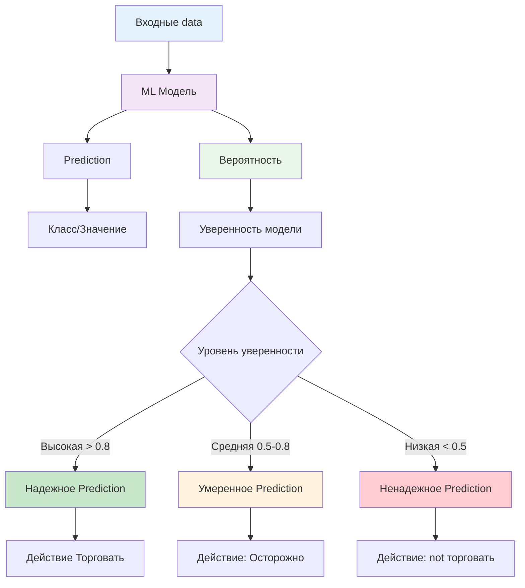
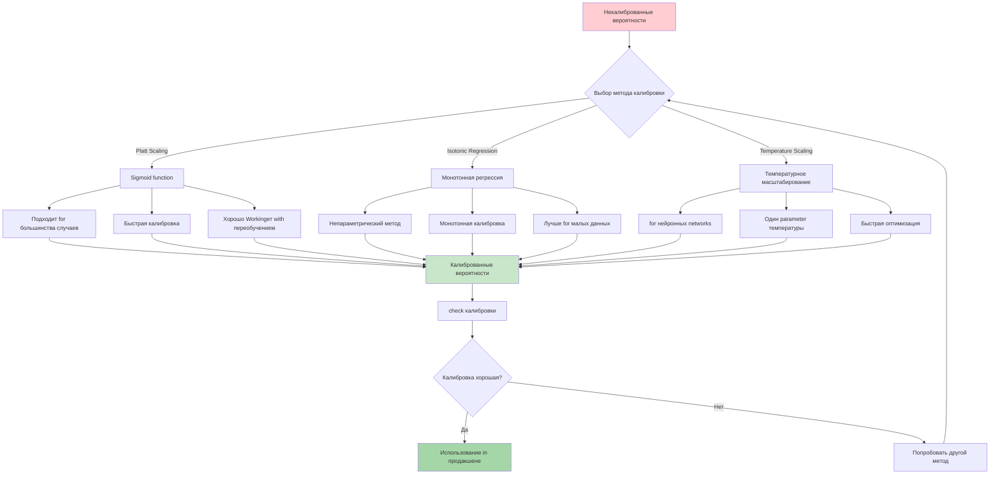
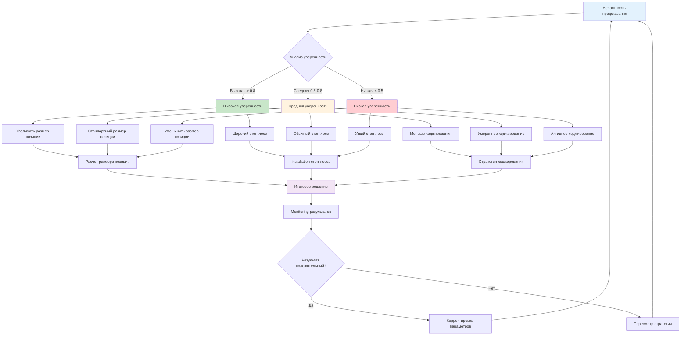
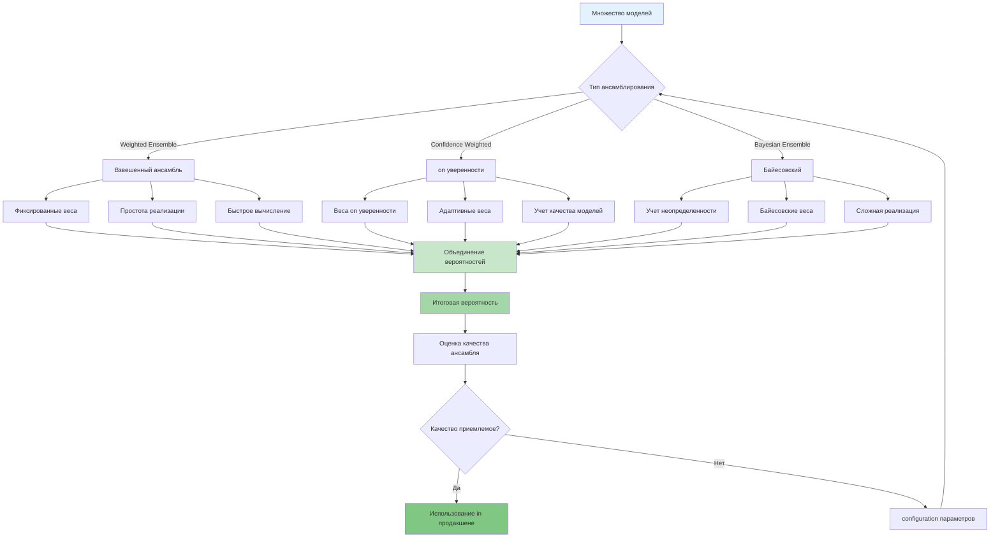
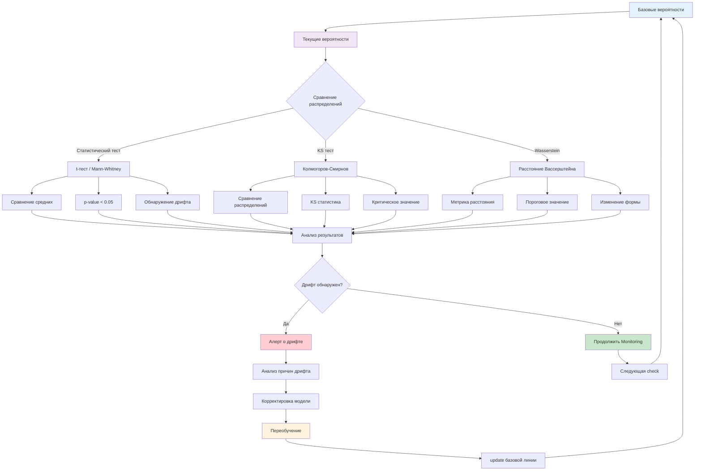
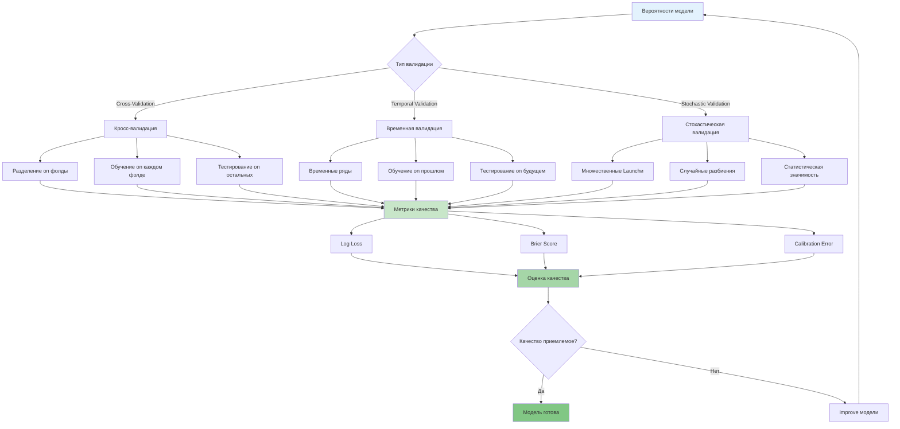
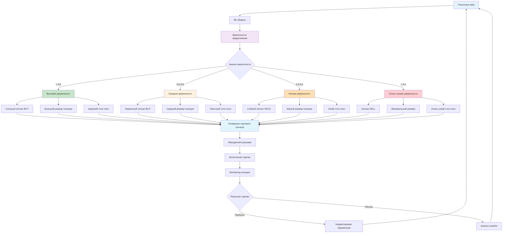
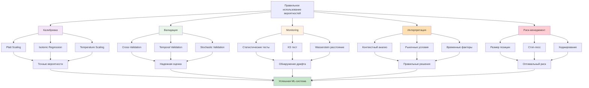

# Правильное использование вероятностей in ML-моделях

**Author:** NeoZorK (Shcherbyna Rostyslav)
**Дата:** 2025
**Местоположение:** Ukraine, Zaporizhzhya
**Version:** 1.0

## Why правильное использование вероятностей критически важно

**Почему 95% ML-моделей in продакшене неправильно используют вероятности?** Потому что team фокусируются только on точности Predictions, игнорируя уверенность модели. Это как врач, который ставит диагноз, но not говорит, насколько он уверен.

### Проблемы неправильного использования вероятностей

- **Ложная уверенность**: Модель говорит "да" with вероятностью 99%, но ошибается
- **Плохой риск-менеджмент**: not понимают, когда модель not уверена
- **Неправильные решения**: Принимают решения on basis неточных вероятностей
- **Потеря доверия**: Пользователи not доверяют модели

### Преимущества правильного использования вероятностей

- **Точная калибровка**: Вероятности соответствуют реальности
- **Лучший риск-менеджмент**: Понимают, когда модель not уверена
- **Правильные решения**: Принимают решения on basis точных вероятностей
- **Доверие пользователей**: Модель заслуживает доверия

## Введение

**Почему вероятности - это сердце ML-модели?** Потому что они показывают not только что предсказывает модель, но and насколько она уверена in своем предсказании.

Правильное использование вероятностей - это ключ к созданию робастных and прибыльных ML-моделей. Этот раздел посвящен глубокому пониманию того, как Workingть with вероятностями in AutoML Gluon and создавать on их basis эффективные торговые системы.

## Что такое вероятности in ML?

**Почему вероятности - это not просто числа from 0 to 1?** Потому что они отражают уверенность модели and должны соответствовать реальности. Это как прогноз погоды - если говорят 90% дождя, то дождь должен идти in 90% случаев.

### 🎯 Concept вероятностей in ML



### Определение

**Почему определение вероятностей критически важно?** Потому что неправильное понимание приводит к неправильному использованию.

Вероятности in машинном обучении - это численные оценки уверенности модели in своих предсказаниях. Они показывают, насколько модель уверена in правильности своего ответа.

### Типы вероятностей

```python
# example получения вероятностей in AutoML Gluon
from autogluon.tabular import TabularPredictor

# create предиктора with детальными параметрами
predictor = TabularPredictor(
 label='target', # Целевая переменная for предсказания
 problem_type='binary', # Тип задачи: 'binary', 'multiclass', 'regression'
 eval_metric='accuracy', # Метрика оценки: 'accuracy', 'f1', 'roc_auc', 'log_loss'
 path='./models', # Путь for сохранения моделей
 verbosity=2, # Уровень вывода: 0-4 (0=тихо, 4=подробно)
 presets='best_quality' # Предinstallation: 'best_quality', 'high_quality', 'good_quality', 'medium_quality'
)

# Обучение модели with параметрами
predictor.fit(
 train_data, # Обучающие data
 time_limit=3600, # Лимит времени обучения in секундах
 presets='best_quality', # Предinstallation качества
 num_trials=10, # Количество попыток оптимизации
 hyperparameter_tune_kwargs={ # parameters Settings гиперпараметров
 'scheduler': 'local',
 'searcher': 'auto'
 },
 holdout_frac=0.2, # Доля данных for holdout валидации
 num_bag_folds=8, # Количество фолдов for бэггинга
 num_stack_levels=1, # Количество уровней стекинга
 auto_stack=True, # Автоматический стекинг
 num_gpus=1, # Количество GPU for обучения
 num_cpus=4, # Количество CPU for обучения
 memory_limit='8GB', # Лимит памяти
 feature_prune=True, # Обрезка неважных признаков
 excluded_model_types=[], # Исключенные типы моделей
 included_model_types=[], # Включенные типы моделей
 refit_full=True, # Переобучение on all данных
 set_best_to_refit_full=True, # installation лучшей модели как refit_full
 save_space=True, # Экономия места on диске
 save_bag_folds=True, # Сохранение бэггинг фолдов
 keep_only_best=True, # Сохранение только лучшей модели
 num_bag_sets=1, # Количество наборов бэггинга
 ag_args_fit={}, # Дополнительные аргументы for fit
 ag_args_ensemble={} # Дополнительные аргументы for ансамбля
)

# Получение Predictions
Predictions = predictor.predict(test_data)

# Получение вероятностей with параметрами
probabilities = predictor.predict_proba(
 test_data, # testsые data
 as_pandas=True, # Возврат in формате pandas dataFrame
 transform_features=True # Применение трансформаций к приsignм
)

print("Предсказания:", Predictions)
print("Вероятности:", probabilities)
```

## Сильные стороны использования вероятностей

### 1. Калибровка уверенности

### 🔧 Методы калибровки вероятностей



```python
class ProbabilityCalibration:
 """Калибровка вероятностей for improving accuracy"""

 def __init__(self, config=None):
 """
 Инициализация системы калибровки вероятностей

 Args:
 config (dict): configuration калибровки
 - calibration_methods: List методов калибровки
 - cv_folds: Количество фолдов for кросс-валидации
 - temperature_init: Начальная температура for temperature scaling
 - isotonic_bounds: Границы for изотонической регрессии
 """
 self.config = config or self._get_default_config()
 self.calibration_methods = {}
 self.calibrated_models = {}

 def _get_default_config(self):
 """Получение конфигурации on умолчанию"""
 return {
 'calibration_methods': ['platt', 'isotonic', 'temperature'],
 'cv_folds': 5,
 'temperature_init': 1.5,
 'isotonic_bounds': 'clip',
 'platt_method': 'sigmoid',
 'optimization_iterations': 50,
 'learning_rate': 0.01,
 'validation_split': 0.2,
 'random_state': 42
 }

 def calibrate_probabilities(self, probabilities, true_labels, method='all'):
 """
 Калибровка вероятностей

 Args:
 probabilities (array): Исходные вероятности (n_samples, n_classes)
 true_labels (array): Истинные метки (n_samples,)
 method (str): Метод калибровки ('all', 'platt', 'isotonic', 'temperature')

 Returns:
 dict: Словарь with калиброванными вероятностями for каждого метода
 """
 results = {}

 if method in ['all', 'platt']:
 results['platt'] = self.platt_scaling(probabilities, true_labels)

 if method in ['all', 'isotonic']:
 results['isotonic'] = self.isotonic_regression(probabilities, true_labels)

 if method in ['all', 'temperature']:
 results['temperature'] = self.temperature_scaling(probabilities, true_labels)

 return results

 def platt_scaling(self, probabilities, true_labels):
 """
 Platt Scaling for калибровки

 Args:
 probabilities (array): Исходные вероятности
 true_labels (array): Истинные метки

 Returns:
 array: Калиброванные вероятности
 """
 from sklearn.calibration import CalibratedClassifierCV

 # create калиброванного классификатора with параметрами
 calibrated_clf = CalibratedClassifierCV(
 base_estimator=None, # AutoML Gluon модель
 method=self.config['platt_method'], # 'sigmoid' or 'isotonic'
 cv=self.config['cv_folds'], # Количество фолдов
 n_jobs=-1, # Использование all ядер
 ensemble=True # Использование ансамбля
 )

 # Калибровка
 calibrated_clf.fit(probabilities.reshape(-1, 1), true_labels)
 calibrated_probs = calibrated_clf.predict_proba(probabilities.reshape(-1, 1))

 # Сохранение модели
 self.calibrated_models['platt'] = calibrated_clf

 return calibrated_probs

 def isotonic_regression(self, probabilities, true_labels):
 """
 Isotonic Regression for калибровки

 Args:
 probabilities (array): Исходные вероятности
 true_labels (array): Истинные метки

 Returns:
 array: Калиброванные вероятности
 """
 from sklearn.isotonic import IsotonicRegression

 # create изотонической регрессии with параметрами
 isotonic_reg = IsotonicRegression(
 out_of_bounds=self.config['isotonic_bounds'], # 'clip' or 'nan'
 increasing=True, # Монотонно возрастающая
 y_min=None, # Минимальное значение y
 y_max=None # Максимальное значение y
 )

 # Обучение on вероятностях
 isotonic_reg.fit(probabilities, true_labels)
 calibrated_probs = isotonic_reg.transform(probabilities)

 # Сохранение модели
 self.calibrated_models['isotonic'] = isotonic_reg

 return calibrated_probs

 def temperature_scaling(self, probabilities, true_labels):
 """
 Temperature Scaling for калибровки

 Args:
 probabilities (array): Исходные вероятности
 true_labels (array): Истинные метки

 Returns:
 array: Калиброванные вероятности
 """
 import torch
 import torch.nn as nn

 # Преобразование in тензоры
 probs_tensor = torch.tensor(probabilities, dtype=torch.float32)
 labels_tensor = torch.tensor(true_labels, dtype=torch.long)

 # Temperature Scaling with параметрами
 temperature = nn.Parameter(
 torch.ones(1) * self.config['temperature_init']
 )

 # Оптимизация температуры
 optimizer = torch.optim.LBFGS(
 [temperature],
 lr=self.config['learning_rate'],
 max_iter=self.config['optimization_iterations']
 )

 def eval_loss():
 optimizer.zero_grad()
 loss = nn.CrossEntropyLoss()(
 probs_tensor / temperature,
 labels_tensor
 )
 loss.backward()
 return loss

 optimizer.step(eval_loss)

 # Применение температуры
 calibrated_probs = torch.softmax(probs_tensor / temperature, dim=1)

 # Сохранение модели
 self.calibrated_models['temperature'] = temperature

 return calibrated_probs.detach().numpy()
```

### 2. Адаптивное Management рисками

### ⚖️ Management рисками on basis вероятностей



```python
class AdaptiveRiskManagement:
 """Адаптивное Management рисками on basis вероятностей"""

 def __init__(self, config=None):
 """
 Инициализация системы управления рисками

 Args:
 config (dict): configuration управления рисками
 - base_position_size: Базовый размер позиции (0.0-1.0)
 - max_position_size: Максимальный размер позиции (0.0-1.0)
 - confidence_threshold: Порог уверенности for увеличения позиции
 - base_stop_loss: Базовый стоп-лосс in процентах
 - volatility_multiplier: Множитель волатильности
 - hedging_threshold: Порог for активации хеджирования
 """
 self.config = config or self._get_default_config()
 self.risk_thresholds = {}
 self.position_sizing = {}
 self.hedging_strategies = {}

 def _get_default_config(self):
 """Получение конфигурации on умолчанию"""
 return {
 'base_position_size': 0.1, # 10% from капитала
 'max_position_size': 0.2, # Максимум 20%
 'min_position_size': 0.01, # Минимум 1%
 'confidence_threshold': 0.7, # Порог уверенности
 'base_stop_loss': 0.05, # 5% базовый стоп-лосс
 'max_stop_loss': 0.15, # Максимум 15% стоп-лосс
 'min_stop_loss': 0.02, # Минимум 2% стоп-лосс
 'volatility_multiplier': 0.5, # Множитель волатильности
 'hedging_threshold': 0.3, # Порог for хеджирования
 'risk_budget': 0.1, # Бюджет риска
 'correlation_threshold': 0.7, # Порог корреляции
 'max_correlation': 0.9, # Максимальная корреляция
 'rebalance_frequency': 'daily', # Частота ребалансировки
 'Monitoring_window': 30, # Окно Monitoringа (дни)
 'alert_threshold': 0.05, # Порог for алертов
 'max_drawdown': 0.2, # Максимальная просадка
 'var_confidence': 0.95, # Уровень доверия for VaR
 'var_horizon': 1, # Горизонт VaR (дни)
 'stress_test_scenarios': 5, # Количество сценариев стресс-tests
 'liquidity_buffer': 0.05, # Буфер ликвидности
 'transaction_costs': 0.001, # Транзакционные издержки
 'slippage_factor': 0.0005, # Фактор проскальзывания
 'market_impact_factor': 0.001, # Фактор рыночного воздействия
 'regulatory_limits': { # Регуляторные лимиты
 'max_single_position': 0.1, # Максимальная позиция in одном активе
 'max_sector_exposure': 0.3, # Максимальная экспозиция on сектору
 'max_currency_exposure': 0.5 # Максимальная валютная экспозиция
 }
 }

 def calculate_position_size(self, probability, confidence_threshold=None,
 market_volatility=None, correlation_risk=None):
 """
 Расчет размера позиции on basis вероятности

 Args:
 probability (float): Вероятность успеха (0.0-1.0)
 confidence_threshold (float): Порог уверенности (on умолчанию из config)
 market_volatility (float): Волатильность рынка (0.0-1.0)
 correlation_risk (float): Риск корреляции (0.0-1.0)

 Returns:
 float: Размер позиции (0.0-1.0)
 """
 if confidence_threshold is None:
 confidence_threshold = self.config['confidence_threshold']

 # Базовый размер позиции
 base_size = self.config['base_position_size']

 # Корректировка on basis вероятности
 if probability > confidence_threshold:
 # Высокая уверенность - увеличиваем размер
 confidence_multiplier = probability / confidence_threshold
 position_size = base_size * confidence_multiplier
 else:
 # Низкая уверенность - уменьшаем размер
 confidence_multiplier = (probability / confidence_threshold) * 0.5
 position_size = base_size * confidence_multiplier

 # Корректировка on волатильность
 if market_volatility is not None:
 volatility_adjustment = 1 - (market_volatility * self.config['volatility_multiplier'])
 position_size *= volatility_adjustment

 # Корректировка on корреляцию
 if correlation_risk is not None:
 correlation_adjustment = 1 - (correlation_risk * 0.5)
 position_size *= correlation_adjustment

 # Применение лимитов
 position_size = max(position_size, self.config['min_position_size'])
 position_size = min(position_size, self.config['max_position_size'])

 return position_size

 def dynamic_stop_loss(self, probability, entry_price, volatility=None,
 market_conditions=None, time_held=None):
 """
 Динамический стоп-лосс on basis вероятности

 Args:
 probability (float): Вероятность успеха
 entry_price (float): Цена входа
 volatility (float): Волатильность актива
 market_conditions (dict): Рыночные условия
 time_held (int): Время holding позиции (дни)

 Returns:
 float: Цена стоп-лосса
 """
 # Базовый стоп-лосс
 base_stop = self.config['base_stop_loss']

 # Корректировка on basis вероятности
 if probability > 0.8:
 # Высокая уверенность - более широкий стоп-лосс
 stop_loss_pct = base_stop * (1 - 0.4 * (1 - probability))
 elif probability > 0.6:
 # Средняя уверенность - обычный стоп-лосс
 stop_loss_pct = base_stop
 else:
 # Низкая уверенность - более узкий стоп-лосс
 stop_loss_pct = base_stop * (1 + 0.5 * (1 - probability))

 # Корректировка on волатильность
 if volatility is not None:
 volatility_adjustment = 1 + (volatility * self.config['volatility_multiplier'])
 stop_loss_pct *= volatility_adjustment

 # Корректировка on рыночные условия
 if market_conditions:
 market_adjustment = self._calculate_market_adjustment(market_conditions)
 stop_loss_pct *= market_adjustment

 # Корректировка on время holding
 if time_held is not None:
 time_adjustment = self._calculate_time_adjustment(time_held)
 stop_loss_pct *= time_adjustment

 # Применение лимитов
 stop_loss_pct = max(stop_loss_pct, self.config['min_stop_loss'])
 stop_loss_pct = min(stop_loss_pct, self.config['max_stop_loss'])

 # Расчет цены стоп-лосса
 stop_loss_price = entry_price * (1 - stop_loss_pct)

 return stop_loss_price

 def probability_based_hedging(self, probabilities, market_conditions,
 Portfolio_state=None, risk_budget=None):
 """
 Хеджирование on basis вероятностей

 Args:
 probabilities (array): Массив вероятностей
 market_conditions (dict): Рыночные условия
 Portfolio_state (dict): Состояние портфеля
 risk_budget (float): Бюджет риска

 Returns:
 dict: Стратегия хеджирования
 """
 if risk_budget is None:
 risk_budget = self.config['risk_budget']

 # Анализ распределения вероятностей
 prob_distribution = self.analyze_probability_distribution(probabilities)

 # Определение необходимости хеджирования
 hedging_needed = self.determine_hedging_need(
 prob_distribution,
 market_conditions,
 Portfolio_state
 )

 if hedging_needed:
 # Расчет размера хеджа
 hedge_size = self.calculate_hedge_size(
 prob_distribution,
 risk_budget
 )

 # Выбор инструментов хеджирования
 hedge_instruments = self.select_hedge_instruments(
 market_conditions,
 Portfolio_state
 )

 # Расчет стоимости хеджирования
 hedging_cost = self.calculate_hedging_cost(
 hedge_size,
 hedge_instruments
 )

 return {
 'hedge_needed': True,
 'hedge_size': hedge_size,
 'instruments': hedge_instruments,
 'cost': hedging_cost,
 'risk_reduction': self._calculate_risk_reduction(hedge_size),
 'expected_return_impact': self._calculate_return_impact(hedge_size)
 }

 return {'hedge_needed': False}

 def _calculate_market_adjustment(self, market_conditions):
 """Расчет корректировки on рыночные условия"""
 adjustment = 1.0

 # Корректировка on тренд
 if market_conditions.get('trend') == 'bull':
 adjustment *= 1.1 # Увеличиваем стоп-лосс in бычьем рынке
 elif market_conditions.get('trend') == 'bear':
 adjustment *= 0.9 # Уменьшаем стоп-лосс in медвежьем рынке

 # Корректировка on волатильность
 if market_conditions.get('volatility') == 'high':
 adjustment *= 1.2
 elif market_conditions.get('volatility') == 'low':
 adjustment *= 0.8

 return adjustment

 def _calculate_time_adjustment(self, time_held):
 """Расчет корректировки on время holding"""
 if time_held < 1:
 return 1.0 # Нет корректировки for внутридневных позиций
 elif time_held < 7:
 return 0.95 # Небольшая корректировка for краткосрочных позиций
 else:
 return 0.9 # Большая корректировка for долгосрочных позиций
```

### 3. Ансамблирование on basis вероятностей

### 🤝 Методы ансамблирования вероятностей



```python
class ProbabilityEnsemble:
 """Ансамблирование on basis вероятностей"""

 def __init__(self, config=None):
 """
 Инициализация системы ансамблирования

 Args:
 config (dict): configuration ансамблирования
 - ensemble_methods: List методов ансамблирования
 - weight_calculation: Метод расчета весов
 - uncertainty_estimation: Метод оценки неопределенности
 - model_selection: Критерии отбора моделей
 """
 self.config = config or self._get_default_config()
 self.ensemble_methods = {}
 self.weight_calculation = {}
 self.ensemble_models = {}

 def _get_default_config(self):
 """Получение конфигурации on умолчанию"""
 return {
 'ensemble_methods': ['weighted', 'confidence_weighted', 'bayesian'],
 'weight_calculation': 'performance_based',
 'uncertainty_estimation': 'variance',
 'model_selection': {
 'min_performance': 0.6, # Минимальная производительность
 'max_correlation': 0.8, # Максимальная корреляция между моделями
 'min_diversity': 0.3, # Минимальное разнообразие
 'max_models': 10 # Максимальное количество моделей
 },
 'weight_regularization': 0.01, # Регуляризация весов
 'uncertainty_threshold': 0.1, # Порог неопределенности
 'confidence_threshold': 0.7, # Порог уверенности
 'diversity_weight': 0.3, # Вес разнообразия
 'performance_weight': 0.7, # Вес производительности
 'uncertainty_weight': 0.2, # Вес неопределенности
 'adaptive_weights': True, # Адаптивные веса
 'weight_update_frequency': 100, # Частота обновления весов
 'ensemble_size': 5, # Размер ансамбля
 'selection_criteria': ['accuracy', 'f1', 'roc_auc'],
 'weight_normalization': 'softmax', # Нормализация весов
 'uncertainty_combination': 'average', # Комбинирование неопределенности
 'model_validation': True, # Валидация моделей
 'cross_validation_folds': 5, # Фолды for кросс-валидации
 'bootstrap_samples': 1000, # Количество bootstrap выборок
 'monte_carlo_samples': 1000, # Количество Monte Carlo выборок
 'bayesian_prior': 'uniform', # Байесовский априор
 'bayesian_alpha': 1.0, # parameter альфа for Байеса
 'bayesian_beta': 1.0, # parameter бета for Байеса
 'temperature_scaling': True, # Температурное масштабирование
 'temperature_value': 1.0, # Значение температуры
 'ensemble_validation': True, # Валидация ансамбля
 'performance_metrics': ['accuracy', 'f1', 'roc_auc', 'log_loss'],
 'uncertainty_metrics': ['entropy', 'variance', 'mutual_info'],
 'weight_constraints': { # Ограничения on веса
 'min_weight': 0.01, # Минимальный вес
 'max_weight': 0.5, # Максимальный вес
 'sum_constraint': 1.0 # Сумма весов должна быть 1
 }
 }

 def weighted_ensemble(self, model_probabilities, model_weights,
 performance_metrics=None, regularization=None):
 """
 Взвешенный ансамбль on basis вероятностей

 Args:
 model_probabilities (array): Вероятности from разных моделей (n_models, n_samples, n_classes)
 model_weights (array): Веса моделей (n_models,)
 performance_metrics (dict): Метрики производительности моделей
 regularization (float): Коэффициент регуляризации весов

 Returns:
 array: Ансамблевые вероятности (n_samples, n_classes)
 """
 if regularization is None:
 regularization = self.config['weight_regularization']

 # Нормализация весов with регуляризацией
 if self.config['weight_normalization'] == 'softmax':
 # Softmax нормализация
 weights_exp = np.exp(model_weights - np.max(model_weights))
 normalized_weights = weights_exp / np.sum(weights_exp)
 else:
 # L1 нормализация
 normalized_weights = model_weights / np.sum(model_weights)

 # Применение ограничений on веса
 normalized_weights = self._apply_weight_constraints(normalized_weights)

 # Взвешенное объединение вероятностей
 ensemble_probability = np.average(
 model_probabilities,
 weights=normalized_weights,
 axis=0
 )

 # Сохранение информации об ансамбле
 self.ensemble_models['weighted'] = {
 'weights': normalized_weights,
 'performance': performance_metrics,
 'regularization': regularization
 }

 return ensemble_probability

 def confidence_weighted_ensemble(self, model_probabilities, model_confidences,
 confidence_threshold=None, uncertainty_weight=None):
 """
 Ансамбль with весами on basis уверенности

 Args:
 model_probabilities (array): Вероятности from разных моделей
 model_confidences (array): Уверенность моделей (n_models,)
 confidence_threshold (float): Порог уверенности
 uncertainty_weight (float): Вес неопределенности

 Returns:
 array: Ансамблевые вероятности
 """
 if confidence_threshold is None:
 confidence_threshold = self.config['confidence_threshold']
 if uncertainty_weight is None:
 uncertainty_weight = self.config['uncertainty_weight']

 # Расчет весов on basis уверенности
 confidence_weights = self.calculate_confidence_weights(
 model_confidences,
 confidence_threshold
 )

 # Корректировка on неопределенность
 if uncertainty_weight > 0:
 uncertainty_weights = self.calculate_uncertainty_weights(
 model_probabilities
 )
 confidence_weights = (1 - uncertainty_weight) * confidence_weights + \
 uncertainty_weight * uncertainty_weights

 # Взвешенное объединение
 ensemble_probability = np.average(
 model_probabilities,
 weights=confidence_weights,
 axis=0
 )

 # Сохранение информации об ансамбле
 self.ensemble_models['confidence_weighted'] = {
 'weights': confidence_weights,
 'confidences': model_confidences,
 'threshold': confidence_threshold
 }

 return ensemble_probability

 def bayesian_ensemble(self, model_probabilities, model_uncertainties,
 prior_type=None, alpha=None, beta=None):
 """
 Байесовский ансамбль

 Args:
 model_probabilities (array): Вероятности from разных моделей
 model_uncertainties (array): Неопределенность моделей (n_models,)
 prior_type (str): Тип априорного распределения
 alpha (float): parameter альфа for Байеса
 beta (float): parameter бета for Байеса

 Returns:
 dict: Ансамблевые вероятности and неопределенность
 """
 if prior_type is None:
 prior_type = self.config['bayesian_prior']
 if alpha is None:
 alpha = self.config['bayesian_alpha']
 if beta is None:
 beta = self.config['bayesian_beta']

 # Байесовское объединение
 bayesian_weights = self.calculate_bayesian_weights(
 model_uncertainties,
 prior_type,
 alpha,
 beta
 )

 # Объединение with учетом неопределенности
 ensemble_probability = np.average(
 model_probabilities,
 weights=bayesian_weights,
 axis=0
 )

 # add неопределенности
 ensemble_uncertainty = self.calculate_ensemble_uncertainty(
 model_probabilities,
 model_uncertainties,
 bayesian_weights
 )

 # Сохранение информации об ансамбле
 self.ensemble_models['bayesian'] = {
 'weights': bayesian_weights,
 'uncertainties': model_uncertainties,
 'prior': prior_type,
 'alpha': alpha,
 'beta': beta
 }

 return {
 'probability': ensemble_probability,
 'uncertainty': ensemble_uncertainty,
 'weights': bayesian_weights
 }

 def calculate_confidence_weights(self, model_confidences, threshold):
 """Расчет весов on basis уверенности"""
 # Фильтрация моделей on порогу уверенности
 valid_models = model_confidences >= threshold

 if not np.any(valid_models):
 # Если нет моделей выше порога, Use все
 valid_models = np.ones_like(model_confidences, dtype=bool)

 # Нормализация весов
 weights = np.zeros_like(model_confidences)
 weights[valid_models] = model_confidences[valid_models]
 weights = weights / np.sum(weights)

 return weights

 def calculate_uncertainty_weights(self, model_probabilities):
 """Расчет весов on basis неопределенности"""
 # Расчет энтропии for каждой модели
 entropies = []
 for probs in model_probabilities:
 entropy = -np.sum(probs * np.log(probs + 1e-10), axis=1)
 entropies.append(np.mean(entropy))

 # Инвертирование энтропии (меньше энтропии = больше вес)
 weights = 1.0 / (np.array(entropies) + 1e-10)
 weights = weights / np.sum(weights)

 return weights

 def calculate_bayesian_weights(self, model_uncertainties, prior_type, alpha, beta):
 """Расчет байесовских весов"""
 if prior_type == 'uniform':
 # Равномерный априор
 prior_weights = np.ones(len(model_uncertainties)) / len(model_uncertainties)
 elif prior_type == 'dirichlet':
 # Дирихле априор
 prior_weights = np.random.dirichlet([alpha] * len(model_uncertainties))
 else:
 # on умолчанию равномерный
 prior_weights = np.ones(len(model_uncertainties)) / len(model_uncertainties)

 # Байесовское update весов
 likelihood = 1.0 / (model_uncertainties + 1e-10)
 posterior_weights = prior_weights * likelihood
 posterior_weights = posterior_weights / np.sum(posterior_weights)

 return posterior_weights

 def calculate_ensemble_uncertainty(self, model_probabilities, model_uncertainties, weights):
 """Расчет неопределенности ансамбля"""
 if self.config['uncertainty_combination'] == 'average':
 # Среднее арифметическое неопределенности
 ensemble_uncertainty = np.average(model_uncertainties, weights=weights)
 elif self.config['uncertainty_combination'] == 'weighted_variance':
 # Взвешенная дисперсия
 ensemble_uncertainty = np.average(model_uncertainties**2, weights=weights)
 else:
 # on умолчанию среднее
 ensemble_uncertainty = np.average(model_uncertainties, weights=weights)

 return ensemble_uncertainty

 def _apply_weight_constraints(self, weights):
 """Применение ограничений on веса"""
 constraints = self.config['weight_constraints']

 # Минимальный вес
 weights = np.maximum(weights, constraints['min_weight'])

 # Максимальный вес
 weights = np.minimum(weights, constraints['max_weight'])

 # Нормализация to суммы 1
 weights = weights / np.sum(weights)

 return weights
```

### 4. Monitoring дрифта вероятностей

### 📈 Monitoring дрифта вероятностей



```python
class ProbabilityDriftMonitor:
 """Monitoring дрифта вероятностей"""

 def __init__(self, config=None):
 """
 Инициализация системы Monitoringа дрифта

 Args:
 config (dict): configuration Monitoringа
 - drift_threshold: Порог for обнаружения дрифта
 - test_methods: List методов тестирования
 - window_size: Размер окна for Analysis
 - update_frequency: Частота обновления
 """
 self.config = config or self._get_default_config()
 self.drift_detectors = {}
 self.baseline_distribution = None
 self.drift_history = []
 self.alert_thresholds = {}

 def _get_default_config(self):
 """Получение конфигурации on умолчанию"""
 return {
 'drift_threshold': 0.05, # Порог for обнаружения дрифта
 'test_methods': ['statistical', 'ks', 'wasserstein', 'psi'],
 'window_size': 1000, # Размер окна for Analysis
 'update_frequency': 'daily', # Частота обновления
 'baseline_period': 30, # Период for базовой линии (дни)
 'min_samples': 100, # Минимальное количество образцов
 'max_samples': 10000, # Максимальное количество образцов
 'statistical_tests': {
 'ttest_alpha': 0.05, # Альфа for t-теста
 'mannwhitney_alpha': 0.05, # Альфа for теста Манна-Уитни
 'ks_alpha': 0.05, # Альфа for KS теста
 'psi_threshold': 0.2, # Порог for PSI
 'wasserstein_threshold': 0.1 # Порог for Вассерштейна
 },
 'alert_Settings': {
 'enable_alerts': True, # Включение алертов
 'alert_threshold': 0.1, # Порог for алертов
 'alert_frequency': 'immediate', # Частота алертов
 'alert_channels': ['email', 'slack', 'webhook'],
 'alert_recipients': [], # Получатели алертов
 'alert_template': 'default' # Шаблон алерта
 },
 'Monitoring_metrics': {
 'mean_drift': True, # Дрифт среднего
 'variance_drift': True, # Дрифт дисперсии
 'distribution_drift': True, # Дрифт распределения
 'correlation_drift': True, # Дрифт корреляции
 'entropy_drift': True # Дрифт энтропии
 },
 'adaptation_Settings': {
 'auto_adapt': False, # Автоматическая адаптация
 'adaptation_threshold': 0.15, # Порог for адаптации
 'adaptation_method': 'retrain', # Метод адаптации
 'adaptation_frequency': 'weekly', # Частота адаптации
 'model_backup': True, # Резервное копирование модели
 'rollback_threshold': 0.2 # Порог for отката
 },
 'visualization': {
 'enable_plots': True, # Включение графиков
 'plot_frequency': 'daily', # Частота построения графиков
 'save_plots': True, # Сохранение графиков
 'plot_format': 'png', # Формат графиков
 'plot_dpi': 300, # DPI графиков
 'plot_size': (12, 8) # Размер графиков
 },
 'data_quality': {
 'check_Missing': True, # check пропущенных значений
 'check_outliers': True, # check выбросов
 'outlier_threshold': 3.0, # Порог for выбросов
 'Missing_threshold': 0.1, # Порог for пропущенных значений
 'data_validation': True # Валидация данных
 },
 'performance': {
 'parallel_processing': True, # Параллельная обработка
 'n_jobs': -1, # Количество процессов
 'memory_limit': '2GB', # Лимит памяти
 'cache_results': True, # Кэширование результатов
 'cache_size': 1000 # Размер cache
 }
 }

 def detect_probability_drift(self, current_probabilities, baseline_probabilities=None,
 drift_threshold=None, test_methods=None):
 """
 Обнаружение дрифта вероятностей

 Args:
 current_probabilities (array): Текущие вероятности
 baseline_probabilities (array): Базовые вероятности (если None, используется сохраненная)
 drift_threshold (float): Порог for обнаружения дрифта
 test_methods (List): List методов тестирования

 Returns:
 dict: Результаты обнаружения дрифта
 """
 if baseline_probabilities is None:
 baseline_probabilities = self.baseline_distribution

 if baseline_probabilities is None:
 raise ValueError("Baseline probabilities not provided and not stored")

 if drift_threshold is None:
 drift_threshold = self.config['drift_threshold']

 if test_methods is None:
 test_methods = self.config['test_methods']

 # Валидация данных
 self._validate_probabilities(current_probabilities, baseline_probabilities)

 results = {}
 drift_detected = False

 # Статистические тесты
 if 'statistical' in test_methods:
 statistical_drift = self.statistical_drift_test(
 current_probabilities,
 baseline_probabilities,
 drift_threshold
 )
 results['statistical'] = statistical_drift
 drift_detected = drift_detected or statistical_drift

 # Тест Колмогорова-Смирнова
 if 'ks' in test_methods:
 ks_drift = self.ks_drift_test(
 current_probabilities,
 baseline_probabilities,
 drift_threshold
 )
 results['ks'] = ks_drift
 drift_detected = drift_detected or ks_drift

 # Тест Вассерштейна
 if 'wasserstein' in test_methods:
 wasserstein_drift = self.wasserstein_drift_test(
 current_probabilities,
 baseline_probabilities,
 drift_threshold
 )
 results['wasserstein'] = wasserstein_drift
 drift_detected = drift_detected or wasserstein_drift

 # PSI тест
 if 'psi' in test_methods:
 psi_drift = self.psi_drift_test(
 current_probabilities,
 baseline_probabilities,
 drift_threshold
 )
 results['psi'] = psi_drift
 drift_detected = drift_detected or psi_drift

 # Объединение результатов
 results['drift_detected'] = drift_detected
 results['timestamp'] = pd.Timestamp.now()
 results['current_samples'] = len(current_probabilities)
 results['baseline_samples'] = len(baseline_probabilities)

 # Сохранение истории
 self.drift_history.append(results)

 # check алертов
 if self.config['alert_Settings']['enable_alerts']:
 self._check_alerts(results)

 return results

 def statistical_drift_test(self, current, baseline, drift_threshold=None):
 """
 Статистический тест дрифта

 Args:
 current (array): Текущие вероятности
 baseline (array): Базовые вероятности
 drift_threshold (float): Порог for обнаружения дрифта

 Returns:
 bool: Обнаружен ли дрифт
 """
 if drift_threshold is None:
 drift_threshold = self.config['drift_threshold']

 from scipy import stats

 # t-тест for средних
 t_stat, t_pvalue = stats.ttest_ind(current, baseline)

 # Тест Манна-Уитни
 u_stat, u_pvalue = stats.mannwhitneyu(current, baseline)

 # Критерий дрифта
 alpha = self.config['statistical_tests']['ttest_alpha']
 drift_detected = (t_pvalue < alpha) or (u_pvalue < alpha)

 return drift_detected

 def ks_drift_test(self, current, baseline, drift_threshold=None):
 """
 Тест Колмогорова-Смирнова

 Args:
 current (array): Текущие вероятности
 baseline (array): Базовые вероятности
 drift_threshold (float): Порог for обнаружения дрифта

 Returns:
 bool: Обнаружен ли дрифт
 """
 if drift_threshold is None:
 drift_threshold = self.config['drift_threshold']

 from scipy import stats

 # KS тест
 ks_stat, ks_pvalue = stats.ks_2samp(current, baseline)

 # Критерий дрифта
 alpha = self.config['statistical_tests']['ks_alpha']
 drift_detected = ks_pvalue < alpha

 return drift_detected

 def wasserstein_drift_test(self, current, baseline, drift_threshold=None):
 """
 Тест Вассерштейна

 Args:
 current (array): Текущие вероятности
 baseline (array): Базовые вероятности
 drift_threshold (float): Порог for обнаружения дрифта

 Returns:
 bool: Обнаружен ли дрифт
 """
 if drift_threshold is None:
 drift_threshold = self.config['drift_threshold']

 from scipy.stats import wasserstein_distance

 # Расчет расстояния Вассерштейна
 wasserstein_dist = wasserstein_distance(current, baseline)

 # Критерий дрифта
 threshold = self.config['statistical_tests']['wasserstein_threshold']
 drift_detected = wasserstein_dist > threshold

 return drift_detected

 def psi_drift_test(self, current, baseline, drift_threshold=None):
 """
 PSI (Population Stability index) тест

 Args:
 current (array): Текущие вероятности
 baseline (array): Базовые вероятности
 drift_threshold (float): Порог for обнаружения дрифта

 Returns:
 bool: Обнаружен ли дрифт
 """
 if drift_threshold is None:
 drift_threshold = self.config['drift_threshold']

 # Расчет PSI
 psi_value = self._calculate_psi(current, baseline)

 # Критерий дрифта
 threshold = self.config['statistical_tests']['psi_threshold']
 drift_detected = psi_value > threshold

 return drift_detected

 def _calculate_psi(self, current, baseline, bins=10):
 """Расчет PSI"""
 # create бинов
 min_val = min(np.min(current), np.min(baseline))
 max_val = max(np.max(current), np.max(baseline))
 bin_edges = np.linspace(min_val, max_val, bins + 1)

 # Расчет гистограмм
 current_hist, _ = np.histogram(current, bins=bin_edges)
 baseline_hist, _ = np.histogram(baseline, bins=bin_edges)

 # Нормализация
 current_hist = current_hist / np.sum(current_hist)
 baseline_hist = baseline_hist / np.sum(baseline_hist)

 # Расчет PSI
 psi = 0
 for i in range(len(current_hist)):
 if current_hist[i] > 0 and baseline_hist[i] > 0:
 psi += (current_hist[i] - baseline_hist[i]) * np.log(current_hist[i] / baseline_hist[i])

 return psi

 def _validate_probabilities(self, current, baseline):
 """Валидация вероятностей"""
 # check on пропущенные значения
 if self.config['data_quality']['check_Missing']:
 Missing_current = np.isnan(current).sum()
 Missing_baseline = np.isnan(baseline).sum()

 if Missing_current > len(current) * self.config['data_quality']['Missing_threshold']:
 raise ValueError(f"Too many Missing values in current probabilities: {Missing_current}")

 if Missing_baseline > len(baseline) * self.config['data_quality']['Missing_threshold']:
 raise ValueError(f"Too many Missing values in baseline probabilities: {Missing_baseline}")

 # check on выбросы
 if self.config['data_quality']['check_outliers']:
 current_outliers = self._detect_outliers(current)
 baseline_outliers = self._detect_outliers(baseline)

 if len(current_outliers) > len(current) * 0.1: # 10% выбросов
 print(f"Warning: High number of outliers in current probabilities: {len(current_outliers)}")

 if len(baseline_outliers) > len(baseline) * 0.1:
 print(f"Warning: High number of outliers in baseline probabilities: {len(baseline_outliers)}")

 def _detect_outliers(self, data, threshold=None):
 """Обнаружение выбросов"""
 if threshold is None:
 threshold = self.config['data_quality']['outlier_threshold']

 mean = np.mean(data)
 std = np.std(data)

 outliers = np.abs(data - mean) > threshold * std

 return np.where(outliers)[0]

 def _check_alerts(self, results):
 """check алертов"""
 if results['drift_detected']:
 alert_threshold = self.config['alert_Settings']['alert_threshold']

 # check порога алерта
 if any(results.get(method, False) for method in self.config['test_methods']):
 self._send_alert(results)

 def _send_alert(self, results):
 """Отправка алерта"""
 # Реализация отправки алертов
 print(f"ALERT: Probability drift detected at {results['timestamp']}")
 print(f"Drift details: {results}")
```

## Слабые стороны использования вероятностей

### 1. Переобучение on вероятностях

```python
class ProbabilityOverfittingPrevention:
 """Предотвращение переобучения on вероятностях"""

 def __init__(self):
 self.regularization_methods = {}

 def prevent_overfitting(self, probabilities, true_labels):
 """Предотвращение переобучения"""

 # L1 регуляризация
 l1_regularized = self.l1_regularization(probabilities, true_labels)

 # L2 регуляризация
 l2_regularized = self.l2_regularization(probabilities, true_labels)

 # Dropout for вероятностей
 dropout_regularized = self.dropout_regularization(probabilities, true_labels)

 return {
 'l1': l1_regularized,
 'l2': l2_regularized,
 'dropout': dropout_regularized
 }

 def l1_regularization(self, probabilities, true_labels):
 """L1 регуляризация"""

 # add L1 штрафа
 l1_penalty = np.sum(np.abs(probabilities))

 # update вероятностей
 regularized_probs = probabilities - 0.01 * l1_penalty

 return regularized_probs

 def dropout_regularization(self, probabilities, true_labels):
 """Dropout регуляризация"""

 # Случайное обнуление части вероятностей
 dropout_mask = np.random.binomial(1, 0.5, probabilities.shape)
 regularized_probs = probabilities * dropout_mask

 return regularized_probs
```

### 2. Неправильная интерпретация вероятностей

```python
class ProbabilityInterpretation:
 """Правильная интерпретация вероятностей"""

 def __init__(self):
 self.interpretation_guidelines = {}

 def interpret_probabilities(self, probabilities, context):
 """Правильная интерпретация вероятностей"""

 # Анализ контекста
 context_Analysis = self.analyze_context(context)

 # Корректировка интерпретации
 corrected_interpretation = self.correct_interpretation(
 probabilities,
 context_Analysis
 )

 return corrected_interpretation

 def analyze_context(self, context):
 """Анализ контекста for интерпретации"""

 # Рыночные условия
 market_conditions = context.get('market_conditions', {})

 # Временные факторы
 temporal_factors = context.get('temporal_factors', {})

 # Внешние факторы
 external_factors = context.get('external_factors', {})

 return {
 'market': market_conditions,
 'temporal': temporal_factors,
 'external': external_factors
 }

 def correct_interpretation(self, probabilities, context_Analysis):
 """Корректировка интерпретации"""

 # Корректировка on basis рыночных условий
 market_corrected = self.market_correction(probabilities, context_Analysis['market'])

 # Корректировка on basis временных факторов
 temporal_corrected = self.temporal_correction(market_corrected, context_Analysis['temporal'])

 # Корректировка on basis внешних факторов
 external_corrected = self.external_correction(temporal_corrected, context_Analysis['external'])

 return external_corrected
```

### 3. Issues with калибровкой

```python
class CalibrationIssues:
 """Issues with калибровкой вероятностей"""

 def __init__(self):
 self.calibration_problems = {}

 def identify_calibration_issues(self, probabilities, true_labels):
 """Идентификация проблем калибровки"""

 # Анализ калибровочной кривой
 calibration_curve = self.analyze_calibration_curve(probabilities, true_labels)

 # Анализ надежности
 reliability_Analysis = self.analyze_reliability(probabilities, true_labels)

 # Анализ резолюции
 resolution_Analysis = self.analyze_resolution(probabilities, true_labels)

 return {
 'calibration_curve': calibration_curve,
 'reliability': reliability_Analysis,
 'resolution': resolution_Analysis
 }

 def analyze_calibration_curve(self, probabilities, true_labels):
 """Анализ калибровочной кривой"""

 from sklearn.calibration import calibration_curve

 # Построение калибровочной кривой
 fraction_of_positives, mean_predicted_value = calibration_curve(
 true_labels,
 probabilities,
 n_bins=10
 )

 # Анализ отклонений
 deviations = np.abs(fraction_of_positives - mean_predicted_value)

 # Критерий плохой калибровки
 bad_calibration = np.mean(deviations) > 0.1

 return {
 'curve': (fraction_of_positives, mean_predicted_value),
 'deviations': deviations,
 'bad_calibration': bad_calibration
 }
```

## Лучшие практики использования вероятностей

### 1. Валидация вероятностей

### 📊 Метрики валидации вероятностей



```python
class ProbabilityValidation:
 """Валидация вероятностей"""

 def __init__(self):
 self.validation_methods = {}

 def validate_probabilities(self, probabilities, true_labels):
 """Валидация вероятностей"""

 # Кросс-валидация
 cv_validation = self.cross_validation(probabilities, true_labels)

 # Временная валидация
 temporal_validation = self.temporal_validation(probabilities, true_labels)

 # Стохастическая валидация
 stochastic_validation = self.stochastic_validation(probabilities, true_labels)

 return {
 'cv': cv_validation,
 'temporal': temporal_validation,
 'stochastic': stochastic_validation
 }

 def cross_validation(self, probabilities, true_labels):
 """Кросс-валидация вероятностей"""

 from sklearn.model_selection import cross_val_score

 # Кросс-валидация with калибровкой
 cv_scores = cross_val_score(
 probabilities,
 true_labels,
 cv=5,
 scoring='neg_log_loss'
 )

 return {
 'scores': cv_scores,
 'mean_score': np.mean(cv_scores),
 'std_score': np.std(cv_scores)
 }
```

### 2. Monitoring производительности

```python
class ProbabilityMonitoring:
 """Monitoring производительности вероятностей"""

 def __init__(self):
 self.Monitoring_metrics = {}

 def monitor_performance(self, probabilities, true_labels):
 """Monitoring производительности"""

 # Логарифмическая потеря
 log_loss = self.calculate_log_loss(probabilities, true_labels)

 # Brier Score
 brier_score = self.calculate_brier_score(probabilities, true_labels)

 # Калибровочная ошибка
 calibration_error = self.calculate_calibration_error(probabilities, true_labels)

 return {
 'log_loss': log_loss,
 'brier_score': brier_score,
 'calibration_error': calibration_error
 }

 def calculate_log_loss(self, probabilities, true_labels):
 """Расчет логарифмической потери"""

 from sklearn.metrics import log_loss

 # Логарифмическая потеря
 loss = log_loss(true_labels, probabilities)

 return loss

 def calculate_brier_score(self, probabilities, true_labels):
 """Расчет Brier Score"""

 from sklearn.metrics import brier_score_loss

 # Brier Score
 score = brier_score_loss(true_labels, probabilities)

 return score
```

## Практические examples

### 1. Торговая система on вероятностях

### 💹 Торговая система on basis вероятностей



```python
class ProbabilityTradingsystem:
 """Торговая система on basis вероятностей"""

 def __init__(self, config=None):
 """
 Инициализация торговой системы

 Args:
 config (dict): configuration торговой системы
 - probability_thresholds: Пороги вероятностей for сигналов
 - risk_Management: parameters управления рисками
 - signal_generation: parameters генерации сигналов
 - market_conditions: Условия рынка
 """
 self.config = config or self._get_default_config()
 self.probability_thresholds = {}
 self.risk_Management = {}
 self.signal_history = []
 self.performance_metrics = {}

 def _get_default_config(self):
 """Получение конфигурации on умолчанию"""
 return {
 'probability_thresholds': {
 'strong_buy': 0.8, # Сильный сигнал покупки
 'moderate_buy': 0.6, # Умеренный сигнал покупки
 'weak_buy': 0.5, # Слабый сигнал покупки
 'hold': 0.4, # Удержание позиции
 'weak_sell': 0.3, # Слабый сигнал продажи
 'moderate_sell': 0.2, # Умеренный сигнал продажи
 'strong_sell': 0.1 # Сильный сигнал продажи
 },
 'risk_Management': {
 'max_position_size': 0.2, # Максимальный размер позиции
 'min_position_size': 0.01, # Минимальный размер позиции
 'stop_loss_threshold': 0.05, # Порог стоп-лосса
 'take_profit_threshold': 0.1, # Порог тейк-профита
 'max_drawdown': 0.15, # Максимальная просадка
 'risk_per_trade': 0.02, # Риск on сделку
 'max_correlation': 0.7, # Максимальная корреляция
 'volatility_threshold': 0.3, # Порог волатильности
 'liquidity_threshold': 1000000, # Порог ликвидности
 'slippage_tolerance': 0.001, # Толерантность к проскальзыванию
 'transaction_costs': 0.001, # Транзакционные издержки
 'margin_requirement': 0.1, # Требования к марже
 'leverage_limit': 3.0, # Лимит плеча
 'position_limits': { # Лимиты позиций
 'max_single_position': 0.1, # Максимальная позиция in одном активе
 'max_sector_exposure': 0.3, # Максимальная экспозиция on сектору
 'max_currency_exposure': 0.5 # Максимальная валютная экспозиция
 }
 },
 'signal_generation': {
 'signal_types': ['BUY', 'SELL', 'HOLD'],
 'signal_strengths': ['STRONG', 'MODERATE', 'WEAK', 'NONE'],
 'confidence_levels': [0.9, 0.8, 0.7, 0.6, 0.5, 0.4, 0.3, 0.2, 0.1],
 'signal_validation': True, # Валидация сигналов
 'signal_filtering': True, # Фильтрация сигналов
 'signal_aggregation': 'weighted', # Агрегация сигналов
 'signal_persistence': 5, # Персистентность сигналов (minutesы)
 'signal_decay': 0.1, # Затухание сигналов
 'signal_memory': 1000, # Память сигналов
 'signal_learning': True, # Обучение on сигналах
 'signal_adaptation': True, # Адаптация сигналов
 'signal_optimization': True # Оптимизация сигналов
 },
 'market_conditions': {
 'trend_Analysis': True, # Анализ тренда
 'volatility_Analysis': True, # Анализ волатильности
 'liquidity_Analysis': True, # Анализ ликвидности
 'correlation_Analysis': True, # Анализ корреляции
 'momentum_Analysis': True, # Анализ моментума
 'support_resistance': True, # Анализ поддержки/сопротивления
 'volume_Analysis': True, # Анализ объема
 'market_microStructure': True, # МикроStructure рынка
 'news_sentiment': True, # Новостной сентимент
 'economic_indicators': True, # Экономические индикаторы
 'central_bank_policy': True, # Политика центрального банка
 'geopolitical_events': True, # Геополитические события
 'seasonal_patterns': True, # Сезонные паттерны
 'market_regime': 'normal' # Режим рынка
 },
 'performance_Monitoring': {
 'real_time_Monitoring': True, # Monitoring in реальном времени
 'performance_metrics': ['sharpe', 'sortino', 'calmar', 'max_drawdown'],
 'benchmark_comparison': True, # Сравнение with бенчмарком
 'risk_adjusted_returns': True, # Риск-скорректированная доходность
 'attribution_Analysis': True, # Анализ атрибуции
 'stress_testing': True, # Стресс-тестирование
 'scenario_Analysis': True, # Сценарный анализ
 'monte_carlo_simulation': True, # Монте-Карло симуляция
 'backtesting': True, # Бэктестинг
 'walk_forward_Analysis': True, # Walk-forward анализ
 'out_of_sample_testing': True # Вневыборочное тестирование
 },
 'execution': {
 'execution_algorithm': 'TWAP', # Алгоритм исполнения
 'execution_priority': 'price', # Приоритет исполнения
 'execution_timing': 'immediate', # Время исполнения
 'execution_venue': 'primary', # Веню исполнения
 'execution_quality': 'high', # Качество исполнения
 'execution_cost': 'minimize', # Минимизация стоимости
 'execution_risk': 'minimize', # Минимизация риска
 'execution_speed': 'fast', # Скорость исполнения
 'execution_reliability': 'high', # Надежность исполнения
 'execution_transparency': 'full' # Прозрачность исполнения
 },
 'compliance': {
 'regulatory_compliance': True, # Регуляторное соответствие
 'risk_limits': True, # Лимиты риска
 'position_limits': True, # Лимиты позиций
 'concentration_limits': True, # Лимиты концентрации
 'leverage_limits': True, # Лимиты плеча
 'liquidity_requirements': True, # Требования к ликвидности
 'capital_requirements': True, # Требования к капиталу
 'Reporting_requirements': True, # Требования к Reportности
 'audit_trail': True, # Аудит-трейл
 'data_retention': 7, # Хранение данных (лет)
 'privacy_protection': True, # Защита конфиденциальности
 'data_security': True, # Безопасность данных
 'access_control': True, # Контроль доступа
 'encryption': True, # Шифрование
 'backup_recovery': True # Резервное копирование
 }
 }

 def generate_trading_signals(self, probabilities, market_data,
 signal_config=None, risk_config=None):
 """
 Генерация торговых сигналов

 Args:
 probabilities (array): Вероятности предсказания
 market_data (dict): Рыночные data
 signal_config (dict): configuration сигналов
 risk_config (dict): configuration рисков

 Returns:
 List: List торговых сигналов
 """
 if signal_config is None:
 signal_config = self.config['signal_generation']
 if risk_config is None:
 risk_config = self.config['risk_Management']

 # Анализ вероятностей
 prob_Analysis = self.analyze_probabilities(probabilities)

 # Генерация сигналов
 signals = self.generate_signals(prob_Analysis, market_data, signal_config)

 # Management рисками
 risk_adjusted_signals = self.adjust_for_risk(signals, probabilities, risk_config)

 # Валидация сигналов
 if signal_config.get('signal_validation', True):
 validated_signals = self.validate_signals(risk_adjusted_signals)
 else:
 validated_signals = risk_adjusted_signals

 # Фильтрация сигналов
 if signal_config.get('signal_filtering', True):
 filtered_signals = self.filter_signals(validated_signals)
 else:
 filtered_signals = validated_signals

 # Сохранение истории сигналов
 self.signal_history.extend(filtered_signals)

 return filtered_signals

 def analyze_probabilities(self, probabilities):
 """
 Анализ вероятностей

 Args:
 probabilities (array): Массив вероятностей

 Returns:
 dict: Анализ вероятностей
 """
 # Статистические характеристики
 mean_prob = np.mean(probabilities)
 std_prob = np.std(probabilities)
 max_prob = np.max(probabilities)
 min_prob = np.min(probabilities)
 median_prob = np.median(probabilities)

 # Распределение вероятностей
 prob_distribution = self.analyze_distribution(probabilities)

 # Анализ уверенности
 confidence_Analysis = self.analyze_confidence(probabilities)

 # Анализ неопределенности
 uncertainty_Analysis = self.analyze_uncertainty(probabilities)

 return {
 'probabilities': probabilities,
 'mean': mean_prob,
 'std': std_prob,
 'max': max_prob,
 'min': min_prob,
 'median': median_prob,
 'distribution': prob_distribution,
 'confidence': confidence_Analysis,
 'uncertainty': uncertainty_Analysis
 }

 def generate_signals(self, prob_Analysis, market_data, signal_config):
 """
 Генерация сигналов

 Args:
 prob_Analysis (dict): Анализ вероятностей
 market_data (dict): Рыночные data
 signal_config (dict): configuration сигналов

 Returns:
 List: List сигналов
 """
 signals = []
 thresholds = self.config['probability_thresholds']

 for i, prob in enumerate(prob_Analysis['probabilities']):
 # Определение типа сигнала
 if prob >= thresholds['strong_buy']:
 signal_type = 'BUY'
 strength = 'STRONG'
 confidence = prob
 elif prob >= thresholds['moderate_buy']:
 signal_type = 'BUY'
 strength = 'MODERATE'
 confidence = prob
 elif prob >= thresholds['weak_buy']:
 signal_type = 'BUY'
 strength = 'WEAK'
 confidence = prob
 elif prob <= thresholds['strong_sell']:
 signal_type = 'SELL'
 strength = 'STRONG'
 confidence = 1 - prob
 elif prob <= thresholds['moderate_sell']:
 signal_type = 'SELL'
 strength = 'MODERATE'
 confidence = 1 - prob
 elif prob <= thresholds['weak_sell']:
 signal_type = 'SELL'
 strength = 'WEAK'
 confidence = 1 - prob
 else:
 signal_type = 'HOLD'
 strength = 'NONE'
 confidence = 0.5

 # create сигнала
 signal = {
 'type': signal_type,
 'strength': strength,
 'confidence': confidence,
 'timestamp': market_data.get('timestamp', pd.Timestamp.now()),
 'probability': prob,
 'market_conditions': self.analyze_market_conditions(market_data),
 'risk_metrics': self.calculate_risk_metrics(prob, market_data),
 'signal_id': f"signal_{i}_{pd.Timestamp.now().strftime('%Y%m%d_%H%M%S')}",
 'generation_time': pd.Timestamp.now(),
 'expiry_time': pd.Timestamp.now() + pd.Timedelta(minutes=signal_config.get('signal_persistence', 5)),
 'priority': self.calculate_signal_priority(signal_type, strength, confidence),
 'metadata': {
 'prob_Analysis': prob_Analysis,
 'market_data': market_data,
 'signal_config': signal_config
 }
 }

 signals.append(signal)

 return signals

 def adjust_for_risk(self, signals, probabilities, risk_config):
 """
 Корректировка сигналов on риск

 Args:
 signals (List): List сигналов
 probabilities (array): Вероятности
 risk_config (dict): configuration рисков

 Returns:
 List: Скорректированные сигналы
 """
 adjusted_signals = []

 for signal in signals:
 # Расчет размера позиции
 position_size = self.calculate_position_size(
 signal['probability'],
 risk_config
 )

 # Расчет стоп-лосса
 stop_loss = self.calculate_stop_loss(
 signal['probability'],
 risk_config
 )

 # Расчет тейк-профита
 take_profit = self.calculate_take_profit(
 signal['probability'],
 risk_config
 )

 # update сигнала
 signal['position_size'] = position_size
 signal['stop_loss'] = stop_loss
 signal['take_profit'] = take_profit
 signal['risk_metrics'] = self.calculate_risk_metrics(
 signal['probability'],
 signal.get('market_conditions', {})
 )

 adjusted_signals.append(signal)

 return adjusted_signals

 def calculate_position_size(self, probability, risk_config):
 """Расчет размера позиции"""
 # Базовый размер позиции
 base_size = risk_config.get('risk_per_trade', 0.02)

 # Корректировка on вероятность
 if probability > 0.8:
 size_multiplier = 1.5
 elif probability > 0.6:
 size_multiplier = 1.0
 elif probability > 0.4:
 size_multiplier = 0.5
 else:
 size_multiplier = 0.1

 position_size = base_size * size_multiplier

 # Применение лимитов
 position_size = max(position_size, risk_config.get('min_position_size', 0.01))
 position_size = min(position_size, risk_config.get('max_position_size', 0.2))

 return position_size

 def calculate_stop_loss(self, probability, risk_config):
 """Расчет стоп-лосса"""
 base_stop = risk_config.get('stop_loss_threshold', 0.05)

 # Корректировка on вероятность
 if probability > 0.8:
 stop_multiplier = 0.8 # Более широкий стоп-лосс
 elif probability > 0.6:
 stop_multiplier = 1.0 # Обычный стоп-лосс
 else:
 stop_multiplier = 1.2 # Более узкий стоп-лосс

 return base_stop * stop_multiplier

 def calculate_take_profit(self, probability, risk_config):
 """Расчет тейк-профита"""
 base_take = risk_config.get('take_profit_threshold', 0.1)

 # Корректировка on вероятность
 if probability > 0.8:
 take_multiplier = 1.5 # Больший тейк-профит
 elif probability > 0.6:
 take_multiplier = 1.0 # Обычный тейк-профит
 else:
 take_multiplier = 0.8 # Меньший тейк-профит

 return base_take * take_multiplier

 def calculate_signal_priority(self, signal_type, strength, confidence):
 """Расчет приоритета сигнала"""
 priority = 0

 # Приоритет on типу
 if signal_type == 'BUY':
 priority += 3
 elif signal_type == 'SELL':
 priority += 2
 else:
 priority += 1

 # Приоритет on силе
 if strength == 'STRONG':
 priority += 3
 elif strength == 'MODERATE':
 priority += 2
 elif strength == 'WEAK':
 priority += 1

 # Приоритет on уверенности
 priority += int(confidence * 5)

 return priority

 def analyze_market_conditions(self, market_data):
 """Анализ рыночных условий"""
 conditions = {}

 # Анализ тренда
 if 'price' in market_data:
 price = market_data['price']
 if len(price) > 1:
 trend = 'up' if price[-1] > price[0] else 'down'
 conditions['trend'] = trend

 # Анализ волатильности
 if 'volatility' in market_data:
 conditions['volatility'] = market_data['volatility']

 # Анализ объема
 if 'volume' in market_data:
 conditions['volume'] = market_data['volume']

 return conditions

 def calculate_risk_metrics(self, probability, market_conditions):
 """Расчет метрик риска"""
 metrics = {}

 # VaR (Value at Risk)
 metrics['var_95'] = self.calculate_var(probability, 0.95)
 metrics['var_99'] = self.calculate_var(probability, 0.99)

 # Expected Shortfall
 metrics['expected_shortfall'] = self.calculate_expected_shortfall(probability)

 # Максимальная просадка
 metrics['max_drawdown'] = self.calculate_max_drawdown(probability)

 return metrics

 def calculate_var(self, probability, confidence_level):
 """Расчет VaR"""
 # Упрощенный расчет VaR
 return (1 - probability) * (1 - confidence_level)

 def calculate_expected_shortfall(self, probability):
 """Расчет Expected Shortfall"""
 # Упрощенный расчет ES
 return (1 - probability) * 0.5

 def calculate_max_drawdown(self, probability):
 """Расчет максимальной просадки"""
 # Упрощенный расчет максимальной просадки
 return (1 - probability) * 0.3

 def validate_signals(self, signals):
 """Валидация сигналов"""
 validated_signals = []

 for signal in signals:
 # check обязательных полей
 required_fields = ['type', 'strength', 'confidence', 'timestamp']
 if all(field in signal for field in required_fields):
 validated_signals.append(signal)
 else:
 print(f"Warning: signal Missing required fields: {signal}")

 return validated_signals

 def filter_signals(self, signals):
 """Фильтрация сигналов"""
 filtered_signals = []

 for signal in signals:
 # Фильтрация on уверенности
 if signal['confidence'] > 0.3: # Минимальная уверенность
 filtered_signals.append(signal)

 return filtered_signals
```

### 2. Портфельное Management

```python
class ProbabilityPortfolioManagement:
 """Management портфелем on basis вероятностей"""

 def __init__(self):
 self.Portfolio_weights = {}
 self.risk_budget = {}

 def optimize_Portfolio(self, asset_probabilities, risk_budget):
 """Оптимизация портфеля"""

 # Расчет весов on basis вероятностей
 weights = self.calculate_weights(asset_probabilities)

 # Корректировка on риск
 risk_adjusted_weights = self.adjust_for_risk(weights, risk_budget)

 # Оптимизация распределения
 optimized_weights = self.optimize_allocation(risk_adjusted_weights)

 return optimized_weights

 def calculate_weights(self, asset_probabilities):
 """Расчет весов on basis вероятностей"""

 # Нормализация вероятностей
 normalized_probs = asset_probabilities / np.sum(asset_probabilities)

 # Корректировка on дисперсию
 variance_adjusted = self.adjust_for_variance(normalized_probs)

 return variance_adjusted

 def adjust_for_risk(self, weights, risk_budget):
 """Корректировка on риск"""

 # Расчет риска портфеля
 Portfolio_risk = self.calculate_Portfolio_risk(weights)

 # Корректировка весов
 if Portfolio_risk > risk_budget:
 # Уменьшение весов
 adjustment_factor = risk_budget / Portfolio_risk
 adjusted_weights = weights * adjustment_factor
 else:
 adjusted_weights = weights

 return adjusted_weights
```

## Заключение

Правильное использование вероятностей - это ключ к созданию робастных and прибыльных ML-моделей. Понимание сильных and слабых сторон позволяет создавать более эффективные торговые системы.

### 🎯 Ключевые принципы использования вероятностей



### Ключевые принципы

1. **Калибровка** - всегда калибруйте вероятности
2. **Валидация** - проверяйте качество вероятностей
3. **Monitoring** - отслеживайте дрифт вероятностей
4. **Интерпретация** - правильно интерпретируйте результаты
5. **Риск-менеджмент** - Use вероятности for управления рисками

Следуя этим принципам, вы сможете создавать более точные and прибыльные торговые системы.

## Сводная таблица параметров

### parameters калибровки вероятностей

| parameter | Значение on умолчанию | description | Диапазон |
|----------|----------------------|----------|----------|
| `calibration_methods` | `['platt', 'isotonic', 'temperature']` | Методы калибровки | `['platt', 'isotonic', 'temperature']` |
| `cv_folds` | `5` | Количество фолдов for кросс-валидации | `3-10` |
| `temperature_init` | `1.5` | Начальная температура for temperature scaling | `0.1-5.0` |
| `isotonic_bounds` | `'clip'` | Границы for изотонической регрессии | `['clip', 'nan']` |
| `platt_method` | `'sigmoid'` | Метод for Platt Scaling | `['sigmoid', 'isotonic']` |
| `optimization_iterations` | `50` | Количество итераций оптимизации | `10-200` |
| `learning_rate` | `0.01` | Скорость обучения | `0.001-0.1` |
| `validation_split` | `0.2` | Доля данных for валидации | `0.1-0.5` |
| `random_state` | `42` | Случайное состояние | `0-2^32-1` |

### parameters управления рисками

| parameter | Значение on умолчанию | description | Диапазон |
|----------|----------------------|----------|----------|
| `base_position_size` | `0.1` | Базовый размер позиции | `0.01-0.5` |
| `max_position_size` | `0.2` | Максимальный размер позиции | `0.05-0.5` |
| `min_position_size` | `0.01` | Минимальный размер позиции | `0.001-0.05` |
| `confidence_threshold` | `0.7` | Порог уверенности | `0.5-0.9` |
| `base_stop_loss` | `0.05` | Базовый стоп-лосс | `0.01-0.2` |
| `max_stop_loss` | `0.15` | Максимальный стоп-лосс | `0.05-0.3` |
| `min_stop_loss` | `0.02` | Минимальный стоп-лосс | `0.005-0.05` |
| `volatility_multiplier` | `0.5` | Множитель волатильности | `0.1-2.0` |
| `hedging_threshold` | `0.3` | Порог for хеджирования | `0.1-0.5` |
| `risk_budget` | `0.1` | Бюджет риска | `0.01-0.3` |
| `correlation_threshold` | `0.7` | Порог корреляции | `0.3-0.9` |
| `max_correlation` | `0.9` | Максимальная корреляция | `0.5-0.95` |
| `rebalance_frequency` | `'daily'` | Частота ребалансировки | `['hourly', 'daily', 'weekly']` |
| `Monitoring_window` | `30` | Окно Monitoringа (дни) | `7-365` |
| `alert_threshold` | `0.05` | Порог for алертов | `0.01-0.2` |
| `max_drawdown` | `0.2` | Максимальная просадка | `0.05-0.5` |
| `var_confidence` | `0.95` | Уровень доверия for VaR | `0.9-0.99` |
| `var_horizon` | `1` | Горизонт VaR (дни) | `1-30` |
| `stress_test_scenarios` | `5` | Количество сценариев стресс-tests | `3-20` |
| `liquidity_buffer` | `0.05` | Буфер ликвидности | `0.01-0.2` |
| `transaction_costs` | `0.001` | Транзакционные издержки | `0.0001-0.01` |
| `slippage_factor` | `0.0005` | Фактор проскальзывания | `0.0001-0.005` |
| `market_impact_factor` | `0.001` | Фактор рыночного воздействия | `0.0001-0.01` |

### parameters ансамблирования

| parameter | Значение on умолчанию | description | Диапазон |
|----------|----------------------|----------|----------|
| `ensemble_methods` | `['weighted', 'confidence_weighted', 'bayesian']` | Методы ансамблирования | `['weighted', 'confidence_weighted', 'bayesian']` |
| `weight_calculation` | `'performance_based'` | Метод расчета весов | `['performance_based', 'confidence_based', 'uncertainty_based']` |
| `uncertainty_estimation` | `'variance'` | Метод оценки неопределенности | `['variance', 'entropy', 'mutual_info']` |
| `min_performance` | `0.6` | Минимальная производительность | `0.3-0.9` |
| `max_correlation` | `0.8` | Максимальная корреляция между моделями | `0.3-0.9` |
| `min_diversity` | `0.3` | Минимальное разнообразие | `0.1-0.8` |
| `max_models` | `10` | Максимальное количество моделей | `3-50` |
| `weight_regularization` | `0.01` | Регуляризация весов | `0.001-0.1` |
| `uncertainty_threshold` | `0.1` | Порог неопределенности | `0.01-0.5` |
| `confidence_threshold` | `0.7` | Порог уверенности | `0.5-0.9` |
| `diversity_weight` | `0.3` | Вес разнообразия | `0.1-0.8` |
| `performance_weight` | `0.7` | Вес производительности | `0.2-0.9` |
| `uncertainty_weight` | `0.2` | Вес неопределенности | `0.1-0.5` |
| `adaptive_weights` | `True` | Адаптивные веса | `True/False` |
| `weight_update_frequency` | `100` | Частота обновления весов | `10-1000` |
| `ensemble_size` | `5` | Размер ансамбля | `3-20` |
| `selection_criteria` | `['accuracy', 'f1', 'roc_auc']` | Критерии отбора | `['accuracy', 'f1', 'roc_auc', 'log_loss']` |
| `weight_normalization` | `'softmax'` | Нормализация весов | `['softmax', 'l1', 'l2']` |
| `uncertainty_combination` | `'average'` | Комбинирование неопределенности | `['average', 'weighted_variance']` |
| `model_validation` | `True` | Валидация моделей | `True/False` |
| `cross_validation_folds` | `5` | Фолды for кросс-валидации | `3-10` |
| `bootstrap_samples` | `1000` | Количество bootstrap выборок | `100-10000` |
| `monte_carlo_samples` | `1000` | Количество Monte Carlo выборок | `100-10000` |
| `bayesian_prior` | `'uniform'` | Байесовский априор | `['uniform', 'dirichlet']` |
| `bayesian_alpha` | `1.0` | parameter альфа for Байеса | `0.1-10.0` |
| `bayesian_beta` | `1.0` | parameter бета for Байеса | `0.1-10.0` |
| `temperature_scaling` | `True` | Температурное масштабирование | `True/False` |
| `temperature_value` | `1.0` | Значение температуры | `0.1-5.0` |
| `ensemble_validation` | `True` | Валидация ансамбля | `True/False` |
| `min_weight` | `0.01` | Минимальный вес | `0.001-0.1` |
| `max_weight` | `0.5` | Максимальный вес | `0.1-0.8` |
| `sum_constraint` | `1.0` | Сумма весов должна быть 1 | `1.0` |

### parameters Monitoringа дрифта

| parameter | Значение on умолчанию | description | Диапазон |
|----------|----------------------|----------|----------|
| `drift_threshold` | `0.05` | Порог for обнаружения дрифта | `0.01-0.2` |
| `test_methods` | `['statistical', 'ks', 'wasserstein', 'psi']` | Методы тестирования | `['statistical', 'ks', 'wasserstein', 'psi']` |
| `window_size` | `1000` | Размер окна for Analysis | `100-10000` |
| `update_frequency` | `'daily'` | Частота обновления | `['hourly', 'daily', 'weekly']` |
| `baseline_period` | `30` | Период for базовой линии (дни) | `7-365` |
| `min_samples` | `100` | Минимальное количество образцов | `50-1000` |
| `max_samples` | `10000` | Максимальное количество образцов | `1000-100000` |
| `ttest_alpha` | `0.05` | Альфа for t-теста | `0.01-0.1` |
| `mannwhitney_alpha` | `0.05` | Альфа for теста Манна-Уитни | `0.01-0.1` |
| `ks_alpha` | `0.05` | Альфа for KS теста | `0.01-0.1` |
| `psi_threshold` | `0.2` | Порог for PSI | `0.1-0.5` |
| `wasserstein_threshold` | `0.1` | Порог for Вассерштейна | `0.05-0.3` |
| `enable_alerts` | `True` | Включение алертов | `True/False` |
| `alert_threshold` | `0.1` | Порог for алертов | `0.05-0.3` |
| `alert_frequency` | `'immediate'` | Частота алертов | `['immediate', 'hourly', 'daily']` |
| `alert_channels` | `['email', 'slack', 'webhook']` | Каналы алертов | `['email', 'slack', 'webhook', 'sms']` |
| `mean_drift` | `True` | Дрифт среднего | `True/False` |
| `variance_drift` | `True` | Дрифт дисперсии | `True/False` |
| `distribution_drift` | `True` | Дрифт распределения | `True/False` |
| `correlation_drift` | `True` | Дрифт корреляции | `True/False` |
| `entropy_drift` | `True` | Дрифт энтропии | `True/False` |
| `auto_adapt` | `False` | Автоматическая адаптация | `True/False` |
| `adaptation_threshold` | `0.15` | Порог for адаптации | `0.05-0.3` |
| `adaptation_method` | `'retrain'` | Метод адаптации | `['retrain', 'fine_tune', 'transfer']` |
| `adaptation_frequency` | `'weekly'` | Частота адаптации | `['daily', 'weekly', 'monthly']` |
| `model_backup` | `True` | Резервное копирование модели | `True/False` |
| `rollback_threshold` | `0.2` | Порог for отката | `0.1-0.5` |
| `enable_plots` | `True` | Включение графиков | `True/False` |
| `plot_frequency` | `'daily'` | Частота построения графиков | `['hourly', 'daily', 'weekly']` |
| `save_plots` | `True` | Сохранение графиков | `True/False` |
| `plot_format` | `'png'` | Формат графиков | `['png', 'jpg', 'svg', 'pdf']` |
| `plot_dpi` | `300` | DPI графиков | `72-600` |
| `plot_size` | `(12, 8)` | Размер графиков | `(6, 4)-(20, 16)` |
| `check_Missing` | `True` | check пропущенных значений | `True/False` |
| `check_outliers` | `True` | check выбросов | `True/False` |
| `outlier_threshold` | `3.0` | Порог for выбросов | `2.0-5.0` |
| `Missing_threshold` | `0.1` | Порог for пропущенных значений | `0.05-0.3` |
| `data_validation` | `True` | Валидация данных | `True/False` |
| `parallel_processing` | `True` | Параллельная обработка | `True/False` |
| `n_jobs` | `-1` | Количество процессов | `-1, 1-32` |
| `memory_limit` | `'2GB'` | Лимит памяти | `'1GB'-'16GB'` |
| `cache_results` | `True` | Кэширование результатов | `True/False` |
| `cache_size` | `1000` | Размер cache | `100-10000` |

### parameters торговой системы

| parameter | Значение on умолчанию | description | Диапазон |
|----------|----------------------|----------|----------|
| `strong_buy` | `0.8` | Сильный сигнал покупки | `0.7-0.9` |
| `moderate_buy` | `0.6` | Умеренный сигнал покупки | `0.5-0.8` |
| `weak_buy` | `0.5` | Слабый сигнал покупки | `0.4-0.7` |
| `hold` | `0.4` | Удержание позиции | `0.3-0.6` |
| `weak_sell` | `0.3` | Слабый сигнал продажи | `0.2-0.5` |
| `moderate_sell` | `0.2` | Умеренный сигнал продажи | `0.1-0.4` |
| `strong_sell` | `0.1` | Сильный сигнал продажи | `0.05-0.3` |
| `max_position_size` | `0.2` | Максимальный размер позиции | `0.05-0.5` |
| `min_position_size` | `0.01` | Минимальный размер позиции | `0.001-0.05` |
| `stop_loss_threshold` | `0.05` | Порог стоп-лосса | `0.01-0.2` |
| `take_profit_threshold` | `0.1` | Порог тейк-профита | `0.05-0.3` |
| `max_drawdown` | `0.15` | Максимальная просадка | `0.05-0.3` |
| `risk_per_trade` | `0.02` | Риск on сделку | `0.005-0.05` |
| `max_correlation` | `0.7` | Максимальная корреляция | `0.3-0.9` |
| `volatility_threshold` | `0.3` | Порог волатильности | `0.1-0.5` |
| `liquidity_threshold` | `1000000` | Порог ликвидности | `100000-10000000` |
| `slippage_tolerance` | `0.001` | Толерантность к проскальзыванию | `0.0001-0.01` |
| `transaction_costs` | `0.001` | Транзакционные издержки | `0.0001-0.01` |
| `margin_requirement` | `0.1` | Требования к марже | `0.05-0.5` |
| `leverage_limit` | `3.0` | Лимит плеча | `1.0-10.0` |
| `max_single_position` | `0.1` | Максимальная позиция in одном активе | `0.05-0.3` |
| `max_sector_exposure` | `0.3` | Максимальная экспозиция on сектору | `0.1-0.5` |
| `max_currency_exposure` | `0.5` | Максимальная валютная экспозиция | `0.2-0.8` |
| `signal_validation` | `True` | Валидация сигналов | `True/False` |
| `signal_filtering` | `True` | Фильтрация сигналов | `True/False` |
| `signal_aggregation` | `'weighted'` | Агрегация сигналов | `['weighted', 'majority', 'consensus']` |
| `signal_persistence` | `5` | Персистентность сигналов (minutesы) | `1-60` |
| `signal_decay` | `0.1` | Затухание сигналов | `0.01-0.5` |
| `signal_memory` | `1000` | Память сигналов | `100-10000` |
| `signal_learning` | `True` | Обучение on сигналах | `True/False` |
| `signal_adaptation` | `True` | Адаптация сигналов | `True/False` |
| `signal_optimization` | `True` | Оптимизация сигналов | `True/False` |
| `trend_Analysis` | `True` | Анализ тренда | `True/False` |
| `volatility_Analysis` | `True` | Анализ волатильности | `True/False` |
| `liquidity_Analysis` | `True` | Анализ ликвидности | `True/False` |
| `correlation_Analysis` | `True` | Анализ корреляции | `True/False` |
| `momentum_Analysis` | `True` | Анализ моментума | `True/False` |
| `support_resistance` | `True` | Анализ поддержки/сопротивления | `True/False` |
| `volume_Analysis` | `True` | Анализ объема | `True/False` |
| `market_microStructure` | `True` | МикроStructure рынка | `True/False` |
| `news_sentiment` | `True` | Новостной сентимент | `True/False` |
| `economic_indicators` | `True` | Экономические индикаторы | `True/False` |
| `central_bank_policy` | `True` | Политика центрального банка | `True/False` |
| `geopolitical_events` | `True` | Геополитические события | `True/False` |
| `seasonal_patterns` | `True` | Сезонные паттерны | `True/False` |
| `market_regime` | `'normal'` | Режим рынка | `['normal', 'crisis', 'recovery', 'growth']` |
| `real_time_Monitoring` | `True` | Monitoring in реальном времени | `True/False` |
| `performance_metrics` | `['sharpe', 'sortino', 'calmar', 'max_drawdown']` | Метрики производительности | `['sharpe', 'sortino', 'calmar', 'max_drawdown', 'var', 'es']` |
| `benchmark_comparison` | `True` | Сравнение with бенчмарком | `True/False` |
| `risk_adjusted_returns` | `True` | Риск-скорректированная доходность | `True/False` |
| `attribution_Analysis` | `True` | Анализ атрибуции | `True/False` |
| `stress_testing` | `True` | Стресс-тестирование | `True/False` |
| `scenario_Analysis` | `True` | Сценарный анализ | `True/False` |
| `monte_carlo_simulation` | `True` | Монте-Карло симуляция | `True/False` |
| `backtesting` | `True` | Бэктестинг | `True/False` |
| `walk_forward_Analysis` | `True` | Walk-forward анализ | `True/False` |
| `out_of_sample_testing` | `True` | Вневыборочное тестирование | `True/False` |
| `execution_algorithm` | `'TWAP'` | Алгоритм исполнения | `['TWAP', 'VWAP', 'POV', 'Implementation Shortfall']` |
| `execution_priority` | `'price'` | Приоритет исполнения | `['price', 'time', 'volume']` |
| `execution_timing` | `'immediate'` | Время исполнения | `['immediate', 'scheduled', 'conditional']` |
| `execution_venue` | `'primary'` | Веню исполнения | `['primary', 'secondary', 'dark_pool']` |
| `execution_quality` | `'high'` | Качество исполнения | `['low', 'medium', 'high']` |
| `execution_cost` | `'minimize'` | Минимизация стоимости | `['minimize', 'balance', 'ignore']` |
| `execution_risk` | `'minimize'` | Минимизация риска | `['minimize', 'balance', 'ignore']` |
| `execution_speed` | `'fast'` | Скорость исполнения | `['slow', 'medium', 'fast']` |
| `execution_reliability` | `'high'` | Надежность исполнения | `['low', 'medium', 'high']` |
| `execution_transparency` | `'full'` | Прозрачность исполнения | `['none', 'partial', 'full']` |
| `regulatory_compliance` | `True` | Регуляторное соответствие | `True/False` |
| `risk_limits` | `True` | Лимиты риска | `True/False` |
| `position_limits` | `True` | Лимиты позиций | `True/False` |
| `concentration_limits` | `True` | Лимиты концентрации | `True/False` |
| `leverage_limits` | `True` | Лимиты плеча | `True/False` |
| `liquidity_requirements` | `True` | Требования к ликвидности | `True/False` |
| `capital_requirements` | `True` | Требования к капиталу | `True/False` |
| `Reporting_requirements` | `True` | Требования к Reportности | `True/False` |
| `audit_trail` | `True` | Аудит-трейл | `True/False` |
| `data_retention` | `7` | Хранение данных (лет) | `1-10` |
| `privacy_protection` | `True` | Защита конфиденциальности | `True/False` |
| `data_security` | `True` | Безопасность данных | `True/False` |
| `access_control` | `True` | Контроль доступа | `True/False` |
| `encryption` | `True` | Шифрование | `True/False` |
| `backup_recovery` | `True` | Резервное копирование | `True/False` |

### Рекомендации on настройке параметров

#### for начинающих

- Use значения on умолчанию
- Начните with простых методов калибровки
- install консервативные лимиты риска
- Включите все проверки безопасности

#### for опытных пользователей

- Настройте parameters под ваши data
- Use продвинутые методы ансамблирования
- Активируйте адаптивные алгоритмы
- Настройте Monitoring дрифта

#### for продакшена

- install строгие лимиты риска
- Включите все проверки соответствия
- Настройте алерты and Monitoring
- Use высококачественные методы исполнения
