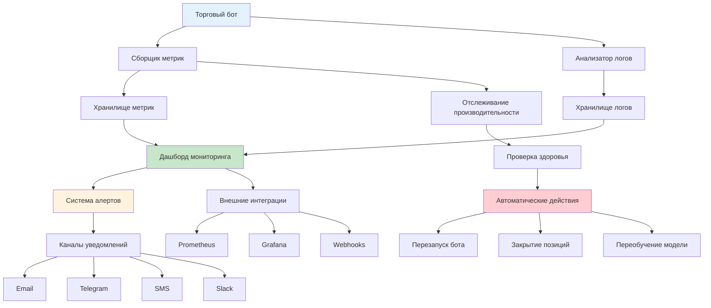
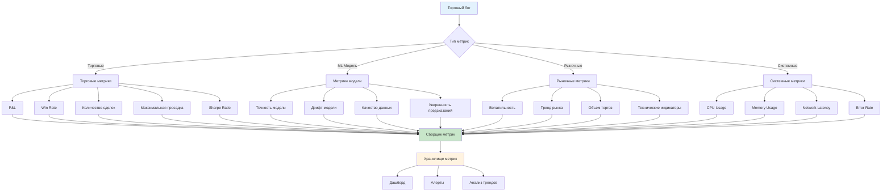
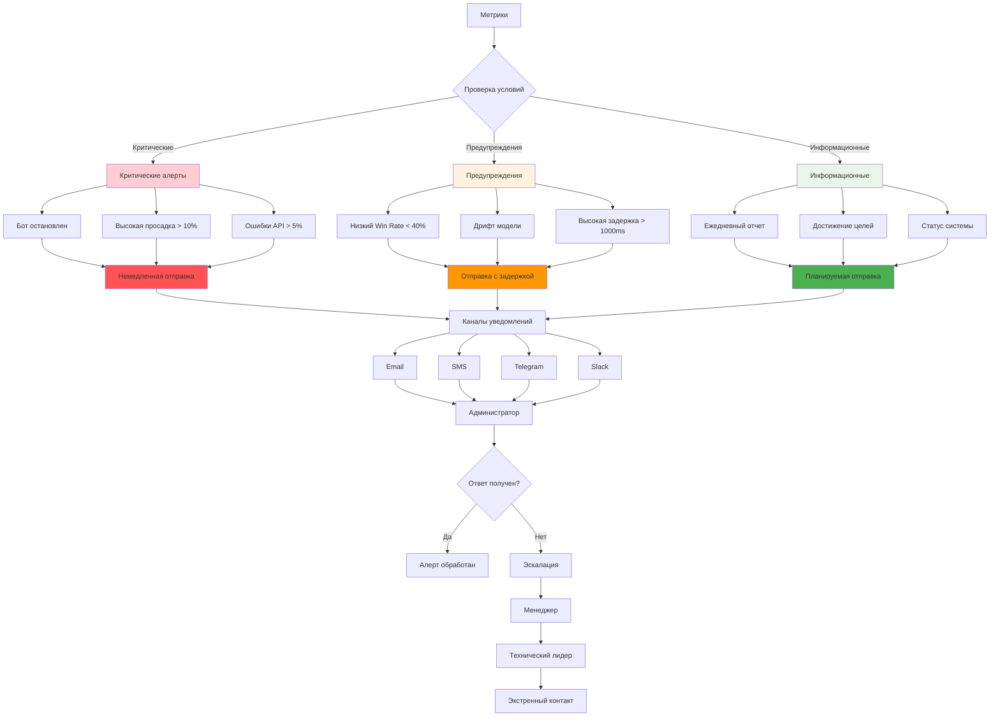
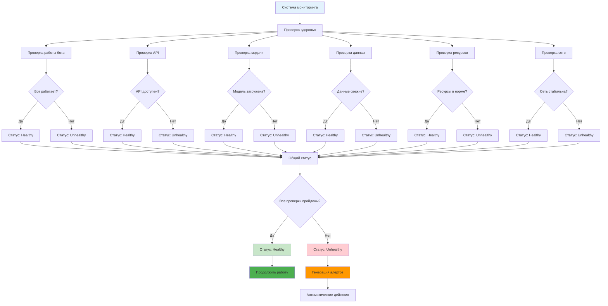
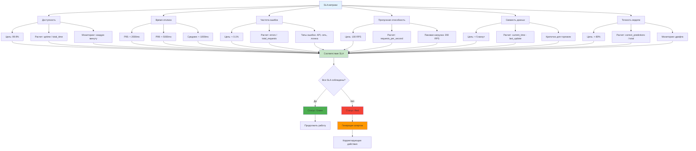
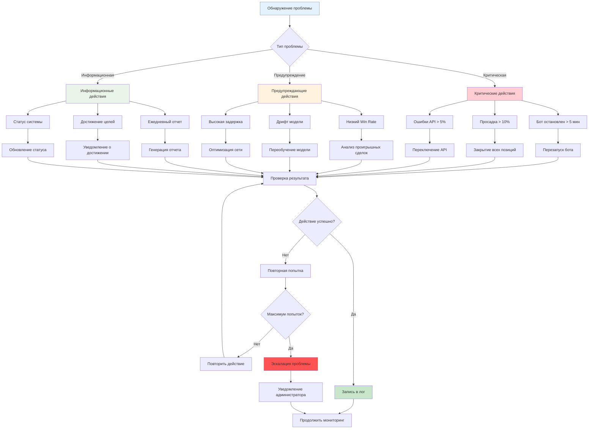
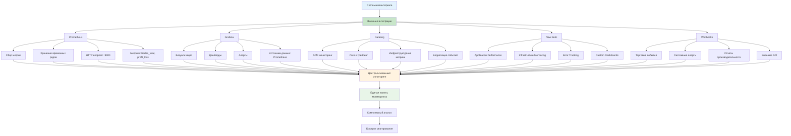

# Мониторинг торгового бота - Лучшие практики

**Автор:** NeoZorK (Shcherbyna Rostyslav)  
**Дата:** 2025  
**Местоположение:** Ukraine, Zaporizhzhya  
**Версия:** 1.0  

## Почему мониторинг торгового бота критически важен

**Почему 90% торговых ботов теряют деньги без правильного мониторинга?** Потому что они работают в слепую, не понимая, что происходит с их системой. Это как вождение автомобиля без приборной панели.

### Проблемы без мониторинга

- **Слепая торговля**: Не знают, что происходит с ботом
- **Позднее обнаружение проблем**: Узнают о проблемах, когда уже поздно
- **Потеря денег**: Бот может торговать против тренда часами
- **Стресс и тревога**: Постоянное беспокойство о работе бота

### Преимущества правильного мониторинга

- **Полный контроль**: Понимают, что происходит с ботом
- **Быстрое обнаружение проблем**: Решают проблемы до потери денег
- **Оптимизация производительности**: Постоянно улучшают работу бота
- **Спокойствие**: Уверены в работе системы

## Введение

**Почему мониторинг - это глаза и уши торгового бота?** Потому что без него вы не знаете, что происходит с вашей системой, и не можете принимать правильные решения.

Мониторинг торгового бота - это критически важный аспект поддержания стабильной и прибыльной торговой системы. Этот раздел посвящен лучшим практикам мониторинга, которые помогут вам быстро выявлять проблемы, оптимизировать производительность и обеспечивать непрерывную работу торгового бота.

## Архитектура системы мониторинга

**Почему архитектура мониторинга критически важна?** Потому что неправильная архитектура может привести к пропуску критических проблем и потере денег.

### 🏗️ Архитектура системы мониторинга



### 1. Компоненты системы мониторинга

**Почему нужны все компоненты мониторинга?** Потому что каждый компонент решает свою задачу, а вместе они создают полную картину работы бота.

```python
class TradingBotMonitoringSystem:
    """Система мониторинга торгового бота - комплексное решение"""
    
    def __init__(self, config=None):
        """
        Инициализация системы мониторинга
        
        Args:
            config (dict): Конфигурация системы мониторинга
                - metrics_interval: Интервал сбора метрик (секунды)
                - alert_channels: Каналы уведомлений
                - dashboard_refresh: Частота обновления дашборда
                - log_rotation: Настройки ротации логов
                - health_check_interval: Интервал проверки здоровья
                - performance_tracking: Настройки отслеживания производительности
        """
        self.config = config or self._get_default_config()
        
        # Сбор метрик - что происходит с ботом
        self.metrics_collector = MetricsCollector(
            collection_interval=self.config['metrics_interval'],
            storage_config=self.config['metrics_storage']
        )
        
        # Управление уведомлениями - когда что-то идет не так
        self.alert_manager = AlertManager(
            channels=self.config['alert_channels'],
            rules_config=self.config['alert_rules']
        )
        
        # Дашборд - визуализация данных
        self.dashboard = MonitoringDashboard(
            refresh_interval=self.config['dashboard_refresh'],
            widgets_config=self.config['dashboard_widgets']
        )
        
        # Анализ логов - поиск проблем
        self.log_analyzer = LogAnalyzer(
            log_patterns=self.config['log_patterns'],
            rotation_config=self.config['log_rotation']
        )
        
        # Отслеживание производительности - как работает бот
        self.performance_tracker = PerformanceTracker(
            tracking_config=self.config['performance_tracking'],
            benchmarks=self.config['performance_benchmarks']
        )
        
        # Проверка здоровья - все ли в порядке
        self.health_checker = HealthChecker(
            check_interval=self.config['health_check_interval'],
            health_rules=self.config['health_rules']
        )
    
    def _get_default_config(self):
        """Получение конфигурации по умолчанию"""
        return {
            'metrics_interval': 60,                    # Интервал сбора метрик (секунды)
            'alert_channels': ['email', 'telegram'],   # Каналы уведомлений
            'dashboard_refresh': 30,                   # Частота обновления дашборда (секунды)
            'log_rotation': {                          # Настройки ротации логов
                'max_size': '100MB',                   # Максимальный размер файла
                'max_files': 10,                       # Максимальное количество файлов
                'rotation_time': 'daily',              # Время ротации
                'compression': True,                   # Сжатие старых логов
                'retention_days': 30                   # Хранение логов (дни)
            },
            'health_check_interval': 300,              # Интервал проверки здоровья (секунды)
            'performance_tracking': {                  # Настройки отслеживания производительности
                'enable_tracking': True,               # Включить отслеживание
                'tracking_interval': 60,               # Интервал отслеживания (секунды)
                'metrics_retention': 7,                # Хранение метрик (дни)
                'benchmark_comparison': True,          # Сравнение с бенчмарками
                'optimization_suggestions': True       # Предложения по оптимизации
            },
            'metrics_storage': {                       # Настройки хранения метрик
                'type': 'influxdb',                    # Тип хранилища
                'host': 'localhost',                   # Хост базы данных
                'port': 8086,                          # Порт базы данных
                'database': 'trading_metrics',         # Имя базы данных
                'username': 'admin',                   # Имя пользователя
                'password': 'password',                # Пароль
                'retention_policy': '30d'              # Политика хранения
            },
            'alert_rules': {                           # Правила алертов
                'critical_thresholds': {               # Критические пороги
                    'bot_down_time': 300,              # Время простоя бота (секунды)
                    'max_drawdown': 0.1,               # Максимальная просадка
                    'error_rate': 0.05,                # Частота ошибок
                    'memory_usage': 0.9,               # Использование памяти
                    'cpu_usage': 0.95                  # Использование CPU
                },
                'warning_thresholds': {                # Предупреждающие пороги
                    'win_rate': 0.4,                   # Процент выигрышных сделок
                    'model_drift': 0.1,                # Дрифт модели
                    'network_latency': 1000,           # Задержка сети (мс)
                    'disk_usage': 0.8,                 # Использование диска
                    'api_response_time': 2000          # Время ответа API (мс)
                },
                'info_thresholds': {                   # Информационные пороги
                    'daily_pnl': 1000,                 # Дневная прибыль
                    'trades_count': 50,                # Количество сделок
                    'uptime_hours': 24                 # Время работы (часы)
                }
            },
            'dashboard_widgets': {                     # Настройки виджетов дашборда
                'overview': {                          # Виджет обзора
                    'enabled': True,                   # Включен
                    'refresh_interval': 30,            # Интервал обновления (секунды)
                    'metrics': ['profit_loss', 'win_rate', 'active_positions', 'uptime']
                },
                'performance': {                       # Виджет производительности
                    'enabled': True,
                    'refresh_interval': 60,
                    'charts': ['pnl_timeline', 'trades_distribution', 'drawdown_chart']
                },
                'risk_metrics': {                      # Виджет метрик риска
                    'enabled': True,
                    'refresh_interval': 60,
                    'metrics': ['max_drawdown', 'sharpe_ratio', 'var_95', 'current_exposure']
                },
                'system_health': {                     # Виджет здоровья системы
                    'enabled': True,
                    'refresh_interval': 30,
                    'metrics': ['cpu_usage', 'memory_usage', 'disk_usage', 'network_latency']
                },
                'model_metrics': {                     # Виджет метрик модели
                    'enabled': True,
                    'refresh_interval': 120,
                    'metrics': ['model_accuracy', 'model_drift', 'data_quality', 'prediction_confidence']
                },
                'market_conditions': {                 # Виджет рыночных условий
                    'enabled': True,
                    'refresh_interval': 60,
                    'metrics': ['volatility', 'trend', 'volume', 'technical_indicators']
                }
            },
            'log_patterns': {                          # Паттерны для анализа логов
                'error_patterns': [                    # Паттерны ошибок
                    r'ERROR: (.+)',
                    r'EXCEPTION: (.+)',
                    r'CRITICAL: (.+)',
                    r'Failed to (.+)',
                    r'Connection error: (.+)',
                    r'API error: (.+)'
                ],
                'performance_patterns': [              # Паттерны производительности
                    r'Slow operation: (.+) took (\d+)ms',
                    r'High memory usage: (\d+)MB',
                    r'CPU spike detected: (\d+)%',
                    r'Network timeout: (.+)',
                    r'Database slow query: (.+)'
                ],
                'trading_patterns': [                  # Паттерны торговли
                    r'Trade executed: (.+)',
                    r'Order placed: (.+)',
                    r'Position opened: (.+)',
                    r'Position closed: (.+)',
                    r'Stop loss triggered: (.+)',
                    r'Take profit triggered: (.+)'
                ]
            },
            'health_rules': {                          # Правила проверки здоровья
                'bot_running': {                       # Проверка работы бота
                    'enabled': True,
                    'max_downtime': 300,               # Максимальное время простоя (секунды)
                    'check_interval': 60               # Интервал проверки (секунды)
                },
                'api_connectivity': {                  # Проверка подключения к API
                    'enabled': True,
                    'max_latency': 1000,               # Максимальная задержка (мс)
                    'max_error_rate': 0.05,            # Максимальная частота ошибок
                    'check_interval': 30               # Интервал проверки (секунды)
                },
                'model_loaded': {                      # Проверка загрузки модели
                    'enabled': True,
                    'min_accuracy': 0.7,               # Минимальная точность
                    'check_interval': 120              # Интервал проверки (секунды)
                },
                'data_freshness': {                    # Проверка свежести данных
                    'enabled': True,
                    'max_age': 300,                    # Максимальный возраст данных (секунды)
                    'check_interval': 60               # Интервал проверки (секунды)
                },
                'resource_usage': {                    # Проверка использования ресурсов
                    'enabled': True,
                    'max_memory_usage': 0.9,           # Максимальное использование памяти
                    'max_cpu_usage': 0.95,             # Максимальное использование CPU
                    'max_disk_usage': 0.8,             # Максимальное использование диска
                    'check_interval': 60               # Интервал проверки (секунды)
                }
            },
            'performance_benchmarks': {                # Бенчмарки производительности
                'trading_benchmarks': {                # Торговые бенчмарки
                    'min_win_rate': 0.5,               # Минимальный процент выигрышных сделок
                    'max_drawdown': 0.1,               # Максимальная просадка
                    'min_sharpe_ratio': 1.0,           # Минимальный коэффициент Шарпа
                    'min_trades_per_day': 5            # Минимальное количество сделок в день
                },
                'system_benchmarks': {                 # Системные бенчмарки
                    'max_response_time': 1000,         # Максимальное время ответа (мс)
                    'max_error_rate': 0.01,            # Максимальная частота ошибок
                    'min_uptime': 0.99,                # Минимальное время работы
                    'max_memory_usage': 0.8            # Максимальное использование памяти
                },
                'model_benchmarks': {                  # Бенчмарки модели
                    'min_accuracy': 0.8,               # Минимальная точность
                    'max_drift': 0.1,                  # Максимальный дрифт
                    'min_confidence': 0.7,             # Минимальная уверенность
                    'max_prediction_time': 100         # Максимальное время предсказания (мс)
                }
            }
        }
    
    def start_monitoring(self):
        """Запуск системы мониторинга"""
        
        try:
            # Инициализация компонентов
            self.metrics_collector.start()
            self.alert_manager.start()
            self.dashboard.start()
            self.log_analyzer.start()
            self.performance_tracker.start()
            self.health_checker.start()
            
            print("✅ Система мониторинга запущена")
            return True
            
        except Exception as e:
            print(f"❌ Ошибка запуска системы мониторинга: {e}")
            return False
    
    def stop_monitoring(self):
        """Остановка системы мониторинга"""
        
        try:
            # Остановка компонентов
            self.metrics_collector.stop()
            self.alert_manager.stop()
            self.dashboard.stop()
            self.log_analyzer.stop()
            self.performance_tracker.stop()
            self.health_checker.stop()
            
            print("⏹️ Система мониторинга остановлена")
            return True
            
        except Exception as e:
            print(f"❌ Ошибка остановки системы мониторинга: {e}")
            return False
    
    def get_monitoring_status(self):
        """Получение статуса мониторинга"""
        
        return {
            'metrics_collector': self.metrics_collector.is_running(),
            'alert_manager': self.alert_manager.is_running(),
            'dashboard': self.dashboard.is_running(),
            'log_analyzer': self.log_analyzer.is_running(),
            'performance_tracker': self.performance_tracker.is_running(),
            'health_checker': self.health_checker.is_running(),
            'overall_status': 'running' if all([
                self.metrics_collector.is_running(),
                self.alert_manager.is_running(),
                self.dashboard.is_running(),
                self.log_analyzer.is_running(),
                self.performance_tracker.is_running(),
                self.health_checker.is_running()
            ]) else 'stopped'
        }
```

### 2. Сбор метрик

### 📊 Процесс сбора метрик



```python
class MetricsCollector:
    """Сборщик метрик торгового бота"""
    
    def __init__(self, collection_interval=60, storage_config=None):
        """
        Инициализация сборщика метрик
        
        Args:
            collection_interval (int): Интервал сбора метрик (секунды)
            storage_config (dict): Конфигурация хранилища метрик
                - type: Тип хранилища (influxdb, prometheus, file)
                - host: Хост базы данных
                - port: Порт базы данных
                - database: Имя базы данных
                - username: Имя пользователя
                - password: Пароль
                - retention_policy: Политика хранения
        """
        self.metrics = {}
        self.collection_interval = collection_interval
        self.storage_config = storage_config or self._get_default_storage_config()
        self.metrics_storage = MetricsStorage(self.storage_config)
        self.collection_thread = None
        self.is_running = False
        
        # Настройки сбора метрик
        self.metrics_config = {
            'trading_metrics': {                         # Торговые метрики
                'enabled': True,                         # Включить сбор
                'collection_interval': 60,               # Интервал сбора (секунды)
                'retention_days': 30,                    # Хранение (дни)
                'metrics': [                             # Собираемые метрики
                    'total_trades', 'winning_trades', 'losing_trades',
                    'win_rate', 'profit_loss', 'max_drawdown', 'sharpe_ratio',
                    'trades_per_hour', 'active_positions', 'pending_orders',
                    'current_exposure', 'risk_utilization', 'var_95', 'expected_shortfall'
                ]
            },
            'model_metrics': {                           # Метрики модели
                'enabled': True,
                'collection_interval': 120,              # Интервал сбора (секунды)
                'retention_days': 7,                     # Хранение (дни)
                'metrics': [
                    'model_accuracy', 'model_precision', 'model_recall', 'model_f1_score',
                    'model_auc', 'prediction_confidence', 'prediction_uncertainty',
                    'model_drift_detected', 'drift_score', 'data_quality_score'
                ]
            },
            'market_metrics': {                          # Рыночные метрики
                'enabled': True,
                'collection_interval': 60,               # Интервал сбора (секунды)
                'retention_days': 14,                    # Хранение (дни)
                'metrics': [
                    'market_volatility', 'market_trend', 'market_regime',
                    'liquidity_score', 'price_change_1h', 'price_change_24h',
                    'volume_24h', 'rsi', 'macd', 'bollinger_position'
                ]
            },
            'system_metrics': {                          # Системные метрики
                'enabled': True,
                'collection_interval': 30,               # Интервал сбора (секунды)
                'retention_days': 7,                     # Хранение (дни)
                'metrics': [
                    'cpu_usage', 'memory_usage', 'disk_usage', 'network_latency',
                    'api_calls_per_minute', 'error_rate', 'uptime'
                ]
            }
        }
    
    def _get_default_storage_config(self):
        """Получение конфигурации хранилища по умолчанию"""
        return {
            'type': 'influxdb',                          # Тип хранилища
            'host': 'localhost',                         # Хост базы данных
            'port': 8086,                               # Порт базы данных
            'database': 'trading_metrics',               # Имя базы данных
            'username': 'admin',                         # Имя пользователя
            'password': 'password',                      # Пароль
            'retention_policy': '30d',                   # Политика хранения
            'batch_size': 1000,                          # Размер батча для записи
            'flush_interval': 5,                         # Интервал сброса (секунды)
            'timeout': 30,                               # Таймаут подключения (секунды)
            'retry_attempts': 3,                         # Количество попыток повтора
            'retry_delay': 1                             # Задержка между попытками (секунды)
        }
    
    def start(self):
        """Запуск сбора метрик"""
        if not self.is_running:
            self.is_running = True
            self.collection_thread = threading.Thread(target=self._collection_loop)
            self.collection_thread.daemon = True
            self.collection_thread.start()
            print("✅ Сборщик метрик запущен")
    
    def stop(self):
        """Остановка сбора метрик"""
        self.is_running = False
        if self.collection_thread:
            self.collection_thread.join()
        print("⏹️ Сборщик метрик остановлен")
    
    def is_running(self):
        """Проверка статуса работы"""
        return self.is_running
    
    def _collection_loop(self):
        """Основной цикл сбора метрик"""
        while self.is_running:
            try:
                # Сбор всех типов метрик
                if self.metrics_config['trading_metrics']['enabled']:
                    trading_metrics = self.collect_trading_metrics()
                    self._store_metrics('trading', trading_metrics)
                
                if self.metrics_config['model_metrics']['enabled']:
                    model_metrics = self.collect_model_metrics()
                    self._store_metrics('model', model_metrics)
                
                if self.metrics_config['market_metrics']['enabled']:
                    market_metrics = self.collect_market_metrics()
                    self._store_metrics('market', market_metrics)
                
                if self.metrics_config['system_metrics']['enabled']:
                    system_metrics = self.collect_system_metrics()
                    self._store_metrics('system', system_metrics)
                
                # Ожидание следующего цикла
                time.sleep(self.collection_interval)
                
            except Exception as e:
                print(f"❌ Ошибка сбора метрик: {e}")
                time.sleep(5)  # Короткая пауза при ошибке
    
    def collect_trading_metrics(self, bot_state=None):
        """Сбор торговых метрик"""
        
        # Получение состояния бота
        if bot_state is None:
            bot_state = self._get_bot_state()
        
        trading_metrics = {
            # Производительность торговли
            'total_trades': bot_state.get('total_trades', 0),                    # Общее количество сделок
            'winning_trades': bot_state.get('winning_trades', 0),                # Количество выигрышных сделок
            'losing_trades': bot_state.get('losing_trades', 0),                  # Количество проигрышных сделок
            'win_rate': self.calculate_win_rate(bot_state),                      # Процент выигрышных сделок
            'profit_loss': bot_state.get('profit_loss', 0),                      # Текущая прибыль/убыток
            'max_drawdown': bot_state.get('max_drawdown', 0),                    # Максимальная просадка
            'sharpe_ratio': self.calculate_sharpe_ratio(bot_state),              # Коэффициент Шарпа
            'sortino_ratio': self.calculate_sortino_ratio(bot_state),            # Коэффициент Сортино
            'calmar_ratio': self.calculate_calmar_ratio(bot_state),              # Коэффициент Калмара
            
            # Торговая активность
            'trades_per_hour': self.calculate_trades_per_hour(bot_state),        # Сделок в час
            'trades_per_day': self.calculate_trades_per_day(bot_state),          # Сделок в день
            'last_trade_time': bot_state.get('last_trade_time'),                 # Время последней сделки
            'active_positions': bot_state.get('active_positions', 0),            # Активные позиции
            'pending_orders': bot_state.get('pending_orders', 0),                # Ожидающие ордера
            'position_size_avg': self.calculate_avg_position_size(bot_state),    # Средний размер позиции
            'position_duration_avg': self.calculate_avg_position_duration(bot_state), # Средняя длительность позиции
            
            # Управление рисками
            'current_exposure': bot_state.get('current_exposure', 0),            # Текущая экспозиция
            'max_exposure': bot_state.get('max_exposure', 0),                    # Максимальная экспозиция
            'risk_utilization': self.calculate_risk_utilization(bot_state),      # Использование риска
            'var_95': self.calculate_var_95(bot_state),                          # Value at Risk 95%
            'var_99': self.calculate_var_99(bot_state),                          # Value at Risk 99%
            'expected_shortfall': self.calculate_expected_shortfall(bot_state),  # Expected Shortfall
            'max_consecutive_losses': self.calculate_max_consecutive_losses(bot_state), # Максимум потерь подряд
            'max_consecutive_wins': self.calculate_max_consecutive_wins(bot_state),     # Максимум побед подряд
            
            # Финансовые метрики
            'total_pnl': bot_state.get('total_pnl', 0),                          # Общая прибыль/убыток
            'daily_pnl': self.calculate_daily_pnl(bot_state),                    # Дневная прибыль/убыток
            'weekly_pnl': self.calculate_weekly_pnl(bot_state),                  # Недельная прибыль/убыток
            'monthly_pnl': self.calculate_monthly_pnl(bot_state),                # Месячная прибыль/убыток
            'profit_factor': self.calculate_profit_factor(bot_state),            # Профит-фактор
            'recovery_factor': self.calculate_recovery_factor(bot_state),        # Фактор восстановления
            'expectancy': self.calculate_expectancy(bot_state),                  # Математическое ожидание
            
            # Технические метрики
            'cpu_usage': bot_state.get('cpu_usage', 0),                          # Использование CPU
            'memory_usage': bot_state.get('memory_usage', 0),                    # Использование памяти
            'disk_usage': bot_state.get('disk_usage', 0),                        # Использование диска
            'network_latency': bot_state.get('network_latency', 0),              # Задержка сети
            'api_calls_per_minute': bot_state.get('api_calls_per_minute', 0),    # API вызовов в минуту
            'error_rate': bot_state.get('error_rate', 0),                        # Частота ошибок
            'response_time_avg': self.calculate_avg_response_time(bot_state),    # Среднее время ответа
            'response_time_p95': self.calculate_p95_response_time(bot_state),    # 95-й перцентиль времени ответа
            
            # Временные метки
            'timestamp': datetime.now().isoformat(),                             # Временная метка
            'uptime': self.calculate_uptime(bot_state),                          # Время работы
            'last_activity': bot_state.get('last_activity'),                     # Последняя активность
            'collection_time': time.time()                                        # Время сбора метрик
        }
        
        return trading_metrics
    
    def collect_model_metrics(self, model_state):
        """Сбор метрик ML-модели"""
        
        model_metrics = {
            # Точность модели
            'model_accuracy': model_state.get('accuracy', 0),
            'model_precision': model_state.get('precision', 0),
            'model_recall': model_state.get('recall', 0),
            'model_f1_score': model_state.get('f1_score', 0),
            'model_auc': model_state.get('auc', 0),
            
            # Прогнозирование
            'prediction_confidence': model_state.get('prediction_confidence', 0),
            'prediction_uncertainty': model_state.get('prediction_uncertainty', 0),
            'last_prediction_time': model_state.get('last_prediction_time'),
            'predictions_per_hour': model_state.get('predictions_per_hour', 0),
            
            # Дрифт модели
            'model_drift_detected': model_state.get('drift_detected', False),
            'drift_score': model_state.get('drift_score', 0),
            'last_retraining': model_state.get('last_retraining'),
            'retraining_frequency': model_state.get('retraining_frequency', 0),
            
            # Качество данных
            'data_quality_score': model_state.get('data_quality_score', 0),
            'missing_data_rate': model_state.get('missing_data_rate', 0),
            'outlier_rate': model_state.get('outlier_rate', 0),
            'data_freshness': model_state.get('data_freshness', 0),
            
            # Временные метки
            'timestamp': datetime.now().isoformat()
        }
        
        return model_metrics
    
    def collect_market_metrics(self, market_data):
        """Сбор рыночных метрик"""
        
        market_metrics = {
            # Рыночные условия
            'market_volatility': market_data.get('volatility', 0),
            'market_trend': market_data.get('trend', 'unknown'),
            'market_regime': market_data.get('regime', 'unknown'),
            'liquidity_score': market_data.get('liquidity_score', 0),
            
            # Ценовые метрики
            'price_change_1h': market_data.get('price_change_1h', 0),
            'price_change_24h': market_data.get('price_change_24h', 0),
            'volume_24h': market_data.get('volume_24h', 0),
            'volume_change_24h': market_data.get('volume_change_24h', 0),
            
            # Технические индикаторы
            'rsi': market_data.get('rsi', 50),
            'macd': market_data.get('macd', 0),
            'bollinger_position': market_data.get('bollinger_position', 0.5),
            'support_resistance_strength': market_data.get('support_resistance_strength', 0),
            
            # Временные метки
            'timestamp': datetime.now().isoformat()
        }
        
        return market_metrics
```

### 3. Система алертов

### 🚨 Система алертов и уведомлений



```python
class AlertManager:
    """Менеджер алертов"""
    
    def __init__(self, channels=None, rules_config=None):
        """
        Инициализация менеджера алертов
        
        Args:
            channels (list): Список каналов уведомлений
            rules_config (dict): Конфигурация правил алертов
                - critical_thresholds: Критические пороги
                - warning_thresholds: Предупреждающие пороги
                - info_thresholds: Информационные пороги
                - escalation_rules: Правила эскалации
                - notification_templates: Шаблоны уведомлений
        """
        self.channels = channels or ['email', 'telegram']
        self.rules_config = rules_config or self._get_default_rules_config()
        self.alert_rules = {}
        self.alert_channels = {}
        self.alert_history = []
        self.alert_cooldown = {}
        self.escalation_queue = []
        self.notification_templates = {}
        
        # Инициализация каналов уведомлений
        self._setup_alert_channels()
        
        # Настройка правил алертов
        self.setup_alert_rules()
    
    def _get_default_rules_config(self):
        """Получение конфигурации правил по умолчанию"""
        return {
            'critical_thresholds': {                     # Критические пороги
                'bot_down_time': 300,                    # Время простоя бота (секунды)
                'max_drawdown': 0.1,                     # Максимальная просадка
                'error_rate': 0.05,                      # Частота ошибок
                'memory_usage': 0.9,                     # Использование памяти
                'cpu_usage': 0.95,                       # Использование CPU
                'api_response_time': 5000,               # Время ответа API (мс)
                'data_freshness': 600,                   # Свежесть данных (секунды)
                'model_accuracy': 0.5,                   # Точность модели
                'network_latency': 2000,                 # Задержка сети (мс)
                'disk_usage': 0.95                       # Использование диска
            },
            'warning_thresholds': {                      # Предупреждающие пороги
                'win_rate': 0.4,                         # Процент выигрышных сделок
                'model_drift': 0.1,                      # Дрифт модели
                'network_latency': 1000,                 # Задержка сети (мс)
                'disk_usage': 0.8,                       # Использование диска
                'api_response_time': 2000,               # Время ответа API (мс)
                'memory_usage': 0.8,                     # Использование памяти
                'cpu_usage': 0.8,                        # Использование CPU
                'trades_per_hour': 0.1,                  # Минимальное количество сделок в час
                'prediction_confidence': 0.6,            # Уверенность предсказаний
                'data_quality_score': 0.7                # Качество данных
            },
            'info_thresholds': {                         # Информационные пороги
                'daily_pnl': 1000,                       # Дневная прибыль
                'trades_count': 50,                      # Количество сделок
                'uptime_hours': 24,                      # Время работы (часы)
                'weekly_pnl': 5000,                      # Недельная прибыль
                'monthly_pnl': 20000,                    # Месячная прибыль
                'sharpe_ratio': 2.0,                     # Коэффициент Шарпа
                'max_consecutive_wins': 10,              # Максимум побед подряд
                'recovery_factor': 2.0                   # Фактор восстановления
            },
            'escalation_rules': {                        # Правила эскалации
                'no_response': {                         # Нет ответа
                    'condition': 'no_response_for_30_minutes',
                    'action': 'escalate_to_manager',
                    'channels': ['phone', 'sms'],
                    'escalation_time': 1800              # Время эскалации (секунды)
                },
                'repeated_alerts': {                     # Повторяющиеся алерты
                    'condition': 'same_alert_3_times_in_1_hour',
                    'action': 'escalate_to_technical_lead',
                    'channels': ['phone', 'email'],
                    'escalation_time': 3600
                },
                'system_down': {                         # Система не работает
                    'condition': 'bot_down_for_10_minutes',
                    'action': 'escalate_to_emergency_contact',
                    'channels': ['phone', 'sms', 'email'],
                    'escalation_time': 600
                },
                'critical_loss': {                       # Критические потери
                    'condition': 'drawdown_exceeds_15_percent',
                    'action': 'escalate_to_risk_manager',
                    'channels': ['phone', 'sms', 'email'],
                    'escalation_time': 300
                }
            },
            'notification_templates': {                  # Шаблоны уведомлений
                'critical': {                            # Критические уведомления
                    'subject': '🚨 КРИТИЧЕСКАЯ ОШИБКА - Торговый бот',
                    'template': '''
🚨 *КРИТИЧЕСКАЯ ОШИБКА*
Торговый бот: {bot_name}
Время: {timestamp}
Проблема: {issue_description}

Метрики:
- P&L: {profit_loss:.2f}
- Win Rate: {win_rate:.2%}
- Активные позиции: {active_positions}
- Время работы: {uptime}

Действия:
{recommended_actions}

Срочно требуется вмешательство!
                    ''',
                    'priority': 'high',
                    'channels': ['email', 'sms', 'telegram', 'slack']
                },
                'warning': {                             # Предупреждения
                    'subject': '⚠️ ПРЕДУПРЕЖДЕНИЕ - Торговый бот',
                    'template': '''
⚠️ *ПРЕДУПРЕЖДЕНИЕ*
Торговый бот: {bot_name}
Время: {timestamp}
Проблема: {issue_description}

Метрики:
- P&L: {profit_loss:.2f}
- Win Rate: {win_rate:.2%}
- Активные позиции: {active_positions}

Рекомендации:
{recommended_actions}

Требуется внимание в течение часа.
                    ''',
                    'priority': 'medium',
                    'channels': ['email', 'telegram']
                },
                'info': {                                # Информационные
                    'subject': '📊 ОТЧЕТ - Торговый бот',
                    'template': '''
📊 *ОТЧЕТ*
Торговый бот: {bot_name}
Время: {timestamp}
Период: {report_period}

Результаты:
- P&L: {profit_loss:.2f}
- Сделки: {total_trades}
- Win Rate: {win_rate:.2%}
- Sharpe Ratio: {sharpe_ratio:.2f}

Статус: {status}
                    ''',
                    'priority': 'low',
                    'channels': ['telegram']
                }
            },
            'channel_configs': {                         # Конфигурации каналов
                'email': {                               # Email
                    'smtp_server': 'smtp.gmail.com',
                    'smtp_port': 587,
                    'username': 'bot@example.com',
                    'password': 'password',
                    'from_email': 'bot@example.com',
                    'to_emails': ['admin@example.com', 'manager@example.com'],
                    'use_tls': True,
                    'timeout': 30
                },
                'telegram': {                            # Telegram
                    'bot_token': 'YOUR_BOT_TOKEN',
                    'chat_ids': ['-1001234567890', '@channel_name'],
                    'parse_mode': 'Markdown',
                    'timeout': 30,
                    'retry_attempts': 3
                },
                'sms': {                                 # SMS
                    'provider': 'twilio',
                    'account_sid': 'YOUR_ACCOUNT_SID',
                    'auth_token': 'YOUR_AUTH_TOKEN',
                    'from_number': '+1234567890',
                    'to_numbers': ['+1234567890', '+0987654321'],
                    'timeout': 30
                },
                'slack': {                               # Slack
                    'webhook_url': 'https://hooks.slack.com/services/...',
                    'channel': '#trading-alerts',
                    'username': 'Trading Bot',
                    'icon_emoji': ':robot_face:',
                    'timeout': 30
                }
            }
        }
    
    def _setup_alert_channels(self):
        """Настройка каналов уведомлений"""
        
        for channel in self.channels:
            if channel == 'email':
                self.alert_channels['email'] = EmailNotifier(
                    config=self.rules_config['channel_configs']['email']
                )
            elif channel == 'telegram':
                self.alert_channels['telegram'] = TelegramNotifier(
                    config=self.rules_config['channel_configs']['telegram']
                )
            elif channel == 'sms':
                self.alert_channels['sms'] = SMSNotifier(
                    config=self.rules_config['channel_configs']['sms']
                )
            elif channel == 'slack':
                self.alert_channels['slack'] = SlackNotifier(
                    config=self.rules_config['channel_configs']['slack']
                )
    
    def setup_alert_rules(self):
        """Настройка правил алертов"""
        
        self.alert_rules = {
            # Критические алерты
            'critical': {
                'bot_down': {
                    'condition': lambda metrics: metrics.get('uptime', 0) == 0,
                    'message_template': 'bot_down',
                    'channels': ['email', 'sms', 'telegram', 'slack'],
                    'cooldown': 300,  # 5 минут
                    'escalation_time': 600,  # 10 минут
                    'auto_actions': ['restart_bot', 'close_positions'],
                    'priority': 'critical'
                },
                'high_drawdown': {
                    'condition': lambda metrics: metrics.get('max_drawdown', 0) > self.rules_config['critical_thresholds']['max_drawdown'],
                    'message_template': 'high_drawdown',
                    'channels': ['email', 'sms', 'telegram'],
                    'cooldown': 600,  # 10 минут
                    'escalation_time': 1200,  # 20 минут
                    'auto_actions': ['reduce_position_sizes', 'close_risky_positions'],
                    'priority': 'critical'
                },
                'api_error_rate': {
                    'condition': lambda metrics: metrics.get('error_rate', 0) > self.rules_config['critical_thresholds']['error_rate'],
                    'message_template': 'api_error_rate',
                    'channels': ['email', 'telegram'],
                    'cooldown': 300,  # 5 минут
                    'escalation_time': 900,  # 15 минут
                    'auto_actions': ['switch_api_endpoint', 'retry_connection'],
                    'priority': 'critical'
                },
                'memory_usage': {
                    'condition': lambda metrics: metrics.get('memory_usage', 0) > self.rules_config['critical_thresholds']['memory_usage'],
                    'message_template': 'high_memory_usage',
                    'channels': ['email', 'telegram'],
                    'cooldown': 300,
                    'escalation_time': 600,
                    'auto_actions': ['restart_bot', 'clear_cache'],
                    'priority': 'critical'
                },
                'cpu_usage': {
                    'condition': lambda metrics: metrics.get('cpu_usage', 0) > self.rules_config['critical_thresholds']['cpu_usage'],
                    'message_template': 'high_cpu_usage',
                    'channels': ['email', 'telegram'],
                    'cooldown': 300,
                    'escalation_time': 600,
                    'auto_actions': ['restart_bot', 'reduce_processing'],
                    'priority': 'critical'
                }
            },
            
            # Предупреждения
            'warning': {
                'low_win_rate': {
                    'condition': lambda metrics: metrics.get('win_rate', 0) < self.rules_config['warning_thresholds']['win_rate'],
                    'message_template': 'low_win_rate',
                    'channels': ['email', 'telegram'],
                    'cooldown': 1800,  # 30 минут
                    'escalation_time': 3600,  # 1 час
                    'auto_actions': ['analyze_losing_trades', 'adjust_strategy'],
                    'priority': 'warning'
                },
                'model_drift': {
                    'condition': lambda metrics: metrics.get('model_drift_detected', False),
                    'message_template': 'model_drift',
                    'channels': ['email', 'telegram'],
                    'cooldown': 3600,  # 1 час
                    'escalation_time': 7200,  # 2 часа
                    'auto_actions': ['retrain_model', 'adjust_parameters'],
                    'priority': 'warning'
                },
                'high_latency': {
                    'condition': lambda metrics: metrics.get('network_latency', 0) > self.rules_config['warning_thresholds']['network_latency'],
                    'message_template': 'high_latency',
                    'channels': ['telegram'],
                    'cooldown': 900,  # 15 минут
                    'escalation_time': 1800,  # 30 минут
                    'auto_actions': ['check_network', 'optimize_connections'],
                    'priority': 'warning'
                },
                'low_trading_activity': {
                    'condition': lambda metrics: metrics.get('trades_per_hour', 0) < self.rules_config['warning_thresholds']['trades_per_hour'],
                    'message_template': 'low_trading_activity',
                    'channels': ['telegram'],
                    'cooldown': 3600,  # 1 час
                    'escalation_time': 7200,  # 2 часа
                    'auto_actions': ['check_market_conditions', 'review_strategy'],
                    'priority': 'warning'
                }
            },
            
            # Информационные
            'info': {
                'daily_summary': {
                    'condition': lambda metrics: self.is_daily_summary_time(),
                    'message_template': 'daily_summary',
                    'channels': ['email', 'telegram'],
                    'cooldown': 86400,  # 24 часа
                    'escalation_time': 0,
                    'auto_actions': ['generate_report'],
                    'priority': 'info'
                },
                'milestone_reached': {
                    'condition': lambda metrics: self.is_milestone_reached(metrics),
                    'message_template': 'milestone_reached',
                    'channels': ['telegram'],
                    'cooldown': 3600,  # 1 час
                    'escalation_time': 0,
                    'auto_actions': ['log_achievement'],
                    'priority': 'info'
                },
                'weekly_summary': {
                    'condition': lambda metrics: self.is_weekly_summary_time(),
                    'message_template': 'weekly_summary',
                    'channels': ['email', 'telegram'],
                    'cooldown': 604800,  # 7 дней
                    'escalation_time': 0,
                    'auto_actions': ['generate_weekly_report'],
                    'priority': 'info'
                }
            }
        }
    
    def check_alerts(self, metrics):
        """Проверка алертов"""
        
        for severity, rules in self.alert_rules.items():
            for rule_name, rule in rules.items():
                try:
                    # Проверка условия
                    if rule['condition'](metrics):
                        # Проверка кулдауна
                        if self.is_cooldown_active(rule_name):
                            continue
                        
                        # Отправка алерта
                        self.send_alert(rule_name, rule, metrics)
                        
                        # Установка кулдауна
                        self.set_cooldown(rule_name, rule['cooldown'])
                        
                except Exception as e:
                    print(f"Ошибка при проверке алерта {rule_name}: {e}")
    
    def send_alert(self, rule_name, rule, metrics):
        """Отправка алерта"""
        
        # Форматирование сообщения
        message = rule['message'].format(**metrics)
        
        # Отправка по каналам
        for channel in rule['channels']:
            try:
                self.send_to_channel(channel, message, metrics)
            except Exception as e:
                print(f"Ошибка отправки в {channel}: {e}")
        
        # Сохранение в историю
        self.alert_history.append({
            'timestamp': datetime.now().isoformat(),
            'rule': rule_name,
            'message': message,
            'metrics': metrics
        })
    
    def send_to_channel(self, channel, message, metrics):
        """Отправка в конкретный канал"""
        
        if channel == 'email':
            self.send_email_alert(message, metrics)
        elif channel == 'sms':
            self.send_sms_alert(message, metrics)
        elif channel == 'telegram':
            self.send_telegram_alert(message, metrics)
        elif channel == 'slack':
            self.send_slack_alert(message, metrics)
    
    def send_telegram_alert(self, message, metrics):
        """Отправка алерта в Telegram"""
        
        import requests
        
        bot_token = os.getenv('TELEGRAM_BOT_TOKEN')
        chat_id = os.getenv('TELEGRAM_CHAT_ID')
        
        if not bot_token or not chat_id:
            return
        
        url = f"https://api.telegram.org/bot{bot_token}/sendMessage"
        
        # Форматирование сообщения для Telegram
        formatted_message = f"🤖 *Торговый Бот*\n\n{message}\n\n"
        formatted_message += f"⏰ Время: {datetime.now().strftime('%Y-%m-%d %H:%M:%S')}\n"
        formatted_message += f"📊 P&L: {metrics.get('profit_loss', 0):.2f}\n"
        formatted_message += f"📈 Сделки: {metrics.get('total_trades', 0)}\n"
        formatted_message += f"🎯 Win Rate: {metrics.get('win_rate', 0):.2%}"
        
        payload = {
            'chat_id': chat_id,
            'text': formatted_message,
            'parse_mode': 'Markdown'
        }
        
        response = requests.post(url, json=payload)
        return response.status_code == 200
```

### 4. Дашборд мониторинга

### 📊 Структура дашборда мониторинга

```mermaid
graph TD
    A[Дашборд мониторинга] --> B[Общий обзор]
    A --> C[Производительность]
    A --> D[Торговая активность]
    A --> E[Метрики риска]
    A --> F[Здоровье системы]
    A --> G[Метрики модели]
    A --> H[Рыночные условия]
    
    B --> B1[P&L]
    B --> B2[Win Rate]
    B --> B3[Активные позиции]
    B --> B4[Время работы]
    B --> B5[Статус]
    
    C --> C1[График P&L]
    C --> C2[Сделки по дням]
    C --> C3[Распределение сделок]
    C --> C4[Тренды производительности]
    
    D --> D1[Количество сделок]
    D --> D2[Частота торговли]
    D --> D3[Время удержания позиций]
    D --> D4[Активность по часам]
    
    E --> E1[Максимальная просадка]
    E --> E2[Sharpe Ratio]
    E --> E3[VaR 95%]
    E --> E4[Текущая экспозиция]
    E --> E5[График просадки]
    
    F --> F1[CPU Usage]
    F --> F2[Memory Usage]
    F --> F3[Disk Usage]
    F --> F4[Network Latency]
    F --> F5[Error Rate]
    F --> F6[Gauge ресурсов]
    
    G --> G1[Точность модели]
    G --> G2[Дрифт модели]
    G --> G3[Качество данных]
    G --> G4[Уверенность предсказаний]
    
    H --> H1[Волатильность]
    H --> H2[Тренд рынка]
    H --> H3[Объем торгов]
    H --> H4[Технические индикаторы]
    
    style A fill:#e3f2fd
    style B fill:#c8e6c9
    style C fill:#fff3e0
    style D fill:#e8f5e8
    style E fill:#ffcdd2
    style F fill:#f3e5f5
    style G fill:#e0f2f1
    style H fill:#fce4ec
```



```python
class MonitoringDashboard:
    """Дашборд мониторинга"""
    
    def __init__(self, refresh_interval=30, widgets_config=None):
        """
        Инициализация дашборда мониторинга
        
        Args:
            refresh_interval (int): Интервал обновления дашборда (секунды)
            widgets_config (dict): Конфигурация виджетов дашборда
                - overview: Настройки виджета обзора
                - performance: Настройки виджета производительности
                - trading_activity: Настройки виджета торговой активности
                - risk_metrics: Настройки виджета метрик риска
                - system_health: Настройки виджета здоровья системы
                - model_metrics: Настройки виджета метрик модели
                - market_conditions: Настройки виджета рыночных условий
        """
        self.refresh_interval = refresh_interval
        self.widgets_config = widgets_config or self._get_default_widgets_config()
        self.dashboard_data = {}
        self.charts = {}
        self.widgets = {}
        self.refresh_thread = None
        self.is_running = False
        
        # Настройки дашборда
        self.dashboard_config = {
            'theme': 'dark',                             # Тема дашборда (dark/light)
            'layout': 'grid',                            # Макет (grid/list)
            'auto_refresh': True,                        # Автообновление
            'refresh_interval': refresh_interval,        # Интервал обновления (секунды)
            'data_retention': 7,                         # Хранение данных (дни)
            'chart_types': {                             # Типы графиков
                'line': {'color': '#3498db', 'width': 2},    # Линейные графики
                'bar': {'color': '#e74c3c', 'width': 1},     # Столбчатые графики
                'pie': {'colors': ['#3498db', '#e74c3c', '#f39c12', '#2ecc71']}, # Круговые графики
                'gauge': {'min': 0, 'max': 100, 'thresholds': [50, 80, 90]}      # Датчики
            },
            'alert_colors': {                            # Цвета алертов
                'critical': '#e74c3c',                   # Критический (красный)
                'warning': '#f39c12',                    # Предупреждение (оранжевый)
                'info': '#3498db',                       # Информация (синий)
                'success': '#2ecc71'                     # Успех (зеленый)
            },
            'widget_sizes': {                            # Размеры виджетов
                'small': {'width': 1, 'height': 1},      # Маленький
                'medium': {'width': 2, 'height': 1},     # Средний
                'large': {'width': 2, 'height': 2},      # Большой
                'xlarge': {'width': 3, 'height': 2}      # Очень большой
            }
        }
    
    def _get_default_widgets_config(self):
        """Получение конфигурации виджетов по умолчанию"""
        return {
            'overview': {                                # Виджет обзора
                'enabled': True,                         # Включен
                'refresh_interval': 30,                  # Интервал обновления (секунды)
                'size': 'large',                         # Размер виджета
                'position': {'x': 0, 'y': 0},           # Позиция на дашборде
                'metrics': [                             # Отображаемые метрики
                    'profit_loss', 'win_rate', 'active_positions', 'uptime',
                    'total_trades', 'sharpe_ratio', 'max_drawdown', 'error_rate'
                ],
                'formatting': {                          # Форматирование
                    'profit_loss': {'type': 'currency', 'symbol': '$', 'decimals': 2},
                    'win_rate': {'type': 'percentage', 'decimals': 1},
                    'uptime': {'type': 'duration', 'format': 'hours'},
                    'total_trades': {'type': 'number', 'separator': ','}
                },
                'alerts': {                              # Настройки алертов
                    'profit_loss': {'threshold': -1000, 'color': 'critical'},
                    'win_rate': {'threshold': 0.4, 'color': 'warning'},
                    'error_rate': {'threshold': 0.05, 'color': 'critical'}
                }
            },
            'performance': {                             # Виджет производительности
                'enabled': True,
                'refresh_interval': 60,
                'size': 'xlarge',
                'position': {'x': 0, 'y': 1},
                'charts': [                              # Графики
                    {
                        'type': 'line',
                        'title': 'P&L во времени',
                        'data_source': 'profit_loss_history',
                        'x_axis': 'timestamp',
                        'y_axis': 'profit_loss',
                        'color': '#3498db',
                        'fill': True,
                        'smooth': True
                    },
                    {
                        'type': 'bar',
                        'title': 'Сделки по дням',
                        'data_source': 'trades_by_day',
                        'x_axis': 'date',
                        'y_axis': 'trade_count',
                        'color': '#e74c3c',
                        'stacked': False
                    },
                    {
                        'type': 'pie',
                        'title': 'Распределение сделок',
                        'data_source': 'trade_distribution',
                        'labels': ['Выигрышные', 'Проигрышные'],
                        'values': ['winning_trades', 'losing_trades'],
                        'colors': ['#2ecc71', '#e74c3c']
                    }
                ],
                'time_range': {                          # Временной диапазон
                    'default': '24h',                    # По умолчанию
                    'options': ['1h', '6h', '24h', '7d', '30d'],
                    'auto_refresh': True
                }
            },
            'trading_activity': {                        # Виджет торговой активности
                'enabled': True,
                'refresh_interval': 60,
                'size': 'medium',
                'position': {'x': 2, 'y': 0},
                'metrics': [
                    'trades_per_hour', 'trades_per_day', 'active_positions',
                    'pending_orders', 'position_size_avg', 'position_duration_avg'
                ],
                'charts': [
                    {
                        'type': 'line',
                        'title': 'Активность по часам',
                        'data_source': 'trades_by_hour',
                        'x_axis': 'hour',
                        'y_axis': 'trade_count',
                        'color': '#f39c12'
                    }
                ],
                'filters': {                             # Фильтры
                    'time_range': True,                  # Временной диапазон
                    'trade_type': True,                  # Тип сделок
                    'symbol': True                       # Символ
                }
            },
            'risk_metrics': {                            # Виджет метрик риска
                'enabled': True,
                'refresh_interval': 60,
                'size': 'large',
                'position': {'x': 2, 'y': 1},
                'metrics': [
                    'max_drawdown', 'sharpe_ratio', 'var_95', 'var_99',
                    'expected_shortfall', 'current_exposure', 'risk_utilization'
                ],
                'charts': [
                    {
                        'type': 'line',
                        'title': 'Просадка во времени',
                        'data_source': 'drawdown_history',
                        'x_axis': 'timestamp',
                        'y_axis': 'drawdown',
                        'color': '#e74c3c',
                        'fill': True,
                        'threshold_line': -0.1
                    },
                    {
                        'type': 'gauge',
                        'title': 'Использование риска',
                        'data_source': 'risk_utilization',
                        'min': 0,
                        'max': 1,
                        'thresholds': [0.5, 0.8, 0.9],
                        'colors': ['#2ecc71', '#f39c12', '#e74c3c']
                    }
                ],
                'alerts': {
                    'max_drawdown': {'threshold': -0.1, 'color': 'critical'},
                    'risk_utilization': {'threshold': 0.8, 'color': 'warning'}
                }
            },
            'system_health': {                           # Виджет здоровья системы
                'enabled': True,
                'refresh_interval': 30,
                'size': 'medium',
                'position': {'x': 0, 'y': 2},
                'metrics': [
                    'cpu_usage', 'memory_usage', 'disk_usage', 'network_latency',
                    'api_calls_per_minute', 'error_rate', 'response_time_avg'
                ],
                'charts': [
                    {
                        'type': 'gauge',
                        'title': 'Использование ресурсов',
                        'data_source': 'resource_usage',
                        'min': 0,
                        'max': 100,
                        'thresholds': [50, 80, 90],
                        'colors': ['#2ecc71', '#f39c12', '#e74c3c']
                    }
                ],
                'alerts': {
                    'cpu_usage': {'threshold': 80, 'color': 'warning'},
                    'memory_usage': {'threshold': 80, 'color': 'warning'},
                    'error_rate': {'threshold': 0.05, 'color': 'critical'}
                }
            },
            'model_metrics': {                           # Виджет метрик модели
                'enabled': True,
                'refresh_interval': 120,
                'size': 'medium',
                'position': {'x': 1, 'y': 2},
                'metrics': [
                    'model_accuracy', 'model_precision', 'model_recall', 'model_f1_score',
                    'model_auc', 'prediction_confidence', 'model_drift_detected', 'drift_score'
                ],
                'charts': [
                    {
                        'type': 'line',
                        'title': 'Точность модели во времени',
                        'data_source': 'accuracy_history',
                        'x_axis': 'timestamp',
                        'y_axis': 'accuracy',
                        'color': '#9b59b6'
                    }
                ],
                'alerts': {
                    'model_accuracy': {'threshold': 0.7, 'color': 'warning'},
                    'drift_score': {'threshold': 0.1, 'color': 'warning'}
                }
            },
            'market_conditions': {                       # Виджет рыночных условий
                'enabled': True,
                'refresh_interval': 60,
                'size': 'medium',
                'position': {'x': 2, 'y': 2},
                'metrics': [
                    'market_volatility', 'market_trend', 'market_regime',
                    'liquidity_score', 'price_change_1h', 'price_change_24h',
                    'volume_24h', 'rsi', 'macd'
                ],
                'charts': [
                    {
                        'type': 'line',
                        'title': 'Волатильность рынка',
                        'data_source': 'volatility_history',
                        'x_axis': 'timestamp',
                        'y_axis': 'volatility',
                        'color': '#e67e22'
                    }
                ]
            }
        }
    
    def start(self):
        """Запуск дашборда"""
        if not self.is_running:
            self.is_running = True
            self.refresh_thread = threading.Thread(target=self._refresh_loop)
            self.refresh_thread.daemon = True
            self.refresh_thread.start()
            print("✅ Дашборд мониторинга запущен")
    
    def stop(self):
        """Остановка дашборда"""
        self.is_running = False
        if self.refresh_thread:
            self.refresh_thread.join()
        print("⏹️ Дашборд мониторинга остановлен")
    
    def is_running(self):
        """Проверка статуса работы"""
        return self.is_running
    
    def _refresh_loop(self):
        """Основной цикл обновления дашборда"""
        while self.is_running:
            try:
                # Обновление данных дашборда
                self.update_dashboard_data()
                
                # Обновление виджетов
                self.update_widgets()
                
                # Ожидание следующего обновления
                time.sleep(self.refresh_interval)
                
            except Exception as e:
                print(f"❌ Ошибка обновления дашборда: {e}")
                time.sleep(5)  # Короткая пауза при ошибке
    
    def create_dashboard(self):
        """Создание дашборда"""
        
        # Основные виджеты
        self.widgets = {
            'overview': self.create_overview_widget(),
            'performance': self.create_performance_widget(),
            'trading_activity': self.create_trading_activity_widget(),
            'risk_metrics': self.create_risk_metrics_widget(),
            'system_health': self.create_system_health_widget(),
            'model_metrics': self.create_model_metrics_widget(),
            'market_conditions': self.create_market_conditions_widget()
        }
        
        return self.widgets
    
    def create_overview_widget(self):
        """Виджет обзора"""
        
        return {
            'type': 'overview',
            'title': 'Общий обзор',
            'metrics': [
                {'name': 'P&L', 'value': 'profit_loss', 'format': 'currency'},
                {'name': 'Win Rate', 'value': 'win_rate', 'format': 'percentage'},
                {'name': 'Активных позиций', 'value': 'active_positions', 'format': 'number'},
                {'name': 'Время работы', 'value': 'uptime', 'format': 'duration'},
                {'name': 'Статус', 'value': 'status', 'format': 'status'}
            ]
        }
    
    def create_performance_widget(self):
        """Виджет производительности"""
        
        return {
            'type': 'performance',
            'title': 'Производительность',
            'charts': [
                {
                    'type': 'line',
                    'title': 'P&L во времени',
                    'data': 'profit_loss_history',
                    'x_axis': 'timestamp',
                    'y_axis': 'profit_loss'
                },
                {
                    'type': 'bar',
                    'title': 'Сделки по дням',
                    'data': 'trades_by_day',
                    'x_axis': 'date',
                    'y_axis': 'trade_count'
                },
                {
                    'type': 'pie',
                    'title': 'Распределение сделок',
                    'data': 'trade_distribution',
                    'labels': ['Выигрышные', 'Проигрышные'],
                    'values': ['winning_trades', 'losing_trades']
                }
            ]
        }
    
    def create_risk_metrics_widget(self):
        """Виджет метрик риска"""
        
        return {
            'type': 'risk_metrics',
            'title': 'Метрики риска',
            'metrics': [
                {'name': 'Максимальная просадка', 'value': 'max_drawdown', 'format': 'percentage'},
                {'name': 'Sharpe Ratio', 'value': 'sharpe_ratio', 'format': 'number'},
                {'name': 'VaR 95%', 'value': 'var_95', 'format': 'currency'},
                {'name': 'Текущая экспозиция', 'value': 'current_exposure', 'format': 'currency'},
                {'name': 'Использование риска', 'value': 'risk_utilization', 'format': 'percentage'}
            ],
            'charts': [
                {
                    'type': 'line',
                    'title': 'Просадка во времени',
                    'data': 'drawdown_history',
                    'x_axis': 'timestamp',
                    'y_axis': 'drawdown'
                }
            ]
        }
    
    def create_system_health_widget(self):
        """Виджет здоровья системы"""
        
        return {
            'type': 'system_health',
            'title': 'Здоровье системы',
            'metrics': [
                {'name': 'CPU', 'value': 'cpu_usage', 'format': 'percentage'},
                {'name': 'Память', 'value': 'memory_usage', 'format': 'percentage'},
                {'name': 'Диск', 'value': 'disk_usage', 'format': 'percentage'},
                {'name': 'Задержка сети', 'value': 'network_latency', 'format': 'duration'},
                {'name': 'Ошибки API', 'value': 'error_rate', 'format': 'percentage'}
            ],
            'charts': [
                {
                    'type': 'gauge',
                    'title': 'Использование ресурсов',
                    'data': 'resource_usage',
                    'max_value': 100
                }
            ]
        }
```

### 5. Анализ логов

```python
class LogAnalyzer:
    """Анализатор логов"""
    
    def __init__(self):
        self.log_patterns = {}
        self.error_patterns = {}
        self.performance_patterns = {}
    
    def analyze_logs(self, log_file):
        """Анализ логов"""
        
        analysis_results = {
            'errors': self.analyze_errors(log_file),
            'performance_issues': self.analyze_performance_issues(log_file),
            'trading_patterns': self.analyze_trading_patterns(log_file),
            'system_issues': self.analyze_system_issues(log_file)
        }
        
        return analysis_results
    
    def analyze_errors(self, log_file):
        """Анализ ошибок"""
        
        error_patterns = [
            r'ERROR: (.+)',
            r'EXCEPTION: (.+)',
            r'CRITICAL: (.+)',
            r'Failed to (.+)',
            r'Connection error: (.+)',
            r'API error: (.+)'
        ]
        
        errors = []
        
        with open(log_file, 'r') as f:
            for line_num, line in enumerate(f, 1):
                for pattern in error_patterns:
                    match = re.search(pattern, line)
                    if match:
                        errors.append({
                            'line': line_num,
                            'error': match.group(1),
                            'timestamp': self.extract_timestamp(line),
                            'severity': self.classify_error_severity(match.group(1))
                        })
        
        return errors
    
    def analyze_performance_issues(self, log_file):
        """Анализ проблем производительности"""
        
        performance_patterns = [
            r'Slow operation: (.+) took (\d+)ms',
            r'High memory usage: (\d+)MB',
            r'CPU spike detected: (\d+)%',
            r'Network timeout: (.+)',
            r'Database slow query: (.+)'
        ]
        
        performance_issues = []
        
        with open(log_file, 'r') as f:
            for line_num, line in enumerate(f, 1):
                for pattern in performance_patterns:
                    match = re.search(pattern, line)
                    if match:
                        performance_issues.append({
                            'line': line_num,
                            'issue': match.group(1),
                            'value': match.group(2) if len(match.groups()) > 1 else None,
                            'timestamp': self.extract_timestamp(line)
                        })
        
        return performance_issues
    
    def analyze_trading_patterns(self, log_file):
        """Анализ торговых паттернов"""
        
        trading_patterns = [
            r'Trade executed: (.+)',
            r'Order placed: (.+)',
            r'Position opened: (.+)',
            r'Position closed: (.+)',
            r'Stop loss triggered: (.+)',
            r'Take profit triggered: (.+)'
        ]
        
        trading_events = []
        
        with open(log_file, 'r') as f:
            for line_num, line in enumerate(f, 1):
                for pattern in trading_patterns:
                    match = re.search(pattern, line)
                    if match:
                        trading_events.append({
                            'line': line_num,
                            'event': match.group(1),
                            'timestamp': self.extract_timestamp(line),
                            'type': self.classify_trading_event(match.group(1))
                        })
        
        return trading_events
```

### 6. Отслеживание производительности

```python
class PerformanceTracker:
    """Отслеживание производительности"""
    
    def __init__(self):
        self.performance_metrics = {}
        self.benchmarks = {}
        self.optimization_suggestions = {}
    
    def track_performance(self, metrics):
        """Отслеживание производительности"""
        
        # Расчет ключевых метрик
        performance_score = self.calculate_performance_score(metrics)
        
        # Сравнение с бенчмарками
        benchmark_comparison = self.compare_with_benchmarks(metrics)
        
        # Генерация предложений по оптимизации
        optimization_suggestions = self.generate_optimization_suggestions(metrics)
        
        return {
            'performance_score': performance_score,
            'benchmark_comparison': benchmark_comparison,
            'optimization_suggestions': optimization_suggestions,
            'timestamp': datetime.now().isoformat()
        }
    
    def calculate_performance_score(self, metrics):
        """Расчет оценки производительности"""
        
        # Веса для различных метрик
        weights = {
            'win_rate': 0.25,
            'sharpe_ratio': 0.20,
            'max_drawdown': 0.15,
            'profit_loss': 0.15,
            'trades_per_hour': 0.10,
            'error_rate': 0.10,
            'uptime': 0.05
        }
        
        # Нормализация метрик
        normalized_metrics = self.normalize_metrics(metrics)
        
        # Расчет взвешенной оценки
        performance_score = sum(
            normalized_metrics[metric] * weight 
            for metric, weight in weights.items()
        )
        
        return performance_score
    
    def generate_optimization_suggestions(self, metrics):
        """Генерация предложений по оптимизации"""
        
        suggestions = []
        
        # Анализ win rate
        if metrics.get('win_rate', 0) < 0.5:
            suggestions.append({
                'category': 'trading_strategy',
                'priority': 'high',
                'suggestion': 'Низкий процент выигрышных сделок. Рассмотрите пересмотр торговой стратегии.',
                'action': 'analyze_losing_trades'
            })
        
        # Анализ просадки
        if metrics.get('max_drawdown', 0) > 0.1:
            suggestions.append({
                'category': 'risk_management',
                'priority': 'high',
                'suggestion': 'Высокая просадка. Улучшите управление рисками.',
                'action': 'reduce_position_sizes'
            })
        
        # Анализ ошибок
        if metrics.get('error_rate', 0) > 0.02:
            suggestions.append({
                'category': 'system_stability',
                'priority': 'medium',
                'suggestion': 'Высокий уровень ошибок. Проверьте стабильность системы.',
                'action': 'review_error_logs'
            })
        
        # Анализ производительности
        if metrics.get('trades_per_hour', 0) < 1:
            suggestions.append({
                'category': 'trading_activity',
                'priority': 'low',
                'suggestion': 'Низкая торговая активность. Проверьте условия входа.',
                'action': 'review_entry_conditions'
            })
        
        return suggestions
```

### 7. Проверка здоровья системы

### 🏥 Проверка здоровья системы



```python
class HealthChecker:
    """Проверка здоровья системы"""
    
    def __init__(self):
        self.health_checks = {}
        self.health_status = {}
    
    def perform_health_checks(self, system_state):
        """Выполнение проверок здоровья"""
        
        health_checks = {
            'bot_running': self.check_bot_running(system_state),
            'api_connectivity': self.check_api_connectivity(system_state),
            'model_loaded': self.check_model_loaded(system_state),
            'data_freshness': self.check_data_freshness(system_state),
            'memory_usage': self.check_memory_usage(system_state),
            'disk_space': self.check_disk_space(system_state),
            'network_connectivity': self.check_network_connectivity(system_state)
        }
        
        # Общий статус здоровья
        overall_health = self.calculate_overall_health(health_checks)
        
        return {
            'overall_health': overall_health,
            'individual_checks': health_checks,
            'timestamp': datetime.now().isoformat()
        }
    
    def check_bot_running(self, system_state):
        """Проверка работы бота"""
        
        uptime = system_state.get('uptime', 0)
        last_activity = system_state.get('last_activity', 0)
        
        # Бот считается работающим, если время работы > 0 и последняя активность < 5 минут
        is_running = uptime > 0 and (time.time() - last_activity) < 300
        
        return {
            'status': 'healthy' if is_running else 'unhealthy',
            'message': 'Бот работает' if is_running else 'Бот не работает',
            'details': {
                'uptime': uptime,
                'last_activity': last_activity
            }
        }
    
    def check_api_connectivity(self, system_state):
        """Проверка подключения к API"""
        
        api_latency = system_state.get('api_latency', 0)
        api_error_rate = system_state.get('api_error_rate', 0)
        
        # API считается здоровым, если задержка < 1000ms и ошибок < 5%
        is_healthy = api_latency < 1000 and api_error_rate < 0.05
        
        return {
            'status': 'healthy' if is_healthy else 'unhealthy',
            'message': 'API подключение стабильно' if is_healthy else 'Проблемы с API',
            'details': {
                'latency': api_latency,
                'error_rate': api_error_rate
            }
        }
    
    def check_model_loaded(self, system_state):
        """Проверка загрузки модели"""
        
        model_loaded = system_state.get('model_loaded', False)
        model_accuracy = system_state.get('model_accuracy', 0)
        
        # Модель считается здоровой, если загружена и точность > 0.7
        is_healthy = model_loaded and model_accuracy > 0.7
        
        return {
            'status': 'healthy' if is_healthy else 'unhealthy',
            'message': 'Модель загружена и работает' if is_healthy else 'Проблемы с моделью',
            'details': {
                'loaded': model_loaded,
                'accuracy': model_accuracy
            }
        }
```

## Лучшие практики мониторинга

### 1. Настройка алертов

```python
class AlertBestPractices:
    """Лучшие практики настройки алертов"""
    
    def __init__(self):
        self.alert_hierarchy = {}
        self.escalation_rules = {}
    
    def setup_alert_hierarchy(self):
        """Настройка иерархии алертов"""
        
        self.alert_hierarchy = {
            'critical': {
                'response_time': 5,  # минут
                'escalation_time': 15,  # минут
                'channels': ['sms', 'phone', 'email', 'telegram'],
                'auto_actions': ['restart_bot', 'close_positions']
            },
            'warning': {
                'response_time': 30,  # минут
                'escalation_time': 60,  # минут
                'channels': ['email', 'telegram'],
                'auto_actions': ['log_issue', 'notify_admin']
            },
            'info': {
                'response_time': 120,  # минут
                'escalation_time': 240,  # минут
                'channels': ['telegram'],
                'auto_actions': ['log_event']
            }
        }
    
    def setup_escalation_rules(self):
        """Настройка правил эскалации"""
        
        self.escalation_rules = {
            'no_response': {
                'condition': 'no_response_for_30_minutes',
                'action': 'escalate_to_manager',
                'channels': ['phone', 'sms']
            },
            'repeated_alerts': {
                'condition': 'same_alert_3_times_in_1_hour',
                'action': 'escalate_to_technical_lead',
                'channels': ['phone', 'email']
            },
            'system_down': {
                'condition': 'bot_down_for_10_minutes',
                'action': 'escalate_to_emergency_contact',
                'channels': ['phone', 'sms', 'email']
            }
        }
```

### 2. Ротация логов

```python
class LogRotation:
    """Ротация логов"""
    
    def __init__(self):
        self.rotation_config = {}
        self.compression_config = {}
        self.retention_config = {}
    
    def setup_log_rotation(self):
        """Настройка ротации логов"""
        
        self.rotation_config = {
            'max_size': '100MB',
            'max_files': 10,
            'rotation_time': 'daily',
            'compression': True,
            'retention_days': 30
        }
    
    def rotate_logs(self, log_file):
        """Ротация логов"""
        
        import shutil
        import gzip
        from datetime import datetime
        
        # Создание резервной копии
        timestamp = datetime.now().strftime('%Y%m%d_%H%M%S')
        backup_file = f"{log_file}.{timestamp}"
        shutil.copy2(log_file, backup_file)
        
        # Сжатие старого лога
        if self.rotation_config['compression']:
            with open(backup_file, 'rb') as f_in:
                with gzip.open(f"{backup_file}.gz", 'wb') as f_out:
                    shutil.copyfileobj(f_in, f_out)
            os.remove(backup_file)
            backup_file = f"{backup_file}.gz"
        
        # Очистка текущего лога
        with open(log_file, 'w') as f:
            f.write('')
        
        # Удаление старых логов
        self.cleanup_old_logs(log_file)
        
        return backup_file
    
    def cleanup_old_logs(self, log_file):
        """Очистка старых логов"""
        
        import glob
        import os
        from datetime import datetime, timedelta
        
        log_dir = os.path.dirname(log_file)
        log_pattern = f"{log_file}.*"
        
        # Получение всех логов
        log_files = glob.glob(log_pattern)
        
        # Фильтрация по возрасту
        cutoff_date = datetime.now() - timedelta(days=self.retention_config['retention_days'])
        
        for file_path in log_files:
            file_time = datetime.fromtimestamp(os.path.getctime(file_path))
            if file_time < cutoff_date:
                os.remove(file_path)
```

### 3. Метрики производительности

### 📈 SLA метрики и производительность



```python
class PerformanceMetrics:
    """Метрики производительности"""
    
    def __init__(self):
        self.metrics_definitions = {}
        self.benchmarks = {}
        self.sla_targets = {}
    
    def define_metrics(self):
        """Определение метрик"""
        
        self.metrics_definitions = {
            'availability': {
                'description': 'Доступность системы',
                'calculation': 'uptime / total_time',
                'target': 0.999,  # 99.9%
                'unit': 'percentage'
            },
            'response_time': {
                'description': 'Время отклика',
                'calculation': 'average_response_time',
                'target': 1000,  # 1 секунда
                'unit': 'milliseconds'
            },
            'error_rate': {
                'description': 'Частота ошибок',
                'calculation': 'errors / total_requests',
                'target': 0.001,  # 0.1%
                'unit': 'percentage'
            },
            'throughput': {
                'description': 'Пропускная способность',
                'calculation': 'requests_per_second',
                'target': 100,  # 100 RPS
                'unit': 'requests_per_second'
            }
        }
    
    def setup_sla_targets(self):
        """Настройка SLA целей"""
        
        self.sla_targets = {
            'availability': 0.999,  # 99.9%
            'response_time_p95': 2000,  # 2 секунды
            'response_time_p99': 5000,  # 5 секунд
            'error_rate': 0.001,  # 0.1%
            'data_freshness': 300,  # 5 минут
            'model_accuracy': 0.8  # 80%
        }
    
    def calculate_sla_compliance(self, metrics):
        """Расчет соответствия SLA"""
        
        compliance = {}
        
        for metric, target in self.sla_targets.items():
            current_value = metrics.get(metric, 0)
            
            if metric in ['availability', 'model_accuracy']:
                # Для метрик "больше лучше"
                compliance[metric] = current_value >= target
            else:
                # Для метрик "меньше лучше"
                compliance[metric] = current_value <= target
        
        # Общее соответствие SLA
        overall_compliance = all(compliance.values())
        
        return {
            'overall_compliance': overall_compliance,
            'individual_compliance': compliance,
            'sla_score': sum(compliance.values()) / len(compliance)
        }
```

## Автоматизация мониторинга

### 1. Автоматические действия

### 🤖 Автоматизация мониторинга



```python
class AutomatedActions:
    """Автоматические действия"""
    
    def __init__(self):
        self.action_rules = {}
        self.action_history = []
    
    def setup_automated_actions(self):
        """Настройка автоматических действий"""
        
        self.action_rules = {
            'restart_bot': {
                'trigger': 'bot_down_for_5_minutes',
                'action': self.restart_bot,
                'max_attempts': 3,
                'cooldown': 300  # 5 минут
            },
            'close_all_positions': {
                'trigger': 'max_drawdown_exceeded',
                'action': self.close_all_positions,
                'max_attempts': 1,
                'cooldown': 0
            },
            'reduce_position_sizes': {
                'trigger': 'high_volatility_detected',
                'action': self.reduce_position_sizes,
                'max_attempts': 5,
                'cooldown': 3600  # 1 час
            },
            'retrain_model': {
                'trigger': 'model_drift_detected',
                'action': self.retrain_model,
                'max_attempts': 1,
                'cooldown': 86400  # 24 часа
            }
        }
    
    def execute_automated_action(self, action_name, trigger_data):
        """Выполнение автоматического действия"""
        
        if action_name not in self.action_rules:
            return False
        
        rule = self.action_rules[action_name]
        
        # Проверка кулдауна
        if self.is_action_in_cooldown(action_name):
            return False
        
        # Проверка максимального количества попыток
        if self.get_action_attempts(action_name) >= rule['max_attempts']:
            return False
        
        try:
            # Выполнение действия
            result = rule['action'](trigger_data)
            
            # Запись в историю
            self.action_history.append({
                'timestamp': datetime.now().isoformat(),
                'action': action_name,
                'trigger': trigger_data,
                'result': result,
                'success': result.get('success', False)
            })
            
            # Установка кулдауна
            if result.get('success', False):
                self.set_action_cooldown(action_name, rule['cooldown'])
            
            return result
            
        except Exception as e:
            print(f"Ошибка выполнения действия {action_name}: {e}")
            return {'success': False, 'error': str(e)}
    
    def restart_bot(self, trigger_data):
        """Перезапуск бота"""
        
        try:
            # Остановка бота
            self.stop_bot()
            
            # Ожидание
            time.sleep(10)
            
            # Запуск бота
            self.start_bot()
            
            return {'success': True, 'message': 'Бот перезапущен'}
            
        except Exception as e:
            return {'success': False, 'error': str(e)}
    
    def close_all_positions(self, trigger_data):
        """Закрытие всех позиций"""
        
        try:
            # Получение активных позиций
            active_positions = self.get_active_positions()
            
            # Закрытие позиций
            closed_positions = []
            for position in active_positions:
                result = self.close_position(position['id'])
                if result['success']:
                    closed_positions.append(position['id'])
            
            return {
                'success': True, 
                'message': f'Закрыто позиций: {len(closed_positions)}',
                'closed_positions': closed_positions
            }
            
        except Exception as e:
            return {'success': False, 'error': str(e)}
```

### 2. Интеграция с внешними системами

### 🔗 Внешние интеграции мониторинга



```python
class ExternalIntegrations:
    """Интеграция с внешними системами"""
    
    def __init__(self):
        self.integrations = {}
        self.webhook_endpoints = {}
    
    def setup_integrations(self):
        """Настройка интеграций"""
        
        self.integrations = {
            'prometheus': self.setup_prometheus_integration(),
            'grafana': self.setup_grafana_integration(),
            'datadog': self.setup_datadog_integration(),
            'new_relic': self.setup_new_relic_integration(),
            'webhooks': self.setup_webhook_integration()
        }
    
    def setup_prometheus_integration(self):
        """Интеграция с Prometheus"""
        
        from prometheus_client import Counter, Histogram, Gauge, start_http_server
        
        # Метрики
        self.prometheus_metrics = {
            'trades_total': Counter('trading_bot_trades_total', 'Total number of trades'),
            'profit_loss': Gauge('trading_bot_profit_loss', 'Current profit/loss'),
            'win_rate': Gauge('trading_bot_win_rate', 'Current win rate'),
            'response_time': Histogram('trading_bot_response_time', 'Response time'),
            'error_rate': Gauge('trading_bot_error_rate', 'Current error rate')
        }
        
        # Запуск HTTP сервера для метрик
        start_http_server(8000)
        
        return True
    
    def setup_grafana_integration(self):
        """Интеграция с Grafana"""
        
        # Настройка дашборда Grafana
        grafana_config = {
            'datasource': 'prometheus',
            'dashboard_url': 'http://grafana:3000/d/trading-bot',
            'panels': [
                {
                    'title': 'Trading Performance',
                    'type': 'graph',
                    'targets': [
                        'trading_bot_profit_loss',
                        'trading_bot_win_rate'
                    ]
                },
                {
                    'title': 'System Health',
                    'type': 'singlestat',
                    'targets': [
                        'trading_bot_error_rate'
                    ]
                }
            ]
        }
        
        return grafana_config
    
    def setup_webhook_integration(self):
        """Интеграция с webhooks"""
        
        self.webhook_endpoints = {
            'trading_events': 'https://api.example.com/webhooks/trading',
            'system_alerts': 'https://api.example.com/webhooks/alerts',
            'performance_reports': 'https://api.example.com/webhooks/performance'
        }
        
        return True
    
    def send_webhook(self, endpoint, data):
        """Отправка webhook"""
        
        import requests
        
        if endpoint not in self.webhook_endpoints:
            return False
        
        url = self.webhook_endpoints[endpoint]
        
        try:
            response = requests.post(url, json=data, timeout=10)
            return response.status_code == 200
        except Exception as e:
            print(f"Ошибка отправки webhook: {e}")
            return False
```

## Сводная таблица параметров мониторинга

### 📊 Основные параметры системы мониторинга

| Категория | Параметр | Значение по умолчанию | Описание | Диапазон/Влияние |
|-----------|----------|----------------------|----------|------------------|
| **Общие настройки** | | | | |
| | `metrics_interval` | 60 сек | Интервал сбора метрик | 30-300 сек |
| | `alert_channels` | ['email', 'telegram'] | Каналы уведомлений | email, sms, telegram, slack |
| | `dashboard_refresh` | 30 сек | Частота обновления дашборда | 10-120 сек |
| | `health_check_interval` | 300 сек | Интервал проверки здоровья | 60-600 сек |
| **Хранение метрик** | | | | |
| | `storage_type` | 'influxdb' | Тип хранилища | influxdb, prometheus, file |
| | `storage_host` | 'localhost' | Хост базы данных | IP адрес или домен |
| | `storage_port` | 8086 | Порт базы данных | 1024-65535 |
| | `retention_policy` | '30d' | Политика хранения | 1d-365d |
| | `batch_size` | 1000 | Размер батча для записи | 100-10000 |
| | `flush_interval` | 5 сек | Интервал сброса | 1-60 сек |
| **Критические пороги** | | | | |
| | `bot_down_time` | 300 сек | Время простоя бота | 60-1800 сек |
| | `max_drawdown` | 0.1 | Максимальная просадка | 0.05-0.2 |
| | `error_rate` | 0.05 | Частота ошибок | 0.01-0.1 |
| | `memory_usage` | 0.9 | Использование памяти | 0.7-0.95 |
| | `cpu_usage` | 0.95 | Использование CPU | 0.8-0.98 |
| | `api_response_time` | 5000 мс | Время ответа API | 1000-10000 мс |
| | `data_freshness` | 600 сек | Свежесть данных | 300-1800 сек |
| | `model_accuracy` | 0.5 | Точность модели | 0.3-0.8 |
| | `network_latency` | 2000 мс | Задержка сети | 500-5000 мс |
| | `disk_usage` | 0.95 | Использование диска | 0.8-0.98 |
| **Предупреждающие пороги** | | | | |
| | `win_rate` | 0.4 | Процент выигрышных сделок | 0.3-0.6 |
| | `model_drift` | 0.1 | Дрифт модели | 0.05-0.2 |
| | `trades_per_hour` | 0.1 | Минимальное количество сделок в час | 0.01-1.0 |
| | `prediction_confidence` | 0.6 | Уверенность предсказаний | 0.4-0.8 |
| | `data_quality_score` | 0.7 | Качество данных | 0.5-0.9 |
| **Информационные пороги** | | | | |
| | `daily_pnl` | 1000 | Дневная прибыль | 100-10000 |
| | `trades_count` | 50 | Количество сделок | 10-500 |
| | `uptime_hours` | 24 | Время работы (часы) | 1-168 |
| | `weekly_pnl` | 5000 | Недельная прибыль | 1000-50000 |
| | `monthly_pnl` | 20000 | Месячная прибыль | 5000-200000 |
| | `sharpe_ratio` | 2.0 | Коэффициент Шарпа | 1.0-5.0 |
| | `max_consecutive_wins` | 10 | Максимум побед подряд | 5-50 |
| | `recovery_factor` | 2.0 | Фактор восстановления | 1.0-5.0 |
| **Настройки дашборда** | | | | |
| | `theme` | 'dark' | Тема дашборда | dark, light |
| | `layout` | 'grid' | Макет | grid, list |
| | `auto_refresh` | True | Автообновление | True, False |
| | `data_retention` | 7 дней | Хранение данных | 1-30 дней |
| **Размеры виджетов** | | | | |
| | `small` | 1x1 | Маленький | 1x1 |
| | `medium` | 2x1 | Средний | 2x1 |
| | `large` | 2x2 | Большой | 2x2 |
| | `xlarge` | 3x2 | Очень большой | 3x2 |
| **Цвета алертов** | | | | |
| | `critical` | '#e74c3c' | Критический (красный) | hex цвет |
| | `warning` | '#f39c12' | Предупреждение (оранжевый) | hex цвет |
| | `info` | '#3498db' | Информация (синий) | hex цвет |
| | `success` | '#2ecc71' | Успех (зеленый) | hex цвет |
| **Настройки ротации логов** | | | | |
| | `max_size` | '100MB' | Максимальный размер файла | 10MB-1GB |
| | `max_files` | 10 | Максимальное количество файлов | 5-100 |
| | `rotation_time` | 'daily' | Время ротации | daily, weekly, monthly |
| | `compression` | True | Сжатие старых логов | True, False |
| | `retention_days` | 30 | Хранение логов (дни) | 7-365 дней |
| **Правила эскалации** | | | | |
| | `no_response` | 30 мин | Нет ответа | 15-120 мин |
| | `repeated_alerts` | 3 раза/час | Повторяющиеся алерты | 2-10 раз/час |
| | `system_down` | 10 мин | Система не работает | 5-30 мин |
| | `critical_loss` | 15% | Критические потери | 10-25% |
| **Настройки производительности** | | | | |
| | `enable_tracking` | True | Включить отслеживание | True, False |
| | `tracking_interval` | 60 сек | Интервал отслеживания | 30-300 сек |
| | `metrics_retention` | 7 дней | Хранение метрик | 1-30 дней |
| | `benchmark_comparison` | True | Сравнение с бенчмарками | True, False |
| | `optimization_suggestions` | True | Предложения по оптимизации | True, False |
| **Бенчмарки производительности** | | | | |
| | `min_win_rate` | 0.5 | Минимальный процент выигрышных сделок | 0.3-0.7 |
| | `max_drawdown` | 0.1 | Максимальная просадка | 0.05-0.2 |
| | `min_sharpe_ratio` | 1.0 | Минимальный коэффициент Шарпа | 0.5-2.0 |
| | `min_trades_per_day` | 5 | Минимальное количество сделок в день | 1-50 |
| | `max_response_time` | 1000 мс | Максимальное время ответа | 500-5000 мс |
| | `max_error_rate` | 0.01 | Максимальная частота ошибок | 0.001-0.05 |
| | `min_uptime` | 0.99 | Минимальное время работы | 0.95-0.999 |
| | `max_memory_usage` | 0.8 | Максимальное использование памяти | 0.7-0.9 |
| | `min_accuracy` | 0.8 | Минимальная точность | 0.6-0.95 |
| | `max_drift` | 0.1 | Максимальный дрифт | 0.05-0.2 |
| | `min_confidence` | 0.7 | Минимальная уверенность | 0.5-0.9 |
| | `max_prediction_time` | 100 мс | Максимальное время предсказания | 50-500 мс |

### 🎯 Рекомендации по настройке параметров

#### Для начинающих

- Используйте значения по умолчанию для большинства параметров
- Настройте только критические пороги (bot_down_time, max_drawdown, error_rate)
- Включите базовые каналы уведомлений (email, telegram)
- Используйте простую конфигурацию дашборда

#### Для опытных пользователей

- Настройте все пороги в соответствии с вашей стратегией
- Добавьте дополнительные каналы уведомлений (sms, slack)
- Настройте правила эскалации
- Используйте расширенную конфигурацию дашборда с дополнительными виджетами

#### Для продакшена

- Настройте все параметры в соответствии с требованиями SLA
- Включите все каналы уведомлений
- Настройте автоматические действия
- Используйте внешние системы мониторинга (Prometheus, Grafana)
- Настройте ротацию логов и хранение данных
- Включите все проверки безопасности

## Заключение

Мониторинг торгового бота - это критически важный аспект поддержания стабильной и прибыльной торговой системы. Следуя лучшим практикам, описанным в этом разделе, вы сможете:

1. **Быстро выявлять проблемы** - с помощью системы алертов и проверок здоровья
2. **Оптимизировать производительность** - через анализ метрик и предложения по улучшению
3. **Обеспечивать непрерывную работу** - с помощью автоматических действий и восстановления
4. **Интегрироваться с внешними системами** - для расширенного мониторинга и анализа

Помните: хороший мониторинг - это залог успешной торговой системы! 🚀
