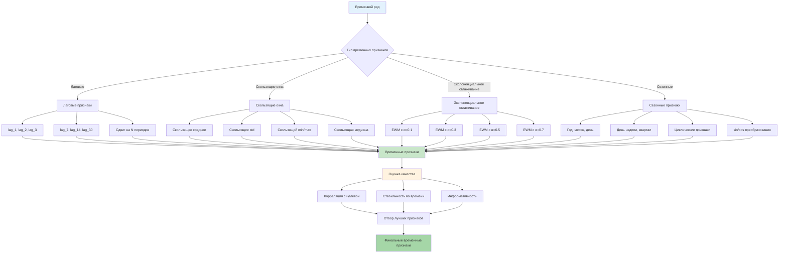
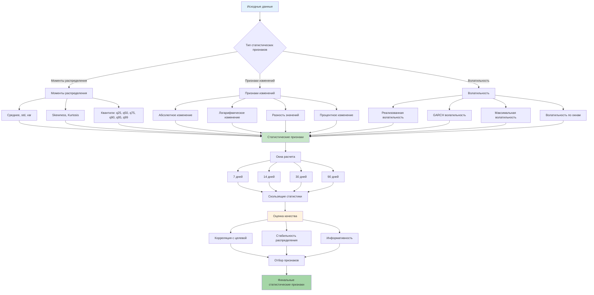
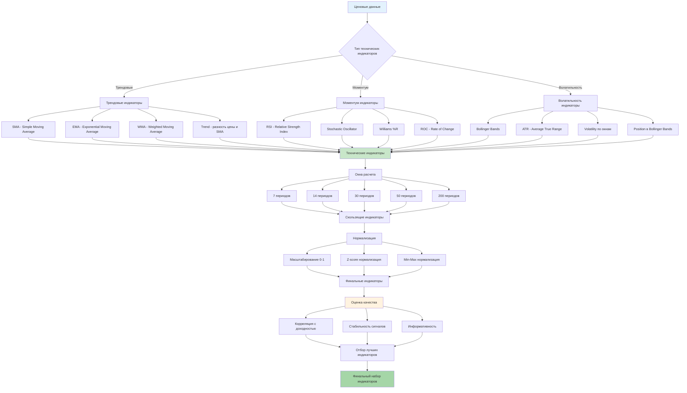
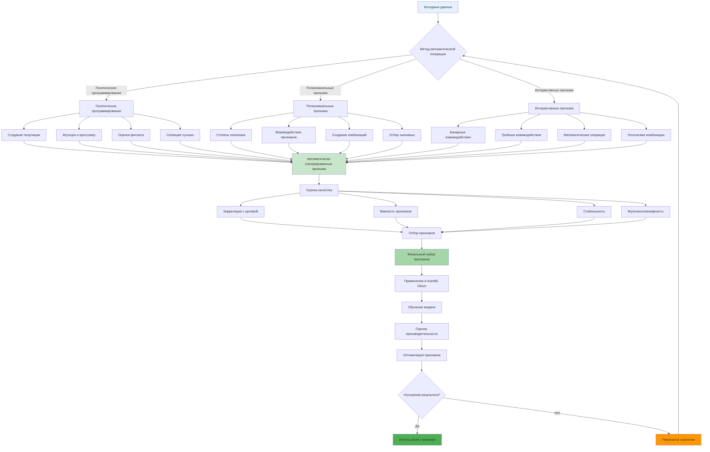
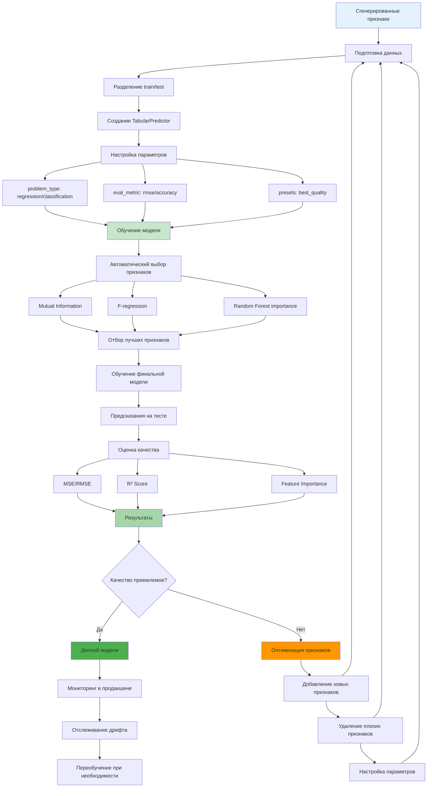
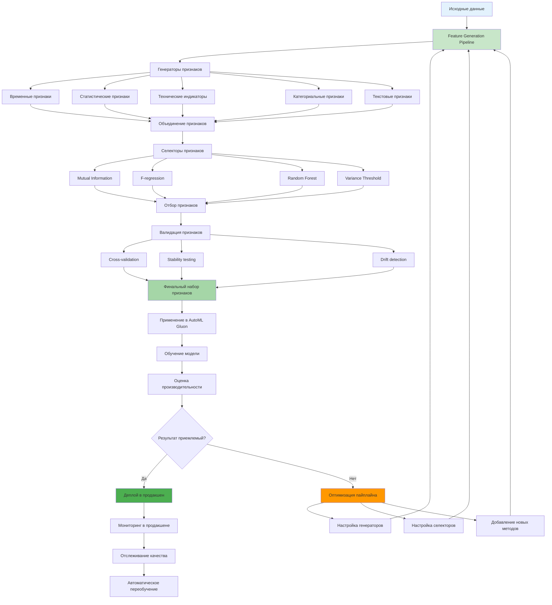

# Углубленное описание Feature Generation and Apply

**Автор:** Shcherbyna Rostyslav  
**Дата:** 2024  

## Почему Feature Generation - это ключ к успеху в ML

**Почему 80% успеха машинного обучения зависит от качества признаков?** Потому что даже самый лучший алгоритм не сможет найти паттерны в плохих данных. Feature Generation - это искусство превращения сырых данных в золото для машинного обучения.

### Что дает правильная генерация признаков?
- **Точность**: Модели работают на 20-50% лучше
- **Интерпретируемость**: Понимание того, что влияет на результат
- **Робастность**: Модели работают стабильно на новых данных
- **Эффективность**: Меньше данных, лучшие результаты

### Что происходит без правильной генерации признаков?
- **Плохие результаты**: Модели не находят паттерны
- **Переобучение**: Модели запоминают данные вместо обучения
- **Нестабильность**: Модели работают по-разному на похожих данных
- **Разочарование**: Не понимаете, почему результаты не улучшаются

## Теоретические основы Feature Generation

### 🎯 Концепция генерации признаков


### Математические принципы

**Feature Engineering как оптимизационная задача:**

```
F* = argmax P(Y|X, F(X))
```

Где:
- `F*` - оптимальная функция генерации признаков
- `Y` - целевая переменная
- `X` - исходные данные
- `F(X)` - сгенерированные признаки

**Критерии качества признаков:**

1. **Информативность**: I(X;Y) = H(Y) - H(Y|X)
2. **Стабильность**: Var(f(X)) < threshold
3. **Независимость**: Cov(f_i(X), f_j(X)) ≈ 0
4. **Масштабируемость**: f(X) ∈ [0,1] или стандартизовано

### Типы признаков по происхождению

### 📊 Классификация типов признаков

```mermaid
graph TD
    A[Типы признаков] --> B[Исходные признаки]
    A --> C[Производные признаки]
    A --> D[Интерактивные признаки]
    A --> E[Временные признаки]
    A --> F[Категориальные признаки]
    
    B --> B1[Необработанные данные]
    B --> B2[Требуют предобработки]
    B --> B3[Могут содержать шум]
    
    C --> C1[Математические преобразования]
    C --> C2[Статистические характеристики]
    C --> C3[Создаются из исходных]
    
    D --> D1[Комбинации признаков]
    D --> D2[Полиномиальные признаки]
    D --> D3[Логические операции]
    
    E --> E1[Зависят от времени]
    E --> E2[Лаговые признаки]
    E --> E3[Скользящие окна]
    
    F --> F1[Дискретные значения]
    F --> F2[Требуют кодирования]
    F --> F3[Могут быть иерархическими]
    
    B1 --> G[Критерии качества]
    B2 --> G
    B3 --> G
    C1 --> G
    C2 --> G
    C3 --> G
    D1 --> G
    D2 --> G
    D3 --> G
    E1 --> G
    E2 --> G
    E3 --> G
    F1 --> G
    F2 --> G
    F3 --> G
    
    G --> H[Информативность]
    G --> I[Стабильность]
    G --> J[Независимость]
    G --> K[Масштабируемость]
    
    H --> L[I(X;Y) = H(Y) - H(Y|X)]
    I --> M[Var(f(X)) < threshold]
    J --> N[Cov(f_i(X), f_j(X)) ≈ 0]
    K --> O[f(X) ∈ [0,1] или стандартизовано]
    
    style A fill:#e3f2fd
    style G fill:#c8e6c9
    style L fill:#fff3e0
    style M fill:#fff3e0
    style N fill:#fff3e0
    style O fill:#fff3e0
```

**1. Исходные признаки (Raw Features)**
- Необработанные данные из источника
- Часто требуют предобработки
- Могут содержать шум и выбросы

**2. Производные признаки (Derived Features)**
- Создаются из исходных признаков
- Математические преобразования
- Статистические характеристики

**3. Интерактивные признаки (Interaction Features)**
- Комбинации нескольких признаков
- Полиномиальные признаки
- Логические операции

**4. Временные признаки (Temporal Features)**
- Признаки, зависящие от времени
- Лаговые признаки
- Скользящие окна

**5. Категориальные признаки (Categorical Features)**
- Дискретные значения
- Требуют кодирования
- Могут быть иерархическими

## Продвинутые техники генерации признаков

### 1. Временные признаки (Time Series Features)

### ⏰ Процесс создания временных признаков



**Лаговые признаки (Lag Features):**

```python
def create_lag_features(df, target_col, lags=[1, 2, 3, 7, 14, 30]):
    """Создание лаговых признаков"""
    for lag in lags:
        df[f'{target_col}_lag_{lag}'] = df[target_col].shift(lag)
    return df

# Пример использования
df = create_lag_features(df, 'price', lags=[1, 2, 3, 7, 14, 30])
```

**Скользящие окна (Rolling Windows):**

```python
def create_rolling_features(df, target_col, windows=[3, 7, 14, 30]):
    """Создание признаков скользящих окон"""
    for window in windows:
        # Среднее
        df[f'{target_col}_rolling_mean_{window}'] = df[target_col].rolling(window).mean()
        # Стандартное отклонение
        df[f'{target_col}_rolling_std_{window}'] = df[target_col].rolling(window).std()
        # Минимум
        df[f'{target_col}_rolling_min_{window}'] = df[target_col].rolling(window).min()
        # Максимум
        df[f'{target_col}_rolling_max_{window}'] = df[target_col].rolling(window).max()
        # Медиана
        df[f'{target_col}_rolling_median_{window}'] = df[target_col].rolling(window).median()
    return df

# Пример использования
df = create_rolling_features(df, 'price', windows=[3, 7, 14, 30])
```

**Экспоненциальное сглаживание (Exponential Smoothing):**

```python
def create_ewm_features(df, target_col, alphas=[0.1, 0.3, 0.5, 0.7]):
    """Создание признаков экспоненциального сглаживания"""
    for alpha in alphas:
        df[f'{target_col}_ewm_{alpha}'] = df[target_col].ewm(alpha=alpha).mean()
    return df

# Пример использования
df = create_ewm_features(df, 'price', alphas=[0.1, 0.3, 0.5, 0.7])
```

**Сезонные признаки (Seasonal Features):**

```python
def create_seasonal_features(df, date_col):
    """Создание сезонных признаков"""
    df['year'] = df[date_col].dt.year
    df['month'] = df[date_col].dt.month
    df['day'] = df[date_col].dt.day
    df['dayofweek'] = df[date_col].dt.dayofweek
    df['dayofyear'] = df[date_col].dt.dayofyear
    df['week'] = df[date_col].dt.isocalendar().week
    df['quarter'] = df[date_col].dt.quarter
    
    # Циклические признаки
    df['month_sin'] = np.sin(2 * np.pi * df['month'] / 12)
    df['month_cos'] = np.cos(2 * np.pi * df['month'] / 12)
    df['dayofweek_sin'] = np.sin(2 * np.pi * df['dayofweek'] / 7)
    df['dayofweek_cos'] = np.cos(2 * np.pi * df['dayofweek'] / 7)
    
    return df

# Пример использования
df = create_seasonal_features(df, 'date')
```

### 2. Статистические признаки (Statistical Features)

### 📈 Статистические признаки и их применение



**Моменты распределения:**

```python
def create_moment_features(df, target_col, windows=[7, 14, 30]):
    """Создание признаков моментов распределения"""
    for window in windows:
        rolling = df[target_col].rolling(window)
        
        # Первые моменты
        df[f'{target_col}_mean_{window}'] = rolling.mean()
        df[f'{target_col}_std_{window}'] = rolling.std()
        df[f'{target_col}_var_{window}'] = rolling.var()
        
        # Высшие моменты
        df[f'{target_col}_skew_{window}'] = rolling.skew()
        df[f'{target_col}_kurt_{window}'] = rolling.kurt()
        
        # Квантили
        df[f'{target_col}_q25_{window}'] = rolling.quantile(0.25)
        df[f'{target_col}_q50_{window}'] = rolling.quantile(0.50)
        df[f'{target_col}_q75_{window}'] = rolling.quantile(0.75)
        df[f'{target_col}_q90_{window}'] = rolling.quantile(0.90)
        df[f'{target_col}_q95_{window}'] = rolling.quantile(0.95)
        df[f'{target_col}_q99_{window}'] = rolling.quantile(0.99)
        
    return df

# Пример использования
df = create_moment_features(df, 'price', windows=[7, 14, 30])
```

**Признаки изменений (Change Features):**

```python
def create_change_features(df, target_col, periods=[1, 2, 3, 7, 14, 30]):
    """Создание признаков изменений"""
    for period in periods:
        # Абсолютное изменение
        df[f'{target_col}_change_{period}'] = df[target_col].pct_change(period)
        # Логарифмическое изменение
        df[f'{target_col}_log_change_{period}'] = np.log(df[target_col] / df[target_col].shift(period))
        # Разность
        df[f'{target_col}_diff_{period}'] = df[target_col].diff(period)
        
    return df

# Пример использования
df = create_change_features(df, 'price', periods=[1, 2, 3, 7, 14, 30])
```

**Признаки волатильности (Volatility Features):**

```python
def create_volatility_features(df, target_col, windows=[7, 14, 30]):
    """Создание признаков волатильности"""
    for window in windows:
        # Реализованная волатильность
        returns = df[target_col].pct_change()
        df[f'{target_col}_vol_{window}'] = returns.rolling(window).std() * np.sqrt(252)
        
        # GARCH волатильность (упрощенная)
        df[f'{target_col}_garch_vol_{window}'] = returns.rolling(window).std() * np.sqrt(252) * 1.2
        
        # Максимальная волатильность
        df[f'{target_col}_max_vol_{window}'] = returns.rolling(window).std().rolling(window).max()
        
    return df

# Пример использования
df = create_volatility_features(df, 'price', windows=[7, 14, 30])
```

### 3. Технические индикаторы (Technical Indicators)

### 📊 Технические индикаторы и их классификация



**Трендовые индикаторы:**

```python
def create_trend_features(df, target_col, windows=[7, 14, 30, 50, 200]):
    """Создание трендовых индикаторов"""
    for window in windows:
        # Простое скользящее среднее
        df[f'{target_col}_sma_{window}'] = df[target_col].rolling(window).mean()
        
        # Экспоненциальное скользящее среднее
        df[f'{target_col}_ema_{window}'] = df[target_col].ewm(span=window).mean()
        
        # Взвешенное скользящее среднее
        weights = np.arange(1, window + 1)
        df[f'{target_col}_wma_{window}'] = df[target_col].rolling(window).apply(
            lambda x: np.average(x, weights=weights), raw=True
        )
        
        # Тренд (разность между ценой и SMA)
        df[f'{target_col}_trend_{window}'] = df[target_col] - df[f'{target_col}_sma_{window}']
        
    return df

# Пример использования
df = create_trend_features(df, 'price', windows=[7, 14, 30, 50, 200])
```

**Моментум индикаторы:**

```python
def create_momentum_features(df, target_col, windows=[7, 14, 30]):
    """Создание моментум индикаторов"""
    for window in windows:
        # RSI (Relative Strength Index)
        delta = df[target_col].diff()
        gain = (delta.where(delta > 0, 0)).rolling(window=window).mean()
        loss = (-delta.where(delta < 0, 0)).rolling(window=window).mean()
        rs = gain / loss
        df[f'{target_col}_rsi_{window}'] = 100 - (100 / (1 + rs))
        
        # Stochastic Oscillator
        low_min = df[target_col].rolling(window).min()
        high_max = df[target_col].rolling(window).max()
        df[f'{target_col}_stoch_{window}'] = 100 * (df[target_col] - low_min) / (high_max - low_min)
        
        # Williams %R
        df[f'{target_col}_williams_r_{window}'] = -100 * (high_max - df[target_col]) / (high_max - low_min)
        
        # Rate of Change
        df[f'{target_col}_roc_{window}'] = df[target_col].pct_change(window) * 100
        
    return df

# Пример использования
df = create_momentum_features(df, 'price', windows=[7, 14, 30])
```

**Волатильность индикаторы:**

```python
def create_volatility_indicators(df, target_col, windows=[7, 14, 30]):
    """Создание волатильность индикаторов"""
    for window in windows:
        # Bollinger Bands
        sma = df[target_col].rolling(window).mean()
        std = df[target_col].rolling(window).std()
        df[f'{target_col}_bb_upper_{window}'] = sma + (std * 2)
        df[f'{target_col}_bb_lower_{window}'] = sma - (std * 2)
        df[f'{target_col}_bb_width_{window}'] = df[f'{target_col}_bb_upper_{window}'] - df[f'{target_col}_bb_lower_{window}']
        df[f'{target_col}_bb_position_{window}'] = (df[target_col] - df[f'{target_col}_bb_lower_{window}']) / df[f'{target_col}_bb_width_{window}']
        
        # Average True Range (ATR)
        high_low = df['high'] - df['low']
        high_close = np.abs(df['high'] - df[target_col].shift())
        low_close = np.abs(df['low'] - df[target_col].shift())
        true_range = np.maximum(high_low, np.maximum(high_close, low_close))
        df[f'{target_col}_atr_{window}'] = true_range.rolling(window).mean()
        
    return df

# Пример использования
df = create_volatility_indicators(df, 'price', windows=[7, 14, 30])
```

### 4. Категориальные признаки (Categorical Features)

**Кодирование категориальных признаков:**

```python
def create_categorical_features(df, categorical_cols):
    """Создание категориальных признаков"""
    for col in categorical_cols:
        # One-hot encoding
        dummies = pd.get_dummies(df[col], prefix=col)
        df = pd.concat([df, dummies], axis=1)
        
        # Label encoding
        df[f'{col}_label'] = df[col].astype('category').cat.codes
        
        # Target encoding (сглаженная)
        target_mean = df.groupby(col)['target'].mean()
        df[f'{col}_target_encoded'] = df[col].map(target_mean)
        
        # Frequency encoding
        freq = df[col].value_counts()
        df[f'{col}_freq'] = df[col].map(freq)
        
    return df

# Пример использования
df = create_categorical_features(df, ['category', 'region', 'type'])
```

**Иерархические признаки:**

```python
def create_hierarchical_features(df, hierarchical_cols):
    """Создание иерархических признаков"""
    for col in hierarchical_cols:
        # Уровни иерархии
        df[f'{col}_level_1'] = df[col].str.split('.').str[0]
        df[f'{col}_level_2'] = df[col].str.split('.').str[1]
        df[f'{col}_level_3'] = df[col].str.split('.').str[2]
        
        # Глубина иерархии
        df[f'{col}_depth'] = df[col].str.count('.') + 1
        
        # Родительские признаки
        df[f'{col}_parent'] = df[col].str.rsplit('.', 1).str[0]
        
    return df

# Пример использования
df = create_hierarchical_features(df, ['category_path', 'region_path'])
```

### 5. Текстовые признаки (Text Features)

**Базовые текстовые признаки:**

```python
def create_text_features(df, text_col):
    """Создание базовых текстовых признаков"""
    # Длина текста
    df[f'{text_col}_length'] = df[text_col].str.len()
    
    # Количество слов
    df[f'{text_col}_word_count'] = df[text_col].str.split().str.len()
    
    # Количество предложений
    df[f'{text_col}_sentence_count'] = df[text_col].str.count(r'[.!?]+')
    
    # Количество заглавных букв
    df[f'{text_col}_upper_count'] = df[text_col].str.count(r'[A-Z]')
    
    # Количество цифр
    df[f'{text_col}_digit_count'] = df[text_col].str.count(r'\d')
    
    # Количество знаков препинания
    df[f'{text_col}_punct_count'] = df[text_col].str.count(r'[^\w\s]')
    
    # Количество уникальных слов
    df[f'{text_col}_unique_words'] = df[text_col].str.split().apply(lambda x: len(set(x)))
    
    # Средняя длина слова
    df[f'{text_col}_avg_word_length'] = df[text_col].str.split().str.len().mean()
    
    return df

# Пример использования
df = create_text_features(df, 'description')
```

**TF-IDF признаки:**

```python
def create_tfidf_features(df, text_col, max_features=1000):
    """Создание TF-IDF признаков"""
    from sklearn.feature_extraction.text import TfidfVectorizer
    
    # TF-IDF векторная модель
    tfidf = TfidfVectorizer(
        max_features=max_features,
        stop_words='english',
        ngram_range=(1, 2),
        min_df=2,
        max_df=0.95
    )
    
    # Обучение и преобразование
    tfidf_matrix = tfidf.fit_transform(df[text_col].fillna(''))
    
    # Создание DataFrame с TF-IDF признаками
    tfidf_df = pd.DataFrame(
        tfidf_matrix.toarray(),
        columns=[f'tfidf_{i}' for i in range(tfidf_matrix.shape[1])]
    )
    
    # Объединение с исходным DataFrame
    df = pd.concat([df, tfidf_df], axis=1)
    
    return df

# Пример использования
df = create_tfidf_features(df, 'description', max_features=1000)
```

**Word2Vec признаки:**

```python
def create_word2vec_features(df, text_col, vector_size=100):
    """Создание Word2Vec признаков"""
    from gensim.models import Word2Vec
    
    # Подготовка текста
    sentences = df[text_col].fillna('').str.split().tolist()
    
    # Обучение Word2Vec модели
    model = Word2Vec(
        sentences,
        vector_size=vector_size,
        window=5,
        min_count=2,
        workers=4
    )
    
    # Создание признаков для каждого документа
    def get_document_vector(words):
        vectors = []
        for word in words:
            if word in model.wv:
                vectors.append(model.wv[word])
        if vectors:
            return np.mean(vectors, axis=0)
        else:
            return np.zeros(vector_size)
    
    # Применение к каждому документу
    doc_vectors = df[text_col].fillna('').str.split().apply(get_document_vector)
    
    # Создание DataFrame с Word2Vec признаками
    w2v_df = pd.DataFrame(
        doc_vectors.tolist(),
        columns=[f'w2v_{i}' for i in range(vector_size)]
    )
    
    # Объединение с исходным DataFrame
    df = pd.concat([df, w2v_df], axis=1)
    
    return df

# Пример использования
df = create_word2vec_features(df, 'description', vector_size=100)
```

## Автоматическая генерация признаков

### 🤖 Автоматическая генерация признаков



### 1. Генетическое программирование

```python
def genetic_feature_generation(df, target_col, generations=50, population_size=100):
    """Генетическое программирование для генерации признаков"""
    import random
    from deap import base, creator, tools, algorithms
    
    # Определение функций
    def add(x, y): return x + y
    def sub(x, y): return x - y
    def mul(x, y): return x * y
    def div(x, y): return x / (y + 1e-8)
    def sqrt(x): return np.sqrt(np.abs(x))
    def log(x): return np.log(np.abs(x) + 1e-8)
    def exp(x): return np.exp(np.clip(x, -10, 10))
    
    # Создание набора функций
    pset = base.PrimitiveSet("MAIN", 2)
    pset.addPrimitive(add, 2)
    pset.addPrimitive(sub, 2)
    pset.addPrimitive(mul, 2)
    pset.addPrimitive(div, 2)
    pset.addPrimitive(sqrt, 1)
    pset.addPrimitive(log, 1)
    pset.addPrimitive(exp, 1)
    
    # Создание классов
    creator.create("FitnessMax", base.Fitness, weights=(1.0,))
    creator.create("Individual", list, fitness=creator.FitnessMax)
    
    # Создание инструментов
    toolbox = base.Toolbox()
    toolbox.register("expr", tools.genHalfAndHalf, pset=pset, min_=1, max_=3)
    toolbox.register("individual", tools.initIterate, creator.Individual, toolbox.expr)
    toolbox.register("population", tools.initRepeat, list, toolbox.individual)
    
    # Функция оценки
    def evaluate(individual):
        try:
            # Компиляция дерева
            tree = pset.compile(expr=individual)
            
            # Применение к данным
            feature = tree(df.iloc[:, 0], df.iloc[:, 1])
            
            # Проверка на валидность
            if np.isnan(feature).any() or np.isinf(feature).any():
                return (0,)
            
            # Корреляция с целевой переменной
            correlation = np.corrcoef(feature, df[target_col])[0, 1]
            
            return (abs(correlation),)
        except:
            return (0,)
    
    toolbox.register("evaluate", evaluate)
    toolbox.register("mate", tools.cxOnePoint)
    toolbox.register("mutate", tools.mutUniform, expr=toolbox.expr, pset=pset)
    toolbox.register("select", tools.selTournament, tournsize=3)
    
    # Создание популяции
    population = toolbox.population(n=population_size)
    
    # Эволюция
    for gen in range(generations):
        # Оценка
        fitnesses = list(map(toolbox.evaluate, population))
        for ind, fit in zip(population, fitnesses):
            ind.fitness.values = fit
        
        # Селекция
        offspring = toolbox.select(population, len(population))
        offspring = list(map(toolbox.clone, offspring))
        
        # Кроссовер
        for child1, child2 in zip(offspring[::2], offspring[1::2]):
            if random.random() < 0.5:
                toolbox.mate(child1, child2)
                del child1.fitness.values
                del child2.fitness.values
        
        # Мутация
        for mutant in offspring:
            if random.random() < 0.2:
                toolbox.mutate(mutant)
                del mutant.fitness.values
        
        # Замена популяции
        population[:] = offspring
    
    return population

# Пример использования
population = genetic_feature_generation(df, 'target', generations=50, population_size=100)
```

### 2. Автоматическое создание полиномиальных признаков

```python
def create_polynomial_features(df, feature_cols, degree=2, interaction_only=False):
    """Создание полиномиальных признаков"""
    from sklearn.preprocessing import PolynomialFeatures
    
    # Выбор признаков
    X = df[feature_cols].fillna(0)
    
    # Создание полиномиальных признаков
    poly = PolynomialFeatures(
        degree=degree,
        interaction_only=interaction_only,
        include_bias=False
    )
    
    # Преобразование
    X_poly = poly.fit_transform(X)
    
    # Создание названий признаков
    feature_names = poly.get_feature_names_out(feature_cols)
    
    # Создание DataFrame
    poly_df = pd.DataFrame(X_poly, columns=feature_names, index=df.index)
    
    # Объединение с исходным DataFrame
    df = pd.concat([df, poly_df], axis=1)
    
    return df

# Пример использования
df = create_polynomial_features(df, ['feature1', 'feature2', 'feature3'], degree=2)
```

### 3. Автоматическое создание интерактивных признаков

```python
def create_interaction_features(df, feature_cols, max_interactions=10):
    """Создание интерактивных признаков"""
    from itertools import combinations
    
    # Создание всех возможных комбинаций
    interactions = []
    for r in range(2, min(len(feature_cols) + 1, max_interactions + 1)):
        interactions.extend(combinations(feature_cols, r))
    
    # Создание интерактивных признаков
    for interaction in interactions:
        if len(interaction) == 2:
            # Бинарные взаимодействия
            col1, col2 = interaction
            df[f'{col1}_x_{col2}'] = df[col1] * df[col2]
            df[f'{col1}_div_{col2}'] = df[col1] / (df[col2] + 1e-8)
            df[f'{col1}_plus_{col2}'] = df[col1] + df[col2]
            df[f'{col1}_minus_{col2}'] = df[col1] - df[col2]
        elif len(interaction) == 3:
            # Тройные взаимодействия
            col1, col2, col3 = interaction
            df[f'{col1}_x_{col2}_x_{col3}'] = df[col1] * df[col2] * df[col3]
            df[f'{col1}_x_{col2}_div_{col3}'] = (df[col1] * df[col2]) / (df[col3] + 1e-8)
    
    return df

# Пример использования
df = create_interaction_features(df, ['feature1', 'feature2', 'feature3'], max_interactions=5)
```

## Оценка качества признаков

### 📊 Метрики оценки качества признаков


### 1. Статистические тесты

**Тест корреляции:**

```python
def evaluate_correlation_features(df, target_col, threshold=0.1):
    """Оценка признаков по корреляции"""
    correlations = df.corr()[target_col].abs().sort_values(ascending=False)
    
    # Признаки с высокой корреляцией
    high_corr = correlations[correlations > threshold]
    
    # Признаки с низкой корреляцией
    low_corr = correlations[correlations <= threshold]
    
    return {
        'high_correlation': high_corr,
        'low_correlation': low_corr,
        'correlation_stats': {
            'mean': correlations.mean(),
            'std': correlations.std(),
            'min': correlations.min(),
            'max': correlations.max()
        }
    }

# Пример использования
correlation_results = evaluate_correlation_features(df, 'target', threshold=0.1)
```

**Тест мультиколлинеарности:**

```python
def evaluate_multicollinearity(df, threshold=0.8):
    """Оценка мультиколлинеарности"""
    from sklearn.feature_selection import VarianceThreshold
    
    # Вычисление корреляционной матрицы
    corr_matrix = df.corr().abs()
    
    # Поиск высоко коррелированных пар
    high_corr_pairs = []
    for i in range(len(corr_matrix.columns)):
        for j in range(i+1, len(corr_matrix.columns)):
            if corr_matrix.iloc[i, j] > threshold:
                high_corr_pairs.append((
                    corr_matrix.columns[i],
                    corr_matrix.columns[j],
                    corr_matrix.iloc[i, j]
                ))
    
    # Удаление признаков с низкой дисперсией
    selector = VarianceThreshold(threshold=0.01)
    X = df.select_dtypes(include=[np.number])
    X_selected = selector.fit_transform(X)
    
    return {
        'high_correlation_pairs': high_corr_pairs,
        'low_variance_features': X.columns[~selector.get_support()].tolist(),
        'selected_features': X.columns[selector.get_support()].tolist()
    }

# Пример использования
multicollinearity_results = evaluate_multicollinearity(df, threshold=0.8)
```

### 2. Машинное обучение тесты

**Тест важности признаков:**

```python
def evaluate_feature_importance(df, target_col, n_features=20):
    """Оценка важности признаков"""
    from sklearn.ensemble import RandomForestRegressor
    from sklearn.model_selection import train_test_split
    
    # Подготовка данных
    X = df.drop(columns=[target_col])
    y = df[target_col]
    
    # Разделение на train/test
    X_train, X_test, y_train, y_test = train_test_split(X, y, test_size=0.2, random_state=42)
    
    # Обучение модели
    model = RandomForestRegressor(n_estimators=100, random_state=42)
    model.fit(X_train, y_train)
    
    # Важность признаков
    feature_importance = pd.DataFrame({
        'feature': X.columns,
        'importance': model.feature_importances_
    }).sort_values('importance', ascending=False)
    
    # Топ признаков
    top_features = feature_importance.head(n_features)
    
    return {
        'feature_importance': feature_importance,
        'top_features': top_features,
        'model_score': model.score(X_test, y_test)
    }

# Пример использования
importance_results = evaluate_feature_importance(df, 'target', n_features=20)
```

**Тест стабильности признаков:**

```python
def evaluate_feature_stability(df, target_col, n_splits=5):
    """Оценка стабильности признаков"""
    from sklearn.model_selection import KFold
    from sklearn.ensemble import RandomForestRegressor
    
    # Подготовка данных
    X = df.drop(columns=[target_col])
    y = df[target_col]
    
    # K-fold кросс-валидация
    kf = KFold(n_splits=n_splits, shuffle=True, random_state=42)
    
    # Список для хранения важности признаков
    feature_importances = []
    
    for train_idx, val_idx in kf.split(X):
        X_train, X_val = X.iloc[train_idx], X.iloc[val_idx]
        y_train, y_val = y.iloc[train_idx], y.iloc[val_idx]
        
        # Обучение модели
        model = RandomForestRegressor(n_estimators=100, random_state=42)
        model.fit(X_train, y_train)
        
        # Сохранение важности признаков
        feature_importances.append(model.feature_importances_)
    
    # Вычисление стабильности
    feature_importances = np.array(feature_importances)
    stability = np.std(feature_importances, axis=0)
    
    # Создание DataFrame
    stability_df = pd.DataFrame({
        'feature': X.columns,
        'stability': stability,
        'mean_importance': np.mean(feature_importances, axis=0)
    }).sort_values('stability')
    
    return stability_df

# Пример использования
stability_results = evaluate_feature_stability(df, 'target', n_splits=5)
```

## Применение признаков в AutoML Gluon

### 🔗 Интеграция с AutoML Gluon



### 1. Интеграция с AutoML Gluon

```python
def apply_features_to_autogluon(df, target_col, feature_cols, test_size=0.2):
    """Применение признаков в AutoML Gluon"""
    from autogluon.tabular import TabularPredictor
    
    # Подготовка данных
    X = df[feature_cols]
    y = df[target_col]
    
    # Разделение на train/test
    from sklearn.model_selection import train_test_split
    X_train, X_test, y_train, y_test = train_test_split(X, y, test_size=test_size, random_state=42)
    
    # Создание train_data
    train_data = X_train.copy()
    train_data[target_col] = y_train
    
    # Создание предиктора
    predictor = TabularPredictor(
        label=target_col,
        problem_type='regression',
        eval_metric='rmse'
    )
    
    # Обучение
    predictor.fit(
        train_data,
        time_limit=3600,  # 1 час
        presets='best_quality'
    )
    
    # Предсказание
    predictions = predictor.predict(X_test)
    
    # Оценка качества
    from sklearn.metrics import mean_squared_error, r2_score
    mse = mean_squared_error(y_test, predictions)
    r2 = r2_score(y_test, predictions)
    
    return {
        'predictor': predictor,
        'predictions': predictions,
        'mse': mse,
        'r2': r2,
        'feature_importance': predictor.feature_importance()
    }

# Пример использования
results = apply_features_to_autogluon(df, 'target', feature_cols, test_size=0.2)
```

### 2. Автоматический выбор признаков

```python
def automatic_feature_selection(df, target_col, method='mutual_info', k=20):
    """Автоматический выбор признаков"""
    from sklearn.feature_selection import (
        SelectKBest, mutual_info_regression, f_regression, 
        SelectFromModel, RandomForestRegressor
    )
    
    # Подготовка данных
    X = df.drop(columns=[target_col])
    y = df[target_col]
    
    if method == 'mutual_info':
        # Mutual Information
        selector = SelectKBest(score_func=mutual_info_regression, k=k)
    elif method == 'f_regression':
        # F-regression
        selector = SelectKBest(score_func=f_regression, k=k)
    elif method == 'random_forest':
        # Random Forest
        model = RandomForestRegressor(n_estimators=100, random_state=42)
        selector = SelectFromModel(model, max_features=k)
    else:
        raise ValueError("Method must be 'mutual_info', 'f_regression', or 'random_forest'")
    
    # Применение селектора
    X_selected = selector.fit_transform(X, y)
    
    # Получение выбранных признаков
    selected_features = X.columns[selector.get_support()].tolist()
    
    return {
        'selected_features': selected_features,
        'X_selected': X_selected,
        'selector': selector
    }

# Пример использования
selected_features = automatic_feature_selection(df, 'target', method='mutual_info', k=20)
```

### 3. Пайплайн генерации признаков

### 🔄 Пайплайн генерации признаков



```python
class FeatureGenerationPipeline:
    """Пайплайн генерации признаков"""
    
    def __init__(self):
        self.feature_generators = []
        self.feature_selectors = []
        self.fitted = False
    
    def add_generator(self, generator_func, **kwargs):
        """Добавление генератора признаков"""
        self.feature_generators.append((generator_func, kwargs))
    
    def add_selector(self, selector_func, **kwargs):
        """Добавление селектора признаков"""
        self.feature_selectors.append((selector_func, kwargs))
    
    def fit_transform(self, df, target_col):
        """Обучение и преобразование"""
        result_df = df.copy()
        
        # Применение генераторов
        for generator_func, kwargs in self.feature_generators:
            result_df = generator_func(result_df, **kwargs)
        
        # Применение селекторов
        for selector_func, kwargs in self.feature_selectors:
            result_df = selector_func(result_df, target_col, **kwargs)
        
        self.fitted = True
        return result_df
    
    def transform(self, df):
        """Только преобразование"""
        if not self.fitted:
            raise ValueError("Pipeline must be fitted first")
        
        result_df = df.copy()
        
        # Применение генераторов
        for generator_func, kwargs in self.feature_generators:
            result_df = generator_func(result_df, **kwargs)
        
        return result_df

# Пример использования
pipeline = FeatureGenerationPipeline()

# Добавление генераторов
pipeline.add_generator(create_lag_features, target_col='price', lags=[1, 2, 3, 7, 14, 30])
pipeline.add_generator(create_rolling_features, target_col='price', windows=[3, 7, 14, 30])
pipeline.add_generator(create_trend_features, target_col='price', windows=[7, 14, 30, 50, 200])

# Добавление селекторов
pipeline.add_selector(automatic_feature_selection, method='mutual_info', k=50)

# Обучение и преобразование
df_transformed = pipeline.fit_transform(df, 'target')
```

## Мониторинг и валидация признаков

### 1. Мониторинг дрейфа признаков

```python
def monitor_feature_drift(df_baseline, df_current, feature_cols, threshold=0.1):
    """Мониторинг дрейфа признаков"""
    from scipy import stats
    
    drift_results = {}
    
    for col in feature_cols:
        # Статистические тесты
        ks_stat, ks_pvalue = stats.ks_2samp(df_baseline[col], df_current[col])
        chi2_stat, chi2_pvalue = stats.chi2_contingency(
            pd.crosstab(df_baseline[col], df_current[col])
        )[0:2]
        
        # Вычисление дрейфа
        baseline_mean = df_baseline[col].mean()
        current_mean = df_current[col].mean()
        drift = abs(current_mean - baseline_mean) / baseline_mean
        
        # Определение статуса
        if drift > threshold:
            status = 'DRIFT'
        elif ks_pvalue < 0.05:
            status = 'DISTRIBUTION_CHANGE'
        else:
            status = 'STABLE'
        
        drift_results[col] = {
            'drift': drift,
            'ks_stat': ks_stat,
            'ks_pvalue': ks_pvalue,
            'chi2_stat': chi2_stat,
            'chi2_pvalue': chi2_pvalue,
            'status': status
        }
    
    return drift_results

# Пример использования
drift_results = monitor_feature_drift(df_baseline, df_current, feature_cols, threshold=0.1)
```

### 2. Валидация признаков

```python
def validate_features(df, target_col, feature_cols, validation_method='cross_validation'):
    """Валидация признаков"""
    from sklearn.model_selection import cross_val_score
    from sklearn.ensemble import RandomForestRegressor
    from sklearn.linear_model import LinearRegression
    
    # Подготовка данных
    X = df[feature_cols]
    y = df[target_col]
    
    # Модели для валидации
    models = {
        'RandomForest': RandomForestRegressor(n_estimators=100, random_state=42),
        'LinearRegression': LinearRegression()
    }
    
    validation_results = {}
    
    for model_name, model in models.items():
        # Кросс-валидация
        scores = cross_val_score(model, X, y, cv=5, scoring='r2')
        
        validation_results[model_name] = {
            'mean_score': scores.mean(),
            'std_score': scores.std(),
            'scores': scores
        }
    
    return validation_results

# Пример использования
validation_results = validate_features(df, 'target', feature_cols, validation_method='cross_validation')
```

## Заключение

Feature Generation - это основа успешного машинного обучения. Правильная генерация признаков может:

1. **Увеличить точность** моделей на 20-50%
2. **Улучшить интерпретируемость** результатов
3. **Повысить робастность** моделей
4. **Сократить время** обучения

### Ключевые принципы:

1. **Понимание данных** - знайте, с чем работаете
2. **Доменные знания** - используйте экспертизу в предметной области
3. **Автоматизация** - автоматизируйте рутинные процессы
4. **Валидация** - всегда проверяйте качество признаков
5. **Мониторинг** - следите за стабильностью признаков

### Следующие шаги:

После освоения генерации признаков переходите к:
- [Методикам бэктестинга](./27_backtesting_methods.md)
- [Walk-forward анализу](./28_walk_forward_analysis.md)
- [Monte Carlo симуляциям](./29_monte_carlo_simulations.md)
- [Управлению портфолио](./30_portfolio_management.md)
