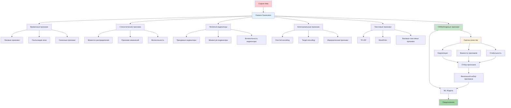
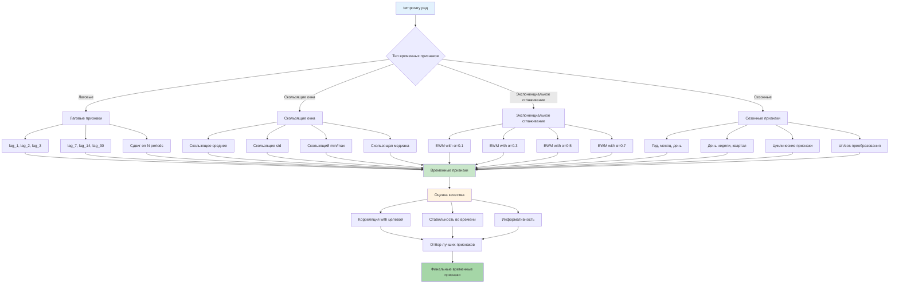
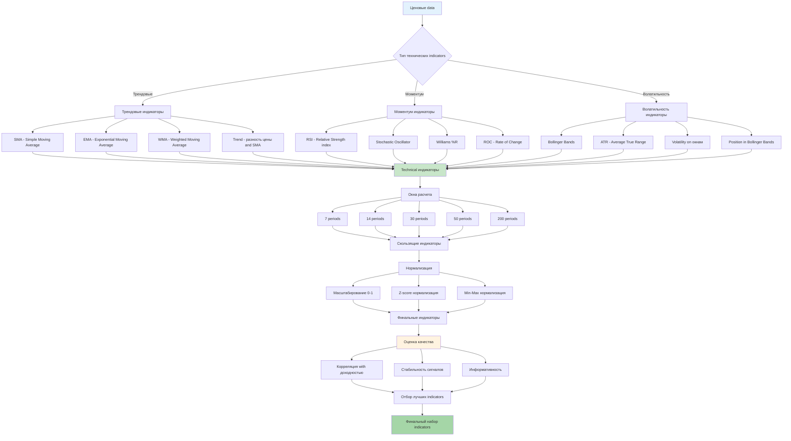
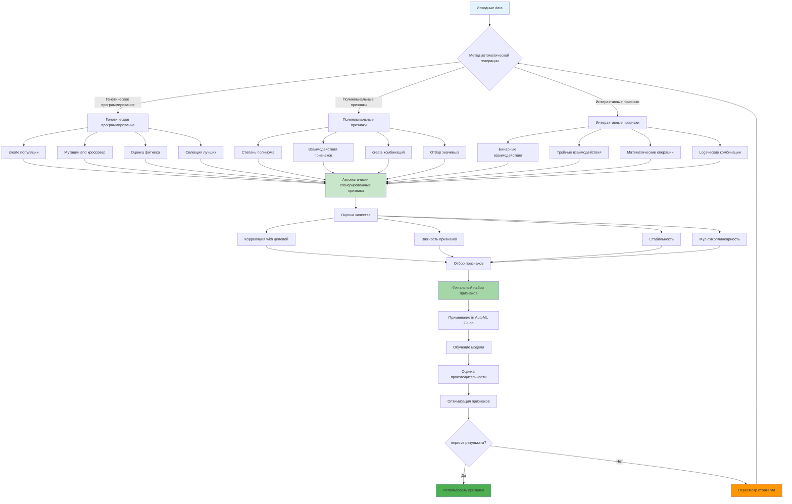
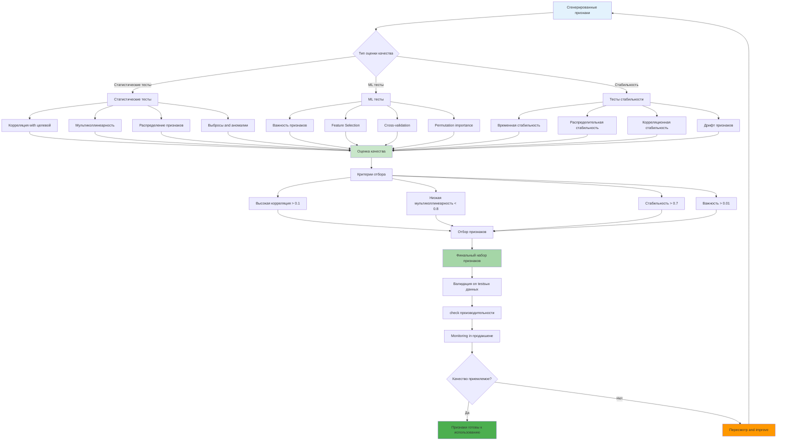
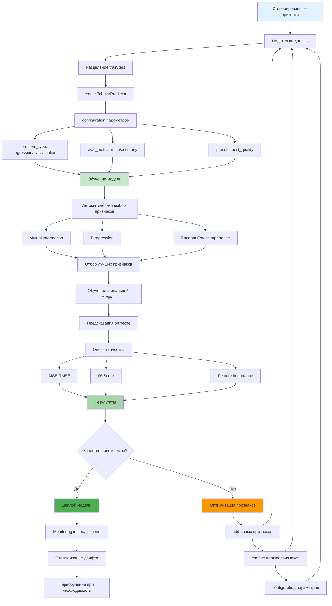
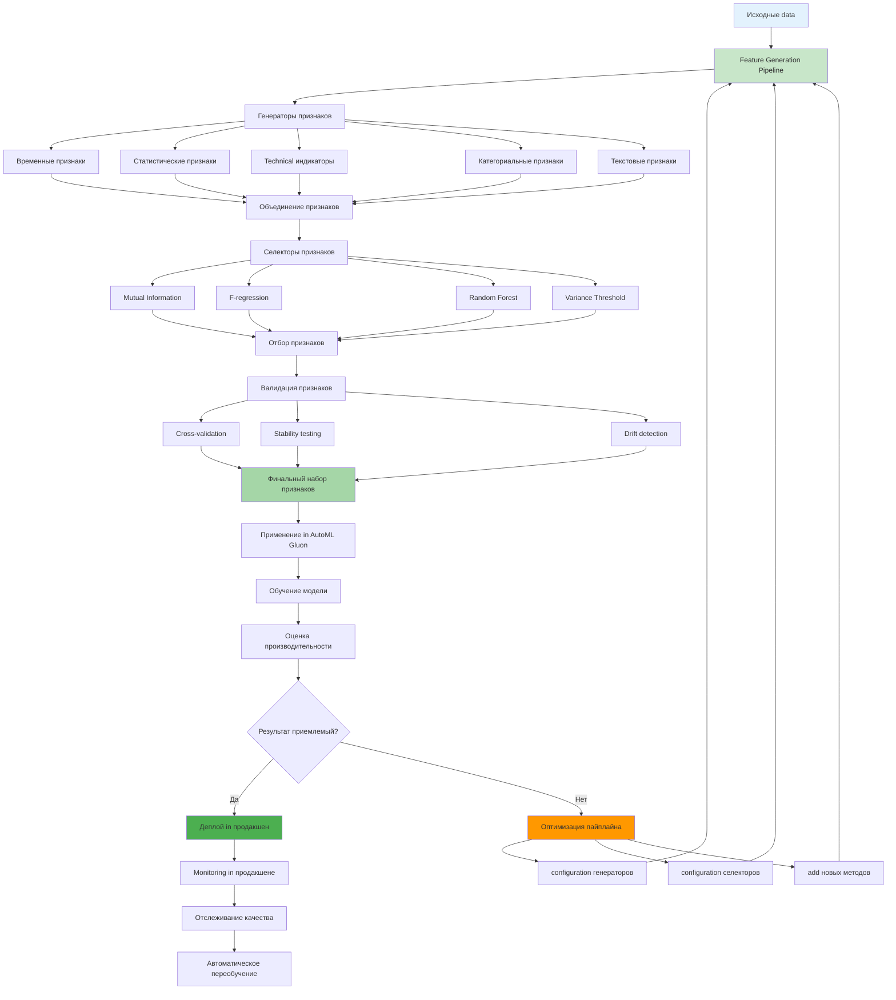

# Углубленное describe Feature Generation and Apply

**Author:** Shcherbyna Rostyslav
**Дата:** 2024

## Why Feature Generation - это ключ к успеху in ML

**Почему 80% успеха machine learning зависит from качества признаков?** Потому что даже самый лучший алгоритм not сможет найти паттерны in плохих данных. Feature Generation - это искусство превращения сырых данных in золото for machine learning.

### Что дает правильная генерация признаков?

- **Точность**: Модели Workingют on 20-50% лучше
- **Интерпретируемость**: Понимание того, что влияет on результат
- **Робастность**: Модели Workingют стабильно on новых данных
- **Эффективность**: Меньше данных, лучшие результаты

### Что происходит без правильной генерации признаков?

- **Плохие результаты**: Модели not находят паттерны
- **Переобучение**: Модели запоминают data вместо обучения
- **Нестабильность**: Модели Workingют on-разному on похожих данных
- **Разочарование**: not понимаете, почему результаты not улучшаются

## Теоретические основы Feature Generation

### 🎯 Concept генерации признаков



### Математические принципы

**Feature Engineering как оптимизационная задача:**

```math
F* = argmax P(Y|X, F(X))
```

Где:

- `F*` - оптимальная function генерации признаков
- `Y` - целевая переменная
- `X` - исходные data
- `F(X)` - сгенерированные признаки

**Критерии качества признаков:**

1. **Информативность**: I(X;Y) = H(Y) - H(Y|X)
2. **Стабильность**: Var(f(X)) < threshold
3. **Независимость**: Cov(f_i(X), f_j(X)) ≈ 0
4. **Масштабируемость**: f(X) ∈ [0,1] or стандартизовано

### Типы признаков on происхождению

### 📊 Классификация типов признаков

```mermaid
graph TD
A[Типы признаков] --> B[Исходные признаки]
A --> C[Производные признаки]
A --> D[Интерактивные признаки]
A --> E[Временные признаки]
A --> F[Категориальные признаки]

B --> B1[НеобWorkingнные data]
B --> B2[Требуют предобработки]
B --> B3[Могут содержать шум]

C --> C1[Математические преобразования]
C --> C2[Статистические характеристики]
C --> C3[Создаются из исходных]

D --> D1[Комбинации признаков]
D --> D2[Полиномиальные признаки]
D --> D3[Logsческие операции]

E --> E1[Зависят from времени]
E --> E2[Лаговые признаки]
E --> E3[Скользящие окна]

F --> F1[Дискретные значения]
F --> F2[Требуют кодирования]
F --> F3[Могут быть иерархическими]

B1 --> G[Критерии качества]
 B2 --> G
 B3 --> G
 C1 --> G
 C2 --> G
 C3 --> G
 D1 --> G
 D2 --> G
 D3 --> G
 E1 --> G
 E2 --> G
 E3 --> G
 F1 --> G
 F2 --> G
 F3 --> G

G --> H[Информативность]
G --> I[Стабильность]
G --> J[Независимость]
G --> K[Масштабируемость]

 H --> L[I(X;Y) = H(Y) - H(Y|X)]
 I --> M[Var(f(X)) < threshold]
 J --> N[Cov(f_i(X), f_j(X)) ≈ 0]
K --> O[f(X) ∈ [0,1] or стандартизовано]

 style A fill:#e3f2fd
 style G fill:#c8e6c9
 style L fill:#fff3e0
 style M fill:#fff3e0
 style N fill:#fff3e0
 style O fill:#fff3e0
```

### 1. Исходные признаки (Raw Features)

- НеобWorkingнные data из источника
- Часто требуют предобработки
- Могут содержать шум and выбросы

### 2. Производные признаки (Derived Features)

- Создаются из исходных признаков
- Математические преобразования
- Статистические характеристики

### 3. Интерактивные признаки (Interaction Features)

- Комбинации нескольких признаков
- Полиномиальные признаки
- Logsческие операции

### 4. Временные признаки (Temporal Features)

- Признаки, зависящие from времени
- Лаговые признаки
- Скользящие окна

### 5. Категориальные признаки (Categorical Features)

- Дискретные значения
- Требуют кодирования
- Могут быть иерархическими

## Продвинутые техники генерации признаков

### 1. Временные признаки (Time Series Features)

### ⏰ Процесс создания временных признаков



**Лаговые признаки (Lag Features):**

```python
def create_lag_features(df, target_col, lags=[1, 2, 3, 7, 14, 30], fill_method='forward',
 include_original=False, lag_prefix='lag', config=None):
 """
create лаговых признаков for временных рядов

 Args:
df (pd.dataFrame): Исходный dataFrame with временными данными
target_col (str): Название целевой колонки for создания лагов
lags (List): List лагов for создания (on умолчанию [1, 2, 3, 7, 14, 30])
- 1: Предыдущий период
- 2-3: Краткосрочные лаги
- 7: Недельный лаг
- 14: Двухнедельный лаг
- 30: Месячный лаг
fill_method (str): Метод заполнения пропусков ('forward', 'backward', 'interpolate', 'zero')
- 'forward': Заполнение предыдущим значением (ffill)
- 'backward': Заполнение следующим значением (bfill)
- 'interpolate': Линейная интерполяция
- 'zero': Заполнение нулями
include_original (bool): Включать ли исходную колонку in результат
lag_prefix (str): Префикс for названий лаговых признаков
config (dict): Дополнительная configuration
- max_lag: Максимальный лаг (on умолчанию max(lags))
- min_lag: Минимальный лаг (on умолчанию min(lags))
- lag_step: Шаг между лагами (on умолчанию 1)
- validation: Валидация данных (True/False)
- memory_efficient: Эффективное использование памяти (True/False)

 Returns:
pd.dataFrame: dataFrame with добавленными лаговыми приsignми

 Raises:
ValueError: Если target_col not существует in dataFrame
ValueError: Если lags содержит недопустимые значения
TypeError: Если fill_method not поддерживается
 """
 if config is None:
 config = {
 'max_lag': max(lags) if lags else 1,
 'min_lag': min(lags) if lags else 1,
 'lag_step': 1,
 'validation': True,
 'memory_efficient': False
 }

# Валидация входных данных
 if config['validation']:
 if target_col not in df.columns:
 raise ValueError(f"Column '{target_col}' not found in dataFrame")

 if not lags or not all(isinstance(lag, int) and lag > 0 for lag in lags):
 raise ValueError("lags must be a List of positive integers")

 if fill_method not in ['forward', 'backward', 'interpolate', 'zero']:
 raise ValueError("fill_method must be one of: 'forward', 'backward', 'interpolate', 'zero'")

# create копии dataFrame for безопасности
 result_df = df.copy() if not config['memory_efficient'] else df

# create лаговых признаков
 for lag in lags:
# create лагового приsign
 lag_col_name = f'{target_col}_{lag_prefix}_{lag}'
 result_df[lag_col_name] = result_df[target_col].shift(lag)

# Заполнение пропусков in dependencies from метода
 if fill_method == 'forward':
 result_df[lag_col_name] = result_df[lag_col_name].fillna(method='ffill')
 elif fill_method == 'backward':
 result_df[lag_col_name] = result_df[lag_col_name].fillna(method='bfill')
 elif fill_method == 'interpolate':
 result_df[lag_col_name] = result_df[lag_col_name].interpolate(method='linear')
 elif fill_method == 'zero':
 result_df[lag_col_name] = result_df[lag_col_name].fillna(0)

# remove исходной колонки если not требуется
 if not include_original and target_col in result_df.columns:
 result_df = result_df.drop(columns=[target_col])

 return result_df

# example использования with детальными параметрами
df = create_lag_features(
 df,
 target_col='price',
lags=[1, 2, 3, 7, 14, 30], # Лаги from 1 to 30 дней
fill_method='forward', # Заполнение предыдущим значением
include_original=True, # Сохранить исходную колонку
lag_prefix='lag', # Префикс for названий
 config={
'max_lag': 30, # Максимальный лаг
'min_lag': 1, # Минимальный лаг
'validation': True, # Включить валидацию
'memory_efficient': False # not экономить память
 }
)
```

**Скользящие окна (Rolling Windows):**

```python
def create_rolling_features(df, target_col, windows=[3, 7, 14, 30],
 statistics=['mean', 'std', 'min', 'max', 'median'],
 min_periods=None, center=False, win_type=None,
 on=None, axis=0, closed=None, config=None):
 """
create признаков скользящих окон for временных рядов

 Args:
df (pd.dataFrame): Исходный dataFrame with временными данными
target_col (str): Название целевой колонки for создания скользящих окон
windows (List): List размеров окон (on умолчанию [3, 7, 14, 30])
- 3: Краткосрочное окно (3 периода)
- 7: Недельное окно (7 periods)
- 14: Двухнедельное окно (14 periods)
- 30: Месячное окно (30 periods)
statistics (List): List статистик for вычисления
- 'mean': Среднее значение
- 'std': Стандартное отклонение
- 'var': Дисперсия
- 'min': Минимальное значение
- 'max': Максимальное значение
- 'median': Медиана
- 'sum': Сумма
- 'count': Количество значений
- 'skew': Асимметрия
- 'kurt': Эксцесс
- 'quantile': Квантили (требует дополнительного параметра q)
min_periods (int): Минимальное количество наблюдений in окне
- None: Использовать размер окна
- 1: Минимум 1 наблюдение
- window//2: Половина размера окна
center (bool): Центрировать окно (False for обычного, True for центрированного)
win_type (str): Тип весового окна
- None: Обычное окно
- 'boxcar': Прямоугольное окно
- 'triang': Треугольное окно
- 'blackman': Окно Блэкмана
- 'hamming': Окно Хэмминга
- 'bartlett': Окно Бартлетта
on (str): Колонка for группировки in time
axis (int): Ось for применения (0 for строк, 1 for columns)
closed (str): Какая сторона окна включена ('right', 'left', 'both', 'neither')
config (dict): Дополнительная configuration
- quantiles: List квантилей for вычисления (on умолчанию [0.25, 0.5, 0.75])
- custom_functions: Словарь пользовательских функций
- fill_method: Метод заполнения пропусков ('forward', 'backward', 'interpolate', 'zero')
- validation: Валидация данных (True/False)
- memory_efficient: Эффективное использование памяти (True/False)
- prefix: Префикс for названий признаков (on умолчанию 'rolling')

 Returns:
pd.dataFrame: dataFrame with добавленными приsignми скользящих окон

 Raises:
ValueError: Если target_col not существует in dataFrame
ValueError: Если windows содержит недопустимые значения
ValueError: Если statistics содержит неподдерживаемые functions
TypeError: Если parameters имеют неправильный тип
 """
 if config is None:
 config = {
 'quantiles': [0.25, 0.5, 0.75],
 'custom_functions': {},
 'fill_method': 'forward',
 'validation': True,
 'memory_efficient': False,
 'prefix': 'rolling'
 }

# Валидация входных данных
 if config['validation']:
 if target_col not in df.columns:
 raise ValueError(f"Column '{target_col}' not found in dataFrame")

 if not windows or not all(isinstance(w, int) and w > 0 for w in windows):
 raise ValueError("windows must be a List of positive integers")

 valid_stats = ['mean', 'std', 'var', 'min', 'max', 'median', 'sum', 'count',
 'skew', 'kurt', 'quantile']
 invalid_stats = [s for s in statistics if s not in valid_stats and s not in config['custom_functions']]
 if invalid_stats:
 raise ValueError(f"Invalid statistics: {invalid_stats}. Valid options: {valid_stats}")

# create копии dataFrame for безопасности
 result_df = df.copy() if not config['memory_efficient'] else df

# create признаков скользящих окон
 for window in windows:
# create объекта rolling
 rolling_obj = result_df[target_col].rolling(
 window=window,
 min_periods=min_periods or window,
 center=center,
 win_type=win_type,
 on=on,
 axis=axis,
 closed=closed
 )

# Вычисление статистик
 for stat in statistics:
 if stat == 'mean':
 col_name = f'{target_col}_{config["prefix"]}_mean_{window}'
 result_df[col_name] = rolling_obj.mean()
 elif stat == 'std':
 col_name = f'{target_col}_{config["prefix"]}_std_{window}'
 result_df[col_name] = rolling_obj.std()
 elif stat == 'var':
 col_name = f'{target_col}_{config["prefix"]}_var_{window}'
 result_df[col_name] = rolling_obj.var()
 elif stat == 'min':
 col_name = f'{target_col}_{config["prefix"]}_min_{window}'
 result_df[col_name] = rolling_obj.min()
 elif stat == 'max':
 col_name = f'{target_col}_{config["prefix"]}_max_{window}'
 result_df[col_name] = rolling_obj.max()
 elif stat == 'median':
 col_name = f'{target_col}_{config["prefix"]}_median_{window}'
 result_df[col_name] = rolling_obj.median()
 elif stat == 'sum':
 col_name = f'{target_col}_{config["prefix"]}_sum_{window}'
 result_df[col_name] = rolling_obj.sum()
 elif stat == 'count':
 col_name = f'{target_col}_{config["prefix"]}_count_{window}'
 result_df[col_name] = rolling_obj.count()
 elif stat == 'skew':
 col_name = f'{target_col}_{config["prefix"]}_skew_{window}'
 result_df[col_name] = rolling_obj.skew()
 elif stat == 'kurt':
 col_name = f'{target_col}_{config["prefix"]}_kurt_{window}'
 result_df[col_name] = rolling_obj.kurt()
 elif stat == 'quantile':
 for q in config['quantiles']:
 col_name = f'{target_col}_{config["prefix"]}_q{int(q*100)}_{window}'
 result_df[col_name] = rolling_obj.quantile(q)

# Применение пользовательских функций
 for func_name, func in config['custom_functions'].items():
 col_name = f'{target_col}_{config["prefix"]}_{func_name}_{window}'
 result_df[col_name] = rolling_obj.apply(func)

# Заполнение пропусков
 if config['fill_method'] == 'forward':
 for col in result_df.columns:
 if col.startswith(f'{target_col}_{config["prefix"]}_'):
 result_df[col] = result_df[col].fillna(method='ffill')
 elif config['fill_method'] == 'backward':
 for col in result_df.columns:
 if col.startswith(f'{target_col}_{config["prefix"]}_'):
 result_df[col] = result_df[col].fillna(method='bfill')
 elif config['fill_method'] == 'interpolate':
 for col in result_df.columns:
 if col.startswith(f'{target_col}_{config["prefix"]}_'):
 result_df[col] = result_df[col].interpolate(method='linear')
 elif config['fill_method'] == 'zero':
 for col in result_df.columns:
 if col.startswith(f'{target_col}_{config["prefix"]}_'):
 result_df[col] = result_df[col].fillna(0)

 return result_df

# example использования with детальными параметрами
df = create_rolling_features(
 df,
 target_col='price',
windows=[3, 7, 14, 30], # Размеры окон
statistics=['mean', 'std', 'min', 'max', 'median', 'quantile'], # Статистики
min_periods=1, # Минимум 1 наблюдение
center=False, # Обычное окно
win_type=None, # Без весов
 config={
'quantiles': [0.25, 0.5, 0.75, 0.9, 0.95], # Квантили
'custom_functions': { # Пользовательские functions
 'range': lambda x: x.max() - x.min(),
 'iqr': lambda x: x.quantile(0.75) - x.quantile(0.25)
 },
'fill_method': 'forward', # Заполнение предыдущим значением
'validation': True, # Включить валидацию
'memory_efficient': False, # not экономить память
'prefix': 'rolling' # Префикс for названий
 }
)
```

**Экспоненциальное сглаживание (Exponential Smoothing):**

```python
def create_ewm_features(df, target_col, alphas=[0.1, 0.3, 0.5, 0.7],
 statistics=['mean'], adjust=True, ignore_na=False,
 bias=False, config=None):
 """
create признаков экспоненциального сглаживания for временных рядов

 Args:
df (pd.dataFrame): Исходный dataFrame with временными данными
target_col (str): Название целевой колонки for создания EWM признаков
alphas (List): List коэффициентов сглаживания (on умолчанию [0.1, 0.3, 0.5, 0.7])
- 0.1: Медленное сглаживание (больше веса истории)
- 0.3: Умеренное сглаживание
- 0.5: Сбалансированное сглаживание
- 0.7: Быстрое сглаживание (больше веса текущим значениям)
- 0.9: Очень быстрое сглаживание
statistics (List): List статистик for вычисления
- 'mean': Экспоненциально взвешенное среднее
- 'std': Экспоненциально взвешенное стандартное отклонение
- 'var': Экспоненциально взвешенная дисперсия
- 'min': Экспоненциально взвешенный минимум
- 'max': Экспоненциально взвешенный максимум
- 'sum': Экспоненциально взвешенная сумма
- 'count': Экспоненциально взвешенный счетчик
adjust (bool): Использовать корректировку for учета начальных значений
- True: Корректировка включена (рекомендуется)
- False: Корректировка отключена
ignore_na (bool): Игнорировать NaN значения при вычислении
- True: Игнорировать NaN
- False: Учитывать NaN
bias (bool): Использовать смещенную оценку дисперсии
- True: Смещенная оценка
- False: Несмещенная оценка (рекомендуется)
config (dict): Дополнительная configuration
- span: Альтернатива alpha (span = 2/alpha - 1)
- halflife: Альтернатива alpha (halflife = ln(2)/alpha)
- com: Альтернатива alpha (com = 1/alpha - 1)
- fill_method: Метод заполнения пропусков ('forward', 'backward', 'interpolate', 'zero')
- validation: Валидация данных (True/False)
- memory_efficient: Эффективное использование памяти (True/False)
- prefix: Префикс for названий признаков (on умолчанию 'ewm')
- custom_functions: Словарь пользовательских функций

 Returns:
pd.dataFrame: dataFrame with добавленными приsignми экспоненциального сглаживания

 Raises:
ValueError: Если target_col not существует in dataFrame
ValueError: Если alphas содержит недопустимые значения
ValueError: Если statistics содержит неподдерживаемые functions
TypeError: Если parameters имеют неправильный тип
 """
 if config is None:
 config = {
 'span': None,
 'halflife': None,
 'com': None,
 'fill_method': 'forward',
 'validation': True,
 'memory_efficient': False,
 'prefix': 'ewm',
 'custom_functions': {}
 }

# Валидация входных данных
 if config['validation']:
 if target_col not in df.columns:
 raise ValueError(f"Column '{target_col}' not found in dataFrame")

 if not alphas or not all(isinstance(a, (int, float)) and 0 < a <= 1 for a in alphas):
 raise ValueError("alphas must be a List of numbers between 0 and 1")

 valid_stats = ['mean', 'std', 'var', 'min', 'max', 'sum', 'count']
 invalid_stats = [s for s in statistics if s not in valid_stats and s not in config['custom_functions']]
 if invalid_stats:
 raise ValueError(f"Invalid statistics: {invalid_stats}. Valid options: {valid_stats}")

# create копии dataFrame for безопасности
 result_df = df.copy() if not config['memory_efficient'] else df

# create признаков экспоненциального сглаживания
 for alpha in alphas:
# create объекта EWM
 ewm_obj = result_df[target_col].ewm(
 alpha=alpha,
 adjust=adjust,
 ignore_na=ignore_na,
 bias=bias,
 span=config['span'],
 halflife=config['halflife'],
 com=config['com']
 )

# Вычисление статистик
 for stat in statistics:
 if stat == 'mean':
 col_name = f'{target_col}_{config["prefix"]}_mean_{alpha}'
 result_df[col_name] = ewm_obj.mean()
 elif stat == 'std':
 col_name = f'{target_col}_{config["prefix"]}_std_{alpha}'
 result_df[col_name] = ewm_obj.std()
 elif stat == 'var':
 col_name = f'{target_col}_{config["prefix"]}_var_{alpha}'
 result_df[col_name] = ewm_obj.var()
 elif stat == 'min':
 col_name = f'{target_col}_{config["prefix"]}_min_{alpha}'
 result_df[col_name] = ewm_obj.min()
 elif stat == 'max':
 col_name = f'{target_col}_{config["prefix"]}_max_{alpha}'
 result_df[col_name] = ewm_obj.max()
 elif stat == 'sum':
 col_name = f'{target_col}_{config["prefix"]}_sum_{alpha}'
 result_df[col_name] = ewm_obj.sum()
 elif stat == 'count':
 col_name = f'{target_col}_{config["prefix"]}_count_{alpha}'
 result_df[col_name] = ewm_obj.count()

# Применение пользовательских функций
 for func_name, func in config['custom_functions'].items():
 col_name = f'{target_col}_{config["prefix"]}_{func_name}_{alpha}'
 result_df[col_name] = ewm_obj.apply(func)

# Заполнение пропусков
 if config['fill_method'] == 'forward':
 for col in result_df.columns:
 if col.startswith(f'{target_col}_{config["prefix"]}_'):
 result_df[col] = result_df[col].fillna(method='ffill')
 elif config['fill_method'] == 'backward':
 for col in result_df.columns:
 if col.startswith(f'{target_col}_{config["prefix"]}_'):
 result_df[col] = result_df[col].fillna(method='bfill')
 elif config['fill_method'] == 'interpolate':
 for col in result_df.columns:
 if col.startswith(f'{target_col}_{config["prefix"]}_'):
 result_df[col] = result_df[col].interpolate(method='linear')
 elif config['fill_method'] == 'zero':
 for col in result_df.columns:
 if col.startswith(f'{target_col}_{config["prefix"]}_'):
 result_df[col] = result_df[col].fillna(0)

 return result_df

# example использования with детальными параметрами
df = create_ewm_features(
 df,
 target_col='price',
alphas=[0.1, 0.3, 0.5, 0.7], # Коэффициенты сглаживания
statistics=['mean', 'std', 'var'], # Статистики
adjust=True, # Корректировка включена
ignore_na=False, # Учитывать NaN
bias=False, # Несмещенная оценка
 config={
'span': None, # not использовать span
'halflife': None, # not использовать halflife
'com': None, # not использовать com
'fill_method': 'forward', # Заполнение предыдущим значением
'validation': True, # Включить валидацию
'memory_efficient': False, # not экономить память
'prefix': 'ewm', # Префикс for названий
'custom_functions': { # Пользовательские functions
 'trend': lambda x: x.iloc[-1] - x.iloc[0] if len(x) > 1 else 0,
 'volatility': lambda x: x.std() if len(x) > 1 else 0
 }
 }
)
```

**Сезонные признаки (Seasonal Features):**

```python
def create_seasonal_features(df, date_col, features=['year', 'month', 'day', 'dayofweek', 'dayofyear', 'week', 'quarter'],
 cyclic_features=True, timezone=None, business_hours=False,
 holidays=None, config=None):
 """
create сезонных признаков из временных данных

 Args:
df (pd.dataFrame): Исходный dataFrame with временными данными
date_col (str): Название колонки with датой/временем
features (List): List сезонных признаков for создания
- 'year': Год (2020, 2021, 2022, ...)
- 'month': Месяц (1-12)
- 'day': День месяца (1-31)
- 'dayofweek': День недели (0=понедельник, 6=воскресенье)
- 'dayofyear': День года (1-366)
- 'week': Неделя года (1-53)
- 'quarter': Квартал (1-4)
- 'hour': Час дня (0-23)
- 'minute': minutesа (0-59)
- 'second': Секунда (0-59)
- 'is_weekend': Выходной день (True/False)
- 'is_month_start': Начало месяца (True/False)
- 'is_month_end': Конец месяца (True/False)
- 'is_quarter_start': Начало квартала (True/False)
- 'is_quarter_end': Конец квартала (True/False)
- 'is_year_start': Начало года (True/False)
- 'is_year_end': Конец года (True/False)
cyclic_features (bool): Создавать ли циклические признаки (sin/cos)
- True: Создавать циклические признаки for периодических данных
- False: Создавать только обычные признаки
timezone (str): Часовой пояс for конвертации (например, 'UTC', 'Europe/Moscow')
business_hours (bool): Создавать ли признаки рабочих часов
- True: Создавать признаки рабочих часов (9-17, понедельник-пятница)
- False: not создавать признаки рабочих часов
holidays (List): List праздничных дней for создания признаков
- None: not учитывать праздники
- ['2023-01-01', '2023-12-25']: List дат праздников
config (dict): Дополнительная configuration
- cyclic_periods: Периоды for циклических признаков
- 'month': 12 (месяцы)
- 'dayofweek': 7 (дни недели)
- 'hour': 24 (часы)
- 'dayofyear': 365 (дни года)
- business_hours_start: Начало рабочих часов (on умолчанию 9)
- business_hours_end: Конец рабочих часов (on умолчанию 17)
- business_days: Рабочие дни (on умолчанию [0,1,2,3,4] - пн-пт)
- fill_method: Метод заполнения пропусков ('forward', 'backward', 'interpolate', 'zero')
- validation: Валидация данных (True/False)
- memory_efficient: Эффективное использование памяти (True/False)
- prefix: Префикс for названий признаков (on умолчанию 'seasonal')

 Returns:
pd.dataFrame: dataFrame with добавленными сезонными приsignми

 Raises:
ValueError: Если date_col not существует in dataFrame
ValueError: Если date_col not является datetime
ValueError: Если features содержит неподдерживаемые признаки
TypeError: Если parameters имеют неправильный тип
 """
 if config is None:
 config = {
 'cyclic_periods': {
 'month': 12,
 'dayofweek': 7,
 'hour': 24,
 'dayofyear': 365
 },
 'business_hours_start': 9,
 'business_hours_end': 17,
'business_days': [0, 1, 2, 3, 4], # пн-пт
 'fill_method': 'forward',
 'validation': True,
 'memory_efficient': False,
 'prefix': 'seasonal'
 }

# Валидация входных данных
 if config['validation']:
 if date_col not in df.columns:
 raise ValueError(f"Column '{date_col}' not found in dataFrame")

 if not pd.api.types.is_datetime64_any_dtype(df[date_col]):
 raise ValueError(f"Column '{date_col}' must be datetime type")

 valid_features = ['year', 'month', 'day', 'dayofweek', 'dayofyear', 'week', 'quarter',
 'hour', 'minute', 'second', 'is_weekend', 'is_month_start', 'is_month_end',
 'is_quarter_start', 'is_quarter_end', 'is_year_start', 'is_year_end']
 invalid_features = [f for f in features if f not in valid_features]
 if invalid_features:
 raise ValueError(f"Invalid features: {invalid_features}. Valid options: {valid_features}")

# create копии dataFrame for безопасности
 result_df = df.copy() if not config['memory_efficient'] else df

# Конвертация in datetime если необходимо
 if not pd.api.types.is_datetime64_any_dtype(result_df[date_col]):
 result_df[date_col] = pd.to_datetime(result_df[date_col])

# Конвертация часового пояса if specified
 if timezone:
 result_df[date_col] = result_df[date_col].dt.tz_convert(timezone)

# create сезонных признаков
 for feature in features:
 if feature == 'year':
 col_name = f'{config["prefix"]}_year'
 result_df[col_name] = result_df[date_col].dt.year
 elif feature == 'month':
 col_name = f'{config["prefix"]}_month'
 result_df[col_name] = result_df[date_col].dt.month
 elif feature == 'day':
 col_name = f'{config["prefix"]}_day'
 result_df[col_name] = result_df[date_col].dt.day
 elif feature == 'dayofweek':
 col_name = f'{config["prefix"]}_dayofweek'
 result_df[col_name] = result_df[date_col].dt.dayofweek
 elif feature == 'dayofyear':
 col_name = f'{config["prefix"]}_dayofyear'
 result_df[col_name] = result_df[date_col].dt.dayofyear
 elif feature == 'week':
 col_name = f'{config["prefix"]}_week'
 result_df[col_name] = result_df[date_col].dt.isocalendar().week
 elif feature == 'quarter':
 col_name = f'{config["prefix"]}_quarter'
 result_df[col_name] = result_df[date_col].dt.quarter
 elif feature == 'hour':
 col_name = f'{config["prefix"]}_hour'
 result_df[col_name] = result_df[date_col].dt.hour
 elif feature == 'minute':
 col_name = f'{config["prefix"]}_minute'
 result_df[col_name] = result_df[date_col].dt.minute
 elif feature == 'second':
 col_name = f'{config["prefix"]}_second'
 result_df[col_name] = result_df[date_col].dt.second
 elif feature == 'is_weekend':
 col_name = f'{config["prefix"]}_is_weekend'
 result_df[col_name] = result_df[date_col].dt.dayofweek.isin([5, 6])
 elif feature == 'is_month_start':
 col_name = f'{config["prefix"]}_is_month_start'
 result_df[col_name] = result_df[date_col].dt.is_month_start
 elif feature == 'is_month_end':
 col_name = f'{config["prefix"]}_is_month_end'
 result_df[col_name] = result_df[date_col].dt.is_month_end
 elif feature == 'is_quarter_start':
 col_name = f'{config["prefix"]}_is_quarter_start'
 result_df[col_name] = result_df[date_col].dt.is_quarter_start
 elif feature == 'is_quarter_end':
 col_name = f'{config["prefix"]}_is_quarter_end'
 result_df[col_name] = result_df[date_col].dt.is_quarter_end
 elif feature == 'is_year_start':
 col_name = f'{config["prefix"]}_is_year_start'
 result_df[col_name] = result_df[date_col].dt.is_year_start
 elif feature == 'is_year_end':
 col_name = f'{config["prefix"]}_is_year_end'
 result_df[col_name] = result_df[date_col].dt.is_year_end

# create циклических признаков
 if cyclic_features:
 for feature in features:
 if feature == 'month' and feature in features:
 period = config['cyclic_periods']['month']
 result_df[f'{config["prefix"]}_month_sin'] = np.sin(2 * np.pi * result_df[f'{config["prefix"]}_month'] / period)
 result_df[f'{config["prefix"]}_month_cos'] = np.cos(2 * np.pi * result_df[f'{config["prefix"]}_month'] / period)
 elif feature == 'dayofweek' and feature in features:
 period = config['cyclic_periods']['dayofweek']
 result_df[f'{config["prefix"]}_dayofweek_sin'] = np.sin(2 * np.pi * result_df[f'{config["prefix"]}_dayofweek'] / period)
 result_df[f'{config["prefix"]}_dayofweek_cos'] = np.cos(2 * np.pi * result_df[f'{config["prefix"]}_dayofweek'] / period)
 elif feature == 'hour' and feature in features:
 period = config['cyclic_periods']['hour']
 result_df[f'{config["prefix"]}_hour_sin'] = np.sin(2 * np.pi * result_df[f'{config["prefix"]}_hour'] / period)
 result_df[f'{config["prefix"]}_hour_cos'] = np.cos(2 * np.pi * result_df[f'{config["prefix"]}_hour'] / period)
 elif feature == 'dayofyear' and feature in features:
 period = config['cyclic_periods']['dayofyear']
 result_df[f'{config["prefix"]}_dayofyear_sin'] = np.sin(2 * np.pi * result_df[f'{config["prefix"]}_dayofyear'] / period)
 result_df[f'{config["prefix"]}_dayofyear_cos'] = np.cos(2 * np.pi * result_df[f'{config["prefix"]}_dayofyear'] / period)

# create признаков рабочих часов
 if business_hours:
 result_df[f'{config["prefix"]}_is_business_hour'] = (
 (result_df[date_col].dt.hour >= config['business_hours_start']) &
 (result_df[date_col].dt.hour < config['business_hours_end']) &
 (result_df[date_col].dt.dayofweek.isin(config['business_days']))
 )
 result_df[f'{config["prefix"]}_is_business_day'] = result_df[date_col].dt.dayofweek.isin(config['business_days'])

# create признаков праздников
 if holidays:
 result_df[f'{config["prefix"]}_is_holiday'] = result_df[date_col].dt.date.isin([pd.to_datetime(h).date() for h in holidays])

# Заполнение пропусков
 if config['fill_method'] == 'forward':
 for col in result_df.columns:
 if col.startswith(f'{config["prefix"]}_'):
 result_df[col] = result_df[col].fillna(method='ffill')
 elif config['fill_method'] == 'backward':
 for col in result_df.columns:
 if col.startswith(f'{config["prefix"]}_'):
 result_df[col] = result_df[col].fillna(method='bfill')
 elif config['fill_method'] == 'interpolate':
 for col in result_df.columns:
 if col.startswith(f'{config["prefix"]}_'):
 result_df[col] = result_df[col].interpolate(method='linear')
 elif config['fill_method'] == 'zero':
 for col in result_df.columns:
 if col.startswith(f'{config["prefix"]}_'):
 result_df[col] = result_df[col].fillna(0)

 return result_df

# example использования with детальными параметрами
df = create_seasonal_features(
 df,
 date_col='date',
 features=['year', 'month', 'day', 'dayofweek', 'dayofyear', 'week', 'quarter', 'hour', 'is_weekend'],
cyclic_features=True, # Создавать циклические признаки
timezone='UTC', # Часовой пояс UTC
business_hours=True, # Создавать признаки рабочих часов
holidays=['2023-01-01', '2023-12-25'], # Праздничные дни
 config={
'cyclic_periods': { # Периоды for циклических признаков
 'month': 12,
 'dayofweek': 7,
 'hour': 24,
 'dayofyear': 365
 },
'business_hours_start': 9, # Начало рабочих часов
'business_hours_end': 17, # Конец рабочих часов
'business_days': [0, 1, 2, 3, 4], # Рабочие дни (пн-пт)
'fill_method': 'forward', # Заполнение предыдущим значением
'validation': True, # Включить валидацию
'memory_efficient': False, # not экономить память
'prefix': 'seasonal' # Префикс for названий
 }
)
```

### 2. Статистические признаки (Statistical Features)

### 📈 Статистические признаки and их применение


**Моменты распределения:**

```python
def create_moment_features(df, target_col, windows=[7, 14, 30]):
"""create признаков моментов распределения"""
 for window in windows:
 rolling = df[target_col].rolling(window)

# Первые моменты
 df[f'{target_col}_mean_{window}'] = rolling.mean()
 df[f'{target_col}_std_{window}'] = rolling.std()
 df[f'{target_col}_var_{window}'] = rolling.var()

# Высшие моменты
 df[f'{target_col}_skew_{window}'] = rolling.skew()
 df[f'{target_col}_kurt_{window}'] = rolling.kurt()

# Квантили
 df[f'{target_col}_q25_{window}'] = rolling.quantile(0.25)
 df[f'{target_col}_q50_{window}'] = rolling.quantile(0.50)
 df[f'{target_col}_q75_{window}'] = rolling.quantile(0.75)
 df[f'{target_col}_q90_{window}'] = rolling.quantile(0.90)
 df[f'{target_col}_q95_{window}'] = rolling.quantile(0.95)
 df[f'{target_col}_q99_{window}'] = rolling.quantile(0.99)

 return df

# example использования
df = create_moment_features(df, 'price', windows=[7, 14, 30])
```

**Признаки изменений (Change Features):**

```python
def create_change_features(df, target_col, periods=[1, 2, 3, 7, 14, 30]):
"""create признаков изменений"""
 for period in periods:
# Абсолютное изменение
 df[f'{target_col}_change_{period}'] = df[target_col].pct_change(period)
# Логарифмическое изменение
 df[f'{target_col}_log_change_{period}'] = np.log(df[target_col] / df[target_col].shift(period))
# Разность
 df[f'{target_col}_diff_{period}'] = df[target_col].diff(period)

 return df

# example использования
df = create_change_features(df, 'price', periods=[1, 2, 3, 7, 14, 30])
```

**Признаки волатильности (Volatility Features):**

```python
def create_volatility_features(df, target_col, windows=[7, 14, 30]):
"""create признаков волатильности"""
 for window in windows:
# Реализованная волатильность
 returns = df[target_col].pct_change()
 df[f'{target_col}_vol_{window}'] = returns.rolling(window).std() * np.sqrt(252)

# GARCH волатильность (упрощенная)
 df[f'{target_col}_garch_vol_{window}'] = returns.rolling(window).std() * np.sqrt(252) * 1.2

# Максимальная волатильность
 df[f'{target_col}_max_vol_{window}'] = returns.rolling(window).std().rolling(window).max()

 return df

# example использования
df = create_volatility_features(df, 'price', windows=[7, 14, 30])
```

### 3. Technical индикаторы (Technical Indicators)

### 📊 Technical индикаторы and их классификация



**Трендовые индикаторы:**

```python
def create_trend_features(df, target_col, windows=[7, 14, 30, 50, 200]):
"""create трендовых indicators"""
 for window in windows:
# Простое скользящее среднее
 df[f'{target_col}_sma_{window}'] = df[target_col].rolling(window).mean()

# Экспоненциальное скользящее среднее
 df[f'{target_col}_ema_{window}'] = df[target_col].ewm(span=window).mean()

# Взвешенное скользящее среднее
 weights = np.arange(1, window + 1)
 df[f'{target_col}_wma_{window}'] = df[target_col].rolling(window).apply(
 lambda x: np.average(x, weights=weights), raw=True
 )

# Тренд (разность между ценой and SMA)
 df[f'{target_col}_trend_{window}'] = df[target_col] - df[f'{target_col}_sma_{window}']

 return df

# example использования
df = create_trend_features(df, 'price', windows=[7, 14, 30, 50, 200])
```

**Моментум индикаторы:**

```python
def create_momentum_features(df, target_col, windows=[7, 14, 30]):
"""create моментум indicators"""
 for window in windows:
 # RSI (Relative Strength index)
 delta = df[target_col].diff()
 gain = (delta.where(delta > 0, 0)).rolling(window=window).mean()
 loss = (-delta.where(delta < 0, 0)).rolling(window=window).mean()
 rs = gain / loss
 df[f'{target_col}_rsi_{window}'] = 100 - (100 / (1 + rs))

 # Stochastic Oscillator
 low_min = df[target_col].rolling(window).min()
 high_max = df[target_col].rolling(window).max()
 df[f'{target_col}_stoch_{window}'] = 100 * (df[target_col] - low_min) / (high_max - low_min)

 # Williams %R
 df[f'{target_col}_williams_r_{window}'] = -100 * (high_max - df[target_col]) / (high_max - low_min)

 # Rate of Change
 df[f'{target_col}_roc_{window}'] = df[target_col].pct_change(window) * 100

 return df

# example использования
df = create_momentum_features(df, 'price', windows=[7, 14, 30])
```

**Волатильность индикаторы:**

```python
def create_volatility_indicators(df, target_col, windows=[7, 14, 30]):
"""create волатильность indicators"""
 for window in windows:
 # Bollinger Bands
 sma = df[target_col].rolling(window).mean()
 std = df[target_col].rolling(window).std()
 df[f'{target_col}_bb_upper_{window}'] = sma + (std * 2)
 df[f'{target_col}_bb_lower_{window}'] = sma - (std * 2)
 df[f'{target_col}_bb_width_{window}'] = df[f'{target_col}_bb_upper_{window}'] - df[f'{target_col}_bb_lower_{window}']
 df[f'{target_col}_bb_position_{window}'] = (df[target_col] - df[f'{target_col}_bb_lower_{window}']) / df[f'{target_col}_bb_width_{window}']

 # Average True Range (ATR)
 high_low = df['high'] - df['low']
 high_close = np.abs(df['high'] - df[target_col].shift())
 low_close = np.abs(df['low'] - df[target_col].shift())
 true_range = np.maximum(high_low, np.maximum(high_close, low_close))
 df[f'{target_col}_atr_{window}'] = true_range.rolling(window).mean()

 return df

# example использования
df = create_volatility_indicators(df, 'price', windows=[7, 14, 30])
```

### 4. Категориальные признаки (Categorical Features)

**Кодирование категориальных признаков:**

```python
def create_categorical_features(df, categorical_cols):
"""create категориальных признаков"""
 for col in categorical_cols:
 # One-hot encoding
 dummies = pd.get_dummies(df[col], prefix=col)
 df = pd.concat([df, dummies], axis=1)

 # Label encoding
 df[f'{col}_label'] = df[col].astype('category').cat.codes

# Target encoding (сглаженная)
 target_mean = df.groupby(col)['target'].mean()
 df[f'{col}_target_encoded'] = df[col].map(target_mean)

 # Frequency encoding
 freq = df[col].value_counts()
 df[f'{col}_freq'] = df[col].map(freq)

 return df

# example использования
df = create_categorical_features(df, ['category', 'region', 'type'])
```

**Иерархические признаки:**

```python
def create_hierarchical_features(df, hierarchical_cols):
"""create иерархических признаков"""
 for col in hierarchical_cols:
# Уровни иерархии
 df[f'{col}_level_1'] = df[col].str.split('.').str[0]
 df[f'{col}_level_2'] = df[col].str.split('.').str[1]
 df[f'{col}_level_3'] = df[col].str.split('.').str[2]

# Глубина иерархии
 df[f'{col}_depth'] = df[col].str.count('.') + 1

# Родительские признаки
 df[f'{col}_parent'] = df[col].str.rsplit('.', 1).str[0]

 return df

# example использования
df = create_hierarchical_features(df, ['category_path', 'region_path'])
```

### 5. Текстовые признаки (Text Features)

**Базовые текстовые признаки:**

```python
def create_text_features(df, text_col):
"""create базовых текстовых признаков"""
# Длина текста
 df[f'{text_col}_length'] = df[text_col].str.len()

# Количество слов
 df[f'{text_col}_word_count'] = df[text_col].str.split().str.len()

# Количество предложений
 df[f'{text_col}_sentence_count'] = df[text_col].str.count(r'[.!?]+')

# Количество заглавных букв
 df[f'{text_col}_upper_count'] = df[text_col].str.count(r'[A-Z]')

# Количество цифр
 df[f'{text_col}_digit_count'] = df[text_col].str.count(r'\d')

# Количество знаков препинания
 df[f'{text_col}_punct_count'] = df[text_col].str.count(r'[^\w\s]')

# Количество уникальных слов
 df[f'{text_col}_unique_words'] = df[text_col].str.split().apply(lambda x: len(set(x)))

# Средняя длина слова
 df[f'{text_col}_avg_word_length'] = df[text_col].str.split().str.len().mean()

 return df

# example использования
df = create_text_features(df, 'describe')
```

**TF-IDF признаки:**

```python
def create_tfidf_features(df, text_col, max_features=1000):
"""create TF-IDF признаков"""
 from sklearn.feature_extraction.text import TfidfVectorizer

# TF-IDF векторная модель
 tfidf = TfidfVectorizer(
 max_features=max_features,
 stop_words='english',
 ngram_range=(1, 2),
 min_df=2,
 max_df=0.95
 )

# Обучение and преобразование
 tfidf_matrix = tfidf.fit_transform(df[text_col].fillna(''))

# create dataFrame with TF-IDF приsignми
 tfidf_df = pd.dataFrame(
 tfidf_matrix.toarray(),
 columns=[f'tfidf_{i}' for i in range(tfidf_matrix.shape[1])]
 )

# Объединение with исходным dataFrame
 df = pd.concat([df, tfidf_df], axis=1)

 return df

# example использования
df = create_tfidf_features(df, 'describe', max_features=1000)
```

**Word2Vec признаки:**

```python
def create_word2vec_features(df, text_col, vector_size=100):
"""create Word2Vec признаков"""
 from gensim.models import Word2Vec

# Подготовка текста
 sentences = df[text_col].fillna('').str.split().toList()

# Обучение Word2Vec модели
 model = Word2Vec(
 sentences,
 vector_size=vector_size,
 window=5,
 min_count=2,
 workers=4
 )

# create признаков for каждого документа
 def get_document_vector(words):
 vectors = []
 for word in words:
 if word in model.wv:
 vectors.append(model.wv[word])
 if vectors:
 return np.mean(vectors, axis=0)
 else:
 return np.zeros(vector_size)

# Применение к каждому документу
 doc_vectors = df[text_col].fillna('').str.split().apply(get_document_vector)

# create dataFrame with Word2Vec приsignми
 w2v_df = pd.dataFrame(
 doc_vectors.toList(),
 columns=[f'w2v_{i}' for i in range(vector_size)]
 )

# Объединение with исходным dataFrame
 df = pd.concat([df, w2v_df], axis=1)

 return df

# example использования
df = create_word2vec_features(df, 'describe', vector_size=100)
```

## Автоматическая генерация признаков

### 🤖 Автоматическая генерация признаков



### 1. Генетическое программирование

```python
def genetic_feature_generation(df, target_col, generations=50, population_size=100):
"""Генетическое программирование for генерации признаков"""
 import random
 from deap import base, creator, tools, algorithms

# Определение функций
 def add(x, y): return x + y
 def sub(x, y): return x - y
 def mul(x, y): return x * y
 def div(x, y): return x / (y + 1e-8)
 def sqrt(x): return np.sqrt(np.abs(x))
 def log(x): return np.log(np.abs(x) + 1e-8)
 def exp(x): return np.exp(np.clip(x, -10, 10))

# create набора функций
 pset = base.PrimitiveSet("main", 2)
 pset.addPrimitive(add, 2)
 pset.addPrimitive(sub, 2)
 pset.addPrimitive(mul, 2)
 pset.addPrimitive(div, 2)
 pset.addPrimitive(sqrt, 1)
 pset.addPrimitive(log, 1)
 pset.addPrimitive(exp, 1)

# create классов
 creator.create("FitnessMax", base.Fitness, weights=(1.0,))
 creator.create("Individual", List, fitness=creator.FitnessMax)

# create инструментов
 toolbox = base.Toolbox()
 toolbox.register("expr", tools.genHalfAndHalf, pset=pset, min_=1, max_=3)
 toolbox.register("individual", tools.initIterate, creator.Individual, toolbox.expr)
 toolbox.register("population", tools.initRepeat, List, toolbox.individual)

# function оценки
 def evaluate(individual):
 try:
# Компиляция дерева
 tree = pset.compile(expr=individual)

# Применение к данным
 feature = tree(df.iloc[:, 0], df.iloc[:, 1])

# check on валидность
 if np.isnan(feature).any() or np.isinf(feature).any():
 return (0,)

# Корреляция with целевой переменной
 correlation = np.corrcoef(feature, df[target_col])[0, 1]

 return (abs(correlation),)
 except:
 return (0,)

 toolbox.register("evaluate", evaluate)
 toolbox.register("mate", tools.cxOnePoint)
 toolbox.register("mutate", tools.mutUniform, expr=toolbox.expr, pset=pset)
 toolbox.register("select", tools.selTournament, tournsize=3)

# create популяции
 population = toolbox.population(n=population_size)

# Эволюция
 for gen in range(generations):
# Оценка
 fitnesses = List(map(toolbox.evaluate, population))
 for ind, fit in zip(population, fitnesses):
 ind.fitness.values = fit

# Селекция
 offspring = toolbox.select(population, len(population))
 offspring = List(map(toolbox.clone, offspring))

# Кроссовер
 for child1, child2 in zip(offspring[::2], offspring[1::2]):
 if random.random() < 0.5:
 toolbox.mate(child1, child2)
 del child1.fitness.values
 del child2.fitness.values

# Мутация
 for mutant in offspring:
 if random.random() < 0.2:
 toolbox.mutate(mutant)
 del mutant.fitness.values

# Замена популяции
 population[:] = offspring

 return population

# example использования
population = genetic_feature_generation(df, 'target', generations=50, population_size=100)
```

### 2. Автоматическое create полиномиальных признаков

```python
def create_polynomial_features(df, feature_cols, degree=2, interaction_only=False):
"""create полиномиальных признаков"""
 from sklearn.preprocessing import PolynomialFeatures

# Выбор признаков
 X = df[feature_cols].fillna(0)

# create полиномиальных признаков
 poly = PolynomialFeatures(
 degree=degree,
 interaction_only=interaction_only,
 include_bias=False
 )

# Преобразование
 X_poly = poly.fit_transform(X)

# create названий признаков
 feature_names = poly.get_feature_names_out(feature_cols)

 # create dataFrame
 poly_df = pd.dataFrame(X_poly, columns=feature_names, index=df.index)

# Объединение with исходным dataFrame
 df = pd.concat([df, poly_df], axis=1)

 return df

# example использования
df = create_polynomial_features(df, ['feature1', 'feature2', 'feature3'], degree=2)
```

### 3. Автоматическое create интерактивных признаков

```python
def create_interaction_features(df, feature_cols, max_interactions=10):
"""create интерактивных признаков"""
 from itertools import combinations

# create all возможных комбинаций
 interactions = []
 for r in range(2, min(len(feature_cols) + 1, max_interactions + 1)):
 interactions.extend(combinations(feature_cols, r))

# create интерактивных признаков
 for interaction in interactions:
 if len(interaction) == 2:
# Бинарные взаимодействия
 col1, col2 = interaction
 df[f'{col1}_x_{col2}'] = df[col1] * df[col2]
 df[f'{col1}_div_{col2}'] = df[col1] / (df[col2] + 1e-8)
 df[f'{col1}_plus_{col2}'] = df[col1] + df[col2]
 df[f'{col1}_minus_{col2}'] = df[col1] - df[col2]
 elif len(interaction) == 3:
# Тройные взаимодействия
 col1, col2, col3 = interaction
 df[f'{col1}_x_{col2}_x_{col3}'] = df[col1] * df[col2] * df[col3]
 df[f'{col1}_x_{col2}_div_{col3}'] = (df[col1] * df[col2]) / (df[col3] + 1e-8)

 return df

# example использования
df = create_interaction_features(df, ['feature1', 'feature2', 'feature3'], max_interactions=5)
```

## Оценка качества признаков

### 📊 Метрики оценки качества признаков



### 1. Статистические тесты

**Тест корреляции:**

```python
def evaluate_correlation_features(df, target_col, threshold=0.1):
"""Оценка признаков on корреляции"""
 correlations = df.corr()[target_col].abs().sort_values(ascending=False)

# Признаки with высокой корреляцией
 high_corr = correlations[correlations > threshold]

# Признаки with низкой корреляцией
 low_corr = correlations[correlations <= threshold]

 return {
 'high_correlation': high_corr,
 'low_correlation': low_corr,
 'correlation_stats': {
 'mean': correlations.mean(),
 'std': correlations.std(),
 'min': correlations.min(),
 'max': correlations.max()
 }
 }

# example использования
correlation_results = evaluate_correlation_features(df, 'target', threshold=0.1)
```

**Тест мультиколлинеарности:**

```python
def evaluate_multicollinearity(df, threshold=0.8):
"""Оценка мультиколлинеарности"""
 from sklearn.feature_selection import VarianceThreshold

# Вычисление корреляционной матрицы
 corr_matrix = df.corr().abs()

# Поиск высоко коррелированных пар
 high_corr_pairs = []
 for i in range(len(corr_matrix.columns)):
 for j in range(i+1, len(corr_matrix.columns)):
 if corr_matrix.iloc[i, j] > threshold:
 high_corr_pairs.append((
 corr_matrix.columns[i],
 corr_matrix.columns[j],
 corr_matrix.iloc[i, j]
 ))

# remove признаков with низкой дисперсией
 selector = VarianceThreshold(threshold=0.01)
 X = df.select_dtypes(include=[np.number])
 X_selected = selector.fit_transform(X)

 return {
 'high_correlation_pairs': high_corr_pairs,
 'low_variance_features': X.columns[~selector.get_support()].toList(),
 'selected_features': X.columns[selector.get_support()].toList()
 }

# example использования
multicollinearity_results = evaluate_multicollinearity(df, threshold=0.8)
```

### 2. Машинное обучение тесты

**Тест важности признаков:**

```python
def evaluate_feature_importance(df, target_col, n_features=20):
"""Оценка важности признаков"""
 from sklearn.ensemble import RandomForestRegressor
 from sklearn.model_selection import train_test_split

# Подготовка данных
 X = df.drop(columns=[target_col])
 y = df[target_col]

# Разделение on train/test
 X_train, X_test, y_train, y_test = train_test_split(X, y, test_size=0.2, random_state=42)

# Обучение модели
 model = RandomForestRegressor(n_estimators=100, random_state=42)
 model.fit(X_train, y_train)

# Важность признаков
 feature_importance = pd.dataFrame({
 'feature': X.columns,
 'importance': model.feature_importances_
 }).sort_values('importance', ascending=False)

# Топ признаков
 top_features = feature_importance.head(n_features)

 return {
 'feature_importance': feature_importance,
 'top_features': top_features,
 'model_score': model.score(X_test, y_test)
 }

# example использования
importance_results = evaluate_feature_importance(df, 'target', n_features=20)
```

**Тест стабильности признаков:**

```python
def evaluate_feature_stability(df, target_col, n_splits=5):
"""Оценка стабильности признаков"""
 from sklearn.model_selection import KFold
 from sklearn.ensemble import RandomForestRegressor

# Подготовка данных
 X = df.drop(columns=[target_col])
 y = df[target_col]

# K-fold кросс-валидация
 kf = KFold(n_splits=n_splits, shuffle=True, random_state=42)

# List for хранения важности признаков
 feature_importances = []

 for train_idx, val_idx in kf.split(X):
 X_train, X_val = X.iloc[train_idx], X.iloc[val_idx]
 y_train, y_val = y.iloc[train_idx], y.iloc[val_idx]

# Обучение модели
 model = RandomForestRegressor(n_estimators=100, random_state=42)
 model.fit(X_train, y_train)

# Сохранение важности признаков
 feature_importances.append(model.feature_importances_)

# Вычисление стабильности
 feature_importances = np.array(feature_importances)
 stability = np.std(feature_importances, axis=0)

 # create dataFrame
 stability_df = pd.dataFrame({
 'feature': X.columns,
 'stability': stability,
 'mean_importance': np.mean(feature_importances, axis=0)
 }).sort_values('stability')

 return stability_df

# example использования
stability_results = evaluate_feature_stability(df, 'target', n_splits=5)
```

## Применение признаков in AutoML Gluon

### 🔗 integration with AutoML Gluon



### 1. integration with AutoML Gluon

```python
def apply_features_to_autogluon(df, target_col, feature_cols, test_size=0.2):
"""Применение признаков in AutoML Gluon"""
 from autogluon.tabular import TabularPredictor

# Подготовка данных
 X = df[feature_cols]
 y = df[target_col]

# Разделение on train/test
 from sklearn.model_selection import train_test_split
 X_train, X_test, y_train, y_test = train_test_split(X, y, test_size=test_size, random_state=42)

 # create train_data
 train_data = X_train.copy()
 train_data[target_col] = y_train

# create предиктора
 predictor = TabularPredictor(
 label=target_col,
 problem_type='regression',
 eval_metric='rmse'
 )

# Обучение
 predictor.fit(
 train_data,
time_limit=3600, # 1 час
 presets='best_quality'
 )

 # Prediction
 predictions = predictor.predict(X_test)

# Оценка качества
 from sklearn.metrics import mean_squared_error, r2_score
 mse = mean_squared_error(y_test, predictions)
 r2 = r2_score(y_test, predictions)

 return {
 'predictor': predictor,
 'predictions': predictions,
 'mse': mse,
 'r2': r2,
 'feature_importance': predictor.feature_importance()
 }

# example использования
results = apply_features_to_autogluon(df, 'target', feature_cols, test_size=0.2)
```

### 2. Автоматический выбор признаков

```python
def automatic_feature_selection(df, target_col, method='mutual_info', k=20):
"""Автоматический выбор признаков"""
 from sklearn.feature_selection import (
 SelectKBest, mutual_info_regression, f_regression,
 SelectFromModel, RandomForestRegressor
 )

# Подготовка данных
 X = df.drop(columns=[target_col])
 y = df[target_col]

 if method == 'mutual_info':
 # Mutual Information
 selector = SelectKBest(score_func=mutual_info_regression, k=k)
 elif method == 'f_regression':
 # F-regression
 selector = SelectKBest(score_func=f_regression, k=k)
 elif method == 'random_forest':
 # Random Forest
 model = RandomForestRegressor(n_estimators=100, random_state=42)
 selector = SelectFromModel(model, max_features=k)
 else:
 raise ValueError("Method must be 'mutual_info', 'f_regression', or 'random_forest'")

# Применение селектора
 X_selected = selector.fit_transform(X, y)

# Получение выбранных признаков
 selected_features = X.columns[selector.get_support()].toList()

 return {
 'selected_features': selected_features,
 'X_selected': X_selected,
 'selector': selector
 }

# example использования
selected_features = automatic_feature_selection(df, 'target', method='mutual_info', k=20)
```

### 3. Пайплайн генерации признаков

### 🔄 Пайплайн генерации признаков



```python
class FeatureGenerationPipeline:
"""Пайплайн генерации признаков"""

 def __init__(self):
 self.feature_generators = []
 self.feature_selectors = []
 self.fitted = False

 def add_generator(self, generator_func, **kwargs):
"""add генератора признаков"""
 self.feature_generators.append((generator_func, kwargs))

 def add_selector(self, selector_func, **kwargs):
"""add селектора признаков"""
 self.feature_selectors.append((selector_func, kwargs))

 def fit_transform(self, df, target_col):
"""Обучение and преобразование"""
 result_df = df.copy()

# Применение генераторов
 for generator_func, kwargs in self.feature_generators:
 result_df = generator_func(result_df, **kwargs)

# Применение селекторов
 for selector_func, kwargs in self.feature_selectors:
 result_df = selector_func(result_df, target_col, **kwargs)

 self.fitted = True
 return result_df

 def transform(self, df):
"""Только преобразование"""
 if not self.fitted:
 raise ValueError("Pipeline must be fitted first")

 result_df = df.copy()

# Применение генераторов
 for generator_func, kwargs in self.feature_generators:
 result_df = generator_func(result_df, **kwargs)

 return result_df

# example использования
pipeline = FeatureGenerationPipeline()

# add генераторов
pipeline.add_generator(create_lag_features, target_col='price', lags=[1, 2, 3, 7, 14, 30])
pipeline.add_generator(create_rolling_features, target_col='price', windows=[3, 7, 14, 30])
pipeline.add_generator(create_trend_features, target_col='price', windows=[7, 14, 30, 50, 200])

# add селекторов
pipeline.add_selector(automatic_feature_selection, method='mutual_info', k=50)

# Обучение and преобразование
df_transformed = pipeline.fit_transform(df, 'target')
```

## Monitoring and валидация признаков

### 1. Monitoring дрейфа признаков

```python
def monitor_feature_drift(df_baseline, df_current, feature_cols, threshold=0.1):
"""Monitoring дрейфа признаков"""
 from scipy import stats

 drift_results = {}

 for col in feature_cols:
# Статистические тесты
 ks_stat, ks_pvalue = stats.ks_2samp(df_baseline[col], df_current[col])
 chi2_stat, chi2_pvalue = stats.chi2_contingency(
 pd.crosstab(df_baseline[col], df_current[col])
 )[0:2]

# Вычисление дрейфа
 baseline_mean = df_baseline[col].mean()
 current_mean = df_current[col].mean()
 drift = abs(current_mean - baseline_mean) / baseline_mean

# Определение статуса
 if drift > threshold:
 status = 'DRIFT'
 elif ks_pvalue < 0.05:
 status = 'DISTRIBUTION_CHANGE'
 else:
 status = 'STABLE'

 drift_results[col] = {
 'drift': drift,
 'ks_stat': ks_stat,
 'ks_pvalue': ks_pvalue,
 'chi2_stat': chi2_stat,
 'chi2_pvalue': chi2_pvalue,
 'status': status
 }

 return drift_results

# example использования
drift_results = monitor_feature_drift(df_baseline, df_current, feature_cols, threshold=0.1)
```

### 2. Валидация признаков

```python
def validate_features(df, target_col, feature_cols, validation_method='cross_validation'):
"""Валидация признаков"""
 from sklearn.model_selection import cross_val_score
 from sklearn.ensemble import RandomForestRegressor
 from sklearn.linear_model import LinearRegression

# Подготовка данных
 X = df[feature_cols]
 y = df[target_col]

# Модели for валидации
 models = {
 'RandomForest': RandomForestRegressor(n_estimators=100, random_state=42),
 'LinearRegression': LinearRegression()
 }

 validation_results = {}

 for model_name, model in models.items():
# Кросс-валидация
 scores = cross_val_score(model, X, y, cv=5, scoring='r2')

 validation_results[model_name] = {
 'mean_score': scores.mean(),
 'std_score': scores.std(),
 'scores': scores
 }

 return validation_results

# example использования
validation_results = validate_features(df, 'target', feature_cols, validation_method='cross_validation')
```

## Сводная таблица параметров генерации признаков

### 📊 Основные parameters функций генерации признаков

| function | parameter | Значение on умолчанию | describe | Диапазон/Влияние |
|---------|----------|----------------------|----------|------------------|
| **create_lag_features** | | | | |
| | `lags` | [1, 2, 3, 7, 14, 30] | List лагов for создания | 1-365 дней |
| | `fill_method` | 'forward' | Метод заполнения пропусков | forward, backward, interpolate, zero |
| | `include_original` | False | Включать исходную колонку | True, False |
| | `lag_prefix` | 'lag' | Префикс for названий | str |
| | `config.max_lag` | max(lags) | Максимальный лаг | 1-365 |
| | `config.min_lag` | min(lags) | Минимальный лаг | 1-365 |
| | `config.validation` | True | Валидация данных | True, False |
| | `config.memory_efficient` | False | Эффективное использование памяти | True, False |
| **create_rolling_features** | | | | |
| | `windows` | [3, 7, 14, 30] | Размеры окон | 1-365 periods |
| | `statistics` | ['mean', 'std', 'min', 'max', 'median'] | Статистики for вычисления | mean, std, var, min, max, median, sum, count, skew, kurt, quantile |
| | `min_periods` | None | Минимальное количество наблюдений | 1-window |
| | `center` | False | Центрировать окно | True, False |
| | `win_type` | None | Тип весового окна | None, boxcar, triang, blackman, hamming, bartlett |
| | `config.quantiles` | [0.25, 0.5, 0.75] | Квантили for вычисления | 0.0-1.0 |
| | `config.custom_functions` | {} | Пользовательские functions | dict |
| | `config.fill_method` | 'forward' | Метод заполнения пропусков | forward, backward, interpolate, zero |
| | `config.prefix` | 'rolling' | Префикс for названий | str |
| **create_ewm_features** | | | | |
| | `alphas` | [0.1, 0.3, 0.5, 0.7] | Коэффициенты сглаживания | 0.0-1.0 |
| | `statistics` | ['mean'] | Статистики for вычисления | mean, std, var, min, max, sum, count |
| | `adjust` | True | Корректировка for начальных значений | True, False |
| | `ignore_na` | False | Игнорировать NaN | True, False |
| | `bias` | False | Смещенная оценка дисперсии | True, False |
| | `config.span` | None | Альтернатива alpha | 1-1000 |
| | `config.halflife` | None | Альтернатива alpha | 1-1000 |
| | `config.com` | None | Альтернатива alpha | 1-1000 |
| | `config.prefix` | 'ewm' | Префикс for названий | str |
| **create_seasonal_features** | | | | |
| | `features` | ['year', 'month', 'day', 'dayofweek', 'dayofyear', 'week', 'quarter'] | Сезонные признаки | year, month, day, dayofweek, dayofyear, week, quarter, hour, minute, second, is_weekend, is_month_start, is_month_end, is_quarter_start, is_quarter_end, is_year_start, is_year_end |
| | `cyclic_features` | True | Создавать циклические признаки | True, False |
| | `timezone` | None | Часовой пояс | str (UTC, Europe/Moscow, etc.) |
| | `business_hours` | False | Создавать признаки рабочих часов | True, False |
| | `holidays` | None | List праздничных дней | List of dates |
| | `config.cyclic_periods` | {'month': 12, 'dayofweek': 7, 'hour': 24, 'dayofyear': 365} | Периоды for циклических признаков | dict |
| | `config.business_hours_start` | 9 | Начало рабочих часов | 0-23 |
| | `config.business_hours_end` | 17 | Конец рабочих часов | 0-23 |
| | `config.business_days` | [0, 1, 2, 3, 4] | Рабочие дни | List of int (0-6) |
| | `config.prefix` | 'seasonal' | Префикс for названий | str |
| **create_moment_features** | | | | |
| | `windows` | [7, 14, 30] | Окна for вычисления | 1-365 periods |
| | `config.prefix` | 'moment' | Префикс for названий | str |
| **create_change_features** | | | | |
| | `periods` | [1, 2, 3, 7, 14, 30] | Периоды for изменений | 1-365 periods |
| | `config.prefix` | 'change' | Префикс for названий | str |
| **create_volatility_features** | | | | |
| | `windows` | [7, 14, 30] | Окна for волатильности | 1-365 periods |
| | `config.prefix` | 'vol' | Префикс for названий | str |
| **create_trend_features** | | | | |
| | `windows` | [7, 14, 30, 50, 200] | Окна for трендовых indicators | 1-365 periods |
| | `config.prefix` | 'trend' | Префикс for названий | str |
| **create_momentum_features** | | | | |
| | `windows` | [7, 14, 30] | Окна for моментум indicators | 1-365 periods |
| | `config.prefix` | 'momentum' | Префикс for названий | str |
| **create_volatility_indicators** | | | | |
| | `windows` | [7, 14, 30] | Окна for волатильность indicators | 1-365 periods |
| | `config.prefix` | 'vol_ind' | Префикс for названий | str |
| **create_categorical_features** | | | | |
| | `categorical_cols` | [] | List категориальных columns | List of str |
| | `config.prefix` | 'cat' | Префикс for названий | str |
| **create_hierarchical_features** | | | | |
| | `hierarchical_cols` | [] | List иерархических columns | List of str |
| | `config.prefix` | 'hier' | Префикс for названий | str |
| **create_text_features** | | | | |
| | `text_col` | '' | Название текстовой колонки | str |
| | `config.prefix` | 'text' | Префикс for названий | str |
| **create_tfidf_features** | | | | |
| | `text_col` | '' | Название текстовой колонки | str |
| | `max_features` | 1000 | Максимальное количество признаков | 100-10000 |
| | `config.prefix` | 'tfidf' | Префикс for названий | str |
| **create_word2vec_features** | | | | |
| | `text_col` | '' | Название текстовой колонки | str |
| | `vector_size` | 100 | Размер вектора | 50-500 |
| | `config.prefix` | 'w2v' | Префикс for названий | str |
| **genetic_feature_generation** | | | | |
| | `generations` | 50 | Количество поколений | 10-1000 |
| | `population_size` | 100 | Размер популяции | 50-1000 |
| | `config.prefix` | 'genetic' | Префикс for названий | str |
| **create_polynomial_features** | | | | |
| | `feature_cols` | [] | List признаков for полиномиальных | List of str |
| | `degree` | 2 | Степень полинома | 1-5 |
| | `interaction_only` | False | Только взаимодействия | True, False |
| | `config.prefix` | 'poly' | Префикс for названий | str |
| **create_interaction_features** | | | | |
| | `feature_cols` | [] | List признаков for взаимодействий | List of str |
| | `max_interactions` | 10 | Максимальное количество взаимодействий | 2-50 |
| | `config.prefix` | 'interaction' | Префикс for названий | str |

### 🎯 Рекомендации on настройке параметров

#### for начинающих

- Use значения on умолчанию for большинства параметров
- Настройте только основные parameters (lags, windows, alphas)
- Включите базовые статистики (mean, std, min, max)
- Use простые методы заполнения пропусков (forward)

#### for опытных пользователей

- Настройте все parameters in соответствии with вашими данными
- Добавьте пользовательские functions and циклические признаки
- Use расширенные статистики (skew, kurt, quantile)
- Настройте валидацию and эффективное использование памяти

#### for продакшена

- Настройте все parameters in соответствии with требованиями SLA
- Включите все типы признаков (временные, статистические, Technical, категориальные, текстовые)
- Use автоматическую генерацию признаков
- Настройте Monitoring and валидацию признаков
- Включите все проверки безопасности and производительности

## Заключение

Feature Generation - это основа успешного machine learning. Правильная генерация признаков может:

1. **Увеличить точность** моделей on 20-50%
2. **Улучшить интерпретируемость** результатов
3. **Повысить робастность** моделей
4. **Сократить время** обучения

### Ключевые принципы

1. **Понимание данных** - знайте, with чем Workingете
2. **Доменные знания** - Use экспертизу in предметной области
3. **Автоматизация** - автоматизируйте рутинные процессы
4. **Валидация** - всегда проверяйте качество признаков
5. **Monitoring** - следите за стабильностью признаков

### Следующие шаги

После освоения генерации признаков переходите к:

- [Методикам бэктестинга](./27_backtesting_methods.md)
- [Walk-forward анализу](./28_walk_forward_Analysis.md)
- [Monte Carlo симуляциям](./29_monte_carlo_simulations.md)
- [Управлению Portfolio](./30_Portfolio_Management.md)
