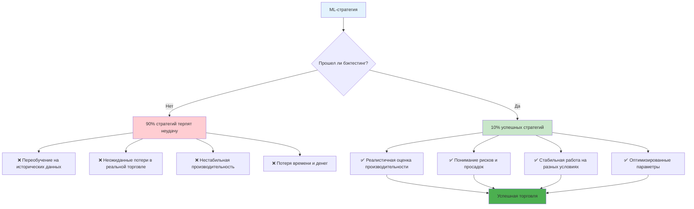
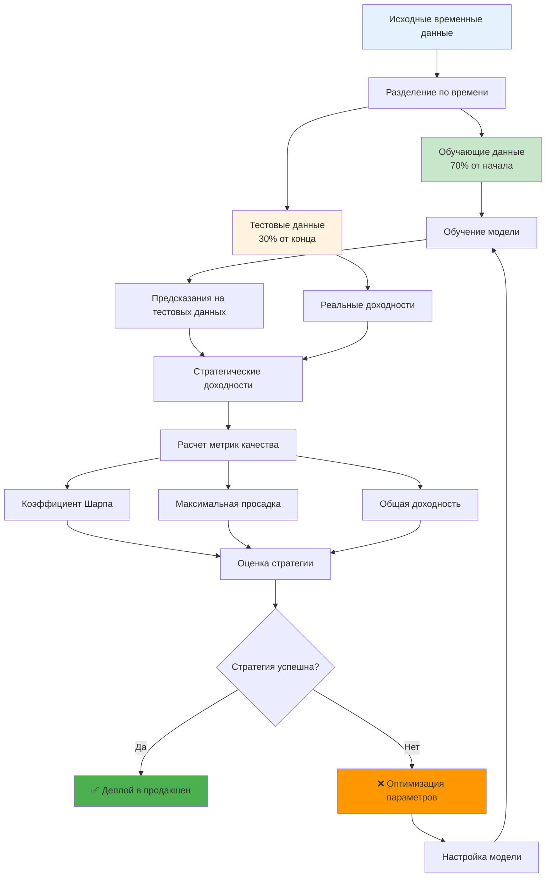
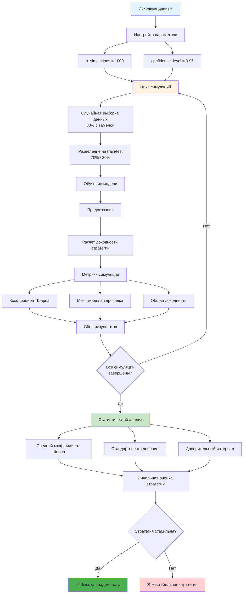
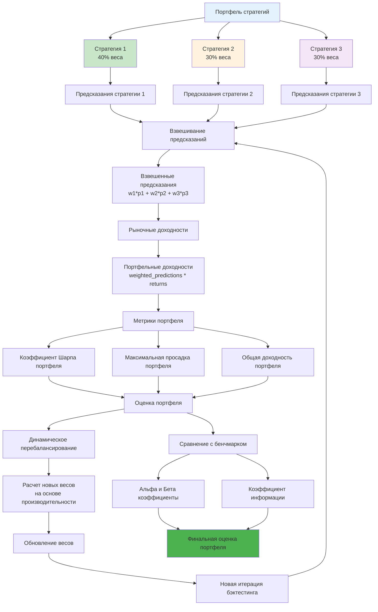
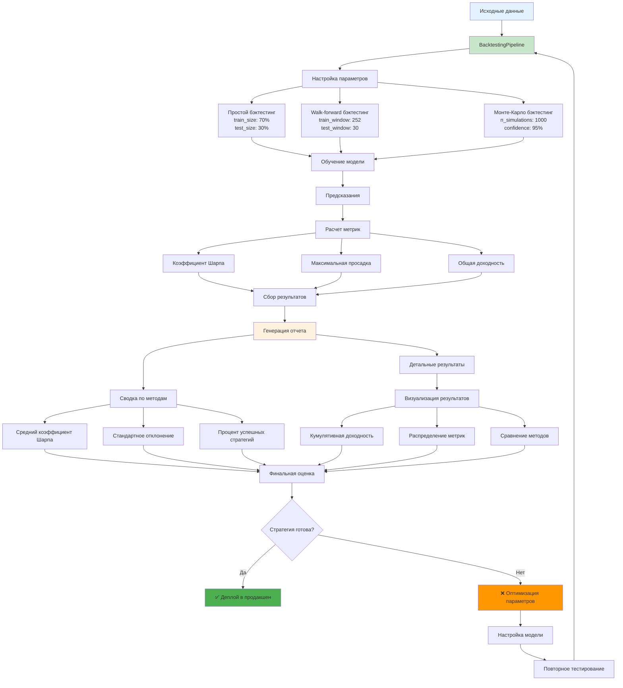

# Углубленное описание методик бэктестинга

**Автор:** Shcherbyna Rostyslav  
**Дата:** 2024  

## Почему бэктестинг критически важен для ML-стратегий

### 🎯 Важность бэктестинга для успеха ML-стратегий



**Почему 90% ML-стратегий терпят неудачу в реальной торговле?** Потому что они не прошли правильный бэктестинг. Бэктестинг - это единственный способ проверить, будет ли ваша стратегия работать в реальных условиях.

### Что дает правильный бэктестинг?
- **Реалистичность**: Понимание реальной производительности стратегии
- **Робастность**: Проверка стабильности на разных рыночных условиях
- **Риск-менеджмент**: Оценка максимальных потерь и просадок
- **Оптимизация**: Настройка параметров для максимальной эффективности

### Что происходит без правильного бэктестинга?
- **Переобучение**: Стратегия работает только на исторических данных
- **Неожиданные потери**: Реальные результаты хуже ожидаемых
- **Нестабильность**: Стратегия работает нестабильно
- **Разочарование**: Потеря времени и денег

## Теоретические основы бэктестинга

### Математические принципы

**Бэктестинг как статистическая задача:**

```
P(Strategy|Historical_Data) = P(Returns|Parameters, Market_Conditions)
```

Где:
- `P(Strategy|Historical_Data)` - вероятность успеха стратегии на исторических данных
- `P(Returns|Parameters, Market_Conditions)` - распределение доходности при заданных параметрах и рыночных условиях

**Критерии качества бэктестинга:**

1. **Статистическая значимость**: p-value < 0.05
2. **Экономическая значимость**: Sharpe > 1.0
3. **Стабильность**: Максимальная просадка < 20%
4. **Робастность**: Результаты стабильны на разных периодах

### Типы бэктестинга

### 📊 Сравнение типов бэктестинга


**1. Простой бэктестинг (Simple Backtesting)**
- Обучение на исторических данных
- Тестирование на том же периоде
- Быстрый, но ненадежный

**2. Out-of-sample бэктестинг**
- Обучение на части данных
- Тестирование на оставшейся части
- Более реалистичный

**3. Walk-forward бэктестинг**
- Скользящее окно обучения
- Постоянное обновление модели
- Самый реалистичный

**4. Cross-validation бэктестинг**
- Множественные разбиения данных
- Статистическая валидация
- Наиболее надежный

## Продвинутые методики бэктестинга

### 1. Временные ряды бэктестинг

### ⏰ Процесс временного ряда бэктестинга



**Особенности временных рядов:**

```python
def time_series_backtest(data, model, train_size=0.7, test_size=0.3):
    """Бэктестинг для временных рядов"""
    # Разделение данных по времени
    split_point = int(len(data) * train_size)
    
    train_data = data[:split_point]
    test_data = data[split_point:]
    
    # Обучение модели
    model.fit(train_data)
    
    # Предсказания
    predictions = model.predict(test_data)
    
    # Оценка качества
    returns = test_data['returns']
    strategy_returns = predictions * returns
    
    # Метрики
    sharpe = strategy_returns.mean() / strategy_returns.std() * np.sqrt(252)
    max_drawdown = calculate_max_drawdown(strategy_returns)
    
    return {
        'sharpe': sharpe,
        'max_drawdown': max_drawdown,
        'total_return': strategy_returns.sum(),
        'predictions': predictions
    }

# Пример использования
results = time_series_backtest(data, model, train_size=0.7, test_size=0.3)
```

**Учет временных зависимостей:**

```python
def temporal_dependency_backtest(data, model, lookback=30, step=1):
    """Бэктестинг с учетом временных зависимостей"""
    results = []
    
    for i in range(lookback, len(data), step):
        # Обучающие данные
        train_data = data[i-lookback:i]
        
        # Тестовые данные
        test_data = data[i:i+step]
        
        # Обучение модели
        model.fit(train_data)
        
        # Предсказания
        predictions = model.predict(test_data)
        
        # Оценка качества
        returns = test_data['returns']
        strategy_returns = predictions * returns
        
        results.append({
            'date': test_data.index[0],
            'sharpe': strategy_returns.mean() / strategy_returns.std() * np.sqrt(252),
            'return': strategy_returns.sum()
        })
    
    return pd.DataFrame(results)

# Пример использования
results = temporal_dependency_backtest(data, model, lookback=30, step=1)
```

### 2. Монте-Карло бэктестинг

### 🎲 Процесс Монте-Карло бэктестинга



**Симуляция множественных сценариев:**

```python
def monte_carlo_backtest(data, model, n_simulations=1000, confidence_level=0.95):
    """Монте-Карло бэктестинг"""
    results = []
    
    for i in range(n_simulations):
        # Случайная выборка данных
        sample_data = data.sample(frac=0.8, replace=True)
        
        # Разделение на train/test
        split_point = int(len(sample_data) * 0.7)
        train_data = sample_data[:split_point]
        test_data = sample_data[split_point:]
        
        # Обучение модели
        model.fit(train_data)
        
        # Предсказания
        predictions = model.predict(test_data)
        
        # Оценка качества
        returns = test_data['returns']
        strategy_returns = predictions * returns
        
        sharpe = strategy_returns.mean() / strategy_returns.std() * np.sqrt(252)
        max_drawdown = calculate_max_drawdown(strategy_returns)
        
        results.append({
            'sharpe': sharpe,
            'max_drawdown': max_drawdown,
            'total_return': strategy_returns.sum()
        })
    
    # Статистический анализ
    results_df = pd.DataFrame(results)
    
    return {
        'mean_sharpe': results_df['sharpe'].mean(),
        'std_sharpe': results_df['sharpe'].std(),
        'confidence_interval': np.percentile(results_df['sharpe'], 
                                           [100*(1-confidence_level)/2, 
                                            100*(1+confidence_level)/2]),
        'results': results_df
    }

# Пример использования
mc_results = monte_carlo_backtest(data, model, n_simulations=1000, confidence_level=0.95)
```

**Бутстрап бэктестинг:**

```python
def bootstrap_backtest(data, model, n_bootstrap=1000, block_size=10):
    """Бутстрап бэктестинг с блоками"""
    results = []
    
    for i in range(n_bootstrap):
        # Создание бутстрап выборки с блоками
        bootstrap_data = []
        
        for j in range(0, len(data), block_size):
            block = data[j:j+block_size]
            if len(block) == block_size:
                bootstrap_data.append(block)
        
        bootstrap_data = pd.concat(bootstrap_data)
        
        # Разделение на train/test
        split_point = int(len(bootstrap_data) * 0.7)
        train_data = bootstrap_data[:split_point]
        test_data = bootstrap_data[split_point:]
        
        # Обучение модели
        model.fit(train_data)
        
        # Предсказания
        predictions = model.predict(test_data)
        
        # Оценка качества
        returns = test_data['returns']
        strategy_returns = predictions * returns
        
        sharpe = strategy_returns.mean() / strategy_returns.std() * np.sqrt(252)
        max_drawdown = calculate_max_drawdown(strategy_returns)
        
        results.append({
            'sharpe': sharpe,
            'max_drawdown': max_drawdown,
            'total_return': strategy_returns.sum()
        })
    
    return pd.DataFrame(results)

# Пример использования
bootstrap_results = bootstrap_backtest(data, model, n_bootstrap=1000, block_size=10)
```

### 3. Стресс-тестинг

### ⚡ Сценарии стресс-тестинга


**Тестирование на экстремальных условиях:**

```python
def stress_test_backtest(data, model, stress_scenarios):
    """Стресс-тестинг стратегии"""
    results = {}
    
    for scenario_name, scenario_data in stress_scenarios.items():
        # Применение стрессового сценария
        stressed_data = apply_stress_scenario(data, scenario_data)
        
        # Обучение модели
        model.fit(stressed_data)
        
        # Предсказания
        predictions = model.predict(stressed_data)
        
        # Оценка качества
        returns = stressed_data['returns']
        strategy_returns = predictions * returns
        
        sharpe = strategy_returns.mean() / strategy_returns.std() * np.sqrt(252)
        max_drawdown = calculate_max_drawdown(strategy_returns)
        
        results[scenario_name] = {
            'sharpe': sharpe,
            'max_drawdown': max_drawdown,
            'total_return': strategy_returns.sum()
        }
    
    return results

# Пример использования
stress_scenarios = {
    'market_crash': {'volatility_multiplier': 3.0, 'return_shift': -0.1},
    'high_volatility': {'volatility_multiplier': 2.0, 'return_shift': 0.0},
    'low_volatility': {'volatility_multiplier': 0.5, 'return_shift': 0.0}
}

stress_results = stress_test_backtest(data, model, stress_scenarios)
```

**Тестирование на разных рыночных режимах:**

```python
def regime_based_backtest(data, model, regime_detector):
    """Бэктестинг на разных рыночных режимах"""
    # Определение режимов
    regimes = regime_detector.detect_regimes(data)
    
    results = {}
    
    for regime in regimes.unique():
        regime_data = data[regimes == regime]
        
        # Разделение на train/test
        split_point = int(len(regime_data) * 0.7)
        train_data = regime_data[:split_point]
        test_data = regime_data[split_point:]
        
        # Обучение модели
        model.fit(train_data)
        
        # Предсказания
        predictions = model.predict(test_data)
        
        # Оценка качества
        returns = test_data['returns']
        strategy_returns = predictions * returns
        
        sharpe = strategy_returns.mean() / strategy_returns.std() * np.sqrt(252)
        max_drawdown = calculate_max_drawdown(strategy_returns)
        
        results[regime] = {
            'sharpe': sharpe,
            'max_drawdown': max_drawdown,
            'total_return': strategy_returns.sum()
        }
    
    return results

# Пример использования
regime_results = regime_based_backtest(data, model, regime_detector)
```

### 4. Портфельный бэктестинг

### 📈 Архитектура портфельного бэктестинга



**Тестирование портфеля стратегий:**

```python
def portfolio_backtest(strategies, data, weights=None, rebalance_freq='M'):
    """Бэктестинг портфеля стратегий"""
    if weights is None:
        weights = np.ones(len(strategies)) / len(strategies)
    
    # Получение предсказаний от всех стратегий
    predictions = {}
    for i, strategy in enumerate(strategies):
        predictions[f'strategy_{i}'] = strategy.predict(data)
    
    # Создание DataFrame с предсказаниями
    predictions_df = pd.DataFrame(predictions)
    
    # Взвешивание предсказаний
    weighted_predictions = (predictions_df * weights).sum(axis=1)
    
    # Расчет доходности портфеля
    returns = data['returns']
    portfolio_returns = weighted_predictions * returns
    
    # Метрики портфеля
    sharpe = portfolio_returns.mean() / portfolio_returns.std() * np.sqrt(252)
    max_drawdown = calculate_max_drawdown(portfolio_returns)
    
    return {
        'sharpe': sharpe,
        'max_drawdown': max_drawdown,
        'total_return': portfolio_returns.sum(),
        'portfolio_returns': portfolio_returns,
        'individual_returns': predictions_df * returns
    }

# Пример использования
portfolio_results = portfolio_backtest(strategies, data, weights=[0.4, 0.3, 0.3])
```

**Динамическое перебалансирование:**

```python
def dynamic_rebalance_backtest(strategies, data, rebalance_freq='M', 
                              lookback_window=252):
    """Бэктестинг с динамическим перебалансированием"""
    results = []
    
    for i in range(lookback_window, len(data), 30):  # Перебалансировка каждый месяц
        # Обучающие данные
        train_data = data[i-lookback_window:i]
        
        # Тестовые данные
        test_data = data[i:i+30]
        
        # Обучение всех стратегий
        strategy_predictions = {}
        for j, strategy in enumerate(strategies):
            strategy.fit(train_data)
            strategy_predictions[f'strategy_{j}'] = strategy.predict(test_data)
        
        # Расчет весов на основе производительности
        weights = calculate_dynamic_weights(strategy_predictions, train_data)
        
        # Взвешивание предсказаний
        weighted_predictions = sum(w * p for w, p in zip(weights, strategy_predictions.values()))
        
        # Расчет доходности
        returns = test_data['returns']
        portfolio_returns = weighted_predictions * returns
        
        results.append({
            'date': test_data.index[0],
            'sharpe': portfolio_returns.mean() / portfolio_returns.std() * np.sqrt(252),
            'return': portfolio_returns.sum(),
            'weights': weights
        })
    
    return pd.DataFrame(results)

# Пример использования
dynamic_results = dynamic_rebalance_backtest(strategies, data, rebalance_freq='M')
```

## Метрики качества бэктестинга

### 📊 Классификация метрик качества бэктестинга

```mermaid
graph TD
    A[Метрики качества бэктестинга] --> B[Базовые метрики]
    A --> C[Продвинутые метрики]
    A --> D[Метрики производительности]
    
    B --> B1[Доходность и риск]
    B1 --> B11[Общая доходность]
    B1 --> B12[Годовая доходность]
    B1 --> B13[Волатильность]
    B1 --> B14[Коэффициент Шарпа]
    B1 --> B15[Максимальная просадка]
    B1 --> B16[Коэффициент Сортино]
    
    C --> C1[Метрики стабильности]
    C1 --> C11[Скользящий коэффициент Шарпа]
    C1 --> C12[Стабильность коэффициента Шарпа]
    C1 --> C13[Коэффициент вариации]
    C1 --> C14[Коэффициент стабильности]
    
    C --> C2[Метрики риска]
    C2 --> C21[Value at Risk - VaR]
    C2 --> C22[Conditional VaR - CVaR]
    C2 --> C23[Expected Shortfall]
    C2 --> C24[Коэффициент Кальмара]
    C2 --> C25[Коэффициент Стерлинга]
    
    D --> D1[Метрики эффективности]
    D1 --> D11[Коэффициент бета]
    D1 --> D12[Коэффициент альфа]
    D1 --> D13[Коэффициент информации]
    D1 --> D14[Коэффициент Трейнора]
    D1 --> D15[Коэффициент Дженсена]
    
    style A fill:#e3f2fd
    style B fill:#c8e6c9
    style C fill:#fff3e0
    style D fill:#f3e5f5
```



### 1. Базовые метрики

**Доходность и риск:**

```python
def calculate_basic_metrics(returns):
    """Расчет базовых метрик"""
    # Общая доходность
    total_return = returns.sum()
    
    # Годовая доходность
    annual_return = returns.mean() * 252
    
    # Волатильность
    volatility = returns.std() * np.sqrt(252)
    
    # Коэффициент Шарпа
    sharpe = annual_return / volatility if volatility > 0 else 0
    
    # Максимальная просадка
    max_drawdown = calculate_max_drawdown(returns)
    
    # Коэффициент Сортино
    downside_returns = returns[returns < 0]
    downside_volatility = downside_returns.std() * np.sqrt(252)
    sortino = annual_return / downside_volatility if downside_volatility > 0 else 0
    
    return {
        'total_return': total_return,
        'annual_return': annual_return,
        'volatility': volatility,
        'sharpe': sharpe,
        'max_drawdown': max_drawdown,
        'sortino': sortino
    }

# Пример использования
metrics = calculate_basic_metrics(strategy_returns)
```

**Расчет максимальной просадки:**

```python
def calculate_max_drawdown(returns):
    """Расчет максимальной просадки"""
    cumulative = (1 + returns).cumprod()
    running_max = cumulative.expanding().max()
    drawdown = (cumulative - running_max) / running_max
    return drawdown.min()

# Пример использования
max_dd = calculate_max_drawdown(strategy_returns)
```

### 2. Продвинутые метрики

**Метрики стабильности:**

```python
def calculate_stability_metrics(returns, window=252):
    """Расчет метрик стабильности"""
    # Скользящий коэффициент Шарпа
    rolling_sharpe = returns.rolling(window).mean() / returns.rolling(window).std() * np.sqrt(252)
    
    # Стабильность коэффициента Шарпа
    sharpe_stability = 1 / rolling_sharpe.std() if rolling_sharpe.std() > 0 else 0
    
    # Коэффициент вариации
    cv = returns.std() / abs(returns.mean()) if returns.mean() != 0 else 0
    
    # Коэффициент стабильности
    stability = 1 / cv if cv > 0 else 0
    
    return {
        'sharpe_stability': sharpe_stability,
        'coefficient_of_variation': cv,
        'stability': stability,
        'rolling_sharpe': rolling_sharpe
    }

# Пример использования
stability_metrics = calculate_stability_metrics(strategy_returns, window=252)
```

**Метрики риска:**

```python
def calculate_risk_metrics(returns, confidence_level=0.95):
    """Расчет метрик риска"""
    # Value at Risk (VaR)
    var = np.percentile(returns, 100 * (1 - confidence_level))
    
    # Conditional Value at Risk (CVaR)
    cvar = returns[returns <= var].mean()
    
    # Expected Shortfall
    es = returns[returns <= var].mean()
    
    # Коэффициент Кальмара
    calmar = returns.mean() * 252 / abs(calculate_max_drawdown(returns))
    
    # Коэффициент Стерлинга
    sterling = returns.mean() * 252 / abs(returns.min())
    
    return {
        'var': var,
        'cvar': cvar,
        'expected_shortfall': es,
        'calmar': calmar,
        'sterling': sterling
    }

# Пример использования
risk_metrics = calculate_risk_metrics(strategy_returns, confidence_level=0.95)
```

### 3. Метрики производительности

**Метрики эффективности:**

```python
def calculate_efficiency_metrics(returns, benchmark_returns):
    """Расчет метрик эффективности"""
    # Коэффициент бета
    beta = np.cov(returns, benchmark_returns)[0, 1] / np.var(benchmark_returns)
    
    # Коэффициент альфа
    alpha = returns.mean() - beta * benchmark_returns.mean()
    
    # Коэффициент информации
    excess_returns = returns - benchmark_returns
    information_ratio = excess_returns.mean() / excess_returns.std()
    
    # Коэффициент Трейнора
    treynor = returns.mean() / beta if beta != 0 else 0
    
    # Коэффициент Дженсена
    jensen = alpha
    
    return {
        'beta': beta,
        'alpha': alpha,
        'information_ratio': information_ratio,
        'treynor': treynor,
        'jensen': jensen
    }

# Пример использования
efficiency_metrics = calculate_efficiency_metrics(strategy_returns, benchmark_returns)
```

## Валидация результатов бэктестинга

### 🔍 Процесс валидации результатов бэктестинга


### 1. Статистическая валидация

**Тест на стационарность:**

```python
def test_stationarity(returns, significance_level=0.05):
    """Тест на стационарность временного ряда"""
    from statsmodels.tsa.stattools import adfuller
    
    # Тест Дики-Фуллера
    adf_result = adfuller(returns)
    
    # Тест КПСС
    from statsmodels.tsa.stattools import kpss
    kpss_result = kpss(returns)
    
    return {
        'adf_statistic': adf_result[0],
        'adf_pvalue': adf_result[1],
        'adf_stationary': adf_result[1] < significance_level,
        'kpss_statistic': kpss_result[0],
        'kpss_pvalue': kpss_result[1],
        'kpss_stationary': kpss_result[1] > significance_level
    }

# Пример использования
stationarity_test = test_stationarity(strategy_returns, significance_level=0.05)
```

**Тест на автокорреляцию:**

```python
def test_autocorrelation(returns, lags=20, significance_level=0.05):
    """Тест на автокорреляцию"""
    from statsmodels.stats.diagnostic import acorr_ljungbox
    
    # Тест Льюнга-Бокса
    ljung_box = acorr_ljungbox(returns, lags=lags, return_df=True)
    
    # Тест Дарбина-Уотсона
    from statsmodels.stats.diagnostic import durbin_watson
    dw_statistic = durbin_watson(returns)
    
    return {
        'ljung_box': ljung_box,
        'ljung_box_significant': ljung_box['lb_pvalue'].min() < significance_level,
        'durbin_watson': dw_statistic,
        'durbin_watson_autocorr': dw_statistic < 1.5 or dw_statistic > 2.5
    }

# Пример использования
autocorr_test = test_autocorrelation(strategy_returns, lags=20)
```

### 2. Экономическая валидация

**Тест на экономическую значимость:**

```python
def test_economic_significance(returns, transaction_costs=0.001, 
                              min_sharpe=1.0, max_drawdown=0.2):
    """Тест на экономическую значимость"""
    # Учет транзакционных издержек
    net_returns = returns - transaction_costs
    
    # Расчет метрик
    sharpe = net_returns.mean() / net_returns.std() * np.sqrt(252)
    max_dd = calculate_max_drawdown(net_returns)
    
    # Проверка критериев
    sharpe_significant = sharpe >= min_sharpe
    drawdown_acceptable = abs(max_dd) <= max_drawdown
    
    return {
        'sharpe': sharpe,
        'max_drawdown': max_dd,
        'sharpe_significant': sharpe_significant,
        'drawdown_acceptable': drawdown_acceptable,
        'economically_significant': sharpe_significant and drawdown_acceptable
    }

# Пример использования
economic_test = test_economic_significance(strategy_returns, transaction_costs=0.001)
```

**Тест на переобучение:**

```python
def test_overfitting(train_returns, test_returns, significance_level=0.05):
    """Тест на переобучение"""
    from scipy import stats
    
    # Сравнение производительности
    train_sharpe = train_returns.mean() / train_returns.std() * np.sqrt(252)
    test_sharpe = test_returns.mean() / test_returns.std() * np.sqrt(252)
    
    # Статистический тест
    t_stat, p_value = stats.ttest_ind(train_returns, test_returns)
    
    # Проверка на переобучение
    overfitting = train_sharpe > test_sharpe * 1.5 and p_value < significance_level
    
    return {
        'train_sharpe': train_sharpe,
        'test_sharpe': test_sharpe,
        'performance_degradation': train_sharpe - test_sharpe,
        't_statistic': t_stat,
        'p_value': p_value,
        'overfitting': overfitting
    }

# Пример использования
overfitting_test = test_overfitting(train_returns, test_returns)
```

## Автоматизация бэктестинга

### 🤖 Пайплайн автоматизации бэктестинга



### 1. Пайплайн бэктестинга

```python
class BacktestingPipeline:
    """Пайплайн для автоматизации бэктестинга"""
    
    def __init__(self, data, model, metrics_calculator):
        self.data = data
        self.model = model
        self.metrics_calculator = metrics_calculator
        self.results = {}
    
    def run_simple_backtest(self, train_size=0.7, test_size=0.3):
        """Простой бэктестинг"""
        # Разделение данных
        split_point = int(len(self.data) * train_size)
        train_data = self.data[:split_point]
        test_data = self.data[split_point:]
        
        # Обучение модели
        self.model.fit(train_data)
        
        # Предсказания
        predictions = self.model.predict(test_data)
        
        # Расчет метрик
        returns = test_data['returns']
        strategy_returns = predictions * returns
        
        self.results['simple'] = self.metrics_calculator.calculate(strategy_returns)
        return self.results['simple']
    
    def run_walk_forward_backtest(self, train_window=252, test_window=30, step=30):
        """Walk-forward бэктестинг"""
        results = []
        
        for i in range(train_window, len(self.data) - test_window, step):
            # Обучающие данные
            train_data = self.data[i-train_window:i]
            
            # Тестовые данные
            test_data = self.data[i:i+test_window]
            
            # Обучение модели
            self.model.fit(train_data)
            
            # Предсказания
            predictions = self.model.predict(test_data)
            
            # Расчет метрик
            returns = test_data['returns']
            strategy_returns = predictions * returns
            
            metrics = self.metrics_calculator.calculate(strategy_returns)
            metrics['date'] = test_data.index[0]
            results.append(metrics)
        
        self.results['walk_forward'] = pd.DataFrame(results)
        return self.results['walk_forward']
    
    def run_monte_carlo_backtest(self, n_simulations=1000, confidence_level=0.95):
        """Монте-Карло бэктестинг"""
        results = []
        
        for i in range(n_simulations):
            # Случайная выборка данных
            sample_data = self.data.sample(frac=0.8, replace=True)
            
            # Разделение на train/test
            split_point = int(len(sample_data) * 0.7)
            train_data = sample_data[:split_point]
            test_data = sample_data[split_point:]
            
            # Обучение модели
            self.model.fit(train_data)
            
            # Предсказания
            predictions = self.model.predict(test_data)
            
            # Расчет метрик
            returns = test_data['returns']
            strategy_returns = predictions * returns
            
            metrics = self.metrics_calculator.calculate(strategy_returns)
            results.append(metrics)
        
        self.results['monte_carlo'] = pd.DataFrame(results)
        return self.results['monte_carlo']
    
    def generate_report(self):
        """Генерация отчета"""
        report = {
            'summary': {},
            'detailed_results': self.results
        }
        
        # Сводка по всем методам
        for method, results in self.results.items():
            if isinstance(results, pd.DataFrame):
                report['summary'][method] = {
                    'mean_sharpe': results['sharpe'].mean(),
                    'std_sharpe': results['sharpe'].std(),
                    'mean_max_drawdown': results['max_drawdown'].mean(),
                    'success_rate': (results['sharpe'] > 1.0).mean()
                }
            else:
                report['summary'][method] = results
        
        return report

# Пример использования
pipeline = BacktestingPipeline(data, model, metrics_calculator)
pipeline.run_simple_backtest()
pipeline.run_walk_forward_backtest()
pipeline.run_monte_carlo_backtest()
report = pipeline.generate_report()
```

### 2. Визуализация результатов

```python
def visualize_backtest_results(results, save_path=None):
    """Визуализация результатов бэктестинга"""
    import matplotlib.pyplot as plt
    import seaborn as sns
    
    # Настройка стиля
    plt.style.use('seaborn-v0_8')
    sns.set_palette("husl")
    
    # Создание фигуры
    fig, axes = plt.subplots(2, 2, figsize=(15, 10))
    
    # 1. Кумулятивная доходность
    if 'walk_forward' in results:
        cumulative_returns = (1 + results['walk_forward']['return']).cumprod()
        axes[0, 0].plot(cumulative_returns.index, cumulative_returns.values)
        axes[0, 0].set_title('Кумулятивная доходность')
        axes[0, 0].set_xlabel('Дата')
        axes[0, 0].set_ylabel('Кумулятивная доходность')
    
    # 2. Распределение коэффициента Шарпа
    if 'monte_carlo' in results:
        axes[0, 1].hist(results['monte_carlo']['sharpe'], bins=50, alpha=0.7)
        axes[0, 1].axvline(results['monte_carlo']['sharpe'].mean(), 
                          color='red', linestyle='--', label='Среднее')
        axes[0, 1].set_title('Распределение коэффициента Шарпа')
        axes[0, 1].set_xlabel('Коэффициент Шарпа')
        axes[0, 1].set_ylabel('Частота')
        axes[0, 1].legend()
    
    # 3. Максимальная просадка
    if 'walk_forward' in results:
        axes[1, 0].plot(results['walk_forward']['date'], 
                       results['walk_forward']['max_drawdown'])
        axes[1, 0].set_title('Максимальная просадка')
        axes[1, 0].set_xlabel('Дата')
        axes[1, 0].set_ylabel('Максимальная просадка')
    
    # 4. Сравнение методов
    if 'simple' in results and 'walk_forward' in results:
        methods = ['Simple', 'Walk Forward']
        sharpe_values = [
            results['simple']['sharpe'],
            results['walk_forward']['sharpe'].mean()
        ]
        axes[1, 1].bar(methods, sharpe_values)
        axes[1, 1].set_title('Сравнение методов')
        axes[1, 1].set_ylabel('Коэффициент Шарпа')
    
    plt.tight_layout()
    
    if save_path:
        plt.savefig(save_path, dpi=300, bbox_inches='tight')
    
    plt.show()

# Пример использования
visualize_backtest_results(results, save_path='backtest_results.png')
```

## Заключение

Правильный бэктестинг - это основа успешной ML-стратегии. Он позволяет:

1. **Проверить реалистичность** стратегии
2. **Оценить риски** и потенциальные потери
3. **Оптимизировать параметры** для максимальной эффективности
4. **Валидировать стабильность** на разных рыночных условиях

### Ключевые принципы:

1. **Реалистичность** - используйте реалистичные данные и условия
2. **Статистическая значимость** - проверяйте значимость результатов
3. **Экономическая значимость** - учитывайте транзакционные издержки
4. **Робастность** - тестируйте на разных рыночных условиях
5. **Валидация** - проверяйте результаты на out-of-sample данных

### Следующие шаги:

После освоения бэктестинга переходите к:
- [Walk-forward анализу](./28_walk_forward_analysis.md)
- [Monte Carlo симуляциям](./29_monte_carlo_simulations.md)
- [Управлению портфолио](./30_portfolio_management.md)
