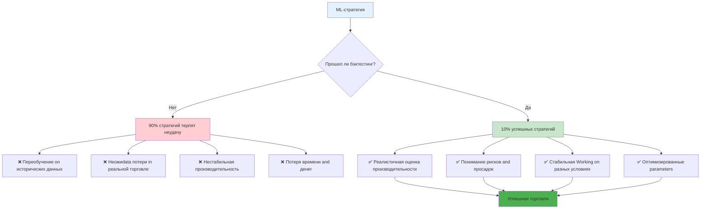
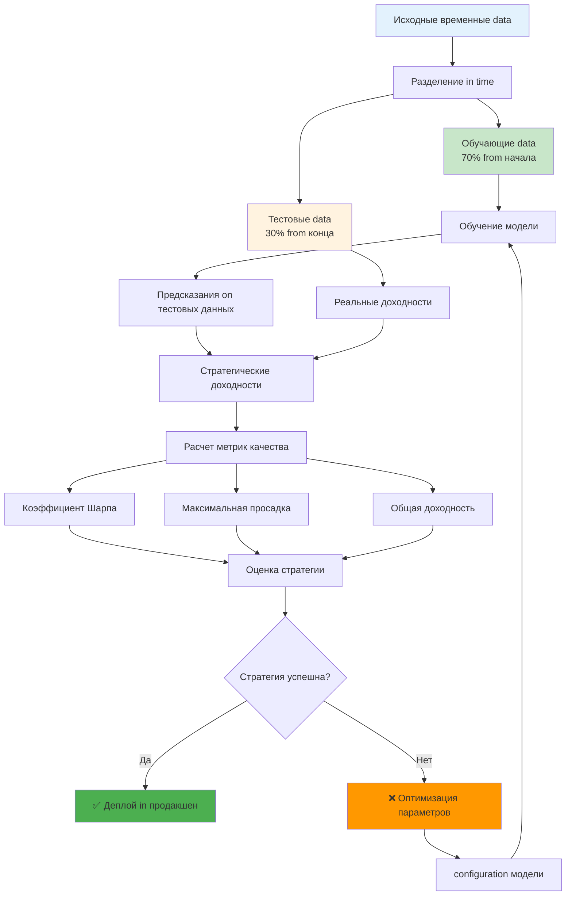
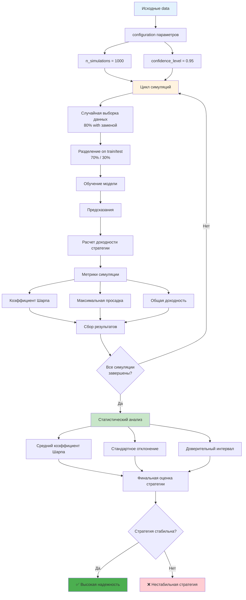
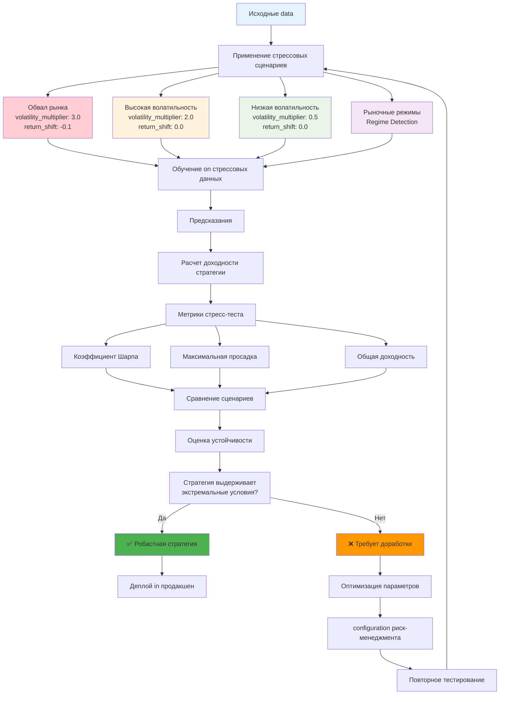
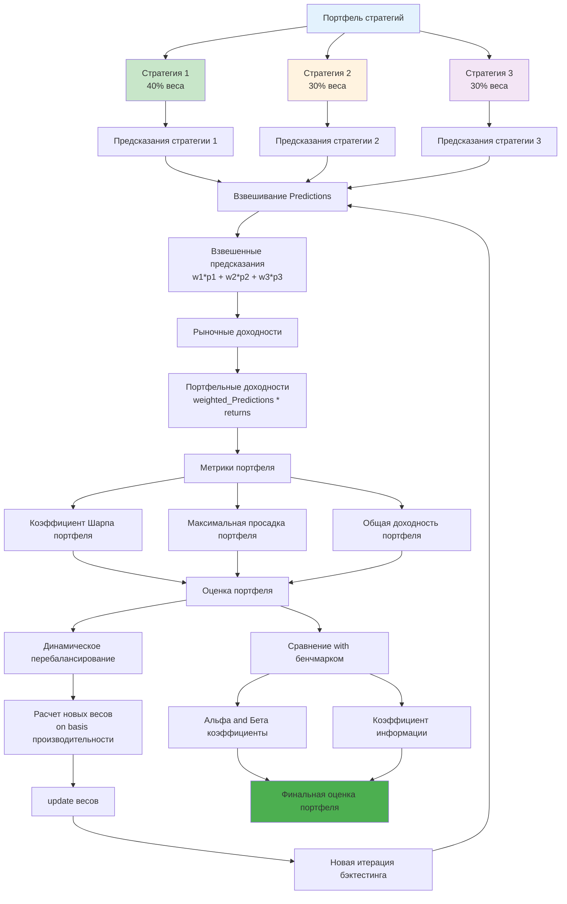
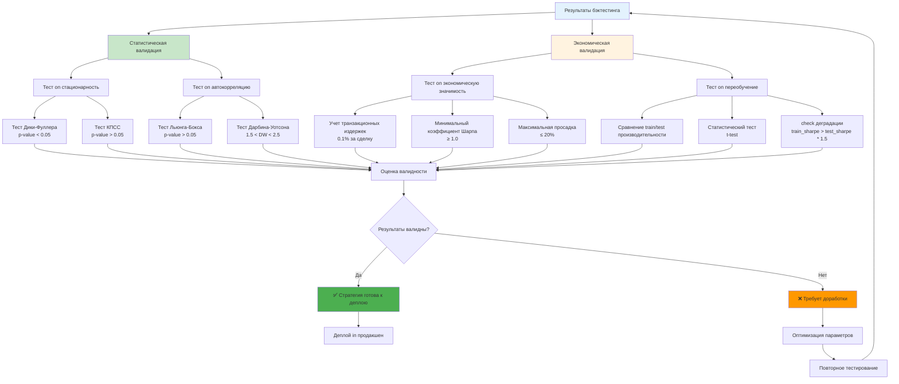
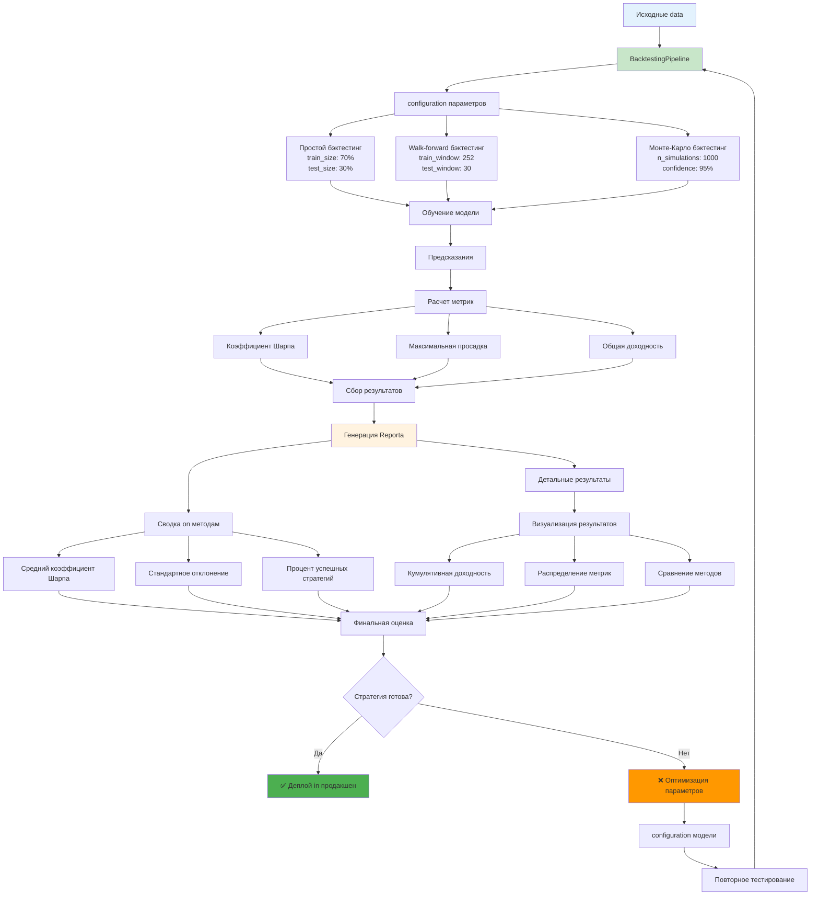

# Углубленное description методик бэктестинга

**Author:** Shcherbyna Rostyslav
**Дата:** 2024

## Why бэктестинг критически важен for ML-стратегий

### 🎯 Важность бэктестинга for успеха ML-стратегий



**Почему 90% ML-стратегий терпят неудачу in реальной торговле?** Потому что они not прошли правильный бэктестинг. Бэктестинг - это единственный способ проверить, будет ли ваша стратегия Workingть in реальных условиях.

### Что дает правильный бэктестинг?

- **Реалистичность**: Понимание реальной производительности стратегии
- **Робастность**: check стабильности on разных рыночных условиях
- **Риск-менеджмент**: Оценка максимальных потерь and просадок
- **Оптимизация**: configuration параметров for максимальной эффективности

### Что происходит без правильного бэктестинга?

- **Переобучение**: Стратегия Workingет только on исторических данных
- **Неожиdata потери**: Реальные результаты хуже ожидаемых
- **Нестабильность**: Стратегия Workingет нестабильно
- **Разочарование**: Потеря времени and денег

## Теоретические основы бэктестинга

### Математические принципы

**Бэктестинг как статистическая задача:**

```math
P(Strategy|Historical_data) = P(Returns|Parameters, Market_Conditions)
```

Где:

- `P(Strategy|Historical_data)` - вероятность успеха стратегии on исторических данных
- `P(Returns|Parameters, Market_Conditions)` - распределение доходности при заданных параметрах and рыночных условиях

**Критерии качества бэктестинга:**

1. **Статистическая значимость**: p-value < 0.05
2. **Экономическая значимость**: Sharpe > 1.0
3. **Стабильность**: Максимальная просадка < 20%
4. **Робастность**: Результаты стабильны on разных периодах

### Типы бэктестинга

### 📊 Сравнение типов бэктестинга

```mermaid
graph TB
 A[Типы бэктестинга] --> B[Простой бэктестинг]
 A --> C[Out-of-sample бэктестинг]
 A --> D[Walk-forward бэктестинг]
 A --> E[Cross-validation бэктестинг]

 B --> B1[Обучение on исторических данных]
 B --> B2[Тестирование on том же периоде]
 B --> B3[⚡ Быстрый]
 B --> B4[❌ Ненадежный]
 B --> B5[❌ Переобучение]

 C --> C1[Обучение on части данных]
 C --> C2[Тестирование on оставшейся части]
 C --> C3[✅ Более реалистичный]
 C --> C4[⚠️ Один разбиение]
 C --> C5[📈 Лучше простого]

 D --> D1[Скользящее окно обучения]
 D --> D2[Постоянное update модели]
 D --> D3[✅ Самый реалистичный]
 D --> D4[✅ Множественные тесты]
 D --> D5[🎯 Имитация реальной торговли]

 E --> E1[Множественные разбиения данных]
 E --> E2[Статистическая валидация]
 E --> E3[✅ Наиболее надежный]
 E --> E4[✅ Статистическая значимость]
 E --> E5[🔬 Научный подход]

 style B fill:#ffcdd2
 style C fill:#fff3e0
 style D fill:#c8e6c9
 style E fill:#4caf50
```



### 1. Простой бэктестинг (Simple Backtesting)

- Обучение on исторических данных
- Тестирование on том же периоде
- Быстрый, но ненадежный

### 2. Out-of-sample бэктестинг

- Обучение on части данных
- Тестирование on оставшейся части
- Более реалистичный

### 3. Walk-forward бэктестинг

- Скользящее окно обучения
- Постоянное update модели
- Самый реалистичный

### 4. Cross-validation бэктестинг

- Множественные разбиения данных
- Статистическая валидация
- Наиболее надежный

## Продвинутые методики бэктестинга

### 1. Временные ряды бэктестинг

### ⏰ Процесс временного ряда бэктестинга



**Особенности временных рядов:**

```python
def time_series_backtest(data, model, train_size=0.7, test_size=0.3,
 config=None, validation=True, random_state=None):
 """
 Бэктестинг for временных рядов with детальными параметрами

 Parameters:
 -----------
 data : pd.dataFrame
 Временной ряд данных with колонками 'returns' and другими приsignми
 - Должен быть отсортирован in time
 - Должен содержать колонку 'returns' with доходностями
 - Рекомендуется минимум 1000 наблюдений for надежности

 model : object
 Обученная ML модель with методами fit() and predict()
 - Должен поддерживать fit(X, y) for обучения
 - Должен поддерживать predict(X) for Predictions
 - Рекомендуется использовать TabularPredictor из AutoGluon

 train_size : float, default=0.7
 Доля данных for обучения (0.0 < train_size < 1.0)
 - 0.7 означает 70% данных for обучения
 - Рекомендуется 0.6-0.8 for большинства случаев
 - Меньше 0.6 может привести к переобучению
 - Больше 0.8 может привести к недообучению

 test_size : float, default=0.3
 Доля данных for тестирования (0.0 < test_size < 1.0)
 - 0.3 означает 30% данных for тестирования
 - Должно быть равно 1.0 - train_size
 - Рекомендуется минимум 0.2 for надежности

 config : dict, optional
 Дополнительная configuration for бэктестинга
 - 'min_train_samples': int, default=100 - минимальное количество обучающих образцов
 - 'min_test_samples': int, default=50 - минимальное количество тестовых образцов
 - 'shuffle': bool, default=False - перемешивать ли data (not рекомендуется for временных рядов)
 - 'stratify': bool, default=False - стратифицированное разделение
 - 'return_Predictions': bool, default=True - возвращать предсказания
 - 'return_metrics': bool, default=True - возвращать метрики
 - 'verbose': bool, default=False - выводить подробную информацию

 validation : bool, default=True
 Выполнять ли валидацию входных данных
 - Проверяет presence колонки 'returns'
 - Проверяет достаточность данных
 - Проверяет корректность train_size and test_size

 random_state : int, optional
 Seed for воспроизводимости результатов
 - Используется только если shuffle=True
 - Рекомендуется задавать for воспроизводимости

 Returns:
 --------
 dict
 Словарь with результатами бэктестинга:
 - 'sharpe': float - коэффициент Шарпа стратегии
 - 'max_drawdown': float - максимальная просадка (отрицательное значение)
 - 'total_return': float - общая доходность стратегии
 - 'annual_return': float - годовая доходность
 - 'volatility': float - волатильность стратегии
 - 'Predictions': np.array - предсказания модели (если return_Predictions=True)
 - 'train_metrics': dict - метрики on обучающих данных
 - 'test_metrics': dict - метрики on тестовых данных
 - 'config_Used': dict - использованная configuration

 Raises:
 -------
 ValueError
 Если data недостаточны or parameters некорректны
 TypeError
 Если модель not поддерживает необходимые методы

 Examples:
 ---------
 >>> # Базовое использование
 >>> results = time_series_backtest(data, model)
 >>>
 >>> # with кастомной конфигурацией
 >>> config = {
 ... 'min_train_samples': 200,
 ... 'min_test_samples': 100,
 ... 'verbose': True
 ... }
 >>> results = time_series_backtest(data, model, train_size=0.8, config=config)
 >>>
 >>> # Без валидации (быстрее, но менее безопасно)
 >>> results = time_series_backtest(data, model, validation=False)
 """
 # configuration on умолчанию
 if config is None:
 config = {
 'min_train_samples': 100,
 'min_test_samples': 50,
 'shuffle': False,
 'stratify': False,
 'return_Predictions': True,
 'return_metrics': True,
 'verbose': False
 }

 # Валидация входных данных
 if validation:
 if 'returns' not in data.columns:
 raise ValueError("Колонка 'returns' not foundа in данных")

 if len(data) < config['min_train_samples'] + config['min_test_samples']:
 raise ValueError(f"Недостаточно данных. Минимум: {config['min_train_samples'] + config['min_test_samples']}")

 if not (0 < train_size < 1) or not (0 < test_size < 1):
 raise ValueError("train_size and test_size должны быть между 0 and 1")

 if abs(train_size + test_size - 1.0) > 1e-6:
 raise ValueError("train_size + test_size должно равняться 1.0")

 # Разделение данных in time
 split_point = int(len(data) * train_size)

 train_data = data[:split_point]
 test_data = data[split_point:]

 # check минимального количества образцов
 if len(train_data) < config['min_train_samples']:
 raise ValueError(f"Недостаточно обучающих данных: {len(train_data)} < {config['min_train_samples']}")

 if len(test_data) < config['min_test_samples']:
 raise ValueError(f"Недостаточно тестовых данных: {len(test_data)} < {config['min_test_samples']}")

 if config['verbose']:
 print(f"Обучающих образцов: {len(train_data)}")
 print(f"Тестовых образцов: {len(test_data)}")

 # Обучение модели
 try:
 model.fit(train_data)
 except Exception as e:
 raise TypeError(f"Ошибка обучения модели: {e}")

 # Предсказания
 try:
 Predictions = model.predict(test_data)
 except Exception as e:
 raise TypeError(f"Ошибка предсказания модели: {e}")

 # Оценка качества
 returns = test_data['returns']
 strategy_returns = Predictions * returns

 # Базовые метрики
 sharpe = strategy_returns.mean() / strategy_returns.std() * np.sqrt(252) if strategy_returns.std() > 0 else 0
 max_drawdown = calculate_max_drawdown(strategy_returns)
 total_return = strategy_returns.sum()
 annual_return = strategy_returns.mean() * 252
 volatility = strategy_returns.std() * np.sqrt(252)

 # Результаты
 results = {
 'sharpe': sharpe,
 'max_drawdown': max_drawdown,
 'total_return': total_return,
 'annual_return': annual_return,
 'volatility': volatility,
 'config_Used': config.copy()
 }

 # Дополнительные результаты
 if config['return_Predictions']:
 results['Predictions'] = Predictions

 if config['return_metrics']:
 # Метрики on обучающих данных
 train_returns = train_data['returns']
 train_Predictions = model.predict(train_data)
 train_strategy_returns = train_Predictions * train_returns

 results['train_metrics'] = {
 'sharpe': train_strategy_returns.mean() / train_strategy_returns.std() * np.sqrt(252) if train_strategy_returns.std() > 0 else 0,
 'max_drawdown': calculate_max_drawdown(train_strategy_returns),
 'total_return': train_strategy_returns.sum(),
 'annual_return': train_strategy_returns.mean() * 252,
 'volatility': train_strategy_returns.std() * np.sqrt(252)
 }

 # Метрики on тестовых данных
 results['test_metrics'] = {
 'sharpe': sharpe,
 'max_drawdown': max_drawdown,
 'total_return': total_return,
 'annual_return': annual_return,
 'volatility': volatility
 }

 return results

# example использования
results = time_series_backtest(data, model, train_size=0.7, test_size=0.3)
```

**Учет временных зависимостей:**

```python
def temporal_dependency_backtest(data, model, lookback=30, step=1,
 config=None, validation=True, random_state=None):
 """
 Бэктестинг with учетом временных зависимостей and детальными параметрами

 Parameters:
 -----------
 data : pd.dataFrame
 Временной ряд данных with колонками 'returns' and другими приsignми
 - Должен быть отсортирован in time
 - Должен содержать колонку 'returns' with доходностями
 - Рекомендуется минимум 1000 наблюдений for надежности

 model : object
 Обученная ML модель with методами fit() and predict()
 - Должен поддерживать fit(X, y) for обучения
 - Должен поддерживать predict(X) for Predictions
 - Рекомендуется использовать TabularPredictor из AutoGluon

 lookback : int, default=30
 Количество periods for обучения (lookback window)
 - 30 означает обучение on последних 30 периодах
 - Рекомендуется 20-50 for большинства случаев
 - Меньше 20 может привести к переобучению
 - Больше 50 может привести к недообучению

 step : int, default=1
 Шаг между итерациями бэктестинга
 - 1 означает тестирование каждого периода
 - Больше 1 означает пропуск periods
 - Рекомендуется 1 for максимальной точности
 - Больше 1 for acceleration (но менее точно)

 config : dict, optional
 Дополнительная configuration for бэктестинга
 - 'min_lookback': int, default=20 - минимальный размер окна обучения
 - 'max_lookback': int, default=100 - максимальный размер окна обучения
 - 'min_step': int, default=1 - минимальный шаг
 - 'max_step': int, default=10 - максимальный шаг
 - 'return_Predictions': bool, default=False - возвращать предсказания
 - 'return_metrics': bool, default=True - возвращать метрики
 - 'verbose': bool, default=False - выводить подробную информацию
 - 'parallel': bool, default=False - использовать параллельные вычисления
 - 'n_jobs': int, default=1 - количество процессов for параллельных вычислений

 validation : bool, default=True
 Выполнять ли валидацию входных данных
 - Проверяет presence колонки 'returns'
 - Проверяет достаточность данных
 - Проверяет корректность lookback and step

 random_state : int, optional
 Seed for воспроизводимости результатов
 - Используется for инициализации модели
 - Рекомендуется задавать for воспроизводимости

 Returns:
 --------
 pd.dataFrame
 dataFrame with результатами бэктестинга:
 - 'date': datetime - дата тестирования
 - 'sharpe': float - коэффициент Шарпа стратегии
 - 'return': float - доходность стратегии
 - 'volatility': float - волатильность стратегии
 - 'max_drawdown': float - максимальная просадка
 - 'Predictions': np.array - предсказания модели (если return_Predictions=True)
 - 'train_size': int - размер обучающей выборки
 - 'test_size': int - размер тестовой выборки

 Raises:
 -------
 ValueError
 Если data недостаточны or parameters некорректны
 TypeError
 Если модель not поддерживает необходимые методы

 Examples:
 ---------
 >>> # Базовое использование
 >>> results = temporal_dependency_backtest(data, model)
 >>>
 >>> # with кастомной конфигурацией
 >>> config = {
 ... 'min_lookback': 50,
 ... 'max_lookback': 200,
 ... 'verbose': True,
 ... 'parallel': True,
 ... 'n_jobs': 4
 ... }
 >>> results = temporal_dependency_backtest(data, model, lookback=50, step=5, config=config)
 >>>
 >>> # Без валидации (быстрее, но менее безопасно)
 >>> results = temporal_dependency_backtest(data, model, validation=False)
 """
 # configuration on умолчанию
 if config is None:
 config = {
 'min_lookback': 20,
 'max_lookback': 100,
 'min_step': 1,
 'max_step': 10,
 'return_Predictions': False,
 'return_metrics': True,
 'verbose': False,
 'parallel': False,
 'n_jobs': 1
 }

 # Валидация входных данных
 if validation:
 if 'returns' not in data.columns:
 raise ValueError("Колонка 'returns' not foundа in данных")

 if len(data) < lookback + step:
 raise ValueError(f"Недостаточно данных. Минимум: {lookback + step}")

 if not (config['min_lookback'] <= lookback <= config['max_lookback']):
 raise ValueError(f"lookback должен быть между {config['min_lookback']} and {config['max_lookback']}")

 if not (config['min_step'] <= step <= config['max_step']):
 raise ValueError(f"step должен быть между {config['min_step']} and {config['max_step']}")

 # Подготовка данных
 results = []
 total_iterations = (len(data) - lookback) // step

 if config['verbose']:
 print(f"Начинаем бэктестинг with {total_iterations} итерациями")
 print(f"Окно обучения: {lookback} periods")
 print(f"Шаг: {step} periods")

 # Основной цикл бэктестинга
 for i in range(lookback, len(data) - step + 1, step):
 try:
 # Обучающие data
 train_data = data[i-lookback:i]

 # Тестовые data
 test_data = data[i:i+step]

 # Обучение модели
 model.fit(train_data)

 # Предсказания
 Predictions = model.predict(test_data)

 # Оценка качества
 returns = test_data['returns']
 strategy_returns = Predictions * returns

 # Базовые метрики
 sharpe = strategy_returns.mean() / strategy_returns.std() * np.sqrt(252) if strategy_returns.std() > 0 else 0
 total_return = strategy_returns.sum()
 volatility = strategy_returns.std() * np.sqrt(252)
 max_drawdown = calculate_max_drawdown(strategy_returns)

 # Результат итерации
 result = {
 'date': test_data.index[0],
 'sharpe': sharpe,
 'return': total_return,
 'volatility': volatility,
 'max_drawdown': max_drawdown,
 'train_size': len(train_data),
 'test_size': len(test_data)
 }

 # Дополнительные результаты
 if config['return_Predictions']:
 result['Predictions'] = Predictions

 results.append(result)

 if config['verbose'] and (i - lookback) % (step * 10) == 0:
 print(f"COMPLETED: {i - lookback + 1} из {total_iterations} итераций")

 except Exception as e:
 if config['verbose']:
 print(f"Ошибка on итерации {i}: {e}")
 continue

 if not results:
 raise ValueError("not удалось выполнить ни одной итерации бэктестинга")

 # create dataFrame
 results_df = pd.dataFrame(results)

 if config['verbose']:
 print(f"Бэктестинг завершен. Успешных итераций: {len(results_df)}")
 print(f"Средний коэффициент Шарпа: {results_df['sharpe'].mean():.4f}")
 print(f"Средняя доходность: {results_df['return'].mean():.4f}")

 return results_df

# example использования
results = temporal_dependency_backtest(data, model, lookback=30, step=1)
```

### 2. Монте-Карло бэктестинг

### 🎲 Процесс Монте-Карло бэктестинга



**Симуляция множественных сценариев:**

```python
def monte_carlo_backtest(data, model, n_simulations=1000, confidence_level=0.95,
 config=None, validation=True, random_state=None):
 """
 Монте-Карло бэктестинг with детальными параметрами

 Parameters:
 -----------
 data : pd.dataFrame
 Временной ряд данных with колонками 'returns' and другими приsignми
 - Должен быть отсортирован in time
 - Должен содержать колонку 'returns' with доходностями
 - Рекомендуется минимум 1000 наблюдений for надежности

 model : object
 Обученная ML модель with методами fit() and predict()
 - Должен поддерживать fit(X, y) for обучения
 - Должен поддерживать predict(X) for Predictions
 - Рекомендуется использовать TabularPredictor из AutoGluon

 n_simulations : int, default=1000
 Количество симуляций Монте-Карло
 - 1000 означает 1000 случайных выборок
 - Рекомендуется 500-2000 for большинства случаев
 - Меньше 500 может дать неточные результаты
 - Больше 2000 может быть избыточно медленным

 confidence_level : float, default=0.95
 Уровень доверия for доверительного интервала (0.0 < confidence_level < 1.0)
 - 0.95 означает 95% доверительный интервал
 - Рекомендуется 0.90-0.99 for большинства случаев
 - 0.90 дает более узкий интервал
 - 0.99 дает более широкий интервал

 config : dict, optional
 Дополнительная configuration for бэктестинга
 - 'sample_frac': float, default=0.8 - доля данных for выборки (0.0 < sample_frac < 1.0)
 - 'train_frac': float, default=0.7 - доля данных for обучения (0.0 < train_frac < 1.0)
 - 'test_frac': float, default=0.3 - доля данных for тестирования (0.0 < test_frac < 1.0)
 - 'min_samples': int, default=100 - минимальное количество образцов in выборке
 - 'max_samples': int, default=10000 - максимальное количество образцов in выборке
 - 'return_Predictions': bool, default=False - возвращать предсказания
 - 'return_metrics': bool, default=True - возвращать метрики
 - 'verbose': bool, default=False - выводить подробную информацию
 - 'parallel': bool, default=False - использовать параллельные вычисления
 - 'n_jobs': int, default=1 - количество процессов for параллельных вычислений
 - 'early_stopping': bool, default=False - остановка при достижении критерия
 - 'convergence_threshold': float, default=0.01 - порог сходимости for early_stopping

 validation : bool, default=True
 Выполнять ли валидацию входных данных
 - Проверяет presence колонки 'returns'
 - Проверяет достаточность данных
 - Проверяет корректность параметров

 random_state : int, optional
 Seed for воспроизводимости результатов
 - Используется for инициализации генератора случайных чисел
 - Рекомендуется задавать for воспроизводимости

 Returns:
 --------
 dict
 Словарь with результатами Монте-Карло бэктестинга:
 - 'mean_sharpe': float - средний коэффициент Шарпа
 - 'std_sharpe': float - стандартное отклонение коэффициента Шарпа
 - 'mean_max_drawdown': float - средняя максимальная просадка
 - 'std_max_drawdown': float - стандартное отклонение максимальной просадки
 - 'mean_total_return': float - средняя общая доходность
 - 'std_total_return': float - стандартное отклонение общей доходности
 - 'confidence_interval': List - доверительный интервал for коэффициента Шарпа
 - 'percentiles': dict - перцентили for всех метрик
 - 'success_rate': float - доля успешных симуляций (sharpe > 1.0)
 - 'results': pd.dataFrame - детальные результаты всех симуляций
 - 'config_Used': dict - использованная configuration

 Raises:
 -------
 ValueError
 Если data недостаточны or parameters некорректны
 TypeError
 Если модель not поддерживает необходимые методы

 Examples:
 ---------
 >>> # Базовое использование
 >>> results = monte_carlo_backtest(data, model)
 >>>
 >>> # with кастомной конфигурацией
 >>> config = {
 ... 'sample_frac': 0.9,
 ... 'train_frac': 0.8,
 ... 'test_frac': 0.2,
 ... 'verbose': True,
 ... 'parallel': True,
 ... 'n_jobs': 4
 ... }
 >>> results = monte_carlo_backtest(data, model, n_simulations=500, config=config)
 >>>
 >>> # Без валидации (быстрее, но менее безопасно)
 >>> results = monte_carlo_backtest(data, model, validation=False)
 """
 # configuration on умолчанию
 if config is None:
 config = {
 'sample_frac': 0.8,
 'train_frac': 0.7,
 'test_frac': 0.3,
 'min_samples': 100,
 'max_samples': 10000,
 'return_Predictions': False,
 'return_metrics': True,
 'verbose': False,
 'parallel': False,
 'n_jobs': 1,
 'early_stopping': False,
 'convergence_threshold': 0.01
 }

 # Валидация входных данных
 if validation:
 if 'returns' not in data.columns:
 raise ValueError("Колонка 'returns' not foundа in данных")

 if len(data) < config['min_samples']:
 raise ValueError(f"Недостаточно данных. Минимум: {config['min_samples']}")

 if not (0 < n_simulations <= 10000):
 raise ValueError("n_simulations должно быть между 1 and 10000")

 if not (0 < confidence_level < 1):
 raise ValueError("confidence_level должно быть между 0 and 1")

 if not (0 < config['sample_frac'] < 1):
 raise ValueError("sample_frac должно быть между 0 and 1")

 if not (0 < config['train_frac'] < 1) or not (0 < config['test_frac'] < 1):
 raise ValueError("train_frac and test_frac должны быть между 0 and 1")

 if abs(config['train_frac'] + config['test_frac'] - 1.0) > 1e-6:
 raise ValueError("train_frac + test_frac должно равняться 1.0")

 # installation random_state
 if random_state is not None:
 np.random.seed(random_state)

 # Подготовка данных
 results = []
 successful_simulations = 0

 if config['verbose']:
 print(f"Начинаем Монте-Карло бэктестинг with {n_simulations} симуляциями")
 print(f"Доля выборки: {config['sample_frac']}")
 print(f"Доля обучения: {config['train_frac']}")
 print(f"Доля тестирования: {config['test_frac']}")

 # Основной цикл симуляций
 for i in range(n_simulations):
 try:
 # Случайная выборка данных
 sample_size = min(int(len(data) * config['sample_frac']), config['max_samples'])
 sample_data = data.sample(n=sample_size, replace=True)

 # Разделение on train/test
 split_point = int(len(sample_data) * config['train_frac'])
 train_data = sample_data[:split_point]
 test_data = sample_data[split_point:]

 # check минимального количества образцов
 if len(train_data) < config['min_samples'] or len(test_data) < config['min_samples']:
 continue

 # Обучение модели
 model.fit(train_data)

 # Предсказания
 Predictions = model.predict(test_data)

 # Оценка качества
 returns = test_data['returns']
 strategy_returns = Predictions * returns

 # Базовые метрики
 sharpe = strategy_returns.mean() / strategy_returns.std() * np.sqrt(252) if strategy_returns.std() > 0 else 0
 max_drawdown = calculate_max_drawdown(strategy_returns)
 total_return = strategy_returns.sum()
 volatility = strategy_returns.std() * np.sqrt(252)
 annual_return = strategy_returns.mean() * 252

 # Результат симуляции
 result = {
 'simulation': i + 1,
 'sharpe': sharpe,
 'max_drawdown': max_drawdown,
 'total_return': total_return,
 'volatility': volatility,
 'annual_return': annual_return,
 'train_size': len(train_data),
 'test_size': len(test_data)
 }

 # Дополнительные результаты
 if config['return_Predictions']:
 result['Predictions'] = Predictions

 results.append(result)
 successful_simulations += 1

 # Early stopping
 if config['early_stopping'] and i > 100:
 if i % 50 == 0:
 recent_sharpe = np.mean([r['sharpe'] for r in results[-50:]])
 if abs(recent_sharpe - np.mean([r['sharpe'] for r in results[-100:-50]])) < config['convergence_threshold']:
 if config['verbose']:
 print(f"Ранняя остановка on итерации {i+1} из-за сходимости")
 break

 if config['verbose'] and (i + 1) % 100 == 0:
 print(f"COMPLETED: {i + 1} из {n_simulations} симуляций")

 except Exception as e:
 if config['verbose']:
 print(f"Ошибка on симуляции {i+1}: {e}")
 continue

 if not results:
 raise ValueError("not удалось выполнить ни одной успешной симуляции")

 # create dataFrame
 results_df = pd.dataFrame(results)

 # Статистический анализ
 mean_sharpe = results_df['sharpe'].mean()
 std_sharpe = results_df['sharpe'].std()
 mean_max_drawdown = results_df['max_drawdown'].mean()
 std_max_drawdown = results_df['max_drawdown'].std()
 mean_total_return = results_df['total_return'].mean()
 std_total_return = results_df['total_return'].std()

 # Доверительный интервал
 confidence_interval = np.percentile(results_df['sharpe'],
 [100*(1-confidence_level)/2,
 100*(1+confidence_level)/2])

 # Перцентили
 percentiles = {
 'sharpe': np.percentile(results_df['sharpe'], [5, 25, 50, 75, 95]),
 'max_drawdown': np.percentile(results_df['max_drawdown'], [5, 25, 50, 75, 95]),
 'total_return': np.percentile(results_df['total_return'], [5, 25, 50, 75, 95])
 }

 # Доля успешных симуляций
 success_rate = (results_df['sharpe'] > 1.0).mean()

 # Финальные результаты
 final_results = {
 'mean_sharpe': mean_sharpe,
 'std_sharpe': std_sharpe,
 'mean_max_drawdown': mean_max_drawdown,
 'std_max_drawdown': std_max_drawdown,
 'mean_total_return': mean_total_return,
 'std_total_return': std_total_return,
 'confidence_interval': confidence_interval,
 'percentiles': percentiles,
 'success_rate': success_rate,
 'results': results_df,
 'config_Used': config.copy(),
 'successful_simulations': successful_simulations
 }

 if config['verbose']:
 print(f"Монте-Карло бэктестинг завершен. Успешных симуляций: {successful_simulations}")
 print(f"Средний коэффициент Шарпа: {mean_sharpe:.4f} ± {std_sharpe:.4f}")
 print(f"Доверительный интервал (95%): [{confidence_interval[0]:.4f}, {confidence_interval[1]:.4f}]")
 print(f"Доля успешных симуляций: {success_rate:.2%}")

 return final_results

# example использования
mc_results = monte_carlo_backtest(data, model, n_simulations=1000, confidence_level=0.95)
```

**Бутстрап бэктестинг:**

```python
def bootstrap_backtest(data, model, n_bootstrap=1000, block_size=10,
 config=None, validation=True, random_state=None):
 """
 Бутстрап бэктестинг with блоками and детальными параметрами

 Parameters:
 -----------
 data : pd.dataFrame
 Временной ряд данных with колонками 'returns' and другими приsignми
 - Должен быть отсортирован in time
 - Должен содержать колонку 'returns' with доходностями
 - Рекомендуется минимум 1000 наблюдений for надежности

 model : object
 Обученная ML модель with методами fit() and predict()
 - Должен поддерживать fit(X, y) for обучения
 - Должен поддерживать predict(X) for Predictions
 - Рекомендуется использовать TabularPredictor из AutoGluon

 n_bootstrap : int, default=1000
 Количество бутстрап итераций
 - 1000 означает 1000 бутстрап выборок
 - Рекомендуется 500-2000 for большинства случаев
 - Меньше 500 может дать неточные результаты
 - Больше 2000 может быть избыточно медленным

 block_size : int, default=10
 Размер блока for бутстрапа
 - 10 означает блоки on 10 наблюдений
 - Рекомендуется 5-20 for большинства случаев
 - Меньше 5 может нарушить временную структуру
 - Больше 20 может дать менее точные результаты

 config : dict, optional
 Дополнительная configuration for бэктестинга
 - 'train_frac': float, default=0.7 - доля данных for обучения (0.0 < train_frac < 1.0)
 - 'test_frac': float, default=0.3 - доля данных for тестирования (0.0 < test_frac < 1.0)
 - 'min_blocks': int, default=10 - минимальное количество блоков
 - 'max_blocks': int, default=1000 - максимальное количество блоков
 - 'min_samples': int, default=100 - минимальное количество образцов in выборке
 - 'max_samples': int, default=10000 - максимальное количество образцов in выборке
 - 'return_Predictions': bool, default=False - возвращать предсказания
 - 'return_metrics': bool, default=True - возвращать метрики
 - 'verbose': bool, default=False - выводить подробную информацию
 - 'parallel': bool, default=False - использовать параллельные вычисления
 - 'n_jobs': int, default=1 - количество процессов for параллельных вычислений
 - 'early_stopping': bool, default=False - остановка при достижении критерия
 - 'convergence_threshold': float, default=0.01 - порог сходимости for early_stopping

 validation : bool, default=True
 Выполнять ли валидацию входных данных
 - Проверяет presence колонки 'returns'
 - Проверяет достаточность данных
 - Проверяет корректность параметров

 random_state : int, optional
 Seed for воспроизводимости результатов
 - Используется for инициализации генератора случайных чисел
 - Рекомендуется задавать for воспроизводимости

 Returns:
 --------
 pd.dataFrame
 dataFrame with результатами бутстрап бэктестинга:
 - 'bootstrap': int - номер бутстрап итерации
 - 'sharpe': float - коэффициент Шарпа стратегии
 - 'max_drawdown': float - максимальная просадка
 - 'total_return': float - общая доходность стратегии
 - 'volatility': float - волатильность стратегии
 - 'annual_return': float - годовая доходность
 - 'train_size': int - размер обучающей выборки
 - 'test_size': int - размер тестовой выборки
 - 'n_blocks': int - количество блоков in выборке
 - 'Predictions': np.array - предсказания модели (если return_Predictions=True)

 Raises:
 -------
 ValueError
 Если data недостаточны or parameters некорректны
 TypeError
 Если модель not поддерживает необходимые методы

 Examples:
 ---------
 >>> # Базовое использование
 >>> results = bootstrap_backtest(data, model)
 >>>
 >>> # with кастомной конфигурацией
 >>> config = {
 ... 'train_frac': 0.8,
 ... 'test_frac': 0.2,
 ... 'block_size': 15,
 ... 'verbose': True,
 ... 'parallel': True,
 ... 'n_jobs': 4
 ... }
 >>> results = bootstrap_backtest(data, model, n_bootstrap=500, config=config)
 >>>
 >>> # Без валидации (быстрее, но менее безопасно)
 >>> results = bootstrap_backtest(data, model, validation=False)
 """
 # configuration on умолчанию
 if config is None:
 config = {
 'train_frac': 0.7,
 'test_frac': 0.3,
 'min_blocks': 10,
 'max_blocks': 1000,
 'min_samples': 100,
 'max_samples': 10000,
 'return_Predictions': False,
 'return_metrics': True,
 'verbose': False,
 'parallel': False,
 'n_jobs': 1,
 'early_stopping': False,
 'convergence_threshold': 0.01
 }

 # Валидация входных данных
 if validation:
 if 'returns' not in data.columns:
 raise ValueError("Колонка 'returns' not foundа in данных")

 if len(data) < config['min_samples']:
 raise ValueError(f"Недостаточно данных. Минимум: {config['min_samples']}")

 if not (0 < n_bootstrap <= 10000):
 raise ValueError("n_bootstrap должно быть между 1 and 10000")

 if not (1 <= block_size <= 100):
 raise ValueError("block_size должно быть между 1 and 100")

 if not (0 < config['train_frac'] < 1) or not (0 < config['test_frac'] < 1):
 raise ValueError("train_frac and test_frac должны быть между 0 and 1")

 if abs(config['train_frac'] + config['test_frac'] - 1.0) > 1e-6:
 raise ValueError("train_frac + test_frac должно равняться 1.0")

 # installation random_state
 if random_state is not None:
 np.random.seed(random_state)

 # Подготовка данных
 results = []
 successful_bootstraps = 0

 if config['verbose']:
 print(f"Начинаем бутстрап бэктестинг with {n_bootstrap} итерациями")
 print(f"Размер блока: {block_size}")
 print(f"Доля обучения: {config['train_frac']}")
 print(f"Доля тестирования: {config['test_frac']}")

 # Основной цикл бутстрапа
 for i in range(n_bootstrap):
 try:
 # create бутстрап выборки with блоками
 bootstrap_data = []
 n_blocks = 0

 # Случайный выбор блоков
 while len(bootstrap_data) < config['min_samples'] and n_blocks < config['max_blocks']:
 # Случайный выбор начального индекса блока
 start_idx = np.random.randint(0, len(data) - block_size + 1)
 block = data[start_idx:start_idx + block_size]

 if len(block) == block_size:
 bootstrap_data.append(block)
 n_blocks += 1

 if not bootstrap_data:
 continue

 bootstrap_data = pd.concat(bootstrap_data)

 # check минимального количества образцов
 if len(bootstrap_data) < config['min_samples']:
 continue

 # Разделение on train/test
 split_point = int(len(bootstrap_data) * config['train_frac'])
 train_data = bootstrap_data[:split_point]
 test_data = bootstrap_data[split_point:]

 # check минимального количества образцов
 if len(train_data) < config['min_samples'] or len(test_data) < config['min_samples']:
 continue

 # Обучение модели
 model.fit(train_data)

 # Предсказания
 Predictions = model.predict(test_data)

 # Оценка качества
 returns = test_data['returns']
 strategy_returns = Predictions * returns

 # Базовые метрики
 sharpe = strategy_returns.mean() / strategy_returns.std() * np.sqrt(252) if strategy_returns.std() > 0 else 0
 max_drawdown = calculate_max_drawdown(strategy_returns)
 total_return = strategy_returns.sum()
 volatility = strategy_returns.std() * np.sqrt(252)
 annual_return = strategy_returns.mean() * 252

 # Результат бутстрапа
 result = {
 'bootstrap': i + 1,
 'sharpe': sharpe,
 'max_drawdown': max_drawdown,
 'total_return': total_return,
 'volatility': volatility,
 'annual_return': annual_return,
 'train_size': len(train_data),
 'test_size': len(test_data),
 'n_blocks': n_blocks
 }

 # Дополнительные результаты
 if config['return_Predictions']:
 result['Predictions'] = Predictions

 results.append(result)
 successful_bootstraps += 1

 # Early stopping
 if config['early_stopping'] and i > 100:
 if i % 50 == 0:
 recent_sharpe = np.mean([r['sharpe'] for r in results[-50:]])
 if abs(recent_sharpe - np.mean([r['sharpe'] for r in results[-100:-50]])) < config['convergence_threshold']:
 if config['verbose']:
 print(f"Ранняя остановка on итерации {i+1} из-за сходимости")
 break

 if config['verbose'] and (i + 1) % 100 == 0:
 print(f"COMPLETED: {i + 1} из {n_bootstrap} бутстрап итераций")

 except Exception as e:
 if config['verbose']:
 print(f"Ошибка on бутстрап итерации {i+1}: {e}")
 continue

 if not results:
 raise ValueError("not удалось выполнить ни одной успешной бутстрап итерации")

 # create dataFrame
 results_df = pd.dataFrame(results)

 if config['verbose']:
 print(f"Бутстрап бэктестинг завершен. Успешных итераций: {successful_bootstraps}")
 print(f"Средний коэффициент Шарпа: {results_df['sharpe'].mean():.4f}")
 print(f"Средняя доходность: {results_df['total_return'].mean():.4f}")
 print(f"Среднее количество блоков: {results_df['n_blocks'].mean():.1f}")

 return results_df

# example использования
bootstrap_results = bootstrap_backtest(data, model, n_bootstrap=1000, block_size=10)
```

### 3. Стресс-тестинг

### ⚡ Сценарии стресс-тестинга



**Тестирование on экстремальных условиях:**

```python
def stress_test_backtest(data, model, stress_scenarios, config=None, validation=True, random_state=None):
 """
 Стресс-тестинг стратегии with детальными параметрами

 Parameters:
 -----------
 data : pd.dataFrame
 Временной ряд данных with колонками 'returns' and другими приsignми
 - Должен быть отсортирован in time
 - Должен содержать колонку 'returns' with доходностями
 - Рекомендуется минимум 1000 наблюдений for надежности

 model : object
 Обученная ML модель with методами fit() and predict()
 - Должен поддерживать fit(X, y) for обучения
 - Должен поддерживать predict(X) for Predictions
 - Рекомендуется использовать TabularPredictor из AutoGluon

 stress_scenarios : dict
 Словарь with сценариями стресс-тестинга
 - Ключи: названия сценариев (str)
 - Значения: parameters сценария (dict)
 - examples параметров:
 - 'volatility_multiplier': float - множитель волатильности (1.0 = нормальная)
 - 'return_shift': float - сдвиг доходности (0.0 = нормальная)
 - 'correlation_multiplier': float - множитель корреляции (1.0 = нормальная)
 - 'liquidity_multiplier': float - множитель ликвидности (1.0 = нормальная)
 - 'regime_shift': str - сдвиг рыночного режима ('bull', 'bear', 'sideways')

 config : dict, optional
 Дополнительная configuration for стресс-тестинга
 - 'train_frac': float, default=0.7 - доля данных for обучения (0.0 < train_frac < 1.0)
 - 'test_frac': float, default=0.3 - доля данных for тестирования (0.0 < test_frac < 1.0)
 - 'min_samples': int, default=100 - минимальное количество образцов
 - 'max_samples': int, default=10000 - максимальное количество образцов
 - 'return_Predictions': bool, default=False - возвращать предсказания
 - 'return_metrics': bool, default=True - возвращать метрики
 - 'verbose': bool, default=False - выводить подробную информацию
 - 'parallel': bool, default=False - использовать параллельные вычисления
 - 'n_jobs': int, default=1 - количество процессов for параллельных вычислений
 - 'scenario_weights': dict, default=None - веса for сценариев
 - 'baseline_scenario': str, default='normal' - базовый сценарий for сравнения

 validation : bool, default=True
 Выполнять ли валидацию входных данных
 - Проверяет presence колонки 'returns'
 - Проверяет достаточность данных
 - Проверяет корректность сценариев

 random_state : int, optional
 Seed for воспроизводимости результатов
 - Используется for инициализации генератора случайных чисел
 - Рекомендуется задавать for воспроизводимости

 Returns:
 --------
 dict
 Словарь with результатами стресс-тестинга:
 - 'scenario_results': dict - результаты on каждому сценарию
 - 'comparison_metrics': dict - сравнительные метрики
 - 'scenario_rankings': dict - ранжирование сценариев
 - 'overall_assessment': dict - общая оценка устойчивости
 - 'config_Used': dict - использованная configuration

 Raises:
 -------
 ValueError
 Если data недостаточны or parameters некорректны
 TypeError
 Если модель not поддерживает необходимые методы

 Examples:
 ---------
 >>> # Базовое использование
 >>> stress_scenarios = {
 ... 'market_crash': {'volatility_multiplier': 3.0, 'return_shift': -0.1},
 ... 'high_volatility': {'volatility_multiplier': 2.0, 'return_shift': 0.0},
 ... 'low_volatility': {'volatility_multiplier': 0.5, 'return_shift': 0.0}
 ... }
 >>> results = stress_test_backtest(data, model, stress_scenarios)
 >>>
 >>> # with кастомной конфигурацией
 >>> config = {
 ... 'train_frac': 0.8,
 ... 'test_frac': 0.2,
 ... 'verbose': True,
 ... 'parallel': True,
 ... 'n_jobs': 4,
 ... 'scenario_weights': {'market_crash': 0.5, 'high_volatility': 0.3, 'low_volatility': 0.2}
 ... }
 >>> results = stress_test_backtest(data, model, stress_scenarios, config=config)
 >>>
 >>> # Без валидации (быстрее, но менее безопасно)
 >>> results = stress_test_backtest(data, model, stress_scenarios, validation=False)
 """
 # configuration on умолчанию
 if config is None:
 config = {
 'train_frac': 0.7,
 'test_frac': 0.3,
 'min_samples': 100,
 'max_samples': 10000,
 'return_Predictions': False,
 'return_metrics': True,
 'verbose': False,
 'parallel': False,
 'n_jobs': 1,
 'scenario_weights': None,
 'baseline_scenario': 'normal'
 }

 # Валидация входных данных
 if validation:
 if 'returns' not in data.columns:
 raise ValueError("Колонка 'returns' not foundа in данных")

 if len(data) < config['min_samples']:
 raise ValueError(f"Недостаточно данных. Минимум: {config['min_samples']}")

 if not stress_scenarios:
 raise ValueError("Сценарии стресс-тестинга not заданы")

 for scenario_name, scenario_params in stress_scenarios.items():
 if not isinstance(scenario_params, dict):
 raise ValueError(f"parameters сценария '{scenario_name}' должны быть словарем")

 # installation random_state
 if random_state is not None:
 np.random.seed(random_state)

 # Подготовка данных
 scenario_results = {}
 comparison_metrics = {}
 scenario_rankings = {}

 if config['verbose']:
 print(f"Начинаем стресс-тестинг with {len(stress_scenarios)} сценариями")
 print(f"Доля обучения: {config['train_frac']}")
 print(f"Доля тестирования: {config['test_frac']}")

 # Основной цикл стресс-тестинга
 for scenario_name, scenario_params in stress_scenarios.items():
 try:
 if config['verbose']:
 print(f"Тестируем сценарий: {scenario_name}")

 # Применение стрессового сценария
 stressed_data = apply_stress_scenario(data, scenario_params)

 # check минимального количества образцов
 if len(stressed_data) < config['min_samples']:
 if config['verbose']:
 print(f"Пропускаем сценарий '{scenario_name}': недостаточно данных")
 continue

 # Разделение on train/test
 split_point = int(len(stressed_data) * config['train_frac'])
 train_data = stressed_data[:split_point]
 test_data = stressed_data[split_point:]

 # check минимального количества образцов
 if len(train_data) < config['min_samples'] or len(test_data) < config['min_samples']:
 if config['verbose']:
 print(f"Пропускаем сценарий '{scenario_name}': недостаточно данных for обучения/тестирования")
 continue

 # Обучение модели
 model.fit(train_data)

 # Предсказания
 Predictions = model.predict(test_data)

 # Оценка качества
 returns = test_data['returns']
 strategy_returns = Predictions * returns

 # Базовые метрики
 sharpe = strategy_returns.mean() / strategy_returns.std() * np.sqrt(252) if strategy_returns.std() > 0 else 0
 max_drawdown = calculate_max_drawdown(strategy_returns)
 total_return = strategy_returns.sum()
 volatility = strategy_returns.std() * np.sqrt(252)
 annual_return = strategy_returns.mean() * 252

 # Результат сценария
 scenario_result = {
 'sharpe': sharpe,
 'max_drawdown': max_drawdown,
 'total_return': total_return,
 'volatility': volatility,
 'annual_return': annual_return,
 'train_size': len(train_data),
 'test_size': len(test_data),
 'scenario_params': scenario_params.copy()
 }

 # Дополнительные результаты
 if config['return_Predictions']:
 scenario_result['Predictions'] = Predictions

 scenario_results[scenario_name] = scenario_result

 if config['verbose']:
 print(f"Сценарий '{scenario_name}' завершен. Sharpe: {sharpe:.4f}, Max DD: {max_drawdown:.4f}")

 except Exception as e:
 if config['verbose']:
 print(f"Ошибка in сценарии '{scenario_name}': {e}")
 continue

 if not scenario_results:
 raise ValueError("not удалось выполнить ни одного успешного сценария стресс-тестинга")

 # Сравнительный анализ
 sharpe_values = [result['sharpe'] for result in scenario_results.values()]
 max_drawdown_values = [result['max_drawdown'] for result in scenario_results.values()]
 total_return_values = [result['total_return'] for result in scenario_results.values()]

 comparison_metrics = {
 'sharpe_range': [min(sharpe_values), max(sharpe_values)],
 'sharpe_std': np.std(sharpe_values),
 'max_drawdown_range': [min(max_drawdown_values), max(max_drawdown_values)],
 'max_drawdown_std': np.std(max_drawdown_values),
 'total_return_range': [min(total_return_values), max(total_return_values)],
 'total_return_std': np.std(total_return_values)
 }

 # Ранжирование сценариев
 scenario_rankings = {
 'by_sharpe': sorted(scenario_results.items(), key=lambda x: x[1]['sharpe'], reverse=True),
 'by_max_drawdown': sorted(scenario_results.items(), key=lambda x: x[1]['max_drawdown']),
 'by_total_return': sorted(scenario_results.items(), key=lambda x: x[1]['total_return'], reverse=True)
 }

 # Общая оценка устойчивости
 overall_assessment = {
 'is_robust': all(result['sharpe'] > 0.5 for result in scenario_results.values()),
 'is_stable': np.std(sharpe_values) < 1.0,
 'worst_scenario': min(scenario_results.items(), key=lambda x: x[1]['sharpe'])[0],
 'best_scenario': max(scenario_results.items(), key=lambda x: x[1]['sharpe'])[0],
 'average_sharpe': np.mean(sharpe_values),
 'average_max_drawdown': np.mean(max_drawdown_values),
 'scenarios_tested': len(scenario_results)
 }

 # Финальные результаты
 final_results = {
 'scenario_results': scenario_results,
 'comparison_metrics': comparison_metrics,
 'scenario_rankings': scenario_rankings,
 'overall_assessment': overall_assessment,
 'config_Used': config.copy()
 }

 if config['verbose']:
 print(f"Стресс-тестинг завершен. Протестировано сценариев: {len(scenario_results)}")
 print(f"Средний коэффициент Шарпа: {overall_assessment['average_sharpe']:.4f}")
 print(f"Стратегия робастна: {overall_assessment['is_robust']}")
 print(f"Стратегия стабильна: {overall_assessment['is_stable']}")

 return final_results

# example использования
stress_scenarios = {
 'market_crash': {'volatility_multiplier': 3.0, 'return_shift': -0.1},
 'high_volatility': {'volatility_multiplier': 2.0, 'return_shift': 0.0},
 'low_volatility': {'volatility_multiplier': 0.5, 'return_shift': 0.0}
}

stress_results = stress_test_backtest(data, model, stress_scenarios)
```

**Тестирование on разных рыночных режимах:**

```python
def regime_based_backtest(data, model, regime_detector, config=None, validation=True, random_state=None):
 """
 Бэктестинг on разных рыночных режимах with детальными параметрами

 Parameters:
 -----------
 data : pd.dataFrame
 Временной ряд данных with колонками 'returns' and другими приsignми
 - Должен быть отсортирован in time
 - Должен содержать колонку 'returns' with доходностями
 - Рекомендуется минимум 1000 наблюдений for надежности

 model : object
 Обученная ML модель with методами fit() and predict()
 - Должен поддерживать fit(X, y) for обучения
 - Должен поддерживать predict(X) for Predictions
 - Рекомендуется использовать TabularPredictor из AutoGluon

 regime_detector : object
 Детектор рыночных режимов with методом detect_regimes()
 - Должен поддерживать detect_regimes(data) -> pd.Series
 - Возвращает Series with режимами for каждого наблюдения
 - Рекомендуется использовать Hidden Markov Model or аналогичные методы

 config : dict, optional
 Дополнительная configuration for бэктестинга
 - 'train_frac': float, default=0.7 - доля данных for обучения (0.0 < train_frac < 1.0)
 - 'test_frac': float, default=0.3 - доля данных for тестирования (0.0 < test_frac < 1.0)
 - 'min_samples_per_regime': int, default=50 - минимальное количество образцов on режим
 - 'max_regimes': int, default=10 - максимальное количество режимов
 - 'return_Predictions': bool, default=False - возвращать предсказания
 - 'return_metrics': bool, default=True - возвращать метрики
 - 'verbose': bool, default=False - выводить подробную информацию
 - 'parallel': bool, default=False - использовать параллельные вычисления
 - 'n_jobs': int, default=1 - количество процессов for параллельных вычислений
 - 'regime_weights': dict, default=None - веса for режимов
 - 'baseline_regime': str, default=None - базовый режим for сравнения

 validation : bool, default=True
 Выполнять ли валидацию входных данных
 - Проверяет presence колонки 'returns'
 - Проверяет достаточность данных
 - Проверяет корректность детектора режимов

 random_state : int, optional
 Seed for воспроизводимости результатов
 - Используется for инициализации генератора случайных чисел
 - Рекомендуется задавать for воспроизводимости

 Returns:
 --------
 dict
 Словарь with результатами бэктестинга on режимам:
 - 'regime_results': dict - результаты on каждому режиму
 - 'comparison_metrics': dict - сравнительные метрики
 - 'regime_rankings': dict - ранжирование режимов
 - 'overall_assessment': dict - общая оценка on режимам
 - 'regime_transitions': dict - анализ переходов между режимами
 - 'config_Used': dict - использованная configuration

 Raises:
 -------
 ValueError
 Если data недостаточны or parameters некорректны
 TypeError
 Если модель or детектор режимов not поддерживают необходимые методы

 Examples:
 ---------
 >>> # Базовое использование
 >>> results = regime_based_backtest(data, model, regime_detector)
 >>>
 >>> # with кастомной конфигурацией
 >>> config = {
 ... 'train_frac': 0.8,
 ... 'test_frac': 0.2,
 ... 'min_samples_per_regime': 100,
 ... 'verbose': True,
 ... 'parallel': True,
 ... 'n_jobs': 4
 ... }
 >>> results = regime_based_backtest(data, model, regime_detector, config=config)
 >>>
 >>> # Без валидации (быстрее, но менее безопасно)
 >>> results = regime_based_backtest(data, model, regime_detector, validation=False)
 """
 # configuration on умолчанию
 if config is None:
 config = {
 'train_frac': 0.7,
 'test_frac': 0.3,
 'min_samples_per_regime': 50,
 'max_regimes': 10,
 'return_Predictions': False,
 'return_metrics': True,
 'verbose': False,
 'parallel': False,
 'n_jobs': 1,
 'regime_weights': None,
 'baseline_regime': None
 }

 # Валидация входных данных
 if validation:
 if 'returns' not in data.columns:
 raise ValueError("Колонка 'returns' not foundа in данных")

 if len(data) < config['min_samples_per_regime'] * 2:
 raise ValueError(f"Недостаточно данных. Минимум: {config['min_samples_per_regime'] * 2}")

 if not hasattr(regime_detector, 'detect_regimes'):
 raise TypeError("Детектор режимов должен иметь метод detect_regimes()")

 # installation random_state
 if random_state is not None:
 np.random.seed(random_state)

 # Определение режимов
 try:
 regimes = regime_detector.detect_regimes(data)
 except Exception as e:
 raise TypeError(f"Ошибка детектора режимов: {e}")

 if len(regimes) != len(data):
 raise ValueError("Длина режимов not соответствует длине данных")

 # Подготовка данных
 regime_results = {}
 comparison_metrics = {}
 regime_rankings = {}
 regime_transitions = {}

 if config['verbose']:
 print(f"Начинаем бэктестинг on режимам")
 print(f"Обнаружено режимов: {len(regimes.unique())}")
 print(f"Доля обучения: {config['train_frac']}")
 print(f"Доля тестирования: {config['test_frac']}")

 # Основной цикл бэктестинга on режимам
 for regime in regimes.unique():
 try:
 if config['verbose']:
 print(f"Тестируем режим: {regime}")

 # data for режима
 regime_data = data[regimes == regime]

 # check минимального количества образцов
 if len(regime_data) < config['min_samples_per_regime']:
 if config['verbose']:
 print(f"Пропускаем режим '{regime}': недостаточно данных ({len(regime_data)} < {config['min_samples_per_regime']})")
 continue

 # Разделение on train/test
 split_point = int(len(regime_data) * config['train_frac'])
 train_data = regime_data[:split_point]
 test_data = regime_data[split_point:]

 # check минимального количества образцов
 if len(train_data) < config['min_samples_per_regime'] // 2 or len(test_data) < config['min_samples_per_regime'] // 2:
 if config['verbose']:
 print(f"Пропускаем режим '{regime}': недостаточно данных for обучения/тестирования")
 continue

 # Обучение модели
 model.fit(train_data)

 # Предсказания
 Predictions = model.predict(test_data)

 # Оценка качества
 returns = test_data['returns']
 strategy_returns = Predictions * returns

 # Базовые метрики
 sharpe = strategy_returns.mean() / strategy_returns.std() * np.sqrt(252) if strategy_returns.std() > 0 else 0
 max_drawdown = calculate_max_drawdown(strategy_returns)
 total_return = strategy_returns.sum()
 volatility = strategy_returns.std() * np.sqrt(252)
 annual_return = strategy_returns.mean() * 252

 # Результат режима
 regime_result = {
 'sharpe': sharpe,
 'max_drawdown': max_drawdown,
 'total_return': total_return,
 'volatility': volatility,
 'annual_return': annual_return,
 'train_size': len(train_data),
 'test_size': len(test_data),
 'regime_size': len(regime_data),
 'regime_frequency': len(regime_data) / len(data)
 }

 # Дополнительные результаты
 if config['return_Predictions']:
 regime_result['Predictions'] = Predictions

 regime_results[regime] = regime_result

 if config['verbose']:
 print(f"Режим '{regime}' завершен. Sharpe: {sharpe:.4f}, Max DD: {max_drawdown:.4f}")

 except Exception as e:
 if config['verbose']:
 print(f"Ошибка in режиме '{regime}': {e}")
 continue

 if not regime_results:
 raise ValueError("not удалось выполнить ни одного успешного режима бэктестинга")

 # Сравнительный анализ
 sharpe_values = [result['sharpe'] for result in regime_results.values()]
 max_drawdown_values = [result['max_drawdown'] for result in regime_results.values()]
 total_return_values = [result['total_return'] for result in regime_results.values()]
 regime_frequencies = [result['regime_frequency'] for result in regime_results.values()]

 comparison_metrics = {
 'sharpe_range': [min(sharpe_values), max(sharpe_values)],
 'sharpe_std': np.std(sharpe_values),
 'max_drawdown_range': [min(max_drawdown_values), max(max_drawdown_values)],
 'max_drawdown_std': np.std(max_drawdown_values),
 'total_return_range': [min(total_return_values), max(total_return_values)],
 'total_return_std': np.std(total_return_values),
 'regime_frequency_range': [min(regime_frequencies), max(regime_frequencies)],
 'regime_frequency_std': np.std(regime_frequencies)
 }

 # Ранжирование режимов
 regime_rankings = {
 'by_sharpe': sorted(regime_results.items(), key=lambda x: x[1]['sharpe'], reverse=True),
 'by_max_drawdown': sorted(regime_results.items(), key=lambda x: x[1]['max_drawdown']),
 'by_total_return': sorted(regime_results.items(), key=lambda x: x[1]['total_return'], reverse=True),
 'by_frequency': sorted(regime_results.items(), key=lambda x: x[1]['regime_frequency'], reverse=True)
 }

 # Анализ переходов между режимами
 regime_transitions = {
 'transition_matrix': calculate_transition_matrix(regimes),
 'transition_probabilities': calculate_transition_probabilities(regimes),
 'regime_durations': calculate_regime_durations(regimes),
 'regime_stability': calculate_regime_stability(regimes)
 }

 # Общая оценка on режимам
 overall_assessment = {
 'is_robust': all(result['sharpe'] > 0.5 for result in regime_results.values()),
 'is_stable': np.std(sharpe_values) < 1.0,
 'worst_regime': min(regime_results.items(), key=lambda x: x[1]['sharpe'])[0],
 'best_regime': max(regime_results.items(), key=lambda x: x[1]['sharpe'])[0],
 'average_sharpe': np.mean(sharpe_values),
 'average_max_drawdown': np.mean(max_drawdown_values),
 'regimes_tested': len(regime_results),
 'regime_diversity': len(regime_results) / len(regimes.unique())
 }

 # Финальные результаты
 final_results = {
 'regime_results': regime_results,
 'comparison_metrics': comparison_metrics,
 'regime_rankings': regime_rankings,
 'overall_assessment': overall_assessment,
 'regime_transitions': regime_transitions,
 'config_Used': config.copy()
 }

 if config['verbose']:
 print(f"Бэктестинг on режимам завершен. Протестировано режимов: {len(regime_results)}")
 print(f"Средний коэффициент Шарпа: {overall_assessment['average_sharpe']:.4f}")
 print(f"Стратегия робастна: {overall_assessment['is_robust']}")
 print(f"Стратегия стабильна: {overall_assessment['is_stable']}")
 print(f"Разнообразие режимов: {overall_assessment['regime_diversity']:.2%}")

 return final_results

# example использования
regime_results = regime_based_backtest(data, model, regime_detector)
```

### 4. Портфельный бэктестинг

### 📈 Архитектура портфельного бэктестинга



**Тестирование портфеля стратегий:**

```python
def Portfolio_backtest(strategies, data, weights=None, rebalance_freq='M',
 config=None, validation=True, random_state=None):
 """
 Бэктестинг портфеля стратегий with детальными параметрами

 Parameters:
 -----------
 strategies : List
 List стратегий for портфеля
 - Каждая стратегия должна иметь методы fit() and predict()
 - Рекомендуется использовать TabularPredictor из AutoGluon
 - Минимум 2 стратегии for диверсификации

 data : pd.dataFrame
 Временной ряд данных with колонками 'returns' and другими приsignми
 - Должен быть отсортирован in time
 - Должен содержать колонку 'returns' with доходностями
 - Рекомендуется минимум 1000 наблюдений for надежности

 weights : array-like, optional
 Веса for стратегий in портфеле
 - Если None, используется равномерное распределение
 - Должны суммироваться к 1.0
 - Рекомендуется использовать оптимизацию весов

 rebalance_freq : str, default='M'
 Частота перебалансировки портфеля
 - 'D' - ежедневно
 - 'W' - еженедельно
 - 'M' - ежемесячно
 - 'Q' - ежеквартально
 - 'Y' - ежегодно
 - Рекомендуется 'M' for большинства случаев

 config : dict, optional
 Дополнительная configuration for портфельного бэктестинга
 - 'train_frac': float, default=0.7 - доля данных for обучения (0.0 < train_frac < 1.0)
 - 'test_frac': float, default=0.3 - доля данных for тестирования (0.0 < test_frac < 1.0)
 - 'min_samples': int, default=100 - минимальное количество образцов
 - 'max_samples': int, default=10000 - максимальное количество образцов
 - 'return_Predictions': bool, default=False - возвращать предсказания
 - 'return_metrics': bool, default=True - возвращать метрики
 - 'verbose': bool, default=False - выводить подробную информацию
 - 'parallel': bool, default=False - использовать параллельные вычисления
 - 'n_jobs': int, default=1 - количество процессов for параллельных вычислений
 - 'rebalance_method': str, default='fixed' - метод перебалансировки ('fixed', 'dynamic', 'adaptive')
 - 'transaction_costs': float, default=0.001 - транзакционные издержки (0.0-0.01)
 - 'slippage': float, default=0.0005 - проскальзывание (0.0-0.005)
 - 'max_weight': float, default=0.5 - максимальный вес одной стратегии
 - 'min_weight': float, default=0.05 - минимальный вес одной стратегии

 validation : bool, default=True
 Выполнять ли валидацию входных данных
 - Проверяет presence колонки 'returns'
 - Проверяет достаточность данных
 - Проверяет корректность стратегий and весов

 random_state : int, optional
 Seed for воспроизводимости результатов
 - Используется for инициализации генератора случайных чисел
 - Рекомендуется задавать for воспроизводимости

 Returns:
 --------
 dict
 Словарь with результатами портфельного бэктестинга:
 - 'Portfolio_metrics': dict - метрики портфеля
 - 'individual_metrics': dict - метрики отдельных стратегий
 - 'rebalancing_info': dict - информация о перебалансировке
 - 'risk_metrics': dict - метрики риска портфеля
 - 'diversification_metrics': dict - метрики диверсификации
 - 'config_Used': dict - использованная configuration

 Raises:
 -------
 ValueError
 Если data недостаточны or parameters некорректны
 TypeError
 Если стратегии not поддерживают необходимые методы

 Examples:
 ---------
 >>> # Базовое использование
 >>> results = Portfolio_backtest(strategies, data)
 >>>
 >>> # with кастомной конфигурацией
 >>> config = {
 ... 'train_frac': 0.8,
 ... 'test_frac': 0.2,
 ... 'rebalance_method': 'dynamic',
 ... 'transaction_costs': 0.002,
 ... 'verbose': True,
 ... 'parallel': True,
 ... 'n_jobs': 4
 ... }
 >>> results = Portfolio_backtest(strategies, data, weights=[0.4, 0.3, 0.3], config=config)
 >>>
 >>> # Без валидации (быстрее, но менее безопасно)
 >>> results = Portfolio_backtest(strategies, data, validation=False)
 """
 # configuration on умолчанию
 if config is None:
 config = {
 'train_frac': 0.7,
 'test_frac': 0.3,
 'min_samples': 100,
 'max_samples': 10000,
 'return_Predictions': False,
 'return_metrics': True,
 'verbose': False,
 'parallel': False,
 'n_jobs': 1,
 'rebalance_method': 'fixed',
 'transaction_costs': 0.001,
 'slippage': 0.0005,
 'max_weight': 0.5,
 'min_weight': 0.05
 }

 # Валидация входных данных
 if validation:
 if 'returns' not in data.columns:
 raise ValueError("Колонка 'returns' not foundа in данных")

 if len(data) < config['min_samples']:
 raise ValueError(f"Недостаточно данных. Минимум: {config['min_samples']}")

 if len(strategies) < 2:
 raise ValueError("Необходимо минимум 2 стратегии for портфеля")

 for i, strategy in enumerate(strategies):
 if not hasattr(strategy, 'fit') or not hasattr(strategy, 'predict'):
 raise TypeError(f"Стратегия {i} должна иметь методы fit() and predict()")

 if weights is not None:
 if len(weights) != len(strategies):
 raise ValueError("Количество весов должно соответствовать количеству стратегий")

 if abs(sum(weights) - 1.0) > 1e-6:
 raise ValueError("Веса должны суммироваться к 1.0")

 if any(w < 0 for w in weights):
 raise ValueError("Веса not могут быть отрицательными")

 # installation random_state
 if random_state is not None:
 np.random.seed(random_state)

 # Подготовка весов
 if weights is None:
 weights = np.ones(len(strategies)) / len(strategies)

 weights = np.array(weights)

 # Нормализация весов
 weights = weights / weights.sum()

 # Применение ограничений on веса
 weights = np.clip(weights, config['min_weight'], config['max_weight'])
 weights = weights / weights.sum()

 if config['verbose']:
 print(f"Начинаем портфельный бэктестинг with {len(strategies)} стратегиями")
 print(f"Веса стратегий: {weights}")
 print(f"Частота перебалансировки: {rebalance_freq}")
 print(f"Доля обучения: {config['train_frac']}")
 print(f"Доля тестирования: {config['test_frac']}")

 # Разделение данных
 split_point = int(len(data) * config['train_frac'])
 train_data = data[:split_point]
 test_data = data[split_point:]

 # Обучение стратегий
 if config['verbose']:
 print("Обучение стратегий...")

 for i, strategy in enumerate(strategies):
 try:
 strategy.fit(train_data)
 if config['verbose']:
 print(f"Стратегия {i+1} обучена")
 except Exception as e:
 if config['verbose']:
 print(f"Ошибка обучения стратегии {i+1}: {e}")
 continue

 # Получение Predictions from всех стратегий
 Predictions = {}
 individual_returns = {}

 for i, strategy in enumerate(strategies):
 try:
 pred = strategy.predict(test_data)
 Predictions[f'strategy_{i}'] = pred
 individual_returns[f'strategy_{i}'] = pred * test_data['returns']
 except Exception as e:
 if config['verbose']:
 print(f"Ошибка предсказания стратегии {i+1}: {e}")
 continue

 if not Predictions:
 raise ValueError("not удалось получить предсказания ни from одной стратегии")

 # create dataFrame with предсказаниями
 Predictions_df = pd.dataFrame(Predictions)

 # Взвешивание Predictions
 weighted_Predictions = (Predictions_df * weights).sum(axis=1)

 # Расчет доходности портфеля
 returns = test_data['returns']
 Portfolio_returns = weighted_Predictions * returns

 # Применение транзакционных издержек and проскальзывания
 if config['transaction_costs'] > 0 or config['slippage'] > 0:
 total_costs = config['transaction_costs'] + config['slippage']
 Portfolio_returns = Portfolio_returns - total_costs

 # Базовые метрики портфеля
 sharpe = Portfolio_returns.mean() / Portfolio_returns.std() * np.sqrt(252) if Portfolio_returns.std() > 0 else 0
 max_drawdown = calculate_max_drawdown(Portfolio_returns)
 total_return = Portfolio_returns.sum()
 volatility = Portfolio_returns.std() * np.sqrt(252)
 annual_return = Portfolio_returns.mean() * 252

 # Метрики портфеля
 Portfolio_metrics = {
 'sharpe': sharpe,
 'max_drawdown': max_drawdown,
 'total_return': total_return,
 'volatility': volatility,
 'annual_return': annual_return,
 'weights': weights.toList()
 }

 # Метрики отдельных стратегий
 individual_metrics = {}
 for strategy_name, strategy_returns in individual_returns.items():
 individual_metrics[strategy_name] = {
 'sharpe': strategy_returns.mean() / strategy_returns.std() * np.sqrt(252) if strategy_returns.std() > 0 else 0,
 'max_drawdown': calculate_max_drawdown(strategy_returns),
 'total_return': strategy_returns.sum(),
 'volatility': strategy_returns.std() * np.sqrt(252),
 'annual_return': strategy_returns.mean() * 252
 }

 # Информация о перебалансировке
 rebalancing_info = {
 'frequency': rebalance_freq,
 'method': config['rebalance_method'],
 'transaction_costs': config['transaction_costs'],
 'slippage': config['slippage'],
 'total_costs': config['transaction_costs'] + config['slippage']
 }

 # Метрики риска портфеля
 risk_metrics = {
 'var_95': np.percentile(Portfolio_returns, 5),
 'var_99': np.percentile(Portfolio_returns, 1),
 'cvar_95': Portfolio_returns[Portfolio_returns <= np.percentile(Portfolio_returns, 5)].mean(),
 'cvar_99': Portfolio_returns[Portfolio_returns <= np.percentile(Portfolio_returns, 1)].mean(),
 'skewness': Portfolio_returns.skew(),
 'kurtosis': Portfolio_returns.kurtosis()
 }

 # Метрики диверсификации
 diversification_metrics = {
 'effective_n': 1 / (weights ** 2).sum(),
 'concentration_index': (weights ** 2).sum(),
 'herfindahl_index': (weights ** 2).sum(),
 'gini_coefficient': calculate_gini_coefficient(weights),
 'entropy': -np.sum(weights * np.log(weights + 1e-10))
 }

 # Финальные результаты
 final_results = {
 'Portfolio_metrics': Portfolio_metrics,
 'individual_metrics': individual_metrics,
 'rebalancing_info': rebalancing_info,
 'risk_metrics': risk_metrics,
 'diversification_metrics': diversification_metrics,
 'config_Used': config.copy()
 }

 # Дополнительные результаты
 if config['return_Predictions']:
 final_results['Predictions'] = Predictions_df
 final_results['weighted_Predictions'] = weighted_Predictions

 if config['return_metrics']:
 final_results['Portfolio_returns'] = Portfolio_returns
 final_results['individual_returns'] = individual_returns

 if config['verbose']:
 print(f"Портфельный бэктестинг завершен")
 print(f"Коэффициент Шарпа портфеля: {sharpe:.4f}")
 print(f"Максимальная просадка: {max_drawdown:.4f}")
 print(f"Общая доходность: {total_return:.4f}")
 print(f"Эффективное количество стратегий: {diversification_metrics['effective_n']:.2f}")

 return final_results

# example использования
Portfolio_results = Portfolio_backtest(strategies, data, weights=[0.4, 0.3, 0.3])
```

**Динамическое перебалансирование:**

```python
def dynamic_rebalance_backtest(strategies, data, rebalance_freq='M',
 lookback_window=252, config=None, validation=True, random_state=None):
 """
 Бэктестинг with динамическим перебалансированием and детальными параметрами

 Parameters:
 -----------
 strategies : List
 List стратегий for портфеля
 - Каждая стратегия должна иметь методы fit() and predict()
 - Рекомендуется использовать TabularPredictor из AutoGluon
 - Минимум 2 стратегии for диверсификации

 data : pd.dataFrame
 Временной ряд данных with колонками 'returns' and другими приsignми
 - Должен быть отсортирован in time
 - Должен содержать колонку 'returns' with доходностями
 - Рекомендуется минимум 1000 наблюдений for надежности

 rebalance_freq : str, default='M'
 Частота перебалансировки портфеля
 - 'D' - ежедневно
 - 'W' - еженедельно
 - 'M' - ежемесячно
 - 'Q' - ежеквартально
 - 'Y' - ежегодно
 - Рекомендуется 'M' for большинства случаев

 lookback_window : int, default=252
 Окно for обучения стратегий (in днях)
 - 252 означает обучение on последних 252 днях
 - Рекомендуется 100-500 for большинства случаев
 - Меньше 100 может привести к переобучению
 - Больше 500 может привести к недообучению

 config : dict, optional
 Дополнительная configuration for динамического бэктестинга
 - 'test_window': int, default=30 - окно for тестирования (in днях)
 - 'min_samples': int, default=100 - минимальное количество образцов
 - 'max_samples': int, default=10000 - максимальное количество образцов
 - 'return_Predictions': bool, default=False - возвращать предсказания
 - 'return_metrics': bool, default=True - возвращать метрики
 - 'verbose': bool, default=False - выводить подробную информацию
 - 'parallel': bool, default=False - использовать параллельные вычисления
 - 'n_jobs': int, default=1 - количество процессов for параллельных вычислений
 - 'rebalance_method': str, default='performance' - метод перебалансировки ('performance', 'volatility', 'momentum', 'adaptive')
 - 'transaction_costs': float, default=0.001 - транзакционные издержки (0.0-0.01)
 - 'slippage': float, default=0.0005 - проскальзывание (0.0-0.005)
 - 'max_weight': float, default=0.5 - максимальный вес одной стратегии
 - 'min_weight': float, default=0.05 - минимальный вес одной стратегии
 - 'weight_smoothing': float, default=0.1 - сглаживание весов (0.0-1.0)
 - 'performance_lookback': int, default=30 - окно for расчета производительности (in днях)
 - 'volatility_lookback': int, default=30 - окно for расчета волатильности (in днях)
 - 'momentum_lookback': int, default=30 - окно for расчета моментума (in днях)

 validation : bool, default=True
 Выполнять ли валидацию входных данных
 - Проверяет presence колонки 'returns'
 - Проверяет достаточность данных
 - Проверяет корректность стратегий

 random_state : int, optional
 Seed for воспроизводимости результатов
 - Используется for инициализации генератора случайных чисел
 - Рекомендуется задавать for воспроизводимости

 Returns:
 --------
 pd.dataFrame
 dataFrame with результатами динамического бэктестинга:
 - 'date': datetime - дата перебалансировки
 - 'sharpe': float - коэффициент Шарпа портфеля
 - 'return': float - доходность портфеля
 - 'volatility': float - волатильность портфеля
 - 'max_drawdown': float - максимальная просадка
 - 'weights': List - веса стратегий
 - 'rebalance_cost': float - стоимость перебалансировки
 - 'strategy_returns': dict - доходности отдельных стратегий
 - 'Predictions': dict - предсказания стратегий (если return_Predictions=True)

 Raises:
 -------
 ValueError
 Если data недостаточны or parameters некорректны
 TypeError
 Если стратегии not поддерживают необходимые методы

 Examples:
 ---------
 >>> # Базовое использование
 >>> results = dynamic_rebalance_backtest(strategies, data)
 >>>
 >>> # with кастомной конфигурацией
 >>> config = {
 ... 'test_window': 60,
 ... 'rebalance_method': 'adaptive',
 ... 'transaction_costs': 0.002,
 ... 'verbose': True,
 ... 'parallel': True,
 ... 'n_jobs': 4
 ... }
 >>> results = dynamic_rebalance_backtest(strategies, data, lookback_window=500, config=config)
 >>>
 >>> # Без валидации (быстрее, но менее безопасно)
 >>> results = dynamic_rebalance_backtest(strategies, data, validation=False)
 """
 # configuration on умолчанию
 if config is None:
 config = {
 'test_window': 30,
 'min_samples': 100,
 'max_samples': 10000,
 'return_Predictions': False,
 'return_metrics': True,
 'verbose': False,
 'parallel': False,
 'n_jobs': 1,
 'rebalance_method': 'performance',
 'transaction_costs': 0.001,
 'slippage': 0.0005,
 'max_weight': 0.5,
 'min_weight': 0.05,
 'weight_smoothing': 0.1,
 'performance_lookback': 30,
 'volatility_lookback': 30,
 'momentum_lookback': 30
 }

 # Валидация входных данных
 if validation:
 if 'returns' not in data.columns:
 raise ValueError("Колонка 'returns' not foundа in данных")

 if len(data) < config['min_samples']:
 raise ValueError(f"Недостаточно данных. Минимум: {config['min_samples']}")

 if len(strategies) < 2:
 raise ValueError("Необходимо минимум 2 стратегии for портфеля")

 for i, strategy in enumerate(strategies):
 if not hasattr(strategy, 'fit') or not hasattr(strategy, 'predict'):
 raise TypeError(f"Стратегия {i} должна иметь методы fit() and predict()")

 # installation random_state
 if random_state is not None:
 np.random.seed(random_state)

 # Подготовка данных
 results = []
 previous_weights = None

 if config['verbose']:
 print(f"Начинаем динамический бэктестинг with {len(strategies)} стратегиями")
 print(f"Окно обучения: {lookback_window} дней")
 print(f"Окно тестирования: {config['test_window']} дней")
 print(f"Частота перебалансировки: {rebalance_freq}")
 print(f"Метод перебалансировки: {config['rebalance_method']}")

 # Основной цикл динамического бэктестинга
 for i in range(lookback_window, len(data) - config['test_window'] + 1, config['test_window']):
 try:
 # Обучающие data
 train_data = data[i-lookback_window:i]

 # Тестовые data
 test_data = data[i:i+config['test_window']]

 # Обучение всех стратегий
 strategy_Predictions = {}
 strategy_returns = {}

 for j, strategy in enumerate(strategies):
 try:
 strategy.fit(train_data)
 pred = strategy.predict(test_data)
 strategy_Predictions[f'strategy_{j}'] = pred
 strategy_returns[f'strategy_{j}'] = pred * test_data['returns']
 except Exception as e:
 if config['verbose']:
 print(f"Ошибка стратегии {j+1} on итерации {i}: {e}")
 continue

 if not strategy_Predictions:
 if config['verbose']:
 print(f"Пропускаем итерацию {i}: нет успешных стратегий")
 continue

 # Расчет весов on basis выбранного метода
 if config['rebalance_method'] == 'performance':
 weights = calculate_performance_weights(strategy_returns, train_data, config)
 elif config['rebalance_method'] == 'volatility':
 weights = calculate_volatility_weights(strategy_returns, train_data, config)
 elif config['rebalance_method'] == 'momentum':
 weights = calculate_momentum_weights(strategy_returns, train_data, config)
 elif config['rebalance_method'] == 'adaptive':
 weights = calculate_adaptive_weights(strategy_returns, train_data, config)
 else:
 # Равномерное распределение
 weights = np.ones(len(strategy_Predictions)) / len(strategy_Predictions)

 # Применение ограничений on веса
 weights = np.clip(weights, config['min_weight'], config['max_weight'])
 weights = weights / weights.sum()

 # Сглаживание весов
 if previous_weights is not None and config['weight_smoothing'] > 0:
 weights = (1 - config['weight_smoothing']) * weights + config['weight_smoothing'] * previous_weights

 # Взвешивание Predictions
 weighted_Predictions = sum(w * p for w, p in zip(weights, strategy_Predictions.values()))

 # Расчет доходности портфеля
 returns = test_data['returns']
 Portfolio_returns = weighted_Predictions * returns

 # Применение транзакционных издержек and проскальзывания
 rebalance_cost = 0.0
 if previous_weights is not None:
 weight_change = np.abs(weights - previous_weights).sum()
 rebalance_cost = weight_change * (config['transaction_costs'] + config['slippage'])
 Portfolio_returns = Portfolio_returns - rebalance_cost

 # Базовые метрики
 sharpe = Portfolio_returns.mean() / Portfolio_returns.std() * np.sqrt(252) if Portfolio_returns.std() > 0 else 0
 max_drawdown = calculate_max_drawdown(Portfolio_returns)
 total_return = Portfolio_returns.sum()
 volatility = Portfolio_returns.std() * np.sqrt(252)

 # Результат итерации
 result = {
 'date': test_data.index[0],
 'sharpe': sharpe,
 'return': total_return,
 'volatility': volatility,
 'max_drawdown': max_drawdown,
 'weights': weights.toList(),
 'rebalance_cost': rebalance_cost,
 'strategy_returns': {k: v.sum() for k, v in strategy_returns.items()}
 }

 # Дополнительные результаты
 if config['return_Predictions']:
 result['Predictions'] = strategy_Predictions

 results.append(result)
 previous_weights = weights.copy()

 if config['verbose'] and len(results) % 10 == 0:
 print(f"COMPLETED итераций: {len(results)}")

 except Exception as e:
 if config['verbose']:
 print(f"Ошибка on итерации {i}: {e}")
 continue

 if not results:
 raise ValueError("not удалось выполнить ни одной успешной итерации динамического бэктестинга")

 # create dataFrame
 results_df = pd.dataFrame(results)

 if config['verbose']:
 print(f"Динамический бэктестинг завершен. Успешных итераций: {len(results_df)}")
 print(f"Средний коэффициент Шарпа: {results_df['sharpe'].mean():.4f}")
 print(f"Средняя доходность: {results_df['return'].mean():.4f}")
 print(f"Общая стоимость перебалансировки: {results_df['rebalance_cost'].sum():.4f}")

 return results_df

# example использования
dynamic_results = dynamic_rebalance_backtest(strategies, data, rebalance_freq='M')
```

## Метрики качества бэктестинга

### 📊 Классификация метрик качества бэктестинга

```mermaid
graph TD
 A[Метрики качества бэктестинга] --> B[Базовые метрики]
 A --> C[Продвинутые метрики]
 A --> D[Метрики производительности]

 B --> B1[Доходность and риск]
 B1 --> B11[Общая доходность]
 B1 --> B12[Годовая доходность]
 B1 --> B13[Волатильность]
 B1 --> B14[Коэффициент Шарпа]
 B1 --> B15[Максимальная просадка]
 B1 --> B16[Коэффициент Сортино]

 C --> C1[Метрики стабильности]
 C1 --> C11[Скользящий коэффициент Шарпа]
 C1 --> C12[Стабильность коэффициента Шарпа]
 C1 --> C13[Коэффициент вариации]
 C1 --> C14[Коэффициент стабильности]

 C --> C2[Метрики риска]
 C2 --> C21[Value at Risk - VaR]
 C2 --> C22[Conditional VaR - CVaR]
 C2 --> C23[Expected Shortfall]
 C2 --> C24[Коэффициент Кальмара]
 C2 --> C25[Коэффициент Стерлинга]

 D --> D1[Метрики эффективности]
 D1 --> D11[Коэффициент бета]
 D1 --> D12[Коэффициент альфа]
 D1 --> D13[Коэффициент информации]
 D1 --> D14[Коэффициент Трейнора]
 D1 --> D15[Коэффициент Дженсена]

 style A fill:#e3f2fd
 style B fill:#c8e6c9
 style C fill:#fff3e0
 style D fill:#f3e5f5
```



### 1. Базовые метрики

**Доходность and риск:**

```python
def calculate_basic_metrics(returns, config=None, validation=True):
 """
 Расчет базовых метрик with детальными параметрами

 Parameters:
 -----------
 returns : pd.Series or np.array
 Временной ряд доходностей стратегии
 - Должен содержать числовые значения
 - Рекомендуется минимум 100 наблюдений for надежности
 - Может содержать NaN, которые будут проигнорированы

 config : dict, optional
 Дополнительная configuration for расчета метрик
 - 'trading_days': int, default=252 - количество торговых дней in году
 - 'risk_free_rate': float, default=0.0 - безрисковая ставка (0.0-0.1)
 - 'min_periods': int, default=30 - минимальное количество periods for расчета
 - 'return_Predictions': bool, default=False - возвращать предсказания
 - 'return_metrics': bool, default=True - возвращать метрики
 - 'verbose': bool, default=False - выводить подробную информацию
 - 'include_skewness': bool, default=True - включать асимметрию
 - 'include_kurtosis': bool, default=True - включать эксцесс
 - 'include_jarque_bera': bool, default=True - включать тест Жарка-Бера
 - 'include_autocorr': bool, default=True - включать автокорреляцию
 - 'include_stationarity': bool, default=True - включать тест стационарности

 validation : bool, default=True
 Выполнять ли валидацию входных данных
 - Проверяет presence данных
 - Проверяет достаточность данных
 - Проверяет корректность параметров

 Returns:
 --------
 dict
 Словарь with базовыми метриками:
 - 'total_return': float - общая доходность
 - 'annual_return': float - годовая доходность
 - 'volatility': float - волатильность (годовая)
 - 'sharpe': float - коэффициент Шарпа
 - 'max_drawdown': float - максимальная просадка
 - 'sortino': float - коэффициент Сортино
 - 'calmar': float - коэффициент Кальмара
 - 'sterling': float - коэффициент Стерлинга
 - 'skewness': float - асимметрия (если include_skewness=True)
 - 'kurtosis': float - эксцесс (если include_kurtosis=True)
 - 'jarque_bera': dict - тест Жарка-Бера (если include_jarque_bera=True)
 - 'autocorr': dict - автокорреляция (если include_autocorr=True)
 - 'stationarity': dict - тест стационарности (если include_stationarity=True)

 Raises:
 -------
 ValueError
 Если data недостаточны or parameters некорректны
 TypeError
 Если data not являются числовыми

 Examples:
 ---------
 >>> # Базовое использование
 >>> metrics = calculate_basic_metrics(strategy_returns)
 >>>
 >>> # with кастомной конфигурацией
 >>> config = {
 ... 'trading_days': 365,
 ... 'risk_free_rate': 0.02,
 ... 'min_periods': 50,
 ... 'verbose': True
 ... }
 >>> metrics = calculate_basic_metrics(strategy_returns, config=config)
 >>>
 >>> # Без валидации (быстрее, но менее безопасно)
 >>> metrics = calculate_basic_metrics(strategy_returns, validation=False)
 """
 # configuration on умолчанию
 if config is None:
 config = {
 'trading_days': 252,
 'risk_free_rate': 0.0,
 'min_periods': 30,
 'return_Predictions': False,
 'return_metrics': True,
 'verbose': False,
 'include_skewness': True,
 'include_kurtosis': True,
 'include_jarque_bera': True,
 'include_autocorr': True,
 'include_stationarity': True
 }

 # Валидация входных данных
 if validation:
 if len(returns) < config['min_periods']:
 raise ValueError(f"Недостаточно данных. Минимум: {config['min_periods']}")

 if not np.isfinite(returns).any():
 raise ValueError("data not содержат конечных значений")

 if not (0 < config['trading_days'] <= 365):
 raise ValueError("trading_days должно быть между 1 and 365")

 if not (0 <= config['risk_free_rate'] <= 1):
 raise ValueError("risk_free_rate должно быть между 0 and 1")

 # clean данных
 returns_clean = returns.dropna() if hasattr(returns, 'dropna') else returns[~np.isnan(returns)]

 if len(returns_clean) < config['min_periods']:
 raise ValueError(f"После очистки недостаточно данных. Минимум: {config['min_periods']}")

 if config['verbose']:
 print(f"Расчет базовых метрик for {len(returns_clean)} наблюдений")
 print(f"Торговых дней in году: {config['trading_days']}")
 print(f"Безрисковая ставка: {config['risk_free_rate']:.2%}")

 # Базовые метрики
 total_return = returns_clean.sum()
 annual_return = returns_clean.mean() * config['trading_days']
 volatility = returns_clean.std() * np.sqrt(config['trading_days'])

 # Коэффициент Шарпа
 excess_return = annual_return - config['risk_free_rate']
 sharpe = excess_return / volatility if volatility > 0 else 0

 # Максимальная просадка
 max_drawdown = calculate_max_drawdown(returns_clean)

 # Коэффициент Сортино
 downside_returns = returns_clean[returns_clean < 0]
 downside_volatility = downside_returns.std() * np.sqrt(config['trading_days']) if len(downside_returns) > 0 else 0
 sortino = excess_return / downside_volatility if downside_volatility > 0 else 0

 # Коэффициент Кальмара
 calmar = annual_return / abs(max_drawdown) if max_drawdown != 0 else 0

 # Коэффициент Стерлинга
 sterling = annual_return / abs(returns_clean.min()) if returns_clean.min() != 0 else 0

 # Результаты
 results = {
 'total_return': total_return,
 'annual_return': annual_return,
 'volatility': volatility,
 'sharpe': sharpe,
 'max_drawdown': max_drawdown,
 'sortino': sortino,
 'calmar': calmar,
 'sterling': sterling
 }

 # Дополнительные метрики
 if config['include_skewness']:
 results['skewness'] = returns_clean.skew() if hasattr(returns_clean, 'skew') else scipy.stats.skew(returns_clean)

 if config['include_kurtosis']:
 results['kurtosis'] = returns_clean.kurtosis() if hasattr(returns_clean, 'kurtosis') else scipy.stats.kurtosis(returns_clean)

 if config['include_jarque_bera']:
 try:
 from scipy import stats
 jb_stat, jb_pvalue = stats.jarque_bera(returns_clean)
 results['jarque_bera'] = {
 'statistic': jb_stat,
 'pvalue': jb_pvalue,
 'is_normal': jb_pvalue > 0.05
 }
 except ImportError:
 if config['verbose']:
 print("scipy not installed, пропускаем тест Жарка-Бера")

 if config['include_autocorr']:
 try:
 from statsmodels.tsa.stattools import acf
 autocorr = acf(returns_clean, nlags=10, fft=False)
 results['autocorr'] = {
 'lags': List(range(len(autocorr))),
 'values': autocorr.toList(),
 'max_autocorr': np.max(np.abs(autocorr[1:])),
 'has_autocorr': np.max(np.abs(autocorr[1:])) > 0.1
 }
 except ImportError:
 if config['verbose']:
 print("statsmodels not installed, пропускаем автокорреляцию")

 if config['include_stationarity']:
 try:
 from statsmodels.tsa.stattools import adfuller
 adf_stat, adf_pvalue, adf_critical, adf_Usedlag = adfuller(returns_clean)
 results['stationarity'] = {
 'adf_statistic': adf_stat,
 'adf_pvalue': adf_pvalue,
 'adf_critical': adf_critical,
 'is_stationary': adf_pvalue < 0.05
 }
 except ImportError:
 if config['verbose']:
 print("statsmodels not installed, пропускаем тест стационарности")

 if config['verbose']:
 print(f"Расчет завершен. Sharpe: {sharpe:.4f}, Max DD: {max_drawdown:.4f}")

 return results

# example использования
metrics = calculate_basic_metrics(strategy_returns)
```

**Расчет максимальной просадки:**

```python
def calculate_max_drawdown(returns, config=None, validation=True):
 """
 Расчет максимальной просадки with детальными параметрами

 Parameters:
 -----------
 returns : pd.Series or np.array
 Временной ряд доходностей стратегии
 - Должен содержать числовые значения
 - Рекомендуется минимум 100 наблюдений for надежности
 - Может содержать NaN, которые будут проигнорированы

 config : dict, optional
 Дополнительная configuration for расчета просадки
 - 'method': str, default='cumulative' - метод расчета ('cumulative', 'rolling', 'peak')
 - 'window': int, default=None - окно for rolling метода (если None, используется весь период)
 - 'min_periods': int, default=30 - минимальное количество periods for расчета
 - 'return_Predictions': bool, default=False - возвращать предсказания
 - 'return_metrics': bool, default=True - возвращать метрики
 - 'verbose': bool, default=False - выводить подробную информацию
 - 'include_drawdown_series': bool, default=False - включать серию просадок
 - 'include_drawdown_dates': bool, default=False - включать даты просадок
 - 'include_recovery_time': bool, default=False - включать время восстановления
 - 'include_underwater_periods': bool, default=False - включать периоды под водой

 validation : bool, default=True
 Выполнять ли валидацию входных данных
 - Проверяет presence данных
 - Проверяет достаточность данных
 - Проверяет корректность параметров

 Returns:
 --------
 float or dict
 Максимальная просадка or словарь with детальными результатами:
 - 'max_drawdown': float - максимальная просадка
 - 'drawdown_series': pd.Series - серия просадок (если include_drawdown_series=True)
 - 'drawdown_dates': dict - даты просадок (если include_drawdown_dates=True)
 - 'recovery_time': int - время восстановления in днях (если include_recovery_time=True)
 - 'underwater_periods': List - периоды под водой (если include_underwater_periods=True)

 Raises:
 -------
 ValueError
 Если data недостаточны or parameters некорректны
 TypeError
 Если data not являются числовыми

 Examples:
 ---------
 >>> # Базовое использование
 >>> max_dd = calculate_max_drawdown(strategy_returns)
 >>>
 >>> # with кастомной конфигурацией
 >>> config = {
 ... 'method': 'rolling',
 ... 'window': 252,
 ... 'include_drawdown_series': True,
 ... 'include_drawdown_dates': True,
 ... 'verbose': True
 ... }
 >>> results = calculate_max_drawdown(strategy_returns, config=config)
 >>>
 >>> # Без валидации (быстрее, но менее безопасно)
 >>> max_dd = calculate_max_drawdown(strategy_returns, validation=False)
 """
 # configuration on умолчанию
 if config is None:
 config = {
 'method': 'cumulative',
 'window': None,
 'min_periods': 30,
 'return_Predictions': False,
 'return_metrics': True,
 'verbose': False,
 'include_drawdown_series': False,
 'include_drawdown_dates': False,
 'include_recovery_time': False,
 'include_underwater_periods': False
 }

 # Валидация входных данных
 if validation:
 if len(returns) < config['min_periods']:
 raise ValueError(f"Недостаточно данных. Минимум: {config['min_periods']}")

 if not np.isfinite(returns).any():
 raise ValueError("data not содержат конечных значений")

 if config['method'] not in ['cumulative', 'rolling', 'peak']:
 raise ValueError("method должен быть 'cumulative', 'rolling' or 'peak'")

 if config['window'] is not None and config['window'] < 2:
 raise ValueError("window должно быть больше 1")

 # clean данных
 returns_clean = returns.dropna() if hasattr(returns, 'dropna') else returns[~np.isnan(returns)]

 if len(returns_clean) < config['min_periods']:
 raise ValueError(f"После очистки недостаточно данных. Минимум: {config['min_periods']}")

 if config['verbose']:
 print(f"Расчет максимальной просадки for {len(returns_clean)} наблюдений")
 print(f"Метод: {config['method']}")
 if config['window']:
 print(f"Окно: {config['window']}")

 # Расчет просадки in dependencies from метода
 if config['method'] == 'cumulative':
 # Кумулятивный метод
 cumulative = (1 + returns_clean).cumprod()
 running_max = cumulative.expanding().max()
 drawdown = (cumulative - running_max) / running_max

 elif config['method'] == 'rolling':
 # Rolling метод
 if config['window'] is None:
 config['window'] = len(returns_clean)

 cumulative = (1 + returns_clean).cumprod()
 running_max = cumulative.rolling(window=config['window'], min_periods=1).max()
 drawdown = (cumulative - running_max) / running_max

 elif config['method'] == 'peak':
 # Peak метод
 cumulative = (1 + returns_clean).cumprod()
 running_max = cumulative.expanding().max()
 drawdown = (cumulative - running_max) / running_max

 # Максимальная просадка
 max_drawdown = drawdown.min()

 # Результаты
 results = {
 'max_drawdown': max_drawdown
 }

 # Дополнительные результаты
 if config['include_drawdown_series']:
 results['drawdown_series'] = drawdown

 if config['include_drawdown_dates']:
 # Найти даты максимальной просадки
 max_dd_idx = drawdown.idxmin() if hasattr(drawdown, 'idxmin') else np.argmin(drawdown)
 peak_idx = drawdown[:max_dd_idx].idxmax() if hasattr(drawdown, 'idxmax') else np.argmax(drawdown[:max_dd_idx])

 results['drawdown_dates'] = {
 'max_drawdown_date': max_dd_idx,
 'peak_date': peak_idx,
 'trough_date': max_dd_idx
 }

 if config['include_recovery_time']:
 # Время восстановления
 max_dd_idx = drawdown.idxmin() if hasattr(drawdown, 'idxmin') else np.argmin(drawdown)
 peak_idx = drawdown[:max_dd_idx].idxmax() if hasattr(drawdown, 'idxmax') else np.argmax(drawdown[:max_dd_idx])

 # Найти когда просадка вернулась к нулю
 recovery_idx = None
 for i in range(max_dd_idx, len(drawdown)):
 if drawdown.iloc[i] >= 0 if hasattr(drawdown, 'iloc') else drawdown[i] >= 0:
 recovery_idx = i
 break

 recovery_time = recovery_idx - max_dd_idx if recovery_idx is not None else None
 results['recovery_time'] = recovery_time

 if config['include_underwater_periods']:
 # Периоды под водой (просадка > 0)
 underwater = drawdown > 0
 underwater_periods = []

 in_underwater = False
 start_idx = None

 for i, is_underwater in enumerate(underwater):
 if is_underwater and not in_underwater:
 # Начало периода под водой
 in_underwater = True
 start_idx = i
 elif not is_underwater and in_underwater:
 # Конец периода под водой
 in_underwater = False
 underwater_periods.append({
 'start': start_idx,
 'end': i - 1,
 'duration': i - start_idx,
 'max_drawdown': drawdown.iloc[start_idx:i].min() if hasattr(drawdown, 'iloc') else drawdown[start_idx:i].min()
 })

 # Если период под водой not закончился
 if in_underwater:
 underwater_periods.append({
 'start': start_idx,
 'end': len(drawdown) - 1,
 'duration': len(drawdown) - start_idx,
 'max_drawdown': drawdown.iloc[start_idx:].min() if hasattr(drawdown, 'iloc') else drawdown[start_idx:].min()
 })

 results['underwater_periods'] = underwater_periods

 if config['verbose']:
 print(f"Максимальная просадка: {max_drawdown:.4f}")
 if config['include_recovery_time'] and 'recovery_time' in results:
 print(f"Время восстановления: {results['recovery_time']} дней")
 if config['include_underwater_periods'] and 'underwater_periods' in results:
 print(f"periods под водой: {len(results['underwater_periods'])}")

 # Возвращаем только максимальную просадку, если not запрошены дополнительные результаты
 if not any([config['include_drawdown_series'], config['include_drawdown_dates'],
 config['include_recovery_time'], config['include_underwater_periods']]):
 return max_drawdown

 return results

# example использования
max_dd = calculate_max_drawdown(strategy_returns)
```

### 2. Продвинутые метрики

**Метрики стабильности:**

```python
def calculate_stability_metrics(returns, window=252, config=None, validation=True):
 """
 Расчет метрик стабильности with детальными параметрами

 Parameters:
 -----------
 returns : pd.Series or np.array
 Временной ряд доходностей стратегии
 - Должен содержать числовые значения
 - Рекомендуется минимум 100 наблюдений for надежности
 - Может содержать NaN, которые будут проигнорированы

 window : int, default=252
 Окно for расчета скользящих метрик
 - 252 означает окно in 252 дня (год)
 - Рекомендуется 50-500 for большинства случаев
 - Меньше 50 может дать неточные результаты
 - Больше 500 может быть избыточно медленным

 config : dict, optional
 Дополнительная configuration for расчета метрик стабильности
 - 'trading_days': int, default=252 - количество торговых дней in году
 - 'risk_free_rate': float, default=0.0 - безрисковая ставка (0.0-0.1)
 - 'min_periods': int, default=30 - минимальное количество periods for расчета
 - 'return_Predictions': bool, default=False - возвращать предсказания
 - 'return_metrics': bool, default=True - возвращать метрики
 - 'verbose': bool, default=False - выводить подробную информацию
 - 'include_rolling_metrics': bool, default=True - включать скользящие метрики
 - 'include_volatility_metrics': bool, default=True - включать метрики волатильности
 - 'include_correlation_metrics': bool, default=True - включать метрики корреляции
 - 'include_regime_metrics': bool, default=True - включать метрики режимов
 - 'include_trend_metrics': bool, default=True - включать метрики тренда
 - 'include_cyclical_metrics': bool, default=True - включать метрики циклов

 validation : bool, default=True
 Выполнять ли валидацию входных данных
 - Проверяет presence данных
 - Проверяет достаточность данных
 - Проверяет корректность параметров

 Returns:
 --------
 dict
 Словарь with метриками стабильности:
 - 'sharpe_stability': float - стабильность коэффициента Шарпа
 - 'coefficient_of_variation': float - коэффициент вариации
 - 'stability': float - общий коэффициент стабильности
 - 'rolling_sharpe': pd.Series - скользящий коэффициент Шарпа (если include_rolling_metrics=True)
 - 'volatility_metrics': dict - метрики волатильности (если include_volatility_metrics=True)
 - 'correlation_metrics': dict - метрики корреляции (если include_correlation_metrics=True)
 - 'regime_metrics': dict - метрики режимов (если include_regime_metrics=True)
 - 'trend_metrics': dict - метрики тренда (если include_trend_metrics=True)
 - 'cyclical_metrics': dict - метрики циклов (если include_cyclical_metrics=True)

 Raises:
 -------
 ValueError
 Если data недостаточны or parameters некорректны
 TypeError
 Если data not являются числовыми

 Examples:
 ---------
 >>> # Базовое использование
 >>> metrics = calculate_stability_metrics(strategy_returns)
 >>>
 >>> # with кастомной конфигурацией
 >>> config = {
 ... 'trading_days': 365,
 ... 'risk_free_rate': 0.02,
 ... 'window': 500,
 ... 'verbose': True
 ... }
 >>> metrics = calculate_stability_metrics(strategy_returns, window=500, config=config)
 >>>
 >>> # Без валидации (быстрее, но менее безопасно)
 >>> metrics = calculate_stability_metrics(strategy_returns, validation=False)
 """
 # configuration on умолчанию
 if config is None:
 config = {
 'trading_days': 252,
 'risk_free_rate': 0.0,
 'min_periods': 30,
 'return_Predictions': False,
 'return_metrics': True,
 'verbose': False,
 'include_rolling_metrics': True,
 'include_volatility_metrics': True,
 'include_correlation_metrics': True,
 'include_regime_metrics': True,
 'include_trend_metrics': True,
 'include_cyclical_metrics': True
 }

 # Валидация входных данных
 if validation:
 if len(returns) < config['min_periods']:
 raise ValueError(f"Недостаточно данных. Минимум: {config['min_periods']}")

 if not np.isfinite(returns).any():
 raise ValueError("data not содержат конечных значений")

 if not (2 <= window <= len(returns)):
 raise ValueError(f"window должно быть между 2 and {len(returns)}")

 if not (0 < config['trading_days'] <= 365):
 raise ValueError("trading_days должно быть между 1 and 365")

 if not (0 <= config['risk_free_rate'] <= 1):
 raise ValueError("risk_free_rate должно быть между 0 and 1")

 # clean данных
 returns_clean = returns.dropna() if hasattr(returns, 'dropna') else returns[~np.isnan(returns)]

 if len(returns_clean) < config['min_periods']:
 raise ValueError(f"После очистки недостаточно данных. Минимум: {config['min_periods']}")

 if config['verbose']:
 print(f"Расчет метрик стабильности for {len(returns_clean)} наблюдений")
 print(f"Окно: {window}")
 print(f"Торговых дней in году: {config['trading_days']}")
 print(f"Безрисковая ставка: {config['risk_free_rate']:.2%}")

 # Базовые метрики стабильности
 # Скользящий коэффициент Шарпа
 rolling_mean = returns_clean.rolling(window=window, min_periods=1).mean()
 rolling_std = returns_clean.rolling(window=window, min_periods=1).std()
 rolling_sharpe = (rolling_mean - config['risk_free_rate']) / rolling_std * np.sqrt(config['trading_days'])

 # Стабильность коэффициента Шарпа
 sharpe_stability = 1 / rolling_sharpe.std() if rolling_sharpe.std() > 0 else 0

 # Коэффициент вариации
 cv = returns_clean.std() / abs(returns_clean.mean()) if returns_clean.mean() != 0 else 0

 # Коэффициент стабильности
 stability = 1 / cv if cv > 0 else 0

 # Результаты
 results = {
 'sharpe_stability': sharpe_stability,
 'coefficient_of_variation': cv,
 'stability': stability
 }

 # Дополнительные метрики
 if config['include_rolling_metrics']:
 results['rolling_sharpe'] = rolling_sharpe
 results['rolling_mean'] = rolling_mean
 results['rolling_std'] = rolling_std
 results['rolling_volatility'] = rolling_std * np.sqrt(config['trading_days'])

 if config['include_volatility_metrics']:
 # Метрики волатильности
 volatility = returns_clean.std() * np.sqrt(config['trading_days'])
 rolling_volatility = rolling_std * np.sqrt(config['trading_days'])

 results['volatility_metrics'] = {
 'volatility': volatility,
 'volatility_std': rolling_volatility.std(),
 'volatility_stability': 1 / rolling_volatility.std() if rolling_volatility.std() > 0 else 0,
 'volatility_trend': np.polyfit(range(len(rolling_volatility)), rolling_volatility, 1)[0],
 'volatility_regime_changes': (rolling_volatility.diff() > rolling_volatility.std()).sum()
 }

 if config['include_correlation_metrics']:
 # Метрики корреляции
 autocorr = returns_clean.autocorr(lag=1) if hasattr(returns_clean, 'autocorr') else np.corrcoef(returns_clean[:-1], returns_clean[1:])[0, 1]

 results['correlation_metrics'] = {
 'autocorrelation': autocorr,
 'autocorrelation_abs': abs(autocorr),
 'has_autocorrelation': abs(autocorr) > 0.1,
 'correlation_stability': 1 / abs(autocorr) if autocorr != 0 else 0
 }

 if config['include_regime_metrics']:
 # Метрики режимов
 rolling_mean = returns_clean.rolling(window=window, min_periods=1).mean()
 rolling_std = returns_clean.rolling(window=window, min_periods=1).std()

 # Определение режимов (высокая/низкая волатильность)
 high_vol_threshold = rolling_std.quantile(0.75)
 low_vol_threshold = rolling_std.quantile(0.25)

 high_vol_periods = (rolling_std > high_vol_threshold).sum()
 low_vol_periods = (rolling_std < low_vol_threshold).sum()

 results['regime_metrics'] = {
 'high_volatility_periods': high_vol_periods,
 'low_volatility_periods': low_vol_periods,
 'regime_stability': 1 - (high_vol_periods + low_vol_periods) / len(rolling_std),
 'volatility_regime_changes': (rolling_std.diff() > rolling_std.std()).sum()
 }

 if config['include_trend_metrics']:
 # Метрики тренда
 trend_slope = np.polyfit(range(len(returns_clean)), returns_clean, 1)[0]
 trend_r2 = np.corrcoef(range(len(returns_clean)), returns_clean)[0, 1] ** 2

 results['trend_metrics'] = {
 'trend_slope': trend_slope,
 'trend_r2': trend_r2,
 'trend_strength': abs(trend_r2),
 'trend_direction': 'up' if trend_slope > 0 else 'down' if trend_slope < 0 else 'flat'
 }

 if config['include_cyclical_metrics']:
 # Метрики циклов
 try:
 from scipy import signal
 # Поиск циклов in данных
 freqs, psd = signal.periodogram(returns_clean, fs=1.0)
 dominant_freq = freqs[np.argmax(psd)]
 cycle_length = 1 / dominant_freq if dominant_freq > 0 else 0

 results['cyclical_metrics'] = {
 'dominant_frequency': dominant_freq,
 'cycle_length': cycle_length,
 'spectral_density': psd.max(),
 'has_cyclical_pattern': cycle_length > 0 and cycle_length < len(returns_clean) / 2
 }
 except ImportError:
 if config['verbose']:
 print("scipy not installed, пропускаем метрики циклов")

 if config['verbose']:
 print(f"Расчет завершен. Стабильность Шарпа: {sharpe_stability:.4f}")
 print(f"Коэффициент вариации: {cv:.4f}")
 print(f"Общая стабильность: {stability:.4f}")

 return results

# example использования
stability_metrics = calculate_stability_metrics(strategy_returns, window=252)
```

**Метрики риска:**

```python
def calculate_risk_metrics(returns, confidence_level=0.95):
 """Расчет метрик риска"""
 # Value at Risk (VaR)
 var = np.percentile(returns, 100 * (1 - confidence_level))

 # Conditional Value at Risk (CVaR)
 cvar = returns[returns <= var].mean()

 # Expected Shortfall
 es = returns[returns <= var].mean()

 # Коэффициент Кальмара
 calmar = returns.mean() * 252 / abs(calculate_max_drawdown(returns))

 # Коэффициент Стерлинга
 sterling = returns.mean() * 252 / abs(returns.min())

 return {
 'var': var,
 'cvar': cvar,
 'expected_shortfall': es,
 'calmar': calmar,
 'sterling': sterling
 }

# example использования
risk_metrics = calculate_risk_metrics(strategy_returns, confidence_level=0.95)
```

### 3. Метрики производительности

**Метрики эффективности:**

```python
def calculate_efficiency_metrics(returns, benchmark_returns):
 """Расчет метрик эффективности"""
 # Коэффициент бета
 beta = np.cov(returns, benchmark_returns)[0, 1] / np.var(benchmark_returns)

 # Коэффициент альфа
 alpha = returns.mean() - beta * benchmark_returns.mean()

 # Коэффициент информации
 excess_returns = returns - benchmark_returns
 information_ratio = excess_returns.mean() / excess_returns.std()

 # Коэффициент Трейнора
 treynor = returns.mean() / beta if beta != 0 else 0

 # Коэффициент Дженсена
 jensen = alpha

 return {
 'beta': beta,
 'alpha': alpha,
 'information_ratio': information_ratio,
 'treynor': treynor,
 'jensen': jensen
 }

# example использования
efficiency_metrics = calculate_efficiency_metrics(strategy_returns, benchmark_returns)
```

## Валидация результатов бэктестинга

### 🔍 Процесс валидации результатов бэктестинга



### 1. Статистическая валидация

**Тест on стационарность:**

```python
def test_stationarity(returns, significance_level=0.05):
 """Тест on стационарность временного ряда"""
 from statsmodels.tsa.stattools import adfuller

 # Тест Дики-Фуллера
 adf_result = adfuller(returns)

 # Тест КПСС
 from statsmodels.tsa.stattools import kpss
 kpss_result = kpss(returns)

 return {
 'adf_statistic': adf_result[0],
 'adf_pvalue': adf_result[1],
 'adf_stationary': adf_result[1] < significance_level,
 'kpss_statistic': kpss_result[0],
 'kpss_pvalue': kpss_result[1],
 'kpss_stationary': kpss_result[1] > significance_level
 }

# example использования
stationarity_test = test_stationarity(strategy_returns, significance_level=0.05)
```

**Тест on автокорреляцию:**

```python
def test_autocorrelation(returns, lags=20, significance_level=0.05):
 """Тест on автокорреляцию"""
 from statsmodels.stats.diagnostic import acorr_ljungbox

 # Тест Льюнга-Бокса
 ljung_box = acorr_ljungbox(returns, lags=lags, return_df=True)

 # Тест Дарбина-Уотсона
 from statsmodels.stats.diagnostic import durbin_watson
 dw_statistic = durbin_watson(returns)

 return {
 'ljung_box': ljung_box,
 'ljung_box_significant': ljung_box['lb_pvalue'].min() < significance_level,
 'durbin_watson': dw_statistic,
 'durbin_watson_autocorr': dw_statistic < 1.5 or dw_statistic > 2.5
 }

# example использования
autocorr_test = test_autocorrelation(strategy_returns, lags=20)
```

### 2. Экономическая валидация

**Тест on экономическую значимость:**

```python
def test_economic_significance(returns, transaction_costs=0.001,
 min_sharpe=1.0, max_drawdown=0.2):
 """Тест on экономическую значимость"""
 # Учет транзакционных издержек
 net_returns = returns - transaction_costs

 # Расчет метрик
 sharpe = net_returns.mean() / net_returns.std() * np.sqrt(252)
 max_dd = calculate_max_drawdown(net_returns)

 # check критериев
 sharpe_significant = sharpe >= min_sharpe
 drawdown_acceptable = abs(max_dd) <= max_drawdown

 return {
 'sharpe': sharpe,
 'max_drawdown': max_dd,
 'sharpe_significant': sharpe_significant,
 'drawdown_acceptable': drawdown_acceptable,
 'economically_significant': sharpe_significant and drawdown_acceptable
 }

# example использования
economic_test = test_economic_significance(strategy_returns, transaction_costs=0.001)
```

**Тест on переобучение:**

```python
def test_overfitting(train_returns, test_returns, significance_level=0.05):
 """Тест on переобучение"""
 from scipy import stats

 # Сравнение производительности
 train_sharpe = train_returns.mean() / train_returns.std() * np.sqrt(252)
 test_sharpe = test_returns.mean() / test_returns.std() * np.sqrt(252)

 # Статистический тест
 t_stat, p_value = stats.ttest_ind(train_returns, test_returns)

 # check on переобучение
 overfitting = train_sharpe > test_sharpe * 1.5 and p_value < significance_level

 return {
 'train_sharpe': train_sharpe,
 'test_sharpe': test_sharpe,
 'performance_degradation': train_sharpe - test_sharpe,
 't_statistic': t_stat,
 'p_value': p_value,
 'overfitting': overfitting
 }

# example использования
overfitting_test = test_overfitting(train_returns, test_returns)
```

## Автоматизация бэктестинга

### 🤖 Пайплайн автоматизации бэктестинга



### 1. Пайплайн бэктестинга

```python
class BacktestingPipeline:
 """Пайплайн for автоматизации бэктестинга"""

 def __init__(self, data, model, metrics_calculator):
 self.data = data
 self.model = model
 self.metrics_calculator = metrics_calculator
 self.results = {}

 def run_simple_backtest(self, train_size=0.7, test_size=0.3):
 """Простой бэктестинг"""
 # Разделение данных
 split_point = int(len(self.data) * train_size)
 train_data = self.data[:split_point]
 test_data = self.data[split_point:]

 # Обучение модели
 self.model.fit(train_data)

 # Предсказания
 Predictions = self.model.predict(test_data)

 # Расчет метрик
 returns = test_data['returns']
 strategy_returns = Predictions * returns

 self.results['simple'] = self.metrics_calculator.calculate(strategy_returns)
 return self.results['simple']

 def run_walk_forward_backtest(self, train_window=252, test_window=30, step=30):
 """Walk-forward бэктестинг"""
 results = []

 for i in range(train_window, len(self.data) - test_window, step):
 # Обучающие data
 train_data = self.data[i-train_window:i]

 # Тестовые data
 test_data = self.data[i:i+test_window]

 # Обучение модели
 self.model.fit(train_data)

 # Предсказания
 Predictions = self.model.predict(test_data)

 # Расчет метрик
 returns = test_data['returns']
 strategy_returns = Predictions * returns

 metrics = self.metrics_calculator.calculate(strategy_returns)
 metrics['date'] = test_data.index[0]
 results.append(metrics)

 self.results['walk_forward'] = pd.dataFrame(results)
 return self.results['walk_forward']

 def run_monte_carlo_backtest(self, n_simulations=1000, confidence_level=0.95):
 """Монте-Карло бэктестинг"""
 results = []

 for i in range(n_simulations):
 # Случайная выборка данных
 sample_data = self.data.sample(frac=0.8, replace=True)

 # Разделение on train/test
 split_point = int(len(sample_data) * 0.7)
 train_data = sample_data[:split_point]
 test_data = sample_data[split_point:]

 # Обучение модели
 self.model.fit(train_data)

 # Предсказания
 Predictions = self.model.predict(test_data)

 # Расчет метрик
 returns = test_data['returns']
 strategy_returns = Predictions * returns

 metrics = self.metrics_calculator.calculate(strategy_returns)
 results.append(metrics)

 self.results['monte_carlo'] = pd.dataFrame(results)
 return self.results['monte_carlo']

 def generate_Report(self):
 """Генерация Reportа"""
 Report = {
 'summary': {},
 'Detailed_results': self.results
 }

 # Сводка on all методам
 for method, results in self.results.items():
 if isinstance(results, pd.dataFrame):
 Report['summary'][method] = {
 'mean_sharpe': results['sharpe'].mean(),
 'std_sharpe': results['sharpe'].std(),
 'mean_max_drawdown': results['max_drawdown'].mean(),
 'success_rate': (results['sharpe'] > 1.0).mean()
 }
 else:
 Report['summary'][method] = results

 return Report

# example использования
pipeline = BacktestingPipeline(data, model, metrics_calculator)
pipeline.run_simple_backtest()
pipeline.run_walk_forward_backtest()
pipeline.run_monte_carlo_backtest()
Report = pipeline.generate_Report()
```

### 2. Визуализация результатов

```python
def visualize_backtest_results(results, save_path=None):
 """Визуализация результатов бэктестинга"""
 import matplotlib.pyplot as plt
 import seaborn as sns

 # configuration стиля
 plt.style.Use('seaborn-v0_8')
 sns.set_palette("husl")

 # create фигуры
 fig, axes = plt.subplots(2, 2, figsize=(15, 10))

 # 1. Кумулятивная доходность
 if 'walk_forward' in results:
 cumulative_returns = (1 + results['walk_forward']['return']).cumprod()
 axes[0, 0].plot(cumulative_returns.index, cumulative_returns.values)
 axes[0, 0].set_title('Кумулятивная доходность')
 axes[0, 0].set_xlabel('Дата')
 axes[0, 0].set_ylabel('Кумулятивная доходность')

 # 2. Распределение коэффициента Шарпа
 if 'monte_carlo' in results:
 axes[0, 1].hist(results['monte_carlo']['sharpe'], bins=50, alpha=0.7)
 axes[0, 1].axvline(results['monte_carlo']['sharpe'].mean(),
 color='red', linestyle='--', label='Среднее')
 axes[0, 1].set_title('Распределение коэффициента Шарпа')
 axes[0, 1].set_xlabel('Коэффициент Шарпа')
 axes[0, 1].set_ylabel('Частота')
 axes[0, 1].legend()

 # 3. Максимальная просадка
 if 'walk_forward' in results:
 axes[1, 0].plot(results['walk_forward']['date'],
 results['walk_forward']['max_drawdown'])
 axes[1, 0].set_title('Максимальная просадка')
 axes[1, 0].set_xlabel('Дата')
 axes[1, 0].set_ylabel('Максимальная просадка')

 # 4. Сравнение методов
 if 'simple' in results and 'walk_forward' in results:
 methods = ['Simple', 'Walk Forward']
 sharpe_values = [
 results['simple']['sharpe'],
 results['walk_forward']['sharpe'].mean()
 ]
 axes[1, 1].bar(methods, sharpe_values)
 axes[1, 1].set_title('Сравнение методов')
 axes[1, 1].set_ylabel('Коэффициент Шарпа')

 plt.tight_layout()

 if save_path:
 plt.savefig(save_path, dpi=300, bbox_inches='tight')

 plt.show()

# example использования
visualize_backtest_results(results, save_path='backtest_results.png')
```

## Сводная таблица параметров бэктестинга

### 📊 Основные parameters функций бэктестинга

| function | Основные parameters | description | Диапазон значений | Рекомендации |
|---------|-------------------|----------|-------------------|--------------|
| **time_series_backtest** | `train_size`, `test_size`, `config`, `validation` | Простой бэктестинг временных рядов | train_size: 0.6-0.8, test_size: 0.2-0.4 | 70/30 for большинства случаев |
| **temporal_dependency_backtest** | `lookback`, `step`, `config`, `validation` | Бэктестинг with временными зависимостями | lookback: 20-50, step: 1-10 | lookback=30, step=1 for точности |
| **monte_carlo_backtest** | `n_simulations`, `confidence_level`, `config` | Монте-Карло бэктестинг | n_simulations: 500-2000, confidence: 0.90-0.99 | 1000 симуляций, 95% доверие |
| **bootstrap_backtest** | `n_bootstrap`, `block_size`, `config` | Бутстрап бэктестинг | n_bootstrap: 500-2000, block_size: 5-20 | 1000 итераций, block_size=10 |
| **stress_test_backtest** | `stress_scenarios`, `config`, `validation` | Стресс-тестинг стратегии | scenarios: 3-10, volatility_multiplier: 0.5-3.0 | 5-7 сценариев, including экстремальные |
| **regime_based_backtest** | `regime_detector`, `config`, `validation` | Бэктестинг on рыночным режимам | min_samples_per_regime: 50-100 | 50 образцов on режим минимум |
| **Portfolio_backtest** | `strategies`, `weights`, `rebalance_freq`, `config` | Портфельный бэктестинг | strategies: 2-10, rebalance_freq: 'M' | 3-5 стратегий, ежемесячная перебалансировка |
| **dynamic_rebalance_backtest** | `rebalance_freq`, `lookback_window`, `config` | Динамическое перебалансирование | lookback_window: 100-500, test_window: 30-60 | 252 дня обучения, 30 дней тестирования |

### 🔧 Конфигурационные parameters

| parameter | description | Значение on умолчанию | Диапазон | Влияние on производительность |
|----------|----------|----------------------|----------|-------------------------------|
| **train_frac** | Доля данных for обучения | 0.7 | 0.6-0.8 | Больше = лучше обучение, меньше тестирования |
| **test_frac** | Доля данных for тестирования | 0.3 | 0.2-0.4 | Больше = надежнее тестирование |
| **min_samples** | Минимальное количество образцов | 100 | 50-200 | Больше = надежнее результаты |
| **validation** | Валидация входных данных | True | True/False | True = безопаснее, False = быстрее |
| **verbose** | Подробный вывод | False | True/False | True = больше информации, False = тише |
| **parallel** | Параллельные вычисления | False | True/False | True = быстрее, требует больше ресурсов |
| **n_jobs** | Количество процессов | 1 | 1-8 | Больше = быстрее, требует больше CPU |
| **random_state** | Seed for воспроизводимости | None | 0-2^32 | Задает for воспроизводимых результатов |

### 📈 Метрики качества

| Метрика | description | Хорошие значения | Плохие значения | Как улучшить |
|---------|----------|------------------|-----------------|---------------|
| **Sharpe Ratio** | Отношение доходности к риску | > 1.0 | < 0.5 | Улучшить модель, снизить волатильность |
| **Max Drawdown** | Максимальная просадка | < 20% | > 50% | Улучшить риск-менеджмент |
| **Sortino Ratio** | Отношение к downside риску | > 1.5 | < 0.8 | Снизить downside волатильность |
| **Calmar Ratio** | Отношение доходности к просадке | > 0.5 | < 0.2 | Улучшить модель, снизить просадки |
| **Stability** | Стабильность результатов | > 0.8 | < 0.5 | Улучшить модель, стабилизировать parameters |
| **Success Rate** | Доля успешных симуляций | > 60% | < 40% | Улучшить модель, оптимизировать parameters |

### ⚙️ Рекомендации on настройке

#### for начинающих

- Use `time_series_backtest` with `train_size=0.7`, `test_size=0.3`
- install `validation=True`, `verbose=True` for понимания процесса
- Начните with `min_samples=100`, `n_simulations=500`
- Use базовые метрики: Sharpe, Max Drawdown, Total Return

#### for опытных пользователей

- Use `monte_carlo_backtest` with `n_simulations=1000`
- Добавьте `stress_test_backtest` with 5-7 сценариями
- Use `Portfolio_backtest` with 3-5 стратегиями
- Включите продвинутые метрики: Sortino, Calmar, Stability

#### for продакшена

- Use `dynamic_rebalance_backtest` with `rebalance_freq='M'`
- install `parallel=True`, `n_jobs=4-8`
- Добавьте `transaction_costs=0.001`, `slippage=0.0005`
- Use все метрики качества and валидацию

### 🚨 Частые ошибки and решения

| Ошибка | Причина | Решение |
|--------|---------|---------|
| "Недостаточно данных" | Слишком мало образцов | Увеличить `min_samples` or собрать больше данных |
| "Переобучение" | train_sharpe >> test_sharpe | Уменьшить `train_size`, добавить регуляризацию |
| "Нестабильные результаты" | Высокая волатильность метрик | Увеличить `n_simulations`, улучшить модель |
| "Медленная Working" | Слишком много симуляций | Уменьшить `n_simulations`, использовать `parallel=True` |
| "Неточные результаты" | Неправильные parameters | Проверить `validation=True`, настроить `config` |

## Заключение

Правильный бэктестинг - это основа успешной ML-стратегии. Он позволяет:

1. **Проверить реалистичность** стратегии
2. **Оценить риски** and потенциальные потери
3. **Оптимизировать parameters** for максимальной эффективности
4. **Валидировать стабильность** on разных рыночных условиях

### Ключевые принципы

1. **Реалистичность** - Use реалистичные data and условия
2. **Статистическая значимость** - проверяйте значимость результатов
3. **Экономическая значимость** - учитывайте транзакционные издержки
4. **Робастность** - тестируйте on разных рыночных условиях
5. **Валидация** - проверяйте результаты on out-of-sample данных

### Следующие шаги

После освоения бэктестинга переходите к:

- [Walk-forward анализу](./28_walk_forward_Analysis.md)
- [Monte Carlo симуляциям](./29_monte_carlo_simulations.md)
- [Управлению Portfolio](./30_Portfolio_Management.md)
