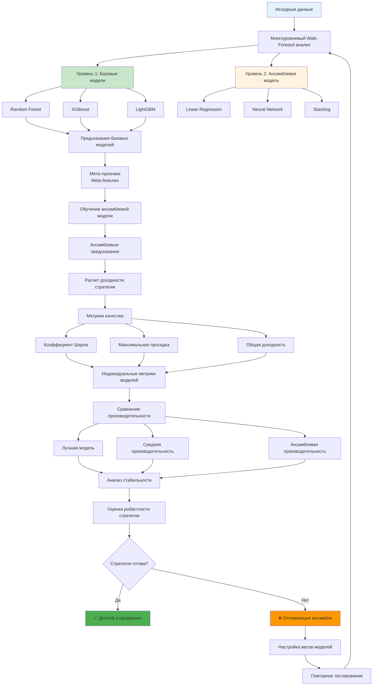
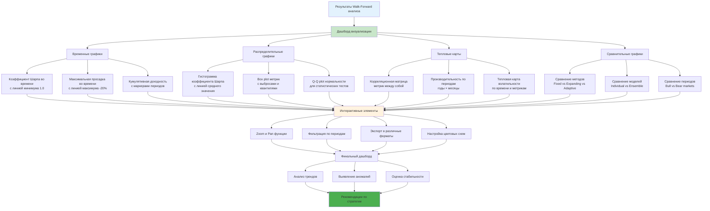
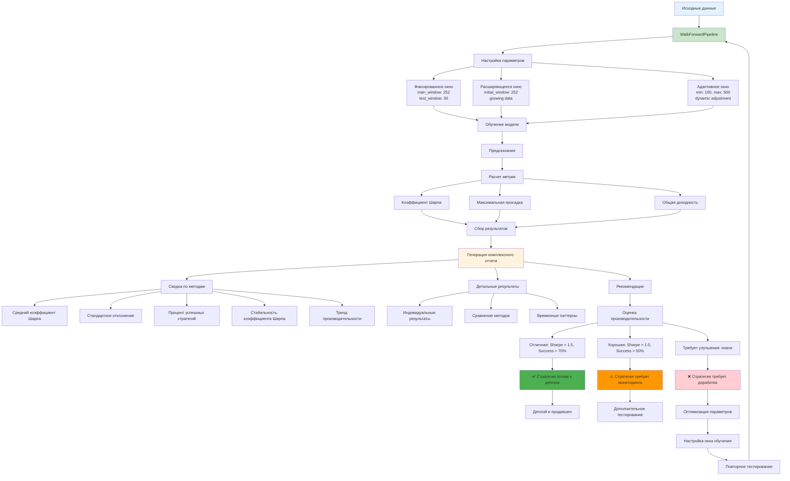

# Углубленное описание методик Walk-Forward анализа

**Автор:** Shcherbyna Rostyslav  
**Дата:** 2024  

## Почему Walk-Forward анализ - золотой стандарт валидации

### 🏆 Walk-Forward анализ как золотой стандарт валидации


**Почему Walk-Forward анализ считается самым реалистичным методом валидации?** Потому что он имитирует реальную торговлю - модель постоянно переобучается на новых данных и делает предсказания на будущее. Это единственный способ избежать "утечки данных из будущего".

### Что дает Walk-Forward анализ?

- **Реалистичность**: Имитирует реальную торговлю
- **Адаптивность**: Модель адаптируется к изменяющимся условиям
- **Стабильность**: Проверяет стабильность стратегии во времени
- **Робастность**: Выявляет слабые места стратегии

### Что происходит без Walk-Forward анализа?

- **Переобучение**: Модель запоминает исторические данные
- **Нестабильность**: Стратегия работает нестабильно во времени
- **Ложная уверенность**: Завышенные ожидания от стратегии
- **Реальные потери**: Стратегия не работает в реальной торговле

## Теоретические основы Walk-Forward анализа

### Математические принципы

**Walk-Forward как скользящее окно:**

```python
For t = train_window to T - test_window:
    train_data = data[t-train_window:t]
    test_data = data[t:t+test_window]
    
    model.fit(train_data)
    predictions = model.predict(test_data)
    
    performance[t] = evaluate(predictions, test_data)
```

Где:

- `train_window` - размер окна обучения
- `test_window` - размер окна тестирования
- `T` - общая длина данных
- `performance[t]` - производительность на периоде t

**Критерии качества Walk-Forward:**

1. **Стабильность**: Var(performance) < threshold
2. **Тренд**: performance не ухудшается со временем
3. **Адаптивность**: модель адаптируется к новым условиям
4. **Робастность**: результаты стабильны на разных периодах

### Типы Walk-Forward анализа

### 📊 Сравнение типов Walk-Forward анализа

```mermaid
graph TB
    A[Типы Walk-Forward анализа] --> B[Фиксированное окно]
    A --> C[Расширяющееся окно]
    A --> D[Скользящее окно]
    A --> E[Адаптивное окно]
    
    B --> B1[Постоянный размер окна]
    B --> B2[Простой в реализации]
    B --> B3[❌ Может устаревать]
    B --> B4[⚡ Быстрое выполнение]
    B --> B5[📊 Фиксированные параметры]
    
    C --> C1[Окно постоянно растет]
    C --> C2[Использует всю историю]
    C --> C3[⚠️ Может быть медленным]
    C --> C4[📈 Больше данных со временем]
    C --> C5[🔄 Накопление знаний]
    
    D --> D1[Окно сдвигается]
    D --> D2[Баланс истории и актуальности]
    D --> D3[✅ Наиболее популярный]
    D --> D4[⚖️ Оптимальный баланс]
    D --> D5[🎯 Стабильная производительность]
    
    E --> E1[Размер адаптируется к условиям]
    E --> E2[Сложный в реализации]
    E --> E3[✅ Наиболее гибкий]
    E --> E4[🧠 Интеллектуальная адаптация]
    E --> E5[📊 Динамические параметры]
    
    style A fill:#e3f2fd
    style B fill:#ffcdd2
    style C fill:#fff3e0
    style D fill:#c8e6c9
    style E fill:#4caf50
```



#### 1. Фиксированное окно (Fixed Window)

- Постоянный размер окна обучения
- Простой в реализации
- Может устаревать

#### 2. Расширяющееся окно (Expanding Window)

- Окно обучения постоянно растет
- Использует всю доступную историю
- Может быть медленным

#### 3. Скользящее окно (Rolling Window)

- Окно обучения сдвигается
- Баланс между историей и актуальностью
- Наиболее популярный

#### 4. Адаптивное окно (Adaptive Window)

- Размер окна адаптируется к условиям
- Сложный в реализации
- Наиболее гибкий

## Продвинутые методики Walk-Forward анализа

### 1. Базовый Walk-Forward анализ

### 🔄 Процесс Walk-Forward анализа

```mermaid
graph TD
    A[Исходные временные данные] --> B[Настройка параметров]
    B --> C[train_window = 252<br/>test_window = 30<br/>step = 30]
    
    C --> D[Инициализация цикла]
    D --> E[i = train_window]
    
    E --> F[Обучающие данные<br/>data[i-train_window:i]]
    E --> G[Тестовые данные<br/>data[i:i+test_window]]
    
    F --> H[Обучение модели<br/>model.fit(train_data)]
    G --> I[Предсказания<br/>model.predict(test_data)]
    
    H --> I
    I --> J[Расчет доходности стратегии<br/>predictions * returns]
    
    J --> K[Метрики качества]
    K --> L[Коэффициент Шарпа]
    K --> M[Максимальная просадка]
    K --> N[Общая доходность]
    
    L --> O[Сохранение результатов]
    M --> O
    N --> O
    
    O --> P[Обновление индекса<br/>i += step]
    P --> Q{i < len(data) - test_window?}
    
    Q -->|Да| F
    Q -->|Нет| R[Анализ результатов]
    
    R --> S[Стабильность во времени]
    R --> T[Адаптивность модели]
    R --> U[Робастность стратегии]
    
    S --> V[Оценка качества стратегии]
    T --> V
    U --> V
    
    V --> W{Стратегия успешна?}
    W -->|Да| X[✅ Деплой в продакшен]
    W -->|Нет| Y[❌ Оптимизация параметров]
    
    Y --> Z[Настройка окна обучения]
    Z --> AA[Повторное тестирование]
    AA --> B
    
    style A fill:#e3f2fd
    style F fill:#c8e6c9
    style G fill:#fff3e0
    style X fill:#4caf50
    style Y fill:#ff9800
```

**Простая реализация:**

```python
def walk_forward_analysis(data, model, train_window=252, test_window=30, step=30):
    """
    Базовый Walk-Forward анализ для валидации ML-стратегий
    
    Parameters:
    -----------
    data : pandas.DataFrame
        Временные ряды данных с колонками:
        - 'returns': доходность актива (float)
        - 'features': признаки для модели (array-like)
        - index: временные метки (datetime)
        
    model : sklearn-compatible model
        Объект модели машинного обучения с методами:
        - fit(X, y): обучение модели
        - predict(X): предсказания
        Должен быть совместим с sklearn API
        
    train_window : int, default=252
        Размер окна обучения в днях:
        - 252: один торговый год (рекомендуется)
        - 126: полгода (для быстрого тестирования)
        - 504: два года (для долгосрочных стратегий)
        - Минимум: 50 дней для стабильности
        - Максимум: 1000 дней для избежания переобучения
        
    test_window : int, default=30
        Размер окна тестирования в днях:
        - 30: один месяц (рекомендуется)
        - 7: одна неделя (для высокочастотных стратегий)
        - 90: квартал (для долгосрочных стратегий)
        - Минимум: 5 дней для статистической значимости
        - Максимум: 180 дней для избежания устаревания
        
    step : int, default=30
        Шаг сдвига окна в днях:
        - 30: ежемесячное переобучение (рекомендуется)
        - 7: еженедельное переобучение (для активных стратегий)
        - 1: ежедневное переобучение (для высокочастотных стратегий)
        - 90: квартальное переобучение (для консервативных стратегий)
        - step <= test_window для избежания пропусков данных
        
    Returns:
    --------
    pd.DataFrame
        Результаты анализа с колонками:
        - 'start_date': начало периода обучения (datetime)
        - 'end_date': конец периода обучения (datetime)
        - 'test_start': начало периода тестирования (datetime)
        - 'test_end': конец периода тестирования (datetime)
        - 'sharpe': коэффициент Шарпа за период (float)
        - 'max_drawdown': максимальная просадка за период (float)
        - 'total_return': общая доходность за период (float)
        - 'predictions': предсказания модели (array)
        
    Raises:
    -------
    ValueError
        Если train_window < 50 или test_window < 5
        Если step > test_window
        Если len(data) < train_window + test_window
        
    Examples:
    ---------
    >>> data = pd.read_csv('financial_data.csv', index_col=0, parse_dates=True)
    >>> model = RandomForestRegressor(n_estimators=100)
    >>> results = walk_forward_analysis(data, model, train_window=252, test_window=30)
    >>> print(f"Средний коэффициент Шарпа: {results['sharpe'].mean():.2f}")
    """
    results = []
    
    for i in range(train_window, len(data) - test_window, step):
        # Обучающие данные
        train_data = data[i-train_window:i]
        
        # Тестовые данные
        test_data = data[i:i+test_window]
        
        # Обучение модели
        model.fit(train_data)
        
        # Предсказания
        predictions = model.predict(test_data)
        
        # Оценка качества
        returns = test_data['returns']
        strategy_returns = predictions * returns
        
        # Метрики
        sharpe = strategy_returns.mean() / strategy_returns.std() * np.sqrt(252)
        max_drawdown = calculate_max_drawdown(strategy_returns)
        total_return = strategy_returns.sum()
        
        results.append({
            'start_date': train_data.index[0],
            'end_date': train_data.index[-1],
            'test_start': test_data.index[0],
            'test_end': test_data.index[-1],
            'sharpe': sharpe,
            'max_drawdown': max_drawdown,
            'total_return': total_return,
            'predictions': predictions
        })
    
    return pd.DataFrame(results)

# Пример использования
wf_results = walk_forward_analysis(data, model, train_window=252, test_window=30, step=30)
```

**Расширяющееся окно:**

```python
def expanding_window_analysis(data, model, initial_train_window=252, test_window=30, step=30):
    """
    Walk-Forward анализ с расширяющимся окном обучения
    
    В отличие от фиксированного окна, расширяющееся окно использует всю доступную
    историю данных для обучения, что позволяет модели накапливать знания со временем.
    
    Parameters:
    -----------
    data : pandas.DataFrame
        Временные ряды данных с колонками:
        - 'returns': доходность актива (float)
        - 'features': признаки для модели (array-like)
        - index: временные метки (datetime)
        
    model : sklearn-compatible model
        Объект модели машинного обучения с методами:
        - fit(X, y): обучение модели
        - predict(X): предсказания
        Должен быть совместим с sklearn API
        
    initial_train_window : int, default=252
        Начальный размер окна обучения в днях:
        - 252: один торговый год (рекомендуется)
        - 126: полгода (для быстрого тестирования)
        - 504: два года (для долгосрочных стратегий)
        - Минимум: 50 дней для стабильности
        - После этого окно будет расширяться на step дней каждую итерацию
        
    test_window : int, default=30
        Размер окна тестирования в днях:
        - 30: один месяц (рекомендуется)
        - 7: одна неделя (для высокочастотных стратегий)
        - 90: квартал (для долгосрочных стратегий)
        - Минимум: 5 дней для статистической значимости
        - Максимум: 180 дней для избежания устаревания
        
    step : int, default=30
        Шаг сдвига окна в днях:
        - 30: ежемесячное переобучение (рекомендуется)
        - 7: еженедельное переобучение (для активных стратегий)
        - 1: ежедневное переобучение (для высокочастотных стратегий)
        - 90: квартальное переобучение (для консервативных стратегий)
        - step <= test_window для избежания пропусков данных
        
    Returns:
    --------
    pd.DataFrame
        Результаты анализа с колонками:
        - 'train_start': начало периода обучения (datetime)
        - 'train_end': конец периода обучения (datetime)
        - 'test_start': начало периода тестирования (datetime)
        - 'test_end': конец периода тестирования (datetime)
        - 'train_size': размер окна обучения (int) - увеличивается со временем
        - 'sharpe': коэффициент Шарпа за период (float)
        - 'max_drawdown': максимальная просадка за период (float)
        - 'total_return': общая доходность за период (float)
        
    Raises:
    -------
    ValueError
        Если initial_train_window < 50 или test_window < 5
        Если step > test_window
        Если len(data) < initial_train_window + test_window
        
    Notes:
    ------
    - Расширяющееся окно может быть медленнее фиксированного из-за увеличения
      размера данных для обучения
    - Подходит для стратегий, где исторические данные остаются релевантными
    - Может привести к переобучению на старых данных
    
    Examples:
    ---------
    >>> data = pd.read_csv('financial_data.csv', index_col=0, parse_dates=True)
    >>> model = RandomForestRegressor(n_estimators=100)
    >>> results = expanding_window_analysis(data, model, initial_train_window=252)
    >>> print(f"Финальный размер окна: {results['train_size'].iloc[-1]}")
    """
    results = []
    
    for i in range(initial_train_window, len(data) - test_window, step):
        # Обучающие данные (расширяющееся окно)
        train_data = data[:i]
        
        # Тестовые данные
        test_data = data[i:i+test_window]
        
        # Обучение модели
        model.fit(train_data)
        
        # Предсказания
        predictions = model.predict(test_data)
        
        # Оценка качества
        returns = test_data['returns']
        strategy_returns = predictions * returns
        
        # Метрики
        sharpe = strategy_returns.mean() / strategy_returns.std() * np.sqrt(252)
        max_drawdown = calculate_max_drawdown(strategy_returns)
        total_return = strategy_returns.sum()
        
        results.append({
            'train_start': train_data.index[0],
            'train_end': train_data.index[-1],
            'test_start': test_data.index[0],
            'test_end': test_data.index[-1],
            'train_size': len(train_data),
            'sharpe': sharpe,
            'max_drawdown': max_drawdown,
            'total_return': total_return
        })
    
    return pd.DataFrame(results)

# Пример использования
expanding_results = expanding_window_analysis(data, model, initial_train_window=252, test_window=30)
```

### 2. Адаптивный Walk-Forward анализ

### 🧠 Механизм адаптивного окна

```mermaid
graph TD
    A[Исходные данные] --> B[Инициализация параметров]
    B --> C[min_window = 100<br/>max_window = 500<br/>current_window = min_window]
    
    C --> D[Цикл Walk-Forward]
    D --> E[Обучающие данные<br/>data[i-current_window:i]]
    E --> F[Обучение модели]
    F --> G[Предсказания и метрики]
    
    G --> H[Расчет производительности<br/>current_sharpe]
    H --> I{Есть предыдущие результаты?}
    
    I -->|Нет| J[Сохранение результатов<br/>current_window остается]
    I -->|Да| K[Сравнение с предыдущей производительностью<br/>recent_sharpe]
    
    K --> L{Производительность ухудшилась?<br/>current_sharpe < recent_sharpe * 0.9}
    L -->|Да| M[Увеличение окна<br/>current_window += 50]
    L -->|Нет| N{Производительность улучшилась?<br/>current_sharpe > recent_sharpe * 1.1}
    
    N -->|Да| O[Уменьшение окна<br/>current_window -= 50]
    N -->|Нет| P[Окно остается без изменений]
    
    M --> Q[Проверка границ<br/>current_window = min(current_window, max_window)]
    O --> R[Проверка границ<br/>current_window = max(current_window, min_window)]
    P --> S[Сохранение результатов]
    Q --> S
    R --> S
    J --> S
    
    S --> T[Обновление индекса<br/>i += step]
    T --> U{Продолжить цикл?}
    U -->|Да| E
    U -->|Нет| V[Анализ адаптивности]
    
    V --> W[Статистика изменения окна]
    V --> X[Корреляция окна и производительности]
    V --> Y[Оценка эффективности адаптации]
    
    W --> Z[Финальная оценка стратегии]
    X --> Z
    Y --> Z
    
    style A fill:#e3f2fd
    style M fill:#ff9800
    style O fill:#4caf50
    style P fill:#fff3e0
    style Z fill:#2e7d32
```

**Адаптация размера окна:**

```python
def adaptive_window_analysis(data, model, min_window=100, max_window=500, 
                           test_window=30, step=30, stability_threshold=0.1):
    """
    Walk-Forward анализ с адаптивным окном обучения
    
    Размер окна обучения автоматически адаптируется на основе производительности
    модели. При ухудшении производительности окно увеличивается, при улучшении - уменьшается.
    
    Parameters:
    -----------
    data : pandas.DataFrame
        Временные ряды данных с колонками:
        - 'returns': доходность актива (float)
        - 'features': признаки для модели (array-like)
        - index: временные метки (datetime)
        
    model : sklearn-compatible model
        Объект модели машинного обучения с методами:
        - fit(X, y): обучение модели
        - predict(X): предсказания
        Должен быть совместим с sklearn API
        
    min_window : int, default=100
        Минимальный размер окна обучения в днях:
        - 100: минимум для стабильности (рекомендуется)
        - 50: для быстрого тестирования
        - 200: для консервативных стратегий
        - Минимум: 30 дней для статистической значимости
        - Максимум: 300 дней для избежания переобучения
        
    max_window : int, default=500
        Максимальный размер окна обучения в днях:
        - 500: два года торговых дней (рекомендуется)
        - 252: один год (для быстрых стратегий)
        - 1000: четыре года (для долгосрочных стратегий)
        - Минимум: min_window + 100
        - Максимум: 2000 дней для избежания переобучения
        
    test_window : int, default=30
        Размер окна тестирования в днях:
        - 30: один месяц (рекомендуется)
        - 7: одна неделя (для высокочастотных стратегий)
        - 90: квартал (для долгосрочных стратегий)
        - Минимум: 5 дней для статистической значимости
        - Максимум: 180 дней для избежания устаревания
        
    step : int, default=30
        Шаг сдвига окна в днях:
        - 30: ежемесячное переобучение (рекомендуется)
        - 7: еженедельное переобучение (для активных стратегий)
        - 1: ежедневное переобучение (для высокочастотных стратегий)
        - 90: квартальное переобучение (для консервативных стратегий)
        - step <= test_window для избежания пропусков данных
        
    stability_threshold : float, default=0.1
        Порог для определения значимого изменения производительности:
        - 0.1: 10% изменение (рекомендуется)
        - 0.05: 5% изменение (для чувствительных стратегий)
        - 0.2: 20% изменение (для стабильных стратегий)
        - Минимум: 0.01 (1% изменение)
        - Максимум: 0.5 (50% изменение)
        
    Returns:
    --------
    pd.DataFrame
        Результаты анализа с колонками:
        - 'train_start': начало периода обучения (datetime)
        - 'train_end': конец периода обучения (datetime)
        - 'test_start': начало периода тестирования (datetime)
        - 'test_end': конец периода тестирования (datetime)
        - 'window_size': текущий размер окна обучения (int)
        - 'sharpe': коэффициент Шарпа за период (float)
        - 'max_drawdown': максимальная просадка за период (float)
        - 'total_return': общая доходность за период (float)
        
    Raises:
    -------
    ValueError
        Если min_window < 30 или max_window < min_window + 100
        Если test_window < 5 или step > test_window
        Если stability_threshold < 0.01 или stability_threshold > 0.5
        Если len(data) < min_window + test_window
        
    Notes:
    ------
    - Адаптивное окно может быть нестабильным в начале из-за недостатка данных
    - Рекомендуется использовать минимум 10 итераций для стабилизации
    - Подходит для стратегий с изменяющимися рыночными условиями
    
    Examples:
    ---------
    >>> data = pd.read_csv('financial_data.csv', index_col=0, parse_dates=True)
    >>> model = RandomForestRegressor(n_estimators=100)
    >>> results = adaptive_window_analysis(data, model, min_window=100, max_window=500)
    >>> print(f"Средний размер окна: {results['window_size'].mean():.0f}")
    """
    results = []
    current_window = min_window
    
    for i in range(min_window, len(data) - test_window, step):
        # Обучающие данные
        train_data = data[i-current_window:i]
        
        # Тестовые данные
        test_data = data[i:i+test_window]
        
        # Обучение модели
        model.fit(train_data)
        
        # Предсказания
        predictions = model.predict(test_data)
        
        # Оценка качества
        returns = test_data['returns']
        strategy_returns = predictions * returns
        
        # Метрики
        sharpe = strategy_returns.mean() / strategy_returns.std() * np.sqrt(252)
        max_drawdown = calculate_max_drawdown(strategy_returns)
        total_return = strategy_returns.sum()
        
        # Адаптация размера окна
        if len(results) > 0:
            recent_sharpe = results[-1]['sharpe']
            current_sharpe = sharpe
            
            # Если производительность ухудшается, увеличиваем окно
            if current_sharpe < recent_sharpe * (1 - stability_threshold):
                current_window = min(current_window + 50, max_window)
            # Если производительность улучшается, уменьшаем окно
            elif current_sharpe > recent_sharpe * (1 + stability_threshold):
                current_window = max(current_window - 50, min_window)
        
        results.append({
            'train_start': train_data.index[0],
            'train_end': train_data.index[-1],
            'test_start': test_data.index[0],
            'test_end': test_data.index[-1],
            'window_size': current_window,
            'sharpe': sharpe,
            'max_drawdown': max_drawdown,
            'total_return': total_return
        })
    
    return pd.DataFrame(results)

# Пример использования
adaptive_results = adaptive_window_analysis(data, model, min_window=100, max_window=500)
```

**Адаптация на основе волатильности:**

```python
def volatility_adaptive_analysis(data, model, base_window=252, test_window=30, 
                                step=30, volatility_lookback=50):
    """
    Walk-Forward анализ с адаптацией размера окна к волатильности рынка
    
    Размер окна обучения адаптируется на основе текущей волатильности рынка:
    - Высокая волатильность: меньше окно (быстрая адаптация)
    - Низкая волатильность: больше окно (стабильность)
    
    Parameters:
    -----------
    data : pandas.DataFrame
        Временные ряды данных с колонками:
        - 'returns': доходность актива (float) - используется для расчета волатильности
        - 'features': признаки для модели (array-like)
        - index: временные метки (datetime)
        
    model : sklearn-compatible model
        Объект модели машинного обучения с методами:
        - fit(X, y): обучение модели
        - predict(X): предсказания
        Должен быть совместим с sklearn API
        
    base_window : int, default=252
        Базовый размер окна обучения в днях:
        - 252: один торговый год (рекомендуется)
        - 126: полгода (для быстрого тестирования)
        - 504: два года (для долгосрочных стратегий)
        - Минимум: 50 дней для стабильности
        - Максимум: 1000 дней для избежания переобучения
        
    test_window : int, default=30
        Размер окна тестирования в днях:
        - 30: один месяц (рекомендуется)
        - 7: одна неделя (для высокочастотных стратегий)
        - 90: квартал (для долгосрочных стратегий)
        - Минимум: 5 дней для статистической значимости
        - Максимум: 180 дней для избежания устаревания
        
    step : int, default=30
        Шаг сдвига окна в днях:
        - 30: ежемесячное переобучение (рекомендуется)
        - 7: еженедельное переобучение (для активных стратегий)
        - 1: ежедневное переобучение (для высокочастотных стратегий)
        - 90: квартальное переобучение (для консервативных стратегий)
        - step <= test_window для избежания пропусков данных
        
    volatility_lookback : int, default=50
        Период для расчета текущей волатильности в днях:
        - 50: два месяца (рекомендуется)
        - 30: один месяц (для быстрой адаптации)
        - 100: четыре месяца (для стабильной оценки)
        - Минимум: 10 дней для статистической значимости
        - Максимум: 200 дней для избежания устаревания
        
    Returns:
    --------
    pd.DataFrame
        Результаты анализа с колонками:
        - 'train_start': начало периода обучения (datetime)
        - 'train_end': конец периода обучения (datetime)
        - 'test_start': начало периода тестирования (datetime)
        - 'test_end': конец периода тестирования (datetime)
        - 'window_size': адаптированный размер окна обучения (int)
        - 'volatility_ratio': отношение текущей к долгосрочной волатильности (float)
        - 'sharpe': коэффициент Шарпа за период (float)
        - 'max_drawdown': максимальная просадка за период (float)
        - 'total_return': общая доходность за период (float)
        
    Raises:
    -------
    ValueError
        Если base_window < 50 или test_window < 5
        Если step > test_window или volatility_lookback < 10
        Если len(data) < base_window + test_window + volatility_lookback
        
    Notes:
    ------
    - Адаптация основана на сравнении текущей и долгосрочной волатильности
    - При volatility_ratio > 1.5: окно уменьшается до 70% от базового
    - При volatility_ratio < 0.7: окно увеличивается до 130% от базового
    - Подходит для стратегий, чувствительных к волатильности рынка
    
    Examples:
    ---------
    >>> data = pd.read_csv('financial_data.csv', index_col=0, parse_dates=True)
    >>> model = RandomForestRegressor(n_estimators=100)
    >>> results = volatility_adaptive_analysis(data, model, base_window=252)
    >>> print(f"Средний коэффициент волатильности: {results['volatility_ratio'].mean():.2f}")
    """
    results = []
    
    for i in range(base_window, len(data) - test_window, step):
        # Расчет волатильности
        recent_volatility = data['returns'].iloc[i-volatility_lookback:i].std()
        long_term_volatility = data['returns'].iloc[:i].std()
        
        # Адаптация размера окна на основе волатильности
        volatility_ratio = recent_volatility / long_term_volatility
        
        if volatility_ratio > 1.5:  # Высокая волатильность
            window_size = int(base_window * 0.7)  # Меньше окно
        elif volatility_ratio < 0.7:  # Низкая волатильность
            window_size = int(base_window * 1.3)  # Больше окно
        else:
            window_size = base_window
        
        # Обучающие данные
        train_data = data[i-window_size:i]
        
        # Тестовые данные
        test_data = data[i:i+test_window]
        
        # Обучение модели
        model.fit(train_data)
        
        # Предсказания
        predictions = model.predict(test_data)
        
        # Оценка качества
        returns = test_data['returns']
        strategy_returns = predictions * returns
        
        # Метрики
        sharpe = strategy_returns.mean() / strategy_returns.std() * np.sqrt(252)
        max_drawdown = calculate_max_drawdown(strategy_returns)
        total_return = strategy_returns.sum()
        
        results.append({
            'train_start': train_data.index[0],
            'train_end': train_data.index[-1],
            'test_start': test_data.index[0],
            'test_end': test_data.index[-1],
            'window_size': window_size,
            'volatility_ratio': volatility_ratio,
            'sharpe': sharpe,
            'max_drawdown': max_drawdown,
            'total_return': total_return
        })
    
    return pd.DataFrame(results)

# Пример использования
vol_adaptive_results = volatility_adaptive_analysis(data, model, base_window=252)
```

### 3. Многоуровневый Walk-Forward анализ

### 🏗️ Архитектура многоуровневого анализа



**Иерархический анализ:**

```python
def hierarchical_walk_forward(data, models, train_window=252, test_window=30, step=30):
    """Многоуровневый Walk-Forward анализ"""
    results = []
    
    for i in range(train_window, len(data) - test_window, step):
        # Обучающие данные
        train_data = data[i-train_window:i]
        
        # Тестовые данные
        test_data = data[i:i+test_window]
        
        # Обучение всех моделей
        model_predictions = {}
        for name, model in models.items():
            model.fit(train_data)
            model_predictions[name] = model.predict(test_data)
        
        # Комбинирование предсказаний
        combined_predictions = np.mean(list(model_predictions.values()), axis=0)
        
        # Оценка качества
        returns = test_data['returns']
        strategy_returns = combined_predictions * returns
        
        # Метрики
        sharpe = strategy_returns.mean() / strategy_returns.std() * np.sqrt(252)
        max_drawdown = calculate_max_drawdown(strategy_returns)
        total_return = strategy_returns.sum()
        
        # Индивидуальные метрики моделей
        individual_metrics = {}
        for name, predictions in model_predictions.items():
            individual_returns = predictions * returns
            individual_metrics[name] = {
                'sharpe': individual_returns.mean() / individual_returns.std() * np.sqrt(252),
                'max_drawdown': calculate_max_drawdown(individual_returns),
                'total_return': individual_returns.sum()
            }
        
        results.append({
            'train_start': train_data.index[0],
            'train_end': train_data.index[-1],
            'test_start': test_data.index[0],
            'test_end': test_data.index[-1],
            'combined_sharpe': sharpe,
            'combined_max_drawdown': max_drawdown,
            'combined_total_return': total_return,
            'individual_metrics': individual_metrics
        })
    
    return pd.DataFrame(results)

# Пример использования
models = {
    'model1': RandomForestRegressor(),
    'model2': XGBRegressor(),
    'model3': LGBMRegressor()
}
hierarchical_results = hierarchical_walk_forward(data, models, train_window=252)
```

**Ансамблевый анализ:**

```python
def ensemble_walk_forward(data, base_models, ensemble_model, train_window=252, 
                         test_window=30, step=30):
    """Walk-Forward анализ с ансамблем"""
    results = []
    
    for i in range(train_window, len(data) - test_window, step):
        # Обучающие данные
        train_data = data[i-train_window:i]
        
        # Тестовые данные
        test_data = data[i:i+test_window]
        
        # Обучение базовых моделей
        base_predictions = []
        for name, model in base_models.items():
            model.fit(train_data)
            predictions = model.predict(test_data)
            base_predictions.append(predictions)
        
        # Создание мета-признаков
        meta_features = np.column_stack(base_predictions)
        
        # Обучение ансамблевой модели
        ensemble_model.fit(meta_features, test_data['returns'])
        
        # Предсказания ансамбля
        ensemble_predictions = ensemble_model.predict(meta_features)
        
        # Оценка качества
        returns = test_data['returns']
        strategy_returns = ensemble_predictions * returns
        
        # Метрики
        sharpe = strategy_returns.mean() / strategy_returns.std() * np.sqrt(252)
        max_drawdown = calculate_max_drawdown(strategy_returns)
        total_return = strategy_returns.sum()
        
        results.append({
            'train_start': train_data.index[0],
            'train_end': train_data.index[-1],
            'test_start': test_data.index[0],
            'test_end': test_data.index[-1],
            'sharpe': sharpe,
            'max_drawdown': max_drawdown,
            'total_return': total_return,
            'base_predictions': base_predictions,
            'ensemble_predictions': ensemble_predictions
        })
    
    return pd.DataFrame(results)

# Пример использования
base_models = {
    'rf': RandomForestRegressor(),
    'xgb': XGBRegressor(),
    'lgb': LGBMRegressor()
}
ensemble_model = LinearRegression()
ensemble_results = ensemble_walk_forward(data, base_models, ensemble_model)
```

## Метрики качества Walk-Forward анализа

### 📊 Классификация метрик качества Walk-Forward анализа

```mermaid
graph TD
    A[Метрики качества Walk-Forward] --> B[Временные метрики]
    A --> C[Статистические метрики]
    A --> D[Экономические метрики]
    
    B --> B1[Стабильность во времени]
    B1 --> B11[Стабильность коэффициента Шарпа<br/>1 / (std / mean)]
    B1 --> B12[Тренд производительности<br/>polyfit slope]
    B1 --> B13[Волатильность производительности<br/>rolling std]
    B1 --> B14[Коэффициент стабильности<br/>1 / volatility]
    
    B --> B2[Адаптивность]
    B2 --> B21[Скорость адаптации<br/>abs(current - recent) / recent]
    B2 --> B22[Волатильность адаптации<br/>std adaptation_speed]
    B2 --> B23[Коэффициент адаптивности<br/>mean_speed / volatility]
    
    C --> C1[Статистическая значимость]
    C1 --> C11[Тест на нормальность<br/>Shapiro-Wilk p-value > 0.05]
    C1 --> C12[Тест на стационарность<br/>ADF p-value < 0.05]
    C1 --> C13[Доверительный интервал<br/>t-distribution 95%]
    C1 --> C14[Статистическая значимость<br/>ADF < 0.05 AND Shapiro > 0.05]
    
    C --> C2[Корреляция с рынком]
    C2 --> C21[Корреляция с волатильностью<br/>corr(sharpe, volatility)]
    C2 --> C22[Корреляция с доходностью<br/>corr(sharpe, returns)]
    C2 --> C23[Корреляция с трендом<br/>corr(sharpe, trend)]
    
    D --> D1[Экономическая значимость]
    D1 --> D11[Учет транзакционных издержек<br/>net_returns = returns - costs]
    D1 --> D12[Минимальный коэффициент Шарпа<br/>≥ 1.0]
    D1 --> D13[Максимальная просадка<br/>≤ 20%]
    D1 --> D14[Процент успешных периодов<br/>≥ 60%]
    
    D --> D2[Рентабельность]
    D2 --> D21[Кумулятивная доходность<br/>cumprod(1 + returns)]
    D2 --> D22[Финальная стоимость портфеля<br/>initial * cumulative]
    D2 --> D23[Годовая доходность<br/>annualized return]
    D2 --> D24[Максимальная просадка<br/>min drawdown]
    
    style A fill:#e3f2fd
    style B fill:#c8e6c9
    style C fill:#fff3e0
    style D fill:#f3e5f5
```

### 1. Временные метрики

**Стабильность во времени:**

```python
def calculate_temporal_stability(results):
    """
    Расчет стабильности производительности во времени
    
    Анализирует стабильность коэффициента Шарпа и других метрик во времени,
    что является ключевым показателем качества Walk-Forward анализа.
    
    Parameters:
    -----------
    results : pd.DataFrame
        Результаты Walk-Forward анализа с колонками:
        - 'sharpe': коэффициент Шарпа за каждый период (float)
        - 'max_drawdown': максимальная просадка за каждый период (float)
        - 'total_return': общая доходность за каждый период (float)
        - index: временные метки периодов (datetime)
        
    Returns:
    --------
    dict
        Словарь с метриками стабильности:
        - 'sharpe_stability': стабильность коэффициента Шарпа (float)
          - > 2.0: отличная стабильность
          - 1.0-2.0: хорошая стабильность
          - 0.5-1.0: умеренная стабильность
          - < 0.5: низкая стабильность
        - 'sharpe_trend': тренд коэффициента Шарпа (float)
          - > 0: улучшение со временем
          - = 0: стабильная производительность
          - < 0: ухудшение со временем
        - 'performance_volatility': волатильность производительности (float)
          - < 0.1: низкая волатильность
          - 0.1-0.3: умеренная волатильность
          - > 0.3: высокая волатильность
        - 'stability_coefficient': общий коэффициент стабильности (float)
          - > 10: отличная стабильность
          - 5-10: хорошая стабильность
          - 2-5: умеренная стабильность
          - < 2: низкая стабильность
        
    Raises:
    -------
    ValueError
        Если results не содержит колонку 'sharpe'
        Если results пустой или содержит NaN значения
        
    Notes:
    ------
    - Стабильность рассчитывается как обратная величина к коэффициенту вариации
    - Тренд рассчитывается с помощью линейной регрессии
    - Волатильность рассчитывается как скользящее стандартное отклонение
    - Рекомендуется минимум 10 периодов для надежной оценки
    
    Examples:
    ---------
    >>> results = walk_forward_analysis(data, model)
    >>> stability = calculate_temporal_stability(results)
    >>> print(f"Стабильность Шарпа: {stability['sharpe_stability']:.2f}")
    """
    # Стабильность коэффициента Шарпа
    sharpe_std = results['sharpe'].std()
    sharpe_mean = results['sharpe'].mean()
    sharpe_stability = 1 / (sharpe_std / sharpe_mean) if sharpe_mean != 0 else 0
    
    # Тренд производительности
    sharpe_trend = np.polyfit(range(len(results)), results['sharpe'], 1)[0]
    
    # Волатильность производительности
    performance_volatility = results['sharpe'].rolling(5).std().mean()
    
    # Коэффициент стабильности
    stability_coefficient = 1 / performance_volatility if performance_volatility > 0 else 0
    
    return {
        'sharpe_stability': sharpe_stability,
        'sharpe_trend': sharpe_trend,
        'performance_volatility': performance_volatility,
        'stability_coefficient': stability_coefficient
    }

# Пример использования
temporal_metrics = calculate_temporal_stability(wf_results)
```

**Адаптивность:**

```python
def calculate_adaptability(results, lookback=5):
    """
    Расчет адаптивности модели к изменяющимся условиям
    
    Анализирует способность модели адаптироваться к новым рыночным условиям
    на основе изменений в производительности во времени.
    
    Parameters:
    -----------
    results : pd.DataFrame
        Результаты Walk-Forward анализа с колонками:
        - 'sharpe': коэффициент Шарпа за каждый период (float)
        - 'max_drawdown': максимальная просадка за каждый период (float)
        - 'total_return': общая доходность за каждый период (float)
        - index: временные метки периодов (datetime)
        
    lookback : int, default=5
        Количество периодов для расчета адаптивности:
        - 5: пять периодов (рекомендуется)
        - 3: три периода (для быстрой адаптации)
        - 10: десять периодов (для стабильной оценки)
        - Минимум: 2 периода для расчета
        - Максимум: 20 периодов для избежания устаревания
        
    Returns:
    --------
    dict
        Словарь с метриками адаптивности:
        - 'mean_adaptation_speed': средняя скорость адаптации (float)
          - > 0.2: высокая адаптивность
          - 0.1-0.2: умеренная адаптивность
          - 0.05-0.1: низкая адаптивность
          - < 0.05: очень низкая адаптивность
        - 'adaptation_volatility': волатильность адаптации (float)
          - < 0.1: стабильная адаптация
          - 0.1-0.3: умеренная волатильность
          - > 0.3: нестабильная адаптация
        - 'adaptability_coefficient': коэффициент адаптивности (float)
          - > 2.0: отличная адаптивность
          - 1.0-2.0: хорошая адаптивность
          - 0.5-1.0: умеренная адаптивность
          - < 0.5: низкая адаптивность
        
    Raises:
    -------
    ValueError
        Если results не содержит колонку 'sharpe'
        Если lookback < 2 или lookback > len(results) - 1
        Если results пустой или содержит NaN значения
        
    Notes:
    ------
    - Скорость адаптации рассчитывается как абсолютное изменение
      производительности относительно предыдущих периодов
    - Волатильность адаптации показывает стабильность процесса адаптации
    - Коэффициент адаптивности - отношение скорости к волатильности
    - Рекомендуется минимум 10 периодов для надежной оценки
    
    Examples:
    ---------
    >>> results = walk_forward_analysis(data, model)
    >>> adaptability = calculate_adaptability(results, lookback=5)
    >>> print(f"Скорость адаптации: {adaptability['mean_adaptation_speed']:.3f}")
    """
    # Скорость адаптации
    adaptation_speed = []
    for i in range(lookback, len(results)):
        recent_performance = results['sharpe'].iloc[i-lookback:i].mean()
        current_performance = results['sharpe'].iloc[i]
        adaptation = abs(current_performance - recent_performance) / recent_performance
        adaptation_speed.append(adaptation)
    
    # Средняя скорость адаптации
    mean_adaptation_speed = np.mean(adaptation_speed)
    
    # Волатильность адаптации
    adaptation_volatility = np.std(adaptation_speed)
    
    # Коэффициент адаптивности
    adaptability_coefficient = mean_adaptation_speed / adaptation_volatility if adaptation_volatility > 0 else 0
    
    return {
        'mean_adaptation_speed': mean_adaptation_speed,
        'adaptation_volatility': adaptation_volatility,
        'adaptability_coefficient': adaptability_coefficient
    }

# Пример использования
adaptability_metrics = calculate_adaptability(wf_results, lookback=5)
```

### 2. Статистические метрики

**Статистическая значимость:**

```python
def calculate_statistical_significance(results, confidence_level=0.95):
    """
    Расчет статистической значимости результатов Walk-Forward анализа
    
    Проводит статистические тесты для оценки значимости результатов:
    - Тест на нормальность (Shapiro-Wilk)
    - Тест на стационарность (Augmented Dickey-Fuller)
    - Расчет доверительных интервалов
    
    Parameters:
    -----------
    results : pd.DataFrame
        Результаты Walk-Forward анализа с колонками:
        - 'sharpe': коэффициент Шарпа за каждый период (float)
        - 'max_drawdown': максимальная просадка за каждый период (float)
        - 'total_return': общая доходность за каждый период (float)
        - index: временные метки периодов (datetime)
        
    confidence_level : float, default=0.95
        Уровень доверия для доверительных интервалов:
        - 0.95: 95% доверительный интервал (рекомендуется)
        - 0.99: 99% доверительный интервал (для консервативных оценок)
        - 0.90: 90% доверительный интервал (для менее строгих оценок)
        - Минимум: 0.80 (80% доверительный интервал)
        - Максимум: 0.999 (99.9% доверительный интервал)
        
    Returns:
    --------
    dict
        Словарь с результатами статистических тестов:
        - 'shapiro_statistic': статистика теста Шапиро-Уилка (float)
        - 'shapiro_pvalue': p-value теста на нормальность (float)
          - > 0.05: данные нормально распределены
          - <= 0.05: данные не нормально распределены
        - 'adf_statistic': статистика теста ADF (float)
        - 'adf_pvalue': p-value теста на стационарность (float)
          - < 0.05: данные стационарны
          - >= 0.05: данные не стационарны
        - 'confidence_interval': доверительный интервал (tuple)
          - (lower_bound, upper_bound) для среднего коэффициента Шарпа
        - 'is_significant': общая статистическая значимость (bool)
          - True: результаты статистически значимы
          - False: результаты не статистически значимы
        
    Raises:
    -------
    ValueError
        Если results не содержит колонку 'sharpe'
        Если confidence_level < 0.80 или confidence_level > 0.999
        Если results пустой или содержит NaN значения
        
    Notes:
    ------
    - Тест на нормальность проверяет, что коэффициенты Шарпа нормально распределены
    - Тест на стационарность проверяет, что производительность стабильна во времени
    - Доверительный интервал рассчитывается с использованием t-распределения
    - Рекомендуется минимум 30 периодов для надежных статистических тестов
    
    Examples:
    ---------
    >>> results = walk_forward_analysis(data, model)
    >>> significance = calculate_statistical_significance(results, confidence_level=0.95)
    >>> print(f"Статистически значимо: {significance['is_significant']}")
    """
    from scipy import stats
    
    # Тест на нормальность
    shapiro_stat, shapiro_pvalue = stats.shapiro(results['sharpe'])
    
    # Тест на стационарность
    adf_stat, adf_pvalue = stats.adfuller(results['sharpe'])
    
    # Доверительный интервал
    mean_sharpe = results['sharpe'].mean()
    std_sharpe = results['sharpe'].std()
    n = len(results)
    
    t_value = stats.t.ppf((1 + confidence_level) / 2, n - 1)
    margin_error = t_value * std_sharpe / np.sqrt(n)
    
    confidence_interval = (mean_sharpe - margin_error, mean_sharpe + margin_error)
    
    # Статистическая значимость
    is_significant = adf_pvalue < 0.05 and shapiro_pvalue > 0.05
    
    return {
        'shapiro_statistic': shapiro_stat,
        'shapiro_pvalue': shapiro_pvalue,
        'adf_statistic': adf_stat,
        'adf_pvalue': adf_pvalue,
        'confidence_interval': confidence_interval,
        'is_significant': is_significant
    }

# Пример использования
statistical_metrics = calculate_statistical_significance(wf_results)
```

**Корреляция с рыночными условиями:**

```python
def calculate_market_correlation(results, market_data):
    """Расчет корреляции с рыночными условиями"""
    # Корреляция с волатильностью рынка
    market_volatility = market_data['returns'].rolling(30).std()
    volatility_correlation = results['sharpe'].corr(market_volatility.iloc[results.index])
    
    # Корреляция с доходностью рынка
    market_returns = market_data['returns'].rolling(30).mean()
    returns_correlation = results['sharpe'].corr(market_returns.iloc[results.index])
    
    # Корреляция с трендом рынка
    market_trend = market_data['price'].rolling(30).apply(lambda x: np.polyfit(range(len(x)), x, 1)[0])
    trend_correlation = results['sharpe'].corr(market_trend.iloc[results.index])
    
    return {
        'volatility_correlation': volatility_correlation,
        'returns_correlation': returns_correlation,
        'trend_correlation': trend_correlation
    }

# Пример использования
market_correlation = calculate_market_correlation(wf_results, market_data)
```

### 3. Экономические метрики

**Экономическая значимость:**

```python
def calculate_economic_significance(results, transaction_costs=0.001, 
                                  min_sharpe=1.0, max_drawdown=0.2):
    """
    Расчет экономической значимости результатов Walk-Forward анализа
    
    Оценивает экономическую целесообразность стратегии с учетом
    транзакционных издержек и практических ограничений.
    
    Parameters:
    -----------
    results : pd.DataFrame
        Результаты Walk-Forward анализа с колонками:
        - 'sharpe': коэффициент Шарпа за каждый период (float)
        - 'max_drawdown': максимальная просадка за каждый период (float)
        - 'total_return': общая доходность за каждый период (float)
        - index: временные метки периодов (datetime)
        
    transaction_costs : float, default=0.001
        Транзакционные издержки на одну сделку (в долях от капитала):
        - 0.001: 0.1% (рекомендуется для акций)
        - 0.0005: 0.05% (для ETF и индексов)
        - 0.002: 0.2% (для форекса и криптовалют)
        - 0.005: 0.5% (для экзотических активов)
        - Минимум: 0.0001 (0.01%)
        - Максимум: 0.01 (1%)
        
    min_sharpe : float, default=1.0
        Минимальный приемлемый коэффициент Шарпа:
        - 1.0: базовый уровень (рекомендуется)
        - 1.5: хороший уровень для профессиональных стратегий
        - 2.0: отличный уровень для институциональных стратегий
        - 0.5: минимальный уровень для консервативных стратегий
        - Минимум: 0.1
        - Максимум: 5.0
        
    max_drawdown : float, default=0.2
        Максимально допустимая просадка (в долях от капитала):
        - 0.2: 20% (рекомендуется для большинства стратегий)
        - 0.1: 10% (для консервативных стратегий)
        - 0.3: 30% (для агрессивных стратегий)
        - 0.05: 5% (для очень консервативных стратегий)
        - Минимум: 0.01 (1%)
        - Максимум: 0.5 (50%)
        
    Returns:
    --------
    dict
        Словарь с метриками экономической значимости:
        - 'mean_sharpe': средний коэффициент Шарпа (float)
        - 'mean_max_drawdown': средняя максимальная просадка (float)
        - 'success_rate': процент успешных периодов (float)
          - >= 0.7: отличная стратегия
          - 0.5-0.7: хорошая стратегия
          - 0.3-0.5: умеренная стратегия
          - < 0.3: слабая стратегия
        - 'economically_significant': общая экономическая значимость (bool)
          - True: стратегия экономически значима
          - False: стратегия не экономически значима
        
    Raises:
    -------
    ValueError
        Если results не содержит колонки 'sharpe', 'max_drawdown', 'total_return'
        Если transaction_costs < 0 или transaction_costs > 0.01
        Если min_sharpe < 0.1 или min_sharpe > 5.0
        Если max_drawdown < 0.01 или max_drawdown > 0.5
        
    Notes:
    ------
    - Транзакционные издержки вычитаются из общей доходности
    - Успешным считается период с коэффициентом Шарпа >= min_sharpe
    - Экономическая значимость требует выполнения всех критериев одновременно
    - Рекомендуется минимум 20 периодов для надежной оценки
    
    Examples:
    ---------
    >>> results = walk_forward_analysis(data, model)
    >>> economic = calculate_economic_significance(results, transaction_costs=0.001)
    >>> print(f"Экономически значима: {economic['economically_significant']}")
    """
    # Учет транзакционных издержек
    net_returns = results['total_return'] - transaction_costs
    
    # Метрики
    mean_sharpe = results['sharpe'].mean()
    mean_max_drawdown = results['max_drawdown'].mean()
    success_rate = (results['sharpe'] > min_sharpe).mean()
    
    # Экономическая значимость
    economically_significant = (
        mean_sharpe >= min_sharpe and 
        abs(mean_max_drawdown) <= max_drawdown and
        success_rate >= 0.6
    )
    
    return {
        'mean_sharpe': mean_sharpe,
        'mean_max_drawdown': mean_max_drawdown,
        'success_rate': success_rate,
        'economically_significant': economically_significant
    }

# Пример использования
economic_metrics = calculate_economic_significance(wf_results, transaction_costs=0.001)
```

**Рентабельность:**

```python
def calculate_profitability(results, initial_capital=100000):
    """
    Расчет рентабельности стратегии на основе результатов Walk-Forward анализа
    
    Анализирует финансовую эффективность стратегии с учетом
    начального капитала и кумулятивной доходности.
    
    Parameters:
    -----------
    results : pd.DataFrame
        Результаты Walk-Forward анализа с колонками:
        - 'total_return': общая доходность за каждый период (float)
        - 'max_drawdown': максимальная просадка за каждый период (float)
        - index: временные метки периодов (datetime)
        
    initial_capital : float, default=100000
        Начальный капитал для расчета рентабельности:
        - 100000: $100,000 (рекомендуется для тестирования)
        - 10000: $10,000 (для малых счетов)
        - 1000000: $1,000,000 (для институциональных стратегий)
        - 1000: $1,000 (для демо-счетов)
        - Минимум: 100 (для минимального тестирования)
        - Максимум: 10000000 (для крупных портфелей)
        
    Returns:
    --------
    dict
        Словарь с метриками рентабельности:
        - 'final_value': финальная стоимость портфеля (float)
        - 'total_return': общая доходность за весь период (float)
          - > 0.5: отличная доходность (50%+)
          - 0.2-0.5: хорошая доходность (20-50%)
          - 0.1-0.2: умеренная доходность (10-20%)
          - < 0.1: низкая доходность (<10%)
        - 'annual_return': годовая доходность (float)
          - > 0.2: отличная годовая доходность (20%+)
          - 0.1-0.2: хорошая годовая доходность (10-20%)
          - 0.05-0.1: умеренная годовая доходность (5-10%)
          - < 0.05: низкая годовая доходность (<5%)
        - 'max_drawdown': максимальная просадка за весь период (float)
          - < 0.1: отличная стабильность (<10%)
          - 0.1-0.2: хорошая стабильность (10-20%)
          - 0.2-0.3: умеренная стабильность (20-30%)
          - > 0.3: низкая стабильность (>30%)
        
    Raises:
    -------
    ValueError
        Если results не содержит колонки 'total_return', 'max_drawdown'
        Если initial_capital <= 0 или initial_capital > 10000000
        Если results пустой или содержит NaN значения
        
    Notes:
    ------
    - Кумулятивная доходность рассчитывается как произведение (1 + returns)
    - Годовая доходность рассчитывается с учетом количества лет
    - Максимальная просадка берется как минимум из всех периодов
    - Рекомендуется минимум 12 периодов для расчета годовой доходности
    
    Examples:
    ---------
    >>> results = walk_forward_analysis(data, model)
    >>> profitability = calculate_profitability(results, initial_capital=100000)
    >>> print(f"Финальная стоимость: ${profitability['final_value']:,.2f}")
    """
    # Кумулятивная доходность
    cumulative_returns = (1 + results['total_return']).cumprod()
    
    # Финальная стоимость портфеля
    final_value = initial_capital * cumulative_returns.iloc[-1]
    
    # Общая доходность
    total_return = (final_value - initial_capital) / initial_capital
    
    # Годовая доходность
    years = len(results) / 12  # Предполагаем месячные результаты
    annual_return = (final_value / initial_capital) ** (1 / years) - 1
    
    # Максимальная просадка
    max_drawdown = results['max_drawdown'].min()
    
    return {
        'final_value': final_value,
        'total_return': total_return,
        'annual_return': annual_return,
        'max_drawdown': max_drawdown
    }

# Пример использования
profitability_metrics = calculate_profitability(wf_results, initial_capital=100000)
```

## Визуализация Walk-Forward анализа

### 📈 Дашборд визуализации результатов Walk-Forward анализа



### 1. Временные графики

```python
def visualize_walk_forward_results(results, save_path=None):
    """
    Визуализация результатов Walk-Forward анализа
    
    Создает комплексный дашборд с графиками для анализа производительности
    стратегии во времени, включая временные ряды и распределения метрик.
    
    Parameters:
    -----------
    results : pd.DataFrame
        Результаты Walk-Forward анализа с колонками:
        - 'sharpe': коэффициент Шарпа за каждый период (float)
        - 'max_drawdown': максимальная просадка за каждый период (float)
        - 'total_return': общая доходность за каждый период (float)
        - index: временные метки периодов (datetime)
        
    save_path : str, optional
        Путь для сохранения графика:
        - None: график отображается на экране (по умолчанию)
        - 'path/to/file.png': сохранение в PNG формате
        - 'path/to/file.pdf': сохранение в PDF формате
        - 'path/to/file.svg': сохранение в SVG формате
        - Поддерживаемые форматы: .png, .pdf, .svg, .jpg, .jpeg
        
    Returns:
    --------
    None
        График отображается на экране или сохраняется в файл
        
    Raises:
    -------
    ValueError
        Если results не содержит колонки 'sharpe', 'max_drawdown', 'total_return'
        Если results пустой или содержит NaN значения
        
    ImportError
        Если не установлены matplotlib или seaborn
        
    Notes:
    ------
    - Создается фигура 2x2 с четырьмя графиками:
      1. Коэффициент Шарпа во времени с линией минимума 1.0
      2. Максимальная просадка во времени с линией максимума -20%
      3. Распределение коэффициента Шарпа с линией среднего
      4. Кумулятивная доходность во времени
    - Используется стиль 'seaborn-v0_8' для профессионального вида
    - Графики автоматически масштабируются и форматируются
    - Рекомендуется минимум 10 периодов для информативных графиков
    
    Examples:
    ---------
    >>> results = walk_forward_analysis(data, model)
    >>> visualize_walk_forward_results(results)
    >>> visualize_walk_forward_results(results, save_path='results.png')
    """
    import matplotlib.pyplot as plt
    import seaborn as sns
    
    # Настройка стиля
    plt.style.use('seaborn-v0_8')
    sns.set_palette("husl")
    
    # Создание фигуры
    fig, axes = plt.subplots(2, 2, figsize=(15, 10))
    
    # 1. Коэффициент Шарпа во времени
    axes[0, 0].plot(results.index, results['sharpe'], marker='o')
    axes[0, 0].axhline(y=1.0, color='red', linestyle='--', label='Минимальный Sharpe')
    axes[0, 0].set_title('Коэффициент Шарпа во времени')
    axes[0, 0].set_xlabel('Период')
    axes[0, 0].set_ylabel('Коэффициент Шарпа')
    axes[0, 0].legend()
    axes[0, 0].grid(True)
    
    # 2. Максимальная просадка во времени
    axes[0, 1].plot(results.index, results['max_drawdown'], marker='o', color='red')
    axes[0, 1].axhline(y=-0.2, color='red', linestyle='--', label='Максимальная просадка 20%')
    axes[0, 1].set_title('Максимальная просадка во времени')
    axes[0, 1].set_xlabel('Период')
    axes[0, 1].set_ylabel('Максимальная просадка')
    axes[0, 1].legend()
    axes[0, 1].grid(True)
    
    # 3. Распределение коэффициента Шарпа
    axes[1, 0].hist(results['sharpe'], bins=20, alpha=0.7, edgecolor='black')
    axes[1, 0].axvline(results['sharpe'].mean(), color='red', linestyle='--', 
                      label=f'Среднее: {results["sharpe"].mean():.2f}')
    axes[1, 0].set_title('Распределение коэффициента Шарпа')
    axes[1, 0].set_xlabel('Коэффициент Шарпа')
    axes[1, 0].set_ylabel('Частота')
    axes[1, 0].legend()
    axes[1, 0].grid(True)
    
    # 4. Кумулятивная доходность
    cumulative_returns = (1 + results['total_return']).cumprod()
    axes[1, 1].plot(results.index, cumulative_returns, marker='o')
    axes[1, 1].set_title('Кумулятивная доходность')
    axes[1, 1].set_xlabel('Период')
    axes[1, 1].set_ylabel('Кумулятивная доходность')
    axes[1, 1].grid(True)
    
    plt.tight_layout()
    
    if save_path:
        plt.savefig(save_path, dpi=300, bbox_inches='tight')
    
    plt.show()

# Пример использования
visualize_walk_forward_results(wf_results, save_path='walk_forward_results.png')
```

### 2. Тепловые карты

```python
def create_heatmap_analysis(results, save_path=None):
    """
    Создание тепловых карт для анализа результатов Walk-Forward
    
    Создает тепловые карты для визуализации корреляций между метриками
    и производительности по различным временным периодам.
    
    Parameters:
    -----------
    results : pd.DataFrame
        Результаты Walk-Forward анализа с колонками:
        - 'sharpe': коэффициент Шарпа за каждый период (float)
        - 'max_drawdown': максимальная просадка за каждый период (float)
        - 'total_return': общая доходность за каждый период (float)
        - 'window_size': размер окна обучения (int, опционально)
        - index: временные метки периодов (datetime)
        
    save_path : str, optional
        Путь для сохранения графика:
        - None: график отображается на экране (по умолчанию)
        - 'path/to/file.png': сохранение в PNG формате
        - 'path/to/file.pdf': сохранение в PDF формате
        - 'path/to/file.svg': сохранение в SVG формате
        - Поддерживаемые форматы: .png, .pdf, .svg, .jpg, .jpeg
        
    Returns:
    --------
    None
        График отображается на экране или сохраняется в файл
        
    Raises:
    -------
    ValueError
        Если results не содержит колонки 'sharpe', 'max_drawdown', 'total_return'
        Если results пустой или содержит NaN значения
        
    ImportError
        Если не установлены matplotlib или seaborn
        
    Notes:
    ------
    - Создается фигура 1x2 с двумя тепловыми картами:
      1. Корреляционная матрица между метриками (sharpe, max_drawdown, total_return)
      2. Производительность по периодам (годы × месяцы) - если есть window_size
    - Корреляционная матрица использует цветовую схему 'coolwarm' с центром в 0
    - Тепловая карта производительности использует цветовую схему 'RdYlGn' с центром в 1.0
    - Автоматически обрабатывает отсутствие колонки window_size
    - Рекомендуется минимум 12 периодов для информативных тепловых карт
    
    Examples:
    ---------
    >>> results = walk_forward_analysis(data, model)
    >>> create_heatmap_analysis(results)
    >>> create_heatmap_analysis(results, save_path='heatmap.png')
    """
    import matplotlib.pyplot as plt
    import seaborn as sns
    
    # Создание матрицы корреляций
    correlation_matrix = results[['sharpe', 'max_drawdown', 'total_return']].corr()
    
    # Создание фигуры
    fig, axes = plt.subplots(1, 2, figsize=(15, 6))
    
    # 1. Тепловая карта корреляций
    sns.heatmap(correlation_matrix, annot=True, cmap='coolwarm', center=0,
                square=True, ax=axes[0])
    axes[0].set_title('Корреляционная матрица метрик')
    
    # 2. Тепловая карта производительности по периодам
    if 'window_size' in results.columns:
        pivot_table = results.pivot_table(values='sharpe', 
                                        index=results.index // 12,  # Годы
                                        columns=results.index % 12,  # Месяцы
                                        fill_value=0)
        sns.heatmap(pivot_table, annot=True, cmap='RdYlGn', center=1.0,
                    ax=axes[1])
        axes[1].set_title('Производительность по периодам')
        axes[1].set_xlabel('Месяц')
        axes[1].set_ylabel('Год')
    
    plt.tight_layout()
    
    if save_path:
        plt.savefig(save_path, dpi=300, bbox_inches='tight')
    
    plt.show()

# Пример использования
create_heatmap_analysis(wf_results, save_path='walk_forward_heatmap.png')
```

## Автоматизация Walk-Forward анализа

### 🤖 Пайплайн автоматизации Walk-Forward анализа



### 1. Пайплайн Walk-Forward анализа

```python
class WalkForwardPipeline:
    """
    Пайплайн для автоматизации Walk-Forward анализа
    
    Комплексный класс для проведения различных типов Walk-Forward анализа
    с автоматической генерацией отчетов и рекомендаций.
    
    Parameters:
    -----------
    data : pandas.DataFrame
        Временные ряды данных с колонками:
        - 'returns': доходность актива (float)
        - 'features': признаки для модели (array-like)
        - index: временные метки (datetime)
        
    model : sklearn-compatible model
        Объект модели машинного обучения с методами:
        - fit(X, y): обучение модели
        - predict(X): предсказания
        Должен быть совместим с sklearn API
        
    metrics_calculator : object
        Объект для расчета метрик качества с методом:
        - calculate(returns): расчет метрик на основе доходности
        Должен возвращать словарь с метриками (sharpe, max_drawdown, total_return)
        
    Attributes:
    -----------
    data : pandas.DataFrame
        Исходные данные для анализа
        
    model : sklearn-compatible model
        Модель машинного обучения
        
    metrics_calculator : object
        Калькулятор метрик качества
        
    results : dict
        Словарь с результатами различных типов анализа:
        - 'fixed_window': результаты фиксированного окна
        - 'expanding_window': результаты расширяющегося окна
        - 'adaptive_window': результаты адаптивного окна
        
    Methods:
    --------
    run_fixed_window_analysis(train_window, test_window, step)
        Запуск анализа с фиксированным окном
        
    run_expanding_window_analysis(initial_train_window, test_window, step)
        Запуск анализа с расширяющимся окном
        
    run_adaptive_window_analysis(min_window, max_window, test_window, step)
        Запуск анализа с адаптивным окном
        
    generate_comprehensive_report()
        Генерация комплексного отчета
        
    Raises:
    -------
    ValueError
        Если data не содержит необходимые колонки
        Если model не имеет методов fit и predict
        Если metrics_calculator не имеет метода calculate
        
    Examples:
    ---------
    >>> from sklearn.ensemble import RandomForestRegressor
    >>> from src.metrics import MetricsCalculator
    >>> 
    >>> model = RandomForestRegressor(n_estimators=100)
    >>> metrics_calc = MetricsCalculator()
    >>> pipeline = WalkForwardPipeline(data, model, metrics_calc)
    >>> 
    >>> # Запуск всех типов анализа
    >>> pipeline.run_fixed_window_analysis()
    >>> pipeline.run_expanding_window_analysis()
    >>> pipeline.run_adaptive_window_analysis()
    >>> 
    >>> # Генерация отчета
    >>> report = pipeline.generate_comprehensive_report()
    """
    
    def __init__(self, data, model, metrics_calculator):
        """
        Инициализация пайплайна Walk-Forward анализа
        
        Parameters:
        -----------
        data : pandas.DataFrame
            Временные ряды данных с колонками 'returns' и 'features'
            
        model : sklearn-compatible model
            Модель машинного обучения с методами fit и predict
            
        metrics_calculator : object
            Калькулятор метрик с методом calculate
        """
        self.data = data
        self.model = model
        self.metrics_calculator = metrics_calculator
        self.results = {}
    
    def run_fixed_window_analysis(self, train_window=252, test_window=30, step=30):
        """
        Запуск Walk-Forward анализа с фиксированным окном обучения
        
        Parameters:
        -----------
        train_window : int, default=252
            Размер окна обучения в днях:
            - 252: один торговый год (рекомендуется)
            - 126: полгода (для быстрого тестирования)
            - 504: два года (для долгосрочных стратегий)
            - Минимум: 50 дней для стабильности
            - Максимум: 1000 дней для избежания переобучения
            
        test_window : int, default=30
            Размер окна тестирования в днях:
            - 30: один месяц (рекомендуется)
            - 7: одна неделя (для высокочастотных стратегий)
            - 90: квартал (для долгосрочных стратегий)
            - Минимум: 5 дней для статистической значимости
            - Максимум: 180 дней для избежания устаревания
            
        step : int, default=30
            Шаг сдвига окна в днях:
            - 30: ежемесячное переобучение (рекомендуется)
            - 7: еженедельное переобучение (для активных стратегий)
            - 1: ежедневное переобучение (для высокочастотных стратегий)
            - 90: квартальное переобучение (для консервативных стратегий)
            - step <= test_window для избежания пропусков данных
            
        Returns:
        --------
        pd.DataFrame
            Результаты анализа с колонками:
            - 'train_start': начало периода обучения (datetime)
            - 'train_end': конец периода обучения (datetime)
            - 'test_start': начало периода тестирования (datetime)
            - 'test_end': конец периода тестирования (datetime)
            - 'window_size': размер окна обучения (int)
            - 'sharpe': коэффициент Шарпа за период (float)
            - 'max_drawdown': максимальная просадка за период (float)
            - 'total_return': общая доходность за период (float)
            
        Raises:
        -------
        ValueError
            Если train_window < 50 или test_window < 5
            Если step > test_window
            Если len(data) < train_window + test_window
            
        Notes:
        ------
        - Результаты сохраняются в self.results['fixed_window']
        - Модель переобучается на каждом шаге
        - Подходит для стратегий с стабильными рыночными условиями
        """
        results = []
        
        for i in range(train_window, len(self.data) - test_window, step):
            # Обучающие данные
            train_data = self.data[i-train_window:i]
            
            # Тестовые данные
            test_data = self.data[i:i+test_window]
            
            # Обучение модели
            self.model.fit(train_data)
            
            # Предсказания
            predictions = self.model.predict(test_data)
            
            # Расчет метрик
            returns = test_data['returns']
            strategy_returns = predictions * returns
            
            metrics = self.metrics_calculator.calculate(strategy_returns)
            metrics.update({
                'train_start': train_data.index[0],
                'train_end': train_data.index[-1],
                'test_start': test_data.index[0],
                'test_end': test_data.index[-1],
                'window_size': train_window
            })
            
            results.append(metrics)
        
        self.results['fixed_window'] = pd.DataFrame(results)
        return self.results['fixed_window']
    
    def run_expanding_window_analysis(self, initial_train_window=252, test_window=30, step=30):
        """
        Запуск Walk-Forward анализа с расширяющимся окном обучения
        
        Parameters:
        -----------
        initial_train_window : int, default=252
            Начальный размер окна обучения в днях:
            - 252: один торговый год (рекомендуется)
            - 126: полгода (для быстрого тестирования)
            - 504: два года (для долгосрочных стратегий)
            - Минимум: 50 дней для стабильности
            - После этого окно будет расширяться на step дней каждую итерацию
            
        test_window : int, default=30
            Размер окна тестирования в днях:
            - 30: один месяц (рекомендуется)
            - 7: одна неделя (для высокочастотных стратегий)
            - 90: квартал (для долгосрочных стратегий)
            - Минимум: 5 дней для статистической значимости
            - Максимум: 180 дней для избежания устаревания
            
        step : int, default=30
            Шаг сдвига окна в днях:
            - 30: ежемесячное переобучение (рекомендуется)
            - 7: еженедельное переобучение (для активных стратегий)
            - 1: ежедневное переобучение (для высокочастотных стратегий)
            - 90: квартальное переобучение (для консервативных стратегий)
            - step <= test_window для избежания пропусков данных
            
        Returns:
        --------
        pd.DataFrame
            Результаты анализа с колонками:
            - 'train_start': начало периода обучения (datetime)
            - 'train_end': конец периода обучения (datetime)
            - 'test_start': начало периода тестирования (datetime)
            - 'test_end': конец периода тестирования (datetime)
            - 'window_size': размер окна обучения (int) - увеличивается со временем
            - 'sharpe': коэффициент Шарпа за период (float)
            - 'max_drawdown': максимальная просадка за период (float)
            - 'total_return': общая доходность за период (float)
            
        Raises:
        -------
        ValueError
            Если initial_train_window < 50 или test_window < 5
            Если step > test_window
            Если len(data) < initial_train_window + test_window
            
        Notes:
        ------
        - Результаты сохраняются в self.results['expanding_window']
        - Окно обучения постоянно растет, используя всю доступную историю
        - Может быть медленнее фиксированного окна из-за увеличения размера данных
        - Подходит для стратегий, где исторические данные остаются релевантными
        """
        results = []
        
        for i in range(initial_train_window, len(self.data) - test_window, step):
            # Обучающие данные (расширяющееся окно)
            train_data = self.data[:i]
            
            # Тестовые данные
            test_data = self.data[i:i+test_window]
            
            # Обучение модели
            self.model.fit(train_data)
            
            # Предсказания
            predictions = self.model.predict(test_data)
            
            # Расчет метрик
            returns = test_data['returns']
            strategy_returns = predictions * returns
            
            metrics = self.metrics_calculator.calculate(strategy_returns)
            metrics.update({
                'train_start': train_data.index[0],
                'train_end': train_data.index[-1],
                'test_start': test_data.index[0],
                'test_end': test_data.index[-1],
                'window_size': len(train_data)
            })
            
            results.append(metrics)
        
        self.results['expanding_window'] = pd.DataFrame(results)
        return self.results['expanding_window']
    
    def run_adaptive_window_analysis(self, min_window=100, max_window=500, 
                                   test_window=30, step=30):
        """
        Запуск Walk-Forward анализа с адаптивным окном обучения
        
        Parameters:
        -----------
        min_window : int, default=100
            Минимальный размер окна обучения в днях:
            - 100: минимум для стабильности (рекомендуется)
            - 50: для быстрого тестирования
            - 200: для консервативных стратегий
            - Минимум: 30 дней для статистической значимости
            - Максимум: 300 дней для избежания переобучения
            
        max_window : int, default=500
            Максимальный размер окна обучения в днях:
            - 500: два года торговых дней (рекомендуется)
            - 252: один год (для быстрых стратегий)
            - 1000: четыре года (для долгосрочных стратегий)
            - Минимум: min_window + 100
            - Максимум: 2000 дней для избежания переобучения
            
        test_window : int, default=30
            Размер окна тестирования в днях:
            - 30: один месяц (рекомендуется)
            - 7: одна неделя (для высокочастотных стратегий)
            - 90: квартал (для долгосрочных стратегий)
            - Минимум: 5 дней для статистической значимости
            - Максимум: 180 дней для избежания устаревания
            
        step : int, default=30
            Шаг сдвига окна в днях:
            - 30: ежемесячное переобучение (рекомендуется)
            - 7: еженедельное переобучение (для активных стратегий)
            - 1: ежедневное переобучение (для высокочастотных стратегий)
            - 90: квартальное переобучение (для консервативных стратегий)
            - step <= test_window для избежания пропусков данных
            
        Returns:
        --------
        pd.DataFrame
            Результаты анализа с колонками:
            - 'train_start': начало периода обучения (datetime)
            - 'train_end': конец периода обучения (datetime)
            - 'test_start': начало периода тестирования (datetime)
            - 'test_end': конец периода тестирования (datetime)
            - 'window_size': текущий размер окна обучения (int)
            - 'sharpe': коэффициент Шарпа за период (float)
            - 'max_drawdown': максимальная просадка за период (float)
            - 'total_return': общая доходность за период (float)
            
        Raises:
        -------
        ValueError
            Если min_window < 30 или max_window < min_window + 100
            Если test_window < 5 или step > test_window
            Если len(data) < min_window + test_window
            
        Notes:
        ------
        - Результаты сохраняются в self.results['adaptive_window']
        - Размер окна адаптируется на основе производительности модели
        - При ухудшении производительности окно увеличивается
        - При улучшении производительности окно уменьшается
        - Подходит для стратегий с изменяющимися рыночными условиями
        """
        results = []
        current_window = min_window
        
        for i in range(min_window, len(self.data) - test_window, step):
            # Обучающие данные
            train_data = self.data[i-current_window:i]
            
            # Тестовые данные
            test_data = self.data[i:i+test_window]
            
            # Обучение модели
            self.model.fit(train_data)
            
            # Предсказания
            predictions = self.model.predict(test_data)
            
            # Расчет метрик
            returns = test_data['returns']
            strategy_returns = predictions * returns
            
            metrics = self.metrics_calculator.calculate(strategy_returns)
            metrics.update({
                'train_start': train_data.index[0],
                'train_end': train_data.index[-1],
                'test_start': test_data.index[0],
                'test_end': test_data.index[-1],
                'window_size': current_window
            })
            
            # Адаптация размера окна
            if len(results) > 0:
                recent_sharpe = results[-1]['sharpe']
                current_sharpe = metrics['sharpe']
                
                if current_sharpe < recent_sharpe * 0.9:
                    current_window = min(current_window + 50, max_window)
                elif current_sharpe > recent_sharpe * 1.1:
                    current_window = max(current_window - 50, min_window)
            
            results.append(metrics)
        
        self.results['adaptive_window'] = pd.DataFrame(results)
        return self.results['adaptive_window']
    
    def generate_comprehensive_report(self):
        """
        Генерация комплексного отчета по результатам Walk-Forward анализа
        
        Создает детальный отчет с анализом всех типов Walk-Forward анализа,
        включая сводные метрики, детальные результаты и рекомендации.
        
        Returns:
        --------
        dict
            Комплексный отчет со следующими ключами:
            - 'summary': словарь с сводными метриками для каждого метода
              - 'fixed_window': метрики фиксированного окна
              - 'expanding_window': метрики расширяющегося окна
              - 'adaptive_window': метрики адаптивного окна
              - Каждый метод содержит
                - 'mean_sharpe': средний коэффициент Шарпа (float)
                - 'std_sharpe': стандартное отклонение коэффициента Шарпа (float)
                - 'mean_max_drawdown': средняя максимальная просадка (float)
                - 'success_rate': процент успешных периодов (float)
                - 'sharpe_stability': стабильность коэффициента Шарпа (float)
                - 'sharpe_trend': тренд коэффициента Шарпа (float)
            - 'detailed_results': словарь с детальными результатами
              - 'fixed_window': DataFrame с результатами фиксированного окна
              - 'expanding_window': DataFrame с результатами расширяющегося окна
              - 'adaptive_window': DataFrame с результатами адаптивного окна
            - 'recommendations': список рекомендаций (list)
              - Строки с оценкой производительности каждого метода
              - "Отличная производительность": Sharpe > 1.5, Success > 70%
              - "Хорошая производительность": Sharpe > 1.0, Success > 50%
              - "Требует улучшения": иначе
        
        Raises:
        -------
        ValueError
            Если self.results пустой или не содержит ожидаемые ключи
            Если результаты не содержат необходимые колонки
            
        Notes:
        ------
        - Отчет генерируется на основе всех выполненных анализов
        - Рекомендации основаны на пороговых значениях производительности
        - Стабильность рассчитывается как обратная величина к коэффициенту вариации
        - Тренд рассчитывается с помощью линейной регрессии
        - Рекомендуется запустить все типы анализа перед генерацией отчета
        
        Examples:
        ---------
        >>> pipeline = WalkForwardPipeline(data, model, metrics_calc)
        >>> pipeline.run_fixed_window_analysis()
        >>> pipeline.run_expanding_window_analysis()
        >>> pipeline.run_adaptive_window_analysis()
        >>> 
        >>> report = pipeline.generate_comprehensive_report()
        >>> print("Рекомендации:", report['recommendations'])
        """
        report = {
            'summary': {},
            'detailed_results': self.results,
            'recommendations': []
        }
        
        # Анализ каждого метода
        for method, results in self.results.items():
            if isinstance(results, pd.DataFrame):
                # Базовые метрики
                mean_sharpe = results['sharpe'].mean()
                std_sharpe = results['sharpe'].std()
                mean_max_drawdown = results['max_drawdown'].mean()
                success_rate = (results['sharpe'] > 1.0).mean()
                
                # Стабильность
                sharpe_stability = 1 / (std_sharpe / mean_sharpe) if mean_sharpe != 0 else 0
                
                # Тренд
                sharpe_trend = np.polyfit(range(len(results)), results['sharpe'], 1)[0]
                
                report['summary'][method] = {
                    'mean_sharpe': mean_sharpe,
                    'std_sharpe': std_sharpe,
                    'mean_max_drawdown': mean_max_drawdown,
                    'success_rate': success_rate,
                    'sharpe_stability': sharpe_stability,
                    'sharpe_trend': sharpe_trend
                }
                
                # Рекомендации
                if mean_sharpe > 1.5 and success_rate > 0.7:
                    report['recommendations'].append(f"{method}: Отличная производительность")
                elif mean_sharpe > 1.0 and success_rate > 0.5:
                    report['recommendations'].append(f"{method}: Хорошая производительность")
                else:
                    report['recommendations'].append(f"{method}: Требует улучшения")
        
        return report

# Пример использования
pipeline = WalkForwardPipeline(data, model, metrics_calculator)
pipeline.run_fixed_window_analysis()
pipeline.run_expanding_window_analysis()
pipeline.run_adaptive_window_analysis()
report = pipeline.generate_comprehensive_report()
```

## Заключение

Walk-Forward анализ - это золотой стандарт валидации ML-стратегий. Он позволяет:

1. **Имитировать реальную торговлю** - модель постоянно переобучается
2. **Проверять адаптивность** - модель должна работать в изменяющихся условиях
3. **Оценивать стабильность** - результаты должны быть стабильными во времени
4. **Выявлять переобучение** - модель не должна запоминать исторические данные

### Ключевые принципы

1. **Реалистичность** - используйте реалистичные параметры
2. **Стабильность** - проверяйте стабильность результатов
3. **Адаптивность** - модель должна адаптироваться к новым условиям
4. **Статистическая значимость** - проверяйте значимость результатов
5. **Экономическая значимость** - учитывайте транзакционные издержки

### Следующие шаги

После освоения Walk-Forward анализа переходите к:

- [Monte Carlo симуляциям](./29_monte_carlo_simulations.md)
- [Управлению портфолио](./30_portfolio_management.md)
