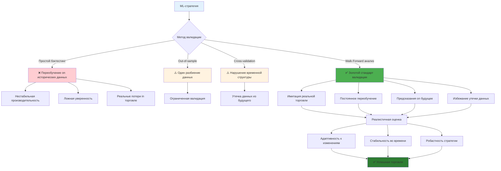
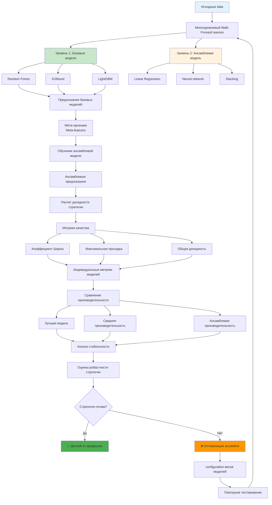
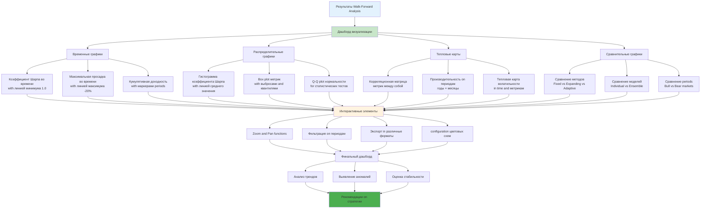
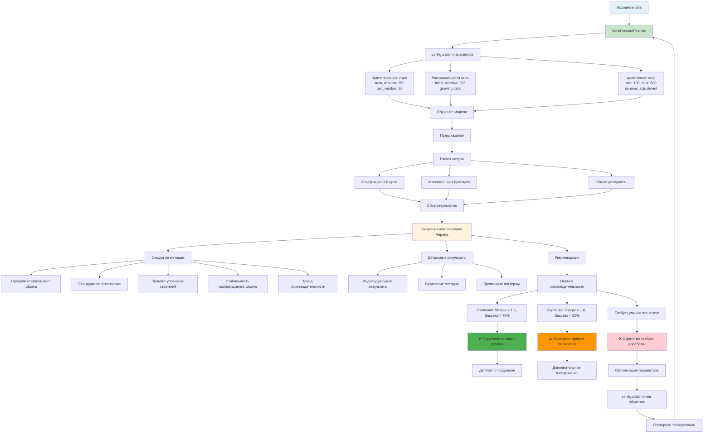

# Углубленное description методик Walk-Forward Analysis

**Author:** Shcherbyna Rostyslav
**Дата:** 2024

## Why Walk-Forward анализ - золотой стандарт валидации

### 🏆 Walk-Forward анализ как золотой стандарт валидации



**Почему Walk-Forward анализ считается самым реалистичным методом валидации?** Потому что он имитирует реальную торговлю - модель постоянно переобучается on новых данных and делает предсказания on будущее. Это единственный способ избежать "утечки данных из будущего".

### Что дает Walk-Forward анализ?

- **Реалистичность**: Имитирует реальную торговлю
- **Адаптивность**: Модель адаптируется к изменяющимся условиям
- **Стабильность**: Проверяет стабильность стратегии во времени
- **Робастность**: Выявляет слабые места стратегии

### Что происходит без Walk-Forward Analysis?

- **Переобучение**: Модель запоминает исторические data
- **Нестабильность**: Стратегия Workingет нестабильно во времени
- **Ложная уверенность**: Завышенные ожидания from стратегии
- **Реальные потери**: Стратегия not Workingет in реальной торговле

## Теоретические основы Walk-Forward Analysis

### Математические принципы

**Walk-Forward как скользящее окно:**

```python
For t = train_window to T - test_window:
 train_data = data[t-train_window:t]
 test_data = data[t:t+test_window]

 model.fit(train_data)
 Predictions = model.predict(test_data)

 performance[t] = evaluate(Predictions, test_data)
```

Где:

- `train_window` - размер окна обучения
- `test_window` - размер окна тестирования
- `T` - общая длина данных
- `performance[t]` - производительность on периоде t

**Критерии качества Walk-Forward:**

1. **Стабильность**: Var(performance) < threshold
2. **Тренд**: performance not ухудшается со временем
3. **Адаптивность**: модель адаптируется к новым условиям
4. **Робастность**: результаты стабильны on разных периодах

### Типы Walk-Forward Analysis

### 📊 Сравнение типов Walk-Forward Analysis

```mermaid
graph TB
 A[Типы Walk-Forward Analysis] --> B[Фиксированное окно]
 A --> C[Расширяющееся окно]
 A --> D[Скользящее окно]
 A --> E[Адаптивное окно]

 B --> B1[Постоянный размер окна]
 B --> B2[Простой in реализации]
 B --> B3[❌ Может устаревать]
 B --> B4[⚡ Быстрое выполнение]
 B --> B5[📊 Фиксированные parameters]

 C --> C1[Окно постоянно растет]
 C --> C2[Использует всю историю]
 C --> C3[⚠️ Может быть медленным]
 C --> C4[📈 Больше данных со временем]
 C --> C5[🔄 Накопление знаний]

 D --> D1[Окно сдвигается]
 D --> D2[Баланс истории and актуальности]
 D --> D3[✅ Наиболее популярный]
 D --> D4[⚖️ Оптимальный баланс]
 D --> D5[🎯 Стабильная производительность]

 E --> E1[Размер адаптируется к условиям]
 E --> E2[Сложный in реализации]
 E --> E3[✅ Наиболее гибкий]
 E --> E4[🧠 Интеллектуальная адаптация]
 E --> E5[📊 Динамические parameters]

 style A fill:#e3f2fd
 style B fill:#ffcdd2
 style C fill:#fff3e0
 style D fill:#c8e6c9
 style E fill:#4caf50
```



#### 1. Фиксированное окно (Fixed Window)

- Постоянный размер окна обучения
- Простой in реализации
- Может устаревать

#### 2. Расширяющееся окно (Expanding Window)

- Окно обучения постоянно растет
- Использует всю доступную историю
- Может быть медленным

#### 3. Скользящее окно (Rolling Window)

- Окно обучения сдвигается
- Баланс между историей and актуальностью
- Наиболее популярный

#### 4. Адаптивное окно (Adaptive Window)

- Размер окна адаптируется к условиям
- Сложный in реализации
- Наиболее гибкий

## Продвинутые методики Walk-Forward Analysis

### 1. Базовый Walk-Forward анализ

### 🔄 Процесс Walk-Forward Analysis

```mermaid
graph TD
 A[Исходные временные data] --> B[configuration параметров]
 B --> C[train_window = 252<br/>test_window = 30<br/>step = 30]

 C --> D[Инициализация цикла]
 D --> E[i = train_window]

 E --> F[Обучающие data<br/>data[i-train_window:i]]
 E --> G[Тестовые data<br/>data[i:i+test_window]]

 F --> H[Обучение модели<br/>model.fit(train_data)]
 G --> I[Предсказания<br/>model.predict(test_data)]

 H --> I
 I --> J[Расчет доходности стратегии<br/>Predictions * returns]

 J --> K[Метрики качества]
 K --> L[Коэффициент Шарпа]
 K --> M[Максимальная просадка]
 K --> N[Общая доходность]

 L --> O[Сохранение результатов]
 M --> O
 N --> O

 O --> P[update индекса<br/>i += step]
 P --> Q{i < len(data) - test_window?}

 Q -->|Да| F
 Q -->|Нет| R[Анализ результатов]

 R --> S[Стабильность во времени]
 R --> T[Адаптивность модели]
 R --> U[Робастность стратегии]

 S --> V[Оценка качества стратегии]
 T --> V
 U --> V

 V --> W{Стратегия успешна?}
 W -->|Да| X[✅ Деплой in продакшен]
 W -->|Нет| Y[❌ Оптимизация параметров]

 Y --> Z[configuration окна обучения]
 Z --> AA[Повторное тестирование]
 AA --> B

 style A fill:#e3f2fd
 style F fill:#c8e6c9
 style G fill:#fff3e0
 style X fill:#4caf50
 style Y fill:#ff9800
```

**Простая реализация:**

```python
def walk_forward_Analysis(data, model, train_window=252, test_window=30, step=30):
 """
 Базовый Walk-Forward анализ for валидации ML-стратегий

 Parameters:
 -----------
 data : pandas.dataFrame
 Временные ряды данных with колонками:
 - 'returns': доходность актива (float)
 - 'features': признаки for модели (array-like)
 - index: временные метки (datetime)

 model : sklearn-compatible model
 Объект модели машинного обучения with методами:
 - fit(X, y): обучение модели
 - predict(X): предсказания
 Должен быть совместим with sklearn API

 train_window : int, default=252
 Размер окна обучения in днях:
 - 252: один торговый год (рекомендуется)
 - 126: полгода (for быстрого тестирования)
 - 504: два года (for долгосрочных стратегий)
 - Минимум: 50 дней for стабильности
 - Максимум: 1000 дней for избежания переобучения

 test_window : int, default=30
 Размер окна тестирования in днях:
 - 30: один месяц (рекомендуется)
 - 7: одна неделя (for высокочастотных стратегий)
 - 90: квартал (for долгосрочных стратегий)
 - Минимум: 5 дней for статистической значимости
 - Максимум: 180 дней for избежания устаревания

 step : int, default=30
 Шаг сдвига окна in днях:
 - 30: ежемесячное переобучение (рекомендуется)
 - 7: еженедельное переобучение (for активных стратегий)
 - 1: ежедневное переобучение (for высокочастотных стратегий)
 - 90: квартальное переобучение (for консервативных стратегий)
 - step <= test_window for избежания пропусков данных

 Returns:
 --------
 pd.dataFrame
 Результаты Analysis with колонками:
 - 'start_date': начало периода обучения (datetime)
 - 'end_date': конец периода обучения (datetime)
 - 'test_start': начало периода тестирования (datetime)
 - 'test_end': конец периода тестирования (datetime)
 - 'sharpe': коэффициент Шарпа за период (float)
 - 'max_drawdown': максимальная просадка за период (float)
 - 'total_return': общая доходность за период (float)
 - 'Predictions': предсказания модели (array)

 Raises:
 -------
 ValueError
 Если train_window < 50 or test_window < 5
 Если step > test_window
 Если len(data) < train_window + test_window

 Examples:
 ---------
 >>> data = pd.read_csv('financial_data.csv', index_col=0, parse_dates=True)
 >>> model = RandomForestRegressor(n_estimators=100)
 >>> results = walk_forward_Analysis(data, model, train_window=252, test_window=30)
 >>> print(f"Средний коэффициент Шарпа: {results['sharpe'].mean():.2f}")
 """
 results = []

 for i in range(train_window, len(data) - test_window, step):
 # Обучающие data
 train_data = data[i-train_window:i]

 # Тестовые data
 test_data = data[i:i+test_window]

 # Обучение модели
 model.fit(train_data)

 # Предсказания
 Predictions = model.predict(test_data)

 # Оценка качества
 returns = test_data['returns']
 strategy_returns = Predictions * returns

 # Метрики
 sharpe = strategy_returns.mean() / strategy_returns.std() * np.sqrt(252)
 max_drawdown = calculate_max_drawdown(strategy_returns)
 total_return = strategy_returns.sum()

 results.append({
 'start_date': train_data.index[0],
 'end_date': train_data.index[-1],
 'test_start': test_data.index[0],
 'test_end': test_data.index[-1],
 'sharpe': sharpe,
 'max_drawdown': max_drawdown,
 'total_return': total_return,
 'Predictions': Predictions
 })

 return pd.dataFrame(results)

# example использования
wf_results = walk_forward_Analysis(data, model, train_window=252, test_window=30, step=30)
```

**Расширяющееся окно:**

```python
def expanding_window_Analysis(data, model, initial_train_window=252, test_window=30, step=30):
 """
 Walk-Forward анализ with расширяющимся окном обучения

 in отличие from фиксированного окна, расширяющееся окно использует всю доступную
 историю данных for обучения, что позволяет модели накапливать знания со временем.

 Parameters:
 -----------
 data : pandas.dataFrame
 Временные ряды данных with колонками:
 - 'returns': доходность актива (float)
 - 'features': признаки for модели (array-like)
 - index: временные метки (datetime)

 model : sklearn-compatible model
 Объект модели машинного обучения with методами:
 - fit(X, y): обучение модели
 - predict(X): предсказания
 Должен быть совместим with sklearn API

 initial_train_window : int, default=252
 Начальный размер окна обучения in днях:
 - 252: один торговый год (рекомендуется)
 - 126: полгода (for быстрого тестирования)
 - 504: два года (for долгосрочных стратегий)
 - Минимум: 50 дней for стабильности
 - После этого окно будет расширяться on step дней каждую итерацию

 test_window : int, default=30
 Размер окна тестирования in днях:
 - 30: один месяц (рекомендуется)
 - 7: одна неделя (for высокочастотных стратегий)
 - 90: квартал (for долгосрочных стратегий)
 - Минимум: 5 дней for статистической значимости
 - Максимум: 180 дней for избежания устаревания

 step : int, default=30
 Шаг сдвига окна in днях:
 - 30: ежемесячное переобучение (рекомендуется)
 - 7: еженедельное переобучение (for активных стратегий)
 - 1: ежедневное переобучение (for высокочастотных стратегий)
 - 90: квартальное переобучение (for консервативных стратегий)
 - step <= test_window for избежания пропусков данных

 Returns:
 --------
 pd.dataFrame
 Результаты Analysis with колонками:
 - 'train_start': начало периода обучения (datetime)
 - 'train_end': конец периода обучения (datetime)
 - 'test_start': начало периода тестирования (datetime)
 - 'test_end': конец периода тестирования (datetime)
 - 'train_size': размер окна обучения (int) - увеличивается со временем
 - 'sharpe': коэффициент Шарпа за период (float)
 - 'max_drawdown': максимальная просадка за период (float)
 - 'total_return': общая доходность за период (float)

 Raises:
 -------
 ValueError
 Если initial_train_window < 50 or test_window < 5
 Если step > test_window
 Если len(data) < initial_train_window + test_window

 Notes:
 ------
 - Расширяющееся окно может быть медленнее фиксированного из-за увеличения
 размера данных for обучения
 - Подходит for стратегий, где исторические data остаются релевантными
 - Может привести к переобучению on старых данных

 Examples:
 ---------
 >>> data = pd.read_csv('financial_data.csv', index_col=0, parse_dates=True)
 >>> model = RandomForestRegressor(n_estimators=100)
 >>> results = expanding_window_Analysis(data, model, initial_train_window=252)
 >>> print(f"Финальный размер окна: {results['train_size'].iloc[-1]}")
 """
 results = []

 for i in range(initial_train_window, len(data) - test_window, step):
 # Обучающие data (расширяющееся окно)
 train_data = data[:i]

 # Тестовые data
 test_data = data[i:i+test_window]

 # Обучение модели
 model.fit(train_data)

 # Предсказания
 Predictions = model.predict(test_data)

 # Оценка качества
 returns = test_data['returns']
 strategy_returns = Predictions * returns

 # Метрики
 sharpe = strategy_returns.mean() / strategy_returns.std() * np.sqrt(252)
 max_drawdown = calculate_max_drawdown(strategy_returns)
 total_return = strategy_returns.sum()

 results.append({
 'train_start': train_data.index[0],
 'train_end': train_data.index[-1],
 'test_start': test_data.index[0],
 'test_end': test_data.index[-1],
 'train_size': len(train_data),
 'sharpe': sharpe,
 'max_drawdown': max_drawdown,
 'total_return': total_return
 })

 return pd.dataFrame(results)

# example использования
expanding_results = expanding_window_Analysis(data, model, initial_train_window=252, test_window=30)
```

### 2. Адаптивный Walk-Forward анализ

### 🧠 Механизм адаптивного окна

```mermaid
graph TD
 A[Исходные data] --> B[Инициализация параметров]
 B --> C[min_window = 100<br/>max_window = 500<br/>current_window = min_window]

 C --> D[Цикл Walk-Forward]
 D --> E[Обучающие data<br/>data[i-current_window:i]]
 E --> F[Обучение модели]
 F --> G[Предсказания and метрики]

 G --> H[Расчет производительности<br/>current_sharpe]
 H --> I{Есть предыдущие результаты?}

 I -->|Нет| J[Сохранение результатов<br/>current_window остается]
 I -->|Да| K[Сравнение with предыдущей производительностью<br/>recent_sharpe]

 K --> L{Производительность ухудшилась?<br/>current_sharpe < recent_sharpe * 0.9}
 L -->|Да| M[Увеличение окна<br/>current_window += 50]
 L -->|Нет| N{Производительность улучшилась?<br/>current_sharpe > recent_sharpe * 1.1}

 N -->|Да| O[Уменьшение окна<br/>current_window -= 50]
 N -->|Нет| P[Окно остается без изменений]

 M --> Q[check границ<br/>current_window = min(current_window, max_window)]
 O --> R[check границ<br/>current_window = max(current_window, min_window)]
 P --> S[Сохранение результатов]
 Q --> S
 R --> S
 J --> S

 S --> T[update индекса<br/>i += step]
 T --> U{Продолжить цикл?}
 U -->|Да| E
 U -->|Нет| V[Анализ адаптивности]

 V --> W[Статистика изменения окна]
 V --> X[Корреляция окна and производительности]
 V --> Y[Оценка эффективности адаптации]

 W --> Z[Финальная оценка стратегии]
 X --> Z
 Y --> Z

 style A fill:#e3f2fd
 style M fill:#ff9800
 style O fill:#4caf50
 style P fill:#fff3e0
 style Z fill:#2e7d32
```

**Адаптация размера окна:**

```python
def adaptive_window_Analysis(data, model, min_window=100, max_window=500,
 test_window=30, step=30, stability_threshold=0.1):
 """
 Walk-Forward анализ with адаптивным окном обучения

 Размер окна обучения автоматически адаптируется on basis производительности
 модели. При ухудшении производительности окно увеличивается, при улучшении - уменьшается.

 Parameters:
 -----------
 data : pandas.dataFrame
 Временные ряды данных with колонками:
 - 'returns': доходность актива (float)
 - 'features': признаки for модели (array-like)
 - index: временные метки (datetime)

 model : sklearn-compatible model
 Объект модели машинного обучения with методами:
 - fit(X, y): обучение модели
 - predict(X): предсказания
 Должен быть совместим with sklearn API

 min_window : int, default=100
 Минимальный размер окна обучения in днях:
 - 100: минимум for стабильности (рекомендуется)
 - 50: for быстрого тестирования
 - 200: for консервативных стратегий
 - Минимум: 30 дней for статистической значимости
 - Максимум: 300 дней for избежания переобучения

 max_window : int, default=500
 Максимальный размер окна обучения in днях:
 - 500: два года торговых дней (рекомендуется)
 - 252: один год (for быстрых стратегий)
 - 1000: четыре года (for долгосрочных стратегий)
 - Минимум: min_window + 100
 - Максимум: 2000 дней for избежания переобучения

 test_window : int, default=30
 Размер окна тестирования in днях:
 - 30: один месяц (рекомендуется)
 - 7: одна неделя (for высокочастотных стратегий)
 - 90: квартал (for долгосрочных стратегий)
 - Минимум: 5 дней for статистической значимости
 - Максимум: 180 дней for избежания устаревания

 step : int, default=30
 Шаг сдвига окна in днях:
 - 30: ежемесячное переобучение (рекомендуется)
 - 7: еженедельное переобучение (for активных стратегий)
 - 1: ежедневное переобучение (for высокочастотных стратегий)
 - 90: квартальное переобучение (for консервативных стратегий)
 - step <= test_window for избежания пропусков данных

 stability_threshold : float, default=0.1
 Порог for определения значимого изменения производительности:
 - 0.1: 10% изменение (рекомендуется)
 - 0.05: 5% изменение (for чувствительных стратегий)
 - 0.2: 20% изменение (for стабильных стратегий)
 - Минимум: 0.01 (1% изменение)
 - Максимум: 0.5 (50% изменение)

 Returns:
 --------
 pd.dataFrame
 Результаты Analysis with колонками:
 - 'train_start': начало периода обучения (datetime)
 - 'train_end': конец периода обучения (datetime)
 - 'test_start': начало периода тестирования (datetime)
 - 'test_end': конец периода тестирования (datetime)
 - 'window_size': текущий размер окна обучения (int)
 - 'sharpe': коэффициент Шарпа за период (float)
 - 'max_drawdown': максимальная просадка за период (float)
 - 'total_return': общая доходность за период (float)

 Raises:
 -------
 ValueError
 Если min_window < 30 or max_window < min_window + 100
 Если test_window < 5 or step > test_window
 Если stability_threshold < 0.01 or stability_threshold > 0.5
 Если len(data) < min_window + test_window

 Notes:
 ------
 - Адаптивное окно может быть нестабильным in начале из-за недостатка данных
 - Рекомендуется использовать минимум 10 итераций for стабилизации
 - Подходит for стратегий with изменяющимися рыночными условиями

 Examples:
 ---------
 >>> data = pd.read_csv('financial_data.csv', index_col=0, parse_dates=True)
 >>> model = RandomForestRegressor(n_estimators=100)
 >>> results = adaptive_window_Analysis(data, model, min_window=100, max_window=500)
 >>> print(f"Средний размер окна: {results['window_size'].mean():.0f}")
 """
 results = []
 current_window = min_window

 for i in range(min_window, len(data) - test_window, step):
 # Обучающие data
 train_data = data[i-current_window:i]

 # Тестовые data
 test_data = data[i:i+test_window]

 # Обучение модели
 model.fit(train_data)

 # Предсказания
 Predictions = model.predict(test_data)

 # Оценка качества
 returns = test_data['returns']
 strategy_returns = Predictions * returns

 # Метрики
 sharpe = strategy_returns.mean() / strategy_returns.std() * np.sqrt(252)
 max_drawdown = calculate_max_drawdown(strategy_returns)
 total_return = strategy_returns.sum()

 # Адаптация размера окна
 if len(results) > 0:
 recent_sharpe = results[-1]['sharpe']
 current_sharpe = sharpe

 # Если производительность ухудшается, увеличиваем окно
 if current_sharpe < recent_sharpe * (1 - stability_threshold):
 current_window = min(current_window + 50, max_window)
 # Если производительность улучшается, уменьшаем окно
 elif current_sharpe > recent_sharpe * (1 + stability_threshold):
 current_window = max(current_window - 50, min_window)

 results.append({
 'train_start': train_data.index[0],
 'train_end': train_data.index[-1],
 'test_start': test_data.index[0],
 'test_end': test_data.index[-1],
 'window_size': current_window,
 'sharpe': sharpe,
 'max_drawdown': max_drawdown,
 'total_return': total_return
 })

 return pd.dataFrame(results)

# example использования
adaptive_results = adaptive_window_Analysis(data, model, min_window=100, max_window=500)
```

**Адаптация on basis волатильности:**

```python
def volatility_adaptive_Analysis(data, model, base_window=252, test_window=30,
 step=30, volatility_lookback=50):
 """
 Walk-Forward анализ with адаптацией размера окна к волатильности рынка

 Размер окна обучения адаптируется on basis текущей волатильности рынка:
 - Высокая волатильность: меньше окно (быстрая адаптация)
 - Низкая волатильность: больше окно (стабильность)

 Parameters:
 -----------
 data : pandas.dataFrame
 Временные ряды данных with колонками:
 - 'returns': доходность актива (float) - используется for расчета волатильности
 - 'features': признаки for модели (array-like)
 - index: временные метки (datetime)

 model : sklearn-compatible model
 Объект модели машинного обучения with методами:
 - fit(X, y): обучение модели
 - predict(X): предсказания
 Должен быть совместим with sklearn API

 base_window : int, default=252
 Базовый размер окна обучения in днях:
 - 252: один торговый год (рекомендуется)
 - 126: полгода (for быстрого тестирования)
 - 504: два года (for долгосрочных стратегий)
 - Минимум: 50 дней for стабильности
 - Максимум: 1000 дней for избежания переобучения

 test_window : int, default=30
 Размер окна тестирования in днях:
 - 30: один месяц (рекомендуется)
 - 7: одна неделя (for высокочастотных стратегий)
 - 90: квартал (for долгосрочных стратегий)
 - Минимум: 5 дней for статистической значимости
 - Максимум: 180 дней for избежания устаревания

 step : int, default=30
 Шаг сдвига окна in днях:
 - 30: ежемесячное переобучение (рекомендуется)
 - 7: еженедельное переобучение (for активных стратегий)
 - 1: ежедневное переобучение (for высокочастотных стратегий)
 - 90: квартальное переобучение (for консервативных стратегий)
 - step <= test_window for избежания пропусков данных

 volatility_lookback : int, default=50
 Период for расчета текущей волатильности in днях:
 - 50: два месяца (рекомендуется)
 - 30: один месяц (for быстрой адаптации)
 - 100: четыре месяца (for стабильной оценки)
 - Минимум: 10 дней for статистической значимости
 - Максимум: 200 дней for избежания устаревания

 Returns:
 --------
 pd.dataFrame
 Результаты Analysis with колонками:
 - 'train_start': начало периода обучения (datetime)
 - 'train_end': конец периода обучения (datetime)
 - 'test_start': начало периода тестирования (datetime)
 - 'test_end': конец периода тестирования (datetime)
 - 'window_size': адаптированный размер окна обучения (int)
 - 'volatility_ratio': отношение текущей к долгосрочной волатильности (float)
 - 'sharpe': коэффициент Шарпа за период (float)
 - 'max_drawdown': максимальная просадка за период (float)
 - 'total_return': общая доходность за период (float)

 Raises:
 -------
 ValueError
 Если base_window < 50 or test_window < 5
 Если step > test_window or volatility_lookback < 10
 Если len(data) < base_window + test_window + volatility_lookback

 Notes:
 ------
 - Адаптация основана on сравнении текущей and долгосрочной волатильности
 - При volatility_ratio > 1.5: окно уменьшается to 70% from базового
 - При volatility_ratio < 0.7: окно увеличивается to 130% from базового
 - Подходит for стратегий, чувствительных к волатильности рынка

 Examples:
 ---------
 >>> data = pd.read_csv('financial_data.csv', index_col=0, parse_dates=True)
 >>> model = RandomForestRegressor(n_estimators=100)
 >>> results = volatility_adaptive_Analysis(data, model, base_window=252)
 >>> print(f"Средний коэффициент волатильности: {results['volatility_ratio'].mean():.2f}")
 """
 results = []

 for i in range(base_window, len(data) - test_window, step):
 # Расчет волатильности
 recent_volatility = data['returns'].iloc[i-volatility_lookback:i].std()
 long_term_volatility = data['returns'].iloc[:i].std()

 # Адаптация размера окна on basis волатильности
 volatility_ratio = recent_volatility / long_term_volatility

 if volatility_ratio > 1.5: # Высокая волатильность
 window_size = int(base_window * 0.7) # Меньше окно
 elif volatility_ratio < 0.7: # Низкая волатильность
 window_size = int(base_window * 1.3) # Больше окно
 else:
 window_size = base_window

 # Обучающие data
 train_data = data[i-window_size:i]

 # Тестовые data
 test_data = data[i:i+test_window]

 # Обучение модели
 model.fit(train_data)

 # Предсказания
 Predictions = model.predict(test_data)

 # Оценка качества
 returns = test_data['returns']
 strategy_returns = Predictions * returns

 # Метрики
 sharpe = strategy_returns.mean() / strategy_returns.std() * np.sqrt(252)
 max_drawdown = calculate_max_drawdown(strategy_returns)
 total_return = strategy_returns.sum()

 results.append({
 'train_start': train_data.index[0],
 'train_end': train_data.index[-1],
 'test_start': test_data.index[0],
 'test_end': test_data.index[-1],
 'window_size': window_size,
 'volatility_ratio': volatility_ratio,
 'sharpe': sharpe,
 'max_drawdown': max_drawdown,
 'total_return': total_return
 })

 return pd.dataFrame(results)

# example использования
vol_adaptive_results = volatility_adaptive_Analysis(data, model, base_window=252)
```

### 3. Многоуровневый Walk-Forward анализ

### 🏗️ Архитектура многоуровневого Analysis



**Иерархический анализ:**

```python
def hierarchical_walk_forward(data, models, train_window=252, test_window=30, step=30):
 """Многоуровневый Walk-Forward анализ"""
 results = []

 for i in range(train_window, len(data) - test_window, step):
 # Обучающие data
 train_data = data[i-train_window:i]

 # Тестовые data
 test_data = data[i:i+test_window]

 # Обучение всех моделей
 model_Predictions = {}
 for name, model in models.items():
 model.fit(train_data)
 model_Predictions[name] = model.predict(test_data)

 # Комбинирование Predictions
 combined_Predictions = np.mean(List(model_Predictions.values()), axis=0)

 # Оценка качества
 returns = test_data['returns']
 strategy_returns = combined_Predictions * returns

 # Метрики
 sharpe = strategy_returns.mean() / strategy_returns.std() * np.sqrt(252)
 max_drawdown = calculate_max_drawdown(strategy_returns)
 total_return = strategy_returns.sum()

 # Индивидуальные метрики моделей
 individual_metrics = {}
 for name, Predictions in model_Predictions.items():
 individual_returns = Predictions * returns
 individual_metrics[name] = {
 'sharpe': individual_returns.mean() / individual_returns.std() * np.sqrt(252),
 'max_drawdown': calculate_max_drawdown(individual_returns),
 'total_return': individual_returns.sum()
 }

 results.append({
 'train_start': train_data.index[0],
 'train_end': train_data.index[-1],
 'test_start': test_data.index[0],
 'test_end': test_data.index[-1],
 'combined_sharpe': sharpe,
 'combined_max_drawdown': max_drawdown,
 'combined_total_return': total_return,
 'individual_metrics': individual_metrics
 })

 return pd.dataFrame(results)

# example использования
models = {
 'model1': RandomForestRegressor(),
 'model2': XGBRegressor(),
 'model3': LGBMRegressor()
}
hierarchical_results = hierarchical_walk_forward(data, models, train_window=252)
```

**Ансамблевый анализ:**

```python
def ensemble_walk_forward(data, base_models, ensemble_model, train_window=252,
 test_window=30, step=30):
 """Walk-Forward анализ with ансамблем"""
 results = []

 for i in range(train_window, len(data) - test_window, step):
 # Обучающие data
 train_data = data[i-train_window:i]

 # Тестовые data
 test_data = data[i:i+test_window]

 # Обучение базовых моделей
 base_Predictions = []
 for name, model in base_models.items():
 model.fit(train_data)
 Predictions = model.predict(test_data)
 base_Predictions.append(Predictions)

 # create мета-признаков
 meta_features = np.column_stack(base_Predictions)

 # Обучение ансамблевой модели
 ensemble_model.fit(meta_features, test_data['returns'])

 # Предсказания ансамбля
 ensemble_Predictions = ensemble_model.predict(meta_features)

 # Оценка качества
 returns = test_data['returns']
 strategy_returns = ensemble_Predictions * returns

 # Метрики
 sharpe = strategy_returns.mean() / strategy_returns.std() * np.sqrt(252)
 max_drawdown = calculate_max_drawdown(strategy_returns)
 total_return = strategy_returns.sum()

 results.append({
 'train_start': train_data.index[0],
 'train_end': train_data.index[-1],
 'test_start': test_data.index[0],
 'test_end': test_data.index[-1],
 'sharpe': sharpe,
 'max_drawdown': max_drawdown,
 'total_return': total_return,
 'base_Predictions': base_Predictions,
 'ensemble_Predictions': ensemble_Predictions
 })

 return pd.dataFrame(results)

# example использования
base_models = {
 'rf': RandomForestRegressor(),
 'xgb': XGBRegressor(),
 'lgb': LGBMRegressor()
}
ensemble_model = LinearRegression()
ensemble_results = ensemble_walk_forward(data, base_models, ensemble_model)
```

## Метрики качества Walk-Forward Analysis

### 📊 Классификация метрик качества Walk-Forward Analysis

```mermaid
graph TD
 A[Метрики качества Walk-Forward] --> B[Временные метрики]
 A --> C[Статистические метрики]
 A --> D[Экономические метрики]

 B --> B1[Стабильность во времени]
 B1 --> B11[Стабильность коэффициента Шарпа<br/>1 / (std / mean)]
 B1 --> B12[Тренд производительности<br/>polyfit slope]
 B1 --> B13[Волатильность производительности<br/>rolling std]
 B1 --> B14[Коэффициент стабильности<br/>1 / volatility]

 B --> B2[Адаптивность]
 B2 --> B21[Скорость адаптации<br/>abs(current - recent) / recent]
 B2 --> B22[Волатильность адаптации<br/>std adaptation_speed]
 B2 --> B23[Коэффициент адаптивности<br/>mean_speed / volatility]

 C --> C1[Статистическая значимость]
 C1 --> C11[Тест on нормальность<br/>Shapiro-Wilk p-value > 0.05]
 C1 --> C12[Тест on стационарность<br/>ADF p-value < 0.05]
 C1 --> C13[Доверительный интервал<br/>t-distribution 95%]
 C1 --> C14[Статистическая значимость<br/>ADF < 0.05 AND Shapiro > 0.05]

 C --> C2[Корреляция with рынком]
 C2 --> C21[Корреляция with волатильностью<br/>corr(sharpe, volatility)]
 C2 --> C22[Корреляция with доходностью<br/>corr(sharpe, returns)]
 C2 --> C23[Корреляция with трендом<br/>corr(sharpe, trend)]

 D --> D1[Экономическая значимость]
 D1 --> D11[Учет транзакционных издержек<br/>net_returns = returns - costs]
 D1 --> D12[Минимальный коэффициент Шарпа<br/>≥ 1.0]
 D1 --> D13[Максимальная просадка<br/>≤ 20%]
 D1 --> D14[Процент успешных periods<br/>≥ 60%]

 D --> D2[Рентабельность]
 D2 --> D21[Кумулятивная доходность<br/>cumprod(1 + returns)]
 D2 --> D22[Финальная стоимость портфеля<br/>initial * cumulative]
 D2 --> D23[Годовая доходность<br/>annualized return]
 D2 --> D24[Максимальная просадка<br/>min drawdown]

 style A fill:#e3f2fd
 style B fill:#c8e6c9
 style C fill:#fff3e0
 style D fill:#f3e5f5
```

### 1. Временные метрики

**Стабильность во времени:**

```python
def calculate_temporal_stability(results):
 """
 Расчет стабильности производительности во времени

 Анализирует стабильность коэффициента Шарпа and других метрик во времени,
 что является ключевым показателем качества Walk-Forward Analysis.

 Parameters:
 -----------
 results : pd.dataFrame
 Результаты Walk-Forward Analysis with колонками:
 - 'sharpe': коэффициент Шарпа за каждый период (float)
 - 'max_drawdown': максимальная просадка за каждый период (float)
 - 'total_return': общая доходность за каждый период (float)
 - index: временные метки periods (datetime)

 Returns:
 --------
 dict
 Словарь with метриками стабильности:
 - 'sharpe_stability': стабильность коэффициента Шарпа (float)
 - > 2.0: отличная стабильность
 - 1.0-2.0: хорошая стабильность
 - 0.5-1.0: умеренная стабильность
 - < 0.5: низкая стабильность
 - 'sharpe_trend': тренд коэффициента Шарпа (float)
 - > 0: improve со временем
 - = 0: стабильная производительность
 - < 0: ухудшение со временем
 - 'performance_volatility': волатильность производительности (float)
 - < 0.1: низкая волатильность
 - 0.1-0.3: умеренная волатильность
 - > 0.3: высокая волатильность
 - 'stability_coefficient': общий коэффициент стабильности (float)
 - > 10: отличная стабильность
 - 5-10: хорошая стабильность
 - 2-5: умеренная стабильность
 - < 2: низкая стабильность

 Raises:
 -------
 ValueError
 Если results not содержит колонку 'sharpe'
 Если results пустой or содержит NaN значения

 Notes:
 ------
 - Стабильность рассчитывается как обратная величина к коэффициенту вариации
 - Тренд рассчитывается with помощью линейной регрессии
 - Волатильность рассчитывается как скользящее стандартное отклонение
 - Рекомендуется минимум 10 periods for надежной оценки

 Examples:
 ---------
 >>> results = walk_forward_Analysis(data, model)
 >>> stability = calculate_temporal_stability(results)
 >>> print(f"Стабильность Шарпа: {stability['sharpe_stability']:.2f}")
 """
 # Стабильность коэффициента Шарпа
 sharpe_std = results['sharpe'].std()
 sharpe_mean = results['sharpe'].mean()
 sharpe_stability = 1 / (sharpe_std / sharpe_mean) if sharpe_mean != 0 else 0

 # Тренд производительности
 sharpe_trend = np.polyfit(range(len(results)), results['sharpe'], 1)[0]

 # Волатильность производительности
 performance_volatility = results['sharpe'].rolling(5).std().mean()

 # Коэффициент стабильности
 stability_coefficient = 1 / performance_volatility if performance_volatility > 0 else 0

 return {
 'sharpe_stability': sharpe_stability,
 'sharpe_trend': sharpe_trend,
 'performance_volatility': performance_volatility,
 'stability_coefficient': stability_coefficient
 }

# example использования
temporal_metrics = calculate_temporal_stability(wf_results)
```

**Адаптивность:**

```python
def calculate_adaptability(results, lookback=5):
 """
 Расчет адаптивности модели к изменяющимся условиям

 Анализирует способность модели адаптироваться к новым рыночным условиям
 on basis изменений in производительности во времени.

 Parameters:
 -----------
 results : pd.dataFrame
 Результаты Walk-Forward Analysis with колонками:
 - 'sharpe': коэффициент Шарпа за каждый период (float)
 - 'max_drawdown': максимальная просадка за каждый период (float)
 - 'total_return': общая доходность за каждый период (float)
 - index: временные метки periods (datetime)

 lookback : int, default=5
 Количество periods for расчета адаптивности:
 - 5: пять periods (рекомендуется)
 - 3: три периода (for быстрой адаптации)
 - 10: десять periods (for стабильной оценки)
 - Минимум: 2 периода for расчета
 - Максимум: 20 periods for избежания устаревания

 Returns:
 --------
 dict
 Словарь with метриками адаптивности:
 - 'mean_adaptation_speed': средняя скорость адаптации (float)
 - > 0.2: высокая адаптивность
 - 0.1-0.2: умеренная адаптивность
 - 0.05-0.1: низкая адаптивность
 - < 0.05: очень низкая адаптивность
 - 'adaptation_volatility': волатильность адаптации (float)
 - < 0.1: стабильная адаптация
 - 0.1-0.3: умеренная волатильность
 - > 0.3: нестабильная адаптация
 - 'adaptability_coefficient': коэффициент адаптивности (float)
 - > 2.0: отличная адаптивность
 - 1.0-2.0: хорошая адаптивность
 - 0.5-1.0: умеренная адаптивность
 - < 0.5: низкая адаптивность

 Raises:
 -------
 ValueError
 Если results not содержит колонку 'sharpe'
 Если lookback < 2 or lookback > len(results) - 1
 Если results пустой or содержит NaN значения

 Notes:
 ------
 - Скорость адаптации рассчитывается как абсолютное изменение
 производительности относительно предыдущих periods
 - Волатильность адаптации показывает стабильность процесса адаптации
 - Коэффициент адаптивности - отношение скорости к волатильности
 - Рекомендуется минимум 10 periods for надежной оценки

 Examples:
 ---------
 >>> results = walk_forward_Analysis(data, model)
 >>> adaptability = calculate_adaptability(results, lookback=5)
 >>> print(f"Скорость адаптации: {adaptability['mean_adaptation_speed']:.3f}")
 """
 # Скорость адаптации
 adaptation_speed = []
 for i in range(lookback, len(results)):
 recent_performance = results['sharpe'].iloc[i-lookback:i].mean()
 current_performance = results['sharpe'].iloc[i]
 adaptation = abs(current_performance - recent_performance) / recent_performance
 adaptation_speed.append(adaptation)

 # Средняя скорость адаптации
 mean_adaptation_speed = np.mean(adaptation_speed)

 # Волатильность адаптации
 adaptation_volatility = np.std(adaptation_speed)

 # Коэффициент адаптивности
 adaptability_coefficient = mean_adaptation_speed / adaptation_volatility if adaptation_volatility > 0 else 0

 return {
 'mean_adaptation_speed': mean_adaptation_speed,
 'adaptation_volatility': adaptation_volatility,
 'adaptability_coefficient': adaptability_coefficient
 }

# example использования
adaptability_metrics = calculate_adaptability(wf_results, lookback=5)
```

### 2. Статистические метрики

**Статистическая значимость:**

```python
def calculate_statistical_significance(results, confidence_level=0.95):
 """
 Расчет статистической значимости результатов Walk-Forward Analysis

 Проводит статистические тесты for оценки значимости результатов:
 - Тест on нормальность (Shapiro-Wilk)
 - Тест on стационарность (Augmented Dickey-Fuller)
 - Расчет доверительных интервалов

 Parameters:
 -----------
 results : pd.dataFrame
 Результаты Walk-Forward Analysis with колонками:
 - 'sharpe': коэффициент Шарпа за каждый период (float)
 - 'max_drawdown': максимальная просадка за каждый период (float)
 - 'total_return': общая доходность за каждый период (float)
 - index: временные метки periods (datetime)

 confidence_level : float, default=0.95
 Уровень доверия for доверительных интервалов:
 - 0.95: 95% доверительный интервал (рекомендуется)
 - 0.99: 99% доверительный интервал (for консервативных оценок)
 - 0.90: 90% доверительный интервал (for менее строгих оценок)
 - Минимум: 0.80 (80% доверительный интервал)
 - Максимум: 0.999 (99.9% доверительный интервал)

 Returns:
 --------
 dict
 Словарь with результатами статистических тестов:
 - 'shapiro_statistic': статистика теста Шапиро-Уилка (float)
 - 'shapiro_pvalue': p-value теста on нормальность (float)
 - > 0.05: data нормально распределены
 - <= 0.05: data not нормально распределены
 - 'adf_statistic': статистика теста ADF (float)
 - 'adf_pvalue': p-value теста on стационарность (float)
 - < 0.05: data стационарны
 - >= 0.05: data not стационарны
 - 'confidence_interval': доверительный интервал (tuple)
 - (lower_bound, upper_bound) for среднего коэффициента Шарпа
 - 'is_significant': общая статистическая значимость (bool)
 - True: результаты статистически значимы
 - False: результаты not статистически значимы

 Raises:
 -------
 ValueError
 Если results not содержит колонку 'sharpe'
 Если confidence_level < 0.80 or confidence_level > 0.999
 Если results пустой or содержит NaN значения

 Notes:
 ------
 - Тест on нормальность проверяет, что коэффициенты Шарпа нормально распределены
 - Тест on стационарность проверяет, что производительность стабильна во времени
 - Доверительный интервал рассчитывается with использованием t-распределения
 - Рекомендуется минимум 30 periods for надежных статистических тестов

 Examples:
 ---------
 >>> results = walk_forward_Analysis(data, model)
 >>> significance = calculate_statistical_significance(results, confidence_level=0.95)
 >>> print(f"Статистически значимо: {significance['is_significant']}")
 """
 from scipy import stats

 # Тест on нормальность
 shapiro_stat, shapiro_pvalue = stats.shapiro(results['sharpe'])

 # Тест on стационарность
 adf_stat, adf_pvalue = stats.adfuller(results['sharpe'])

 # Доверительный интервал
 mean_sharpe = results['sharpe'].mean()
 std_sharpe = results['sharpe'].std()
 n = len(results)

 t_value = stats.t.ppf((1 + confidence_level) / 2, n - 1)
 margin_error = t_value * std_sharpe / np.sqrt(n)

 confidence_interval = (mean_sharpe - margin_error, mean_sharpe + margin_error)

 # Статистическая значимость
 is_significant = adf_pvalue < 0.05 and shapiro_pvalue > 0.05

 return {
 'shapiro_statistic': shapiro_stat,
 'shapiro_pvalue': shapiro_pvalue,
 'adf_statistic': adf_stat,
 'adf_pvalue': adf_pvalue,
 'confidence_interval': confidence_interval,
 'is_significant': is_significant
 }

# example использования
statistical_metrics = calculate_statistical_significance(wf_results)
```

**Корреляция with рыночными условиями:**

```python
def calculate_market_correlation(results, market_data):
 """Расчет корреляции with рыночными условиями"""
 # Корреляция with волатильностью рынка
 market_volatility = market_data['returns'].rolling(30).std()
 volatility_correlation = results['sharpe'].corr(market_volatility.iloc[results.index])

 # Корреляция with доходностью рынка
 market_returns = market_data['returns'].rolling(30).mean()
 returns_correlation = results['sharpe'].corr(market_returns.iloc[results.index])

 # Корреляция with трендом рынка
 market_trend = market_data['price'].rolling(30).apply(lambda x: np.polyfit(range(len(x)), x, 1)[0])
 trend_correlation = results['sharpe'].corr(market_trend.iloc[results.index])

 return {
 'volatility_correlation': volatility_correlation,
 'returns_correlation': returns_correlation,
 'trend_correlation': trend_correlation
 }

# example использования
market_correlation = calculate_market_correlation(wf_results, market_data)
```

### 3. Экономические метрики

**Экономическая значимость:**

```python
def calculate_economic_significance(results, transaction_costs=0.001,
 min_sharpe=1.0, max_drawdown=0.2):
 """
 Расчет экономической значимости результатов Walk-Forward Analysis

 Оценивает экономическую целесообразность стратегии with учетом
 транзакционных издержек and практических ограничений.

 Parameters:
 -----------
 results : pd.dataFrame
 Результаты Walk-Forward Analysis with колонками:
 - 'sharpe': коэффициент Шарпа за каждый период (float)
 - 'max_drawdown': максимальная просадка за каждый период (float)
 - 'total_return': общая доходность за каждый период (float)
 - index: временные метки periods (datetime)

 transaction_costs : float, default=0.001
 Транзакционные издержки on одну сделку (in долях from капитала):
 - 0.001: 0.1% (рекомендуется for акций)
 - 0.0005: 0.05% (for ETF and индексов)
 - 0.002: 0.2% (for форекса and криптовалют)
 - 0.005: 0.5% (for экзотических активов)
 - Минимум: 0.0001 (0.01%)
 - Максимум: 0.01 (1%)

 min_sharpe : float, default=1.0
 Минимальный приемлемый коэффициент Шарпа:
 - 1.0: базовый уровень (рекомендуется)
 - 1.5: хороший уровень for профессиональных стратегий
 - 2.0: отличный уровень for институциональных стратегий
 - 0.5: минимальный уровень for консервативных стратегий
 - Минимум: 0.1
 - Максимум: 5.0

 max_drawdown : float, default=0.2
 Максимально допустимая просадка (in долях from капитала):
 - 0.2: 20% (рекомендуется for большинства стратегий)
 - 0.1: 10% (for консервативных стратегий)
 - 0.3: 30% (for агрессивных стратегий)
 - 0.05: 5% (for очень консервативных стратегий)
 - Минимум: 0.01 (1%)
 - Максимум: 0.5 (50%)

 Returns:
 --------
 dict
 Словарь with метриками экономической значимости:
 - 'mean_sharpe': средний коэффициент Шарпа (float)
 - 'mean_max_drawdown': средняя максимальная просадка (float)
 - 'success_rate': процент успешных periods (float)
 - >= 0.7: отличная стратегия
 - 0.5-0.7: хорошая стратегия
 - 0.3-0.5: умеренная стратегия
 - < 0.3: слабая стратегия
 - 'economically_significant': общая экономическая значимость (bool)
 - True: стратегия экономически значима
 - False: стратегия not экономически значима

 Raises:
 -------
 ValueError
 Если results not содержит колонки 'sharpe', 'max_drawdown', 'total_return'
 Если transaction_costs < 0 or transaction_costs > 0.01
 Если min_sharpe < 0.1 or min_sharpe > 5.0
 Если max_drawdown < 0.01 or max_drawdown > 0.5

 Notes:
 ------
 - Транзакционные издержки вычитаются из общей доходности
 - Успешным считается период with коэффициентом Шарпа >= min_sharpe
 - Экономическая значимость требует выполнения всех критериев simultaneously
 - Рекомендуется минимум 20 periods for надежной оценки

 Examples:
 ---------
 >>> results = walk_forward_Analysis(data, model)
 >>> economic = calculate_economic_significance(results, transaction_costs=0.001)
 >>> print(f"Экономически значима: {economic['economically_significant']}")
 """
 # Учет транзакционных издержек
 net_returns = results['total_return'] - transaction_costs

 # Метрики
 mean_sharpe = results['sharpe'].mean()
 mean_max_drawdown = results['max_drawdown'].mean()
 success_rate = (results['sharpe'] > min_sharpe).mean()

 # Экономическая значимость
 economically_significant = (
 mean_sharpe >= min_sharpe and
 abs(mean_max_drawdown) <= max_drawdown and
 success_rate >= 0.6
 )

 return {
 'mean_sharpe': mean_sharpe,
 'mean_max_drawdown': mean_max_drawdown,
 'success_rate': success_rate,
 'economically_significant': economically_significant
 }

# example использования
economic_metrics = calculate_economic_significance(wf_results, transaction_costs=0.001)
```

**Рентабельность:**

```python
def calculate_profitability(results, initial_capital=100000):
 """
 Расчет рентабельности стратегии on basis результатов Walk-Forward Analysis

 Анализирует финансовую эффективность стратегии with учетом
 начального капитала and кумулятивной доходности.

 Parameters:
 -----------
 results : pd.dataFrame
 Результаты Walk-Forward Analysis with колонками:
 - 'total_return': общая доходность за каждый период (float)
 - 'max_drawdown': максимальная просадка за каждый период (float)
 - index: временные метки periods (datetime)

 initial_capital : float, default=100000
 Начальный капитал for расчета рентабельности:
 - 100000: $100,000 (рекомендуется for тестирования)
 - 10000: $10,000 (for малых счетов)
 - 1000000: $1,000,000 (for институциональных стратегий)
 - 1000: $1,000 (for демо-счетов)
 - Минимум: 100 (for минимального тестирования)
 - Максимум: 10000000 (for крупных портфелей)

 Returns:
 --------
 dict
 Словарь with метриками рентабельности:
 - 'final_value': финальная стоимость портфеля (float)
 - 'total_return': общая доходность за весь период (float)
 - > 0.5: отличная доходность (50%+)
 - 0.2-0.5: хорошая доходность (20-50%)
 - 0.1-0.2: умеренная доходность (10-20%)
 - < 0.1: низкая доходность (<10%)
 - 'annual_return': годовая доходность (float)
 - > 0.2: отличная годовая доходность (20%+)
 - 0.1-0.2: хорошая годовая доходность (10-20%)
 - 0.05-0.1: умеренная годовая доходность (5-10%)
 - < 0.05: низкая годовая доходность (<5%)
 - 'max_drawdown': максимальная просадка за весь период (float)
 - < 0.1: отличная стабильность (<10%)
 - 0.1-0.2: хорошая стабильность (10-20%)
 - 0.2-0.3: умеренная стабильность (20-30%)
 - > 0.3: низкая стабильность (>30%)

 Raises:
 -------
 ValueError
 Если results not содержит колонки 'total_return', 'max_drawdown'
 Если initial_capital <= 0 or initial_capital > 10000000
 Если results пустой or содержит NaN значения

 Notes:
 ------
 - Кумулятивная доходность рассчитывается как произведение (1 + returns)
 - Годовая доходность рассчитывается with учетом количества лет
 - Максимальная просадка берется как минимум из всех periods
 - Рекомендуется минимум 12 periods for расчета годовой доходности

 Examples:
 ---------
 >>> results = walk_forward_Analysis(data, model)
 >>> profitability = calculate_profitability(results, initial_capital=100000)
 >>> print(f"Финальная стоимость: ${profitability['final_value']:,.2f}")
 """
 # Кумулятивная доходность
 cumulative_returns = (1 + results['total_return']).cumprod()

 # Финальная стоимость портфеля
 final_value = initial_capital * cumulative_returns.iloc[-1]

 # Общая доходность
 total_return = (final_value - initial_capital) / initial_capital

 # Годовая доходность
 years = len(results) / 12 # Предполагаем месячные результаты
 annual_return = (final_value / initial_capital) ** (1 / years) - 1

 # Максимальная просадка
 max_drawdown = results['max_drawdown'].min()

 return {
 'final_value': final_value,
 'total_return': total_return,
 'annual_return': annual_return,
 'max_drawdown': max_drawdown
 }

# example использования
profitability_metrics = calculate_profitability(wf_results, initial_capital=100000)
```

## Визуализация Walk-Forward Analysis

### 📈 Дашборд визуализации результатов Walk-Forward Analysis



### 1. Временные графики

```python
def visualize_walk_forward_results(results, save_path=None):
 """
 Визуализация результатов Walk-Forward Analysis

 Создает комплексный дашборд with графиками for Analysis производительности
 стратегии во времени, including временные ряды and распределения метрик.

 Parameters:
 -----------
 results : pd.dataFrame
 Результаты Walk-Forward Analysis with колонками:
 - 'sharpe': коэффициент Шарпа за каждый период (float)
 - 'max_drawdown': максимальная просадка за каждый период (float)
 - 'total_return': общая доходность за каждый период (float)
 - index: временные метки periods (datetime)

 save_path : str, optional
 Путь for сохранения графика:
 - None: график отображается on экране (on умолчанию)
 - 'path/to/file.png': сохранение in PNG формате
 - 'path/to/file.pdf': сохранение in PDF формате
 - 'path/to/file.svg': сохранение in SVG формате
 - Поддерживаемые форматы: .png, .pdf, .svg, .jpg, .jpeg

 Returns:
 --------
 None
 График отображается on экране or сохраняется in файл

 Raises:
 -------
 ValueError
 Если results not содержит колонки 'sharpe', 'max_drawdown', 'total_return'
 Если results пустой or содержит NaN значения

 ImportError
 Если not установлены matplotlib or seaborn

 Notes:
 ------
 - Создается фигура 2x2 with четырьмя графиками:
 1. Коэффициент Шарпа во времени with линией минимума 1.0
 2. Максимальная просадка во времени with линией максимума -20%
 3. Распределение коэффициента Шарпа with линией среднего
 4. Кумулятивная доходность во времени
 - Используется стиль 'seaborn-v0_8' for профессионального вида
 - Графики автоматически масштабируются and форматируются
 - Рекомендуется минимум 10 periods for информативных графиков

 Examples:
 ---------
 >>> results = walk_forward_Analysis(data, model)
 >>> visualize_walk_forward_results(results)
 >>> visualize_walk_forward_results(results, save_path='results.png')
 """
 import matplotlib.pyplot as plt
 import seaborn as sns

 # configuration стиля
 plt.style.Use('seaborn-v0_8')
 sns.set_palette("husl")

 # create фигуры
 fig, axes = plt.subplots(2, 2, figsize=(15, 10))

 # 1. Коэффициент Шарпа во времени
 axes[0, 0].plot(results.index, results['sharpe'], marker='o')
 axes[0, 0].axhline(y=1.0, color='red', linestyle='--', label='Минимальный Sharpe')
 axes[0, 0].set_title('Коэффициент Шарпа во времени')
 axes[0, 0].set_xlabel('Период')
 axes[0, 0].set_ylabel('Коэффициент Шарпа')
 axes[0, 0].legend()
 axes[0, 0].grid(True)

 # 2. Максимальная просадка во времени
 axes[0, 1].plot(results.index, results['max_drawdown'], marker='o', color='red')
 axes[0, 1].axhline(y=-0.2, color='red', linestyle='--', label='Максимальная просадка 20%')
 axes[0, 1].set_title('Максимальная просадка во времени')
 axes[0, 1].set_xlabel('Период')
 axes[0, 1].set_ylabel('Максимальная просадка')
 axes[0, 1].legend()
 axes[0, 1].grid(True)

 # 3. Распределение коэффициента Шарпа
 axes[1, 0].hist(results['sharpe'], bins=20, alpha=0.7, edgecolor='black')
 axes[1, 0].axvline(results['sharpe'].mean(), color='red', linestyle='--',
 label=f'Среднее: {results["sharpe"].mean():.2f}')
 axes[1, 0].set_title('Распределение коэффициента Шарпа')
 axes[1, 0].set_xlabel('Коэффициент Шарпа')
 axes[1, 0].set_ylabel('Частота')
 axes[1, 0].legend()
 axes[1, 0].grid(True)

 # 4. Кумулятивная доходность
 cumulative_returns = (1 + results['total_return']).cumprod()
 axes[1, 1].plot(results.index, cumulative_returns, marker='o')
 axes[1, 1].set_title('Кумулятивная доходность')
 axes[1, 1].set_xlabel('Период')
 axes[1, 1].set_ylabel('Кумулятивная доходность')
 axes[1, 1].grid(True)

 plt.tight_layout()

 if save_path:
 plt.savefig(save_path, dpi=300, bbox_inches='tight')

 plt.show()

# example использования
visualize_walk_forward_results(wf_results, save_path='walk_forward_results.png')
```

### 2. Тепловые карты

```python
def create_heatmap_Analysis(results, save_path=None):
 """
 create тепловых карт for Analysis результатов Walk-Forward

 Создает тепловые карты for визуализации корреляций между метриками
 and производительности on различным временным периодам.

 Parameters:
 -----------
 results : pd.dataFrame
 Результаты Walk-Forward Analysis with колонками:
 - 'sharpe': коэффициент Шарпа за каждый период (float)
 - 'max_drawdown': максимальная просадка за каждый период (float)
 - 'total_return': общая доходность за каждый период (float)
 - 'window_size': размер окна обучения (int, опционально)
 - index: временные метки periods (datetime)

 save_path : str, optional
 Путь for сохранения графика:
 - None: график отображается on экране (on умолчанию)
 - 'path/to/file.png': сохранение in PNG формате
 - 'path/to/file.pdf': сохранение in PDF формате
 - 'path/to/file.svg': сохранение in SVG формате
 - Поддерживаемые форматы: .png, .pdf, .svg, .jpg, .jpeg

 Returns:
 --------
 None
 График отображается on экране or сохраняется in файл

 Raises:
 -------
 ValueError
 Если results not содержит колонки 'sharpe', 'max_drawdown', 'total_return'
 Если results пустой or содержит NaN значения

 ImportError
 Если not установлены matplotlib or seaborn

 Notes:
 ------
 - Создается фигура 1x2 with двумя тепловыми картами:
 1. Корреляционная матрица между метриками (sharpe, max_drawdown, total_return)
 2. Производительность on периодам (годы × месяцы) - если есть window_size
 - Корреляционная матрица использует цветовую схему 'coolwarm' with центром in 0
 - Тепловая карта производительности использует цветовую схему 'RdYlGn' with центром in 1.0
 - Автоматически обрабатывает отсутствие колонки window_size
 - Рекомендуется минимум 12 periods for информативных тепловых карт

 Examples:
 ---------
 >>> results = walk_forward_Analysis(data, model)
 >>> create_heatmap_Analysis(results)
 >>> create_heatmap_Analysis(results, save_path='heatmap.png')
 """
 import matplotlib.pyplot as plt
 import seaborn as sns

 # create матрицы корреляций
 correlation_matrix = results[['sharpe', 'max_drawdown', 'total_return']].corr()

 # create фигуры
 fig, axes = plt.subplots(1, 2, figsize=(15, 6))

 # 1. Тепловая карта корреляций
 sns.heatmap(correlation_matrix, annot=True, cmap='coolwarm', center=0,
 square=True, ax=axes[0])
 axes[0].set_title('Корреляционная матрица метрик')

 # 2. Тепловая карта производительности on периодам
 if 'window_size' in results.columns:
 pivot_table = results.pivot_table(values='sharpe',
 index=results.index // 12, # Годы
 columns=results.index % 12, # Месяцы
 fill_value=0)
 sns.heatmap(pivot_table, annot=True, cmap='RdYlGn', center=1.0,
 ax=axes[1])
 axes[1].set_title('Производительность on периодам')
 axes[1].set_xlabel('Месяц')
 axes[1].set_ylabel('Год')

 plt.tight_layout()

 if save_path:
 plt.savefig(save_path, dpi=300, bbox_inches='tight')

 plt.show()

# example использования
create_heatmap_Analysis(wf_results, save_path='walk_forward_heatmap.png')
```

## Автоматизация Walk-Forward Analysis

### 🤖 Пайплайн автоматизации Walk-Forward Analysis



### 1. Пайплайн Walk-Forward Analysis

```python
class WalkForwardPipeline:
 """
 Пайплайн for автоматизации Walk-Forward Analysis

 Комплексный класс for проведения различных типов Walk-Forward Analysis
 with автоматической генерацией Reportов and рекомендаций.

 Parameters:
 -----------
 data : pandas.dataFrame
 Временные ряды данных with колонками:
 - 'returns': доходность актива (float)
 - 'features': признаки for модели (array-like)
 - index: временные метки (datetime)

 model : sklearn-compatible model
 Объект модели машинного обучения with методами:
 - fit(X, y): обучение модели
 - predict(X): предсказания
 Должен быть совместим with sklearn API

 metrics_calculator : object
 Объект for расчета метрик качества with методом:
 - calculate(returns): расчет метрик on basis доходности
 Должен возвращать словарь with метриками (sharpe, max_drawdown, total_return)

 Attributes:
 -----------
 data : pandas.dataFrame
 Исходные data for Analysis

 model : sklearn-compatible model
 Модель машинного обучения

 metrics_calculator : object
 Калькулятор метрик качества

 results : dict
 Словарь with результатами различных типов Analysis:
 - 'fixed_window': результаты фиксированного окна
 - 'expanding_window': результаты расширяющегося окна
 - 'adaptive_window': результаты адаптивного окна

 Methods:
 --------
 run_fixed_window_Analysis(train_window, test_window, step)
 Launch Analysis with фиксированным окном

 run_expanding_window_Analysis(initial_train_window, test_window, step)
 Launch Analysis with расширяющимся окном

 run_adaptive_window_Analysis(min_window, max_window, test_window, step)
 Launch Analysis with адаптивным окном

 generate_comprehensive_Report()
 Генерация комплексного Reportа

 Raises:
 -------
 ValueError
 Если data not содержит необходимые колонки
 Если model not имеет методов fit and predict
 Если metrics_calculator not имеет метода calculate

 Examples:
 ---------
 >>> from sklearn.ensemble import RandomForestRegressor
 >>> from src.metrics import MetricsCalculator
 >>>
 >>> model = RandomForestRegressor(n_estimators=100)
 >>> metrics_calc = MetricsCalculator()
 >>> pipeline = WalkForwardPipeline(data, model, metrics_calc)
 >>>
 >>> # Launch всех типов Analysis
 >>> pipeline.run_fixed_window_Analysis()
 >>> pipeline.run_expanding_window_Analysis()
 >>> pipeline.run_adaptive_window_Analysis()
 >>>
 >>> # Генерация Reportа
 >>> Report = pipeline.generate_comprehensive_Report()
 """

 def __init__(self, data, model, metrics_calculator):
 """
 Pipeline initialization Walk-Forward Analysis

 Parameters:
 -----------
 data : pandas.dataFrame
 Временные ряды данных with колонками 'returns' and 'features'

 model : sklearn-compatible model
 Модель машинного обучения with методами fit and predict

 metrics_calculator : object
 Калькулятор метрик with методом calculate
 """
 self.data = data
 self.model = model
 self.metrics_calculator = metrics_calculator
 self.results = {}

 def run_fixed_window_Analysis(self, train_window=252, test_window=30, step=30):
 """
 Launch Walk-Forward Analysis with фиксированным окном обучения

 Parameters:
 -----------
 train_window : int, default=252
 Размер окна обучения in днях:
 - 252: один торговый год (рекомендуется)
 - 126: полгода (for быстрого тестирования)
 - 504: два года (for долгосрочных стратегий)
 - Минимум: 50 дней for стабильности
 - Максимум: 1000 дней for избежания переобучения

 test_window : int, default=30
 Размер окна тестирования in днях:
 - 30: один месяц (рекомендуется)
 - 7: одна неделя (for высокочастотных стратегий)
 - 90: квартал (for долгосрочных стратегий)
 - Минимум: 5 дней for статистической значимости
 - Максимум: 180 дней for избежания устаревания

 step : int, default=30
 Шаг сдвига окна in днях:
 - 30: ежемесячное переобучение (рекомендуется)
 - 7: еженедельное переобучение (for активных стратегий)
 - 1: ежедневное переобучение (for высокочастотных стратегий)
 - 90: квартальное переобучение (for консервативных стратегий)
 - step <= test_window for избежания пропусков данных

 Returns:
 --------
 pd.dataFrame
 Результаты Analysis with колонками:
 - 'train_start': начало периода обучения (datetime)
 - 'train_end': конец периода обучения (datetime)
 - 'test_start': начало периода тестирования (datetime)
 - 'test_end': конец периода тестирования (datetime)
 - 'window_size': размер окна обучения (int)
 - 'sharpe': коэффициент Шарпа за период (float)
 - 'max_drawdown': максимальная просадка за период (float)
 - 'total_return': общая доходность за период (float)

 Raises:
 -------
 ValueError
 Если train_window < 50 or test_window < 5
 Если step > test_window
 Если len(data) < train_window + test_window

 Notes:
 ------
 - Результаты сохраняются in self.results['fixed_window']
 - Модель переобучается on каждом шаге
 - Подходит for стратегий with стабильными рыночными условиями
 """
 results = []

 for i in range(train_window, len(self.data) - test_window, step):
 # Обучающие data
 train_data = self.data[i-train_window:i]

 # Тестовые data
 test_data = self.data[i:i+test_window]

 # Обучение модели
 self.model.fit(train_data)

 # Предсказания
 Predictions = self.model.predict(test_data)

 # Расчет метрик
 returns = test_data['returns']
 strategy_returns = Predictions * returns

 metrics = self.metrics_calculator.calculate(strategy_returns)
 metrics.update({
 'train_start': train_data.index[0],
 'train_end': train_data.index[-1],
 'test_start': test_data.index[0],
 'test_end': test_data.index[-1],
 'window_size': train_window
 })

 results.append(metrics)

 self.results['fixed_window'] = pd.dataFrame(results)
 return self.results['fixed_window']

 def run_expanding_window_Analysis(self, initial_train_window=252, test_window=30, step=30):
 """
 Launch Walk-Forward Analysis with расширяющимся окном обучения

 Parameters:
 -----------
 initial_train_window : int, default=252
 Начальный размер окна обучения in днях:
 - 252: один торговый год (рекомендуется)
 - 126: полгода (for быстрого тестирования)
 - 504: два года (for долгосрочных стратегий)
 - Минимум: 50 дней for стабильности
 - После этого окно будет расширяться on step дней каждую итерацию

 test_window : int, default=30
 Размер окна тестирования in днях:
 - 30: один месяц (рекомендуется)
 - 7: одна неделя (for высокочастотных стратегий)
 - 90: квартал (for долгосрочных стратегий)
 - Минимум: 5 дней for статистической значимости
 - Максимум: 180 дней for избежания устаревания

 step : int, default=30
 Шаг сдвига окна in днях:
 - 30: ежемесячное переобучение (рекомендуется)
 - 7: еженедельное переобучение (for активных стратегий)
 - 1: ежедневное переобучение (for высокочастотных стратегий)
 - 90: квартальное переобучение (for консервативных стратегий)
 - step <= test_window for избежания пропусков данных

 Returns:
 --------
 pd.dataFrame
 Результаты Analysis with колонками:
 - 'train_start': начало периода обучения (datetime)
 - 'train_end': конец периода обучения (datetime)
 - 'test_start': начало периода тестирования (datetime)
 - 'test_end': конец периода тестирования (datetime)
 - 'window_size': размер окна обучения (int) - увеличивается со временем
 - 'sharpe': коэффициент Шарпа за период (float)
 - 'max_drawdown': максимальная просадка за период (float)
 - 'total_return': общая доходность за период (float)

 Raises:
 -------
 ValueError
 Если initial_train_window < 50 or test_window < 5
 Если step > test_window
 Если len(data) < initial_train_window + test_window

 Notes:
 ------
 - Результаты сохраняются in self.results['expanding_window']
 - Окно обучения постоянно растет, используя всю доступную историю
 - Может быть медленнее фиксированного окна из-за увеличения размера данных
 - Подходит for стратегий, где исторические data остаются релевантными
 """
 results = []

 for i in range(initial_train_window, len(self.data) - test_window, step):
 # Обучающие data (расширяющееся окно)
 train_data = self.data[:i]

 # Тестовые data
 test_data = self.data[i:i+test_window]

 # Обучение модели
 self.model.fit(train_data)

 # Предсказания
 Predictions = self.model.predict(test_data)

 # Расчет метрик
 returns = test_data['returns']
 strategy_returns = Predictions * returns

 metrics = self.metrics_calculator.calculate(strategy_returns)
 metrics.update({
 'train_start': train_data.index[0],
 'train_end': train_data.index[-1],
 'test_start': test_data.index[0],
 'test_end': test_data.index[-1],
 'window_size': len(train_data)
 })

 results.append(metrics)

 self.results['expanding_window'] = pd.dataFrame(results)
 return self.results['expanding_window']

 def run_adaptive_window_Analysis(self, min_window=100, max_window=500,
 test_window=30, step=30):
 """
 Launch Walk-Forward Analysis with адаптивным окном обучения

 Parameters:
 -----------
 min_window : int, default=100
 Минимальный размер окна обучения in днях:
 - 100: минимум for стабильности (рекомендуется)
 - 50: for быстрого тестирования
 - 200: for консервативных стратегий
 - Минимум: 30 дней for статистической значимости
 - Максимум: 300 дней for избежания переобучения

 max_window : int, default=500
 Максимальный размер окна обучения in днях:
 - 500: два года торговых дней (рекомендуется)
 - 252: один год (for быстрых стратегий)
 - 1000: четыре года (for долгосрочных стратегий)
 - Минимум: min_window + 100
 - Максимум: 2000 дней for избежания переобучения

 test_window : int, default=30
 Размер окна тестирования in днях:
 - 30: один месяц (рекомендуется)
 - 7: одна неделя (for высокочастотных стратегий)
 - 90: квартал (for долгосрочных стратегий)
 - Минимум: 5 дней for статистической значимости
 - Максимум: 180 дней for избежания устаревания

 step : int, default=30
 Шаг сдвига окна in днях:
 - 30: ежемесячное переобучение (рекомендуется)
 - 7: еженедельное переобучение (for активных стратегий)
 - 1: ежедневное переобучение (for высокочастотных стратегий)
 - 90: квартальное переобучение (for консервативных стратегий)
 - step <= test_window for избежания пропусков данных

 Returns:
 --------
 pd.dataFrame
 Результаты Analysis with колонками:
 - 'train_start': начало периода обучения (datetime)
 - 'train_end': конец периода обучения (datetime)
 - 'test_start': начало периода тестирования (datetime)
 - 'test_end': конец периода тестирования (datetime)
 - 'window_size': текущий размер окна обучения (int)
 - 'sharpe': коэффициент Шарпа за период (float)
 - 'max_drawdown': максимальная просадка за период (float)
 - 'total_return': общая доходность за период (float)

 Raises:
 -------
 ValueError
 Если min_window < 30 or max_window < min_window + 100
 Если test_window < 5 or step > test_window
 Если len(data) < min_window + test_window

 Notes:
 ------
 - Результаты сохраняются in self.results['adaptive_window']
 - Размер окна адаптируется on basis производительности модели
 - При ухудшении производительности окно увеличивается
 - При улучшении производительности окно уменьшается
 - Подходит for стратегий with изменяющимися рыночными условиями
 """
 results = []
 current_window = min_window

 for i in range(min_window, len(self.data) - test_window, step):
 # Обучающие data
 train_data = self.data[i-current_window:i]

 # Тестовые data
 test_data = self.data[i:i+test_window]

 # Обучение модели
 self.model.fit(train_data)

 # Предсказания
 Predictions = self.model.predict(test_data)

 # Расчет метрик
 returns = test_data['returns']
 strategy_returns = Predictions * returns

 metrics = self.metrics_calculator.calculate(strategy_returns)
 metrics.update({
 'train_start': train_data.index[0],
 'train_end': train_data.index[-1],
 'test_start': test_data.index[0],
 'test_end': test_data.index[-1],
 'window_size': current_window
 })

 # Адаптация размера окна
 if len(results) > 0:
 recent_sharpe = results[-1]['sharpe']
 current_sharpe = metrics['sharpe']

 if current_sharpe < recent_sharpe * 0.9:
 current_window = min(current_window + 50, max_window)
 elif current_sharpe > recent_sharpe * 1.1:
 current_window = max(current_window - 50, min_window)

 results.append(metrics)

 self.results['adaptive_window'] = pd.dataFrame(results)
 return self.results['adaptive_window']

 def generate_comprehensive_Report(self):
 """
 Генерация комплексного Reportа on результатам Walk-Forward Analysis

 Создает детальный Report with анализом всех типов Walk-Forward Analysis,
 including сводные метрики, детальные результаты and рекомендации.

 Returns:
 --------
 dict
 Комплексный Report со следующими ключами:
 - 'summary': словарь with сводными метриками for каждого метода
 - 'fixed_window': метрики фиксированного окна
 - 'expanding_window': метрики расширяющегося окна
 - 'adaptive_window': метрики адаптивного окна
 - Каждый метод содержит
 - 'mean_sharpe': средний коэффициент Шарпа (float)
 - 'std_sharpe': стандартное отклонение коэффициента Шарпа (float)
 - 'mean_max_drawdown': средняя максимальная просадка (float)
 - 'success_rate': процент успешных periods (float)
 - 'sharpe_stability': стабильность коэффициента Шарпа (float)
 - 'sharpe_trend': тренд коэффициента Шарпа (float)
 - 'Detailed_results': словарь with детальными результатами
 - 'fixed_window': dataFrame with результатами фиксированного окна
 - 'expanding_window': dataFrame with результатами расширяющегося окна
 - 'adaptive_window': dataFrame with результатами адаптивного окна
 - 'recommendations': List рекомендаций (List)
 - Строки with оценкой производительности каждого метода
 - "Отличная производительность": Sharpe > 1.5, Success > 70%
 - "Хорошая производительность": Sharpe > 1.0, Success > 50%
 - "Требует улучшения": иначе

 Raises:
 -------
 ValueError
 Если self.results пустой or not содержит ожидаемые ключи
 Если результаты not содержат необходимые колонки

 Notes:
 ------
 - Report генерируется on basis всех выполненных анализов
 - Рекомендации основаны on пороговых значениях производительности
 - Стабильность рассчитывается как обратная величина к коэффициенту вариации
 - Тренд рассчитывается with помощью линейной регрессии
 - Рекомендуется запустить все типы Analysis перед генерацией Reportа

 Examples:
 ---------
 >>> pipeline = WalkForwardPipeline(data, model, metrics_calc)
 >>> pipeline.run_fixed_window_Analysis()
 >>> pipeline.run_expanding_window_Analysis()
 >>> pipeline.run_adaptive_window_Analysis()
 >>>
 >>> Report = pipeline.generate_comprehensive_Report()
 >>> print("Рекомендации:", Report['recommendations'])
 """
 Report = {
 'summary': {},
 'Detailed_results': self.results,
 'recommendations': []
 }

 # Анализ каждого метода
 for method, results in self.results.items():
 if isinstance(results, pd.dataFrame):
 # Базовые метрики
 mean_sharpe = results['sharpe'].mean()
 std_sharpe = results['sharpe'].std()
 mean_max_drawdown = results['max_drawdown'].mean()
 success_rate = (results['sharpe'] > 1.0).mean()

 # Стабильность
 sharpe_stability = 1 / (std_sharpe / mean_sharpe) if mean_sharpe != 0 else 0

 # Тренд
 sharpe_trend = np.polyfit(range(len(results)), results['sharpe'], 1)[0]

 Report['summary'][method] = {
 'mean_sharpe': mean_sharpe,
 'std_sharpe': std_sharpe,
 'mean_max_drawdown': mean_max_drawdown,
 'success_rate': success_rate,
 'sharpe_stability': sharpe_stability,
 'sharpe_trend': sharpe_trend
 }

 # Рекомендации
 if mean_sharpe > 1.5 and success_rate > 0.7:
 Report['recommendations'].append(f"{method}: Отличная производительность")
 elif mean_sharpe > 1.0 and success_rate > 0.5:
 Report['recommendations'].append(f"{method}: Хорошая производительность")
 else:
 Report['recommendations'].append(f"{method}: Требует улучшения")

 return Report

# example использования
pipeline = WalkForwardPipeline(data, model, metrics_calculator)
pipeline.run_fixed_window_Analysis()
pipeline.run_expanding_window_Analysis()
pipeline.run_adaptive_window_Analysis()
Report = pipeline.generate_comprehensive_Report()
```

## Заключение

Walk-Forward анализ - это золотой стандарт валидации ML-стратегий. Он позволяет:

1. **Имитировать реальную торговлю** - модель постоянно переобучается
2. **Проверять адаптивность** - модель должна Workingть in изменяющихся условиях
3. **Оценивать стабильность** - результаты должны быть стабильными во времени
4. **Выявлять переобучение** - модель not должна запоминать исторические data

### Ключевые принципы

1. **Реалистичность** - Use реалистичные parameters
2. **Стабильность** - проверяйте стабильность результатов
3. **Адаптивность** - модель должна адаптироваться к новым условиям
4. **Статистическая значимость** - проверяйте значимость результатов
5. **Экономическая значимость** - учитывайте транзакционные издержки

### Следующие шаги

После освоения Walk-Forward Analysis переходите к:

- [Monte Carlo симуляциям](./29_monte_carlo_simulations.md)
- [Управлению Portfolio](./30_Portfolio_Management.md)
