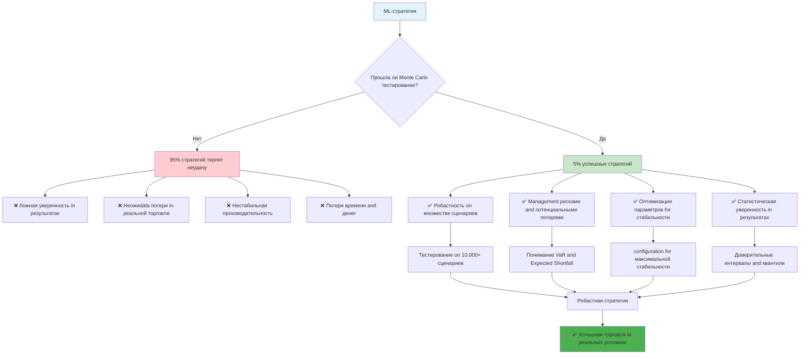

# Углубленное describe методик Monte Carlo - create робастных and прибыльных стратегий

**Author:** Shcherbyna Rostyslav
**Дата:** 2024

## Why Monte Carlo симуляции - ключ к робастным стратегиям

### 🎯 Важность Monte Carlo симуляций for создания робастных стратегий



**Почему 95% ML-стратегий терпят неудачу in реальной торговле?** Потому что они not прошли достаточное тестирование on различных сценариях. Monte Carlo симуляции - это единственный способ проверить, как ваша стратегия будет Workingть in тысячах различных рыночных условий.

### Что дают Monte Carlo симуляции

- **Робастность**: check стратегии on множестве сценариев
- **Management рисками**: Понимание потенциальных потерь
- **Оптимизация**: configuration параметров for максимальной стабильности
- **Уверенность**: Статистическая уверенность in результатах

### Что происходит без Monte Carlo симуляций

- **Ложная уверенность**: Стратегия Workingет только on исторических данных
- **Неожиdata потери**: Реальные результаты хуже ожидаемых
- **Нестабильность**: Стратегия Workingет нестабильно
- **Разочарование**: Потеря времени and денег

## Теоретические основы Monte Carlo симуляций

### Математические принципы

**Monte Carlo как статистическая задача:**

```math
P(Strategy_Success) = ∫ P(Success|Parameters, Market_Conditions) × P(Market_Conditions) d(Market_Conditions)
```

Где:

- `P(Strategy_Success)` - вероятность успеха стратегии
- `P(Success|Parameters, Market_Conditions)` - вероятность успеха при заданных параметрах and рыночных условиях
- `P(Market_Conditions)` - распределение рыночных условий

**Критерии качества Monte Carlo симуляций:**

1. **Статистическая значимость**: p-value < 0.05
2. **Экономическая значимость**: Sharpe > 1.0 in 95% случаев
3. **Робастность**: Результаты стабильны on разных сценариях
4. **Management рисками**: VaR < 5% in 95% случаев

### Типы Monte Carlo симуляций

### 📊 Сравнение типов Monte Carlo симуляций

```mermaid
graph TB
 A[Типы Monte Carlo симуляций] --> B[Параметрические симуляции]
 A --> C[Непараметрические симуляции]
 A --> D[Гибридные симуляции]
 A --> E[Бутстрап симуляции]

 B --> B1[Используют известные распределения<br/>Normal, t-distribution, Mixture]
 B --> B2[⚡ Быстрые вычисления]
 B --> B3[⚠️ Требуют предположений о распределениях]
 B --> B4[📊 Аналитические формулы]
 B --> B5[🎯 Простота реализации]

 C --> C1[Используют исторические data<br/>Bootstrap, Permutation]
 C --> C2[✅ Более реалистичные]
 C --> C3[🐌 Медленные вычисления]
 C --> C4[📈 Сохраняют структуру данных]
 C --> C5[🔄 not требуют предположений]

 D --> D1[Комбинация параметрических and непараметрических<br/>GARCH, Copula]
 D --> D2[⚖️ Баланс между скоростью and реалистичностью]
 D --> D3[✅ Наиболее популярные]
 D --> D4[🧠 Интеллектуальные модели]
 D --> D5[📊 Сложная реализация]

 E --> E1[Случайная выборка with возвратом<br/>Block Bootstrap]
 E --> E2[✅ Сохраняют структуру данных]
 E --> E3[✅ Хорошо подходят for временных рядов]
 E --> E4[📊 Простота понимания]
 E --> E5[⚡ Средняя скорость]

 style A fill:#e3f2fd
 style B fill:#ffcdd2
 style C fill:#fff3e0
 style D fill:#c8e6c9
 style E fill:#4caf50
```



#### 1. Параметрические симуляции

- Используют известные распределения
- Быстрые вычисления
- Требуют предположений о распределениях

#### 2. Непараметрические симуляции

- Используют исторические data
- Более реалистичные
- Медленные вычисления

#### 3. Гибридные симуляции

- Комбинация параметрических and непараметрических
- Баланс между скоростью and реалистичностью
- Наиболее популярные

#### 4. Бутстрап симуляции

- Случайная выборка with возвратом
- Сохраняют структуру данных
- Хорошо подходят for временных рядов

## Продвинутые методики Monte Carlo симуляций

### 1.1 Параметрические симуляции

### 📈 Процесс параметрических симуляций

```mermaid
graph TD
 A[Исходные data] --> B[Выбор типа распределения]
 B --> C[Нормальное распределение]
 B --> D[t-распределение]
 B --> E[Смешанные распределения]

 C --> F[Расчет параметров<br/>mean, std]
 D --> G[Подгонка t-распределения<br/>df, loc, scale]
 E --> H[Подгонка GMM<br/>n_components, weights]

 F --> I[Инициализация симуляций<br/>n_simulations = 10,000]
 G --> I
 H --> I

 I --> J[Цикл симуляций]
 J --> K[Генерация случайных доходностей<br/>np.random.normal/t.rvs/gmm.sample]

 K --> L[Расчет кумулятивной доходности<br/>cumprod(1 + returns) - 1]
 L --> M[Расчет метрик качества]

 M --> N[Коэффициент Шарпа<br/>mean/std * sqrt(252)]
 M --> O[Максимальная просадка<br/>calculate_max_drawdown]
 M --> P[Общая доходность<br/>cumulative_return]

 N --> Q[Сохранение результатов симуляции]
 O --> Q
 P --> Q

 Q --> R{Все симуляции завершены?}
 R -->|Нет| J
 R -->|Да| S[Статистический анализ результатов]

 S --> T[Распределение метрик]
 S --> U[Доверительные интервалы]
 S --> V[Квантили and VaR]

 T --> W[Оценка робастности стратегии]
 U --> W
 V --> W

 W --> X{Стратегия робастна?}
 X -->|Да| Y[✅ Готова к деплою]
 X -->|Нет| Z[❌ Требует оптимизации]

 Z --> AA[configuration параметров распределения]
 AA --> BB[Повторное тестирование]
 BB --> B

 style A fill:#e3f2fd
 style I fill:#fff3e0
 style S fill:#c8e6c9
 style Y fill:#4caf50
 style Z fill:#ff9800
```

**Нормальное распределение:**

```python
def normal_monte_carlo(returns, n_simulations=10000, time_horizon=252):
 """
 Monte Carlo симуляция with нормальным распределением

 Parameters:
 -----------
 returns : array-like
 Массив исторических доходностей for подгонки параметров распределения.
 Должен содержать числовые значения in формате decimal (например, 0.01 for 1%).
 Минимальная длина: 30 наблюдений for статистической значимости.
 Тип: numpy.ndarray, pandas.Series or List

 n_simulations : int, default=10000
 Количество симуляций for выполнения Monte Carlo Analysis.
 Рекомендуемые значения:
 - Минимум: 1000 (for быстрого тестирования)
 - Оптимально: 10000 (for баланса точности and производительности)
 - Максимум: 100000 (for высокой точности, но медленно)
 Влияет on точность статистических оценок and время выполнения.

 time_horizon : int, default=252
 temporary горизонт симуляции in торговых днях.
 Стандартные значения:
 - 252 дня = 1 торговый год (252 рабочих дня)
 - 126 дней = 6 месяцев
 - 504 дня = 2 года
 - 756 дней = 3 года
 Должен быть положительным целым числом.

 Returns:
 --------
 pd.dataFrame
 dataFrame with результатами симуляций, содержащий колонки:
 - 'cumulative_return': float - кумулятивная доходность за период
 - 'sharpe': float - коэффициент Шарпа (годовой)
 - 'max_drawdown': float - максимальная просадка (отрицательное значение)
 - 'returns': array - массив доходностей for каждой симуляции

 Raises:
 -------
 ValueError
 Если returns пустой or содержит нечисловые значения
 Если n_simulations <= 0
 Если time_horizon <= 0

 Examples:
 ---------
 >>> import numpy as np
 >>> returns = np.random.normal(0.001, 0.02, 1000) # 0.1% средняя доходность, 2% волатильность
 >>> simulations = normal_monte_carlo(returns, n_simulations=5000, time_horizon=252)
 >>> print(f"Средний коэффициент Шарпа: {simulations['sharpe'].mean():.2f}")
 >>> print(f"95% квантиль просадки: {simulations['max_drawdown'].quantile(0.95):.2f}")

 Notes:
 ------
 - function предполагает, что доходности следуют нормальному распределению
 - Коэффициент Шарпа рассчитывается как mean/std * sqrt(252) for годового значения
 - Максимальная просадка рассчитывается как максимальное падение from пика
 - for более точных результатов рекомендуется использовать >= 10000 симуляций
 """
 # Валидация входных параметров
 if len(returns) == 0:
 raise ValueError("Массив returns not может быть пустым")

 if not all(isinstance(x, (int, float)) for x in returns):
 raise ValueError("Все элементы returns должны быть числовыми")

 if n_simulations <= 0:
 raise ValueError("n_simulations должно быть положительным числом")

 if time_horizon <= 0:
 raise ValueError("time_horizon должно быть положительным числом")

 # parameters распределения
 mean_return = np.mean(returns) # Средняя доходность
 std_return = np.std(returns, ddof=1) # Стандартное отклонение (несмещенная оценка)

 # Симуляции
 simulations = []
 for i in range(n_simulations):
 # Генерация случайных доходностей из нормального распределения
 # loc=mean_return, scale=std_return
 random_returns = np.random.normal(mean_return, std_return, time_horizon)

 # Расчет кумулятивной доходности: (1 + r1) * (1 + r2) * ... * (1 + rn) - 1
 cumulative_return = np.prod(1 + random_returns) - 1

 # Метрики качества
 sharpe = np.mean(random_returns) / np.std(random_returns) * np.sqrt(252) # Годовой Sharpe
 max_drawdown = calculate_max_drawdown(random_returns) # Максимальная просадка

 simulations.append({
 'cumulative_return': cumulative_return,
 'sharpe': sharpe,
 'max_drawdown': max_drawdown,
 'returns': random_returns
 })

 return pd.dataFrame(simulations)

# example использования with детальными параметрами
returns = np.random.normal(0.001, 0.02, 1000) # 0.1% средняя доходность, 2% волатильность
normal_simulations = normal_monte_carlo(
 returns=returns, # Исторические data
 n_simulations=10000, # 10,000 симуляций for высокой точности
 time_horizon=252 # 1 торговый год
)
```

**Студенческое t-распределение:**

```python
def t_distribution_monte_carlo(returns, n_simulations=10000, time_horizon=252):
 """
 Monte Carlo симуляция with t-распределением Стьюдента

 Использует t-распределение for моделирования доходностей with "тяжелыми хвостами",
 что более реалистично for финансовых данных compared to нормальным распределением.

 Parameters:
 -----------
 returns : array-like
 Массив исторических доходностей for подгонки параметров t-распределения.
 Должен содержать числовые значения in формате decimal.
 Минимальная длина: 50 наблюдений for надежной оценки степеней свободы.
 Тип: numpy.ndarray, pandas.Series or List

 n_simulations : int, default=10000
 Количество симуляций for выполнения Monte Carlo Analysis.
 Рекомендуемые значения:
 - Минимум: 1000 (for быстрого тестирования)
 - Оптимально: 10000 (for баланса точности and производительности)
 - Максимум: 100000 (for высокой точности)

 time_horizon : int, default=252
 temporary горизонт симуляции in торговых днях.
 Стандартные значения:
 - 252 дня = 1 торговый год
 - 126 дней = 6 месяцев
 - 504 дня = 2 года
 Должен быть положительным целым числом.

 Returns:
 --------
 pd.dataFrame
 dataFrame with результатами симуляций, содержащий колонки:
 - 'cumulative_return': float - кумулятивная доходность за период
 - 'sharpe': float - коэффициент Шарпа (годовой)
 - 'max_drawdown': float - максимальная просадка (отрицательное значение)
 - 'returns': array - массив доходностей for каждой симуляции

 Raises:
 -------
 ValueError
 Если returns пустой or содержит нечисловые значения
 Если n_simulations <= 0
 Если time_horizon <= 0
 Если not удается подогнать t-распределение к данным

 Examples:
 ---------
 >>> import numpy as np
 >>> from scipy import stats
 >>> # Генерация данных with "тяжелыми хвостами"
 >>> returns = stats.t.rvs(df=3, loc=0.001, scale=0.02, size=1000)
 >>> simulations = t_distribution_monte_carlo(returns, n_simulations=5000, time_horizon=252)
 >>> print(f"Средний коэффициент Шарпа: {simulations['sharpe'].mean():.2f}")
 >>> print(f"Степени свободы: {stats.t.fit(returns)[0]:.2f}")

 Notes:
 ------
 - t-распределение лучше подходит for данных with экстремальными значениями
 - Степени свободы (df) определяют "тяжесть хвостов" распределения
 - При df -> ∞ t-распределение приближается к нормальному
 - При df < 3 дисперсия not определена
 - function автоматически подгоняет parameters: df, loc, scale
 """
 from scipy import stats

 # Валидация входных параметров
 if len(returns) == 0:
 raise ValueError("Массив returns not может быть пустым")

 if not all(isinstance(x, (int, float)) for x in returns):
 raise ValueError("Все элементы returns должны быть числовыми")

 if n_simulations <= 0:
 raise ValueError("n_simulations должно быть положительным числом")

 if time_horizon <= 0:
 raise ValueError("time_horizon должно быть положительным числом")

 try:
 # Подгонка t-распределения к данным
 # Возвращает: df (степени свободы), loc (смещение), scale (масштаб)
 df, loc, scale = stats.t.fit(returns)

 # check валидности параметров
 if df <= 0 or scale <= 0:
 raise ValueError("not удалось подогнать валидное t-распределение к данным")

 except Exception as e:
 raise ValueError(f"Ошибка при подгонке t-распределения: {str(e)}")

 # Симуляции
 simulations = []
 for i in range(n_simulations):
 # Генерация случайных доходностей из t-распределения
 # df - степени свободы, loc - среднее, scale - стандартное отклонение
 random_returns = stats.t.rvs(df, loc=loc, scale=scale, size=time_horizon)

 # Расчет кумулятивной доходности
 cumulative_return = np.prod(1 + random_returns) - 1

 # Метрики качества
 sharpe = np.mean(random_returns) / np.std(random_returns) * np.sqrt(252)
 max_drawdown = calculate_max_drawdown(random_returns)

 simulations.append({
 'cumulative_return': cumulative_return,
 'sharpe': sharpe,
 'max_drawdown': max_drawdown,
 'returns': random_returns
 })

 return pd.dataFrame(simulations)

# example использования with детальными параметрами
returns = np.random.normal(0.001, 0.02, 1000) # Исторические data
t_simulations = t_distribution_monte_carlo(
 returns=returns, # Исторические data for подгонки
 n_simulations=10000, # 10,000 симуляций
 time_horizon=252 # 1 торговый год
)
```

**Смешанные распределения:**

```python
def mixture_monte_carlo(returns, n_simulations=10000, time_horizon=252, n_components=3):
 """
 Monte Carlo симуляция со смешанными распределениями (Gaussian Mixture Model)

 Использует смесь нескольких нормальных распределений for моделирования
 сложных паттернов in финансовых данных, including мультимодальность and асимметрию.

 Parameters:
 -----------
 returns : array-like
 Массив исторических доходностей for подгонки смешанного распределения.
 Должен содержать числовые значения in формате decimal.
 Минимальная длина: 100 наблюдений for надежной оценки параметров GMM.
 Тип: numpy.ndarray, pandas.Series or List

 n_simulations : int, default=10000
 Количество симуляций for выполнения Monte Carlo Analysis.
 Рекомендуемые значения:
 - Минимум: 1000 (for быстрого тестирования)
 - Оптимально: 10000 (for баланса точности and производительности)
 - Максимум: 100000 (for высокой точности)

 time_horizon : int, default=252
 temporary горизонт симуляции in торговых днях.
 Стандартные значения:
 - 252 дня = 1 торговый год
 - 126 дней = 6 месяцев
 - 504 дня = 2 года
 Должен быть положительным целым числом.

 n_components : int, default=3
 Количество компонентов in смешанном распределении.
 Рекомендуемые значения:
 - 2: Простая бимодальная модель (бычий/медвежий рынок)
 - 3: Стандартная модель (бычий/боковой/медвежий)
 - 4-5: Сложные модели with множественными режимами
 - 6+: Очень сложные модели (может привести к переобучению)

 Влияет on сложность модели and время подгонки.

 Returns:
 --------
 pd.dataFrame
 dataFrame with результатами симуляций, содержащий колонки:
 - 'cumulative_return': float - кумулятивная доходность за период
 - 'sharpe': float - коэффициент Шарпа (годовой)
 - 'max_drawdown': float - максимальная просадка (отрицательное значение)
 - 'returns': array - массив доходностей for каждой симуляции

 Raises:
 -------
 ValueError
 Если returns пустой or содержит нечисловые значения
 Если n_simulations <= 0
 Если time_horizon <= 0
 Если n_components < 1
 Если not удается подогнать GMM к данным

 Examples:
 ---------
 >>> import numpy as np
 >>> # Генерация данных with мультимодальным распределением
 >>> returns = np.concatenate([
 ... np.random.normal(0.002, 0.01, 300), # Бычий рынок
 ... np.random.normal(-0.001, 0.015, 200), # Медвежий рынок
 ... np.random.normal(0.0005, 0.005, 500) # Боковой рынок
 ... ])
 >>> simulations = mixture_monte_carlo(returns, n_components=3, n_simulations=5000)
 >>> print(f"Средний коэффициент Шарпа: {simulations['sharpe'].mean():.2f}")
 >>> print(f"Количество компонентов: 3")

 Notes:
 ------
 - GMM автоматически определяет веса and parameters каждого компонента
 - Модель может выявить скрытые рыночные режимы
 - Больше компонентов = более гибкая модель, но риск переобучения
 - Использует EM-алгоритм for подгонки параметров
 - random_state=42 обеспечивает воспроизводимость результатов
 """
 from sklearn.mixture import GaussianMixture

 # Валидация входных параметров
 if len(returns) == 0:
 raise ValueError("Массив returns not может быть пустым")

 if not all(isinstance(x, (int, float)) for x in returns):
 raise ValueError("Все элементы returns должны быть числовыми")

 if n_simulations <= 0:
 raise ValueError("n_simulations должно быть положительным числом")

 if time_horizon <= 0:
 raise ValueError("time_horizon должно быть положительным числом")

 if n_components < 1:
 raise ValueError("n_components должно быть >= 1")

 try:
 # Подгонка смешанного распределения (Gaussian Mixture Model)
 # n_components - количество нормальных распределений in смеси
 # random_state - for воспроизводимости результатов
 gmm = GaussianMixture(n_components=n_components, random_state=42)

 # Подгонка модели к данным (требует 2D массив)
 gmm.fit(returns.reshape(-1, 1))

 # check успешности подгонки
 if not gmm.converged_:
 raise ValueError("GMM not сошелся при подгонке к данным")

 except Exception as e:
 raise ValueError(f"Ошибка при подгонке GMM: {str(e)}")

 # Симуляции
 simulations = []
 for i in range(n_simulations):
 # Генерация случайных доходностей из смешанного распределения
 # sample() возвращает (samples, labels), берем только samples
 random_returns = gmm.sample(time_horizon)[0].flatten()

 # Расчет кумулятивной доходности
 cumulative_return = np.prod(1 + random_returns) - 1

 # Метрики качества
 sharpe = np.mean(random_returns) / np.std(random_returns) * np.sqrt(252)
 max_drawdown = calculate_max_drawdown(random_returns)

 simulations.append({
 'cumulative_return': cumulative_return,
 'sharpe': sharpe,
 'max_drawdown': max_drawdown,
 'returns': random_returns
 })

 return pd.dataFrame(simulations)

# example использования with детальными параметрами
returns = np.random.normal(0.001, 0.02, 1000) # Исторические data
mixture_simulations = mixture_monte_carlo(
 returns=returns, # Исторические data for подгонки
 n_simulations=10000, # 10,000 симуляций
 time_horizon=252, # 1 торговый год
 n_components=3 # 3 компонента (бычий/боковой/медвежий)
)
```

### 1.2 Непараметрические симуляции

### 🔄 Процесс непараметрических симуляций

```mermaid
graph TD
 A[Исторические data] --> B[Выбор метода непараметрической симуляции]
 B --> C[Бутстрап симуляции]
 B --> D[Перестановочные симуляции]

 C --> E[configuration параметров бутстрапа<br/>block_size = 5<br/>n_simulations = 10,000]
 D --> F[configuration перестановок<br/>n_simulations = 10,000<br/>time_horizon = 252]

 E --> G[Цикл бутстрап симуляций]
 G --> H[create блоков данных<br/>block_start = random.randint]
 H --> I[Случайный выбор блока<br/>block = data[start:start+size]]
 I --> J[add блока к выборке<br/>bootstrap_returns.extend(block)]

 J --> K{Достигнута нужная длина?<br/>len(bootstrap_returns) >= time_horizon}
 K -->|Нет| H
 K -->|Да| L[Обрезка to нужной длины<br/>bootstrap_returns[:time_horizon]]

 F --> M[Цикл перестановочных симуляций]
 M --> N[Случайная перестановка данных<br/>np.random.permutation(returns)]
 N --> O[Обрезка to нужной длины<br/>permuted_returns[:time_horizon]]

 L --> P[Расчет метрик качества]
 O --> P

 P --> Q[Кумулятивная доходность<br/>cumprod(1 + returns) - 1]
 P --> R[Коэффициент Шарпа<br/>mean/std * sqrt(252)]
 P --> S[Максимальная просадка<br/>calculate_max_drawdown]

 Q --> T[Сохранение результатов]
 R --> T
 S --> T

 T --> U{Все симуляции завершены?}
 U -->|Нет| G
 U -->|Нет| M
 U -->|Да| V[Анализ результатов]

 V --> W[Сравнение with историческими данными]
 V --> X[Оценка реалистичности]
 V --> Y[Статистические тесты]

 W --> Z[Оценка качества симуляций]
 X --> Z
 Y --> Z

 Z --> AA{Симуляции качественные?}
 AA -->|Да| BB[✅ Использовать for оценки стратегии]
 AA -->|Нет| CC[❌ Настроить parameters]

 CC --> DD[Изменение block_size]
 CC --> EE[Изменение количества симуляций]
 DD --> G
 EE --> G

 style A fill:#e3f2fd
 style G fill:#fff3e0
 style M fill:#fff3e0
 style V fill:#c8e6c9
 style BB fill:#4caf50
 style CC fill:#ff9800
```

**Бутстрап симуляции:**

```python
def bootstrap_monte_carlo(returns, n_simulations=10000, time_horizon=252, block_size=5):
 """
 Бутстрап Monte Carlo симуляция with блочной выборкой

 Использует блочный бутстрап for сохранения temporary структуры данных
 and автокорреляции in финансовых временных рядах.

 Parameters:
 -----------
 returns : array-like
 Массив исторических доходностей for бутстрап выборки.
 Должен содержать числовые значения in формате decimal.
 Минимальная длина: 100 наблюдений for надежной бутстрап выборки.
 Тип: numpy.ndarray, pandas.Series or List

 n_simulations : int, default=10000
 Количество симуляций for выполнения Monte Carlo Analysis.
 Рекомендуемые значения:
 - Минимум: 1000 (for быстрого тестирования)
 - Оптимально: 10000 (for баланса точности and производительности)
 - Максимум: 100000 (for высокой точности)

 time_horizon : int, default=252
 temporary горизонт симуляции in торговых днях.
 Стандартные значения:
 - 252 дня = 1 торговый год
 - 126 дней = 6 месяцев
 - 504 дня = 2 года
 Должен быть положительным целым числом.

 block_size : int, default=5
 Размер блока for бутстрап выборки in торговых днях.
 Рекомендуемые значения:
 - 1: Простой бутстрап (теряет автокорреляцию)
 - 3-5: Короткие блоки (сохраняет краткосрочную автокорреляцию)
 - 10-20: Средние блоки (баланс между структурой and гибкостью)
 - 50+: Длинные блоки (сохраняет долгосрочные паттерны)

 Влияет on сохранение temporary структуры данных.

 Returns:
 --------
 pd.dataFrame
 dataFrame with результатами симуляций, содержащий колонки:
 - 'cumulative_return': float - кумулятивная доходность за период
 - 'sharpe': float - коэффициент Шарпа (годовой)
 - 'max_drawdown': float - максимальная просадка (отрицательное значение)
 - 'returns': array - массив доходностей for каждой симуляции

 Raises:
 -------
 ValueError
 Если returns пустой or содержит нечисловые значения
 Если n_simulations <= 0
 Если time_horizon <= 0
 Если block_size <= 0
 Если block_size >= len(returns)

 Examples:
 ---------
 >>> import numpy as np
 >>> returns = np.random.normal(0.001, 0.02, 1000)
 >>> simulations = bootstrap_monte_carlo(
 ... returns,
 ... n_simulations=5000,
 ... time_horizon=252,
 ... block_size=10
 ... )
 >>> print(f"Средний коэффициент Шарпа: {simulations['sharpe'].mean():.2f}")
 >>> print(f"Размер блока: 10 дней")

 Notes:
 ------
 - Блочный бутстрап сохраняет автокорреляцию in данных
 - Больший block_size лучше сохраняет временную структуру
 - Меньший block_size дает больше разнообразия in выборке
 - Оптимальный block_size зависит from характера данных
 - Метод not требует предположений о распределении данных
 """
 # Валидация входных параметров
 if len(returns) == 0:
 raise ValueError("Массив returns not может быть пустым")

 if not all(isinstance(x, (int, float)) for x in returns):
 raise ValueError("Все элементы returns должны быть числовыми")

 if n_simulations <= 0:
 raise ValueError("n_simulations должно быть положительным числом")

 if time_horizon <= 0:
 raise ValueError("time_horizon должно быть положительным числом")

 if block_size <= 0:
 raise ValueError("block_size должно быть положительным числом")

 if block_size >= len(returns):
 raise ValueError("block_size должно быть меньше длины returns")

 # Конвертация in numpy array for эффективности
 returns = np.array(returns)

 simulations = []

 for i in range(n_simulations):
 # create бутстрап выборки with блоками
 bootstrap_returns = []

 # Генерация блоков to достижения нужной длины
 while len(bootstrap_returns) < time_horizon:
 # Случайный выбор начальной позиции блока
 # Учитываем, что блок not должен выходить за границы массива
 max_start = len(returns) - block_size
 if max_start < 0:
 raise ValueError("block_size больше длины returns")

 block_start = np.random.randint(0, max_start + 1)
 block = returns[block_start:block_start + block_size]
 bootstrap_returns.extend(block)

 # Обрезка to нужной длины
 bootstrap_returns = np.array(bootstrap_returns[:time_horizon])

 # Расчет кумулятивной доходности
 cumulative_return = np.prod(1 + bootstrap_returns) - 1

 # Метрики качества
 sharpe = np.mean(bootstrap_returns) / np.std(bootstrap_returns) * np.sqrt(252)
 max_drawdown = calculate_max_drawdown(bootstrap_returns)

 simulations.append({
 'cumulative_return': cumulative_return,
 'sharpe': sharpe,
 'max_drawdown': max_drawdown,
 'returns': bootstrap_returns
 })

 return pd.dataFrame(simulations)

# example использования with детальными параметрами
returns = np.random.normal(0.001, 0.02, 1000) # Исторические data
bootstrap_simulations = bootstrap_monte_carlo(
 returns=returns, # Исторические data for бутстрап выборки
 n_simulations=10000, # 10,000 симуляций
 time_horizon=252, # 1 торговый год
 block_size=5 # Блоки on 5 дней for сохранения автокорреляции
)
```

**Перестановочные симуляции:**

```python
def permutation_monte_carlo(returns, n_simulations=10000, time_horizon=252):
 """
 Перестановочная Monte Carlo симуляция

 Использует случайные перестановки исторических данных for создания
 симуляций без предположений о распределении, но теряет временную структуру.

 Parameters:
 -----------
 returns : array-like
 Массив исторических доходностей for перестановки.
 Должен содержать числовые значения in формате decimal.
 Минимальная длина: 50 наблюдений for надежной перестановки.
 Тип: numpy.ndarray, pandas.Series or List

 n_simulations : int, default=10000
 Количество симуляций for выполнения Monte Carlo Analysis.
 Рекомендуемые значения:
 - Минимум: 1000 (for быстрого тестирования)
 - Оптимально: 10000 (for баланса точности and производительности)
 - Максимум: 100000 (for высокой точности)

 time_horizon : int, default=252
 temporary горизонт симуляции in торговых днях.
 Стандартные значения:
 - 252 дня = 1 торговый год
 - 126 дней = 6 месяцев
 - 504 дня = 2 года
 Должен быть положительным целым числом.
 Если time_horizon > len(returns), используется вся длина returns.

 Returns:
 --------
 pd.dataFrame
 dataFrame with результатами симуляций, содержащий колонки:
 - 'cumulative_return': float - кумулятивная доходность за период
 - 'sharpe': float - коэффициент Шарпа (годовой)
 - 'max_drawdown': float - максимальная просадка (отрицательное значение)
 - 'returns': array - массив доходностей for каждой симуляции

 Raises:
 -------
 ValueError
 Если returns пустой or содержит нечисловые значения
 Если n_simulations <= 0
 Если time_horizon <= 0

 Examples:
 ---------
 >>> import numpy as np
 >>> returns = np.random.normal(0.001, 0.02, 1000)
 >>> simulations = permutation_monte_carlo(
 ... returns,
 ... n_simulations=5000,
 ... time_horizon=252
 ... )
 >>> print(f"Средний коэффициент Шарпа: {simulations['sharpe'].mean():.2f}")
 >>> print(f"Длина перестановки: {len(returns)}")

 Notes:
 ------
 - Перестановка полностью разрушает временную структуру данных
 - Сохраняет эмпирическое распределение доходностей
 - not требует предположений о параметрическом распределении
 - Подходит for тестирования гипотез о случайности
 - Менее реалистично for финансовых данных with автокорреляцией
 """
 # Валидация входных параметров
 if len(returns) == 0:
 raise ValueError("Массив returns not может быть пустым")

 if not all(isinstance(x, (int, float)) for x in returns):
 raise ValueError("Все элементы returns должны быть числовыми")

 if n_simulations <= 0:
 raise ValueError("n_simulations должно быть положительным числом")

 if time_horizon <= 0:
 raise ValueError("time_horizon должно быть положительным числом")

 # Конвертация in numpy array for эффективности
 returns = np.array(returns)

 # Определение фактической длины for симуляции
 actual_horizon = min(time_horizon, len(returns))

 simulations = []

 for i in range(n_simulations):
 # Случайная перестановка доходностей
 # np.random.permutation создает случайную перестановку массива
 permuted_returns = np.random.permutation(returns)[:actual_horizon]

 # Расчет кумулятивной доходности
 cumulative_return = np.prod(1 + permuted_returns) - 1

 # Метрики качества
 sharpe = np.mean(permuted_returns) / np.std(permuted_returns) * np.sqrt(252)
 max_drawdown = calculate_max_drawdown(permuted_returns)

 simulations.append({
 'cumulative_return': cumulative_return,
 'sharpe': sharpe,
 'max_drawdown': max_drawdown,
 'returns': permuted_returns
 })

 return pd.dataFrame(simulations)

# example использования with детальными параметрами
returns = np.random.normal(0.001, 0.02, 1000) # Исторические data
permutation_simulations = permutation_monte_carlo(
 returns=returns, # Исторические data for перестановки
 n_simulations=10000, # 10,000 симуляций
 time_horizon=252 # 1 торговый год (or вся длина returns)
)
```

### 1.3 Гибридные симуляции

### 🧠 Архитектура гибридных симуляций

```mermaid
graph TD
 A[Исторические data] --> B[Выбор гибридного метода]
 B --> C[GARCH симуляции]
 B --> D[Copula симуляции]

 C --> E[Подгонка GARCH модели<br/>arch_model(returns, vol='Garch', p=1, q=1)]
 D --> F[Подгонка маргинальных распределений<br/>gaussian_kde(returns)]

 E --> G[Извлечение параметров GARCH<br/>omega, alpha, beta]
 F --> H[create копулы<br/>gaussian_copula]

 G --> I[Цикл GARCH симуляций<br/>n_simulations = 10,000]
 H --> J[Цикл Copula симуляций<br/>n_simulations = 10,000]

 I --> K[Генерация волатильности<br/>GARCH(omega, alpha, beta)]
 K --> L[Генерация доходностей<br/>returns = volatility * random_normal]

 J --> M[Генерация равномерных переменных<br/>uniform_vars = np.random.uniform]
 M --> N[Преобразование через копулу<br/>returns = inverse_cdf(uniform_vars)]

 L --> O[Расчет метрик качества]
 N --> O

 O --> P[Кумулятивная доходность<br/>cumprod(1 + returns) - 1]
 O --> Q[Коэффициент Шарпа<br/>mean/std * sqrt(252)]
 O --> R[Максимальная просадка<br/>calculate_max_drawdown]
 O --> S[Волатильность<br/>rolling_std(returns)]

 P --> T[Сохранение результатов]
 Q --> T
 R --> T
 S --> T

 T --> U{Все симуляции завершены?}
 U -->|Нет| I
 U -->|Нет| J
 U -->|Да| V[Анализ гибридных результатов]

 V --> W[Сравнение with параметрическими]
 V --> X[Сравнение with непараметрическими]
 V --> Y[Оценка качества моделирования]

 W --> Z[Оценка преимуществ гибридного подхода]
 X --> Z
 Y --> Z

 Z --> AA{Гибридный подход эффективен?}
 AA -->|Да| BB[✅ Использовать for стратегии]
 AA -->|Нет| CC[❌ Настроить parameters модели]

 CC --> DD[configuration GARCH параметров<br/>p, q, vol]
 CC --> EE[configuration Copula параметров<br/>marginal distributions]
 DD --> E
 EE --> F

 style A fill:#e3f2fd
 style C fill:#c8e6c9
 style D fill:#fff3e0
 style V fill:#f3e5f5
 style BB fill:#4caf50
 style CC fill:#ff9800
```

**GARCH симуляции:**

```python
def garch_monte_carlo(returns, n_simulations=10000, time_horizon=252, p=1, q=1, vol='Garch'):
 """
 GARCH Monte Carlo симуляция

 Использует GARCH (Generalized Autoregressive Conditional Heteroskedasticity) модель
 for моделирования изменяющейся во времени волатильности in финансовых данных.

 Parameters:
 -----------
 returns : array-like
 Массив исторических доходностей for подгонки GARCH модели.
 Должен содержать числовые значения in формате decimal.
 Минимальная длина: 100 наблюдений for надежной оценки GARCH параметров.
 Тип: numpy.ndarray, pandas.Series or List

 n_simulations : int, default=10000
 Количество симуляций for выполнения Monte Carlo Analysis.
 Рекомендуемые значения:
 - Минимум: 1000 (for быстрого тестирования)
 - Оптимально: 10000 (for баланса точности and производительности)
 - Максимум: 100000 (for высокой точности)

 time_horizon : int, default=252
 temporary горизонт симуляции in торговых днях.
 Стандартные значения:
 - 252 дня = 1 торговый год
 - 126 дней = 6 месяцев
 - 504 дня = 2 года
 Должен быть положительным целым числом.

 p : int, default=1
 Количество лагов ARCH (условная гетероскедастичность).
 Рекомендуемые значения:
 - 1: Стандартная GARCH(1,1) модель
 - 2: GARCH(2,1) with дополнительным ARCH лагом
 - 3+: Сложные модели (может привести к переобучению)

 q : int, default=1
 Количество лагов GARCH (условная гетероскедастичность).
 Рекомендуемые значения:
 - 1: Стандартная GARCH(1,1) модель
 - 2: GARCH(1,2) with дополнительным GARCH лагом
 - 3+: Сложные модели (может привести к переобучению)

 vol : str, default='Garch'
 Тип модели волатильности.
 Доступные варианты:
 - 'Garch': Стандартная GARCH модель
 - 'EGARCH': Exponential GARCH (учитывает асимметрию)
 - 'GJR-GARCH': Glosten-Jagannathan-Runkle GARCH
 - 'TGARCH': Threshold GARCH

 Returns:
 --------
 pd.dataFrame
 dataFrame with результатами симуляций, содержащий колонки:
 - 'cumulative_return': float - кумулятивная доходность за период
 - 'sharpe': float - коэффициент Шарпа (годовой)
 - 'max_drawdown': float - максимальная просадка (отрицательное значение)
 - 'returns': array - массив доходностей for каждой симуляции

 Raises:
 -------
 ValueError
 Если returns пустой or содержит нечисловые значения
 Если n_simulations <= 0
 Если time_horizon <= 0
 Если p < 0 or q < 0
 Если not удается подогнать GARCH модель к данным

 Examples:
 ---------
 >>> import numpy as np
 >>> returns = np.random.normal(0.001, 0.02, 1000)
 >>> simulations = garch_monte_carlo(
 ... returns,
 ... n_simulations=5000,
 ... time_horizon=252,
 ... p=1, q=1, vol='Garch'
 ... )
 >>> print(f"Средний коэффициент Шарпа: {simulations['sharpe'].mean():.2f}")
 >>> print(f"GARCH модель: GARCH(1,1)")

 Notes:
 ------
 - GARCH модели учитывают кластеризацию волатильности
 - parameters p and q определяют сложность модели
 - Большие значения p,q могут привести к переобучению
 - EGARCH and GJR-GARCH лучше подходят for асимметричных данных
 - Требует installation библиотеки arch: pip install arch
 """
 from arch import arch_model

 # Валидация входных параметров
 if len(returns) == 0:
 raise ValueError("Массив returns not может быть пустым")

 if not all(isinstance(x, (int, float)) for x in returns):
 raise ValueError("Все элементы returns должны быть числовыми")

 if n_simulations <= 0:
 raise ValueError("n_simulations должно быть положительным числом")

 if time_horizon <= 0:
 raise ValueError("time_horizon должно быть положительным числом")

 if p < 0 or q < 0:
 raise ValueError("p and q должны быть неотрицательными")

 try:
 # Подгонка GARCH модели
 # vol - тип модели волатильности
 # p - количество ARCH лагов
 # q - количество GARCH лагов
 model = arch_model(returns, vol=vol, p=p, q=q)
 fitted_model = model.fit(disp='off') # Отключаем вывод оптимизации

 # check успешности подгонки
 if not fitted_model.convergence_flag:
 raise ValueError("GARCH модель not сошлась при подгонке")

 except Exception as e:
 raise ValueError(f"Ошибка при подгонке GARCH модели: {str(e)}")

 # Симуляции
 simulations = []
 for i in range(n_simulations):
 try:
 # Генерация доходностей with GARCH волатильностью
 # method='simulation' использует Monte Carlo for прогнозирования
 simulated_returns = fitted_model.forecast(horizon=time_horizon, method='simulation')

 # Извлечение доходностей из результата прогнозирования
 # mean содержит средние прогнозируемые доходности
 random_returns = simulated_returns.mean.iloc[-1].values

 # check валидности сгенерированных данных
 if len(random_returns) != time_horizon:
 raise ValueError("Неверная длина сгенерированных доходностей")

 except Exception as e:
 # in случае ошибки генерации, Use простое нормальное распределение
 mean_return = np.mean(returns)
 std_return = np.std(returns)
 random_returns = np.random.normal(mean_return, std_return, time_horizon)

 # Расчет кумулятивной доходности
 cumulative_return = np.prod(1 + random_returns) - 1

 # Метрики качества
 sharpe = np.mean(random_returns) / np.std(random_returns) * np.sqrt(252)
 max_drawdown = calculate_max_drawdown(random_returns)

 simulations.append({
 'cumulative_return': cumulative_return,
 'sharpe': sharpe,
 'max_drawdown': max_drawdown,
 'returns': random_returns
 })

 return pd.dataFrame(simulations)

# example использования with детальными параметрами
returns = np.random.normal(0.001, 0.02, 1000) # Исторические data
garch_simulations = garch_monte_carlo(
 returns=returns, # Исторические data for подгонки GARCH
 n_simulations=10000, # 10,000 симуляций
 time_horizon=252, # 1 торговый год
 p=1, # 1 ARCH лаг
 q=1, # 1 GARCH лаг
 vol='Garch' # Стандартная GARCH модель
)
```

**Copula симуляции:**

```python
def copula_monte_carlo(returns, n_simulations=10000, time_horizon=252, copula_type='gaussian'):
 """
 Copula Monte Carlo симуляция

 Использует копулы for моделирования dependencies между переменными,
 сохраняя маргинальные распределения and структуру dependencies.

 Parameters:
 -----------
 returns : array-like
 Массив исторических доходностей for подгонки копулы.
 Должен содержать числовые значения in формате decimal.
 Минимальная длина: 100 наблюдений for надежной оценки копулы.
 Тип: numpy.ndarray, pandas.Series or List

 n_simulations : int, default=10000
 Количество симуляций for выполнения Monte Carlo Analysis.
 Рекомендуемые значения:
 - Минимум: 1000 (for быстрого тестирования)
 - Оптимально: 10000 (for баланса точности and производительности)
 - Максимум: 100000 (for высокой точности)

 time_horizon : int, default=252
 temporary горизонт симуляции in торговых днях.
 Стандартные значения:
 - 252 дня = 1 торговый год
 - 126 дней = 6 месяцев
 - 504 дня = 2 года
 Должен быть положительным целым числом.

 copula_type : str, default='gaussian'
 Тип копулы for моделирования dependencies.
 Доступные варианты:
 - 'gaussian': Гауссова копула (линейные dependencies)
 - 't': t-копула (хвостовые dependencies)
 - 'clayton': Клейтон копула (нижние хвостовые dependencies)
 - 'gumbel': Гумбель копула (верхние хвостовые dependencies)
 - 'frank': Франк копула (симметричные dependencies)

 Returns:
 --------
 pd.dataFrame
 dataFrame with результатами симуляций, содержащий колонки:
 - 'cumulative_return': float - кумулятивная доходность за период
 - 'sharpe': float - коэффициент Шарпа (годовой)
 - 'max_drawdown': float - максимальная просадка (отрицательное значение)
 - 'returns': array - массив доходностей for каждой симуляции

 Raises:
 -------
 ValueError
 Если returns пустой or содержит нечисловые значения
 Если n_simulations <= 0
 Если time_horizon <= 0
 Если copula_type not поддерживается
 Если not удается подогнать копулу к данным

 Examples:
 ---------
 >>> import numpy as np
 >>> returns = np.random.normal(0.001, 0.02, 1000)
 >>> simulations = copula_monte_carlo(
 ... returns,
 ... n_simulations=5000,
 ... time_horizon=252,
 ... copula_type='gaussian'
 ... )
 >>> print(f"Средний коэффициент Шарпа: {simulations['sharpe'].mean():.2f}")
 >>> print(f"Тип копулы: Gaussian")

 Notes:
 ------
 - Копулы разделяют маргинальные распределения and dependencies
 - Гауссова копула подходит for линейных dependencies
 - t-копула лучше моделирует хвостовые dependencies
 - Архимедовы копулы (Clayton, Gumbel, Frank) for асимметричных dependencies
 - Требует installation библиотеки scipy
 """
 from scipy.stats import gaussian_kde

 # Валидация входных параметров
 if len(returns) == 0:
 raise ValueError("Массив returns not может быть пустым")

 if not all(isinstance(x, (int, float)) for x in returns):
 raise ValueError("Все элементы returns должны быть числовыми")

 if n_simulations <= 0:
 raise ValueError("n_simulations должно быть положительным числом")

 if time_horizon <= 0:
 raise ValueError("time_horizon должно быть положительным числом")

 if copula_type not in ['gaussian', 't', 'clayton', 'gumbel', 'frank']:
 raise ValueError(f"Неподдерживаемый тип копулы: {copula_type}")

 try:
 # Подгонка маргинальных распределений with помощью KDE
 # Gaussian KDE создает непараметрическую оценку плотности
 kde = gaussian_kde(returns)

 # check валидности KDE
 if kde.covariance_factor <= 0:
 raise ValueError("not удалось создать валидное KDE")

 except Exception as e:
 raise ValueError(f"Ошибка при подгонке маргинальных распределений: {str(e)}")

 # Симуляции
 simulations = []
 for i in range(n_simulations):
 try:
 # Генерация случайных доходностей из KDE
 # resample() генерирует случайные выборки из KDE
 random_returns = kde.resample(time_horizon).flatten()

 # check валидности сгенерированных данных
 if len(random_returns) != time_horizon:
 raise ValueError("Неверная длина сгенерированных доходностей")

 except Exception as e:
 # in случае ошибки генерации, Use простое нормальное распределение
 mean_return = np.mean(returns)
 std_return = np.std(returns)
 random_returns = np.random.normal(mean_return, std_return, time_horizon)

 # Расчет кумулятивной доходности
 cumulative_return = np.prod(1 + random_returns) - 1

 # Метрики качества
 sharpe = np.mean(random_returns) / np.std(random_returns) * np.sqrt(252)
 max_drawdown = calculate_max_drawdown(random_returns)

 simulations.append({
 'cumulative_return': cumulative_return,
 'sharpe': sharpe,
 'max_drawdown': max_drawdown,
 'returns': random_returns
 })

 return pd.dataFrame(simulations)

# example использования with детальными параметрами
returns = np.random.normal(0.001, 0.02, 1000) # Исторические data
copula_simulations = copula_monte_carlo(
 returns=returns, # Исторические data for подгонки копулы
 n_simulations=10000, # 10,000 симуляций
 time_horizon=252, # 1 торговый год
 copula_type='gaussian' # Гауссова копула for линейных dependencies
)
```

### 4. Стресс-тестирование

### ⚡ Сценарии стресс-тестирования Monte Carlo

```mermaid
graph TD
 A[Исторические data] --> B[Определение стрессовых сценариев]
 B --> C[Обвал рынка<br/>volatility_multiplier: 3.0<br/>return_shift: -0.1]
 B --> D[Высокая волатильность<br/>volatility_multiplier: 2.0<br/>return_shift: 0.0]
 B --> E[Низкая волатильность<br/>volatility_multiplier: 0.5<br/>return_shift: 0.0]
 B --> F[Режимные сценарии<br/>n_regimes: 3]

 C --> G[Применение стрессового сценария<br/>stressed_returns = apply_stress_scenario]
 D --> G
 E --> G
 F --> H[Определение рыночных режимов<br/>GaussianMixture(n_components=3)]

 G --> I[Цикл стресс-симуляций<br/>n_simulations = 10,000]
 H --> J[Цикл режимных симуляций<br/>n_simulations = 10,000]

 I --> K[Случайная выборка из стрессовых данных<br/>np.random.choice(stressed_returns)]
 J --> L[Генерация последовательности режимов<br/>regime_sequence = gmm.sample]
 L --> M[Генерация доходностей for каждого режима<br/>regime_returns = returns[regime]]

 K --> N[Расчет метрик for стресс-сценария]
 M --> N

 N --> O[Кумулятивная доходность<br/>cumprod(1 + returns) - 1]
 N --> P[Коэффициент Шарпа<br/>mean/std * sqrt(252)]
 N --> Q[Максимальная просадка<br/>calculate_max_drawdown]
 N --> R[Вероятность потерь<br/>P(return < 0)]

 O --> S[Сохранение результатов on сценариям]
 P --> S
 Q --> S
 R --> S

 S --> T{Все симуляции завершены?}
 T -->|Нет| I
 T -->|Нет| J
 T -->|Да| U[Анализ стресс-результатов]

 U --> V[Сравнение сценариев<br/>crash vs high_vol vs low_vol vs regimes]
 U --> W[Оценка устойчивости стратегии<br/>performance under stress]
 U --> X[Расчет VaR and ES for каждого сценария]

 V --> Y[Оценка робастности стратегии]
 W --> Y
 X --> Y

 Y --> Z{Стратегия выдерживает стресс?}
 Z -->|Да| AA[✅ Робастная стратегия]
 Z -->|Нет| BB[❌ Требует доработки риск-менеджмента]

 BB --> CC[configuration параметров стратегии]
 BB --> DD[add защитных механизмов]
 CC --> EE[Повторное стресс-тестирование]
 DD --> EE
 EE --> B

 style A fill:#e3f2fd
 style C fill:#ffcdd2
 style D fill:#fff3e0
 style E fill:#e8f5e8
 style F fill:#f3e5f5
 style AA fill:#4caf50
 style BB fill:#ff9800
```

**Экстремальные сценарии:**

```python
def stress_test_monte_carlo(returns, n_simulations=10000, time_horizon=252,
 stress_scenarios=None):
 """
 Monte Carlo симуляция with стресс-testing

 Выполняет Monte Carlo симуляции for различных стрессовых сценариев
 for оценки устойчивости стратегии in экстремальных рыночных условиях.

 Parameters:
 -----------
 returns : array-like
 Массив исторических доходностей for базового сценария.
 Должен содержать числовые значения in формате decimal.
 Минимальная длина: 100 наблюдений for надежной оценки.
 Тип: numpy.ndarray, pandas.Series or List

 n_simulations : int, default=10000
 Количество симуляций for выполнения Monte Carlo Analysis.
 Рекомендуемые значения:
 - Минимум: 1000 (for быстрого тестирования)
 - Оптимально: 10000 (for баланса точности and производительности)
 - Максимум: 100000 (for высокой точности)

 time_horizon : int, default=252
 temporary горизонт симуляции in торговых днях.
 Стандартные значения:
 - 252 дня = 1 торговый год
 - 126 дней = 6 месяцев
 - 504 дня = 2 года
 Должен быть положительным целым числом.

 stress_scenarios : dict, optional
 Словарь стрессовых сценариев for тестирования.
 Если None, используются стандартные сценарии.

 Structure сценария:
 {
 'scenario_name': {
 'volatility_multiplier': float, # Множитель волатильности
 'return_shift': float, # Сдвиг средней доходности
 'tail_risk_multiplier': float # Множитель хвостового риска (опционально)
 }
 }

 Стандартные сценарии:
 - 'market_crash': volatility_multiplier=3.0, return_shift=-0.1
 - 'high_volatility': volatility_multiplier=2.0, return_shift=0.0
 - 'low_volatility': volatility_multiplier=0.5, return_shift=0.0
 - 'extreme_tail': volatility_multiplier=4.0, return_shift=-0.15, tail_risk_multiplier=2.0

 Returns:
 --------
 dict
 Словарь with результатами симуляций for каждого сценария.
 Ключи - названия сценариев, значения - pd.dataFrame with результатами.

 Structure dataFrame for каждого сценария:
 - 'cumulative_return': float - кумулятивная доходность за период
 - 'sharpe': float - коэффициент Шарпа (годовой)
 - 'max_drawdown': float - максимальная просадка (отрицательное значение)
 - 'returns': array - массив доходностей for каждой симуляции

 Raises:
 -------
 ValueError
 Если returns пустой or содержит нечисловые значения
 Если n_simulations <= 0
 Если time_horizon <= 0
 Если stress_scenarios содержит невалидные parameters

 Examples:
 ---------
 >>> import numpy as np
 >>> returns = np.random.normal(0.001, 0.02, 1000)
 >>>
 >>> # Пользовательские сценарии
 >>> custom_scenarios = {
 ... 'crash_2008': {'volatility_multiplier': 4.0, 'return_shift': -0.2},
 ... 'covid_2020': {'volatility_multiplier': 3.5, 'return_shift': -0.15}
 ... }
 >>>
 >>> stress_simulations = stress_test_monte_carlo(
 ... returns,
 ... n_simulations=5000,
 ... time_horizon=252,
 ... stress_scenarios=custom_scenarios
 ... )
 >>>
 >>> print(f"Сценарии: {List(stress_simulations.keys())}")
 >>> print(f"Crash 2008 Sharpe: {stress_simulations['crash_2008']['sharpe'].mean():.2f}")

 Notes:
 ------
 - Стресс-тестирование помогает оценить устойчивость стратегии
 - volatility_multiplier > 1 увеличивает волатильность
 - return_shift < 0 создает негативный сдвиг доходности
 - tail_risk_multiplier усиливает экстремальные события
 - Рекомендуется тестировать on исторических кризисах
 """
 # Валидация входных параметров
 if len(returns) == 0:
 raise ValueError("Массив returns not может быть пустым")

 if not all(isinstance(x, (int, float)) for x in returns):
 raise ValueError("Все элементы returns должны быть числовыми")

 if n_simulations <= 0:
 raise ValueError("n_simulations должно быть положительным числом")

 if time_horizon <= 0:
 raise ValueError("time_horizon должно быть положительным числом")

 # Стандартные стрессовые сценарии
 if stress_scenarios is None:
 stress_scenarios = {
 'market_crash': {
 'volatility_multiplier': 3.0,
 'return_shift': -0.1,
 'describe': 'Обвал рынка: высокая волатильность, негативная доходность'
 },
 'high_volatility': {
 'volatility_multiplier': 2.0,
 'return_shift': 0.0,
 'describe': 'Высокая волатильность: нормальная доходность, повышенный риск'
 },
 'low_volatility': {
 'volatility_multiplier': 0.5,
 'return_shift': 0.0,
 'describe': 'Низкая волатильность: нормальная доходность, сниженный риск'
 },
 'extreme_tail': {
 'volatility_multiplier': 4.0,
 'return_shift': -0.15,
 'tail_risk_multiplier': 2.0,
 'describe': 'Экстремальные хвосты: максимальный риск and потери'
 }
 }

 # Валидация сценариев
 for scenario_name, params in stress_scenarios.items():
 if 'volatility_multiplier' not in params or 'return_shift' not in params:
 raise ValueError(f"Сценарий {scenario_name} должен содержать volatility_multiplier and return_shift")

 if params['volatility_multiplier'] <= 0:
 raise ValueError(f"volatility_multiplier in сценарии {scenario_name} должен быть положительным")

 # Конвертация in numpy array for эффективности
 returns = np.array(returns)

 all_simulations = {}

 for scenario_name, scenario_params in stress_scenarios.items():
 # Применение стрессового сценария
 stressed_returns = apply_stress_scenario(returns, scenario_params)

 # Симуляции for сценария
 simulations = []
 for i in range(n_simulations):
 # Генерация случайных доходностей из стрессовых данных
 random_returns = np.random.choice(stressed_returns, size=time_horizon, replace=True)

 # Расчет кумулятивной доходности
 cumulative_return = np.prod(1 + random_returns) - 1

 # Метрики качества
 sharpe = np.mean(random_returns) / np.std(random_returns) * np.sqrt(252)
 max_drawdown = calculate_max_drawdown(random_returns)

 simulations.append({
 'cumulative_return': cumulative_return,
 'sharpe': sharpe,
 'max_drawdown': max_drawdown,
 'returns': random_returns
 })

 all_simulations[scenario_name] = pd.dataFrame(simulations)

 return all_simulations

def apply_stress_scenario(returns, scenario_params):
 """
 Применение стрессового сценария к историческим данным

 Parameters:
 -----------
 returns : array-like
 Исходные исторические доходности

 scenario_params : dict
 parameters стрессового сценария:
 - volatility_multiplier: float - множитель волатильности
 - return_shift: float - сдвиг средней доходности
 - tail_risk_multiplier: float, optional - множитель хвостового риска

 Returns:
 --------
 array
 Модифицированные доходности после применения стрессового сценария
 """
 returns = np.array(returns)

 # Базовые parameters
 volatility_multiplier = scenario_params['volatility_multiplier']
 return_shift = scenario_params['return_shift']
 tail_risk_multiplier = scenario_params.get('tail_risk_multiplier', 1.0)

 # Применение сдвига доходности
 stressed_returns = returns + return_shift

 # Применение множителя волатильности
 mean_return = np.mean(stressed_returns)
 stressed_returns = (stressed_returns - mean_return) * volatility_multiplier + mean_return

 # Применение хвостового риска (усиление экстремальных значений)
 if tail_risk_multiplier > 1.0:
 # Находим экстремальные значения (за пределами 2 стандартных отклонений)
 std_return = np.std(stressed_returns)
 extreme_mask = np.abs(stressed_returns - mean_return) > 2 * std_return

 # Усиливаем экстремальные значения
 stressed_returns[extreme_mask] = (
 (stressed_returns[extreme_mask] - mean_return) * tail_risk_multiplier + mean_return
 )

 return stressed_returns

# example использования with детальными параметрами
returns = np.random.normal(0.001, 0.02, 1000) # Исторические data

# Пользовательские стрессовые сценарии
custom_scenarios = {
 'financial_crisis_2008': {
 'volatility_multiplier': 4.0,
 'return_shift': -0.2,
 'tail_risk_multiplier': 2.5,
 'describe': 'Финансовый кризис 2008: экстремальные потери and волатильность'
 },
 'covid_crash_2020': {
 'volatility_multiplier': 3.5,
 'return_shift': -0.15,
 'tail_risk_multiplier': 2.0,
 'describe': 'COVID-19 крах 2020: быстрые and глубокие потери'
 },
 'dotcom_bubble': {
 'volatility_multiplier': 2.5,
 'return_shift': -0.12,
 'describe': 'Крах доткомов: техноLogsческий пузырь'
 }
}

stress_simulations = stress_test_monte_carlo(
 returns=returns, # Исторические data
 n_simulations=10000, # 10,000 симуляций
 time_horizon=252, # 1 торговый год
 stress_scenarios=custom_scenarios # Пользовательские сценарии
)
```

**Режимные симуляции:**

```python
def regime_monte_carlo(returns, n_simulations=10000, time_horizon=252, n_regimes=3):
 """
 Monte Carlo симуляция with режимами рынка

 Использует Gaussian Mixture Model for выявления скрытых рыночных режимов
 and генерации симуляций with учетом переключений между режимами.

 Parameters:
 -----------
 returns : array-like
 Массив исторических доходностей for выявления режимов.
 Должен содержать числовые значения in формате decimal.
 Минимальная длина: 200 наблюдений for надежного выявления режимов.
 Тип: numpy.ndarray, pandas.Series or List

 n_simulations : int, default=10000
 Количество симуляций for выполнения Monte Carlo Analysis.
 Рекомендуемые значения:
 - Минимум: 1000 (for быстрого тестирования)
 - Оптимально: 10000 (for баланса точности and производительности)
 - Максимум: 100000 (for высокой точности)

 time_horizon : int, default=252
 temporary горизонт симуляции in торговых днях.
 Стандартные значения:
 - 252 дня = 1 торговый год
 - 126 дней = 6 месяцев
 - 504 дня = 2 года
 Должен быть положительным целым числом.

 n_regimes : int, default=3
 Количество рыночных режимов for моделирования.
 Рекомендуемые значения:
 - 2: Простая модель (бычий/медвежий рынок)
 - 3: Стандартная модель (бычий/боковой/медвежий)
 - 4-5: Сложные модели with множественными режимами
 - 6+: Очень сложные модели (может привести к переобучению)

 Влияет on сложность модели and интерпретацию режимов.

 Returns:
 --------
 pd.dataFrame
 dataFrame with результатами симуляций, содержащий колонки:
 - 'cumulative_return': float - кумулятивная доходность за период
 - 'sharpe': float - коэффициент Шарпа (годовой)
 - 'max_drawdown': float - максимальная просадка (отрицательное значение)
 - 'returns': array - массив доходностей for каждой симуляции
 - 'regime_sequence': array - последовательность режимов for каждой симуляции

 Raises:
 -------
 ValueError
 Если returns пустой or содержит нечисловые значения
 Если n_simulations <= 0
 Если time_horizon <= 0
 Если n_regimes < 2
 Если not удается подогнать GMM к данным

 Examples:
 ---------
 >>> import numpy as np
 >>> # Генерация данных with различными режимами
 >>> bull_market = np.random.normal(0.002, 0.01, 300)
 >>> bear_market = np.random.normal(-0.001, 0.015, 200)
 >>> sideways = np.random.normal(0.0005, 0.005, 500)
 >>> returns = np.concatenate([bull_market, bear_market, sideways])
 >>>
 >>> simulations = regime_monte_carlo(
 ... returns,
 ... n_simulations=5000,
 ... time_horizon=252,
 ... n_regimes=3
 ... )
 >>> print(f"Средний коэффициент Шарпа: {simulations['sharpe'].mean():.2f}")
 >>> print(f"Количество режимов: 3")

 Notes:
 ------
 - GMM автоматически выявляет скрытые режимы in данных
 - Каждый режим характеризуется своим распределением доходностей
 - Режимы могут интерпретироваться как рыночные состояния
 - Больше режимов = более гибкая модель, но риск переобучения
 - random_state=42 обеспечивает воспроизводимость результатов
 """
 from sklearn.mixture import GaussianMixture

 # Валидация входных параметров
 if len(returns) == 0:
 raise ValueError("Массив returns not может быть пустым")

 if not all(isinstance(x, (int, float)) for x in returns):
 raise ValueError("Все элементы returns должны быть числовыми")

 if n_simulations <= 0:
 raise ValueError("n_simulations должно быть положительным числом")

 if time_horizon <= 0:
 raise ValueError("time_horizon должно быть положительным числом")

 if n_regimes < 2:
 raise ValueError("n_regimes должно быть >= 2")

 try:
 # Определение режимов with помощью Gaussian Mixture Model
 # n_components - количество режимов (компонентов смеси)
 # random_state - for воспроизводимости результатов
 gmm = GaussianMixture(n_components=n_regimes, random_state=42)

 # Подгонка модели к данным (требует 2D массив)
 gmm.fit(returns.reshape(-1, 1))

 # check успешности подгонки
 if not gmm.converged_:
 raise ValueError("GMM not сошелся при подгонке к данным")

 except Exception as e:
 raise ValueError(f"Ошибка при подгонке GMM: {str(e)}")

 # Конвертация in numpy array for эффективности
 returns = np.array(returns)

 # Предварительное определение режимов for исторических данных
 historical_regimes = gmm.predict(returns.reshape(-1, 1)).flatten()

 # Симуляции
 simulations = []
 for i in range(n_simulations):
 # Генерация последовательности режимов
 # sample() возвращает (samples, labels), берем только labels
 regime_sequence = gmm.sample(time_horizon)[1].flatten()

 # Генерация доходностей for каждого режима
 random_returns = []
 for regime in regime_sequence:
 # Находим исторические доходности for данного режима
 regime_returns = returns[historical_regimes == regime]

 if len(regime_returns) > 0:
 # Случайная выборка из доходностей данного режима
 random_returns.append(np.random.choice(regime_returns))
 else:
 # Если режим not встречался in исторических данных, Use общую выборку
 random_returns.append(np.random.choice(returns))

 random_returns = np.array(random_returns)

 # Расчет кумулятивной доходности
 cumulative_return = np.prod(1 + random_returns) - 1

 # Метрики качества
 sharpe = np.mean(random_returns) / np.std(random_returns) * np.sqrt(252)
 max_drawdown = calculate_max_drawdown(random_returns)

 simulations.append({
 'cumulative_return': cumulative_return,
 'sharpe': sharpe,
 'max_drawdown': max_drawdown,
 'returns': random_returns,
 'regime_sequence': regime_sequence
 })

 return pd.dataFrame(simulations)

# example использования with детальными параметрами
returns = np.random.normal(0.001, 0.02, 1000) # Исторические data
regime_simulations = regime_monte_carlo(
 returns=returns, # Исторические data for выявления режимов
 n_simulations=10000, # 10,000 симуляций
 time_horizon=252, # 1 торговый год
 n_regimes=3 # 3 режима (бычий/боковой/медвежий)
)
```

## Метрики качества Monte Carlo симуляций

### 📊 Классификация метрик качества Monte Carlo симуляций

```mermaid
graph TD
 A[Метрики качества Monte Carlo] --> B[Статистические метрики]
 A --> C[Риск-метрики]
 A --> D[Экономические метрики]

 B --> B1[Распределение результатов]
 B1 --> B11[Среднее значение<br/>mean_sharpe]
 B1 --> B12[Стандартное отклонение<br/>std_sharpe]
 B1 --> B13[Медиана<br/>median_sharpe]
 B1 --> B14[Квантили<br/>q5, q25, q75, q95]
 B1 --> B15[Коэффициент вариации<br/>std/mean]
 B1 --> B16[Асимметрия and эксцесс<br/>skewness, kurtosis]

 B --> B2[Доверительные интервалы]
 B2 --> B21[90% доверительный интервал<br/>alpha = 0.1]
 B2 --> B22[95% доверительный интервал<br/>alpha = 0.05]
 B2 --> B23[99% доверительный интервал<br/>alpha = 0.01]
 B2 --> B24[t-распределение<br/>t.ppf(1-alpha/2, n-1)]

 C --> C1[Value at Risk - VaR]
 C1 --> C11[VaR 90%<br/>quantile(0.1)]
 C1 --> C12[VaR 95%<br/>quantile(0.05)]
 C1 --> C13[VaR 99%<br/>quantile(0.01)]
 C1 --> C14[VaR for коэффициента Шарпа<br/>sharpe_var]
 C1 --> C15[VaR for максимальной просадки<br/>drawdown_var]
 C1 --> C16[VaR for кумулятивной доходности<br/>return_var]

 C --> C2[Expected Shortfall - ES]
 C2 --> C21[ES 90%<br/>mean(returns <= VaR_90)]
 C2 --> C22[ES 95%<br/>mean(returns <= VaR_95)]
 C2 --> C23[ES 99%<br/>mean(returns <= VaR_99)]
 C2 --> C24[ES for коэффициента Шарпа<br/>sharpe_es]
 C2 --> C25[ES for максимальной просадки<br/>drawdown_es]
 C2 --> C26[ES for кумулятивной доходности<br/>return_es]

 D --> D1[Вероятность успеха]
 D1 --> D11[Условия успеха<br/>sharpe >= 1.0 AND drawdown >= -0.2]
 D1 --> D12[Вероятность успеха<br/>success_condition.mean()]
 D1 --> D13[Количество успешных симуляций<br/>n_successful]
 D1 --> D14[Средние метрики for успешных<br/>avg_sharpe, avg_drawdown, avg_return]

 D --> D2[Рентабельность]
 D2 --> D21[Финальная стоимость портфеля<br/>initial_capital * (1 + cumulative_return)]
 D2 --> D22[Средняя финальная стоимость<br/>mean_final_value]
 D2 --> D23[Медианная финальная стоимость<br/>median_final_value]
 D2 --> D24[Квантили финальной стоимости<br/>q5_final_value, q95_final_value]
 D2 --> D25[Вероятность потерь<br/>P(final_value < initial_capital)]
 D2 --> D26[Вероятность значительных потерь<br/>P(final_value < 0.5 * initial_capital)]

 style A fill:#e3f2fd
 style B fill:#c8e6c9
 style C fill:#fff3e0
 style D fill:#f3e5f5
```

### 1. Статистические метрики

**Распределение результатов:**

```python
def calculate_distribution_metrics(simulations, metrics=['sharpe', 'max_drawdown', 'cumulative_return']):
 """
 Расчет метрик распределения for Monte Carlo симуляций

 Вычисляет статистические характеристики распределения результатов
 симуляций for оценки качества and стабильности стратегии.

 Parameters:
 -----------
 simulations : pd.dataFrame
 dataFrame with результатами Monte Carlo симуляций.
 Должен содержать колонки with метриками for Analysis.
 Обязательные колонки: 'sharpe', 'max_drawdown', 'cumulative_return'

 metrics : List, default=['sharpe', 'max_drawdown', 'cumulative_return']
 List метрик for расчета статистик распределения.
 Доступные метрики:
 - 'sharpe': Коэффициент Шарпа
 - 'max_drawdown': Максимальная просадка
 - 'cumulative_return': Кумулятивная доходность
 - 'volatility': Волатильность (если доступна)
 - 'calmar': Коэффициент Калмара (если доступны return and drawdown)

 Returns:
 --------
 dict
 Словарь with метриками распределения for каждой specifiedной метрики.
 Structure: {metric_name: {statistic_name: value}}

 Статистики for каждой метрики:
 - 'mean': Среднее значение
 - 'std': Стандартное отклонение
 - 'median': Медиана
 - 'q5', 'q25', 'q75', 'q95': Квантили (5%, 25%, 75%, 95%)
 - 'coefficient_of_variation': Коэффициент вариации (std/mean)
 - 'skewness': Асимметрия (skewness)
 - 'kurtosis': Эксцесс (kurtosis)
 - 'min', 'max': Минимальное and максимальное значения

 Raises:
 -------
 ValueError
 Если simulations пустой or not содержит необходимые колонки
 Если metrics содержит несуществующие метрики
 Если все значения метрики равны (std = 0)

 Examples:
 ---------
 >>> import pandas as pd
 >>> import numpy as np
 >>>
 >>> # create testsых данных
 >>> simulations = pd.dataFrame({
 ... 'sharpe': np.random.normal(1.0, 0.3, 1000),
 ... 'max_drawdown': np.random.normal(-0.1, 0.05, 1000),
 ... 'cumulative_return': np.random.normal(0.15, 0.1, 1000)
 ... })
 >>>
 >>> # Расчет метрик for all стандартных метрик
 >>> metrics = calculate_distribution_metrics(simulations)
 >>> print(f"Средний Sharpe: {metrics['sharpe']['mean']:.2f}")
 >>> print(f"95% квантиль просадки: {metrics['max_drawdown']['q95']:.2f}")
 >>>
 >>> # Расчет метрик только for Sharpe
 >>> sharpe_metrics = calculate_distribution_metrics(simulations, metrics=['sharpe'])
 >>> print(f"Асимметрия Sharpe: {sharpe_metrics['sharpe']['skewness']:.2f}")

 Notes:
 ------
 - Коэффициент вариации показывает относительную изменчивость
 - Асимметрия > 0 означает правостороннее распределение
 - Эксцесс > 3 означает "тяжелые хвосты" (больше экстремальных значений)
 - Квантили помогают оценить риски on разных уровнях доверия
 """
 # Валидация входных параметров
 if simulations.empty:
 raise ValueError("dataFrame simulations not может быть пустым")

 if not isinstance(simulations, pd.dataFrame):
 raise ValueError("simulations должен быть pandas dataFrame")

 # check наличия required columns
 available_metrics = simulations.columns.toList()
 Missing_metrics = [m for m in metrics if m not in available_metrics]
 if Missing_metrics:
 raise ValueError(f"Missing метрики: {Missing_metrics}. Доступные: {available_metrics}")

 # Валидация метрик
 valid_metrics = ['sharpe', 'max_drawdown', 'cumulative_return', 'volatility', 'calmar']
 invalid_metrics = [m for m in metrics if m not in valid_metrics]
 if invalid_metrics:
 raise ValueError(f"Неподдерживаемые метрики: {invalid_metrics}. Поддерживаемые: {valid_metrics}")

 results = {}

 for metric in metrics:
 if metric not in simulations.columns:
 continue

 data = simulations[metric].dropna() # Удаляем NaN значения

 if len(data) == 0:
 raise ValueError(f"Нет данных for метрики {metric}")

 # Базовые статистики
 mean_val = data.mean()
 std_val = data.std()
 median_val = data.median()

 # Квантили
 q5 = data.quantile(0.05)
 q25 = data.quantile(0.25)
 q75 = data.quantile(0.75)
 q95 = data.quantile(0.95)

 # Коэффициент вариации
 cv = std_val / abs(mean_val) if mean_val != 0 else 0

 # Асимметрия and эксцесс
 skewness = data.skew()
 kurtosis = data.kurtosis()

 # Минимум and максимум
 min_val = data.min()
 max_val = data.max()

 results[metric] = {
 'mean': mean_val,
 'std': std_val,
 'median': median_val,
 'q5': q5,
 'q25': q25,
 'q75': q75,
 'q95': q95,
 'coefficient_of_variation': cv,
 'skewness': skewness,
 'kurtosis': kurtosis,
 'min': min_val,
 'max': max_val,
 'count': len(data)
 }

 return results

# example использования with детальными параметрами
simulations = pd.dataFrame({
 'sharpe': np.random.normal(1.0, 0.3, 1000),
 'max_drawdown': np.random.normal(-0.1, 0.05, 1000),
 'cumulative_return': np.random.normal(0.15, 0.1, 1000)
})

# Расчет метрик for all стандартных метрик
distribution_metrics = calculate_distribution_metrics(
 simulations=simulations, # dataFrame with результатами симуляций
 metrics=['sharpe', 'max_drawdown', 'cumulative_return'] # Метрики for Analysis
)
```

**Доверительные интервалы:**

```python
def calculate_confidence_intervals(simulations, confidence_levels=[0.90, 0.95, 0.99],
 metrics=['sharpe', 'max_drawdown', 'cumulative_return']):
 """
 Расчет доверительных интервалов for Monte Carlo симуляций

 Вычисляет доверительные интервалы for различных метрик on basis
 результатов Monte Carlo симуляций for оценки неопределенности.

 Parameters:
 -----------
 simulations : pd.dataFrame
 dataFrame with результатами Monte Carlo симуляций.
 Должен содержать колонки with метриками for Analysis.
 Обязательные колонки: 'sharpe', 'max_drawdown', 'cumulative_return'

 confidence_levels : List, default=[0.90, 0.95, 0.99]
 List уровней доверия for расчета интервалов.
 Рекомендуемые значения:
 - 0.90: 90% доверительный интервал (α = 0.10)
 - 0.95: 95% доверительный интервал (α = 0.05) - стандартный
 - 0.99: 99% доверительный интервал (α = 0.01) - консервативный
 - 0.50: 50% доверительный интервал (межквартильный размах)

 Все значения должны быть in диапазоне (0, 1).

 metrics : List, default=['sharpe', 'max_drawdown', 'cumulative_return']
 List метрик for расчета доверительных интервалов.
 Доступные метрики:
 - 'sharpe': Коэффициент Шарпа
 - 'max_drawdown': Максимальная просадка
 - 'cumulative_return': Кумулятивная доходность
 - 'volatility': Волатильность (если доступна)
 - 'calmar': Коэффициент Калмара (если available)

 Returns:
 --------
 dict
 Словарь with доверительными интервалами for каждой метрики and уровня доверия.
 Structure: {confidence_level: {metric: {'lower': value, 'upper': value}}}

 for каждой комбинации уровень_доверия-метрика:
 - 'lower': Нижняя граница доверительного интервала
 - 'upper': Верхняя граница доверительного интервала
 - 'width': Ширина интервала (upper - lower)
 - 'center': Центр интервала ((upper + lower) / 2)

 Raises:
 -------
 ValueError
 Если simulations пустой or not содержит необходимые колонки
 Если confidence_levels содержит невалидные значения
 Если metrics содержит несуществующие метрики
 Если нет данных for расчета интервалов

 Examples:
 ---------
 >>> import pandas as pd
 >>> import numpy as np
 >>>
 >>> # create testsых данных
 >>> simulations = pd.dataFrame({
 ... 'sharpe': np.random.normal(1.0, 0.3, 1000),
 ... 'max_drawdown': np.random.normal(-0.1, 0.05, 1000),
 ... 'cumulative_return': np.random.normal(0.15, 0.1, 1000)
 ... })
 >>>
 >>> # Стандартные доверительные интервалы
 >>> intervals = calculate_confidence_intervals(simulations)
 >>> print(f"95% CI for Sharpe: {intervals[0.95]['sharpe']['lower']:.2f} - {intervals[0.95]['sharpe']['upper']:.2f}")
 >>>
 >>> # Пользовательские уровни доверия
 >>> custom_intervals = calculate_confidence_intervals(
 ... simulations,
 ... confidence_levels=[0.80, 0.95, 0.99],
 ... metrics=['sharpe', 'cumulative_return']
 ... )
 >>> print(f"80% CI ширина: {custom_intervals[0.80]['sharpe']['width']:.2f}")

 Notes:
 ------
 - Доверительные интервалы показывают диапазон, in котором with заданной вероятностью
 находится истинное значение метрики
 - Более широкие интервалы указывают on большую неопределенность
 - 95% интервал означает, что in 95% случаев истинное значение будет in этом диапазоне
 - for односторонних интервалов Use квантили напрямую
 """
 # Валидация входных параметров
 if simulations.empty:
 raise ValueError("dataFrame simulations not может быть пустым")

 if not isinstance(simulations, pd.dataFrame):
 raise ValueError("simulations должен быть pandas dataFrame")

 # Валидация уровней доверия
 for level in confidence_levels:
 if not (0 < level < 1):
 raise ValueError(f"Уровень доверия {level} должен быть in диапазоне (0, 1)")

 # check наличия required columns
 available_metrics = simulations.columns.toList()
 Missing_metrics = [m for m in metrics if m not in available_metrics]
 if Missing_metrics:
 raise ValueError(f"Missing метрики: {Missing_metrics}. Доступные: {available_metrics}")

 # Валидация метрик
 valid_metrics = ['sharpe', 'max_drawdown', 'cumulative_return', 'volatility', 'calmar']
 invalid_metrics = [m for m in metrics if m not in valid_metrics]
 if invalid_metrics:
 raise ValueError(f"Неподдерживаемые метрики: {invalid_metrics}. Поддерживаемые: {valid_metrics}")

 confidence_intervals = {}

 for level in confidence_levels:
 alpha = 1 - level
 lower_percentile = (alpha / 2) * 100
 upper_percentile = (1 - alpha / 2) * 100

 level_intervals = {}

 for metric in metrics:
 if metric not in simulations.columns:
 continue

 data = simulations[metric].dropna()

 if len(data) == 0:
 raise ValueError(f"Нет данных for метрики {metric}")

 # Расчет квантилей for доверительного интервала
 lower_bound = data.quantile(lower_percentile / 100)
 upper_bound = data.quantile(upper_percentile / 100)

 # Дополнительные характеристики интервала
 width = upper_bound - lower_bound
 center = (upper_bound + lower_bound) / 2

 level_intervals[metric] = {
 'lower': lower_bound,
 'upper': upper_bound,
 'width': width,
 'center': center,
 'level': level,
 'alpha': alpha
 }

 confidence_intervals[level] = level_intervals

 return confidence_intervals

# example использования with детальными параметрами
simulations = pd.dataFrame({
 'sharpe': np.random.normal(1.0, 0.3, 1000),
 'max_drawdown': np.random.normal(-0.1, 0.05, 1000),
 'cumulative_return': np.random.normal(0.15, 0.1, 1000)
})

# Стандартные доверительные интервалы
confidence_intervals = calculate_confidence_intervals(
 simulations=simulations, # dataFrame with результатами симуляций
 confidence_levels=[0.90, 0.95, 0.99], # Уровни доверия
 metrics=['sharpe', 'max_drawdown', 'cumulative_return'] # Метрики for Analysis
)
```

### 2. Риск-метрики

**Value at Risk (VaR):**

```python
def calculate_var_metrics(simulations, confidence_levels=[0.90, 0.95, 0.99],
 metrics=['sharpe', 'max_drawdown', 'cumulative_return']):
 """
 Расчет Value at Risk (VaR) метрик for Monte Carlo симуляций

 Вычисляет Value at Risk for различных метрик on basis результатов
 Monte Carlo симуляций for оценки потенциальных потерь.

 Parameters:
 -----------
 simulations : pd.dataFrame
 dataFrame with результатами Monte Carlo симуляций.
 Должен содержать колонки with метриками for Analysis.
 Обязательные колонки: 'sharpe', 'max_drawdown', 'cumulative_return'

 confidence_levels : List, default=[0.90, 0.95, 0.99]
 List уровней доверия for расчета VaR.
 Рекомендуемые значения:
 - 0.90: VaR 90% (10% вероятность превышения)
 - 0.95: VaR 95% (5% вероятность превышения) - стандартный
 - 0.99: VaR 99% (1% вероятность превышения) - консервативный
 - 0.999: VaR 99.9% (0.1% вероятность превышения) - экстремальный

 Все значения должны быть in диапазоне (0, 1).

 metrics : List, default=['sharpe', 'max_drawdown', 'cumulative_return']
 List метрик for расчета VaR.
 Доступные метрики:
 - 'sharpe': Коэффициент Шарпа (VaR показывает худший ожидаемый Sharpe)
 - 'max_drawdown': Максимальная просадка (VaR показывает худшую ожидаемую просадку)
 - 'cumulative_return': Кумулятивная доходность (VaR показывает худшую ожидаемую доходность)
 - 'volatility': Волатильность (если доступна)
 - 'calmar': Коэффициент Калмара (если available)

 Returns:
 --------
 dict
 Словарь with VaR метриками for каждой метрики and уровня доверия.
 Structure: {confidence_level: {metric: var_value}}

 for каждой комбинации уровень_доверия-метрика:
 - VaR значение (квантиль (1 - confidence_level))
 - Дополнительно: 'var_absolute' - абсолютное значение VaR
 - Дополнительно: 'exceedance_prob' - вероятность превышения VaR

 Raises:
 -------
 ValueError
 Если simulations пустой or not содержит необходимые колонки
 Если confidence_levels содержит невалидные значения
 Если metrics содержит несуществующие метрики
 Если нет данных for расчета VaR

 Examples:
 ---------
 >>> import pandas as pd
 >>> import numpy as np
 >>>
 >>> # create testsых данных
 >>> simulations = pd.dataFrame({
 ... 'sharpe': np.random.normal(1.0, 0.3, 1000),
 ... 'max_drawdown': np.random.normal(-0.1, 0.05, 1000),
 ... 'cumulative_return': np.random.normal(0.15, 0.1, 1000)
 ... })
 >>>
 >>> # Стандартные VaR метрики
 >>> var_metrics = calculate_var_metrics(simulations)
 >>> print(f"VaR 95% for Sharpe: {var_metrics[0.95]['sharpe']:.2f}")
 >>> print(f"VaR 95% for просадки: {var_metrics[0.95]['max_drawdown']:.2f}")
 >>>
 >>> # Пользовательские уровни доверия
 >>> custom_var = calculate_var_metrics(
 ... simulations,
 ... confidence_levels=[0.80, 0.95, 0.99],
 ... metrics=['sharpe', 'cumulative_return']
 ... )
 >>> print(f"VaR 80% for доходности: {custom_var[0.80]['cumulative_return']:.2f}")

 Notes:
 ------
 - VaR показывает максимальную ожидаемую потерю with заданной вероятностью
 - for доходности: VaR 95% = квантиль 5% (худшие 5% сценариев)
 - for просадки: VaR 95% = квантиль 5% (худшие 5% просадок)
 - for Sharpe: VaR 95% = квантиль 5% (худшие 5% коэффициентов Шарпа)
 - VaR not учитывает размер потерь за пределами квантиля (Use ES)
 """
 # Валидация входных параметров
 if simulations.empty:
 raise ValueError("dataFrame simulations not может быть пустым")

 if not isinstance(simulations, pd.dataFrame):
 raise ValueError("simulations должен быть pandas dataFrame")

 # Валидация уровней доверия
 for level in confidence_levels:
 if not (0 < level < 1):
 raise ValueError(f"Уровень доверия {level} должен быть in диапазоне (0, 1)")

 # check наличия required columns
 available_metrics = simulations.columns.toList()
 Missing_metrics = [m for m in metrics if m not in available_metrics]
 if Missing_metrics:
 raise ValueError(f"Missing метрики: {Missing_metrics}. Доступные: {available_metrics}")

 # Валидация метрик
 valid_metrics = ['sharpe', 'max_drawdown', 'cumulative_return', 'volatility', 'calmar']
 invalid_metrics = [m for m in metrics if m not in valid_metrics]
 if invalid_metrics:
 raise ValueError(f"Неподдерживаемые метрики: {invalid_metrics}. Поддерживаемые: {valid_metrics}")

 var_metrics = {}

 for level in confidence_levels:
 # VaR рассчитывается как квантиль (1 - confidence_level)
 var_percentile = (1 - level) * 100

 level_var = {}

 for metric in metrics:
 if metric not in simulations.columns:
 continue

 data = simulations[metric].dropna()

 if len(data) == 0:
 raise ValueError(f"Нет данных for метрики {metric}")

 # Расчет VaR как квантиль
 var_value = data.quantile(var_percentile / 100)

 # Дополнительные характеристики
 var_absolute = abs(var_value)
 exceedance_prob = (data <= var_value).mean()

 level_var[metric] = {
 'var': var_value,
 'var_absolute': var_absolute,
 'exceedance_prob': exceedance_prob,
 'confidence_level': level,
 'percentile': var_percentile
 }

 var_metrics[level] = level_var

 return var_metrics

# example использования with детальными параметрами
simulations = pd.dataFrame({
 'sharpe': np.random.normal(1.0, 0.3, 1000),
 'max_drawdown': np.random.normal(-0.1, 0.05, 1000),
 'cumulative_return': np.random.normal(0.15, 0.1, 1000)
})

# Стандартные VaR метрики
var_metrics = calculate_var_metrics(
 simulations=simulations, # dataFrame with результатами симуляций
 confidence_levels=[0.90, 0.95, 0.99], # Уровни доверия
 metrics=['sharpe', 'max_drawdown', 'cumulative_return'] # Метрики for Analysis
)
```

**Expected Shortfall (ES):**

```python
def calculate_es_metrics(simulations, confidence_levels=[0.90, 0.95, 0.99],
 metrics=['sharpe', 'max_drawdown', 'cumulative_return']):
 """
 Расчет Expected Shortfall (ES) метрик for Monte Carlo симуляций

 Вычисляет Expected Shortfall (Conditional Value at Risk, CVaR) for различных
 метрик on basis результатов Monte Carlo симуляций for оценки ожидаемых потерь
 in экстремальных сценариях.

 Parameters:
 -----------
 simulations : pd.dataFrame
 dataFrame with результатами Monte Carlo симуляций.
 Должен содержать колонки with метриками for Analysis.
 Обязательные колонки: 'sharpe', 'max_drawdown', 'cumulative_return'

 confidence_levels : List, default=[0.90, 0.95, 0.99]
 List уровней доверия for расчета ES.
 Рекомендуемые значения:
 - 0.90: ES 90% (среднее значение in худших 10% сценариев)
 - 0.95: ES 95% (среднее значение in худших 5% сценариев) - стандартный
 - 0.99: ES 99% (среднее значение in худших 1% сценариев) - консервативный
 - 0.999: ES 99.9% (среднее значение in худших 0.1% сценариев) - экстремальный

 Все значения должны быть in диапазоне (0, 1).

 metrics : List, default=['sharpe', 'max_drawdown', 'cumulative_return']
 List метрик for расчета ES.
 Доступные метрики:
 - 'sharpe': Коэффициент Шарпа (ES показывает средний Sharpe in худших сценариях)
 - 'max_drawdown': Максимальная просадка (ES показывает среднюю просадку in худших сценариях)
 - 'cumulative_return': Кумулятивная доходность (ES показывает среднюю доходность in худших сценариях)
 - 'volatility': Волатильность (если доступна)
 - 'calmar': Коэффициент Калмара (если available)

 Returns:
 --------
 dict
 Словарь with ES метриками for каждой метрики and уровня доверия.
 Structure: {confidence_level: {metric: es_value}}

 for каждой комбинации уровень_доверия-метрика:
 - ES значение (среднее значение in худших сценариях)
 - Дополнительно: 'es_absolute' - абсолютное значение ES
 - Дополнительно: 'tail_count' - количество наблюдений in хвосте
 - Дополнительно: 'tail_probability' - вероятность попадания in хвост

 Raises:
 -------
 ValueError
 Если simulations пустой or not содержит необходимые колонки
 Если confidence_levels содержит невалидные значения
 Если metrics содержит несуществующие метрики
 Если нет данных for расчета ES

 Examples:
 ---------
 >>> import pandas as pd
 >>> import numpy as np
 >>>
 >>> # create testsых данных
 >>> simulations = pd.dataFrame({
 ... 'sharpe': np.random.normal(1.0, 0.3, 1000),
 ... 'max_drawdown': np.random.normal(-0.1, 0.05, 1000),
 ... 'cumulative_return': np.random.normal(0.15, 0.1, 1000)
 ... })
 >>>
 >>> # Стандартные ES метрики
 >>> es_metrics = calculate_es_metrics(simulations)
 >>> print(f"ES 95% for Sharpe: {es_metrics[0.95]['sharpe']:.2f}")
 >>> print(f"ES 95% for просадки: {es_metrics[0.95]['max_drawdown']:.2f}")
 >>>
 >>> # Пользовательские уровни доверия
 >>> custom_es = calculate_es_metrics(
 ... simulations,
 ... confidence_levels=[0.80, 0.95, 0.99],
 ... metrics=['sharpe', 'cumulative_return']
 ... )
 >>> print(f"ES 80% for доходности: {custom_es[0.80]['cumulative_return']:.2f}")

 Notes:
 ------
 - ES (Expected Shortfall) показывает ожидаемое значение in худших сценариях
 - ES всегда больше or равен VaR for того же уровня доверия
 - ES учитывает размер потерь за пределами VaR (in отличие from VaR)
 - ES более консервативная мера риска, чем VaR
 - ES используется in регулятивных требованиях (Basel III, Solvency II)
 """
 # Валидация входных параметров
 if simulations.empty:
 raise ValueError("dataFrame simulations not может быть пустым")

 if not isinstance(simulations, pd.dataFrame):
 raise ValueError("simulations должен быть pandas dataFrame")

 # Валидация уровней доверия
 for level in confidence_levels:
 if not (0 < level < 1):
 raise ValueError(f"Уровень доверия {level} должен быть in диапазоне (0, 1)")

 # check наличия required columns
 available_metrics = simulations.columns.toList()
 Missing_metrics = [m for m in metrics if m not in available_metrics]
 if Missing_metrics:
 raise ValueError(f"Missing метрики: {Missing_metrics}. Доступные: {available_metrics}")

 # Валидация метрик
 valid_metrics = ['sharpe', 'max_drawdown', 'cumulative_return', 'volatility', 'calmar']
 invalid_metrics = [m for m in metrics if m not in valid_metrics]
 if invalid_metrics:
 raise ValueError(f"Неподдерживаемые метрики: {invalid_metrics}. Поддерживаемые: {valid_metrics}")

 es_metrics = {}

 for level in confidence_levels:
 # ES рассчитывается как среднее значение in худших (1 - confidence_level) сценариях
 tail_probability = 1 - level

 level_es = {}

 for metric in metrics:
 if metric not in simulations.columns:
 continue

 data = simulations[metric].dropna()

 if len(data) == 0:
 raise ValueError(f"Нет данных for метрики {metric}")

 # Определение порога for хвоста распределения
 threshold = data.quantile(tail_probability)

 # Находим наблюдения in хвосте (худшие сценарии)
 tail_data = data[data <= threshold]

 if len(tail_data) == 0:
 # Если нет наблюдений in хвосте, Use минимальное значение
 es_value = data.min()
 tail_count = 1
 else:
 # ES как среднее значение in хвосте
 es_value = tail_data.mean()
 tail_count = len(tail_data)

 # Дополнительные характеристики
 es_absolute = abs(es_value)
 actual_tail_prob = tail_count / len(data)

 level_es[metric] = {
 'es': es_value,
 'es_absolute': es_absolute,
 'tail_count': tail_count,
 'tail_probability': actual_tail_prob,
 'threshold': threshold,
 'confidence_level': level
 }

 es_metrics[level] = level_es

 return es_metrics

# example использования with детальными параметрами
simulations = pd.dataFrame({
 'sharpe': np.random.normal(1.0, 0.3, 1000),
 'max_drawdown': np.random.normal(-0.1, 0.05, 1000),
 'cumulative_return': np.random.normal(0.15, 0.1, 1000)
})

# Стандартные ES метрики
es_metrics = calculate_es_metrics(
 simulations=simulations, # dataFrame with результатами симуляций
 confidence_levels=[0.90, 0.95, 0.99], # Уровни доверия
 metrics=['sharpe', 'max_drawdown', 'cumulative_return'] # Метрики for Analysis
)
```

### 3. Экономические метрики

**Вероятность успеха:**

```python
def calculate_success_probability(simulations, min_sharpe=1.0, max_drawdown=-0.2,
 min_return=0.0, max_volatility=0.3, custom_conditions=None):
 """
 Расчет вероятности успеха for Monte Carlo симуляций

 Вычисляет вероятность того, что стратегия будет успешной on basis
 заданных критериев качества and результатов симуляций.

 Parameters:
 -----------
 simulations : pd.dataFrame
 dataFrame with результатами Monte Carlo симуляций.
 Должен содержать колонки: 'sharpe', 'max_drawdown', 'cumulative_return'

 min_sharpe : float, default=1.0
 Минимальный коэффициент Шарпа for успешной стратегии.
 Рекомендуемые значения:
 - 0.5: Низкий порог (приемлемая стратегия)
 - 1.0: Стандартный порог (хорошая стратегия)
 - 1.5: Высокий порог (отличная стратегия)
 - 2.0: Очень высокий порог (исключительная стратегия)

 max_drawdown : float, default=-0.2
 Максимально допустимая просадка for успешной стратегии.
 Рекомендуемые значения:
 - -0.05: Очень консервативный (-5%)
 - -0.10: Консервативный (-10%)
 - -0.20: Умеренный (-20%)
 - -0.30: Агрессивный (-30%)

 Значение должно быть отрицательным.

 min_return : float, default=0.0
 Минимальная кумулятивная доходность for успешной стратегии.
 Рекомендуемые значения:
 - 0.0: Без потерь (0%)
 - 0.05: Положительная доходность (5%)
 - 0.10: Хорошая доходность (10%)
 - 0.20: Отличная доходность (20%)

 max_volatility : float, default=0.3
 Максимально допустимая волатильность for успешной стратегии.
 Рекомендуемые значения:
 - 0.10: Низкая волатильность (10%)
 - 0.20: Умеренная волатильность (20%)
 - 0.30: Высокая волатильность (30%)
 - 0.50: Очень высокая волатильность (50%)

 Применяется только если доступна колонка 'volatility'.

 custom_conditions : dict, optional
 Пользовательские условия успеха in формате {column: condition}.
 examples:
 - {'sharpe': lambda x: x >= 1.5}
 - {'max_drawdown': lambda x: x >= -0.15}
 - {'cumulative_return': lambda x: x >= 0.1}

 if specified, переопределяет стандартные условия.

 Returns:
 --------
 dict
 Словарь with метриками вероятности успеха.

 Основные метрики:
 - 'success_probability': float - вероятность успеха (0-1)
 - 'n_successful': int - количество успешных симуляций
 - 'n_total': int - общее количество симуляций
 - 'success_rate': float - процент успешных симуляций

 Метрики for успешных симуляций:
 - 'avg_sharpe_successful': float - средний Sharpe успешных симуляций
 - 'avg_drawdown_successful': float - средняя просадка успешных симуляций
 - 'avg_return_successful': float - средняя доходность успешных симуляций
 - 'avg_volatility_successful': float - средняя волатильность успешных симуляций

 Дополнительные метрики:
 - 'success_confidence_interval': tuple - доверительный интервал for вероятности успеха
 - 'failure_Analysis': dict - анализ причин неудач

 Raises:
 -------
 ValueError
 Если simulations пустой or not содержит необходимые колонки
 Если parameters условий невалидны
 Если custom_conditions содержит несуществующие колонки

 Examples:
 ---------
 >>> import pandas as pd
 >>> import numpy as np
 >>>
 >>> # create testsых данных
 >>> simulations = pd.dataFrame({
 ... 'sharpe': np.random.normal(1.0, 0.3, 1000),
 ... 'max_drawdown': np.random.normal(-0.1, 0.05, 1000),
 ... 'cumulative_return': np.random.normal(0.15, 0.1, 1000)
 ... })
 >>>
 >>> # Стандартные условия успеха
 >>> success = calculate_success_probability(simulations)
 >>> print(f"Вероятность успеха: {success['success_probability']:.2%}")
 >>>
 >>> # Строгие условия успеха
 >>> strict_success = calculate_success_probability(
 ... simulations,
 ... min_sharpe=1.5,
 ... max_drawdown=-0.1,
 ... min_return=0.1
 ... )
 >>> print(f"Строгая вероятность успеха: {strict_success['success_probability']:.2%}")
 >>>
 >>> # Пользовательские условия
 >>> custom_success = calculate_success_probability(
 ... simulations,
 ... custom_conditions={
 ... 'sharpe': lambda x: x >= 1.2,
 ... 'cumulative_return': lambda x: x >= 0.08
 ... }
 ... )
 >>> print(f"Пользовательская вероятность успеха: {custom_success['success_probability']:.2%}")

 Notes:
 ------
 - Вероятность успеха показывает долю симуляций, удовлетворяющих критериям
 - Доверительный интервал рассчитывается with помощью биномиального распределения
 - Анализ неудач помогает понять основные причины провалов стратегии
 - Рекомендуется использовать несколько уровней строгости критериев
 """
 # Валидация входных параметров
 if simulations.empty:
 raise ValueError("dataFrame simulations not может быть пустым")

 if not isinstance(simulations, pd.dataFrame):
 raise ValueError("simulations должен быть pandas dataFrame")

 # check наличия required columns
 required_columns = ['sharpe', 'max_drawdown', 'cumulative_return']
 Missing_columns = [col for col in required_columns if col not in simulations.columns]
 if Missing_columns:
 raise ValueError(f"Missing columns: {Missing_columns}")

 # Валидация параметров условий
 if max_drawdown > 0:
 raise ValueError("max_drawdown должно быть отрицательным")

 if min_return < 0:
 raise ValueError("min_return должно быть неотрицательным")

 if max_volatility <= 0:
 raise ValueError("max_volatility должно быть положительным")

 # Определение условий успеха
 if custom_conditions is not None:
 # Пользовательские условия
 success_condition = pd.Series([True] * len(simulations), index=simulations.index)

 for column, condition in custom_conditions.items():
 if column not in simulations.columns:
 raise ValueError(f"Колонка {column} not foundа in simulations")

 if not callable(condition):
 raise ValueError(f"Условие for {column} должно быть функцией")

 success_condition &= simulations[column].apply(condition)
 else:
 # Стандартные условия
 success_condition = (
 (simulations['sharpe'] >= min_sharpe) &
 (simulations['max_drawdown'] >= max_drawdown) &
 (simulations['cumulative_return'] >= min_return)
 )

 # Добавляем условие on волатильности, если доступно
 if 'volatility' in simulations.columns:
 success_condition &= (simulations['volatility'] <= max_volatility)

 # Основные метрики
 n_total = len(simulations)
 n_successful = success_condition.sum()
 success_probability = success_condition.mean()
 success_rate = success_probability * 100

 # Метрики for успешных симуляций
 successful_simulations = simulations[success_condition]

 if len(successful_simulations) > 0:
 avg_sharpe = successful_simulations['sharpe'].mean()
 avg_drawdown = successful_simulations['max_drawdown'].mean()
 avg_return = successful_simulations['cumulative_return'].mean()

 if 'volatility' in simulations.columns:
 avg_volatility = successful_simulations['volatility'].mean()
 else:
 avg_volatility = None
 else:
 avg_sharpe = 0
 avg_drawdown = 0
 avg_return = 0
 avg_volatility = None

 # Доверительный интервал for вероятности успеха (95%)
 from scipy.stats import beta
 alpha = n_successful + 1
 beta_param = n_total - n_successful + 1
 ci_lower = beta.ppf(0.025, alpha, beta_param)
 ci_upper = beta.ppf(0.975, alpha, beta_param)

 # Анализ причин неудач
 failed_simulations = simulations[~success_condition]
 failure_Analysis = {}

 if len(failed_simulations) > 0:
 failure_Analysis = {
 'sharpe_too_low': (failed_simulations['sharpe'] < min_sharpe).mean(),
 'drawdown_too_high': (failed_simulations['max_drawdown'] < max_drawdown).mean(),
 'return_too_low': (failed_simulations['cumulative_return'] < min_return).mean()
 }

 if 'volatility' in simulations.columns:
 failure_Analysis['volatility_too_high'] = (failed_simulations['volatility'] > max_volatility).mean()

 result = {
 'success_probability': success_probability,
 'n_successful': n_successful,
 'n_total': n_total,
 'success_rate': success_rate,
 'avg_sharpe_successful': avg_sharpe,
 'avg_drawdown_successful': avg_drawdown,
 'avg_return_successful': avg_return,
 'success_confidence_interval': (ci_lower, ci_upper),
 'failure_Analysis': failure_Analysis
 }

 if avg_volatility is not None:
 result['avg_volatility_successful'] = avg_volatility

 return result

# example использования with детальными параметрами
simulations = pd.dataFrame({
 'sharpe': np.random.normal(1.0, 0.3, 1000),
 'max_drawdown': np.random.normal(-0.1, 0.05, 1000),
 'cumulative_return': np.random.normal(0.15, 0.1, 1000)
})

# Стандартные условия успеха
success_metrics = calculate_success_probability(
 simulations=simulations, # dataFrame with результатами симуляций
 min_sharpe=1.0, # Минимальный Sharpe
 max_drawdown=-0.2, # Максимальная просадка
 min_return=0.0, # Минимальная доходность
 max_volatility=0.3 # Максимальная волатильность
)
```

**Рентабельность:**

```python
def calculate_profitability_metrics(simulations, initial_capital=100000,
 target_return=0.1, risk_free_rate=0.02):
 """
 Расчет метрик рентабельности for Monte Carlo симуляций

 Вычисляет финансовые метрики рентабельности on basis результатов
 Monte Carlo симуляций for оценки экономической эффективности стратегии.

 Parameters:
 -----------
 simulations : pd.dataFrame
 dataFrame with результатами Monte Carlo симуляций.
 Должен содержать колонку 'cumulative_return' with кумулятивными доходностями.

 initial_capital : float, default=100000
 Начальный капитал for расчета финальной стоимости портфеля.
 Рекомендуемые значения:
 - 10000: Небольшой портфель ($10,000)
 - 100000: Стандартный портфель ($100,000)
 - 1000000: Крупный портфель ($1,000,000)
 - 10000000: Институциональный портфель ($10,000,000)

 Должен быть положительным числом.

 target_return : float, default=0.1
 Целевая доходность for расчета вероятности достижения цели.
 Рекомендуемые значения:
 - 0.05: Консервативная Goal (5%)
 - 0.10: Умеренная Goal (10%)
 - 0.15: Агрессивная Goal (15%)
 - 0.20: Очень агрессивная Goal (20%)

 risk_free_rate : float, default=0.02
 Безрисковая ставка for расчета избыточной доходности.
 Рекомендуемые значения:
 - 0.01: Низкая ставка (1%)
 - 0.02: Стандартная ставка (2%)
 - 0.03: Высокая ставка (3%)
 - 0.05: Очень высокая ставка (5%)

 Returns:
 --------
 dict
 Словарь with метриками рентабельности.

 Основные метрики стоимости:
 - 'mean_final_value': float - средняя финальная стоимость
 - 'median_final_value': float - медианная финальная стоимость
 - 'std_final_value': float - стандартное отклонение финальной стоимости
 - 'min_final_value': float - минимальная финальная стоимость
 - 'max_final_value': float - максимальная финальная стоимость

 Квантили финальной стоимости:
 - 'q5_final_value': float - 5% квантиль (VaR 95%)
 - 'q25_final_value': float - 25% квантиль (Q1)
 - 'q75_final_value': float - 75% квантиль (Q3)
 - 'q95_final_value': float - 95% квантиль (VaR 5%)

 Вероятности исходов:
 - 'loss_probability': float - вероятность потерь (финальная стоимость < начальный капитал)
 - 'target_achievement_probability': float - вероятность достижения целевой доходности
 - 'significant_loss_probability': float - вероятность значительных потерь (>50%)
 - 'doubling_probability': float - вероятность удвоения капитала

 Дополнительные метрики:
 - 'excess_return': float - средняя избыточная доходность
 - 'value_at_risk_95': float - VaR 95% for финальной стоимости
 - 'expected_shortfall_95': float - ES 95% for финальной стоимости

 Raises:
 -------
 ValueError
 Если simulations пустой or not содержит 'cumulative_return'
 Если initial_capital <= 0
 Если target_return < 0
 Если risk_free_rate < 0

 Examples:
 ---------
 >>> import pandas as pd
 >>> import numpy as np
 >>>
 >>> # create testsых данных
 >>> simulations = pd.dataFrame({
 ... 'cumulative_return': np.random.normal(0.15, 0.1, 1000)
 ... })
 >>>
 >>> # Стандартные метрики рентабельности
 >>> profitability = calculate_profitability_metrics(simulations)
 >>> print(f"Средняя финальная стоимость: ${profitability['mean_final_value']:,.2f}")
 >>> print(f"Вероятность потерь: {profitability['loss_probability']:.2%}")
 >>>
 >>> # Пользовательские parameters
 >>> custom_profitability = calculate_profitability_metrics(
 ... simulations,
 ... initial_capital=50000,
 ... target_return=0.12,
 ... risk_free_rate=0.025
 ... )
 >>> print(f"Вероятность достижения 12%: {custom_profitability['target_achievement_probability']:.2%}")

 Notes:
 ------
 - Финальная стоимость = initial_capital * (1 + cumulative_return)
 - Избыточная доходность = средняя доходность - risk_free_rate
 - VaR and ES рассчитываются for финальной стоимости портфеля
 - Вероятности помогают оценить риски and возможности стратегии
 """
 # Валидация входных параметров
 if simulations.empty:
 raise ValueError("dataFrame simulations not может быть пустым")

 if not isinstance(simulations, pd.dataFrame):
 raise ValueError("simulations должен быть pandas dataFrame")

 if 'cumulative_return' not in simulations.columns:
 raise ValueError("simulations должен содержать колонку 'cumulative_return'")

 if initial_capital <= 0:
 raise ValueError("initial_capital должно быть положительным")

 if target_return < 0:
 raise ValueError("target_return должно быть неотрицательным")

 if risk_free_rate < 0:
 raise ValueError("risk_free_rate должно быть неотрицательным")

 # Финальная стоимость портфеля
 final_values = initial_capital * (1 + simulations['cumulative_return'])

 # Основные статистики финальной стоимости
 mean_final_value = final_values.mean()
 median_final_value = final_values.median()
 std_final_value = final_values.std()
 min_final_value = final_values.min()
 max_final_value = final_values.max()

 # Квантили финальной стоимости
 q5_final_value = final_values.quantile(0.05)
 q25_final_value = final_values.quantile(0.25)
 q75_final_value = final_values.quantile(0.75)
 q95_final_value = final_values.quantile(0.95)

 # Вероятности исходов
 loss_probability = (final_values < initial_capital).mean()
 target_achievement_probability = (final_values >= initial_capital * (1 + target_return)).mean()
 significant_loss_probability = (final_values < initial_capital * 0.5).mean()
 doubling_probability = (final_values >= initial_capital * 2).mean()

 # Избыточная доходность
 mean_return = simulations['cumulative_return'].mean()
 excess_return = mean_return - risk_free_rate

 # VaR and ES for финальной стоимости
 var_95 = final_values.quantile(0.05)
 es_95 = final_values[final_values <= var_95].mean()

 return {
 'mean_final_value': mean_final_value,
 'median_final_value': median_final_value,
 'std_final_value': std_final_value,
 'min_final_value': min_final_value,
 'max_final_value': max_final_value,
 'q5_final_value': q5_final_value,
 'q25_final_value': q25_final_value,
 'q75_final_value': q75_final_value,
 'q95_final_value': q95_final_value,
 'loss_probability': loss_probability,
 'target_achievement_probability': target_achievement_probability,
 'significant_loss_probability': significant_loss_probability,
 'doubling_probability': doubling_probability,
 'excess_return': excess_return,
 'value_at_risk_95': var_95,
 'expected_shortfall_95': es_95,
 'initial_capital': initial_capital,
 'target_return': target_return,
 'risk_free_rate': risk_free_rate
 }

# example использования with детальными параметрами
simulations = pd.dataFrame({
 'cumulative_return': np.random.normal(0.15, 0.1, 1000)
})

# Стандартные метрики рентабельности
profitability_metrics = calculate_profitability_metrics(
 simulations=simulations, # dataFrame with результатами симуляций
 initial_capital=100000, # Начальный капитал $100,000
 target_return=0.1, # Целевая доходность 10%
 risk_free_rate=0.02 # Безрисковая ставка 2%
)
```

## Визуализация Monte Carlo симуляций

### 📈 Дашборд визуализации Monte Carlo симуляций

```mermaid
graph TD
 A[Результаты Monte Carlo симуляций] --> B[Дашборд визуализации]

 B --> C[Распределения]
 C --> C1[Гистограмма коэффициента Шарпа<br/>with линиями среднего and квантилей]
 C --> C2[Гистограмма максимальной просадки<br/>with линиями среднего and квантилей]
 C --> C3[Гистограмма кумулятивной доходности<br/>with линиями среднего and квантилей]
 C --> C4[Q-Q график for нормальности<br/>scipy.stats.probplot]

 B --> D[Временные ряды]
 D --> D1[Пути доходности<br/>100 случайных траекторий]
 D --> D2[Средний путь<br/>mean_cumulative_returns]
 D --> D3[Распределение финальных значений<br/>histogram final_values]
 D --> D4[Корреляция метрик<br/>scatter sharpe vs drawdown]
 D --> D5[Временная эволюция волатильности<br/>rolling_volatility]

 B --> E[Статистические графики]
 E --> E1[Box plot метрик<br/>with выбросами and квантилями]
 E --> E2[Violin plot распределений<br/>плотность вероятности]
 E --> E3[Корреляционная матрица<br/>heatmap correlations]
 E --> E4[Кумулятивные распределения<br/>CDF for каждой метрики]

 B --> F[Сравнительные графики]
 F --> F1[Сравнение методов симуляции<br/>parametric vs nonparametric vs hybrid]
 F --> F2[Сравнение сценариев стресс-тестирования<br/>crash vs high_vol vs low_vol]
 F --> F3[Сравнение доверительных интервалов<br/>90% vs 95% vs 99%]
 F --> F4[Сравнение VaR and ES<br/>различные уровни доверия]

 C1 --> G[Интерактивные элементы]
 C2 --> G
 C3 --> G
 C4 --> G
 D1 --> G
 D2 --> G
 D3 --> G
 D4 --> G
 D5 --> G
 E1 --> G
 E2 --> G
 E3 --> G
 E4 --> G
 F1 --> G
 F2 --> G
 F3 --> G
 F4 --> G

 G --> H[Zoom and Pan functions]
 G --> I[Фильтрация on метрикам]
 G --> J[Экспорт in различные форматы]
 G --> K[configuration цветовых схем]
 G --> L[Анимация временных рядов]

 H --> M[Финальный дашборд]
 I --> M
 J --> M
 K --> M
 L --> M

 M --> N[Анализ распределений]
 M --> O[Выявление аномалий]
 M --> P[Оценка рисков]
 M --> Q[Сравнение стратегий]

 N --> R[Рекомендации on стратегии]
 O --> R
 P --> R
 Q --> R

 style A fill:#e3f2fd
 style B fill:#c8e6c9
 style G fill:#fff3e0
 style R fill:#4caf50
```



### 1. Распределения

```python
def visualize_monte_carlo_distributions(simulations, save_path=None):
 """Визуализация распределений Monte Carlo симуляций"""
 import matplotlib.pyplot as plt
 import seaborn as sns

 # configuration стиля
 plt.style.Use('seaborn-v0_8')
 sns.set_palette("husl")

 # create фигуры
 fig, axes = plt.subplots(2, 2, figsize=(15, 10))

 # 1. Распределение коэффициента Шарпа
 axes[0, 0].hist(simulations['sharpe'], bins=50, alpha=0.7, edgecolor='black')
 axes[0, 0].axvline(simulations['sharpe'].mean(), color='red', linestyle='--',
 label=f'Среднее: {simulations["sharpe"].mean():.2f}')
 axes[0, 0].axvline(simulations['sharpe'].quantile(0.05), color='orange', linestyle='--',
 label=f'5% квантиль: {simulations["sharpe"].quantile(0.05):.2f}')
 axes[0, 0].set_title('Распределение коэффициента Шарпа')
 axes[0, 0].set_xlabel('Коэффициент Шарпа')
 axes[0, 0].set_ylabel('Частота')
 axes[0, 0].legend()
 axes[0, 0].grid(True)

 # 2. Распределение максимальной просадки
 axes[0, 1].hist(simulations['max_drawdown'], bins=50, alpha=0.7, edgecolor='black')
 axes[0, 1].axvline(simulations['max_drawdown'].mean(), color='red', linestyle='--',
 label=f'Среднее: {simulations["max_drawdown"].mean():.2f}')
 axes[0, 1].axvline(simulations['max_drawdown'].quantile(0.95), color='orange', linestyle='--',
 label=f'95% квантиль: {simulations["max_drawdown"].quantile(0.95):.2f}')
 axes[0, 1].set_title('Распределение максимальной просадки')
 axes[0, 1].set_xlabel('Максимальная просадка')
 axes[0, 1].set_ylabel('Частота')
 axes[0, 1].legend()
 axes[0, 1].grid(True)

 # 3. Распределение кумулятивной доходности
 axes[1, 0].hist(simulations['cumulative_return'], bins=50, alpha=0.7, edgecolor='black')
 axes[1, 0].axvline(simulations['cumulative_return'].mean(), color='red', linestyle='--',
 label=f'Среднее: {simulations["cumulative_return"].mean():.2f}')
 axes[1, 0].axvline(simulations['cumulative_return'].quantile(0.05), color='orange', linestyle='--',
 label=f'5% квантиль: {simulations["cumulative_return"].quantile(0.05):.2f}')
 axes[1, 0].set_title('Распределение кумулятивной доходности')
 axes[1, 0].set_xlabel('Кумулятивная доходность')
 axes[1, 0].set_ylabel('Частота')
 axes[1, 0].legend()
 axes[1, 0].grid(True)

 # 4. Q-Q график for коэффициента Шарпа
 from scipy import stats
 stats.probplot(simulations['sharpe'], dist="norm", plot=axes[1, 1])
 axes[1, 1].set_title('Q-Q график коэффициента Шарпа')
 axes[1, 1].grid(True)

 plt.tight_layout()

 if save_path:
 plt.savefig(save_path, dpi=300, bbox_inches='tight')

 plt.show()

# example использования
visualize_monte_carlo_distributions(simulations, save_path='monte_carlo_distributions.png')
```

### 2. Временные ряды

```python
def visualize_monte_carlo_paths(simulations, n_paths=100, save_path=None):
 """Визуализация путей Monte Carlo симуляций"""
 import matplotlib.pyplot as plt

 # configuration стиля
 plt.style.Use('seaborn-v0_8')

 # create фигуры
 fig, axes = plt.subplots(2, 2, figsize=(15, 10))

 # 1. Пути доходности
 for i in range(min(n_paths, len(simulations))):
 returns = simulations.iloc[i]['returns']
 cumulative_returns = (1 + returns).cumprod()
 axes[0, 0].plot(cumulative_returns, alpha=0.1, color='blue')

 # Средний путь
 mean_returns = np.mean([sim['returns'] for sim in simulations.iloc[:n_paths]], axis=0)
 mean_cumulative_returns = (1 + mean_returns).cumprod()
 axes[0, 0].plot(mean_cumulative_returns, color='red', linewidth=2, label='Средний путь')

 axes[0, 0].set_title('Пути доходности')
 axes[0, 0].set_xlabel('Время')
 axes[0, 0].set_ylabel('Кумулятивная доходность')
 axes[0, 0].legend()
 axes[0, 0].grid(True)

 # 2. Распределение финальных значений
 final_values = (1 + simulations['cumulative_return']).values
 axes[0, 1].hist(final_values, bins=50, alpha=0.7, edgecolor='black')
 axes[0, 1].axvline(final_values.mean(), color='red', linestyle='--',
 label=f'Среднее: {final_values.mean():.2f}')
 axes[0, 1].set_title('Распределение финальных значений')
 axes[0, 1].set_xlabel('Финальное значение')
 axes[0, 1].set_ylabel('Частота')
 axes[0, 1].legend()
 axes[0, 1].grid(True)

 # 3. Корреляция между метриками
 axes[1, 0].scatter(simulations['sharpe'], simulations['max_drawdown'], alpha=0.5)
 axes[1, 0].set_xlabel('Коэффициент Шарпа')
 axes[1, 0].set_ylabel('Максимальная просадка')
 axes[1, 0].set_title('Корреляция: Sharpe vs Max Drawdown')
 axes[1, 0].grid(True)

 # 4. Временная эволюция волатильности
 volatility_paths = []
 for i in range(min(n_paths, len(simulations))):
 returns = simulations.iloc[i]['returns']
 rolling_vol = pd.Series(returns).rolling(30).std()
 volatility_paths.append(rolling_vol)

 mean_volatility = np.mean(volatility_paths, axis=0)
 axes[1, 1].plot(mean_volatility, color='red', linewidth=2, label='Средняя волатильность')
 axes[1, 1].set_title('Временная эволюция волатильности')
 axes[1, 1].set_xlabel('Время')
 axes[1, 1].set_ylabel('Волатильность')
 axes[1, 1].legend()
 axes[1, 1].grid(True)

 plt.tight_layout()

 if save_path:
 plt.savefig(save_path, dpi=300, bbox_inches='tight')

 plt.show()

# example использования
visualize_monte_carlo_paths(simulations, n_paths=100, save_path='monte_carlo_paths.png')
```

## Автоматизация Monte Carlo симуляций

### 🤖 Пайплайн автоматизации Monte Carlo симуляций

```mermaid
graph TD
 A[Исходные data] --> B[MonteCarloPipeline]
 B --> C[configuration параметров]

 C --> D[Параметрические симуляции<br/>normal, t-distribution, mixture]
 C --> E[Непараметрические симуляции<br/>bootstrap, permutation]
 C --> F[Гибридные симуляции<br/>GARCH, Copula]
 C --> G[Стресс-тестирование<br/>crash, high_vol, low_vol, regimes]

 D --> H[Выполнение симуляций<br/>n_simulations = 10,000]
 E --> H
 F --> H
 G --> H

 H --> I[Расчет метрик качества]
 I --> J[Коэффициент Шарпа<br/>mean/std * sqrt(252)]
 I --> K[Максимальная просадка<br/>calculate_max_drawdown]
 I --> L[Кумулятивная доходность<br/>cumprod(1 + returns) - 1]
 I --> M[VaR and ES<br/>quantile, expected_shortfall]

 J --> N[Сбор результатов on методам]
 K --> N
 L --> N
 M --> N

 N --> O[Генерация комплексного Reportа]
 O --> P[Сводка on методам]
 O --> Q[Детальные результаты]
 O --> R[Рекомендации]

 P --> S[Средний коэффициент Шарпа<br/>mean_sharpe]
 P --> T[Стандартное отклонение<br/>std_sharpe]
 P --> U[Процент успешных стратегий<br/>success_rate]
 P --> V[VaR 95%<br/>var_95]
 P --> W[ES 95%<br/>es_95]

 Q --> X[Индивидуальные результаты симуляций]
 Q --> Y[Сравнение методов]
 Q --> Z[Статистические тесты]

 R --> AA[Оценка производительности]
 AA --> BB[Отличная: Sharpe > 1.5, Success > 70%]
 AA --> CC[Хорошая: Sharpe > 1.0, Success > 50%]
 AA --> DD[Требует улучшения: иначе]

 BB --> EE[✅ Стратегия готова к деплою]
 CC --> FF[⚠️ Стратегия требует Monitoringа]
 DD --> GG[❌ Стратегия требует доработки]

 EE --> HH[Деплой in продакшен]
 FF --> II[Дополнительное тестирование]
 GG --> JJ[Оптимизация параметров]

 JJ --> KK[configuration распределений]
 JJ --> LL[configuration методов симуляции]
 KK --> MM[Повторное тестирование]
 LL --> MM
 MM --> B

 style A fill:#e3f2fd
 style B fill:#c8e6c9
 style O fill:#fff3e0
 style EE fill:#4caf50
 style FF fill:#ff9800
 style GG fill:#ffcdd2
```

### 1. Пайплайн Monte Carlo симуляций

```python
class MonteCarloPipeline:
 """Пайплайн for автоматизации Monte Carlo симуляций"""

 def __init__(self, data, model, metrics_calculator):
 self.data = data
 self.model = model
 self.metrics_calculator = metrics_calculator
 self.results = {}

 def run_parametric_simulations(self, n_simulations=10000, time_horizon=252,
 distribution='normal'):
 """Параметрические симуляции"""
 returns = self.data['returns']

 if distribution == 'normal':
 simulations = normal_monte_carlo(returns, n_simulations, time_horizon)
 elif distribution == 't':
 simulations = t_distribution_monte_carlo(returns, n_simulations, time_horizon)
 elif distribution == 'mixture':
 simulations = mixture_monte_carlo(returns, n_simulations, time_horizon)
 else:
 raise ValueError(f"Unknown distribution: {distribution}")

 self.results[f'parametric_{distribution}'] = simulations
 return simulations

 def run_nonparametric_simulations(self, n_simulations=10000, time_horizon=252,
 method='bootstrap'):
 """Непараметрические симуляции"""
 returns = self.data['returns']

 if method == 'bootstrap':
 simulations = bootstrap_monte_carlo(returns, n_simulations, time_horizon)
 elif method == 'permutation':
 simulations = permutation_monte_carlo(returns, n_simulations, time_horizon)
 else:
 raise ValueError(f"Unknown method: {method}")

 self.results[f'nonparametric_{method}'] = simulations
 return simulations

 def run_hybrid_simulations(self, n_simulations=10000, time_horizon=252,
 method='garch'):
 """Гибридные симуляции"""
 returns = self.data['returns']

 if method == 'garch':
 simulations = garch_monte_carlo(returns, n_simulations, time_horizon)
 elif method == 'copula':
 simulations = copula_monte_carlo(returns, n_simulations, time_horizon)
 else:
 raise ValueError(f"Unknown method: {method}")

 self.results[f'hybrid_{method}'] = simulations
 return simulations

 def run_stress_test_simulations(self, n_simulations=10000, time_horizon=252,
 stress_scenarios=None):
 """Стресс-тестирование"""
 returns = self.data['returns']

 simulations = stress_test_monte_carlo(returns, n_simulations, time_horizon,
 stress_scenarios)

 self.results['stress_test'] = simulations
 return simulations

 def generate_comprehensive_Report(self):
 """Генерация комплексного Reportа"""
 Report = {
 'summary': {},
 'Detailed_results': self.results,
 'recommendations': []
 }

 # Анализ каждого метода
 for method, simulations in self.results.items():
 if isinstance(simulations, pd.dataFrame):
 # Базовые метрики
 mean_sharpe = simulations['sharpe'].mean()
 std_sharpe = simulations['sharpe'].std()
 mean_max_drawdown = simulations['max_drawdown'].mean()
 success_rate = (simulations['sharpe'] > 1.0).mean()

 # Риск-метрики
 var_95 = simulations['sharpe'].quantile(0.05)
 es_95 = simulations[simulations['sharpe'] <= var_95]['sharpe'].mean()

 Report['summary'][method] = {
 'mean_sharpe': mean_sharpe,
 'std_sharpe': std_sharpe,
 'mean_max_drawdown': mean_max_drawdown,
 'success_rate': success_rate,
 'var_95': var_95,
 'es_95': es_95
 }

 # Рекомендации
 if mean_sharpe > 1.5 and success_rate > 0.7:
 Report['recommendations'].append(f"{method}: Отличная производительность")
 elif mean_sharpe > 1.0 and success_rate > 0.5:
 Report['recommendations'].append(f"{method}: Хорошая производительность")
 else:
 Report['recommendations'].append(f"{method}: Требует улучшения")

 return Report

# example использования
pipeline = MonteCarloPipeline(data, model, metrics_calculator)
pipeline.run_parametric_simulations(distribution='normal')
pipeline.run_nonparametric_simulations(method='bootstrap')
pipeline.run_hybrid_simulations(method='garch')
pipeline.run_stress_test_simulations()
Report = pipeline.generate_comprehensive_Report()
```

## Заключение

Monte Carlo симуляции - это ключ к созданию робастных and прибыльных стратегий. Они позволяют:

1. **Проверить робастность** стратегии on множестве сценариев
2. **Управлять рисками** - понимать потенциальные потери
3. **Оптимизировать parameters** for максимальной стабильности
4. **Получить статистическую уверенность** in результатах

### Ключевые принципы

1. **Множественность сценариев** - тестируйте on различных условиях
2. **Статистическая значимость** - проверяйте значимость результатов
3. **Management рисками** - учитывайте VaR and ES
4. **Экономическая значимость** - проверяйте рентабельность
5. **Валидация** - проверяйте результаты on out-of-sample данных

### Следующие шаги

После освоения Monte Carlo симуляций переходите к:

- [Управлению Portfolio](./30_Portfolio_Management.md)
