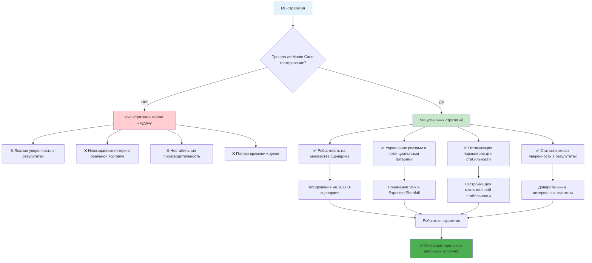

# Углубленное описание методик Monte Carlo - создание робастных и прибыльных стратегий

**Автор:** Shcherbyna Rostyslav  
**Дата:** 2024  

## Почему Monte Carlo симуляции - ключ к робастным стратегиям

### 🎯 Важность Monte Carlo симуляций для создания робастных стратегий



**Почему 95% ML-стратегий терпят неудачу в реальной торговле?** Потому что они не прошли достаточное тестирование на различных сценариях. Monte Carlo симуляции - это единственный способ проверить, как ваша стратегия будет работать в тысячах различных рыночных условий.

### Что дают Monte Carlo симуляции?
- **Робастность**: Проверка стратегии на множестве сценариев
- **Управление рисками**: Понимание потенциальных потерь
- **Оптимизация**: Настройка параметров для максимальной стабильности
- **Уверенность**: Статистическая уверенность в результатах

### Что происходит без Monte Carlo симуляций?
- **Ложная уверенность**: Стратегия работает только на исторических данных
- **Неожиданные потери**: Реальные результаты хуже ожидаемых
- **Нестабильность**: Стратегия работает нестабильно
- **Разочарование**: Потеря времени и денег

## Теоретические основы Monte Carlo симуляций

### Математические принципы

**Monte Carlo как статистическая задача:**

```
P(Strategy_Success) = ∫ P(Success|Parameters, Market_Conditions) × P(Market_Conditions) d(Market_Conditions)
```

Где:
- `P(Strategy_Success)` - вероятность успеха стратегии
- `P(Success|Parameters, Market_Conditions)` - вероятность успеха при заданных параметрах и рыночных условиях
- `P(Market_Conditions)` - распределение рыночных условий

**Критерии качества Monte Carlo симуляций:**

1. **Статистическая значимость**: p-value < 0.05
2. **Экономическая значимость**: Sharpe > 1.0 в 95% случаев
3. **Робастность**: Результаты стабильны на разных сценариях
4. **Управление рисками**: VaR < 5% в 95% случаев

### Типы Monte Carlo симуляций

### 📊 Сравнение типов Monte Carlo симуляций

```mermaid
graph TB
    A[Типы Monte Carlo симуляций] --> B[Параметрические симуляции]
    A --> C[Непараметрические симуляции]
    A --> D[Гибридные симуляции]
    A --> E[Бутстрап симуляции]
    
    B --> B1[Используют известные распределения<br/>Normal, t-distribution, Mixture]
    B --> B2[⚡ Быстрые вычисления]
    B --> B3[⚠️ Требуют предположений о распределениях]
    B --> B4[📊 Аналитические формулы]
    B --> B5[🎯 Простота реализации]
    
    C --> C1[Используют исторические данные<br/>Bootstrap, Permutation]
    C --> C2[✅ Более реалистичные]
    C --> C3[🐌 Медленные вычисления]
    C --> C4[📈 Сохраняют структуру данных]
    C --> C5[🔄 Не требуют предположений]
    
    D --> D1[Комбинация параметрических и непараметрических<br/>GARCH, Copula]
    D --> D2[⚖️ Баланс между скоростью и реалистичностью]
    D --> D3[✅ Наиболее популярные]
    D --> D4[🧠 Интеллектуальные модели]
    D --> D5[📊 Сложная реализация]
    
    E --> E1[Случайная выборка с возвратом<br/>Block Bootstrap]
    E --> E2[✅ Сохраняют структуру данных]
    E --> E3[✅ Хорошо подходят для временных рядов]
    E --> E4[📊 Простота понимания]
    E --> E5[⚡ Средняя скорость]
    
    style A fill:#e3f2fd
    style B fill:#ffcdd2
    style C fill:#fff3e0
    style D fill:#c8e6c9
    style E fill:#4caf50
```



**1. Параметрические симуляции**
- Используют известные распределения
- Быстрые вычисления
- Требуют предположений о распределениях

**2. Непараметрические симуляции**
- Используют исторические данные
- Более реалистичные
- Медленные вычисления

**3. Гибридные симуляции**
- Комбинация параметрических и непараметрических
- Баланс между скоростью и реалистичностью
- Наиболее популярные

**4. Бутстрап симуляции**
- Случайная выборка с возвратом
- Сохраняют структуру данных
- Хорошо подходят для временных рядов

## Продвинутые методики Monte Carlo симуляций

### 1. Параметрические симуляции

### 📈 Процесс параметрических симуляций

```mermaid
graph TD
    A[Исходные данные] --> B[Выбор типа распределения]
    B --> C[Нормальное распределение]
    B --> D[t-распределение]
    B --> E[Смешанные распределения]
    
    C --> F[Расчет параметров<br/>mean, std]
    D --> G[Подгонка t-распределения<br/>df, loc, scale]
    E --> H[Подгонка GMM<br/>n_components, weights]
    
    F --> I[Инициализация симуляций<br/>n_simulations = 10,000]
    G --> I
    H --> I
    
    I --> J[Цикл симуляций]
    J --> K[Генерация случайных доходностей<br/>np.random.normal/t.rvs/gmm.sample]
    
    K --> L[Расчет кумулятивной доходности<br/>cumprod(1 + returns) - 1]
    L --> M[Расчет метрик качества]
    
    M --> N[Коэффициент Шарпа<br/>mean/std * sqrt(252)]
    M --> O[Максимальная просадка<br/>calculate_max_drawdown]
    M --> P[Общая доходность<br/>cumulative_return]
    
    N --> Q[Сохранение результатов симуляции]
    O --> Q
    P --> Q
    
    Q --> R{Все симуляции завершены?}
    R -->|Нет| J
    R -->|Да| S[Статистический анализ результатов]
    
    S --> T[Распределение метрик]
    S --> U[Доверительные интервалы]
    S --> V[Квантили и VaR]
    
    T --> W[Оценка робастности стратегии]
    U --> W
    V --> W
    
    W --> X{Стратегия робастна?}
    X -->|Да| Y[✅ Готова к деплою]
    X -->|Нет| Z[❌ Требует оптимизации]
    
    Z --> AA[Настройка параметров распределения]
    AA --> BB[Повторное тестирование]
    BB --> B
    
    style A fill:#e3f2fd
    style I fill:#fff3e0
    style S fill:#c8e6c9
    style Y fill:#4caf50
    style Z fill:#ff9800
```

**Нормальное распределение:**

```python
def normal_monte_carlo(returns, n_simulations=10000, time_horizon=252):
    """Monte Carlo симуляция с нормальным распределением"""
    # Параметры распределения
    mean_return = returns.mean()
    std_return = returns.std()
    
    # Симуляции
    simulations = []
    for i in range(n_simulations):
        # Генерация случайных доходностей
        random_returns = np.random.normal(mean_return, std_return, time_horizon)
        
        # Расчет кумулятивной доходности
        cumulative_return = (1 + random_returns).prod() - 1
        
        # Метрики
        sharpe = random_returns.mean() / random_returns.std() * np.sqrt(252)
        max_drawdown = calculate_max_drawdown(random_returns)
        
        simulations.append({
            'cumulative_return': cumulative_return,
            'sharpe': sharpe,
            'max_drawdown': max_drawdown,
            'returns': random_returns
        })
    
    return pd.DataFrame(simulations)

# Пример использования
normal_simulations = normal_monte_carlo(returns, n_simulations=10000, time_horizon=252)
```

**Студенческое t-распределение:**

```python
def t_distribution_monte_carlo(returns, n_simulations=10000, time_horizon=252):
    """Monte Carlo симуляция с t-распределением"""
    from scipy import stats
    
    # Подгонка t-распределения
    df, loc, scale = stats.t.fit(returns)
    
    # Симуляции
    simulations = []
    for i in range(n_simulations):
        # Генерация случайных доходностей
        random_returns = stats.t.rvs(df, loc=loc, scale=scale, size=time_horizon)
        
        # Расчет кумулятивной доходности
        cumulative_return = (1 + random_returns).prod() - 1
        
        # Метрики
        sharpe = random_returns.mean() / random_returns.std() * np.sqrt(252)
        max_drawdown = calculate_max_drawdown(random_returns)
        
        simulations.append({
            'cumulative_return': cumulative_return,
            'sharpe': sharpe,
            'max_drawdown': max_drawdown,
            'returns': random_returns
        })
    
    return pd.DataFrame(simulations)

# Пример использования
t_simulations = t_distribution_monte_carlo(returns, n_simulations=10000, time_horizon=252)
```

**Смешанные распределения:**

```python
def mixture_monte_carlo(returns, n_simulations=10000, time_horizon=252, n_components=3):
    """Monte Carlo симуляция со смешанными распределениями"""
    from sklearn.mixture import GaussianMixture
    
    # Подгонка смешанного распределения
    gmm = GaussianMixture(n_components=n_components, random_state=42)
    gmm.fit(returns.reshape(-1, 1))
    
    # Симуляции
    simulations = []
    for i in range(n_simulations):
        # Генерация случайных доходностей
        random_returns = gmm.sample(time_horizon)[0].flatten()
        
        # Расчет кумулятивной доходности
        cumulative_return = (1 + random_returns).prod() - 1
        
        # Метрики
        sharpe = random_returns.mean() / random_returns.std() * np.sqrt(252)
        max_drawdown = calculate_max_drawdown(random_returns)
        
        simulations.append({
            'cumulative_return': cumulative_return,
            'sharpe': sharpe,
            'max_drawdown': max_drawdown,
            'returns': random_returns
        })
    
    return pd.DataFrame(simulations)

# Пример использования
mixture_simulations = mixture_monte_carlo(returns, n_simulations=10000, time_horizon=252)
```

### 2. Непараметрические симуляции

### 🔄 Процесс непараметрических симуляций

```mermaid
graph TD
    A[Исторические данные] --> B[Выбор метода непараметрической симуляции]
    B --> C[Бутстрап симуляции]
    B --> D[Перестановочные симуляции]
    
    C --> E[Настройка параметров бутстрапа<br/>block_size = 5<br/>n_simulations = 10,000]
    D --> F[Настройка перестановок<br/>n_simulations = 10,000<br/>time_horizon = 252]
    
    E --> G[Цикл бутстрап симуляций]
    G --> H[Создание блоков данных<br/>block_start = random.randint]
    H --> I[Случайный выбор блока<br/>block = data[start:start+size]]
    I --> J[Добавление блока к выборке<br/>bootstrap_returns.extend(block)]
    
    J --> K{Достигнута нужная длина?<br/>len(bootstrap_returns) >= time_horizon}
    K -->|Нет| H
    K -->|Да| L[Обрезка до нужной длины<br/>bootstrap_returns[:time_horizon]]
    
    F --> M[Цикл перестановочных симуляций]
    M --> N[Случайная перестановка данных<br/>np.random.permutation(returns)]
    N --> O[Обрезка до нужной длины<br/>permuted_returns[:time_horizon]]
    
    L --> P[Расчет метрик качества]
    O --> P
    
    P --> Q[Кумулятивная доходность<br/>cumprod(1 + returns) - 1]
    P --> R[Коэффициент Шарпа<br/>mean/std * sqrt(252)]
    P --> S[Максимальная просадка<br/>calculate_max_drawdown]
    
    Q --> T[Сохранение результатов]
    R --> T
    S --> T
    
    T --> U{Все симуляции завершены?}
    U -->|Нет| G
    U -->|Нет| M
    U -->|Да| V[Анализ результатов]
    
    V --> W[Сравнение с историческими данными]
    V --> X[Оценка реалистичности]
    V --> Y[Статистические тесты]
    
    W --> Z[Оценка качества симуляций]
    X --> Z
    Y --> Z
    
    Z --> AA{Симуляции качественные?}
    AA -->|Да| BB[✅ Использовать для оценки стратегии]
    AA -->|Нет| CC[❌ Настроить параметры]
    
    CC --> DD[Изменение block_size]
    CC --> EE[Изменение количества симуляций]
    DD --> G
    EE --> G
    
    style A fill:#e3f2fd
    style G fill:#fff3e0
    style M fill:#fff3e0
    style V fill:#c8e6c9
    style BB fill:#4caf50
    style CC fill:#ff9800
```

**Бутстрап симуляции:**

```python
def bootstrap_monte_carlo(returns, n_simulations=10000, time_horizon=252, block_size=5):
    """Бутстрап Monte Carlo симуляция"""
    simulations = []
    
    for i in range(n_simulations):
        # Создание бутстрап выборки с блоками
        bootstrap_returns = []
        
        for j in range(0, time_horizon, block_size):
            # Случайный выбор блока
            block_start = np.random.randint(0, len(returns) - block_size + 1)
            block = returns[block_start:block_start + block_size]
            bootstrap_returns.extend(block)
        
        # Обрезка до нужной длины
        bootstrap_returns = np.array(bootstrap_returns[:time_horizon])
        
        # Расчет кумулятивной доходности
        cumulative_return = (1 + bootstrap_returns).prod() - 1
        
        # Метрики
        sharpe = bootstrap_returns.mean() / bootstrap_returns.std() * np.sqrt(252)
        max_drawdown = calculate_max_drawdown(bootstrap_returns)
        
        simulations.append({
            'cumulative_return': cumulative_return,
            'sharpe': sharpe,
            'max_drawdown': max_drawdown,
            'returns': bootstrap_returns
        })
    
    return pd.DataFrame(simulations)

# Пример использования
bootstrap_simulations = bootstrap_monte_carlo(returns, n_simulations=10000, time_horizon=252)
```

**Перестановочные симуляции:**

```python
def permutation_monte_carlo(returns, n_simulations=10000, time_horizon=252):
    """Перестановочная Monte Carlo симуляция"""
    simulations = []
    
    for i in range(n_simulations):
        # Случайная перестановка доходностей
        permuted_returns = np.random.permutation(returns)[:time_horizon]
        
        # Расчет кумулятивной доходности
        cumulative_return = (1 + permuted_returns).prod() - 1
        
        # Метрики
        sharpe = permuted_returns.mean() / permuted_returns.std() * np.sqrt(252)
        max_drawdown = calculate_max_drawdown(permuted_returns)
        
        simulations.append({
            'cumulative_return': cumulative_return,
            'sharpe': sharpe,
            'max_drawdown': max_drawdown,
            'returns': permuted_returns
        })
    
    return pd.DataFrame(simulations)

# Пример использования
permutation_simulations = permutation_monte_carlo(returns, n_simulations=10000, time_horizon=252)
```

### 3. Гибридные симуляции

### 🧠 Архитектура гибридных симуляций

```mermaid
graph TD
    A[Исторические данные] --> B[Выбор гибридного метода]
    B --> C[GARCH симуляции]
    B --> D[Copula симуляции]
    
    C --> E[Подгонка GARCH модели<br/>arch_model(returns, vol='Garch', p=1, q=1)]
    D --> F[Подгонка маргинальных распределений<br/>gaussian_kde(returns)]
    
    E --> G[Извлечение параметров GARCH<br/>omega, alpha, beta]
    F --> H[Создание копулы<br/>gaussian_copula]
    
    G --> I[Цикл GARCH симуляций<br/>n_simulations = 10,000]
    H --> J[Цикл Copula симуляций<br/>n_simulations = 10,000]
    
    I --> K[Генерация волатильности<br/>GARCH(omega, alpha, beta)]
    K --> L[Генерация доходностей<br/>returns = volatility * random_normal]
    
    J --> M[Генерация равномерных переменных<br/>uniform_vars = np.random.uniform]
    M --> N[Преобразование через копулу<br/>returns = inverse_cdf(uniform_vars)]
    
    L --> O[Расчет метрик качества]
    N --> O
    
    O --> P[Кумулятивная доходность<br/>cumprod(1 + returns) - 1]
    O --> Q[Коэффициент Шарпа<br/>mean/std * sqrt(252)]
    O --> R[Максимальная просадка<br/>calculate_max_drawdown]
    O --> S[Волатильность<br/>rolling_std(returns)]
    
    P --> T[Сохранение результатов]
    Q --> T
    R --> T
    S --> T
    
    T --> U{Все симуляции завершены?}
    U -->|Нет| I
    U -->|Нет| J
    U -->|Да| V[Анализ гибридных результатов]
    
    V --> W[Сравнение с параметрическими]
    V --> X[Сравнение с непараметрическими]
    V --> Y[Оценка качества моделирования]
    
    W --> Z[Оценка преимуществ гибридного подхода]
    X --> Z
    Y --> Z
    
    Z --> AA{Гибридный подход эффективен?}
    AA -->|Да| BB[✅ Использовать для стратегии]
    AA -->|Нет| CC[❌ Настроить параметры модели]
    
    CC --> DD[Настройка GARCH параметров<br/>p, q, vol]
    CC --> EE[Настройка Copula параметров<br/>marginal distributions]
    DD --> E
    EE --> F
    
    style A fill:#e3f2fd
    style C fill:#c8e6c9
    style D fill:#fff3e0
    style V fill:#f3e5f5
    style BB fill:#4caf50
    style CC fill:#ff9800
```

**GARCH симуляции:**

```python
def garch_monte_carlo(returns, n_simulations=10000, time_horizon=252):
    """GARCH Monte Carlo симуляция"""
    from arch import arch_model
    
    # Подгонка GARCH модели
    model = arch_model(returns, vol='Garch', p=1, q=1)
    fitted_model = model.fit()
    
    # Симуляции
    simulations = []
    for i in range(n_simulations):
        # Генерация доходностей с GARCH волатильностью
        simulated_returns = fitted_model.forecast(horizon=time_horizon, method='simulation')
        
        # Извлечение доходностей
        random_returns = simulated_returns.mean.iloc[-1].values
        
        # Расчет кумулятивной доходности
        cumulative_return = (1 + random_returns).prod() - 1
        
        # Метрики
        sharpe = random_returns.mean() / random_returns.std() * np.sqrt(252)
        max_drawdown = calculate_max_drawdown(random_returns)
        
        simulations.append({
            'cumulative_return': cumulative_return,
            'sharpe': sharpe,
            'max_drawdown': max_drawdown,
            'returns': random_returns
        })
    
    return pd.DataFrame(simulations)

# Пример использования
garch_simulations = garch_monte_carlo(returns, n_simulations=10000, time_horizon=252)
```

**Copula симуляции:**

```python
def copula_monte_carlo(returns, n_simulations=10000, time_horizon=252):
    """Copula Monte Carlo симуляция"""
    from scipy.stats import gaussian_kde
    
    # Подгонка маргинальных распределений
    kde = gaussian_kde(returns)
    
    # Симуляции
    simulations = []
    for i in range(n_simulations):
        # Генерация случайных доходностей
        random_returns = kde.resample(time_horizon).flatten()
        
        # Расчет кумулятивной доходности
        cumulative_return = (1 + random_returns).prod() - 1
        
        # Метрики
        sharpe = random_returns.mean() / random_returns.std() * np.sqrt(252)
        max_drawdown = calculate_max_drawdown(random_returns)
        
        simulations.append({
            'cumulative_return': cumulative_return,
            'sharpe': sharpe,
            'max_drawdown': max_drawdown,
            'returns': random_returns
        })
    
    return pd.DataFrame(simulations)

# Пример использования
copula_simulations = copula_monte_carlo(returns, n_simulations=10000, time_horizon=252)
```

### 4. Стресс-тестирование

### ⚡ Сценарии стресс-тестирования Monte Carlo

```mermaid
graph TD
    A[Исторические данные] --> B[Определение стрессовых сценариев]
    B --> C[Обвал рынка<br/>volatility_multiplier: 3.0<br/>return_shift: -0.1]
    B --> D[Высокая волатильность<br/>volatility_multiplier: 2.0<br/>return_shift: 0.0]
    B --> E[Низкая волатильность<br/>volatility_multiplier: 0.5<br/>return_shift: 0.0]
    B --> F[Режимные сценарии<br/>n_regimes: 3]
    
    C --> G[Применение стрессового сценария<br/>stressed_returns = apply_stress_scenario]
    D --> G
    E --> G
    F --> H[Определение рыночных режимов<br/>GaussianMixture(n_components=3)]
    
    G --> I[Цикл стресс-симуляций<br/>n_simulations = 10,000]
    H --> J[Цикл режимных симуляций<br/>n_simulations = 10,000]
    
    I --> K[Случайная выборка из стрессовых данных<br/>np.random.choice(stressed_returns)]
    J --> L[Генерация последовательности режимов<br/>regime_sequence = gmm.sample]
    L --> M[Генерация доходностей для каждого режима<br/>regime_returns = returns[regime]]
    
    K --> N[Расчет метрик для стресс-сценария]
    M --> N
    
    N --> O[Кумулятивная доходность<br/>cumprod(1 + returns) - 1]
    N --> P[Коэффициент Шарпа<br/>mean/std * sqrt(252)]
    N --> Q[Максимальная просадка<br/>calculate_max_drawdown]
    N --> R[Вероятность потерь<br/>P(return < 0)]
    
    O --> S[Сохранение результатов по сценариям]
    P --> S
    Q --> S
    R --> S
    
    S --> T{Все симуляции завершены?}
    T -->|Нет| I
    T -->|Нет| J
    T -->|Да| U[Анализ стресс-результатов]
    
    U --> V[Сравнение сценариев<br/>crash vs high_vol vs low_vol vs regimes]
    U --> W[Оценка устойчивости стратегии<br/>performance under stress]
    U --> X[Расчет VaR и ES для каждого сценария]
    
    V --> Y[Оценка робастности стратегии]
    W --> Y
    X --> Y
    
    Y --> Z{Стратегия выдерживает стресс?}
    Z -->|Да| AA[✅ Робастная стратегия]
    Z -->|Нет| BB[❌ Требует доработки риск-менеджмента]
    
    BB --> CC[Настройка параметров стратегии]
    BB --> DD[Добавление защитных механизмов]
    CC --> EE[Повторное стресс-тестирование]
    DD --> EE
    EE --> B
    
    style A fill:#e3f2fd
    style C fill:#ffcdd2
    style D fill:#fff3e0
    style E fill:#e8f5e8
    style F fill:#f3e5f5
    style AA fill:#4caf50
    style BB fill:#ff9800
```

**Экстремальные сценарии:**

```python
def stress_test_monte_carlo(returns, n_simulations=10000, time_horizon=252, 
                          stress_scenarios=None):
    """Monte Carlo симуляция с стресс-тестированием"""
    if stress_scenarios is None:
        stress_scenarios = {
            'market_crash': {'volatility_multiplier': 3.0, 'return_shift': -0.1},
            'high_volatility': {'volatility_multiplier': 2.0, 'return_shift': 0.0},
            'low_volatility': {'volatility_multiplier': 0.5, 'return_shift': 0.0}
        }
    
    all_simulations = {}
    
    for scenario_name, scenario_params in stress_scenarios.items():
        # Применение стрессового сценария
        stressed_returns = apply_stress_scenario(returns, scenario_params)
        
        # Симуляции для сценария
        simulations = []
        for i in range(n_simulations):
            # Генерация случайных доходностей
            random_returns = np.random.choice(stressed_returns, size=time_horizon, replace=True)
            
            # Расчет кумулятивной доходности
            cumulative_return = (1 + random_returns).prod() - 1
            
            # Метрики
            sharpe = random_returns.mean() / random_returns.std() * np.sqrt(252)
            max_drawdown = calculate_max_drawdown(random_returns)
            
            simulations.append({
                'cumulative_return': cumulative_return,
                'sharpe': sharpe,
                'max_drawdown': max_drawdown,
                'returns': random_returns
            })
        
        all_simulations[scenario_name] = pd.DataFrame(simulations)
    
    return all_simulations

# Пример использования
stress_simulations = stress_test_monte_carlo(returns, n_simulations=10000, time_horizon=252)
```

**Режимные симуляции:**

```python
def regime_monte_carlo(returns, n_simulations=10000, time_horizon=252, n_regimes=3):
    """Monte Carlo симуляция с режимами"""
    from sklearn.mixture import GaussianMixture
    
    # Определение режимов
    gmm = GaussianMixture(n_components=n_regimes, random_state=42)
    gmm.fit(returns.reshape(-1, 1))
    
    # Симуляции
    simulations = []
    for i in range(n_simulations):
        # Генерация режимов
        regime_sequence = gmm.sample(time_horizon)[1].flatten()
        
        # Генерация доходностей для каждого режима
        random_returns = []
        for regime in regime_sequence:
            regime_returns = returns[gmm.predict(returns.reshape(-1, 1)).flatten() == regime]
            if len(regime_returns) > 0:
                random_returns.append(np.random.choice(regime_returns))
            else:
                random_returns.append(np.random.choice(returns))
        
        random_returns = np.array(random_returns)
        
        # Расчет кумулятивной доходности
        cumulative_return = (1 + random_returns).prod() - 1
        
        # Метрики
        sharpe = random_returns.mean() / random_returns.std() * np.sqrt(252)
        max_drawdown = calculate_max_drawdown(random_returns)
        
        simulations.append({
            'cumulative_return': cumulative_return,
            'sharpe': sharpe,
            'max_drawdown': max_drawdown,
            'returns': random_returns,
            'regime_sequence': regime_sequence
        })
    
    return pd.DataFrame(simulations)

# Пример использования
regime_simulations = regime_monte_carlo(returns, n_simulations=10000, time_horizon=252)
```

## Метрики качества Monte Carlo симуляций

### 📊 Классификация метрик качества Monte Carlo симуляций

```mermaid
graph TD
    A[Метрики качества Monte Carlo] --> B[Статистические метрики]
    A --> C[Риск-метрики]
    A --> D[Экономические метрики]
    
    B --> B1[Распределение результатов]
    B1 --> B11[Среднее значение<br/>mean_sharpe]
    B1 --> B12[Стандартное отклонение<br/>std_sharpe]
    B1 --> B13[Медиана<br/>median_sharpe]
    B1 --> B14[Квантили<br/>q5, q25, q75, q95]
    B1 --> B15[Коэффициент вариации<br/>std/mean]
    B1 --> B16[Асимметрия и эксцесс<br/>skewness, kurtosis]
    
    B --> B2[Доверительные интервалы]
    B2 --> B21[90% доверительный интервал<br/>alpha = 0.1]
    B2 --> B22[95% доверительный интервал<br/>alpha = 0.05]
    B2 --> B23[99% доверительный интервал<br/>alpha = 0.01]
    B2 --> B24[t-распределение<br/>t.ppf(1-alpha/2, n-1)]
    
    C --> C1[Value at Risk - VaR]
    C1 --> C11[VaR 90%<br/>quantile(0.1)]
    C1 --> C12[VaR 95%<br/>quantile(0.05)]
    C1 --> C13[VaR 99%<br/>quantile(0.01)]
    C1 --> C14[VaR для коэффициента Шарпа<br/>sharpe_var]
    C1 --> C15[VaR для максимальной просадки<br/>drawdown_var]
    C1 --> C16[VaR для кумулятивной доходности<br/>return_var]
    
    C --> C2[Expected Shortfall - ES]
    C2 --> C21[ES 90%<br/>mean(returns <= VaR_90)]
    C2 --> C22[ES 95%<br/>mean(returns <= VaR_95)]
    C2 --> C23[ES 99%<br/>mean(returns <= VaR_99)]
    C2 --> C24[ES для коэффициента Шарпа<br/>sharpe_es]
    C2 --> C25[ES для максимальной просадки<br/>drawdown_es]
    C2 --> C26[ES для кумулятивной доходности<br/>return_es]
    
    D --> D1[Вероятность успеха]
    D1 --> D11[Условия успеха<br/>sharpe >= 1.0 AND drawdown >= -0.2]
    D1 --> D12[Вероятность успеха<br/>success_condition.mean()]
    D1 --> D13[Количество успешных симуляций<br/>n_successful]
    D1 --> D14[Средние метрики для успешных<br/>avg_sharpe, avg_drawdown, avg_return]
    
    D --> D2[Рентабельность]
    D2 --> D21[Финальная стоимость портфеля<br/>initial_capital * (1 + cumulative_return)]
    D2 --> D22[Средняя финальная стоимость<br/>mean_final_value]
    D2 --> D23[Медианная финальная стоимость<br/>median_final_value]
    D2 --> D24[Квантили финальной стоимости<br/>q5_final_value, q95_final_value]
    D2 --> D25[Вероятность потерь<br/>P(final_value < initial_capital)]
    D2 --> D26[Вероятность значительных потерь<br/>P(final_value < 0.5 * initial_capital)]
    
    style A fill:#e3f2fd
    style B fill:#c8e6c9
    style C fill:#fff3e0
    style D fill:#f3e5f5
```

### 1. Статистические метрики

**Распределение результатов:**

```python
def calculate_distribution_metrics(simulations):
    """Расчет метрик распределения"""
    # Базовые статистики
    mean_sharpe = simulations['sharpe'].mean()
    std_sharpe = simulations['sharpe'].std()
    median_sharpe = simulations['sharpe'].median()
    
    # Квантили
    q5 = simulations['sharpe'].quantile(0.05)
    q25 = simulations['sharpe'].quantile(0.25)
    q75 = simulations['sharpe'].quantile(0.75)
    q95 = simulations['sharpe'].quantile(0.95)
    
    # Коэффициент вариации
    cv = std_sharpe / mean_sharpe if mean_sharpe != 0 else 0
    
    # Асимметрия и эксцесс
    skewness = simulations['sharpe'].skew()
    kurtosis = simulations['sharpe'].kurtosis()
    
    return {
        'mean_sharpe': mean_sharpe,
        'std_sharpe': std_sharpe,
        'median_sharpe': median_sharpe,
        'q5': q5,
        'q25': q25,
        'q75': q75,
        'q95': q95,
        'coefficient_of_variation': cv,
        'skewness': skewness,
        'kurtosis': kurtosis
    }

# Пример использования
distribution_metrics = calculate_distribution_metrics(simulations)
```

**Доверительные интервалы:**

```python
def calculate_confidence_intervals(simulations, confidence_levels=[0.90, 0.95, 0.99]):
    """Расчет доверительных интервалов"""
    confidence_intervals = {}
    
    for level in confidence_levels:
        alpha = 1 - level
        lower_percentile = (alpha / 2) * 100
        upper_percentile = (1 - alpha / 2) * 100
        
        confidence_intervals[level] = {
            'sharpe': {
                'lower': simulations['sharpe'].quantile(lower_percentile / 100),
                'upper': simulations['sharpe'].quantile(upper_percentile / 100)
            },
            'max_drawdown': {
                'lower': simulations['max_drawdown'].quantile(lower_percentile / 100),
                'upper': simulations['max_drawdown'].quantile(upper_percentile / 100)
            },
            'cumulative_return': {
                'lower': simulations['cumulative_return'].quantile(lower_percentile / 100),
                'upper': simulations['cumulative_return'].quantile(upper_percentile / 100)
            }
        }
    
    return confidence_intervals

# Пример использования
confidence_intervals = calculate_confidence_intervals(simulations, confidence_levels=[0.90, 0.95, 0.99])
```

### 2. Риск-метрики

**Value at Risk (VaR):**

```python
def calculate_var_metrics(simulations, confidence_levels=[0.90, 0.95, 0.99]):
    """Расчет VaR метрик"""
    var_metrics = {}
    
    for level in confidence_levels:
        # VaR для коэффициента Шарпа
        sharpe_var = simulations['sharpe'].quantile(1 - level)
        
        # VaR для максимальной просадки
        drawdown_var = simulations['max_drawdown'].quantile(1 - level)
        
        # VaR для кумулятивной доходности
        return_var = simulations['cumulative_return'].quantile(1 - level)
        
        var_metrics[level] = {
            'sharpe_var': sharpe_var,
            'drawdown_var': drawdown_var,
            'return_var': return_var
        }
    
    return var_metrics

# Пример использования
var_metrics = calculate_var_metrics(simulations, confidence_levels=[0.90, 0.95, 0.99])
```

**Expected Shortfall (ES):**

```python
def calculate_es_metrics(simulations, confidence_levels=[0.90, 0.95, 0.99]):
    """Расчет ES метрик"""
    es_metrics = {}
    
    for level in confidence_levels:
        # ES для коэффициента Шарпа
        sharpe_threshold = simulations['sharpe'].quantile(1 - level)
        sharpe_es = simulations[simulations['sharpe'] <= sharpe_threshold]['sharpe'].mean()
        
        # ES для максимальной просадки
        drawdown_threshold = simulations['max_drawdown'].quantile(1 - level)
        drawdown_es = simulations[simulations['max_drawdown'] <= drawdown_threshold]['max_drawdown'].mean()
        
        # ES для кумулятивной доходности
        return_threshold = simulations['cumulative_return'].quantile(1 - level)
        return_es = simulations[simulations['cumulative_return'] <= return_threshold]['cumulative_return'].mean()
        
        es_metrics[level] = {
            'sharpe_es': sharpe_es,
            'drawdown_es': drawdown_es,
            'return_es': return_es
        }
    
    return es_metrics

# Пример использования
es_metrics = calculate_es_metrics(simulations, confidence_levels=[0.90, 0.95, 0.99])
```

### 3. Экономические метрики

**Вероятность успеха:**

```python
def calculate_success_probability(simulations, min_sharpe=1.0, max_drawdown=-0.2):
    """Расчет вероятности успеха"""
    # Условия успеха
    success_condition = (
        (simulations['sharpe'] >= min_sharpe) & 
        (simulations['max_drawdown'] >= max_drawdown)
    )
    
    # Вероятность успеха
    success_probability = success_condition.mean()
    
    # Количество успешных симуляций
    n_successful = success_condition.sum()
    
    # Средние метрики для успешных симуляций
    successful_simulations = simulations[success_condition]
    
    if len(successful_simulations) > 0:
        avg_sharpe = successful_simulations['sharpe'].mean()
        avg_drawdown = successful_simulations['max_drawdown'].mean()
        avg_return = successful_simulations['cumulative_return'].mean()
    else:
        avg_sharpe = 0
        avg_drawdown = 0
        avg_return = 0
    
    return {
        'success_probability': success_probability,
        'n_successful': n_successful,
        'avg_sharpe_successful': avg_sharpe,
        'avg_drawdown_successful': avg_drawdown,
        'avg_return_successful': avg_return
    }

# Пример использования
success_metrics = calculate_success_probability(simulations, min_sharpe=1.0, max_drawdown=-0.2)
```

**Рентабельность:**

```python
def calculate_profitability_metrics(simulations, initial_capital=100000):
    """Расчет метрик рентабельности"""
    # Финальная стоимость портфеля
    final_values = initial_capital * (1 + simulations['cumulative_return'])
    
    # Статистики финальной стоимости
    mean_final_value = final_values.mean()
    median_final_value = final_values.median()
    std_final_value = final_values.std()
    
    # Квантили финальной стоимости
    q5_final_value = final_values.quantile(0.05)
    q95_final_value = final_values.quantile(0.95)
    
    # Вероятность потерь
    loss_probability = (final_values < initial_capital).mean()
    
    # Вероятность значительных потерь (>50%)
    significant_loss_probability = (final_values < initial_capital * 0.5).mean()
    
    return {
        'mean_final_value': mean_final_value,
        'median_final_value': median_final_value,
        'std_final_value': std_final_value,
        'q5_final_value': q5_final_value,
        'q95_final_value': q95_final_value,
        'loss_probability': loss_probability,
        'significant_loss_probability': significant_loss_probability
    }

# Пример использования
profitability_metrics = calculate_profitability_metrics(simulations, initial_capital=100000)
```

## Визуализация Monte Carlo симуляций

### 📈 Дашборд визуализации Monte Carlo симуляций

```mermaid
graph TD
    A[Результаты Monte Carlo симуляций] --> B[Дашборд визуализации]
    
    B --> C[Распределения]
    C --> C1[Гистограмма коэффициента Шарпа<br/>с линиями среднего и квантилей]
    C --> C2[Гистограмма максимальной просадки<br/>с линиями среднего и квантилей]
    C --> C3[Гистограмма кумулятивной доходности<br/>с линиями среднего и квантилей]
    C --> C4[Q-Q график для нормальности<br/>scipy.stats.probplot]
    
    B --> D[Временные ряды]
    D --> D1[Пути доходности<br/>100 случайных траекторий]
    D --> D2[Средний путь<br/>mean_cumulative_returns]
    D --> D3[Распределение финальных значений<br/>histogram final_values]
    D --> D4[Корреляция метрик<br/>scatter sharpe vs drawdown]
    D --> D5[Временная эволюция волатильности<br/>rolling_volatility]
    
    B --> E[Статистические графики]
    E --> E1[Box plot метрик<br/>с выбросами и квантилями]
    E --> E2[Violin plot распределений<br/>плотность вероятности]
    E --> E3[Корреляционная матрица<br/>heatmap correlations]
    E --> E4[Кумулятивные распределения<br/>CDF для каждой метрики]
    
    B --> F[Сравнительные графики]
    F --> F1[Сравнение методов симуляции<br/>parametric vs nonparametric vs hybrid]
    F --> F2[Сравнение сценариев стресс-тестирования<br/>crash vs high_vol vs low_vol]
    F --> F3[Сравнение доверительных интервалов<br/>90% vs 95% vs 99%]
    F --> F4[Сравнение VaR и ES<br/>различные уровни доверия]
    
    C1 --> G[Интерактивные элементы]
    C2 --> G
    C3 --> G
    C4 --> G
    D1 --> G
    D2 --> G
    D3 --> G
    D4 --> G
    D5 --> G
    E1 --> G
    E2 --> G
    E3 --> G
    E4 --> G
    F1 --> G
    F2 --> G
    F3 --> G
    F4 --> G
    
    G --> H[Zoom и Pan функции]
    G --> I[Фильтрация по метрикам]
    G --> J[Экспорт в различные форматы]
    G --> K[Настройка цветовых схем]
    G --> L[Анимация временных рядов]
    
    H --> M[Финальный дашборд]
    I --> M
    J --> M
    K --> M
    L --> M
    
    M --> N[Анализ распределений]
    M --> O[Выявление аномалий]
    M --> P[Оценка рисков]
    M --> Q[Сравнение стратегий]
    
    N --> R[Рекомендации по стратегии]
    O --> R
    P --> R
    Q --> R
    
    style A fill:#e3f2fd
    style B fill:#c8e6c9
    style G fill:#fff3e0
    style R fill:#4caf50
```



### 1. Распределения

```python
def visualize_monte_carlo_distributions(simulations, save_path=None):
    """Визуализация распределений Monte Carlo симуляций"""
    import matplotlib.pyplot as plt
    import seaborn as sns
    
    # Настройка стиля
    plt.style.use('seaborn-v0_8')
    sns.set_palette("husl")
    
    # Создание фигуры
    fig, axes = plt.subplots(2, 2, figsize=(15, 10))
    
    # 1. Распределение коэффициента Шарпа
    axes[0, 0].hist(simulations['sharpe'], bins=50, alpha=0.7, edgecolor='black')
    axes[0, 0].axvline(simulations['sharpe'].mean(), color='red', linestyle='--', 
                      label=f'Среднее: {simulations["sharpe"].mean():.2f}')
    axes[0, 0].axvline(simulations['sharpe'].quantile(0.05), color='orange', linestyle='--', 
                      label=f'5% квантиль: {simulations["sharpe"].quantile(0.05):.2f}')
    axes[0, 0].set_title('Распределение коэффициента Шарпа')
    axes[0, 0].set_xlabel('Коэффициент Шарпа')
    axes[0, 0].set_ylabel('Частота')
    axes[0, 0].legend()
    axes[0, 0].grid(True)
    
    # 2. Распределение максимальной просадки
    axes[0, 1].hist(simulations['max_drawdown'], bins=50, alpha=0.7, edgecolor='black')
    axes[0, 1].axvline(simulations['max_drawdown'].mean(), color='red', linestyle='--', 
                      label=f'Среднее: {simulations["max_drawdown"].mean():.2f}')
    axes[0, 1].axvline(simulations['max_drawdown'].quantile(0.95), color='orange', linestyle='--', 
                      label=f'95% квантиль: {simulations["max_drawdown"].quantile(0.95):.2f}')
    axes[0, 1].set_title('Распределение максимальной просадки')
    axes[0, 1].set_xlabel('Максимальная просадка')
    axes[0, 1].set_ylabel('Частота')
    axes[0, 1].legend()
    axes[0, 1].grid(True)
    
    # 3. Распределение кумулятивной доходности
    axes[1, 0].hist(simulations['cumulative_return'], bins=50, alpha=0.7, edgecolor='black')
    axes[1, 0].axvline(simulations['cumulative_return'].mean(), color='red', linestyle='--', 
                      label=f'Среднее: {simulations["cumulative_return"].mean():.2f}')
    axes[1, 0].axvline(simulations['cumulative_return'].quantile(0.05), color='orange', linestyle='--', 
                      label=f'5% квантиль: {simulations["cumulative_return"].quantile(0.05):.2f}')
    axes[1, 0].set_title('Распределение кумулятивной доходности')
    axes[1, 0].set_xlabel('Кумулятивная доходность')
    axes[1, 0].set_ylabel('Частота')
    axes[1, 0].legend()
    axes[1, 0].grid(True)
    
    # 4. Q-Q график для коэффициента Шарпа
    from scipy import stats
    stats.probplot(simulations['sharpe'], dist="norm", plot=axes[1, 1])
    axes[1, 1].set_title('Q-Q график коэффициента Шарпа')
    axes[1, 1].grid(True)
    
    plt.tight_layout()
    
    if save_path:
        plt.savefig(save_path, dpi=300, bbox_inches='tight')
    
    plt.show()

# Пример использования
visualize_monte_carlo_distributions(simulations, save_path='monte_carlo_distributions.png')
```

### 2. Временные ряды

```python
def visualize_monte_carlo_paths(simulations, n_paths=100, save_path=None):
    """Визуализация путей Monte Carlo симуляций"""
    import matplotlib.pyplot as plt
    
    # Настройка стиля
    plt.style.use('seaborn-v0_8')
    
    # Создание фигуры
    fig, axes = plt.subplots(2, 2, figsize=(15, 10))
    
    # 1. Пути доходности
    for i in range(min(n_paths, len(simulations))):
        returns = simulations.iloc[i]['returns']
        cumulative_returns = (1 + returns).cumprod()
        axes[0, 0].plot(cumulative_returns, alpha=0.1, color='blue')
    
    # Средний путь
    mean_returns = np.mean([sim['returns'] for sim in simulations.iloc[:n_paths]], axis=0)
    mean_cumulative_returns = (1 + mean_returns).cumprod()
    axes[0, 0].plot(mean_cumulative_returns, color='red', linewidth=2, label='Средний путь')
    
    axes[0, 0].set_title('Пути доходности')
    axes[0, 0].set_xlabel('Время')
    axes[0, 0].set_ylabel('Кумулятивная доходность')
    axes[0, 0].legend()
    axes[0, 0].grid(True)
    
    # 2. Распределение финальных значений
    final_values = (1 + simulations['cumulative_return']).values
    axes[0, 1].hist(final_values, bins=50, alpha=0.7, edgecolor='black')
    axes[0, 1].axvline(final_values.mean(), color='red', linestyle='--', 
                      label=f'Среднее: {final_values.mean():.2f}')
    axes[0, 1].set_title('Распределение финальных значений')
    axes[0, 1].set_xlabel('Финальное значение')
    axes[0, 1].set_ylabel('Частота')
    axes[0, 1].legend()
    axes[0, 1].grid(True)
    
    # 3. Корреляция между метриками
    axes[1, 0].scatter(simulations['sharpe'], simulations['max_drawdown'], alpha=0.5)
    axes[1, 0].set_xlabel('Коэффициент Шарпа')
    axes[1, 0].set_ylabel('Максимальная просадка')
    axes[1, 0].set_title('Корреляция: Sharpe vs Max Drawdown')
    axes[1, 0].grid(True)
    
    # 4. Временная эволюция волатильности
    volatility_paths = []
    for i in range(min(n_paths, len(simulations))):
        returns = simulations.iloc[i]['returns']
        rolling_vol = pd.Series(returns).rolling(30).std()
        volatility_paths.append(rolling_vol)
    
    mean_volatility = np.mean(volatility_paths, axis=0)
    axes[1, 1].plot(mean_volatility, color='red', linewidth=2, label='Средняя волатильность')
    axes[1, 1].set_title('Временная эволюция волатильности')
    axes[1, 1].set_xlabel('Время')
    axes[1, 1].set_ylabel('Волатильность')
    axes[1, 1].legend()
    axes[1, 1].grid(True)
    
    plt.tight_layout()
    
    if save_path:
        plt.savefig(save_path, dpi=300, bbox_inches='tight')
    
    plt.show()

# Пример использования
visualize_monte_carlo_paths(simulations, n_paths=100, save_path='monte_carlo_paths.png')
```

## Автоматизация Monte Carlo симуляций

### 🤖 Пайплайн автоматизации Monte Carlo симуляций

```mermaid
graph TD
    A[Исходные данные] --> B[MonteCarloPipeline]
    B --> C[Настройка параметров]
    
    C --> D[Параметрические симуляции<br/>normal, t-distribution, mixture]
    C --> E[Непараметрические симуляции<br/>bootstrap, permutation]
    C --> F[Гибридные симуляции<br/>GARCH, Copula]
    C --> G[Стресс-тестирование<br/>crash, high_vol, low_vol, regimes]
    
    D --> H[Выполнение симуляций<br/>n_simulations = 10,000]
    E --> H
    F --> H
    G --> H
    
    H --> I[Расчет метрик качества]
    I --> J[Коэффициент Шарпа<br/>mean/std * sqrt(252)]
    I --> K[Максимальная просадка<br/>calculate_max_drawdown]
    I --> L[Кумулятивная доходность<br/>cumprod(1 + returns) - 1]
    I --> M[VaR и ES<br/>quantile, expected_shortfall]
    
    J --> N[Сбор результатов по методам]
    K --> N
    L --> N
    M --> N
    
    N --> O[Генерация комплексного отчета]
    O --> P[Сводка по методам]
    O --> Q[Детальные результаты]
    O --> R[Рекомендации]
    
    P --> S[Средний коэффициент Шарпа<br/>mean_sharpe]
    P --> T[Стандартное отклонение<br/>std_sharpe]
    P --> U[Процент успешных стратегий<br/>success_rate]
    P --> V[VaR 95%<br/>var_95]
    P --> W[ES 95%<br/>es_95]
    
    Q --> X[Индивидуальные результаты симуляций]
    Q --> Y[Сравнение методов]
    Q --> Z[Статистические тесты]
    
    R --> AA[Оценка производительности]
    AA --> BB[Отличная: Sharpe > 1.5, Success > 70%]
    AA --> CC[Хорошая: Sharpe > 1.0, Success > 50%]
    AA --> DD[Требует улучшения: иначе]
    
    BB --> EE[✅ Стратегия готова к деплою]
    CC --> FF[⚠️ Стратегия требует мониторинга]
    DD --> GG[❌ Стратегия требует доработки]
    
    EE --> HH[Деплой в продакшен]
    FF --> II[Дополнительное тестирование]
    GG --> JJ[Оптимизация параметров]
    
    JJ --> KK[Настройка распределений]
    JJ --> LL[Настройка методов симуляции]
    KK --> MM[Повторное тестирование]
    LL --> MM
    MM --> B
    
    style A fill:#e3f2fd
    style B fill:#c8e6c9
    style O fill:#fff3e0
    style EE fill:#4caf50
    style FF fill:#ff9800
    style GG fill:#ffcdd2
```

### 1. Пайплайн Monte Carlo симуляций

```python
class MonteCarloPipeline:
    """Пайплайн для автоматизации Monte Carlo симуляций"""
    
    def __init__(self, data, model, metrics_calculator):
        self.data = data
        self.model = model
        self.metrics_calculator = metrics_calculator
        self.results = {}
    
    def run_parametric_simulations(self, n_simulations=10000, time_horizon=252, 
                                 distribution='normal'):
        """Параметрические симуляции"""
        returns = self.data['returns']
        
        if distribution == 'normal':
            simulations = normal_monte_carlo(returns, n_simulations, time_horizon)
        elif distribution == 't':
            simulations = t_distribution_monte_carlo(returns, n_simulations, time_horizon)
        elif distribution == 'mixture':
            simulations = mixture_monte_carlo(returns, n_simulations, time_horizon)
        else:
            raise ValueError(f"Unknown distribution: {distribution}")
        
        self.results[f'parametric_{distribution}'] = simulations
        return simulations
    
    def run_nonparametric_simulations(self, n_simulations=10000, time_horizon=252, 
                                    method='bootstrap'):
        """Непараметрические симуляции"""
        returns = self.data['returns']
        
        if method == 'bootstrap':
            simulations = bootstrap_monte_carlo(returns, n_simulations, time_horizon)
        elif method == 'permutation':
            simulations = permutation_monte_carlo(returns, n_simulations, time_horizon)
        else:
            raise ValueError(f"Unknown method: {method}")
        
        self.results[f'nonparametric_{method}'] = simulations
        return simulations
    
    def run_hybrid_simulations(self, n_simulations=10000, time_horizon=252, 
                             method='garch'):
        """Гибридные симуляции"""
        returns = self.data['returns']
        
        if method == 'garch':
            simulations = garch_monte_carlo(returns, n_simulations, time_horizon)
        elif method == 'copula':
            simulations = copula_monte_carlo(returns, n_simulations, time_horizon)
        else:
            raise ValueError(f"Unknown method: {method}")
        
        self.results[f'hybrid_{method}'] = simulations
        return simulations
    
    def run_stress_test_simulations(self, n_simulations=10000, time_horizon=252, 
                                  stress_scenarios=None):
        """Стресс-тестирование"""
        returns = self.data['returns']
        
        simulations = stress_test_monte_carlo(returns, n_simulations, time_horizon, 
                                            stress_scenarios)
        
        self.results['stress_test'] = simulations
        return simulations
    
    def generate_comprehensive_report(self):
        """Генерация комплексного отчета"""
        report = {
            'summary': {},
            'detailed_results': self.results,
            'recommendations': []
        }
        
        # Анализ каждого метода
        for method, simulations in self.results.items():
            if isinstance(simulations, pd.DataFrame):
                # Базовые метрики
                mean_sharpe = simulations['sharpe'].mean()
                std_sharpe = simulations['sharpe'].std()
                mean_max_drawdown = simulations['max_drawdown'].mean()
                success_rate = (simulations['sharpe'] > 1.0).mean()
                
                # Риск-метрики
                var_95 = simulations['sharpe'].quantile(0.05)
                es_95 = simulations[simulations['sharpe'] <= var_95]['sharpe'].mean()
                
                report['summary'][method] = {
                    'mean_sharpe': mean_sharpe,
                    'std_sharpe': std_sharpe,
                    'mean_max_drawdown': mean_max_drawdown,
                    'success_rate': success_rate,
                    'var_95': var_95,
                    'es_95': es_95
                }
                
                # Рекомендации
                if mean_sharpe > 1.5 and success_rate > 0.7:
                    report['recommendations'].append(f"{method}: Отличная производительность")
                elif mean_sharpe > 1.0 and success_rate > 0.5:
                    report['recommendations'].append(f"{method}: Хорошая производительность")
                else:
                    report['recommendations'].append(f"{method}: Требует улучшения")
        
        return report

# Пример использования
pipeline = MonteCarloPipeline(data, model, metrics_calculator)
pipeline.run_parametric_simulations(distribution='normal')
pipeline.run_nonparametric_simulations(method='bootstrap')
pipeline.run_hybrid_simulations(method='garch')
pipeline.run_stress_test_simulations()
report = pipeline.generate_comprehensive_report()
```

## Заключение

Monte Carlo симуляции - это ключ к созданию робастных и прибыльных стратегий. Они позволяют:

1. **Проверить робастность** стратегии на множестве сценариев
2. **Управлять рисками** - понимать потенциальные потери
3. **Оптимизировать параметры** для максимальной стабильности
4. **Получить статистическую уверенность** в результатах

### Ключевые принципы:

1. **Множественность сценариев** - тестируйте на различных условиях
2. **Статистическая значимость** - проверяйте значимость результатов
3. **Управление рисками** - учитывайте VaR и ES
4. **Экономическая значимость** - проверяйте рентабельность
5. **Валидация** - проверяйте результаты на out-of-sample данных

### Следующие шаги:

После освоения Monte Carlo симуляций переходите к:
- [Управлению портфолио](./30_portfolio_management.md)
