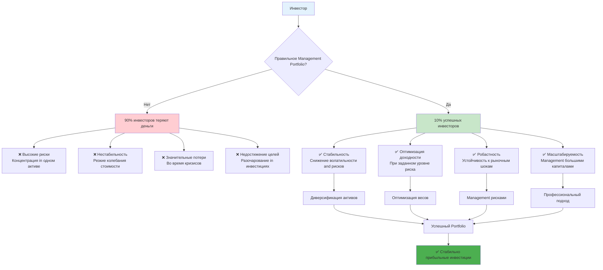
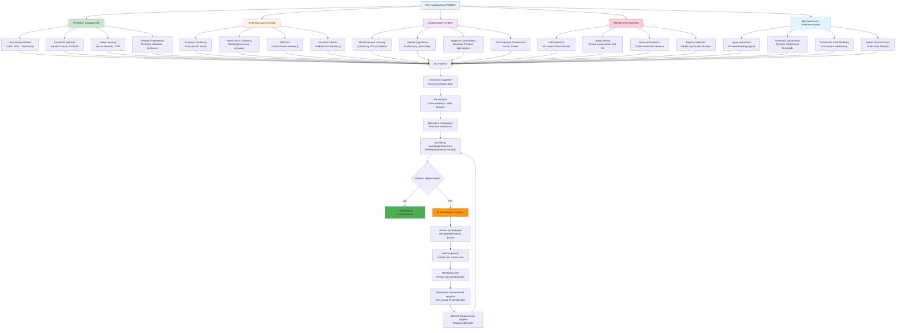
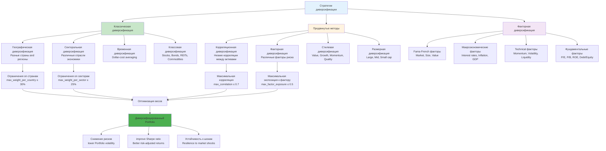
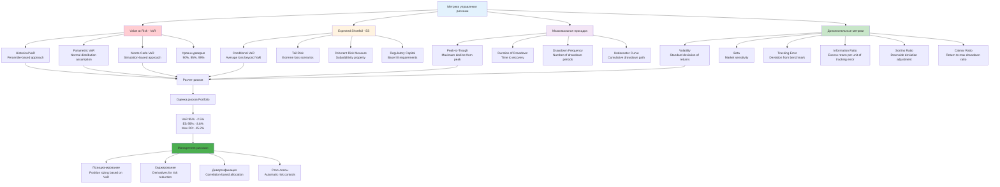
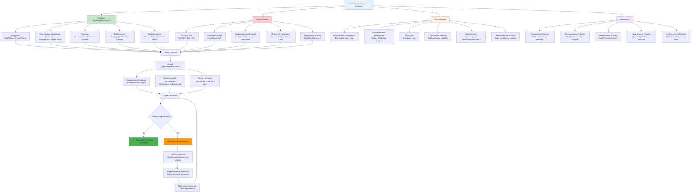

# Углубленное description методик for создания and управления Portfolio, успешные методы диверсификации

**Author:** Shcherbyna Rostyslav
**Дата:** 2024

## Why Management Portfolio - основа успешного инвестирования

### 🎯 Важность управления Portfolio for успешного инвестирования



**Почему 90% инвесторов теряют деньги?** Потому что они not понимают принципов управления Portfolio. Правильная диверсификация and Management рисками - это единственный способ создать стабильно прибыльный Portfolio.

### Что дает правильное Management Portfolio?

- **Стабильность**: Снижение волатильности and рисков
- **Доходность**: Оптимизация доходности при заданном уровне риска
- **Робастность**: Устойчивость к рыночным шокам
- **Масштабируемость**: Возможность управления большими капиталами

### Что происходит без правильного управления Portfolio?

- **Высокие риски**: Концентрация in одном активе or секторе
- **Нестабильность**: Резкие колебания стоимости Portfolio
- **Потери**: Значительные потери во время кризисов
- **Разочарование**: Недостижение инвестиционных целей

## Теоретические основы управления Portfolio

### Математические принципы

**Оптимизация Portfolio как задача оптимизации:**

```math
max w^T μ - λ/2 * w^T Σ w
subject to: w^T 1 = 1, w ≥ 0
```

Где:

- `w` - веса активов in Portfolio
- `μ` - ожидаемая доходность активов
- `Σ` - ковариационная матрица активов
- `λ` - коэффициент риска

**Критерии качества Portfolio:**

1. **Доходность**: E[R_p] = w^T μ
2. **Риск**: Var[R_p] = w^T Σ w
3. **Коэффициент Шарпа**: (E[R_p] - r_f) / √Var[R_p]
4. **VaR**: P(R_p ≤ VaR) = α

### Типы Portfolio

### 📊 Сравнение типов Portfolio

```mermaid
graph TB
 A[Типы Portfolio] --> B[Консервативное Portfolio]
 A --> C[Сбалансированное Portfolio]
 A --> D[Агрессивное Portfolio]
 A --> E[Диверсифицированное Portfolio]

 B --> B1[Низкий риск, низкая доходность<br/>Risk: 5-10%, Return: 3-6%]
 B --> B2[Облигации, депозиты<br/>Government bonds, CDs]
 B --> B3[✅ Подходит for консервативных инвесторов<br/>Пенсионеры, новички]
 B --> B4[🛡️ Защита капитала<br/>Минимальные потери]
 B --> B5[📈 Стабильный рост<br/>Предсказуемые результаты]

 C --> C1[Средний риск, средняя доходность<br/>Risk: 10-15%, Return: 6-10%]
 C --> C2[Смесь акций and облигаций<br/>60% Stocks, 40% Bonds]
 C --> C3[✅ Подходит for большинства инвесторов<br/>Средний возраст, опыт]
 C --> C4[⚖️ Баланс риска and доходности<br/>Оптимальное соотношение]
 C --> C5[🔄 Гибкость<br/>Возможность корректировки]

 D --> D1[Высокий риск, высокая доходность<br/>Risk: 15-25%, Return: 10-15%]
 D --> D2[Акции, альтернативные инвестиции<br/>Stocks, REITs, Commodities]
 D --> D3[✅ Подходит for агрессивных инвесторов<br/>Молодые, опытные]
 D --> D4[🚀 Высокий потенциал роста<br/>Максимальная доходность]
 D --> D5[⚠️ Высокая волатильность<br/>Значительные колебания]

 E --> E1[Оптимальное соотношение риск/доходность<br/>Risk: 8-12%, Return: 8-12%]
 E --> E2[Различные классы активов<br/>Stocks, Bonds, REITs, Commodities, Cash]
 E --> E3[✅ Наиболее эффективное<br/>Профессиональные инвесторы]
 E --> E4[🎯 Максимальная диверсификация<br/>Снижение корреляций]
 E --> E5[📊 Научный подход<br/>Математическая оптимизация]

 style A fill:#e3f2fd
 style B fill:#c8e6c9
 style C fill:#fff3e0
 style D fill:#ffcdd2
 style E fill:#4caf50
```



#### 1. Консервативное Portfolio

- Низкий риск, низкая доходность
- Облигации, депозиты
- Подходит for консервативных инвесторов

#### 2. Сбалансированное Portfolio

- Средний риск, средняя доходность
- Смесь акций and облигаций
- Подходит for большинства инвесторов

#### 3. Агрессивное Portfolio

- Высокий риск, высокая доходность
- Акции, альтернативные инвестиции
- Подходит for агрессивных инвесторов

#### 4. Диверсифицированное Portfolio

- Оптимальное соотношение риск/доходность
- Различные классы активов
- Наиболее эффективное

## Продвинутые методики создания Portfolio

### 1. Классические методы оптимизации

### 🔧 Методы оптимизации Portfolio

```mermaid
graph TD
 A[Методы оптимизации Portfolio] --> B[Классические методы]
 A --> C[Современные методы]
 A --> D[ML-методы]

 B --> B1[Markowitz Mean-Variance<br/>max w^T μ - λ/2 * w^T Σ w]
 B --> B2[Black-Litterman Model<br/>Incorporates market Views]
 B --> B3[Capital Asset Pricing Model<br/>CAPM framework]

 C --> C1[Risk Parity Portfolio<br/>Equal risk contribution]
 C --> C2[Minimum Variance Portfolio<br/>Minimize Portfolio variance]
 C --> C3[Maximum Sharpe Portfolio<br/>Maximize Sharpe ratio]
 C --> C4[Equal Weight Portfolio<br/>1/N allocation]

 D --> D1[Clustering-based Portfolio<br/>K-means, Hierarchical]
 D --> D2[ML-based Optimization<br/>Random Forest, Neural networks]
 D --> D3[Factor-based Portfolio<br/>Fama-French factors]
 D --> D4[Reinforcement Learning<br/>Dynamic optimization]

 B1 --> E[Целевая function<br/>Utility = Return - λ * Risk]
 B2 --> F[Включение взглядов<br/>P * μ = Q + ε]
 C1 --> G[Равный вклад in риск<br/>w_i * σ_i = constant]
 C2 --> H[Минимизация дисперсии<br/>min w^T Σ w]
 C3 --> I[Максимизация Sharpe<br/>max (μ - r_f) / σ]

 D1 --> J[Кластеризация активов<br/>Similar assets grouped]
 D2 --> K[ML предсказания<br/>Predict returns/risks]
 D3 --> L[Факторная модель<br/>R = α + β * F + ε]
 D4 --> M[Адаптивное обучение<br/>Q-learning, Policy gradient]

 E --> N[Оптимизация Portfolio]
 F --> N
 G --> N
 H --> N
 I --> N
 J --> N
 K --> N
 L --> N
 M --> N

 N --> O[Оптимальные веса<br/>w* = argmax Utility]
 O --> P[Оценка производительности<br/>Sharpe, VaR, Max DD]

 style A fill:#e3f2fd
 style B fill:#c8e6c9
 style C fill:#fff3e0
 style D fill:#f3e5f5
 style O fill:#4caf50
```

**Markowitz Mean-Variance Optimization:**

```python
def markowitz_optimization(expected_returns, cov_matrix, risk_aversion=1.0,
 target_return=None, target_volatility=None):
 """
 Оптимизация Portfolio on Markowitz

 Parameters:
 -----------
 expected_returns : array-like, shape (n_assets,)
 Ожидаемые доходности активов. Должен быть одномерный массив or List
 with ожидаемыми доходностями for каждого актива in Portfolio.
 example: [0.08, 0.12, 0.06, 0.10] for 4 активов

 cov_matrix : array-like, shape (n_assets, n_assets)
 Ковариационная матрица активов. Должна быть квадратной матрицей
 размером n_assets x n_assets, где элемент (i,j) представляет
 ковариацию между активами i and j. Матрица должна быть симметричной
 and положительно определенной.

 risk_aversion : float, default=1.0
 Коэффициент неприятия риска. Определяет баланс между доходностью
 and риском in целевой functions. Чем больше значение, тем больше
 инвестор избегает риска:
 - 0.5: Агрессивный инвестор (низкое неприятие риска)
 - 1.0: Умеренный инвестор (стандартное значение)
 - 2.0: Консервативный инвестор (высокое неприятие риска)
 - 5.0: Очень консервативный инвестор

 target_return : float, optional, default=None
 Целевая доходность Portfolio. if specifiedа, оптимизация будет
 искать Portfolio with минимальным риском при заданной доходности.
 Должна быть in том же формате, что and expected_returns (например, 0.10 for 10%).
 Если None, оптимизируется on критерию максимизации полезности.

 target_volatility : float, optional, default=None
 Целевая волатильность Portfolio. if specifiedа, оптимизация будет
 искать Portfolio with максимальной доходностью при заданной волатильности.
 Должна быть in том же формате, что and expected_returns (например, 0.15 for 15%).
 Если None, оптимизируется on критерию максимизации полезности.

 Returns:
 --------
 array-like, shape (n_assets,)
 Оптимальные веса активов in Portfolio. Сумма весов равна 1.0.
 Каждый элемент представляет долю капитала, инвестированного in соответствующий актив.

 Raises:
 -------
 ValueError
 Если оптимизация not удалась (например, несовместимые ограничения)

 Notes:
 ------
 Целевая function: max w^T * μ - (λ/2) * w^T * Σ * w
 где w - веса, μ - ожидаемые доходности, Σ - ковариационная матрица, λ - risk_aversion

 Ограничения:
 - Сумма весов = 1 (полное инвестирование)
 - Веса >= 0 (запрет коротких продаж)
 - Дополнительные ограничения on доходность or волатильность (if specifiedы)
 """
 from scipy.optimize import minimize

 n_assets = len(expected_returns)

 # Ограничения
 constraints = [{'type': 'eq', 'fun': lambda w: np.sum(w) - 1}] # Сумма весов = 1

 if target_return is not None:
 constraints.append({
 'type': 'eq',
 'fun': lambda w: np.dot(w, expected_returns) - target_return
 })

 if target_volatility is not None:
 constraints.append({
 'type': 'eq',
 'fun': lambda w: np.sqrt(np.dot(w, np.dot(cov_matrix, w))) - target_volatility
 })

 # Границы
 bounds = [(0, 1) for _ in range(n_assets)] # Веса from 0 to 1

 # Целевая function
 def objective(w):
 Portfolio_return = np.dot(w, expected_returns)
 Portfolio_variance = np.dot(w, np.dot(cov_matrix, w))
 return -Portfolio_return + risk_aversion * Portfolio_variance

 # Начальные веса
 x0 = np.ones(n_assets) / n_assets

 # Оптимизация
 result = minimize(objective, x0, method='SLSQP', bounds=bounds, constraints=constraints)

 if result.success:
 return result.x
 else:
 raise ValueError("Optimization failed")

# example использования
weights = markowitz_optimization(expected_returns, cov_matrix, risk_aversion=1.0)
```

**Black-Litterman Model:**

```python
def black_litterman_optimization(market_caps, cov_matrix, risk_aversion=3.0,
 Views=None, View_confidences=None):
 """
 Оптимизация Portfolio on модели Black-Litterman

 Модель Black-Litterman объединяет рыночные веса with субъективными взглядами
 инвестора for получения более стабильных and интуитивных весов Portfolio.

 Parameters:
 -----------
 market_caps : array-like, shape (n_assets,)
 Рыночные капитализации активов. Используются for расчета рыночных весов
 как отправной точки оптимизации. Должен быть одномерный массив or List
 with рыночными капитализациями for каждого актива.
 example: [1000000, 2000000, 500000, 1500000] for 4 активов

 cov_matrix : array-like, shape (n_assets, n_assets)
 Ковариационная матрица активов. Должна быть квадратной матрицей
 размером n_assets x n_assets, где элемент (i,j) представляет
 ковариацию между активами i and j. Матрица должна быть симметричной
 and положительно определенной.

 risk_aversion : float, default=3.0
 Коэффициент неприятия риска рынка. Обычно принимает значения from 1.0 to 5.0.
 Чем больше значение, тем больше рынок избегает риска:
 - 1.0-2.0: Низкое неприятие риска (агрессивный рынок)
 - 3.0: Стандартное значение for развитых рынков
 - 4.0-5.0: Высокое неприятие риска (консервативный рынок)

 Views : List of tuples, optional, default=None
 Субъективные взгляды инвестора on активы. Каждый взгляд представлен
 кортежем (P, Q), где P - вектор активов, Q - ожидаемая доходность.
 Формат: [(P1, Q1), (P2, Q2), ...]
 example: [([1, 0, 0, 0], 0.12), ([0, 1, -1, 0], 0.05)]
 - Первый взгляд: актив 1 будет иметь доходность 12%
 - Второй взгляд: актив 2 будет on 5% лучше актива 3
 Если None, используется только рыночная модель.

 View_confidences : array-like, optional, default=None
 Уверенность in каждом взгляде. Должен быть одномерный массив
 with тем же количеством элементов, что and Views. Значения должны быть
 положительными (чем больше, тем выше уверенность):
 - 0.1: Низкая уверенность (слабый взгляд)
 - 0.5: Средняя уверенность
 - 1.0: Высокая уверенность (сильный взгляд)
 Если None, используется значение 0.1 for all взглядов.

 Returns:
 --------
 tuple
 (weights, expected_returns, Portfolio_cov)

 weights : array-like, shape (n_assets,)
 Оптимальные веса активов in Portfolio. Сумма весов равна 1.0.

 expected_returns : array-like, shape (n_assets,)
 Ожидаемые доходности активов with учетом взглядов инвестора.

 Portfolio_cov : array-like, shape (n_assets, n_assets)
 Ковариационная матрица Portfolio with учетом взглядов.

 Raises:
 -------
 ValueError
 Если размеры входных данных not совпадают or оптимизация not удалась

 Notes:
 ------
 Модель Black-Litterman решает проблему нестабильности классической
 оптимизации Markowitz путем:
 1. Использования рыночных весов как отправной точки
 2. Включения субъективных взглядов инвестора
 3. Балансирования между рыночными данными and взглядами

 Формула ожидаемых доходностей:
 E[R] = [(τΣ)^(-1) + P^T * Ω^(-1) * P]^(-1) * [(τΣ)^(-1) * Π + P^T * Ω^(-1) * Q]
 где τ - масштабирующий parameter, Ω - матрица уверенности во взглядах
 """
 n_assets = len(market_caps)

 # Рыночные веса
 market_weights = market_caps / np.sum(market_caps)

 # Ожидаемая доходность рынка
 market_return = risk_aversion * np.dot(cov_matrix, market_weights)

 if Views is not None:
 # Матрица взглядов
 P = np.array(Views)
 n_Views = len(Views)

 # Уверенность во взглядах
 if View_confidences is None:
 View_confidences = np.ones(n_Views) * 0.1

 # Матрица ковариации взглядов
 Omega = np.diag(View_confidences)

 # Ожидаемые доходности взглядов
 Q = np.array([View[1] for View in Views])

 # Black-Litterman формулы
 tau = 1.0 # Масштабирующий parameter
 M1 = np.linalg.inv(tau * cov_matrix)
 M2 = np.dot(P.T, np.dot(np.linalg.inv(Omega), P))
 M3 = np.dot(P.T, np.dot(np.linalg.inv(Omega), Q))

 # Ожидаемые доходности
 expected_returns = np.dot(np.linalg.inv(M1 + M2),
 np.dot(M1, market_return) + M3)

 # Ковариационная матрица
 Portfolio_cov = np.linalg.inv(M1 + M2)
 else:
 expected_returns = market_return
 Portfolio_cov = cov_matrix

 # Оптимизация Markowitz
 weights = markowitz_optimization(expected_returns, Portfolio_cov, risk_aversion)

 return weights, expected_returns, Portfolio_cov

# example использования
weights, expected_returns, Portfolio_cov = black_litterman_optimization(
 market_caps, cov_matrix, risk_aversion=3.0, Views=Views
)
```

### 2. Современные методы оптимизации

**Risk Parity Portfolio:**

```python
def risk_parity_optimization(cov_matrix, target_risk=None):
 """
 Оптимизация Portfolio with равным вкладом in риск (Risk Parity)

 Risk Parity - это метод оптимизации Portfolio, при котором каждый актив
 вносит равный вклад in общий риск Portfolio. Это приводит к более
 сбалансированному распределению риска между активами.

 Parameters:
 -----------
 cov_matrix : array-like, shape (n_assets, n_assets)
 Ковариационная матрица активов. Должна быть квадратной матрицей
 размером n_assets x n_assets, где элемент (i,j) представляет
 ковариацию между активами i and j. Матрица должна быть симметричной
 and положительно определенной.

 target_risk : float, optional, default=None
 Целевой уровень риска Portfolio. if specified, Portfolio будет
 оптимизировано for достижения этого уровня риска при равном
 распределении вклада in риск между активами.
 - None: Оптимизация без ограничения on общий риск
 - 0.10: Целевой риск 10% (стандартное отклонение)
 - 0.15: Целевой риск 15%
 - 0.20: Целевой риск 20%

 Returns:
 --------
 array-like, shape (n_assets,)
 Оптимальные веса активов in Portfolio. Сумма весов равна 1.0.
 Каждый актив вносит равный вклад in общий риск Portfolio.

 Raises:
 -------
 ValueError
 Если оптимизация not удалась or ковариационная матрица некорректна

 Notes:
 ------
 Risk Parity решает задачу:
 min Σᵢ Σⱼ (wᵢ * σᵢ - wⱼ * σⱼ)²
 subject to: Σᵢ wᵢ = 1, wᵢ ≥ 0

 где wᵢ - вес актива i, σᵢ - волатильность актива i

 Преимущества Risk Parity:
 1. Более стабильные веса on сравнению with Markowitz
 2. Лучшая диверсификация риска
 3. Меньшая чувствительность к ошибкам in оценке параметров
 4. Более интуитивное распределение риска

 Недостатки:
 1. Может not максимизировать доходность
 2. Может быть неоптимальным for инвесторов with разными предпочтениями
 """
 from scipy.optimize import minimize

 n_assets = len(cov_matrix)

 # Целевая function - минимизация суммы квадратов разностей рисков
 def objective(w):
 Portfolio_variance = np.dot(w, np.dot(cov_matrix, w))
 individual_risks = np.sqrt(np.diag(cov_matrix))
 target_risks = w * individual_risks

 # Нормализация
 if target_risk is not None:
 target_risks = target_risks / np.sum(target_risks) * target_risk

 return np.sum((target_risks - target_risks.mean()) ** 2)

 # Ограничения
 constraints = [{'type': 'eq', 'fun': lambda w: np.sum(w) - 1}]
 bounds = [(0, 1) for _ in range(n_assets)]

 # Начальные веса
 x0 = np.ones(n_assets) / n_assets

 # Оптимизация
 result = minimize(objective, x0, method='SLSQP', bounds=bounds, constraints=constraints)

 if result.success:
 return result.x
 else:
 raise ValueError("Optimization failed")

# example использования
weights = risk_parity_optimization(cov_matrix, target_risk=0.1)
```

**Minimum Variance Portfolio:**

```python
def minimum_variance_optimization(cov_matrix):
 """
 Оптимизация Portfolio with минимальной дисперсией (Minimum Variance Portfolio)

 Minimum Variance Portfolio - это Portfolio with наименьшей возможной
 дисперсией (риском) среди all возможных Portfolio. Это консервативный
 подход, который минимизирует волатильность Portfolio.

 Parameters:
 -----------
 cov_matrix : array-like, shape (n_assets, n_assets)
 Ковариационная матрица активов. Должна быть квадратной матрицей
 размером n_assets x n_assets, где элемент (i,j) представляет
 ковариацию между активами i and j. Матрица должна быть симметричной
 and положительно определенной.

 Returns:
 --------
 array-like, shape (n_assets,)
 Оптимальные веса активов in Portfolio with минимальной дисперсией.
 Сумма весов равна 1.0.

 Raises:
 -------
 ValueError
 Если оптимизация not удалась or ковариационная матрица некорректна

 Notes:
 ------
 Minimum Variance Portfolio решает задачу:
 min w^T * Σ * w
 subject to: Σᵢ wᵢ = 1, wᵢ ≥ 0

 где w - веса активов, Σ - ковариационная матрица

 Аналитическое решение:
 w* = (Σ^(-1) * 1) / (1^T * Σ^(-1) * 1)

 где 1 - вектор из единиц

 Преимущества:
 1. Минимальный риск среди all возможных Portfolio
 2. Простота расчета and интерпретации
 3. Стабильность весов
 4. Подходит for консервативных инвесторов

 Недостатки:
 1. Может иметь низкую доходность
 2. not учитывает ожидаемые доходности
 3. Может быть неоптимальным for инвесторов with другими предпочтениями
 4. Чувствительность к ошибкам in оценке ковариационной матрицы
 """
 from scipy.optimize import minimize

 n_assets = len(cov_matrix)

 # Целевая function - минимизация дисперсии
 def objective(w):
 return np.dot(w, np.dot(cov_matrix, w))

 # Ограничения
 constraints = [{'type': 'eq', 'fun': lambda w: np.sum(w) - 1}]
 bounds = [(0, 1) for _ in range(n_assets)]

 # Начальные веса
 x0 = np.ones(n_assets) / n_assets

 # Оптимизация
 result = minimize(objective, x0, method='SLSQP', bounds=bounds, constraints=constraints)

 if result.success:
 return result.x
 else:
 raise ValueError("Optimization failed")

# example использования
weights = minimum_variance_optimization(cov_matrix)
```

**Maximum Sharpe Portfolio:**

```python
def maximum_sharpe_optimization(expected_returns, cov_matrix, risk_free_rate=0.02):
 """
 Оптимизация Portfolio with максимальным коэффициентом Шарпа

 Maximum Sharpe Portfolio - это Portfolio, которое максимизирует
 коэффициент Шарпа (отношение избыточной доходности к риску).
 Это оптимальный Portfolio for инвесторов, которые хотят максимизировать
 доходность on единицу риска.

 Parameters:
 -----------
 expected_returns : array-like, shape (n_assets,)
 Ожидаемые доходности активов. Должен быть одномерный массив or List
 with ожидаемыми доходностями for каждого актива in Portfolio.
 example: [0.08, 0.12, 0.06, 0.10] for 4 активов

 cov_matrix : array-like, shape (n_assets, n_assets)
 Ковариационная матрица активов. Должна быть квадратной матрицей
 размером n_assets x n_assets, где элемент (i,j) представляет
 ковариацию между активами i and j. Матрица должна быть симметричной
 and положительно определенной.

 risk_free_rate : float, default=0.02
 Безрисковая процентная ставка. Используется for расчета избыточной
 доходности in коэффициенте Шарпа. Обычно принимает значения:
 - 0.01: 1% (очень низкая ставка)
 - 0.02: 2% (стандартное значение for развитых рынков)
 - 0.03: 3% (умеренная ставка)
 - 0.05: 5% (высокая ставка)

 Returns:
 --------
 array-like, shape (n_assets,)
 Оптимальные веса активов in Portfolio with максимальным коэффициентом Шарпа.
 Сумма весов равна 1.0.

 Raises:
 -------
 ValueError
 Если оптимизация not удалась or входные data некорректны

 Notes:
 ------
 Maximum Sharpe Portfolio решает задачу:
 max (w^T * μ - r_f) / √(w^T * Σ * w)
 subject to: Σᵢ wᵢ = 1, wᵢ ≥ 0

 где w - веса активов, μ - ожидаемые доходности, Σ - ковариационная матрица,
 r_f - безрисковая ставка

 Коэффициент Шарпа:
 Sharpe = (E[R_p] - r_f) / σ_p

 где E[R_p] - ожидаемая доходность Portfolio, σ_p - волатильность Portfolio

 Преимущества:
 1. Максимизирует доходность on единицу риска
 2. Учитывает как доходность, так and риск
 3. Широко используется in практике
 4. Интуитивно понятный показатель

 Недостатки:
 1. Чувствительность к ошибкам in оценке параметров
 2. Предполагает нормальное распределение доходностей
 3. not учитывает асимметрию and эксцесс распределения
 4. Может быть нестабильным при изменении параметров
 """
 from scipy.optimize import minimize

 n_assets = len(expected_returns)

 # Целевая function - максимизация коэффициента Шарпа
 def objective(w):
 Portfolio_return = np.dot(w, expected_returns)
 Portfolio_variance = np.dot(w, np.dot(cov_matrix, w))
 sharpe = (Portfolio_return - risk_free_rate) / np.sqrt(Portfolio_variance)
 return -sharpe # Минимизируем отрицательный Sharpe

 # Ограничения
 constraints = [{'type': 'eq', 'fun': lambda w: np.sum(w) - 1}]
 bounds = [(0, 1) for _ in range(n_assets)]

 # Начальные веса
 x0 = np.ones(n_assets) / n_assets

 # Оптимизация
 result = minimize(objective, x0, method='SLSQP', bounds=bounds, constraints=constraints)

 if result.success:
 return result.x
 else:
 raise ValueError("Optimization failed")

# example использования
weights = maximum_sharpe_optimization(expected_returns, cov_matrix, risk_free_rate=0.02)
```

### 3. Машинное обучение in управлении Portfolio

### 🤖 integration машинного обучения in Management Portfolio



**Clustering-based Portfolio:**

```python
def clustering_Portfolio_optimization(returns, n_clusters=5, method='kmeans'):
 """
 Оптимизация Portfolio on basis кластеризации активов

 Этот метод группирует активы in кластеры on basis их доходностей,
 а затем создает оптимизированные Portfolio for каждого кластера.
 Это позволяет лучше диверсифицировать Portfolio and учитывать
 сходство между активами.

 Parameters:
 -----------
 returns : pandas.dataFrame, shape (n_periods, n_assets)
 Матрица доходностей активов. Строки представляют временные периоды,
 столбцы - активы. data должны быть in формате pandas dataFrame
 with indexами дат and названиями активов in столбцах.
 example: dataFrame with indexами дат and столбцами ['AAPL', 'GOOGL', 'MSFT', 'TSLA']

 n_clusters : int, default=5
 Количество кластеров for группировки активов. Рекомендуемые значения:
 - 3-5: for небольшого Portfolio (10-20 активов)
 - 5-8: for среднего Portfolio (20-50 активов)
 - 8-12: for большого Portfolio (50+ активов)
 - Слишком мало кластеров: может not учесть различия между активами
 - Слишком много кластеров: может привести к переобучению

 method : str, default='kmeans'
 Метод кластеризации for группировки активов. Доступные варианты:
 - 'kmeans': K-means кластеризация (быстрая, подходит for сферических кластеров)
 - 'hierarchical': Иерархическая кластеризация (медленная, подходит for кластеров любой формы)

 Returns:
 --------
 dict
 Словарь with информацией о кластерах and их весах. Ключи - ID кластера,
 значения - словари with ключами:
 - 'weights': array-like, shape (n_assets_in_cluster,)
 Оптимальные веса активов in кластере
 - 'assets': List
 List названий активов in кластере

 Raises:
 -------
 ValueError
 Если метод кластеризации неизвестен or data некорректны

 Notes:
 ------
 Алгоритм работы:
 1. Нормализация данных доходностей
 2. Кластеризация активов on доходностям
 3. for каждого кластера:
 - Расчет ковариационной матрицы
 - Оптимизация весов (минимальная дисперсия)
 - Нормализация весов
 4. Возврат весов for каждого кластера

 Преимущества:
 1. Учитывает сходство между активами
 2. Лучшая диверсификация
 3. Снижение корреляций внутри кластеров
 4. Более стабильные веса

 Недостатки:
 1. dependency from выбора количества кластеров
 2. Чувствительность к выбросам
 3. Может not Workingть for малого количества активов
 """
 from sklearn.cluster import KMeans, AgglomerativeClustering
 from sklearn.preprocessing import StandardScaler

 # Нормализация данных
 scaler = StandardScaler()
 returns_scaled = scaler.fit_transform(returns)

 # Кластеризация
 if method == 'kmeans':
 clusterer = KMeans(n_clusters=n_clusters, random_state=42)
 elif method == 'hierarchical':
 clusterer = AgglomerativeClustering(n_clusters=n_clusters)
 else:
 raise ValueError(f"Unknown clustering method: {method}")

 clusters = clusterer.fit_predict(returns_scaled)

 # create Portfolio for каждого кластера
 Portfolio_weights = {}

 for cluster_id in range(n_clusters):
 cluster_returns = returns[clusters == cluster_id]

 if len(cluster_returns) > 1:
 # Оптимизация внутри кластера
 cluster_cov = np.cov(cluster_returns.T)
 cluster_expected_returns = np.mean(cluster_returns, axis=0)

 # Минимальная дисперсия внутри кластера
 cluster_weights = minimum_variance_optimization(cluster_cov)

 # Нормализация весов
 cluster_weights = cluster_weights / np.sum(cluster_weights)

 Portfolio_weights[cluster_id] = {
 'weights': cluster_weights,
 'assets': cluster_returns.columns[clusters == cluster_id].toList()
 }

 return Portfolio_weights

# example использования
clustering_Portfolio = clustering_Portfolio_optimization(returns, n_clusters=5, method='kmeans')
```

**ML-based Portfolio Optimization:**

```python
def ml_Portfolio_optimization(returns, features, model, n_Portfolios=1000):
 """
 Оптимизация Portfolio with использованием машинного обучения

 Этот метод использует ML-модели for предсказания доходностей активов,
 а затем создает множество Portfolio and выбирает лучший on коэффициенту Шарпа.
 Это позволяет учитывать сложные нелинейные dependencies in данных.

 Parameters:
 -----------
 returns : pandas.dataFrame, shape (n_periods, n_assets)
 Матрица доходностей активов. Строки представляют временные периоды,
 столбцы - активы. data должны быть in формате pandas dataFrame
 with indexами дат and названиями активов in столбцах.
 example: dataFrame with indexами дат and столбцами ['AAPL', 'GOOGL', 'MSFT', 'TSLA']

 features : pandas.dataFrame, shape (n_periods, n_features)
 Матрица признаков for ML-модели. Строки представляют временные периоды,
 столбцы - признаки. Может включать Technical индикаторы,
 макроэкономические data, новостные data and т.д.
 example: dataFrame with приsignми ['RSI', 'MACD', 'Volume', 'GDP_growth']

 model : sklearn-compatible model
 Обученная ML-модель for предсказания доходностей. Должна иметь методы
 fit() and predict(). Рекомендуемые модели:
 - RandomForestRegressor: Хорошо Workingет with нелинейными зависимостями
 - XGBRegressor: Высокая производительность, устойчивость к переобучению
 - LinearRegression: Простая and быстрая модель
 - LSTM/GRU: for временных рядов (требует специальной подготовки данных)

 n_Portfolios : int, default=1000
 Количество Portfolio for генерации and оценки. Рекомендуемые значения:
 - 100-500: Быстрый анализ, низкая точность
 - 1000: Стандартное значение, хороший баланс скорости and точности
 - 5000-10000: Высокая точность, медленный анализ
 - Больше Portfolio: лучше покрытие пространства решений

 Returns:
 --------
 tuple
 (best_Portfolio, all_Portfolios)

 best_Portfolio : dict
 Лучший Portfolio on коэффициенту Шарпа with ключами:
 - 'weights': array-like, shape (n_assets,)
 Оптимальные веса активов
 - 'return': float
 Ожидаемая доходность Portfolio
 - 'variance': float
 Дисперсия Portfolio
 - 'sharpe': float
 Коэффициент Шарпа Portfolio

 all_Portfolios : List
 List all сгенерированных Portfolio with теми же ключами,
 что and best_Portfolio

 Raises:
 -------
 ValueError
 Если размеры данных not совпадают or модель некорректна

 Notes:
 ------
 Алгоритм работы:
 1. Разделение данных on train/test (80/20)
 2. Обучение ML-модели on исторических данных
 3. Prediction доходностей on testsых данных
 4. Генерация n_Portfolios случайных весов
 5. Расчет метрик for каждого Portfolio
 6. Выбор Portfolio with максимальным коэффициентом Шарпа

 Преимущества:
 1. Учитывает сложные нелинейные dependencies
 2. Использует множество признаков
 3. Адаптируется к изменяющимся условиям рынка
 4. Может учитывать качественные факторы

 Недостатки:
 1. Требует качественных данных and признаков
 2. Может переобучаться on исторических данных
 3. Сложность интерпретации результатов
 4. dependency from выбора модели and параметров
 """
 from sklearn.ensemble import RandomForestRegressor
 from sklearn.model_selection import train_test_split

 # Подготовка данных
 X = features
 y = returns

 # Разделение on train/test
 X_train, X_test, y_train, y_test = train_test_split(X, y, test_size=0.2, random_state=42)

 # Обучение модели
 model.fit(X_train, y_train)

 # Предсказания
 Predictions = model.predict(X_test)

 # create множества Portfolio
 Portfolios = []

 for i in range(n_Portfolios):
 # Случайные веса
 weights = np.random.dirichlet(np.ones(len(returns.columns)))

 # Ожидаемая доходность Portfolio
 Portfolio_return = np.dot(weights, Predictions.mean(axis=0))

 # Риск Portfolio
 Portfolio_variance = np.dot(weights, np.dot(Predictions.cov(), weights))

 # Коэффициент Шарпа
 sharpe = Portfolio_return / np.sqrt(Portfolio_variance)

 Portfolios.append({
 'weights': weights,
 'return': Portfolio_return,
 'variance': Portfolio_variance,
 'sharpe': sharpe
 })

 # Выбор лучшего Portfolio
 best_Portfolio = max(Portfolios, key=lambda x: x['sharpe'])

 return best_Portfolio, Portfolios

# example использования
best_Portfolio, all_Portfolios = ml_Portfolio_optimization(returns, features, model)
```

## Методы диверсификации

### 🌐 Стратегии диверсификации Portfolio



### 1. Классическая диверсификация

**Географическая диверсификация:**

```python
def geographic_diversification(returns_by_country, max_weight_per_country=0.3):
 """
 Географическая диверсификация Portfolio

 Этот метод оптимизирует Portfolio with учетом географического распределения
 активов, ограничивая максимальный вес on каждую страну. Это помогает
 снизить страновые риски and улучшить диверсификацию.

 Parameters:
 -----------
 returns_by_country : dict
 Словарь with доходностями on странам. Ключи - названия стран,
 значения - pandas.Series with доходностями активов in этой стране.
 Формат: {'USA': returns_usa, 'EU': returns_eu, 'Asia': returns_asia}
 где returns_usa - Series with доходностями американских активов

 max_weight_per_country : float, default=0.3
 Максимальный вес on одну страну in Portfolio. Рекомендуемые значения:
 - 0.2: Высокая диверсификация (максимум 20% on страну)
 - 0.3: Стандартная диверсификация (максимум 30% on страну)
 - 0.4: Умеренная диверсификация (максимум 40% on страну)
 - 0.5: Низкая диверсификация (максимум 50% on страну)
 - Значение должно быть in диапазоне (0, 1]

 Returns:
 --------
 array-like, shape (n_countries,)
 Оптимальные веса стран in Portfolio. Сумма весов равна 1.0.
 Каждый элемент представляет долю капитала, инвестированного
 in активы соответствующей страны.

 Raises:
 -------
 ValueError
 Если оптимизация not удалась or parameters некорректны

 Notes:
 ------
 Алгоритм работы:
 1. Расчет ожидаемых доходностей on странам
 2. Расчет ковариационной матрицы между странами
 3. Оптимизация with ограничениями on максимальный вес on страну
 4. Возврат оптимальных весов стран

 Преимущества:
 1. Снижение страновых рисков
 2. improve диверсификации
 3. Учет региональных особенностей
 4. Защита from локальных кризисов

 Недостатки:
 1. Может ограничивать доходность
 2. not учитывает корреляции между странами
 3. Требует качественных данных on странам
 4. Может быть неоптимальным for глобальных активов
 """
 n_countries = len(returns_by_country)

 # Ограничения on странам
 constraints = []
 bounds = []

 for i in range(n_countries):
 # Максимальный вес on страну
 constraints.append({
 'type': 'ineq',
 'fun': lambda w, i=i: max_weight_per_country - w[i]
 })
 bounds.append((0, max_weight_per_country))

 # Сумма весов = 1
 constraints.append({'type': 'eq', 'fun': lambda w: np.sum(w) - 1})

 # Ожидаемые доходности on странам
 expected_returns = np.array([returns.mean() for returns in returns_by_country.values()])

 # Ковариационная матрица
 cov_matrix = np.cov([returns for returns in returns_by_country.values()])

 # Оптимизация
 from scipy.optimize import minimize

 def objective(w):
 Portfolio_return = np.dot(w, expected_returns)
 Portfolio_variance = np.dot(w, np.dot(cov_matrix, w))
 return -Portfolio_return + 0.5 * Portfolio_variance

 x0 = np.ones(n_countries) / n_countries

 result = minimize(objective, x0, method='SLSQP', bounds=bounds, constraints=constraints)

 if result.success:
 return result.x
 else:
 raise ValueError("Optimization failed")

# example использования
country_weights = geographic_diversification(returns_by_country, max_weight_per_country=0.3)
```

**Секторальная диверсификация:**

```python
def sectoral_diversification(returns_by_sector, max_weight_per_sector=0.25):
 """Секторальная диверсификация Portfolio"""
 n_sectors = len(returns_by_sector)

 # Ограничения on секторам
 constraints = []
 bounds = []

 for i in range(n_sectors):
 # Максимальный вес on сектор
 constraints.append({
 'type': 'ineq',
 'fun': lambda w, i=i: max_weight_per_sector - w[i]
 })
 bounds.append((0, max_weight_per_sector))

 # Сумма весов = 1
 constraints.append({'type': 'eq', 'fun': lambda w: np.sum(w) - 1})

 # Ожидаемые доходности on секторам
 expected_returns = np.array([returns.mean() for returns in returns_by_sector.values()])

 # Ковариационная матрица
 cov_matrix = np.cov([returns for returns in returns_by_sector.values()])

 # Оптимизация
 from scipy.optimize import minimize

 def objective(w):
 Portfolio_return = np.dot(w, expected_returns)
 Portfolio_variance = np.dot(w, np.dot(cov_matrix, w))
 return -Portfolio_return + 0.5 * Portfolio_variance

 x0 = np.ones(n_sectors) / n_sectors

 result = minimize(objective, x0, method='SLSQP', bounds=bounds, constraints=constraints)

 if result.success:
 return result.x
 else:
 raise ValueError("Optimization failed")

# example использования
sector_weights = sectoral_diversification(returns_by_sector, max_weight_per_sector=0.25)
```

### 2. Продвинутые методы диверсификации

**Factor-based Diversification:**

```python
def factor_diversification(returns, factors, max_factor_exposure=0.5):
 """Диверсификация on basis факторов"""
 from sklearn.linear_model import LinearRegression

 n_assets = len(returns.columns)
 n_factors = len(factors.columns)

 # Регрессия доходностей on факторы
 factor_Loadings = np.zeros((n_assets, n_factors))

 for i, asset in enumerate(returns.columns):
 model = LinearRegression()
 model.fit(factors, returns[asset])
 factor_Loadings[i] = model.coef_

 # Ограничения on факторам
 constraints = []
 bounds = [(0, 1) for _ in range(n_assets)]

 for j in range(n_factors):
 # Максимальная экспозиция к фактору
 constraints.append({
 'type': 'ineq',
 'fun': lambda w, j=j: max_factor_exposure - np.dot(w, factor_Loadings[:, j])
 })
 constraints.append({
 'type': 'ineq',
 'fun': lambda w, j=j: max_factor_exposure + np.dot(w, factor_Loadings[:, j])
 })

 # Сумма весов = 1
 constraints.append({'type': 'eq', 'fun': lambda w: np.sum(w) - 1})

 # Ожидаемые доходности
 expected_returns = returns.mean().values

 # Ковариационная матрица
 cov_matrix = returns.cov().values

 # Оптимизация
 from scipy.optimize import minimize

 def objective(w):
 Portfolio_return = np.dot(w, expected_returns)
 Portfolio_variance = np.dot(w, np.dot(cov_matrix, w))
 return -Portfolio_return + 0.5 * Portfolio_variance

 x0 = np.ones(n_assets) / n_assets

 result = minimize(objective, x0, method='SLSQP', bounds=bounds, constraints=constraints)

 if result.success:
 return result.x
 else:
 raise ValueError("Optimization failed")

# example использования
factor_weights = factor_diversification(returns, factors, max_factor_exposure=0.5)
```

**Correlation-based Diversification:**

```python
def correlation_diversification(returns, max_correlation=0.7):
 """Диверсификация on basis корреляций"""
 # Корреляционная матрица
 corr_matrix = returns.corr()

 # Поиск активов with низкой корреляцией
 selected_assets = []
 remaining_assets = List(returns.columns)

 # Выбор первого актива
 first_asset = remaining_assets[0]
 selected_assets.append(first_asset)
 remaining_assets.remove(first_asset)

 # Выбор остальных активов
 while remaining_assets:
 best_asset = None
 best_score = -1

 for asset in remaining_assets:
 # Средняя корреляция with уже выбранными активами
 avg_correlation = corr_matrix.loc[asset, selected_assets].mean()

 # Оценка диверсификации
 diversification_score = 1 - avg_correlation

 if diversification_score > best_score:
 best_score = diversification_score
 best_asset = asset

 if best_asset and best_score > (1 - max_correlation):
 selected_assets.append(best_asset)
 remaining_assets.remove(best_asset)
 else:
 break

 # Оптимизация весов for выбранных активов
 selected_returns = returns[selected_assets]
 expected_returns = selected_returns.mean().values
 cov_matrix = selected_returns.cov().values

 # Равные веса
 weights = np.ones(len(selected_assets)) / len(selected_assets)

 return weights, selected_assets

# example использования
weights, selected_assets = correlation_diversification(returns, max_correlation=0.7)
```

## Management рисками Portfolio

### ⚠️ Метрики управления рисками Portfolio



### 1. Value at Risk (VaR)

**Historical VaR:**

```python
def historical_var(returns, confidence_level=0.95):
 """
 Расчет исторического Value at Risk (VaR)

 Historical VaR - это метод расчета VaR, основанный on исторических
 данных доходностей. Он not делает предположений о распределении
 доходностей and использует эмпирические квантили.

 Parameters:
 -----------
 returns : array-like, shape (n_periods,)
 Массив доходностей Portfolio or актива. Может быть pandas.Series
 or numpy.array. data должны быть in формате доходностей
 (например, 0.05 for 5% доходности).

 confidence_level : float, default=0.95
 Уровень доверия for расчета VaR. Определяет, какой процент
 наихудших сценариев исключается из Analysis. Рекомендуемые значения:
 - 0.90: 90% уровень доверия (исключается 10% наихудших сценариев)
 - 0.95: 95% уровень доверия (стандартное значение)
 - 0.99: 99% уровень доверия (исключается 1% наихудших сценариев)
 - 0.999: 99.9% уровень доверия (исключается 0.1% наихудших сценариев)
 - Значение должно быть in диапазоне (0, 1)

 Returns:
 --------
 float
 Value at Risk on заданном уровне доверия. Отрицательное значение,
 представляющее максимальный ожидаемый убыток with заданной вероятностью.
 Например, если VaR = -0.05, то with вероятностью confidence_level
 убыток not превысит 5%.

 Raises:
 -------
 ValueError
 Если confidence_level not in диапазоне (0, 1) or data пусты

 Notes:
 ------
 Формула расчета:
 VaR = percentile(returns, (1 - confidence_level) * 100)

 где percentile - эмпирический квантиль

 Преимущества:
 1. not требует предположений о распределении
 2. Учитывает реальные исторические data
 3. Простота расчета and интерпретации
 4. Устойчивость к выбросам

 Недостатки:
 1. dependency from исторических данных
 2. not учитывает изменения волатильности
 3. Может быть неточным for редких событий
 4. Требует достаточно длинной истории данных
 """
 # Сортировка доходностей
 sorted_returns = np.sort(returns)

 # index for VaR
 var_index = int((1 - confidence_level) * len(sorted_returns))

 # VaR
 var = sorted_returns[var_index]

 return var

# example использования
var_95 = historical_var(Portfolio_returns, confidence_level=0.95)
```

**Parametric VaR:**

```python
def parametric_var(returns, confidence_level=0.95):
 """Параметрический VaR"""
 from scipy import stats

 # parameters нормального распределения
 mean_return = returns.mean()
 std_return = returns.std()

 # Z-score for заданного уровня доверия
 z_score = stats.norm.ppf(1 - confidence_level)

 # VaR
 var = mean_return + z_score * std_return

 return var

# example использования
var_95 = parametric_var(Portfolio_returns, confidence_level=0.95)
```

**Monte Carlo VaR:**

```python
def monte_carlo_var(returns, confidence_level=0.95, n_simulations=10000):
 """Monte Carlo VaR"""
 # parameters распределения
 mean_return = returns.mean()
 std_return = returns.std()

 # Симуляции
 simulations = np.random.normal(mean_return, std_return, n_simulations)

 # VaR
 var = np.percentile(simulations, (1 - confidence_level) * 100)

 return var

# example использования
var_95 = monte_carlo_var(Portfolio_returns, confidence_level=0.95, n_simulations=10000)
```

### 2. Expected Shortfall (ES)

```python
def expected_shortfall(returns, confidence_level=0.95):
 """Expected Shortfall (Conditional VaR)"""
 # VaR
 var = historical_var(returns, confidence_level)

 # Ожидаемый убыток при превышении VaR
 es = returns[returns <= var].mean()

 return es

# example использования
es_95 = expected_shortfall(Portfolio_returns, confidence_level=0.95)
```

### 3. Максимальная просадка

```python
def maximum_drawdown(returns):
 """Максимальная просадка"""
 # Кумулятивная доходность
 cumulative_returns = (1 + returns).cumprod()

 # Скользящий максимум
 running_max = cumulative_returns.expanding().max()

 # Просадка
 drawdown = (cumulative_returns - running_max) / running_max

 # Максимальная просадка
 max_drawdown = drawdown.min()

 return max_drawdown

# example использования
max_dd = maximum_drawdown(Portfolio_returns)
```

## Динамическое Management Portfolio

### 🔄 Динамическое Management Portfolio

```mermaid
graph TD
 A[Динамическое Management Portfolio] --> B[Ребалансировка]
 A --> C[Адаптивное Management]
 A --> D[Monitoring and контроль]

 B --> B1[Временная ребалансировка<br/>Fixed schedule: Daily, Weekly, Monthly]
 B --> B2[Пороговая ребалансировка<br/>When deviation > threshold]
 B --> B3[Стоимость ребалансировки<br/>Transaction costs consideration]
 B --> B4[Оптимальная частота<br/>Balance between cost and benefit]

 C --> C1[Volatility-based Rebalancing<br/>Adjust based on market volatility]
 C --> C2[Momentum-based Rebalancing<br/>Follow market momentum]
 C --> C3[Regime-based Rebalancing<br/>Different strategies per market regime]
 C --> C4[ML-based Rebalancing<br/>Machine learning Predictions]

 D --> D1[Real-time Monitoring<br/>Continuous Portfolio tracking]
 D --> D2[Risk Alerts<br/>VaR, ES, Drawdown warnings]
 D --> D3[Performance Tracking<br/>Sharpe, Return, Volatility]
 D --> D4[Compliance Monitoring<br/>Regulatory constraints]

 B1 --> E[Ребалансировочные стратегии]
 B2 --> E
 C1 --> F[Адаптивные стратегии]
 C2 --> F
 C3 --> F
 C4 --> F
 D1 --> G[Контрольные системы]
 D2 --> G
 D3 --> G
 D4 --> G

 E --> H[Оптимизация Portfolio]
 F --> H
 G --> H

 H --> I[Динамические веса<br/>w_t = f(market_conditions_t)]
 I --> J[Оценка эффективности<br/>Performance vs Static Portfolio]

 J --> K{improve производительности?}
 K -->|Да| L[✅ Продолжить динамическое Management]
 K -->|Нет| M[❌ Пересмотреть стратегию]

 M --> N[Анализ причин<br/>Why dynamic Management failed?]
 N --> O[Корректировка параметров<br/>Adjust thresholds, frequencies]
 O --> P[Повторное тестирование<br/>Backtest updated strategy]
 P --> H

 style A fill:#e3f2fd
 style B fill:#c8e6c9
 style C fill:#fff3e0
 style D fill:#f3e5f5
 style L fill:#4caf50
 style M fill:#ff9800
```

### 1. Ребалансировка

**Временная ребалансировка:**

```python
def time_based_rebalancing(returns, target_weights, rebalance_freq='M'):
 """
 Ребалансировка Portfolio in time

 Этот метод выполняет ребалансировку Portfolio через заdata
 временные интервалы, возвращая веса к целевым значениям.
 Это помогает поддерживать желаемое распределение активов.

 Parameters:
 -----------
 returns : pandas.dataFrame, shape (n_periods, n_assets)
 Матрица доходностей активов. Строки представляют временные периоды,
 столбцы - активы. data должны быть in формате pandas dataFrame
 with indexами дат and названиями активов in столбцах.

 target_weights : array-like, shape (n_assets,)
 Целевые веса активов in Portfolio. Должен быть одномерный массив
 or List with весами for каждого актива. Сумма весов должна быть 1.0.
 example: [0.4, 0.3, 0.2, 0.1] for 4 активов

 rebalance_freq : str, default='M'
 Частота ребалансировки Portfolio. Доступные варианты:
 - 'D': Ежедневная ребалансировка (каждый день)
 - 'W': Еженедельная ребалансировка (каждые 7 дней)
 - 'M': Ежемесячная ребалансировка (каждые 30 дней)
 - 'Q': Квартальная ребалансировка (каждые 90 дней)
 - 'Y': Годовая ребалансировка (каждые 365 дней)

 Returns:
 --------
 pandas.Series, shape (n_periods,)
 temporary ряд доходностей ребалансированного Portfolio.
 index соответствует indexу входных данных returns.

 Raises:
 -------
 ValueError
 Если частота ребалансировки неизвестна or data некорректны

 Notes:
 ------
 Алгоритм работы:
 1. Определение дат ребалансировки on basis частоты
 2. for каждого периода:
 - Если дата ребалансировки: installation весов = target_weights
 - Иначе: использование текущих весов
 - Расчет доходности Portfolio
 3. Возврат временного ряда доходностей

 Преимущества:
 1. Простота реализации and понимания
 2. Предсказуемость ребалансировки
 3. Контроль транзакционных издержек
 4. Подходит for долгосрочных стратегий

 Недостатки:
 1. Может not учитывать рыночные условия
 2. Фиксированная частота может быть неоптимальной
 3. not адаптируется к изменениям волатильности
 4. Может приводить к избыточной торговле
 """
 # create indexа for ребалансировки
 if rebalance_freq == 'D':
 rebalance_dates = returns.index
 elif rebalance_freq == 'W':
 rebalance_dates = returns.index[::7]
 elif rebalance_freq == 'M':
 rebalance_dates = returns.index[::30]
 elif rebalance_freq == 'Q':
 rebalance_dates = returns.index[::90]
 else:
 raise ValueError(f"Unknown rebalance frequency: {rebalance_freq}")

 # Ребалансировка
 rebalanced_returns = []
 current_weights = target_weights.copy()

 for i, date in enumerate(returns.index):
 if date in rebalance_dates:
 current_weights = target_weights.copy()

 # Доходность Portfolio
 Portfolio_return = np.dot(current_weights, returns.loc[date])
 rebalanced_returns.append(Portfolio_return)

 return pd.Series(rebalanced_returns, index=returns.index)

# example использования
rebalanced_returns = time_based_rebalancing(returns, target_weights, rebalance_freq='M')
```

**Пороговая ребалансировка:**

```python
def threshold_rebalancing(returns, target_weights, threshold=0.05):
 """Ребалансировка on порогу отклонения"""
 rebalanced_returns = []
 current_weights = target_weights.copy()

 for i, date in enumerate(returns.index):
 # check отклонения весов
 weight_deviation = np.abs(current_weights - target_weights)
 max_deviation = weight_deviation.max()

 if max_deviation > threshold:
 current_weights = target_weights.copy()

 # Доходность Portfolio
 Portfolio_return = np.dot(current_weights, returns.loc[date])
 rebalanced_returns.append(Portfolio_return)

 return pd.Series(rebalanced_returns, index=returns.index)

# example использования
rebalanced_returns = threshold_rebalancing(returns, target_weights, threshold=0.05)
```

### 2. Адаптивное Management

**Volatility-based Rebalancing:**

```python
def volatility_based_rebalancing(returns, target_weights, volatility_window=30,
 volatility_threshold=0.02):
 """Ребалансировка on basis волатильности"""
 rebalanced_returns = []
 current_weights = target_weights.copy()

 for i, date in enumerate(returns.index):
 if i >= volatility_window:
 # Расчет волатильности
 recent_returns = returns.iloc[i-volatility_window:i]
 volatility = recent_returns.std().mean()

 # Ребалансировка при высокой волатильности
 if volatility > volatility_threshold:
 current_weights = target_weights.copy()

 # Доходность Portfolio
 Portfolio_return = np.dot(current_weights, returns.loc[date])
 rebalanced_returns.append(Portfolio_return)

 return pd.Series(rebalanced_returns, index=returns.index)

# example использования
rebalanced_returns = volatility_based_rebalancing(returns, target_weights,
 volatility_window=30, volatility_threshold=0.02)
```

**Momentum-based Rebalancing:**

```python
def momentum_based_rebalancing(returns, target_weights, momentum_window=20,
 momentum_threshold=0.1):
 """Ребалансировка on basis моментума"""
 rebalanced_returns = []
 current_weights = target_weights.copy()

 for i, date in enumerate(returns.index):
 if i >= momentum_window:
 # Расчет моментума
 recent_returns = returns.iloc[i-momentum_window:i]
 momentum = recent_returns.mean().mean()

 # Ребалансировка при изменении моментума
 if abs(momentum) > momentum_threshold:
 current_weights = target_weights.copy()

 # Доходность Portfolio
 Portfolio_return = np.dot(current_weights, returns.loc[date])
 rebalanced_returns.append(Portfolio_return)

 return pd.Series(rebalanced_returns, index=returns.index)

# example использования
rebalanced_returns = momentum_based_rebalancing(returns, target_weights,
 momentum_window=20, momentum_threshold=0.1)
```

## Monitoring and оценка Portfolio

### 📊 Monitoring and оценка Portfolio



### 1. Метрики производительности

```python
def calculate_Portfolio_metrics(returns, risk_free_rate=0.02):
 """
 Расчет метрик производительности Portfolio

 Эта function рассчитывает комплексный набор метрик for оценки
 производительности Portfolio, including доходность, риск and
 риск-скорректированные показатели.

 Parameters:
 -----------
 returns : pandas.Series or array-like, shape (n_periods,)
 temporary ряд доходностей Portfolio. Может быть pandas.Series
 with indexами дат or numpy.array. data должны быть in формате
 доходностей (например, 0.05 for 5% доходности).

 risk_free_rate : float, default=0.02
 Безрисковая процентная ставка for расчета риск-скорректированных
 метрик. Обычно принимает значения:
 - 0.01: 1% (очень низкая ставка)
 - 0.02: 2% (стандартное значение for развитых рынков)
 - 0.03: 3% (умеренная ставка)
 - 0.05: 5% (высокая ставка)

 Returns:
 --------
 dict
 Словарь with метриками производительности Portfolio:

 total_return : float
 Общая доходность за весь период. Рассчитывается как
 (1 + returns).prod() - 1

 annual_return : float
 Годовая доходность. Рассчитывается как
 (1 + returns).mean() ** 252 - 1 (предполагается 252 торговых дня)

 volatility : float
 Годовая волатильность (стандартное отклонение доходностей).
 Рассчитывается как returns.std() * sqrt(252)

 sharpe : float
 Коэффициент Шарпа - отношение избыточной доходности к риску.
 Рассчитывается как (annual_return - risk_free_rate) / volatility

 max_drawdown : float
 Максимальная просадка - наибольшее падение from пика to минимума.
 Отрицательное значение, где -0.15 означает просадку 15%

 sortino : float
 Коэффициент Сортино - отношение избыточной доходности к
 downside-риску. Учитывает только отрицательные доходности.

 calmar : float
 Коэффициент Кальмара - отношение годовой доходности к
 максимальной просадке. Показывает доходность on единицу риска.

 Raises:
 -------
 ValueError
 Если data пусты or некорректны

 Notes:
 ------
 Формулы расчета:
 - Total Return: (1 + r₁) * (1 + r₂) * ... * (1 + rₙ) - 1
 - Annual Return: (1 + mean(r))^252 - 1
 - Volatility: std(r) * sqrt(252)
 - Sharpe: (Annual Return - Risk Free Rate) / Volatility
 - Max Drawdown: min((cumprod(1 + r) / cummax(cumprod(1 + r))) - 1)
 - Sortino: (Annual Return - Risk Free Rate) / Downside Volatility
 - Calmar: Annual Return / |Max Drawdown|

 Интерпретация метрик:
 - Sharpe > 1.0: Хорошая производительность
 - Sortino > 1.5: Отличная производительность
 - Calmar > 1.0: Хорошая производительность
 - Max Drawdown < -0.20: Высокий риск
 """
 # Базовые метрики
 total_return = (1 + returns).prod() - 1
 annual_return = (1 + returns).mean() ** 252 - 1
 volatility = returns.std() * np.sqrt(252)

 # Коэффициент Шарпа
 sharpe = (annual_return - risk_free_rate) / volatility

 # Максимальная просадка
 max_drawdown = maximum_drawdown(returns)

 # Коэффициент Сортино
 downside_returns = returns[returns < 0]
 downside_volatility = downside_returns.std() * np.sqrt(252)
 sortino = (annual_return - risk_free_rate) / downside_volatility if downside_volatility > 0 else 0

 # Коэффициент Кальмара
 calmar = annual_return / abs(max_drawdown) if max_drawdown != 0 else 0

 return {
 'total_return': total_return,
 'annual_return': annual_return,
 'volatility': volatility,
 'sharpe': sharpe,
 'max_drawdown': max_drawdown,
 'sortino': sortino,
 'calmar': calmar
 }

# example использования
metrics = calculate_Portfolio_metrics(Portfolio_returns, risk_free_rate=0.02)
```

### 2. Анализ рисков

```python
def analyze_Portfolio_risks(returns, confidence_levels=[0.90, 0.95, 0.99]):
 """Анализ рисков Portfolio"""
 risks = {}

 for level in confidence_levels:
 # VaR
 var = historical_var(returns, level)

 # ES
 es = expected_shortfall(returns, level)

 # Максимальная просадка
 max_dd = maximum_drawdown(returns)

 risks[level] = {
 'var': var,
 'es': es,
 'max_drawdown': max_dd
 }

 return risks

# example использования
risks = analyze_Portfolio_risks(Portfolio_returns, confidence_levels=[0.90, 0.95, 0.99])
```

### 3. Визуализация Portfolio

```python
def visualize_Portfolio_performance(returns, benchmark_returns=None, save_path=None):
 """Визуализация производительности Portfolio"""
 import matplotlib.pyplot as plt
 import seaborn as sns

 # configuration стиля
 plt.style.Use('seaborn-v0_8')
 sns.set_palette("husl")

 # create фигуры
 fig, axes = plt.subplots(2, 2, figsize=(15, 10))

 # 1. Кумулятивная доходность
 cumulative_returns = (1 + returns).cumprod()
 axes[0, 0].plot(cumulative_returns.index, cumulative_returns.values, label='Portfolio')

 if benchmark_returns is not None:
 benchmark_cumulative = (1 + benchmark_returns).cumprod()
 axes[0, 0].plot(benchmark_cumulative.index, benchmark_cumulative.values,
 label='Бенчмарк', linestyle='--')

 axes[0, 0].set_title('Кумулятивная доходность')
 axes[0, 0].set_xlabel('Дата')
 axes[0, 0].set_ylabel('Кумулятивная доходность')
 axes[0, 0].legend()
 axes[0, 0].grid(True)

 # 2. Распределение доходностей
 axes[0, 1].hist(returns, bins=50, alpha=0.7, edgecolor='black')
 axes[0, 1].axvline(returns.mean(), color='red', linestyle='--',
 label=f'Среднее: {returns.mean():.4f}')
 axes[0, 1].set_title('Распределение доходностей')
 axes[0, 1].set_xlabel('Доходность')
 axes[0, 1].set_ylabel('Частота')
 axes[0, 1].legend()
 axes[0, 1].grid(True)

 # 3. Просадка
 cumulative_returns = (1 + returns).cumprod()
 running_max = cumulative_returns.expanding().max()
 drawdown = (cumulative_returns - running_max) / running_max

 axes[1, 0].fill_between(drawdown.index, drawdown.values, 0, alpha=0.3, color='red')
 axes[1, 0].plot(drawdown.index, drawdown.values, color='red')
 axes[1, 0].set_title('Просадка')
 axes[1, 0].set_xlabel('Дата')
 axes[1, 0].set_ylabel('Просадка')
 axes[1, 0].grid(True)

 # 4. Скользящий коэффициент Шарпа
 rolling_sharpe = returns.rolling(252).mean() / returns.rolling(252).std() * np.sqrt(252)
 axes[1, 1].plot(rolling_sharpe.index, rolling_sharpe.values)
 axes[1, 1].axhline(y=1.0, color='red', linestyle='--', label='Sharpe = 1.0')
 axes[1, 1].set_title('Скользящий коэффициент Шарпа')
 axes[1, 1].set_xlabel('Дата')
 axes[1, 1].set_ylabel('Коэффициент Шарпа')
 axes[1, 1].legend()
 axes[1, 1].grid(True)

 plt.tight_layout()

 if save_path:
 plt.savefig(save_path, dpi=300, bbox_inches='tight')

 plt.show()

# example использования
visualize_Portfolio_performance(Portfolio_returns, benchmark_returns,
 save_path='Portfolio_performance.png')
```

## Заключение

Management Portfolio - это основа успешного инвестирования. Правильная диверсификация and Management рисками позволяют:

1. **Создать стабильный Portfolio** - снизить волатильность and риски
2. **Оптимизировать доходность** - максимизировать доходность при заданном уровне риска
3. **Управлять рисками** - контролировать потенциальные потери
4. **Адаптироваться к изменениям** - динамически управлять Portfolio

### Ключевые принципы

1. **Диверсификация** - not кладите все яйца in одну корзину
2. **Management рисками** - контролируйте VaR and максимальную просадку
3. **Ребалансировка** - регулярно корректируйте веса
4. **Monitoring** - постоянно отслеживайте производительность
5. **Адаптивность** - приспосабливайтесь к изменяющимся условиям

### Следующие шаги

После освоения управления Portfolio вы готовы к созданию полноценных торговых систем, которые объединяют:

- [Feature Generation](./26_feature_generation_advanced.md)
- [Бэктестинг](./27_backtesting_methods.md)
- [Walk-forward анализ](./28_walk_forward_Analysis.md)
- [Monte Carlo симуляции](./29_monte_carlo_simulations.md)
- Management Portfolio (текущая глава)
