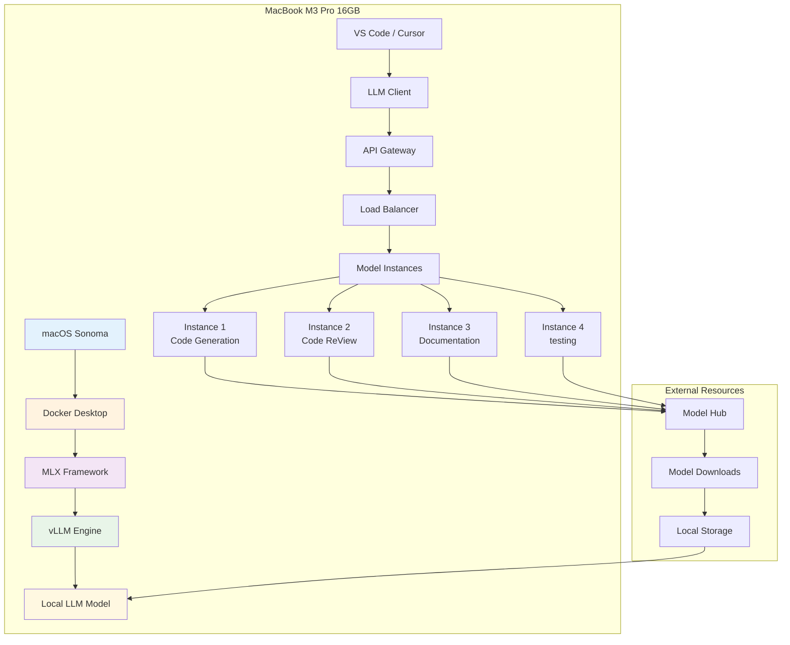
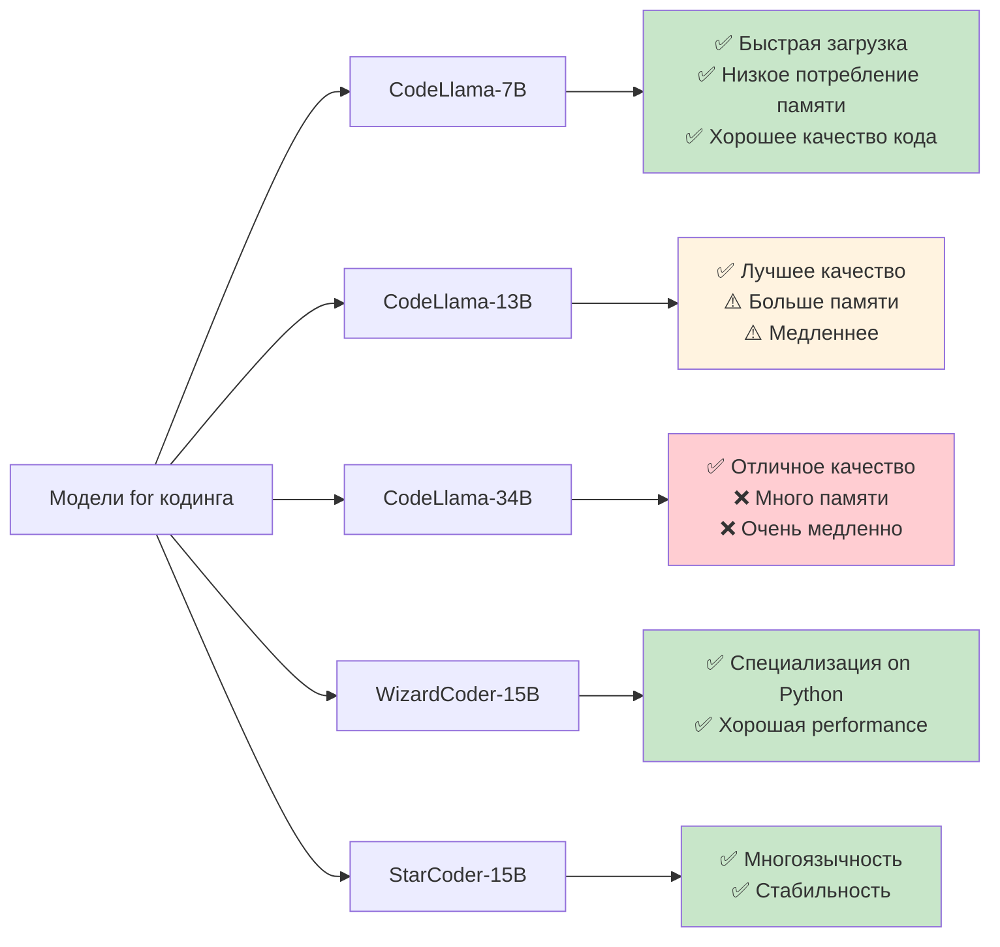
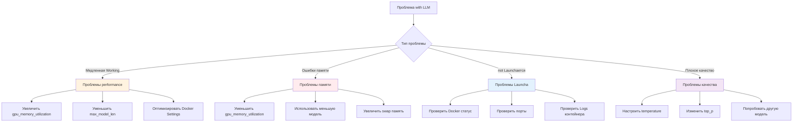
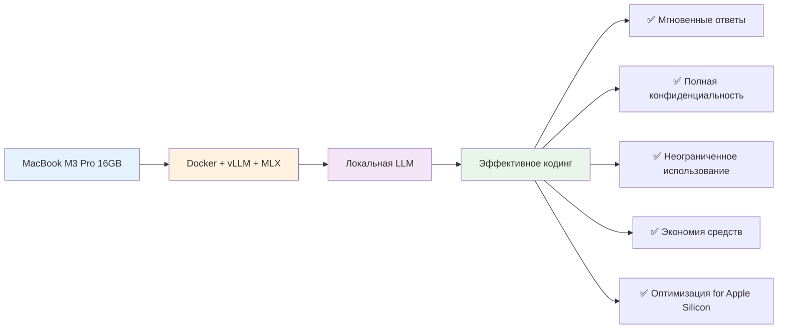

# configuration параллельных вычислений LLM on MacBook M3 Pro: Docker + vLLM + MLX

**Author:** Shcherbyna Rostyslav
**Дата:** 2024

## Why локальная LLM for кодинга - будущее разработки

### 🎯 Важность локальных LLM for эффективного кодинга


**Почему 90% разработчиков тратят время впустую?** Потому что они полагаются on облачные API with ограничениями, медленными ответами and проблемами конфиденциальности. Локальная LLM on MacBook M3 Pro - это решение all этих проблем.

### Что дает локальная LLM configuration?

- **Скорость**: Мгновенные ответы без задержек сети
- **Конфиденциальность**: Код никогда not покидает ваш компьютер
- **Экономия**: Одноразовая configuration вместо постоянных платежей
- **Неограниченность**: Никаких лимитов on количество запросов

## architecture решения: Docker + vLLM + MLX

### 🏗️ Общая architecture системы



### components системы

1. **Docker Desktop**: Контейнеризация and изоляция
2. **MLX Framework**: Оптимизация for Apple Silicon
3. **vLLM Engine**: Высокопроизводительный inference
4. **Local LLM Model**: Локальная модель for кодинга

## Пошаговая installation

### Шаг 1: Подготовка системы

#### 1.1 installation Docker Desktop

```bash
# Скачиваем Docker Desktop for Apple Silicon
curl -L "https://desktop.docker.com/mac/main/arm64/Docker.dmg" -o ~/Downloads/Docker.dmg

# Монтируем and Setting
hdiutil attach ~/Downloads/Docker.dmg
sudo cp -R /Volumes/Docker/Docker.app /applications/
hdiutil detach /Volumes/Docker

# Launchаем Docker Desktop
open /applications/Docker.app
```

#### 1.2 configuration Docker for Apple Silicon

```yaml
# docker-compose.yml
Version: '3.8'
services:
 vllm-server:
 image: vllm/vllm-openai:latest # Официальный образ vLLM with поддержкой OpenAI API
 platform: linux/arm64 # platform for Apple Silicon (M1/M2/M3)
 ports:
 - "8000:8000" # Проброс порта: внешний:внутренний
 volumes:
 - ./models:/models # Монтирование папки with моделями
 - ./cache:/cache # Монтирование папки cache for acceleration
 environment:
 - CUDA_VISIBLE_DEVICES="" # Отключаем CUDA (not нужен for Apple Silicon)
 - VLLM_Use_MODELSCOPE=false # Отключаем ModelScope (Use HuggingFace)
 command: >
 --model /models/codellama-7b-instruct # Путь к модели in контейнере
 --host 0.0.0.0 # Привязка ко all interfaceам
 --port 8000 # Порт внутри контейнера
 --tensor-parallel-size 1 # Параллелизм тензоров (1 for M3 Pro)
 --gpu-memory-utilization 0.8 # Использование 80% GPU памяти
 --max-model-len 4096 # Максимальная длина контекста
 --trust-remote-code # Разрешить выполнение пользовательского кода
```

### Детальное describe параметров Docker конфигурации

#### Основные parameters контейнера:
- **`image`**: `vllm/vllm-openai:latest` - официальный образ vLLM with поддержкой OpenAI-совместимого API
- **`platform`**: `linux/arm64` - указывает Docker использовать ARM64 архитектуру for Apple Silicon
- **`ports`**: `"8000:8000"` - проброс порта with хоста on контейнер for доступа к API

#### parameters томов (volumes):
- **`./models:/models`** - монтирует локальную папку with моделями in контейнер
 - Левый путь (`./models`) - папка on хосте
 - Правый путь (`/models`) - папка внутри контейнера
- **`./cache:/cache`** - монтирует папку cache for acceleration загрузки моделей

#### Переменные окружения:
- **`CUDA_VISIBLE_DEVICES=""`** - отключает CUDA (not поддерживается on Apple Silicon)
- **`VLLM_Use_MODELSCOPE=false`** - отключает ModelScope, Use HuggingFace Hub

#### parameters vLLM team:
- **`--model`**: Путь к модели внутри контейнера
- **`--host 0.0.0.0`**: Привязка ко all сетевым interfaceам (доступ извне)
- **`--port 8000`**: Порт for API внутри контейнера
- **`--tensor-parallel-size 1`**: Количество GPU for параллелизма (1 for M3 Pro)
- **`--gpu-memory-utilization 0.8`**: Использование 80% доступной GPU памяти
- **`--max-model-len 4096`**: Максимальная длина контекста in токенах
- **`--trust-remote-code`**: Разрешает выполнение пользовательского кода из модели

### Шаг 2: installation MLX Framework

#### 2.1 installation MLX

```bash
# Setting MLX через pip
pip install mlx mlx-lm

# or через conda
conda install -c conda-forge mlx
```

#### 2.2 configuration MLX for vLLM

```python
# mlx_config.py
import mlx.core as mx
import mlx.nn as nn
from mlx_lm import load, generate

class MLXvLLMAdapter:
 def __init__(self, model_path: str):
 """
 Инициализация MLX адаптера for vLLM

 Args:
 model_path (str): Путь к модели for загрузки
 """
 self.model, self.tokenizer = load(model_path)
 self.model.eval() # Переводим модель in режим инференса

 def generate_code(self, prompt: str, max_tokens: int = 512):
 """
 Генерация кода with использованием MLX оптимизированного инференса

 Args:
 prompt (str): Входной промпт for генерации
 max_tokens (int): Максимальное количество токенов for генерации

 Returns:
 str: Сгенерированный код
 """
 tokens = self.tokenizer.encode(prompt)

 # MLX optimized generation
 response = generate(
 self.model,
 self.tokenizer,
 prompt,
 max_tokens=max_tokens,
 temp=0.7 # Температура for контроля креативности
 )

 return response
```

### Детальное describe параметров MLX конфигурации

#### Основные components MLX:
- **`mlx.core`**: Основной module MLX for работы with тензорами and операциями
- **`mlx.nn`**: module нейронных networks MLX
- **`mlx_lm`**: Специализированная библиотека for работы with языковыми моделями

#### parameters класса MLXvLLMAdapter:

##### `__init__(self, model_path: str)`:
- **`model_path`**: Путь к файлам модели
 - Поддерживаемые форматы: HuggingFace, PyTorch, ONNX
 - Рекомендуется: `"./models/codellama-7b-instruct"`
 - Автоматически загружает конфигурацию, веса and токенизатор

##### `generate_code(self, prompt: str, max_tokens: int = 512)`:
- **`prompt`**: Входной текст for генерации
 - Может содержать instructions, examples кода, контекст
 - Рекомендуемый формат: "Напиши функцию for..."
- **`max_tokens`**: Максимальное количество токенов in ответе
 - Значение on умолчанию: 512
 - Рекомендуемый диапазон: 100-2048
 - Больше токенов = более длинный ответ, но медленнее генерация

#### parameters functions `generate()`:
- **`model`**: Загруженная модель MLX
- **`tokenizer`**: Токенизатор for преобразования текста in токены
- **`prompt`**: Исходный промпт
- **`max_tokens`**: Максимальная длина ответа
- **`temp`**: Температура генерации (0.7)
 - Диапазон: 0.0 - 2.0
 - 0.0 = детерминированная генерация
 - 0.7 = сбалансированная креативность
 - 1.0+ = высокая креативность, но менее предсказуемо

### Шаг 3: configuration vLLM

#### 3.1 create Dockerfile for vLLM

```dockerfile
# Dockerfile.vllm
FROM python:3.9-slim

# Setting системные dependencies
RUN apt-get update && apt-get install -y \
 git \
 build-essential \
 && rm -rf /var/lib/apt/Lists/*

# Setting vLLM with поддержкой Apple Silicon
RUN pip install vllm[apple] --extra-index-url https://download.pytorch.org/whl/cpu

# Creating рабочую директорию
WORKDIR /app

# Копируем конфигурацию
COPY vllm_config.py .
COPY start_server.py .

# Открываем порт
EXPOSE 8000

# Launchаем сервер
CMD ["python", "start_server.py"]
```

#### 3.2 configuration vLLM сервера

```python
# start_server.py
import argparse
from vllm import LLM, SamplingParams
from vllm.engine.arg_utils import AsyncEngineArgs
from vllm.engine.async_llm_engine import AsyncLLMEngine
import asyncio

async def main():
 parser = argparse.ArgumentParser(describe="vLLM сервер for MacBook M3 Pro")

 # Основные parameters модели
 parser.add_argument("--model", type=str, default="codellama-7b-instruct",
 help="Путь к модели or имя модели из HuggingFace")
 parser.add_argument("--tensor-parallel-size", type=int, default=1,
 help="Количество GPU for тензорного параллелизма (1 for M3 Pro)")
 parser.add_argument("--gpu-memory-utilization", type=float, default=0.8,
 help="Доля GPU памяти for использования (0.0-1.0)")
 parser.add_argument("--max-model-len", type=int, default=4096,
 help="Максимальная длина контекста модели in токенах")

 # Сетевые parameters
 parser.add_argument("--host", type=str, default="0.0.0.0",
 help="IP адрес for привязки сервера")
 parser.add_argument("--port", type=int, default=8000,
 help="Порт for API сервера")

 args = parser.parse_args()

 # Creating engine with оптимизацией for Apple Silicon
 engine_args = AsyncEngineArgs(
 model=args.model,
 tensor_parallel_size=args.tensor_parallel_size,
 gpu_memory_utilization=args.gpu_memory_utilization,
 max_model_len=args.max_model_len,
 trust_remote_code=True,
 # Оптимизации for Apple Silicon
 enforce_eager=True,
 disable_custom_all_reduce=True,
 )

 # Инициализируем engine
 engine = AsyncLLMEngine.from_engine_args(engine_args)

 print(f"🚀 vLLM сервер запущен on {args.host}:{args.port}")
 print(f"📱 Оптимизировано for Apple Silicon")
 print(f"🧠 Модель: {args.model}")
 print(f"💾 Использование памяти: {args.gpu_memory_utilization*100}%")

if __name__ == "__main__":
 asyncio.run(main())
```

### Детальное describe параметров vLLM сервера

#### Основные parameters модели:

##### `--model` (str, default: "codellama-7b-instruct"):
- **Назначение**: Путь к модели or имя модели из HuggingFace Hub
- **Поддерживаемые форматы**:
 - Локальный путь: `"./models/codellama-7b-instruct"`
 - HuggingFace ID: `"codellama/CodeLlama-7b-Instruct-hf"`
 - Полный путь: `"/full/path/to/model"`
- **Рекомендации**:
 - for кодинга: `"codellama-7b-instruct"` or `"wizardcoder-15b-v1.0"`
 - for общих задач: `"llama-2-7b-chat"` or `"mistral-7b-instruct"`

##### `--tensor-parallel-size` (int, default: 1):
- **Назначение**: Количество GPU for тензорного параллелизма
- **Значения**:
 - `1` - for MacBook M3 Pro (единый GPU)
 - `2+` - for систем with несколькими GPU
- **Влияние on performance**:
 - Больше GPU = быстрее инференс, но больше потребление памяти
 - for M3 Pro рекомендуется оставить `1`

##### `--gpu-memory-utilization` (float, default: 0.8):
- **Назначение**: Доля GPU памяти for использования моделью
- **Диапазон**: 0.0 - 1.0
- **Рекомендации for M3 Pro 16GB**:
 - `0.75` (12GB) - оптимально for стабильной работы
 - `0.8` (12.8GB) - максимальная performance
 - `0.6` (9.6GB) - если нужна память for других задач
- **Влияние**: Больше памяти = больше контекста, но меньше памяти for системы

##### `--max-model-len` (int, default: 4096):
- **Назначение**: Максимальная длина контекста in токенах
- **Рекомендуемые значения**:
 - `2048` - for быстрой работы, короткие запросы
 - `4096` - сбалансированный вариант (рекомендуется)
 - `8192` - for длинных контекстов, но медленнее
- **Влияние on память**: Увеличивается квадратично with длиной контекста

#### Сетевые parameters:

##### `--host` (str, default: "0.0.0.0"):
- **Назначение**: IP адрес for привязки сервера
- **Значения**:
 - `"0.0.0.0"` - доступ извне (рекомендуется)
 - `"127.0.0.1"` - только локальный доступ
 - `"192.168.1.100"` - конкретный IP адрес

##### `--port` (int, default: 8000):
- **Назначение**: Порт for API сервера
- **Рекомендации**:
 - `8000` - стандартный порт for vLLM
 - `8080` - альтернативный порт
 - `3000` - порт for development
- **check доступности**: `lsof -i :8000`

#### parameters оптимизации for Apple Silicon:

##### `trust_remote_code=True`:
- **Назначение**: Разрешает выполнение пользовательского кода из модели
- **Безопасность**: Включать только for проверенных моделей
- **Необходимость**: Требуется for большинства современных моделей

##### `enforce_eager=True`:
- **Назначение**: Принудительно использует eager execution
- **Преимущества**: Лучшая совместимость with Apple Silicon
- **Недостатки**: Немного медленнее, чем graph execution

##### `disable_custom_all_reduce=True`:
- **Назначение**: Отключает кастомные операции all_reduce
- **Причина**: not поддерживается on Apple Silicon
- **Влияние**: Минимальное for single-GPU конфигурации

### Шаг 4: Загрузка and configuration модели

#### 4.1 Выбор оптимальной модели for кодинга



#### 4.2 Скрипт загрузки модели

```python
# download_model.py
import os
import requests
from huggingface_hub import hf_hub_download
from tqdm import tqdm

def download_codellama_model():
 """Download CodeLlama model optimized for MacBook M3 Pro"""

 model_name = "codellama/CodeLlama-7b-Instruct-hf"
 local_dir = "./models/codellama-7b-instruct"

 print("🔄 Loading CodeLlama-7B-Instruct...")
 print("📱 Оптимизировано for MacBook M3 Pro 16GB")

 try:
 # Creating директорию
 os.makedirs(local_dir, exist_ok=True)

 # Loading модель
 model_path = hf_hub_download(
 repo_id=model_name,
 local_dir=local_dir,
 local_dir_Use_symlinks=False
 )

 print(f"✅ Модель загружена in: {model_path}")
 print("🚀 Готово к использованию!")

 return model_path

 except Exception as e:
 print(f"❌ Ошибка загрузки: {e}")
 return None

if __name__ == "__main__":
 download_codellama_model()
```

### Шаг 5: configuration параллельных вычислений

#### 5.1 configuration for MacBook M3 Pro

```python
# parallel_config.py
import multiprocessing as mp
import psutil
import platform

class MacBookM3ProConfig:
 """Оптимальная configuration for MacBook M3 Pro 16GB"""

 def __init__(self):
 self.cpu_cores = mp.cpu_count()
 self.memory_gb = psutil.virtual_memory().total // (1024**3)
 self.architecture = platform.machine()

 # Оптимальные Settings for M3 Pro
 self.optimal_config = {
 "tensor_parallel_size": 1, # M3 Pro имеет единый GPU
 "pipeline_parallel_size": 1,
 "gpu_memory_utilization": 0.75, # 75% from 16GB = 12GB
 "cpu_cores_usage": min(8, self.cpu_cores), # Use 8 ядер
 "max_model_len": 4096,
 "batch_size": 4,
 "max_tokens": 512,
 "temperature": 0.7,
 "top_p": 0.9,
 }

 def get_optimized_config(self):
 """Возвращает оптимизированную конфигурацию"""
 return self.optimal_config

 def print_system_info(self):
 """Выводит информацию о системе"""
 print("🖥️ Информация о системе:")
 print(f" CPU ядер: {self.cpu_cores}")
 print(f" Память: {self.memory_gb} GB")
 print(f" architecture: {self.architecture}")
 print(f" Операционная система: {platform.system()} {platform.release()}")

 print("\n⚙️ Оптимальная configuration:")
 for key, value in self.optimal_config.items():
 print(f" {key}: {value}")

# Использование
config = MacBookM3ProConfig()
config.print_system_info()
```

### Детальное describe параметров оптимизации for MacBook M3 Pro

#### parameters параллелизма:

##### `tensor_parallel_size` (int, default: 1):
- **Назначение**: Количество GPU for тензорного параллелизма
- **for M3 Pro**: Всегда `1` (единый GPU)
- **Влияние on performance**:
 - `1` - оптимально for M3 Pro
 - `2+` - not поддерживается on M3 Pro
- **Память**: not влияет on потребление памяти

##### `pipeline_parallel_size` (int, default: 1):
- **Назначение**: Количество этапов pipeline for обработки
- **for M3 Pro**: Всегда `1` (единый этап)
- **Влияние**: Увеличивает задержку, но может снизить потребление памяти
- **Рекомендация**: Оставить `1` for M3 Pro

#### parameters памяти:

##### `gpu_memory_utilization` (float, default: 0.75):
- **Назначение**: Доля GPU памяти for использования моделью
- **Расчет for M3 Pro 16GB**: 0.75 × 16GB = 12GB
- **Рекомендации**:
 - `0.75` (12GB) - оптимально for стабильной работы
 - `0.8` (12.8GB) - максимальная performance
 - `0.6` (9.6GB) - если нужна память for других задач
- **Влияние on system**: Оставшиеся 4GB for macOS and других приложений

#### parameters CPU:

##### `cpu_cores_usage` (int, calculated: min(8, cpu_cores)):
- **Назначение**: Количество CPU ядер for обработки
- **for M3 Pro**: Обычно 8-12 ядер, используется 8
- **Влияние on performance**:
 - Больше ядер = быстрее обработка
 - Но больше ядер = больше потребление энергии
- **Рекомендация**: 8 ядер - оптимальный баланс

#### parameters модели:

##### `max_model_len` (int, default: 4096):
- **Назначение**: Максимальная длина контекста in токенах
- **Влияние on память**: Квадратичное увеличение потребления памяти
- **Рекомендации for M3 Pro**:
 - `2048` - for быстрой работы (4GB памяти)
 - `4096` - сбалансированный вариант (8GB памяти)
 - `8192` - for длинных контекстов (16GB памяти)

##### `batch_size` (int, default: 4):
- **Назначение**: Количество запросов for параллельной обработки
- **Влияние on performance**:
 - Больше batch = лучше утилизация GPU
 - Но больше batch = больше потребление памяти
- **Рекомендации**:
 - `2` - for экономии памяти
 - `4` - оптимально for M3 Pro
 - `8` - for максимальной performance

#### parameters генерации:

##### `max_tokens` (int, default: 512):
- **Назначение**: Максимальная длина генерируемого текста
- **Влияние on время**: Больше токенов = дольше генерация
- **Рекомендации**:
 - `256` - for коротких ответов
 - `512` - сбалансированный вариант
 - `1024` - for длинных ответов

##### `temperature` (float, default: 0.7):
- **Назначение**: Контроль креативности генерации
- **Диапазон**: 0.0 - 2.0
- **Значения**:
 - `0.0` - детерминированная генерация
 - `0.7` - сбалансированная креативность
 - `1.0` - высокая креативность
 - `1.5+` - очень высокая креативность

##### `top_p` (float, default: 0.9):
- **Назначение**: Nucleus sampling - выбор из топ-p% вероятностей
- **Диапазон**: 0.0 - 1.0
- **Значения**:
 - `0.1` - очень консервативная генерация
 - `0.9` - сбалансированная генерация
 - `1.0` - полный словарь токенов

#### 5.2 configuration параллельных процессов

```python
# parallel_llm.py
import asyncio
import aiohttp
import json
from concurrent.futures import ThreadPoolExecutor
from typing import List, Dict, Any

class ParallelLLMProcessor:
 """Параллельная обработка LLM запросов"""

 def __init__(self, base_url: str = "http://localhost:8000"):
 self.base_url = base_url
 self.session = None
 self.executor = ThreadPoolExecutor(max_workers=4)

 async def __aenter__(self):
 self.session = aiohttp.ClientSession()
 return self

 async def __aexit__(self, exc_type, exc_val, exc_tb):
 if self.session:
 await self.session.close()

 async def generate_code_async(self, prompt: str, **kwargs) -> str:
 """Асинхронная генерация кода"""
 payload = {
 "prompt": prompt,
 "max_tokens": kwargs.get("max_tokens", 512),
 "temperature": kwargs.get("temperature", 0.7),
 "top_p": kwargs.get("top_p", 0.9),
 "stream": False
 }

 async with self.session.post(
 f"{self.base_url}/v1/completions",
 json=payload,
 headers={"Content-Type": "application/json"}
 ) as response:
 result = await response.json()
 return result["choices"][0]["text"]

 async def process_multiple_requests(self, requests: List[Dict[str, Any]]) -> List[str]:
 """Параллельная обработка множественных запросов"""
 tasks = []

 for req in requests:
 task = self.generate_code_async(
 req["prompt"],
 **req.get("params", {})
 )
 tasks.append(task)

 results = await asyncio.gather(*tasks)
 return results

 def process_sync(self, prompt: str, **kwargs) -> str:
 """Синхронная обработка (for совместимости)"""
 loop = asyncio.new_event_loop()
 asyncio.set_event_loop(loop)

 try:
 return loop.run_until_complete(
 self.generate_code_async(prompt, **kwargs)
 )
 finally:
 loop.close()

# example использования
async def main():
 async with ParallelLLMProcessor() as processor:
 # Параллельная обработка нескольких запросов
 requests = [
 {
 "prompt": "Напиши функцию for сортировки массива on Python",
 "params": {"max_tokens": 200}
 },
 {
 "prompt": "Создай класс for работы with database",
 "params": {"max_tokens": 300}
 },
 {
 "prompt": "Напиши тест for functions validation email",
 "params": {"max_tokens": 150}
 }
 ]

 results = await processor.process_multiple_requests(requests)

 for i, result in enumerate(results):
 print(f"Результат {i+1}:")
 print(result)
 print("-" * 50)

if __name__ == "__main__":
 asyncio.run(main())
```

## integration with IDE

### VS Code / Cursor integration

#### 6.1 configuration расширения

```json
// Settings.json for VS Code
{
 "llm.local.endpoint": "http://localhost:8000/v1/completions",
 "llm.local.model": "codellama-7b-instruct",
 "llm.local.temperature": 0.7,
 "llm.local.max_tokens": 512,
 "llm.local.timeout": 30,
 "llm.local.retry_attempts": 3,
 "llm.local.enable_parallel": true,
 "llm.local.max_concurrent_requests": 4
}
```

#### 6.2 Скрипт for автоматического Launchа

```bash
#!/bin/bash
# start_llm_server.sh

echo "🚀 Launch локальной LLM for кодинга on MacBook M3 Pro"
echo "📱 Оптимизировано for Apple Silicon"

# checking Docker
if ! docker info > /dev/null 2>&1; then
 echo "❌ Docker not запущен. Launchаем Docker Desktop..."
 open /applications/Docker.app
 sleep 10
fi

# checking модель
if [ ! -d "./models/codellama-7b-instruct" ]; then
 echo "📥 Модель not foundа. Loading..."
 python download_model.py
fi

# Launchаем контейнер
echo "🐳 Launchаем vLLM контейнер..."
docker-compose up -d

# Ждем Launchа
echo "⏳ Ожидаем Launchа сервера..."
sleep 30

# checking статус
if curl -s http://localhost:8000/health > /dev/null; then
 echo "✅ Сервер запущен and готов к работе!"
 echo "🌐 API available on адресу: http://localhost:8000"
 echo "📚 documentation: http://localhost:8000/docs"
else
 echo "❌ Ошибка Launchа сервера"
 exit 1
fi
```

## Monitoring and оптимизация

### 7.1 Monitoring performance

```python
# Monitoring.py
import psutil
import time
import requests
from datetime import datetime
import json

class LLMMonitor:
 """Monitoring performance локальной LLM"""

 def __init__(self, api_url: str = "http://localhost:8000"):
 """
 Инициализация монитора LLM

 Args:
 api_url (str): URL API сервера vLLM
 """
 self.api_url = api_url
 self.metrics = []

 def get_system_metrics(self):
 """
 Получает metrics системы

 Returns:
 dict: Словарь with метриками системы
 """
 return {
 "timestamp": datetime.now().isoformat(),
 "cpu_percent": psutil.cpu_percent(interval=1),
 "memory_percent": psutil.virtual_memory().percent,
 "memory_Used_gb": psutil.virtual_memory().Used / (1024**3),
 "memory_available_gb": psutil.virtual_memory().available / (1024**3),
 "disk_usage_percent": psutil.disk_usage('/').percent,
 }

 def get_llm_metrics(self):
 """
 Получает metrics LLM сервера

 Returns:
 dict: Словарь with метриками LLM or ошибка
 """
 try:
 response = requests.get(f"{self.api_url}/metrics", timeout=5)
 return response.json()
 except:
 return {"error": "not удалось получить metrics LLM"}

 def test_response_time(self, prompt: str = "Hello, world!"):
 """
 Тестирует время ответа LLM

 Args:
 prompt (str): testsый промпт for проверки

 Returns:
 dict: Результаты теста performance
 """
 start_time = time.time()

 try:
 response = requests.post(
 f"{self.api_url}/v1/completions",
 json={
 "prompt": prompt,
 "max_tokens": 50,
 "temperature": 0.7
 },
 timeout=30
 )

 end_time = time.time()
 response_time = end_time - start_time

 return {
 "response_time": response_time,
 "status_code": response.status_code,
 "success": response.status_code == 200
 }
 except Exception as e:
 return {
 "response_time": None,
 "error": str(e),
 "success": False
 }

 def run_Monitoring_cycle(self):
 """
 Launchает цикл Monitoringа

 Returns:
 dict: data текущего цикла Monitoringа
 """
 system_metrics = self.get_system_metrics()
 llm_metrics = self.get_llm_metrics()
 response_test = self.test_response_time()

 cycle_data = {
 "system": system_metrics,
 "llm": llm_metrics,
 "response_test": response_test
 }

 self.metrics.append(cycle_data)

 # Выводим текущие metrics
 print(f"📊 Monitoring - {datetime.now().strftime('%H:%M:%S')}")
 print(f" CPU: {system_metrics['cpu_percent']:.1f}%")
 print(f" Память: {system_metrics['memory_percent']:.1f}% ({system_metrics['memory_Used_gb']:.1f}GB)")
 print(f" Время ответа: {response_test.get('response_time', 'N/A'):.2f}s")
 print(f" Status: {'✅' if response_test.get('success') else '❌'}")
 print("-" * 50)

 return cycle_data

# Launch Monitoringа
monitor = LLMMonitor()

# Launchаем Monitoring in фоне
import threading
import time

def Monitoring_loop():
 while True:
 monitor.run_Monitoring_cycle()
 time.sleep(60) # Каждую minutesу

Monitoring_thread = threading.Thread(target=Monitoring_loop, daemon=True)
Monitoring_thread.start()
```

### Детальное describe параметров Monitoringа

#### parameters инициализации:

##### `api_url` (str, default: "http://localhost:8000"):
- **Назначение**: URL адрес API сервера vLLM
- **Формат**: `"http://host:port"`
- **examples**:
 - `"http://localhost:8000"` - локальный сервер
 - `"http://192.168.1.100:8000"` - удаленный сервер
 - `"https://api.example.com"` - HTTPS сервер
- **check доступности**: `curl http://localhost:8000/health`

#### metrics системы:

##### `cpu_percent` (float):
- **Назначение**: Процент использования CPU
- **Диапазон**: 0.0 - 100.0
- **Интерпретация**:
 - `0-30%` - низкая нагрузка
 - `30-70%` - нормальная нагрузка
 - `70-90%` - высокая нагрузка
 - `90-100%` - критическая нагрузка
- **Метод измерения**: `psutil.cpu_percent(interval=1)`

##### `memory_percent` (float):
- **Назначение**: Процент использования оперативной памяти
- **Диапазон**: 0.0 - 100.0
- **Критические значения**:
 - `>90%` - риск нехватки памяти
 - `>95%` - критическая нехватка памяти
- **for M3 Pro 16GB**: Рекомендуется держать <85%

##### `memory_Used_gb` (float):
- **Назначение**: Использованная память in гигабайтах
- **Расчет**: `psutil.virtual_memory().Used / (1024**3)`
- **for M3 Pro 16GB**: Нормальное значение 8-12GB

##### `memory_available_gb` (float):
- **Назначение**: Доступная память in гигабайтах
- **Критическое значение**: <2GB for M3 Pro
- **Рекомендация**: Держать >4GB for стабильной работы

##### `disk_usage_percent` (float):
- **Назначение**: Процент использования диска
- **Критические значения**:
 - `>90%` - мало места on диске
 - `>95%` - критически мало места
- **Влияние**: Может замедлить работу системы

#### metrics LLM сервера:

##### `response_time` (float):
- **Назначение**: Время ответа on запрос in секундах
- **Измерение**: from отправки запроса to получения ответа
- **Рекомендуемые значения**:
 - `<1s` - отличная performance
 - `1-3s` - хорошая performance
 - `3-10s` - приемлемая performance
 - `>10s` - медленная Working

##### `status_code` (int):
- **Назначение**: HTTP статус код ответа
- **Значения**:
 - `200` - успешный запрос
 - `400` - ошибка in запросе
 - `500` - внутренняя ошибка сервера
 - `503` - сервер not available

##### `success` (bool):
- **Назначение**: Успешность выполнения запроса
- **Значение**: `True` если `status_code == 200`
- **Использование**: for определения работоспособности системы

#### parameters тестирования:

##### `prompt` (str, default: "Hello, world!"):
- **Назначение**: testsый промпт for проверки performance
- **Рекомендации**:
 - Короткий промпт for быстрого тестирования
 - Стандартный промпт for сравнения результатов
 - Можно изменить on более специфичный

##### `max_tokens` (int, default: 50):
- **Назначение**: Максимальное количество токенов in testsом ответе
- **Влияние**: Больше токенов = дольше тест
- **Рекомендация**: 50 токенов for быстрого тестирования

##### `temperature` (float, default: 0.7):
- **Назначение**: Температура for testsой генерации
- **Влияние**: not влияет on время ответа, только on качество
- **Рекомендация**: Стандартное значение 0.7

#### parameters Monitoringа:

##### `timeout` (int, default: 30):
- **Назначение**: Таймаут for HTTP запросов in секундах
- **Рекомендации**:
 - `5s` - for быстрых проверок
 - `30s` - for полных tests
 - `60s` - for медленных систем

##### `interval` (int, default: 60):
- **Назначение**: Интервал между циклами Monitoringа in секундах
- **Рекомендации**:
 - `30s` - for детального Monitoringа
 - `60s` - for обычного Monitoringа
 - `300s` - for периодического Monitoringа

### 7.2 Оптимизация for MacBook M3 Pro

```python
# optimization.py
import subprocess
import psutil
import platform

class MacBookM3ProOptimizer:
 """Оптимизация for MacBook M3 Pro"""

 def __init__(self):
 """
 Инициализация оптимизатора for MacBook M3 Pro

 Автоматически определяет характеристики системы:
 - Архитектуру процессора
 - Объем оперативной памяти
 - Количество CPU ядер
 """
 self.architecture = platform.machine()
 self.memory_gb = psutil.virtual_memory().total // (1024**3)
 self.cpu_cores = psutil.cpu_count()

 def optimize_docker_Settings(self):
 """
 Оптимизирует Settings Docker for MacBook M3 Pro

 Returns:
 dict: Оптимизированная configuration Docker
 """
 print("🔧 Оптимизация Docker for MacBook M3 Pro...")

 # Увеличиваем лимиты памяти for Docker
 memory_limit = min(12, self.memory_gb - 4) # Оставляем 4GB for системы

 docker_config = {
 "memory": f"{memory_limit}GB",
 "cpus": min(8, self.cpu_cores),
 "disk_size": "100GB",
 "experimental": True,
 "features": {
 "buildkit": True,
 "containerd": True
 }
 }

 print(f" Память for Docker: {memory_limit}GB")
 print(f" CPU ядер: {min(8, self.cpu_cores)}")

 return docker_config

 def optimize_vllm_Settings(self):
 """
 Оптимизирует Settings vLLM for Apple Silicon

 Returns:
 dict: Оптимизированная configuration vLLM
 """
 print("⚡ Оптимизация vLLM for Apple Silicon...")

 # Оптимальные Settings for M3 Pro
 vllm_config = {
 "tensor_parallel_size": 1,
 "pipeline_parallel_size": 1,
 "gpu_memory_utilization": 0.75,
 "max_model_len": 4096,
 "batch_size": 4,
 "max_tokens": 512,
 "temperature": 0.7,
 "top_p": 0.9,
 "frequency_penalty": 0.0,
 "presence_penalty": 0.0,
 "stop": ["<|endoftext|>", "<|end|>"],
 "trust_remote_code": True,
 "enforce_eager": True,
 "disable_custom_all_reduce": True,
 }

 print(f" Использование памяти: {vllm_config['gpu_memory_utilization']*100}%")
 print(f" Максимальная длина: {vllm_config['max_model_len']}")
 print(f" Размер батча: {vllm_config['batch_size']}")

 return vllm_config

 def optimize_system_Settings(self):
 """
 Оптимизирует системные Settings macOS

 Выполняет системные team for оптимизации:
 - Отключает энергосбережение CPU
 - Увеличивает лимиты files
 """
 print("🖥️ Оптимизация системы macOS...")

 # Отключаем энергосбережение for CPU
 subprocess.run([
 "sudo", "pmset", "-a", "disablesleep", "1"
 ], check=False)

 # Увеличиваем лимиты files
 subprocess.run([
 "sudo", "Launchctl", "limit", "maxfiles", "65536", "200000"
 ], check=False)

 print(" ✅ Отключено энергосбережение CPU")
 print(" ✅ Увеличены лимиты files")

 def run_full_optimization(self):
 """
 Launchает полную оптимизацию системы

 Returns:
 dict: Словарь with конфигурациями Docker and vLLM
 """
 print("🚀 Launch полной оптимизации for MacBook M3 Pro...")
 print(f" architecture: {self.architecture}")
 print(f" Память: {self.memory_gb}GB")
 print(f" CPU ядер: {self.cpu_cores}")
 print()

 docker_config = self.optimize_docker_Settings()
 vllm_config = self.optimize_vllm_Settings()
 self.optimize_system_Settings()

 print("\n✅ Оптимизация завершена!")
 print("🔄 Перезапустите Docker Desktop for применения изменений")

 return {
 "docker": docker_config,
 "vllm": vllm_config
 }

# Launch оптимизации
optimizer = MacBookM3ProOptimizer()
config = optimizer.run_full_optimization()
```

### Детальное describe параметров оптимизации

#### parameters Docker оптимизации:

##### `memory` (str, calculated: f"{memory_limit}GB"):
- **Назначение**: Лимит памяти for Docker контейнеров
- **Расчет**: `min(12, memory_gb - 4)` - минимум из 12GB and доступной памяти минус 4GB
- **for M3 Pro 16GB**: Обычно 12GB
- **Влияние**: Больше памяти = больше возможностей for моделей
- **Рекомендация**: Оставить 4GB for macOS

##### `cpus` (int, calculated: min(8, cpu_cores)):
- **Назначение**: Количество CPU ядер for Docker
- **Расчет**: Минимум из 8 and доступных ядер
- **for M3 Pro**: Обычно 8 ядер
- **Влияние**: Больше ядер = быстрее обработка
- **Рекомендация**: 8 ядер - оптимальный баланс

##### `disk_size` (str, default: "100GB"):
- **Назначение**: Размер диска for Docker
- **Влияние**: Больше места = больше моделей and cache
- **Рекомендация**: 100GB for комфортной работы

##### `experimental` (bool, default: True):
- **Назначение**: Включает экспериментальные functions Docker
- **Преимущества**: Доступ к новым возможностям
- **Риски**: Может быть нестабильно
- **Рекомендация**: Включить for лучшей performance

##### `buildkit` (bool, default: True):
- **Назначение**: Включает BuildKit for сборки образов
- **Преимущества**: Быстрее сборка, лучший кэш
- **Совместимость**: Полная совместимость with Apple Silicon

##### `containerd` (bool, default: True):
- **Назначение**: Использует containerd как runtime
- **Преимущества**: Лучшая performance
- **Совместимость**: Оптимизирован for Apple Silicon

#### parameters vLLM оптимизации:

##### `tensor_parallel_size` (int, default: 1):
- **Назначение**: Параллелизм тензоров
- **for M3 Pro**: Всегда 1 (единый GPU)
- **Влияние**: not влияет on single-GPU системах

##### `pipeline_parallel_size` (int, default: 1):
- **Назначение**: Параллелизм pipeline
- **for M3 Pro**: Всегда 1
- **Влияние**: Увеличивает задержку, но может снизить память

##### `gpu_memory_utilization` (float, default: 0.75):
- **Назначение**: Использование GPU памяти
- **Расчет for M3 Pro**: 75% from 16GB = 12GB
- **Рекомендации**:
 - `0.75` - оптимально for стабильности
 - `0.8` - максимальная performance
 - `0.6` - если нужна память for других задач

##### `max_model_len` (int, default: 4096):
- **Назначение**: Максимальная длина контекста
- **Влияние on память**: Квадратичное увеличение
- **Рекомендации**:
 - `2048` - for быстрой работы
 - `4096` - сбалансированный вариант
 - `8192` - for длинных контекстов

##### `batch_size` (int, default: 4):
- **Назначение**: Размер батча for обработки
- **Влияние**: Больше батч = лучше утилизация GPU
- **Рекомендации**:
 - `2` - for экономии памяти
 - `4` - оптимально for M3 Pro
 - `8` - for максимальной performance

##### `max_tokens` (int, default: 512):
- **Назначение**: Максимальная длина ответа
- **Влияние**: Больше токенов = дольше генерация
- **Рекомендации**:
 - `256` - for коротких ответов
 - `512` - сбалансированный вариант
 - `1024` - for длинных ответов

##### `temperature` (float, default: 0.7):
- **Назначение**: Контроль креативности
- **Диапазон**: 0.0 - 2.0
- **Значения**:
 - `0.0` - детерминированная генерация
 - `0.7` - сбалансированная креативность
 - `1.0` - высокая креативность

##### `top_p` (float, default: 0.9):
- **Назначение**: Nucleus sampling
- **Диапазон**: 0.0 - 1.0
- **Значения**:
 - `0.1` - консервативная генерация
 - `0.9` - сбалансированная генерация
 - `1.0` - полный словарь

##### `frequency_penalty` (float, default: 0.0):
- **Назначение**: Штраф за частоту повторения токенов
- **Диапазон**: -2.0 - 2.0
- **Значения**:
 - `0.0` - без штрафа
 - `0.5` - умеренный штраф
 - `1.0` - сильный штраф

##### `presence_penalty` (float, default: 0.0):
- **Назначение**: Штраф за присутствие токенов
- **Диапазон**: -2.0 - 2.0
- **Значения**:
 - `0.0` - без штрафа
 - `0.5` - умеренный штраф
 - `1.0` - сильный штраф

##### `stop` (List, default: ["<|endoftext|>", "<|end|>"]):
- **Назначение**: List стоп-токенов
- **Влияние**: Останавливает генерацию при встрече токена
- **Рекомендация**: Добавить специфичные токены for модели

##### `trust_remote_code` (bool, default: True):
- **Назначение**: Разрешает выполнение пользовательского кода
- **Безопасность**: Включать только for проверенных моделей
- **Необходимость**: Требуется for большинства современных моделей

##### `enforce_eager` (bool, default: True):
- **Назначение**: Принудительно использует eager execution
- **Преимущества**: Лучшая совместимость with Apple Silicon
- **Недостатки**: Немного медленнее

##### `disable_custom_all_reduce` (bool, default: True):
- **Назначение**: Отключает кастомные операции all_reduce
- **Причина**: not поддерживается on Apple Silicon
- **Влияние**: Минимальное for single-GPU

#### Системные parameters оптимизации:

##### `disablesleep` (int, default: 1):
- **Назначение**: Отключает энергосбережение CPU
- **Команда**: `sudo pmset -a disablesleep 1`
- **Влияние**: Предотвращает замедление CPU
- **Рекомендация**: Включить for максимальной performance

##### `maxfiles` (tuple, default: (65536, 200000)):
- **Назначение**: Лимиты files (мягкий, жесткий)
- **Команда**: `sudo Launchctl limit maxfiles 65536 200000`
- **Влияние**: Увеличивает количество открытых files
- **Рекомендация**: Увеличить for работы with большими моделями

## Тестирование performance

### 8.1 Бенчмарк тесты

```python
# benchmark.py
import asyncio
import time
import statistics
from typing import List, Dict, Any

class LLMBenchmark:
 """Бенчмарк тесты for локальной LLM"""

 def __init__(self, api_url: str = "http://localhost:8000"):
 """
 Инициализация бенчмарка LLM

 Args:
 api_url (str): URL API сервера vLLM
 """
 self.api_url = api_url
 self.test_prompts = [
 "Напиши функцию for сортировки массива on Python",
 "Создай класс for работы with database SQLite",
 "Напиши тест for functions validation email",
 "Создай REST API endpoint for получения пользователей",
 "Напиши функцию for парсинга JSON файла",
 "Создай декоратор for Logsрования функций",
 "Напиши функцию for работы with файлами",
 "Создай класс for работы with network",
 "Напиши функцию for шифрования данных",
 "Создай конфигурационный файл for приложения"
 ]

 async def test_single_request(self, prompt: str) -> Dict[str, Any]:
 """
 Тестирует одиночный запрос

 Args:
 prompt (str): testsый промпт

 Returns:
 dict: Результаты теста одиночного запроса
 """
 import aiohttp

 start_time = time.time()

 async with aiohttp.ClientSession() as session:
 try:
 async with session.post(
 f"{self.api_url}/v1/completions",
 json={
 "prompt": prompt,
 "max_tokens": 200,
 "temperature": 0.7
 },
 timeout=30
 ) as response:
 result = await response.json()
 end_time = time.time()

 return {
 "success": True,
 "response_time": end_time - start_time,
 "tokens_generated": len(result["choices"][0]["text"].split()),
 "prompt_length": len(prompt.split())
 }
 except Exception as e:
 return {
 "success": False,
 "error": str(e),
 "response_time": None
 }

 async def test_parallel_requests(self, num_requests: int = 5) -> Dict[str, Any]:
 """
 Тестирует параллельные запросы

 Args:
 num_requests (int): Количество параллельных запросов

 Returns:
 dict: Результаты теста параллельных запросов
 """
 print(f"🔄 Тестирование {num_requests} параллельных запросов...")

 start_time = time.time()

 # Creating задачи for параллельного выполнения
 tasks = []
 for i in range(num_requests):
 prompt = self.test_prompts[i % len(self.test_prompts)]
 task = self.test_single_request(prompt)
 tasks.append(task)

 # Выполняем все задачи параллельно
 results = await asyncio.gather(*tasks)

 end_time = time.time()
 total_time = end_time - start_time

 # Анализируем результаты
 successful_requests = [r for r in results if r.get("success")]
 failed_requests = [r for r in results if not r.get("success")]

 if successful_requests:
 response_times = [r["response_time"] for r in successful_requests]
 tokens_generated = sum(r["tokens_generated"] for r in successful_requests)

 return {
 "total_requests": num_requests,
 "successful_requests": len(successful_requests),
 "failed_requests": len(failed_requests),
 "total_time": total_time,
 "avg_response_time": statistics.mean(response_times),
 "min_response_time": min(response_times),
 "max_response_time": max(response_times),
 "tokens_per_second": tokens_generated / total_time,
 "requests_per_second": len(successful_requests) / total_time
 }
 else:
 return {
 "total_requests": num_requests,
 "successful_requests": 0,
 "failed_requests": len(failed_requests),
 "error": "Все запросы завершились with ошибкой"
 }

 async def run_full_benchmark(self):
 """
 Launchает полный бенчмарк

 Выполняет тесты:
 - Одиночных запросов
 - Параллельных запросов
 - Анализ performance
 """
 print("🚀 Launch бенчмарка локальной LLM on MacBook M3 Pro")
 print("=" * 60)

 # Тест одиночных запросов
 print("\n📊 Тест одиночных запросов:")
 single_results = []
 for i, prompt in enumerate(self.test_prompts[:5]):
 print(f" Запрос {i+1}/5...")
 result = await self.test_single_request(prompt)
 single_results.append(result)

 successful_single = [r for r in single_results if r.get("success")]
 if successful_single:
 single_times = [r["response_time"] for r in successful_single]
 print(f" ✅ Успешных запросов: {len(successful_single)}/5")
 print(f" ⏱️ Среднее время ответа: {statistics.mean(single_times):.2f}s")
 print(f" ⚡ Минимальное время: {min(single_times):.2f}s")
 print(f" 🐌 Максимальное время: {max(single_times):.2f}s")

 # Тест параллельных запросов
 print("\n🔄 Тест параллельных запросов:")
 parallel_results = await self.test_parallel_requests(5)

 if parallel_results.get("successful_requests", 0) > 0:
 print(f" ✅ Успешных запросов: {parallel_results['successful_requests']}/{parallel_results['total_requests']}")
 print(f" ⏱️ Общее время: {parallel_results['total_time']:.2f}s")
 print(f" ⚡ Среднее время ответа: {parallel_results['avg_response_time']:.2f}s")
 print(f" 🚀 Запросов in секунду: {parallel_results['requests_per_second']:.2f}")
 print(f" 📝 Токенов in секунду: {parallel_results['tokens_per_second']:.2f}")

 print("\n" + "=" * 60)
 print("✅ Бенчмарк завершен!")

# Launch бенчмарка
async def main():
 benchmark = LLMBenchmark()
 await benchmark.run_full_benchmark()

if __name__ == "__main__":
 asyncio.run(main())
```

### Детальное describe параметров бенчмарка

#### parameters инициализации:

##### `api_url` (str, default: "http://localhost:8000"):
- **Назначение**: URL адрес API сервера vLLM
- **Формат**: `"http://host:port"`
- **examples**:
 - `"http://localhost:8000"` - локальный сервер
 - `"http://192.168.1.100:8000"` - удаленный сервер
- **check доступности**: `curl http://localhost:8000/health`

#### testsые промпты:

##### `test_prompts` (List, 10 элементов):
- **Назначение**: Набор testsых промптов for бенчмарка
- **Типы задач**:
 - functions программирования
 - Классы and объекты
 - Тестирование кода
 - API endpoints
 - Обработка данных
 - Декораторы
 - Working with файлами
 - Сетевые операции
 - Шифрование
 - configuration
- **Рекомендации**: Добавить специфичные for вашего случая промпты

#### parameters одиночного запроса:

##### `prompt` (str):
- **Назначение**: testsый промпт for генерации
- **Длина**: Рекомендуется 10-50 слов
- **Сложность**: Средняя сложность for реалистичного тестирования
- **examples**: "Напиши функцию for сортировки массива on Python"

##### `max_tokens` (int, default: 200):
- **Назначение**: Максимальное количество токенов in ответе
- **Влияние**: Больше токенов = дольше генерация
- **Рекомендации**:
 - `100` - for быстрого тестирования
 - `200` - сбалансированный вариант
 - `500` - for детального тестирования

##### `temperature` (float, default: 0.7):
- **Назначение**: Температура for генерации
- **Диапазон**: 0.0 - 2.0
- **Влияние**: not влияет on время, только on качество
- **Рекомендация**: Стандартное значение 0.7

##### `timeout` (int, default: 30):
- **Назначение**: Таймаут for HTTP запроса in секундах
- **Рекомендации**:
 - `10s` - for быстрых tests
 - `30s` - стандартный таймаут
 - `60s` - for медленных систем

#### parameters параллельного тестирования:

##### `num_requests` (int, default: 5):
- **Назначение**: Количество параллельных запросов
- **Влияние**: Больше запросов = больше нагрузка
- **Рекомендации**:
 - `2-3` - for слабых систем
 - `5` - оптимально for M3 Pro
 - `10+` - for мощных систем

#### Metrics performance:

##### `response_time` (float):
- **Назначение**: Время ответа on запрос in секундах
- **Измерение**: from отправки запроса to получения ответа
- **Рекомендуемые значения**:
 - `<1s` - отличная performance
 - `1-3s` - хорошая performance
 - `3-10s` - приемлемая performance
 - `>10s` - медленная Working

##### `tokens_generated` (int):
- **Назначение**: Количество сгенерированных токенов
- **Расчет**: `len(result["choices"][0]["text"].split())`
- **Влияние**: Больше токенов = больше времени генерации

##### `prompt_length` (int):
- **Назначение**: Длина входного промпта in словах
- **Расчет**: `len(prompt.split())`
- **Влияние**: Больше промпт = больше времени обработки

##### `success` (bool):
- **Назначение**: Успешность выполнения запроса
- **Значение**: `True` если запрос выполнен без ошибок
- **Использование**: for расчета процента успешных запросов

#### Агрегированные metrics:

##### `total_requests` (int):
- **Назначение**: Общее количество запросов
- **Использование**: for расчета процента успешных запросов

##### `successful_requests` (int):
- **Назначение**: Количество успешных запросов
- **Расчет**: `len([r for r in results if r.get("success")])`
- **Использование**: for расчета процента успешности

##### `failed_requests` (int):
- **Назначение**: Количество неудачных запросов
- **Расчет**: `total_requests - successful_requests`
- **Использование**: for Analysis ошибок

##### `total_time` (float):
- **Назначение**: Общее время выполнения all запросов
- **Измерение**: from начала to конца параллельного теста
- **Использование**: for расчета пропускной способности

##### `avg_response_time` (float):
- **Назначение**: Среднее время ответа
- **Расчет**: `statistics.mean(response_times)`
- **Использование**: for оценки performance

##### `min_response_time` (float):
- **Назначение**: Минимальное время ответа
- **Расчет**: `min(response_times)`
- **Использование**: for оценки лучшей performance

##### `max_response_time` (float):
- **Назначение**: Максимальное время ответа
- **Расчет**: `max(response_times)`
- **Использование**: for оценки худшей performance

##### `tokens_per_second` (float):
- **Назначение**: Скорость генерации токенов
- **Расчет**: `tokens_generated / total_time`
- **Использование**: for оценки performance генерации

##### `requests_per_second` (float):
- **Назначение**: Пропускная способность запросов
- **Расчет**: `successful_requests / total_time`
- **Использование**: for оценки общей performance системы

## Решение проблем

### 9.1 Common Issues and решения



### 9.2 Скрипт диагностики

```python
# diagnostics.py
import subprocess
import requests
import psutil
import docker
import json
from datetime import datetime

class LLMDiagnostics:
 """Диагностика проблем with локальной LLM"""

 def __init__(self):
 self.docker_client = docker.from_env()

 def check_docker_status(self):
 """Проверяет статус Docker"""
 print("🐳 check Docker...")

 try:
 # checking Docker daemon
 self.docker_client.ping()
 print(" ✅ Docker daemon Workingет")

 # checking контейнеры
 containers = self.docker_client.containers.List()
 vllm_containers = [c for c in containers if 'vllm' in c.name.lower()]

 if vllm_containers:
 print(f" ✅ foundо {len(vllm_containers)} vLLM контейнеров")
 for container in vllm_containers:
 print(f" - {container.name}: {container.status}")
 else:
 print(" ❌ vLLM контейнеры not foundы")
 return False

 return True

 except Exception as e:
 print(f" ❌ Ошибка Docker: {e}")
 return False

 def check_system_resources(self):
 """Проверяет системные ресурсы"""
 print("\n🖥️ check системных ресурсов...")

 # CPU
 cpu_percent = psutil.cpu_percent(interval=1)
 print(f" CPU использование: {cpu_percent:.1f}%")

 # Память
 memory = psutil.virtual_memory()
 print(f" Память: {memory.percent:.1f}% ({memory.Used / (1024**3):.1f}GB / {memory.total / (1024**3):.1f}GB)")

 # Диск
 disk = psutil.disk_usage('/')
 print(f" Диск: {disk.percent:.1f}% ({disk.Used / (1024**3):.1f}GB / {disk.total / (1024**3):.1f}GB)")

 # checking, достаточно ли ресурсов
 if memory.percent > 90:
 print(" ⚠️ Высокое использование памяти!")
 return False

 if disk.percent > 90:
 print(" ⚠️ Мало места on диске!")
 return False

 print(" ✅ Системные ресурсы in норме")
 return True

 def check_api_endpoint(self):
 """Проверяет API endpoint"""
 print("\n🌐 check API endpoint...")

 try:
 # checking health endpoint
 response = requests.get("http://localhost:8000/health", timeout=5)
 if response.status_code == 200:
 print(" ✅ health endpoint отвечает")
 else:
 print(f" ⚠️ health endpoint вернул код: {response.status_code}")
 except:
 print(" ❌ health endpoint not available")

 try:
 # checking completions endpoint
 response = requests.post(
 "http://localhost:8000/v1/completions",
 json={
 "prompt": "Test",
 "max_tokens": 10
 },
 timeout=10
 )

 if response.status_code == 200:
 print(" ✅ Completions endpoint Workingет")
 return True
 else:
 print(f" ❌ Completions endpoint вернул код: {response.status_code}")
 return False

 except Exception as e:
 print(f" ❌ Ошибка API: {e}")
 return False

 def check_model_files(self):
 """Проверяет файлы модели"""
 print("\n📁 check files модели...")

 model_paths = [
 "./models/codellama-7b-instruct",
 "./models/codellama-7b-instruct/config.json",
 "./models/codellama-7b-instruct/pytorch_model.bin"
 ]

 all_exist = True
 for path in model_paths:
 try:
 with open(path, 'r') as f:
 print(f" ✅ {path} found")
 except:
 print(f" ❌ {path} not found")
 all_exist = False

 return all_exist

 def run_full_diagnostics(self):
 """Launchает полную диагностику"""
 print("🔍 Диагностика локальной LLM on MacBook M3 Pro")
 print("=" * 60)
 print(f"Время: {datetime.now().strftime('%Y-%m-%d %H:%M:%S')}")
 print()

 results = {
 "docker": self.check_docker_status(),
 "system": self.check_system_resources(),
 "api": self.check_api_endpoint(),
 "model": self.check_model_files()
 }

 print("\n" + "=" * 60)
 print("📊 Результаты диагностики:")

 for component, status in results.items():
 status_icon = "✅" if status else "❌"
 print(f" {component}: {status_icon}")

 all_good = all(results.values())

 if all_good:
 print("\n🎉 Все системы Workingют нормально!")
 else:
 print("\n⚠️ Обнаружены проблемы. Проверьте Logs выше.")

 return results

# Launch диагностики
diagnostics = LLMDiagnostics()
results = diagnostics.run_full_diagnostics()
```

## Заключение

### 🎯 Ключевые преимущества локальной LLM on MacBook M3 Pro



### Что вы получили:

1. **Полнофункциональную локальную LLM** for кодинга on MacBook M3 Pro
2. **Оптимизированную архитектуру** with Docker + vLLM + MLX
3. **Параллельные вычисления** for максимальной performance
4. **Готовые скрипты** for Monitoringа and диагностики
5. **Интеграцию with IDE** for удобной работы

### Следующие шаги:

1. Запустите `start_llm_server.sh` for автоматической Settings
2. Настройте интеграцию with вашим IDE
3. Запустите бенчмарк for проверки performance
4. Настройте Monitoring for отслеживания работы

**Теперь у вас есть мощная локальная LLM, оптимизированная for MacBook M3 Pro, которая обеспечит эффективное кодинг без ограничений облачных API!** 🚀
