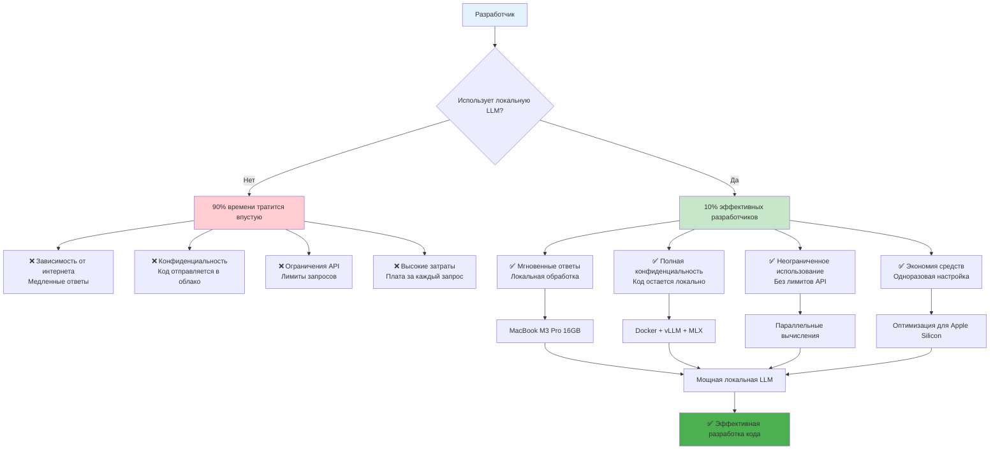
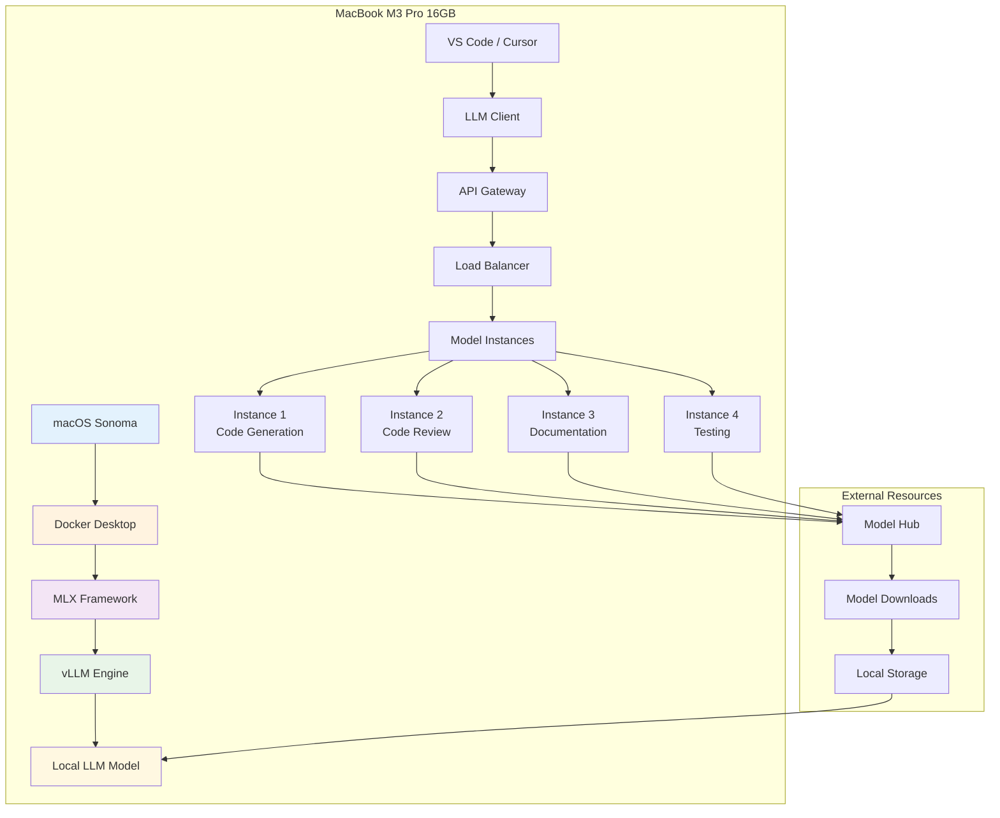
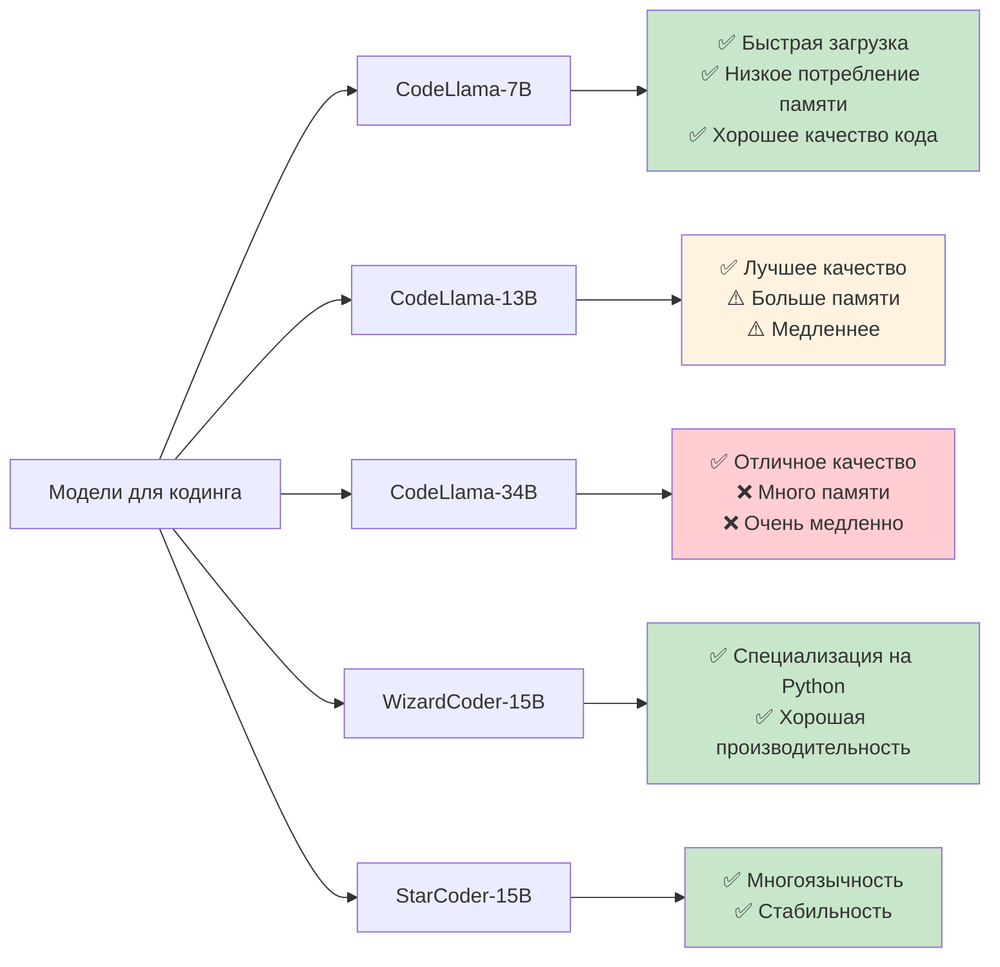
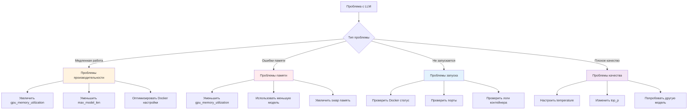
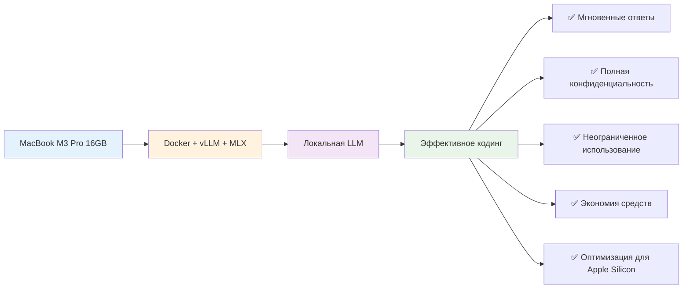

# Настройка параллельных вычислений LLM на MacBook M3 Pro: Docker + vLLM + MLX

**Автор:** Shcherbyna Rostyslav  
**Дата:** 2024  

## Почему локальная LLM для кодинга - будущее разработки

### 🎯 Важность локальных LLM для эффективного кодинга



**Почему 90% разработчиков тратят время впустую?** Потому что они полагаются на облачные API с ограничениями, медленными ответами и проблемами конфиденциальности. Локальная LLM на MacBook M3 Pro - это решение всех этих проблем.

### Что дает локальная LLM настройка?

- **Скорость**: Мгновенные ответы без задержек сети
- **Конфиденциальность**: Код никогда не покидает ваш компьютер
- **Экономия**: Одноразовая настройка вместо постоянных платежей
- **Неограниченность**: Никаких лимитов на количество запросов

## Архитектура решения: Docker + vLLM + MLX

### 🏗️ Общая архитектура системы



### Компоненты системы

1. **Docker Desktop**: Контейнеризация и изоляция
2. **MLX Framework**: Оптимизация для Apple Silicon
3. **vLLM Engine**: Высокопроизводительный inference
4. **Local LLM Model**: Локальная модель для кодинга

## Пошаговая установка

### Шаг 1: Подготовка системы

#### 1.1 Установка Docker Desktop

```bash
# Скачиваем Docker Desktop для Apple Silicon
curl -L "https://desktop.docker.com/mac/main/arm64/Docker.dmg" -o ~/Downloads/Docker.dmg

# Монтируем и устанавливаем
hdiutil attach ~/Downloads/Docker.dmg
sudo cp -R /Volumes/Docker/Docker.app /Applications/
hdiutil detach /Volumes/Docker

# Запускаем Docker Desktop
open /Applications/Docker.app
```

#### 1.2 Настройка Docker для Apple Silicon

```yaml
# docker-compose.yml
version: '3.8'
services:
  vllm-server:
    image: vllm/vllm-openai:latest  # Официальный образ vLLM с поддержкой OpenAI API
    platform: linux/arm64          # Платформа для Apple Silicon (M1/M2/M3)
    ports:
      - "8000:8000"                # Проброс порта: внешний:внутренний
    volumes:
      - ./models:/models            # Монтирование папки с моделями
      - ./cache:/cache              # Монтирование папки кэша для ускорения
    environment:
      - CUDA_VISIBLE_DEVICES=""     # Отключаем CUDA (не нужен для Apple Silicon)
      - VLLM_USE_MODELSCOPE=false   # Отключаем ModelScope (используем HuggingFace)
    command: >
      --model /models/codellama-7b-instruct    # Путь к модели в контейнере
      --host 0.0.0.0                          # Привязка ко всем интерфейсам
      --port 8000                             # Порт внутри контейнера
      --tensor-parallel-size 1                # Параллелизм тензоров (1 для M3 Pro)
      --gpu-memory-utilization 0.8            # Использование 80% GPU памяти
      --max-model-len 4096                    # Максимальная длина контекста
      --trust-remote-code                     # Разрешить выполнение пользовательского кода
```

### Детальное описание параметров Docker конфигурации

#### Основные параметры контейнера:
- **`image`**: `vllm/vllm-openai:latest` - официальный образ vLLM с поддержкой OpenAI-совместимого API
- **`platform`**: `linux/arm64` - указывает Docker использовать ARM64 архитектуру для Apple Silicon
- **`ports`**: `"8000:8000"` - проброс порта с хоста на контейнер для доступа к API

#### Параметры томов (volumes):
- **`./models:/models`** - монтирует локальную папку с моделями в контейнер
  - Левый путь (`./models`) - папка на хосте
  - Правый путь (`/models`) - папка внутри контейнера
- **`./cache:/cache`** - монтирует папку кэша для ускорения загрузки моделей

#### Переменные окружения:
- **`CUDA_VISIBLE_DEVICES=""`** - отключает CUDA (не поддерживается на Apple Silicon)
- **`VLLM_USE_MODELSCOPE=false`** - отключает ModelScope, используем HuggingFace Hub

#### Параметры vLLM команды:
- **`--model`**: Путь к модели внутри контейнера
- **`--host 0.0.0.0`**: Привязка ко всем сетевым интерфейсам (доступ извне)
- **`--port 8000`**: Порт для API внутри контейнера
- **`--tensor-parallel-size 1`**: Количество GPU для параллелизма (1 для M3 Pro)
- **`--gpu-memory-utilization 0.8`**: Использование 80% доступной GPU памяти
- **`--max-model-len 4096`**: Максимальная длина контекста в токенах
- **`--trust-remote-code`**: Разрешает выполнение пользовательского кода из модели

### Шаг 2: Установка MLX Framework

#### 2.1 Установка MLX

```bash
# Устанавливаем MLX через pip
pip install mlx mlx-lm

# Или через conda
conda install -c conda-forge mlx
```

#### 2.2 Настройка MLX для vLLM

```python
# mlx_config.py
import mlx.core as mx
import mlx.nn as nn
from mlx_lm import load, generate

class MLXvLLMAdapter:
    def __init__(self, model_path: str):
        """
        Инициализация MLX адаптера для vLLM
        
        Args:
            model_path (str): Путь к модели для загрузки
        """
        self.model, self.tokenizer = load(model_path)
        self.model.eval()  # Переводим модель в режим инференса
    
    def generate_code(self, prompt: str, max_tokens: int = 512):
        """
        Генерация кода с использованием MLX оптимизированного инференса
        
        Args:
            prompt (str): Входной промпт для генерации
            max_tokens (int): Максимальное количество токенов для генерации
            
        Returns:
            str: Сгенерированный код
        """
        tokens = self.tokenizer.encode(prompt)
        
        # MLX optimized generation
        response = generate(
            self.model, 
            self.tokenizer, 
            prompt, 
            max_tokens=max_tokens,
            temp=0.7  # Температура для контроля креативности
        )
        
        return response
```

### Детальное описание параметров MLX конфигурации

#### Основные компоненты MLX:
- **`mlx.core`**: Основной модуль MLX для работы с тензорами и операциями
- **`mlx.nn`**: Модуль нейронных сетей MLX
- **`mlx_lm`**: Специализированная библиотека для работы с языковыми моделями

#### Параметры класса MLXvLLMAdapter:

##### `__init__(self, model_path: str)`:
- **`model_path`**: Путь к файлам модели
  - Поддерживаемые форматы: HuggingFace, PyTorch, ONNX
  - Рекомендуется: `"./models/codellama-7b-instruct"`
  - Автоматически загружает конфигурацию, веса и токенизатор

##### `generate_code(self, prompt: str, max_tokens: int = 512)`:
- **`prompt`**: Входной текст для генерации
  - Может содержать инструкции, примеры кода, контекст
  - Рекомендуемый формат: "Напиши функцию для..."
- **`max_tokens`**: Максимальное количество токенов в ответе
  - Значение по умолчанию: 512
  - Рекомендуемый диапазон: 100-2048
  - Больше токенов = более длинный ответ, но медленнее генерация

#### Параметры функции `generate()`:
- **`model`**: Загруженная модель MLX
- **`tokenizer`**: Токенизатор для преобразования текста в токены
- **`prompt`**: Исходный промпт
- **`max_tokens`**: Максимальная длина ответа
- **`temp`**: Температура генерации (0.7)
  - Диапазон: 0.0 - 2.0
  - 0.0 = детерминированная генерация
  - 0.7 = сбалансированная креативность
  - 1.0+ = высокая креативность, но менее предсказуемо

### Шаг 3: Настройка vLLM

#### 3.1 Создание Dockerfile для vLLM

```dockerfile
# Dockerfile.vllm
FROM python:3.9-slim

# Устанавливаем системные зависимости
RUN apt-get update && apt-get install -y \
    git \
    build-essential \
    && rm -rf /var/lib/apt/lists/*

# Устанавливаем vLLM с поддержкой Apple Silicon
RUN pip install vllm[apple] --extra-index-url https://download.pytorch.org/whl/cpu

# Создаем рабочую директорию
WORKDIR /app

# Копируем конфигурацию
COPY vllm_config.py .
COPY start_server.py .

# Открываем порт
EXPOSE 8000

# Запускаем сервер
CMD ["python", "start_server.py"]
```

#### 3.2 Конфигурация vLLM сервера

```python
# start_server.py
import argparse
from vllm import LLM, SamplingParams
from vllm.engine.arg_utils import AsyncEngineArgs
from vllm.engine.async_llm_engine import AsyncLLMEngine
import asyncio

async def main():
    parser = argparse.ArgumentParser(description="vLLM сервер для MacBook M3 Pro")
    
    # Основные параметры модели
    parser.add_argument("--model", type=str, default="codellama-7b-instruct",
                       help="Путь к модели или имя модели из HuggingFace")
    parser.add_argument("--tensor-parallel-size", type=int, default=1,
                       help="Количество GPU для тензорного параллелизма (1 для M3 Pro)")
    parser.add_argument("--gpu-memory-utilization", type=float, default=0.8,
                       help="Доля GPU памяти для использования (0.0-1.0)")
    parser.add_argument("--max-model-len", type=int, default=4096,
                       help="Максимальная длина контекста модели в токенах")
    
    # Сетевые параметры
    parser.add_argument("--host", type=str, default="0.0.0.0",
                       help="IP адрес для привязки сервера")
    parser.add_argument("--port", type=int, default=8000,
                       help="Порт для API сервера")
    
    args = parser.parse_args()
    
    # Создаем engine с оптимизацией для Apple Silicon
    engine_args = AsyncEngineArgs(
        model=args.model,
        tensor_parallel_size=args.tensor_parallel_size,
        gpu_memory_utilization=args.gpu_memory_utilization,
        max_model_len=args.max_model_len,
        trust_remote_code=True,
        # Оптимизации для Apple Silicon
        enforce_eager=True,
        disable_custom_all_reduce=True,
    )
    
    # Инициализируем engine
    engine = AsyncLLMEngine.from_engine_args(engine_args)
    
    print(f"🚀 vLLM сервер запущен на {args.host}:{args.port}")
    print(f"📱 Оптимизировано для Apple Silicon")
    print(f"🧠 Модель: {args.model}")
    print(f"💾 Использование памяти: {args.gpu_memory_utilization*100}%")

if __name__ == "__main__":
    asyncio.run(main())
```

### Детальное описание параметров vLLM сервера

#### Основные параметры модели:

##### `--model` (str, default: "codellama-7b-instruct"):
- **Назначение**: Путь к модели или имя модели из HuggingFace Hub
- **Поддерживаемые форматы**:
  - Локальный путь: `"./models/codellama-7b-instruct"`
  - HuggingFace ID: `"codellama/CodeLlama-7b-Instruct-hf"`
  - Полный путь: `"/full/path/to/model"`
- **Рекомендации**:
  - Для кодинга: `"codellama-7b-instruct"` или `"wizardcoder-15b-v1.0"`
  - Для общих задач: `"llama-2-7b-chat"` или `"mistral-7b-instruct"`

##### `--tensor-parallel-size` (int, default: 1):
- **Назначение**: Количество GPU для тензорного параллелизма
- **Значения**:
  - `1` - для MacBook M3 Pro (единый GPU)
  - `2+` - для систем с несколькими GPU
- **Влияние на производительность**:
  - Больше GPU = быстрее инференс, но больше потребление памяти
  - Для M3 Pro рекомендуется оставить `1`

##### `--gpu-memory-utilization` (float, default: 0.8):
- **Назначение**: Доля GPU памяти для использования моделью
- **Диапазон**: 0.0 - 1.0
- **Рекомендации для M3 Pro 16GB**:
  - `0.75` (12GB) - оптимально для стабильной работы
  - `0.8` (12.8GB) - максимальная производительность
  - `0.6` (9.6GB) - если нужна память для других задач
- **Влияние**: Больше памяти = больше контекста, но меньше памяти для системы

##### `--max-model-len` (int, default: 4096):
- **Назначение**: Максимальная длина контекста в токенах
- **Рекомендуемые значения**:
  - `2048` - для быстрой работы, короткие запросы
  - `4096` - сбалансированный вариант (рекомендуется)
  - `8192` - для длинных контекстов, но медленнее
- **Влияние на память**: Увеличивается квадратично с длиной контекста

#### Сетевые параметры:

##### `--host` (str, default: "0.0.0.0"):
- **Назначение**: IP адрес для привязки сервера
- **Значения**:
  - `"0.0.0.0"` - доступ извне (рекомендуется)
  - `"127.0.0.1"` - только локальный доступ
  - `"192.168.1.100"` - конкретный IP адрес

##### `--port` (int, default: 8000):
- **Назначение**: Порт для API сервера
- **Рекомендации**:
  - `8000` - стандартный порт для vLLM
  - `8080` - альтернативный порт
  - `3000` - порт для разработки
- **Проверка доступности**: `lsof -i :8000`

#### Параметры оптимизации для Apple Silicon:

##### `trust_remote_code=True`:
- **Назначение**: Разрешает выполнение пользовательского кода из модели
- **Безопасность**: Включать только для проверенных моделей
- **Необходимость**: Требуется для большинства современных моделей

##### `enforce_eager=True`:
- **Назначение**: Принудительно использует eager execution
- **Преимущества**: Лучшая совместимость с Apple Silicon
- **Недостатки**: Немного медленнее, чем graph execution

##### `disable_custom_all_reduce=True`:
- **Назначение**: Отключает кастомные операции all_reduce
- **Причина**: Не поддерживается на Apple Silicon
- **Влияние**: Минимальное для single-GPU конфигурации

### Шаг 4: Загрузка и настройка модели

#### 4.1 Выбор оптимальной модели для кодинга



#### 4.2 Скрипт загрузки модели

```python
# download_model.py
import os
import requests
from huggingface_hub import hf_hub_download
from tqdm import tqdm

def download_codellama_model():
    """Download CodeLlama model optimized for MacBook M3 Pro"""
    
    model_name = "codellama/CodeLlama-7b-Instruct-hf"
    local_dir = "./models/codellama-7b-instruct"
    
    print("🔄 Загружаем CodeLlama-7B-Instruct...")
    print("📱 Оптимизировано для MacBook M3 Pro 16GB")
    
    try:
        # Создаем директорию
        os.makedirs(local_dir, exist_ok=True)
        
        # Загружаем модель
        model_path = hf_hub_download(
            repo_id=model_name,
            local_dir=local_dir,
            local_dir_use_symlinks=False
        )
        
        print(f"✅ Модель загружена в: {model_path}")
        print("🚀 Готово к использованию!")
        
        return model_path
        
    except Exception as e:
        print(f"❌ Ошибка загрузки: {e}")
        return None

if __name__ == "__main__":
    download_codellama_model()
```

### Шаг 5: Настройка параллельных вычислений

#### 5.1 Конфигурация для MacBook M3 Pro

```python
# parallel_config.py
import multiprocessing as mp
import psutil
import platform

class MacBookM3ProConfig:
    """Оптимальная конфигурация для MacBook M3 Pro 16GB"""
    
    def __init__(self):
        self.cpu_cores = mp.cpu_count()
        self.memory_gb = psutil.virtual_memory().total // (1024**3)
        self.architecture = platform.machine()
        
        # Оптимальные настройки для M3 Pro
        self.optimal_config = {
            "tensor_parallel_size": 1,  # M3 Pro имеет единый GPU
            "pipeline_parallel_size": 1,
            "gpu_memory_utilization": 0.75,  # 75% от 16GB = 12GB
            "cpu_cores_usage": min(8, self.cpu_cores),  # Используем 8 ядер
            "max_model_len": 4096,
            "batch_size": 4,
            "max_tokens": 512,
            "temperature": 0.7,
            "top_p": 0.9,
        }
    
    def get_optimized_config(self):
        """Возвращает оптимизированную конфигурацию"""
        return self.optimal_config
    
    def print_system_info(self):
        """Выводит информацию о системе"""
        print("🖥️  Информация о системе:")
        print(f"   CPU ядер: {self.cpu_cores}")
        print(f"   Память: {self.memory_gb} GB")
        print(f"   Архитектура: {self.architecture}")
        print(f"   Операционная система: {platform.system()} {platform.release()}")
        
        print("\n⚙️  Оптимальная конфигурация:")
        for key, value in self.optimal_config.items():
            print(f"   {key}: {value}")

# Использование
config = MacBookM3ProConfig()
config.print_system_info()
```

### Детальное описание параметров оптимизации для MacBook M3 Pro

#### Параметры параллелизма:

##### `tensor_parallel_size` (int, default: 1):
- **Назначение**: Количество GPU для тензорного параллелизма
- **Для M3 Pro**: Всегда `1` (единый GPU)
- **Влияние на производительность**:
  - `1` - оптимально для M3 Pro
  - `2+` - не поддерживается на M3 Pro
- **Память**: Не влияет на потребление памяти

##### `pipeline_parallel_size` (int, default: 1):
- **Назначение**: Количество этапов pipeline для обработки
- **Для M3 Pro**: Всегда `1` (единый этап)
- **Влияние**: Увеличивает задержку, но может снизить потребление памяти
- **Рекомендация**: Оставить `1` для M3 Pro

#### Параметры памяти:

##### `gpu_memory_utilization` (float, default: 0.75):
- **Назначение**: Доля GPU памяти для использования моделью
- **Расчет для M3 Pro 16GB**: 0.75 × 16GB = 12GB
- **Рекомендации**:
  - `0.75` (12GB) - оптимально для стабильной работы
  - `0.8` (12.8GB) - максимальная производительность
  - `0.6` (9.6GB) - если нужна память для других задач
- **Влияние на систему**: Оставшиеся 4GB для macOS и других приложений

#### Параметры CPU:

##### `cpu_cores_usage` (int, calculated: min(8, cpu_cores)):
- **Назначение**: Количество CPU ядер для обработки
- **Для M3 Pro**: Обычно 8-12 ядер, используется 8
- **Влияние на производительность**:
  - Больше ядер = быстрее обработка
  - Но больше ядер = больше потребление энергии
- **Рекомендация**: 8 ядер - оптимальный баланс

#### Параметры модели:

##### `max_model_len` (int, default: 4096):
- **Назначение**: Максимальная длина контекста в токенах
- **Влияние на память**: Квадратичное увеличение потребления памяти
- **Рекомендации для M3 Pro**:
  - `2048` - для быстрой работы (4GB памяти)
  - `4096` - сбалансированный вариант (8GB памяти)
  - `8192` - для длинных контекстов (16GB памяти)

##### `batch_size` (int, default: 4):
- **Назначение**: Количество запросов для параллельной обработки
- **Влияние на производительность**:
  - Больше batch = лучше утилизация GPU
  - Но больше batch = больше потребление памяти
- **Рекомендации**:
  - `2` - для экономии памяти
  - `4` - оптимально для M3 Pro
  - `8` - для максимальной производительности

#### Параметры генерации:

##### `max_tokens` (int, default: 512):
- **Назначение**: Максимальная длина генерируемого текста
- **Влияние на время**: Больше токенов = дольше генерация
- **Рекомендации**:
  - `256` - для коротких ответов
  - `512` - сбалансированный вариант
  - `1024` - для длинных ответов

##### `temperature` (float, default: 0.7):
- **Назначение**: Контроль креативности генерации
- **Диапазон**: 0.0 - 2.0
- **Значения**:
  - `0.0` - детерминированная генерация
  - `0.7` - сбалансированная креативность
  - `1.0` - высокая креативность
  - `1.5+` - очень высокая креативность

##### `top_p` (float, default: 0.9):
- **Назначение**: Nucleus sampling - выбор из топ-p% вероятностей
- **Диапазон**: 0.0 - 1.0
- **Значения**:
  - `0.1` - очень консервативная генерация
  - `0.9` - сбалансированная генерация
  - `1.0` - полный словарь токенов

#### 5.2 Настройка параллельных процессов

```python
# parallel_llm.py
import asyncio
import aiohttp
import json
from concurrent.futures import ThreadPoolExecutor
from typing import List, Dict, Any

class ParallelLLMProcessor:
    """Параллельная обработка LLM запросов"""
    
    def __init__(self, base_url: str = "http://localhost:8000"):
        self.base_url = base_url
        self.session = None
        self.executor = ThreadPoolExecutor(max_workers=4)
    
    async def __aenter__(self):
        self.session = aiohttp.ClientSession()
        return self
    
    async def __aexit__(self, exc_type, exc_val, exc_tb):
        if self.session:
            await self.session.close()
    
    async def generate_code_async(self, prompt: str, **kwargs) -> str:
        """Асинхронная генерация кода"""
        payload = {
            "prompt": prompt,
            "max_tokens": kwargs.get("max_tokens", 512),
            "temperature": kwargs.get("temperature", 0.7),
            "top_p": kwargs.get("top_p", 0.9),
            "stream": False
        }
        
        async with self.session.post(
            f"{self.base_url}/v1/completions",
            json=payload,
            headers={"Content-Type": "application/json"}
        ) as response:
            result = await response.json()
            return result["choices"][0]["text"]
    
    async def process_multiple_requests(self, requests: List[Dict[str, Any]]) -> List[str]:
        """Параллельная обработка множественных запросов"""
        tasks = []
        
        for req in requests:
            task = self.generate_code_async(
                req["prompt"],
                **req.get("params", {})
            )
            tasks.append(task)
        
        results = await asyncio.gather(*tasks)
        return results
    
    def process_sync(self, prompt: str, **kwargs) -> str:
        """Синхронная обработка (для совместимости)"""
        loop = asyncio.new_event_loop()
        asyncio.set_event_loop(loop)
        
        try:
            return loop.run_until_complete(
                self.generate_code_async(prompt, **kwargs)
            )
        finally:
            loop.close()

# Пример использования
async def main():
    async with ParallelLLMProcessor() as processor:
        # Параллельная обработка нескольких запросов
        requests = [
            {
                "prompt": "Напиши функцию для сортировки массива на Python",
                "params": {"max_tokens": 200}
            },
            {
                "prompt": "Создай класс для работы с базой данных",
                "params": {"max_tokens": 300}
            },
            {
                "prompt": "Напиши тест для функции валидации email",
                "params": {"max_tokens": 150}
            }
        ]
        
        results = await processor.process_multiple_requests(requests)
        
        for i, result in enumerate(results):
            print(f"Результат {i+1}:")
            print(result)
            print("-" * 50)

if __name__ == "__main__":
    asyncio.run(main())
```

## Интеграция с IDE

### VS Code / Cursor интеграция

#### 6.1 Настройка расширения

```json
// settings.json для VS Code
{
    "llm.local.endpoint": "http://localhost:8000/v1/completions",
    "llm.local.model": "codellama-7b-instruct",
    "llm.local.temperature": 0.7,
    "llm.local.max_tokens": 512,
    "llm.local.timeout": 30,
    "llm.local.retry_attempts": 3,
    "llm.local.enable_parallel": true,
    "llm.local.max_concurrent_requests": 4
}
```

#### 6.2 Скрипт для автоматического запуска

```bash
#!/bin/bash
# start_llm_server.sh

echo "🚀 Запуск локальной LLM для кодинга на MacBook M3 Pro"
echo "📱 Оптимизировано для Apple Silicon"

# Проверяем Docker
if ! docker info > /dev/null 2>&1; then
    echo "❌ Docker не запущен. Запускаем Docker Desktop..."
    open /Applications/Docker.app
    sleep 10
fi

# Проверяем модель
if [ ! -d "./models/codellama-7b-instruct" ]; then
    echo "📥 Модель не найдена. Загружаем..."
    python download_model.py
fi

# Запускаем контейнер
echo "🐳 Запускаем vLLM контейнер..."
docker-compose up -d

# Ждем запуска
echo "⏳ Ожидаем запуска сервера..."
sleep 30

# Проверяем статус
if curl -s http://localhost:8000/health > /dev/null; then
    echo "✅ Сервер запущен и готов к работе!"
    echo "🌐 API доступен по адресу: http://localhost:8000"
    echo "📚 Документация: http://localhost:8000/docs"
else
    echo "❌ Ошибка запуска сервера"
    exit 1
fi
```

## Мониторинг и оптимизация

### 7.1 Мониторинг производительности

```python
# monitoring.py
import psutil
import time
import requests
from datetime import datetime
import json

class LLMMonitor:
    """Мониторинг производительности локальной LLM"""
    
    def __init__(self, api_url: str = "http://localhost:8000"):
        """
        Инициализация монитора LLM
        
        Args:
            api_url (str): URL API сервера vLLM
        """
        self.api_url = api_url
        self.metrics = []
    
    def get_system_metrics(self):
        """
        Получает метрики системы
        
        Returns:
            dict: Словарь с метриками системы
        """
        return {
            "timestamp": datetime.now().isoformat(),
            "cpu_percent": psutil.cpu_percent(interval=1),
            "memory_percent": psutil.virtual_memory().percent,
            "memory_used_gb": psutil.virtual_memory().used / (1024**3),
            "memory_available_gb": psutil.virtual_memory().available / (1024**3),
            "disk_usage_percent": psutil.disk_usage('/').percent,
        }
    
    def get_llm_metrics(self):
        """
        Получает метрики LLM сервера
        
        Returns:
            dict: Словарь с метриками LLM или ошибка
        """
        try:
            response = requests.get(f"{self.api_url}/metrics", timeout=5)
            return response.json()
        except:
            return {"error": "Не удалось получить метрики LLM"}
    
    def test_response_time(self, prompt: str = "Hello, world!"):
        """
        Тестирует время ответа LLM
        
        Args:
            prompt (str): Тестовый промпт для проверки
            
        Returns:
            dict: Результаты теста производительности
        """
        start_time = time.time()
        
        try:
            response = requests.post(
                f"{self.api_url}/v1/completions",
                json={
                    "prompt": prompt,
                    "max_tokens": 50,
                    "temperature": 0.7
                },
                timeout=30
            )
            
            end_time = time.time()
            response_time = end_time - start_time
            
            return {
                "response_time": response_time,
                "status_code": response.status_code,
                "success": response.status_code == 200
            }
        except Exception as e:
            return {
                "response_time": None,
                "error": str(e),
                "success": False
            }
    
    def run_monitoring_cycle(self):
        """
        Запускает цикл мониторинга
        
        Returns:
            dict: Данные текущего цикла мониторинга
        """
        system_metrics = self.get_system_metrics()
        llm_metrics = self.get_llm_metrics()
        response_test = self.test_response_time()
        
        cycle_data = {
            "system": system_metrics,
            "llm": llm_metrics,
            "response_test": response_test
        }
        
        self.metrics.append(cycle_data)
        
        # Выводим текущие метрики
        print(f"📊 Мониторинг - {datetime.now().strftime('%H:%M:%S')}")
        print(f"   CPU: {system_metrics['cpu_percent']:.1f}%")
        print(f"   Память: {system_metrics['memory_percent']:.1f}% ({system_metrics['memory_used_gb']:.1f}GB)")
        print(f"   Время ответа: {response_test.get('response_time', 'N/A'):.2f}s")
        print(f"   Статус: {'✅' if response_test.get('success') else '❌'}")
        print("-" * 50)
        
        return cycle_data

# Запуск мониторинга
monitor = LLMMonitor()

# Запускаем мониторинг в фоне
import threading
import time

def monitoring_loop():
    while True:
        monitor.run_monitoring_cycle()
        time.sleep(60)  # Каждую минуту

monitoring_thread = threading.Thread(target=monitoring_loop, daemon=True)
monitoring_thread.start()
```

### Детальное описание параметров мониторинга

#### Параметры инициализации:

##### `api_url` (str, default: "http://localhost:8000"):
- **Назначение**: URL адрес API сервера vLLM
- **Формат**: `"http://host:port"`
- **Примеры**:
  - `"http://localhost:8000"` - локальный сервер
  - `"http://192.168.1.100:8000"` - удаленный сервер
  - `"https://api.example.com"` - HTTPS сервер
- **Проверка доступности**: `curl http://localhost:8000/health`

#### Метрики системы:

##### `cpu_percent` (float):
- **Назначение**: Процент использования CPU
- **Диапазон**: 0.0 - 100.0
- **Интерпретация**:
  - `0-30%` - низкая нагрузка
  - `30-70%` - нормальная нагрузка
  - `70-90%` - высокая нагрузка
  - `90-100%` - критическая нагрузка
- **Метод измерения**: `psutil.cpu_percent(interval=1)`

##### `memory_percent` (float):
- **Назначение**: Процент использования оперативной памяти
- **Диапазон**: 0.0 - 100.0
- **Критические значения**:
  - `>90%` - риск нехватки памяти
  - `>95%` - критическая нехватка памяти
- **Для M3 Pro 16GB**: Рекомендуется держать <85%

##### `memory_used_gb` (float):
- **Назначение**: Использованная память в гигабайтах
- **Расчет**: `psutil.virtual_memory().used / (1024**3)`
- **Для M3 Pro 16GB**: Нормальное значение 8-12GB

##### `memory_available_gb` (float):
- **Назначение**: Доступная память в гигабайтах
- **Критическое значение**: <2GB для M3 Pro
- **Рекомендация**: Держать >4GB для стабильной работы

##### `disk_usage_percent` (float):
- **Назначение**: Процент использования диска
- **Критические значения**:
  - `>90%` - мало места на диске
  - `>95%` - критически мало места
- **Влияние**: Может замедлить работу системы

#### Метрики LLM сервера:

##### `response_time` (float):
- **Назначение**: Время ответа на запрос в секундах
- **Измерение**: От отправки запроса до получения ответа
- **Рекомендуемые значения**:
  - `<1s` - отличная производительность
  - `1-3s` - хорошая производительность
  - `3-10s` - приемлемая производительность
  - `>10s` - медленная работа

##### `status_code` (int):
- **Назначение**: HTTP статус код ответа
- **Значения**:
  - `200` - успешный запрос
  - `400` - ошибка в запросе
  - `500` - внутренняя ошибка сервера
  - `503` - сервер недоступен

##### `success` (bool):
- **Назначение**: Успешность выполнения запроса
- **Значение**: `True` если `status_code == 200`
- **Использование**: Для определения работоспособности системы

#### Параметры тестирования:

##### `prompt` (str, default: "Hello, world!"):
- **Назначение**: Тестовый промпт для проверки производительности
- **Рекомендации**:
  - Короткий промпт для быстрого тестирования
  - Стандартный промпт для сравнения результатов
  - Можно изменить на более специфичный

##### `max_tokens` (int, default: 50):
- **Назначение**: Максимальное количество токенов в тестовом ответе
- **Влияние**: Больше токенов = дольше тест
- **Рекомендация**: 50 токенов для быстрого тестирования

##### `temperature` (float, default: 0.7):
- **Назначение**: Температура для тестовой генерации
- **Влияние**: Не влияет на время ответа, только на качество
- **Рекомендация**: Стандартное значение 0.7

#### Параметры мониторинга:

##### `timeout` (int, default: 30):
- **Назначение**: Таймаут для HTTP запросов в секундах
- **Рекомендации**:
  - `5s` - для быстрых проверок
  - `30s` - для полных тестов
  - `60s` - для медленных систем

##### `interval` (int, default: 60):
- **Назначение**: Интервал между циклами мониторинга в секундах
- **Рекомендации**:
  - `30s` - для детального мониторинга
  - `60s` - для обычного мониторинга
  - `300s` - для периодического мониторинга

### 7.2 Оптимизация для MacBook M3 Pro

```python
# optimization.py
import subprocess
import psutil
import platform

class MacBookM3ProOptimizer:
    """Оптимизация для MacBook M3 Pro"""
    
    def __init__(self):
        """
        Инициализация оптимизатора для MacBook M3 Pro
        
        Автоматически определяет характеристики системы:
        - Архитектуру процессора
        - Объем оперативной памяти
        - Количество CPU ядер
        """
        self.architecture = platform.machine()
        self.memory_gb = psutil.virtual_memory().total // (1024**3)
        self.cpu_cores = psutil.cpu_count()
    
    def optimize_docker_settings(self):
        """
        Оптимизирует настройки Docker для MacBook M3 Pro
        
        Returns:
            dict: Оптимизированная конфигурация Docker
        """
        print("🔧 Оптимизация Docker для MacBook M3 Pro...")
        
        # Увеличиваем лимиты памяти для Docker
        memory_limit = min(12, self.memory_gb - 4)  # Оставляем 4GB для системы
        
        docker_config = {
            "memory": f"{memory_limit}GB",
            "cpus": min(8, self.cpu_cores),
            "disk_size": "100GB",
            "experimental": True,
            "features": {
                "buildkit": True,
                "containerd": True
            }
        }
        
        print(f"   Память для Docker: {memory_limit}GB")
        print(f"   CPU ядер: {min(8, self.cpu_cores)}")
        
        return docker_config
    
    def optimize_vllm_settings(self):
        """
        Оптимизирует настройки vLLM для Apple Silicon
        
        Returns:
            dict: Оптимизированная конфигурация vLLM
        """
        print("⚡ Оптимизация vLLM для Apple Silicon...")
        
        # Оптимальные настройки для M3 Pro
        vllm_config = {
            "tensor_parallel_size": 1,
            "pipeline_parallel_size": 1,
            "gpu_memory_utilization": 0.75,
            "max_model_len": 4096,
            "batch_size": 4,
            "max_tokens": 512,
            "temperature": 0.7,
            "top_p": 0.9,
            "frequency_penalty": 0.0,
            "presence_penalty": 0.0,
            "stop": ["<|endoftext|>", "<|end|>"],
            "trust_remote_code": True,
            "enforce_eager": True,
            "disable_custom_all_reduce": True,
        }
        
        print(f"   Использование памяти: {vllm_config['gpu_memory_utilization']*100}%")
        print(f"   Максимальная длина: {vllm_config['max_model_len']}")
        print(f"   Размер батча: {vllm_config['batch_size']}")
        
        return vllm_config
    
    def optimize_system_settings(self):
        """
        Оптимизирует системные настройки macOS
        
        Выполняет системные команды для оптимизации:
        - Отключает энергосбережение CPU
        - Увеличивает лимиты файлов
        """
        print("🖥️  Оптимизация системы macOS...")
        
        # Отключаем энергосбережение для CPU
        subprocess.run([
            "sudo", "pmset", "-a", "disablesleep", "1"
        ], check=False)
        
        # Увеличиваем лимиты файлов
        subprocess.run([
            "sudo", "launchctl", "limit", "maxfiles", "65536", "200000"
        ], check=False)
        
        print("   ✅ Отключено энергосбережение CPU")
        print("   ✅ Увеличены лимиты файлов")
    
    def run_full_optimization(self):
        """
        Запускает полную оптимизацию системы
        
        Returns:
            dict: Словарь с конфигурациями Docker и vLLM
        """
        print("🚀 Запуск полной оптимизации для MacBook M3 Pro...")
        print(f"   Архитектура: {self.architecture}")
        print(f"   Память: {self.memory_gb}GB")
        print(f"   CPU ядер: {self.cpu_cores}")
        print()
        
        docker_config = self.optimize_docker_settings()
        vllm_config = self.optimize_vllm_settings()
        self.optimize_system_settings()
        
        print("\n✅ Оптимизация завершена!")
        print("🔄 Перезапустите Docker Desktop для применения изменений")
        
        return {
            "docker": docker_config,
            "vllm": vllm_config
        }

# Запуск оптимизации
optimizer = MacBookM3ProOptimizer()
config = optimizer.run_full_optimization()
```

### Детальное описание параметров оптимизации

#### Параметры Docker оптимизации:

##### `memory` (str, calculated: f"{memory_limit}GB"):
- **Назначение**: Лимит памяти для Docker контейнеров
- **Расчет**: `min(12, memory_gb - 4)` - минимум из 12GB и доступной памяти минус 4GB
- **Для M3 Pro 16GB**: Обычно 12GB
- **Влияние**: Больше памяти = больше возможностей для моделей
- **Рекомендация**: Оставить 4GB для macOS

##### `cpus` (int, calculated: min(8, cpu_cores)):
- **Назначение**: Количество CPU ядер для Docker
- **Расчет**: Минимум из 8 и доступных ядер
- **Для M3 Pro**: Обычно 8 ядер
- **Влияние**: Больше ядер = быстрее обработка
- **Рекомендация**: 8 ядер - оптимальный баланс

##### `disk_size` (str, default: "100GB"):
- **Назначение**: Размер диска для Docker
- **Влияние**: Больше места = больше моделей и кэша
- **Рекомендация**: 100GB для комфортной работы

##### `experimental` (bool, default: True):
- **Назначение**: Включает экспериментальные функции Docker
- **Преимущества**: Доступ к новым возможностям
- **Риски**: Может быть нестабильно
- **Рекомендация**: Включить для лучшей производительности

##### `buildkit` (bool, default: True):
- **Назначение**: Включает BuildKit для сборки образов
- **Преимущества**: Быстрее сборка, лучший кэш
- **Совместимость**: Полная совместимость с Apple Silicon

##### `containerd` (bool, default: True):
- **Назначение**: Использует containerd как runtime
- **Преимущества**: Лучшая производительность
- **Совместимость**: Оптимизирован для Apple Silicon

#### Параметры vLLM оптимизации:

##### `tensor_parallel_size` (int, default: 1):
- **Назначение**: Параллелизм тензоров
- **Для M3 Pro**: Всегда 1 (единый GPU)
- **Влияние**: Не влияет на single-GPU системах

##### `pipeline_parallel_size` (int, default: 1):
- **Назначение**: Параллелизм pipeline
- **Для M3 Pro**: Всегда 1
- **Влияние**: Увеличивает задержку, но может снизить память

##### `gpu_memory_utilization` (float, default: 0.75):
- **Назначение**: Использование GPU памяти
- **Расчет для M3 Pro**: 75% от 16GB = 12GB
- **Рекомендации**:
  - `0.75` - оптимально для стабильности
  - `0.8` - максимальная производительность
  - `0.6` - если нужна память для других задач

##### `max_model_len` (int, default: 4096):
- **Назначение**: Максимальная длина контекста
- **Влияние на память**: Квадратичное увеличение
- **Рекомендации**:
  - `2048` - для быстрой работы
  - `4096` - сбалансированный вариант
  - `8192` - для длинных контекстов

##### `batch_size` (int, default: 4):
- **Назначение**: Размер батча для обработки
- **Влияние**: Больше батч = лучше утилизация GPU
- **Рекомендации**:
  - `2` - для экономии памяти
  - `4` - оптимально для M3 Pro
  - `8` - для максимальной производительности

##### `max_tokens` (int, default: 512):
- **Назначение**: Максимальная длина ответа
- **Влияние**: Больше токенов = дольше генерация
- **Рекомендации**:
  - `256` - для коротких ответов
  - `512` - сбалансированный вариант
  - `1024` - для длинных ответов

##### `temperature` (float, default: 0.7):
- **Назначение**: Контроль креативности
- **Диапазон**: 0.0 - 2.0
- **Значения**:
  - `0.0` - детерминированная генерация
  - `0.7` - сбалансированная креативность
  - `1.0` - высокая креативность

##### `top_p` (float, default: 0.9):
- **Назначение**: Nucleus sampling
- **Диапазон**: 0.0 - 1.0
- **Значения**:
  - `0.1` - консервативная генерация
  - `0.9` - сбалансированная генерация
  - `1.0` - полный словарь

##### `frequency_penalty` (float, default: 0.0):
- **Назначение**: Штраф за частоту повторения токенов
- **Диапазон**: -2.0 - 2.0
- **Значения**:
  - `0.0` - без штрафа
  - `0.5` - умеренный штраф
  - `1.0` - сильный штраф

##### `presence_penalty` (float, default: 0.0):
- **Назначение**: Штраф за присутствие токенов
- **Диапазон**: -2.0 - 2.0
- **Значения**:
  - `0.0` - без штрафа
  - `0.5` - умеренный штраф
  - `1.0` - сильный штраф

##### `stop` (list, default: ["<|endoftext|>", "<|end|>"]):
- **Назначение**: Список стоп-токенов
- **Влияние**: Останавливает генерацию при встрече токена
- **Рекомендация**: Добавить специфичные токены для модели

##### `trust_remote_code` (bool, default: True):
- **Назначение**: Разрешает выполнение пользовательского кода
- **Безопасность**: Включать только для проверенных моделей
- **Необходимость**: Требуется для большинства современных моделей

##### `enforce_eager` (bool, default: True):
- **Назначение**: Принудительно использует eager execution
- **Преимущества**: Лучшая совместимость с Apple Silicon
- **Недостатки**: Немного медленнее

##### `disable_custom_all_reduce` (bool, default: True):
- **Назначение**: Отключает кастомные операции all_reduce
- **Причина**: Не поддерживается на Apple Silicon
- **Влияние**: Минимальное для single-GPU

#### Системные параметры оптимизации:

##### `disablesleep` (int, default: 1):
- **Назначение**: Отключает энергосбережение CPU
- **Команда**: `sudo pmset -a disablesleep 1`
- **Влияние**: Предотвращает замедление CPU
- **Рекомендация**: Включить для максимальной производительности

##### `maxfiles` (tuple, default: (65536, 200000)):
- **Назначение**: Лимиты файлов (мягкий, жесткий)
- **Команда**: `sudo launchctl limit maxfiles 65536 200000`
- **Влияние**: Увеличивает количество открытых файлов
- **Рекомендация**: Увеличить для работы с большими моделями

## Тестирование производительности

### 8.1 Бенчмарк тесты

```python
# benchmark.py
import asyncio
import time
import statistics
from typing import List, Dict, Any

class LLMBenchmark:
    """Бенчмарк тесты для локальной LLM"""
    
    def __init__(self, api_url: str = "http://localhost:8000"):
        """
        Инициализация бенчмарка LLM
        
        Args:
            api_url (str): URL API сервера vLLM
        """
        self.api_url = api_url
        self.test_prompts = [
            "Напиши функцию для сортировки массива на Python",
            "Создай класс для работы с базой данных SQLite",
            "Напиши тест для функции валидации email",
            "Создай REST API endpoint для получения пользователей",
            "Напиши функцию для парсинга JSON файла",
            "Создай декоратор для логирования функций",
            "Напиши функцию для работы с файлами",
            "Создай класс для работы с сетью",
            "Напиши функцию для шифрования данных",
            "Создай конфигурационный файл для приложения"
        ]
    
    async def test_single_request(self, prompt: str) -> Dict[str, Any]:
        """
        Тестирует одиночный запрос
        
        Args:
            prompt (str): Тестовый промпт
            
        Returns:
            dict: Результаты теста одиночного запроса
        """
        import aiohttp
        
        start_time = time.time()
        
        async with aiohttp.ClientSession() as session:
            try:
                async with session.post(
                    f"{self.api_url}/v1/completions",
                    json={
                        "prompt": prompt,
                        "max_tokens": 200,
                        "temperature": 0.7
                    },
                    timeout=30
                ) as response:
                    result = await response.json()
                    end_time = time.time()
                    
                    return {
                        "success": True,
                        "response_time": end_time - start_time,
                        "tokens_generated": len(result["choices"][0]["text"].split()),
                        "prompt_length": len(prompt.split())
                    }
            except Exception as e:
                return {
                    "success": False,
                    "error": str(e),
                    "response_time": None
                }
    
    async def test_parallel_requests(self, num_requests: int = 5) -> Dict[str, Any]:
        """
        Тестирует параллельные запросы
        
        Args:
            num_requests (int): Количество параллельных запросов
            
        Returns:
            dict: Результаты теста параллельных запросов
        """
        print(f"🔄 Тестирование {num_requests} параллельных запросов...")
        
        start_time = time.time()
        
        # Создаем задачи для параллельного выполнения
        tasks = []
        for i in range(num_requests):
            prompt = self.test_prompts[i % len(self.test_prompts)]
            task = self.test_single_request(prompt)
            tasks.append(task)
        
        # Выполняем все задачи параллельно
        results = await asyncio.gather(*tasks)
        
        end_time = time.time()
        total_time = end_time - start_time
        
        # Анализируем результаты
        successful_requests = [r for r in results if r.get("success")]
        failed_requests = [r for r in results if not r.get("success")]
        
        if successful_requests:
            response_times = [r["response_time"] for r in successful_requests]
            tokens_generated = sum(r["tokens_generated"] for r in successful_requests)
            
            return {
                "total_requests": num_requests,
                "successful_requests": len(successful_requests),
                "failed_requests": len(failed_requests),
                "total_time": total_time,
                "avg_response_time": statistics.mean(response_times),
                "min_response_time": min(response_times),
                "max_response_time": max(response_times),
                "tokens_per_second": tokens_generated / total_time,
                "requests_per_second": len(successful_requests) / total_time
            }
        else:
            return {
                "total_requests": num_requests,
                "successful_requests": 0,
                "failed_requests": len(failed_requests),
                "error": "Все запросы завершились с ошибкой"
            }
    
    async def run_full_benchmark(self):
        """
        Запускает полный бенчмарк
        
        Выполняет тесты:
        - Одиночных запросов
        - Параллельных запросов
        - Анализ производительности
        """
        print("🚀 Запуск бенчмарка локальной LLM на MacBook M3 Pro")
        print("=" * 60)
        
        # Тест одиночных запросов
        print("\n📊 Тест одиночных запросов:")
        single_results = []
        for i, prompt in enumerate(self.test_prompts[:5]):
            print(f"   Запрос {i+1}/5...")
            result = await self.test_single_request(prompt)
            single_results.append(result)
        
        successful_single = [r for r in single_results if r.get("success")]
        if successful_single:
            single_times = [r["response_time"] for r in successful_single]
            print(f"   ✅ Успешных запросов: {len(successful_single)}/5")
            print(f"   ⏱️  Среднее время ответа: {statistics.mean(single_times):.2f}s")
            print(f"   ⚡ Минимальное время: {min(single_times):.2f}s")
            print(f"   🐌 Максимальное время: {max(single_times):.2f}s")
        
        # Тест параллельных запросов
        print("\n🔄 Тест параллельных запросов:")
        parallel_results = await self.test_parallel_requests(5)
        
        if parallel_results.get("successful_requests", 0) > 0:
            print(f"   ✅ Успешных запросов: {parallel_results['successful_requests']}/{parallel_results['total_requests']}")
            print(f"   ⏱️  Общее время: {parallel_results['total_time']:.2f}s")
            print(f"   ⚡ Среднее время ответа: {parallel_results['avg_response_time']:.2f}s")
            print(f"   🚀 Запросов в секунду: {parallel_results['requests_per_second']:.2f}")
            print(f"   📝 Токенов в секунду: {parallel_results['tokens_per_second']:.2f}")
        
        print("\n" + "=" * 60)
        print("✅ Бенчмарк завершен!")

# Запуск бенчмарка
async def main():
    benchmark = LLMBenchmark()
    await benchmark.run_full_benchmark()

if __name__ == "__main__":
    asyncio.run(main())
```

### Детальное описание параметров бенчмарка

#### Параметры инициализации:

##### `api_url` (str, default: "http://localhost:8000"):
- **Назначение**: URL адрес API сервера vLLM
- **Формат**: `"http://host:port"`
- **Примеры**:
  - `"http://localhost:8000"` - локальный сервер
  - `"http://192.168.1.100:8000"` - удаленный сервер
- **Проверка доступности**: `curl http://localhost:8000/health`

#### Тестовые промпты:

##### `test_prompts` (list, 10 элементов):
- **Назначение**: Набор тестовых промптов для бенчмарка
- **Типы задач**:
  - Функции программирования
  - Классы и объекты
  - Тестирование кода
  - API endpoints
  - Обработка данных
  - Декораторы
  - Работа с файлами
  - Сетевые операции
  - Шифрование
  - Конфигурация
- **Рекомендации**: Добавить специфичные для вашего случая промпты

#### Параметры одиночного запроса:

##### `prompt` (str):
- **Назначение**: Тестовый промпт для генерации
- **Длина**: Рекомендуется 10-50 слов
- **Сложность**: Средняя сложность для реалистичного тестирования
- **Примеры**: "Напиши функцию для сортировки массива на Python"

##### `max_tokens` (int, default: 200):
- **Назначение**: Максимальное количество токенов в ответе
- **Влияние**: Больше токенов = дольше генерация
- **Рекомендации**:
  - `100` - для быстрого тестирования
  - `200` - сбалансированный вариант
  - `500` - для детального тестирования

##### `temperature` (float, default: 0.7):
- **Назначение**: Температура для генерации
- **Диапазон**: 0.0 - 2.0
- **Влияние**: Не влияет на время, только на качество
- **Рекомендация**: Стандартное значение 0.7

##### `timeout` (int, default: 30):
- **Назначение**: Таймаут для HTTP запроса в секундах
- **Рекомендации**:
  - `10s` - для быстрых тестов
  - `30s` - стандартный таймаут
  - `60s` - для медленных систем

#### Параметры параллельного тестирования:

##### `num_requests` (int, default: 5):
- **Назначение**: Количество параллельных запросов
- **Влияние**: Больше запросов = больше нагрузка
- **Рекомендации**:
  - `2-3` - для слабых систем
  - `5` - оптимально для M3 Pro
  - `10+` - для мощных систем

#### Метрики производительности:

##### `response_time` (float):
- **Назначение**: Время ответа на запрос в секундах
- **Измерение**: От отправки запроса до получения ответа
- **Рекомендуемые значения**:
  - `<1s` - отличная производительность
  - `1-3s` - хорошая производительность
  - `3-10s` - приемлемая производительность
  - `>10s` - медленная работа

##### `tokens_generated` (int):
- **Назначение**: Количество сгенерированных токенов
- **Расчет**: `len(result["choices"][0]["text"].split())`
- **Влияние**: Больше токенов = больше времени генерации

##### `prompt_length` (int):
- **Назначение**: Длина входного промпта в словах
- **Расчет**: `len(prompt.split())`
- **Влияние**: Больше промпт = больше времени обработки

##### `success` (bool):
- **Назначение**: Успешность выполнения запроса
- **Значение**: `True` если запрос выполнен без ошибок
- **Использование**: Для расчета процента успешных запросов

#### Агрегированные метрики:

##### `total_requests` (int):
- **Назначение**: Общее количество запросов
- **Использование**: Для расчета процента успешных запросов

##### `successful_requests` (int):
- **Назначение**: Количество успешных запросов
- **Расчет**: `len([r for r in results if r.get("success")])`
- **Использование**: Для расчета процента успешности

##### `failed_requests` (int):
- **Назначение**: Количество неудачных запросов
- **Расчет**: `total_requests - successful_requests`
- **Использование**: Для анализа ошибок

##### `total_time` (float):
- **Назначение**: Общее время выполнения всех запросов
- **Измерение**: От начала до конца параллельного теста
- **Использование**: Для расчета пропускной способности

##### `avg_response_time` (float):
- **Назначение**: Среднее время ответа
- **Расчет**: `statistics.mean(response_times)`
- **Использование**: Для оценки производительности

##### `min_response_time` (float):
- **Назначение**: Минимальное время ответа
- **Расчет**: `min(response_times)`
- **Использование**: Для оценки лучшей производительности

##### `max_response_time` (float):
- **Назначение**: Максимальное время ответа
- **Расчет**: `max(response_times)`
- **Использование**: Для оценки худшей производительности

##### `tokens_per_second` (float):
- **Назначение**: Скорость генерации токенов
- **Расчет**: `tokens_generated / total_time`
- **Использование**: Для оценки производительности генерации

##### `requests_per_second` (float):
- **Назначение**: Пропускная способность запросов
- **Расчет**: `successful_requests / total_time`
- **Использование**: Для оценки общей производительности системы

## Решение проблем

### 9.1 Частые проблемы и решения



### 9.2 Скрипт диагностики

```python
# diagnostics.py
import subprocess
import requests
import psutil
import docker
import json
from datetime import datetime

class LLMDiagnostics:
    """Диагностика проблем с локальной LLM"""
    
    def __init__(self):
        self.docker_client = docker.from_env()
    
    def check_docker_status(self):
        """Проверяет статус Docker"""
        print("🐳 Проверка Docker...")
        
        try:
            # Проверяем Docker daemon
            self.docker_client.ping()
            print("   ✅ Docker daemon работает")
            
            # Проверяем контейнеры
            containers = self.docker_client.containers.list()
            vllm_containers = [c for c in containers if 'vllm' in c.name.lower()]
            
            if vllm_containers:
                print(f"   ✅ Найдено {len(vllm_containers)} vLLM контейнеров")
                for container in vllm_containers:
                    print(f"      - {container.name}: {container.status}")
            else:
                print("   ❌ vLLM контейнеры не найдены")
                return False
            
            return True
            
        except Exception as e:
            print(f"   ❌ Ошибка Docker: {e}")
            return False
    
    def check_system_resources(self):
        """Проверяет системные ресурсы"""
        print("\n🖥️  Проверка системных ресурсов...")
        
        # CPU
        cpu_percent = psutil.cpu_percent(interval=1)
        print(f"   CPU использование: {cpu_percent:.1f}%")
        
        # Память
        memory = psutil.virtual_memory()
        print(f"   Память: {memory.percent:.1f}% ({memory.used / (1024**3):.1f}GB / {memory.total / (1024**3):.1f}GB)")
        
        # Диск
        disk = psutil.disk_usage('/')
        print(f"   Диск: {disk.percent:.1f}% ({disk.used / (1024**3):.1f}GB / {disk.total / (1024**3):.1f}GB)")
        
        # Проверяем, достаточно ли ресурсов
        if memory.percent > 90:
            print("   ⚠️  Высокое использование памяти!")
            return False
        
        if disk.percent > 90:
            print("   ⚠️  Мало места на диске!")
            return False
        
        print("   ✅ Системные ресурсы в норме")
        return True
    
    def check_api_endpoint(self):
        """Проверяет API endpoint"""
        print("\n🌐 Проверка API endpoint...")
        
        try:
            # Проверяем health endpoint
            response = requests.get("http://localhost:8000/health", timeout=5)
            if response.status_code == 200:
                print("   ✅ Health endpoint отвечает")
            else:
                print(f"   ⚠️  Health endpoint вернул код: {response.status_code}")
        except:
            print("   ❌ Health endpoint недоступен")
        
        try:
            # Проверяем completions endpoint
            response = requests.post(
                "http://localhost:8000/v1/completions",
                json={
                    "prompt": "Test",
                    "max_tokens": 10
                },
                timeout=10
            )
            
            if response.status_code == 200:
                print("   ✅ Completions endpoint работает")
                return True
            else:
                print(f"   ❌ Completions endpoint вернул код: {response.status_code}")
                return False
                
        except Exception as e:
            print(f"   ❌ Ошибка API: {e}")
            return False
    
    def check_model_files(self):
        """Проверяет файлы модели"""
        print("\n📁 Проверка файлов модели...")
        
        model_paths = [
            "./models/codellama-7b-instruct",
            "./models/codellama-7b-instruct/config.json",
            "./models/codellama-7b-instruct/pytorch_model.bin"
        ]
        
        all_exist = True
        for path in model_paths:
            try:
                with open(path, 'r') as f:
                    print(f"   ✅ {path} найден")
            except:
                print(f"   ❌ {path} не найден")
                all_exist = False
        
        return all_exist
    
    def run_full_diagnostics(self):
        """Запускает полную диагностику"""
        print("🔍 Диагностика локальной LLM на MacBook M3 Pro")
        print("=" * 60)
        print(f"Время: {datetime.now().strftime('%Y-%m-%d %H:%M:%S')}")
        print()
        
        results = {
            "docker": self.check_docker_status(),
            "system": self.check_system_resources(),
            "api": self.check_api_endpoint(),
            "model": self.check_model_files()
        }
        
        print("\n" + "=" * 60)
        print("📊 Результаты диагностики:")
        
        for component, status in results.items():
            status_icon = "✅" if status else "❌"
            print(f"   {component}: {status_icon}")
        
        all_good = all(results.values())
        
        if all_good:
            print("\n🎉 Все системы работают нормально!")
        else:
            print("\n⚠️  Обнаружены проблемы. Проверьте логи выше.")
        
        return results

# Запуск диагностики
diagnostics = LLMDiagnostics()
results = diagnostics.run_full_diagnostics()
```

## Заключение

### 🎯 Ключевые преимущества локальной LLM на MacBook M3 Pro



### Что вы получили:

1. **Полнофункциональную локальную LLM** для кодинга на MacBook M3 Pro
2. **Оптимизированную архитектуру** с Docker + vLLM + MLX
3. **Параллельные вычисления** для максимальной производительности
4. **Готовые скрипты** для мониторинга и диагностики
5. **Интеграцию с IDE** для удобной работы

### Следующие шаги:

1. Запустите `start_llm_server.sh` для автоматической настройки
2. Настройте интеграцию с вашим IDE
3. Запустите бенчмарк для проверки производительности
4. Настройте мониторинг для отслеживания работы

**Теперь у вас есть мощная локальная LLM, оптимизированная для MacBook M3 Pro, которая обеспечит эффективное кодинг без ограничений облачных API!** 🚀
