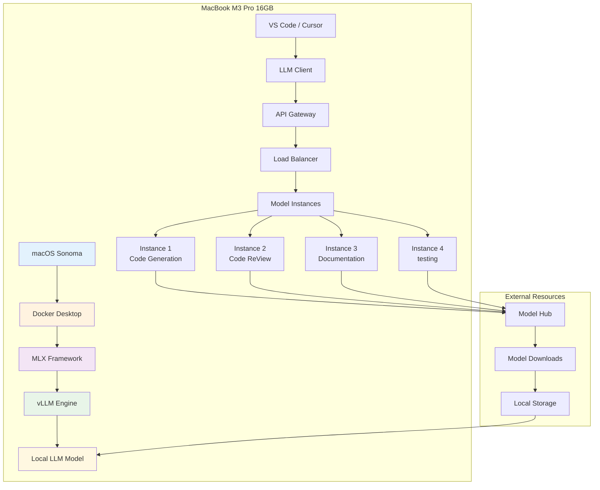

#configuring parallel calculations of LLM on MacBook M3 Pro: Docker + vLM + MLX

**Author:** Shcherbyna Rostyslav
**Date:** 2024

## Who Local LLM for coding - Future of development

### ♪ The importance of local LLMs for effective coding

```mermaid
graph TD
A [Elaborator] -> B {Use local LLM?}

B--~ ~ No~ C[90% waste of time]
C --> D[>dependency from the Internet<br/> Joint responses]
C --> E[> Confidentiality<br/> Code sent in cloud]
C --> F[\\\\\\\\\\API\br/> Query limits]
C --> G[\\\\\\\\br/>Plata for each request]

B -->\\\\H[10% effective developers]
H --> I[> Instant response <br/> Local processing]
H --> J[> Full confidentiality<br/> Code remains local]
H -> K[~ Unlimited use <br/> Without API limits]
H -> L[\\\\br/> One-time conference]

 I --> M[MacBook M3 Pro 16GB]
 J --> N[Docker + vLLM + MLX]
K --> O [Parallel calculations]
L --> P [Optimization for Apple Silicon]

M --> Q [Power local LLM]
 N --> Q
 O --> Q
 P --> Q

Q -> R[~ Code development]

 style A fill:#e3f2fd
 style H fill:#c8e6c9
 style C fill:#ffcdd2
 style R fill:#4caf50
```

Because they rely on cloud API with constraints, slow answers, and privacy issues.

### What does local LLM confer?

- **Speed**: Quick answers without delay network
- ** Confidentiality**: Code never leaves your computer
- ** Savings**: One-time configuring instead of constant payments
- ** Infinity**: No limit on the number of requests

## Architecture solutions: Docker + vLM + MLX

### ♪ Common architecture system



♪## ♪ System components ♪

1. **Docker Desktop**: Containerization and isolation
2. **MLX Framework**: Optimizing for Apple Silicon
3. **vLLM Engineering**: High-end Inference
4. **Local LLM Model**: Local model for coding

# The stepwise installation

### Step 1: Preparation of system

#### 1.1 installation Docker Desktop

```bash
# We're downloading Docker Desktop for Apple Silicon
curl -L "https://desktop.docker.com/mac/main/arm64/Docker.dmg" -o ~/Downloads/Docker.dmg

# Fix and Setting
hdiutil attach ~/Downloads/Docker.dmg
sudo cp -R /Volumes/Docker/Docker.app /applications/
hdiutil detach /Volumes/Docker

# Launchay Docker Desktop
open /applications/Docker.app
```

#### 1.2 configuration Docker for Apple Silicon

```yaml
# docker-compose.yml
Version: '3.8'
services:
 vllm-server:
image: vlm/vlm-openai:latest # Official image of vLM with support of OpenAI API
 platform: linux/arm64 # platform for Apple Silicon (M1/M2/M3)
 ports:
- "8000:8000" # Port spill: external: interior
 volumes:
- ./models:/models # Mounting folder with models
- ./cache:/cache #Cause for accreditation
 environment:
- CUDA_VISIBLE_DEVICES=" # Disable CUDA (not needed for Apple Silicon)
- VLLM_USE_MODELSCOPE=false # Disable ModelScope (Use HuggingFace)
 command: >
--model /models/codellama-7b-instruct # Way to Model in Container
--host 0.0.0.0 # Link to all interfaces
--port 8,000 # Port inside the container
--tensor-parallel-size 1 #Tensor parallelism (1 for M3 Pro)
--gpu-memory-utilisation 0.8 # Use 80 % GPU memory
--max-model-len 4096 # Maximum context length
--trust-remote-code # Allow implementation of user code
```

### Detailed descriebe of the Docker configuration

♪### Main container items ♪
- **'image'**: `vllm/vlm-openai:latest' is the official image of vLM with support for OpenAI-compatible API
- ** `platform'**: `linux/arm64' - indicates Docker to use the ARM64 architecture for Apple Silicon
- ** `ports'**: `"8000:8000'' ` - port with host on container for access to API

#### parameters of volumes (volumes):
- **/models:/models'** - installs a local folder with models in container
Left route ('./models') - folder on host
- Right-hand path (`/models') - folder inside the container
- **/cache:/cache'** - installs a cache folder for model downloading

#### Changing environment:
- ** `CUDA_VISIBLE_DEVICES=" `** - Disables CUDA (not supported on Apple Silicon)
- ** `VLLM_use_MODELSCOPE=false'** - Disables ModelScope, Use HuggingFace Hub

#### parameters vLLM team:
- ** `--model'**: Model path inside the container
** `--host 0.0.0.0'**: Link to all network interfaces (external access)
- **'-port 8000'**: Port for API inside container
** `--tensor-parallel-size 1'**: Number of GPUs for parallelism (1 for M3 Pro)
** `---gpu-memory-utilisation 0.8'**: Use of 80% of the available GPU memory
** `--max-model-len 4096'**: Maximum context length in currents
** `--trust-remote-code'**: Allows the implementation of the user code from the model

#### Step 2: installation MLX Framework

#### 2.1 installation MLX

```bash
# Setting MLX through pip
pip install mlx mlx-lm

# Or through the conda
conda install -c conda-forge mlx
```

#### 2.2 configuration MLX for vLLM

```python
# mlx_config.py
import mlx.core as mx
import mlx.nn as nn
from mlx_lm import load, generate

class MLXvLLMAdapter:
 def __init__(self, model_path: str):
 """
Initiating an MLX adapter for vLM

 Args:
model_path (str): Path to model for download
 """
 self.model, self.tokenizer = load(model_path)
Self.model.eval() # Translate Model into Inference Mode

 def generate_code(self, prompt: str, max_tokens: int = 512):
 """
Code generation with use of MLX optimized Inference

 Args:
Prompt (str): Entry Prompt for Generations
max_tokens (int): Maximum number of currents for generation

 Returns:
str: Code generated
 """
 tokens = self.tokenizer.encode(prompt)

 # MLX optimized generation
 response = generate(
 self.model,
 self.tokenizer,
 prompt,
 max_tokens=max_tokens,
temp=0.7 # Temperature for creative control
 )

 return response
```

### Detailed descriebe of the MLX configuration

#### Basic components MLX:
- **'mlx.core'**: Main model MLX for work with densors and operations
- **'mlx.nn'**: model of neural networks MLX
- **'mlx_lm'**: Specialized library for work with language models

#### parameters of the MLXvLMApter class:

##### `__init__(self, model_path: str)`:
- **'model_path'**: Path to model files
- Supported formats: HuggingFace, PyTorch, ONNX
- Recommended: `/models/codellama-7b-instruct'
- Automatically uploads configuration, weights and currentizer

##### `generate_code(self, prompt: str, max_tokens: int = 512)`:
- **'prompt'**: Input text for generation
- May contain tools, examples code, context
- Recommended format: "Write a function for..."
- **'max_tokens'**: Maximum number of currents in response
- default value: 512
- Recommended range: 100-2048
- More currents = longer answer but slower generation

#### parameters functions `generate()`:
- **'model'**: Upload MLX
- **'tokenizer'**: Tokenizer for conversion of text in current
- **'prompt'**: Reference propt
- **'max_tokens'**: Maximum response length
- ** `temp'**: Generation temperature (0.7)
- Range: 0.0 - 2.0
- 0.0 = determinated generation
- 0.7 = balanced creativity
- 1.0+ = High creativity but less predictable

### Step 3: configuring vLM

#### 3.1 create Dockerfile for vLLM

```dockerfile
# Dockerfile.vllm
FROM python:3.9-slim

# Setting System Dependencies
RUN apt-get update && apt-get install -y \
 git \
 build-essential \
 && rm -rf /var/lib/apt/Lists/*

# Setting vLM with Apple Silicon support
RUN pip install vllm[apple] --extra-index-url https://download.pytorch.org/whl/cpu

# Creating the work directorate
WORKDIR /app

# Copy configuration
COPY vllm_config.py .
COPY start_server.py .

# Open the port
EXPOSE 8000

# Launch the server
CMD ["python", "start_server.py"]
```

##### 3.2 configuring vLM server

```python
# start_server.py
import argparse
from vllm import LLM, SamplingParams
from vllm.engine.arg_utils import AsyncEngineArgs
from vllm.engine.async_llm_engine import AsyncLLMEngine
import asyncio

async def main():
parser = Argparse.ArgumentParser(describe="vLM server for MacBook M3 Pro")

# Main variables model
 parser.add_argument("--model", type=str, default="codellama-7b-instruct",
Help="A path to the model or the name of the HuggingFace model")
 parser.add_argument("--tensor-parallel-size", type=int, default=1,
Help="Number of GPU for Tensor Parallelism (1 for M3 Pro)")
 parser.add_argument("--gpu-memory-utilization", type=float, default=0.8,
Help="GPU memory share for use (0.0-1.0))
 parser.add_argument("--max-model-len", type=int, default=4096,
Help="The maximum length of the model context in currents")

# Network parameters
 parser.add_argument("--host", type=str, default="0.0.0.0",
Help="IP address for server linkage")
 parser.add_argument("--port", type=int, default=8000,
Help = Port for API server)

 args = parser.parse_args()

# Creating energy with optimization for Apple Silicon
 engine_args = AsyncEngineArgs(
 model=args.model,
 tensor_parallel_size=args.tensor_parallel_size,
 gpu_memory_utilization=args.gpu_memory_utilization,
 max_model_len=args.max_model_len,
 trust_remote_code=True,
# Optimizing for Apple Silicon
 enforce_eager=True,
 disable_custom_all_reduce=True,
 )

# Initiating the engine
 engine = AsyncLLMEngine.from_engine_args(engine_args)

print(f"\vLM server launched on {args.host}:{args.port}})
(f) Optimized for Apple Silicon)
(pint(f"\\\args.model}})
Print(f"\\\\[args.gpu_memory_utilisation*100}})

if __name__ == "__main__":
 asyncio.run(main())
```

### Detailed describe parameters vLM server

#### Main parameters of the model:

##### `--model` (str, default: "codellama-7b-instruct"):
- ** Designation**: A path to the or model name of the HuggingFace Hub model
- ** Supported formats**:
Local route: `'/models/codellama-7b-instruct''
 - HuggingFace ID: `"codellama/CodeLlama-7b-Instruct-hf"`
- Full route: `/ful/path/to/model'
- ** Recommendations**:
- for coding: `'codellama-7b-instruct'' `or `'wizardcoder-15b-v1.0''
- for general purposes: `Allama-2-7b-hat' `or ``Mistral-7b-instruct''

##### `--tensor-parallel-size` (int, default: 1):
- ** Designation**: Number of GPUs for Tensor Parallelism
- ** Values**:
- `1' for MacBook M3 Pro (single GPU)
- `2+' - for systems with several GPUs
- ** Impact on performance**:
- More GPU = faster inference, but more memory consumption
- for M3 Pro recommended retained `1'

##### `--gpu-memory-utilization` (float, default: 0.8):
- ** Designation**: share of GPU memory for model use
- **band**: 0.0 - 1.0
- ** Recommendations for M3 Pro 16GB**:
`0.75' (12GB) - optimal for stable work
- `0.8' (12.8GB) - maximum performance
- `0.6' (9.6GB) - if memory is needed for other tasks
- **Effect**: More memory = more context but less memory for system

##### `--max-model-len` (int, default: 4096):
- ** Designation**: Maximum length of context in currents
- ** Recommended values**:
- `2048' - for quick work, short requests
`4096' - balanced version (recommended)
- `8192' for long contexts but slower
- **Effect on memory**: Increases squarely with the length of the context

♪ ### Network parameters:

##### `--host` (str, default: "0.0.0.0"):
- ** Designation**: IP address for server linkage
- ** Values**:
`'0.0.0.0' ` - external access (recommended)
`"127.0.0.1' ` - local access only
`"192.168.1.100"' is the specific IP address

##### `--port` (int, default: 8000):
- ** Designation**: Port for API servers
- ** Recommendations**:
`8000' is the standard port for vLM
`8080' alternative port
`3000' is the port for development
- **check accessibility**: `lsof -i :8000'

#### Parameters Optimization for Apple Silicon:

##### `trust_remote_code=True`:
- ** Designation**: Allows the execution of the user code from the model
- ** Safety**: Include only for tested models
- ** Necessary**: Required for most modern models

##### `enforce_eager=True`:
- ** Designation**: Forced use of eger exposure
- ** Benefits**: Best compatibility with Apple Silicon
- ** Disadvantages**: A little slower than grape execation

##### `disable_custom_all_reduce=True`:
- ** Designation**: Disables caste operations all_rudece
- ** Cause**: not supported on Apple Silicon
- **Effect**: Minimum for single-GPU configuration

### Step 4: Loading and configuring the model

#### 4.1 Selection of the optimal model for coding

```mermaid
graph LR
A [models for coding] --> B [CodeLlama-7B]
 A --> C[CodeLlama-13B]
 A --> D[CodeLlama-34B]
 A --> E[WizardCoder-15B]
 A --> F[StarCoder-15B]

B --> G[> Rapid downloads <br/> low memory consumption <br/> Good code quality]
C --> H['Best quality `br/' More memory `br/' ‘Slowly]
D --> I[\\\\\\br/\\\\\\\\\\br/\\\\\\\\\\\\\\\\\\\\\\\\\\\\\\\\\\\\\\\\\\\\\\\\\\\\\\\\\\\\\\\\\\\\\\\\\\\\\\\\\\\\\\\\\\\\\\\\\\\\\\\\\\\\\\\\\\\\\\\\\\\\\\\\\\\\\\\\\\\\\\\\\\\\\\\\\\\\\\\\\\\\\\\\\\\\\\\\\\\\\\\\\\\\\\\\\\\}I=I===I===S=======S=========I=I=I==I=I=I====I=I=I=I=I=I}I} I}I===================================================================================================================================================================================================================================
E --> J[
F --> K[

 style G fill:#c8e6c9
 style H fill:#fff3e0
 style I fill:#ffcdd2
 style J fill:#c8e6c9
 style K fill:#c8e6c9
```

#### 4.2 Model loading script

```python
# download_model.py
import os
import requests
from huggingface_hub import hf_hub_download
from tqdm import tqdm

def download_codellama_model():
 """Download CodeLlama model optimized for MacBook M3 Pro"""

 model_name = "codellama/CodeLlama-7b-Instruct-hf"
 local_dir = "./models/codellama-7b-instruct"

 print("🔄 Loading CodeLlama-7B-Instruct...")
printh("\\\\\\\\\\\\\\\\\\\\\\\\\\\\\\\\\\\\\\\\\\\\\\\\\\\\\\\\\\\\\\\\\\\\\\\\\\\\\\\\\\\\\\\\\\\\\\\\\\\\\\\\\\\\\\\\\\\\\\\\\\\\\\\\\\\\\\\\\\\\\\\\\\\\\\\\\\\\\\\\\\\\\\\\(\\\\\\\\\\\\\\\\\\\\\\\\\\\\\\\\\\\\\\\\\\\\\\\\\\\\\\\\\\\\\\\\\\\\\\\\\\\\\\\\\\\\\\\\\\\\\\\\\\\\\\\\\\\\\\\\\\\\\\\\\\\\\\\\\\\\\\\\\\\\\\\\\\\\\\\\\\\\\\\\\\\\\\\\\\\\\\\\\\\\\\\\\\\\\\\\\\\\\\\\\\\\\\\\\\\\\\\\\\\\\\\\\\\\\\\\\\\\\\\\\\\\\\\\\\\\\\\\\\\\\\\\\\\\\\\\\\\\\\\\\\\\\\\\\\\\\\\\\\\\\\\\\\\\\\\\\\\\\\\\\\\\\\\\\\\\\\\\

 try:
# Creating directory
 os.makedirs(local_dir, exist_ok=True)

# Loading model
 model_path = hf_hub_download(
 repo_id=model_name,
 local_dir=local_dir,
 local_dir_Use_symlinks=False
 )

print(f'\\\\\\\\\\(model_path}})
"Prepared for use!"

 return model_path

 except Exception as e:
Print(f"~ load request: {e}}
 return None

if __name__ == "__main__":
 download_codellama_model()
```

### Step 5: configuring parallel calculations

#### 5.1 configuration for MacBook M3 Pro

```python
# parallel_config.py
import multiprocessing as mp
import psutil
import platform

class MacBookM3ProConfig:
"Optimal Conference for MacBook M3 Pro 16GB"

 def __init__(self):
 self.cpu_cores = mp.cpu_count()
 self.memory_gb = psutil.virtual_memory().total // (1024**3)
 self.architecture = platform.machine()

# Optimal Settings for M3 Pro
 self.optimal_config = {
"tensor_parallel_size": 1, #M3Pro has a single GPU
 "pipeline_parallel_size": 1,
 "gpu_memory_utilization": 0.75, # 75% from 16GB = 12GB
"cpu_cores_use": min(8), elf.cpu_cores, # Use 8 kernels
 "max_model_len": 4096,
 "batch_size": 4,
 "max_tokens": 512,
 "temperature": 0.7,
 "top_p": 0.9,
 }

 def get_optimized_config(self):
"Returns the optimized configuration""
 return self.optimal_config

 def print_system_info(self):
""""""""""""""""""""""
print(("~ System information:")
(pint(f" CPU kernels: {self.cpu_cores}})
print(f" Memory: {self.memory_gb}GB)
 print(f" architecture: {self.architecture}")
print(f" Operating system: {platform.system()} {platform.release()}})

"print("\n\\\ optimal conference:")
 for key, value in self.optimal_config.items():
 print(f" {key}: {value}")

# Use
config = MacBookM3ProConfig()
config.print_system_info()
```

### Detailed descriebe optimization parameters for MacBook M3 Pro

#### parameters parallelism:

##### `tensor_parallel_size` (int, default: 1):
- ** Designation**: Number of GPUs for Tensor Parallelism
- **for M3 Pro**: Always `1' (one GPU)
- ** Impact on performance**:
`1' is optimal for M3 Pro
- `2+' -not supported on M3 Pro
- ** Memory**:not affects on memory consumption

##### `pipeline_parallel_size` (int, default: 1):
- ** Designation**: Number of steps of pipeline for processing
- **for M3 Pro**: Always `1' (one step)
- **Effect**: Increases delay but can reduce memory consumption
- ** Recommendation**: Leave `1' for M3 Pro

#### parameters memory:

##### `gpu_memory_utilization` (float, default: 0.75):
- ** Designation**: share of GPU memory for model use
- **Budget for M3 Pro 16GB**: 0.75 x 16GB = 12GB
- ** Recommendations**:
`0.75' (12GB) - optimal for stable work
- `0.8' (12.8GB) - maximum performance
- `0.6' (9.6GB) - if memory is needed for other tasks
- **Effect on system**: The remaining 4GB for machos and other applications

#### parameters CPU:

##### `cpu_cores_usage` (int, calculated: min(8, cpu_cores)):
- ** Designation**: Number of CPU kernels for processing
- **for M3 Pro**: Usually 8-12 kernels, used 8
- ** Impact on performance**:
- More kernels = faster treatment
- But more kernels = more energy consumption
- **Recommendation**: 8 kernels - optimal balance

#### parameters model:

##### `max_model_len` (int, default: 4096):
- ** Designation**: Maximum length of context in currents
- **Effect on memory**: Quadratic increase in memory consumption
- ** Recommendations for M3 Pro**:
- `2048' - for quick work (4GB memory)
- `4096' is a balanced version (8GB memory)
- `8192' for long contexts (16GB memory)

##### `batch_size` (int, default: 4):
- ** Designation**: Number of requests for parallel processing
- ** Impact on performance**:
- More batch = better disposal of GPU
- But more batch = more memory consumption
- ** Recommendations**:
- `2' - for memory savings
`4' is optimal for M3 Pro
- `8' - for maximum performance

#### parameters generation:

##### `max_tokens` (int, default: 512):
- ** Designation**: Maximum length of text generated
- **Effects on time**: More currents = longer generation
- ** Recommendations**:
- `256' - for short answers
- `512' - balanced
- `1024' for long answers

##### `temperature` (float, default: 0.7):
- ** Designation**: Control of the creativity of generation
- **band**: 0.0 - 2.0
- ** Values**:
`0.0' - Determinated generation
`0.7' is the balanced creativity
`1.0' is the high creativity
- `1.5+' - very high creativity

##### `top_p` (float, default: 0.9):
- ** Designation**: Nucleus Sampling - Top-p % Probability Choice
- **band**: 0.0 - 1.0
- ** Values**:
- `0.1' is a very conservative generation
`0.9' is a balanced generation
`1.0' is the full current dictionary

#### 5.2 configuring parallel processes

```python
# parallel_llm.py
import asyncio
import aiohttp
import json
from concurrent.futures import ThreadPoolExecutor
from typing import List, Dict, Any

class ParallelLLMProcessor:
""""""""""""""""""""""""""""""""""""""""""""""""""""""""""""""""""""""""""""""""""""""""""""""""""""""""""""""""""""""""""""""""""""""""""""""""""""""""""""""""""""""""""""""""""""""""""""""""""""""""""""""""""""""""""""""""""""")"""""""""""""""""""""""""""""""""""""""""""""""""""""""""""""""""""""""""""""""""""""""""""""""""""""""""""""""""""""""""""""""""""""""""""""""""""""""""""""""""""""""""""""""""""""""""""""""""""""""""""""""""""""""""""""""""""""""""""""""""""""""""""""""""""""""""""""""""""""""""

 def __init__(self, base_url: str = "http://localhost:8000"):
 self.base_url = base_url
 self.session = None
 self.executor = ThreadPoolExecutor(max_workers=4)

 async def __aenter__(self):
 self.session = aiohttp.ClientSession()
 return self

 async def __aexit__(self, exc_type, exc_val, exc_tb):
 if self.session:
 await self.session.close()

 async def generate_code_async(self, prompt: str, **kwargs) -> str:
"Asynchronous Code Generation."
 payload = {
 "prompt": prompt,
 "max_tokens": kwargs.get("max_tokens", 512),
 "temperature": kwargs.get("temperature", 0.7),
 "top_p": kwargs.get("top_p", 0.9),
 "stream": False
 }

 async with self.session.post(
 f"{self.base_url}/v1/completions",
 json=payload,
 headers={"Content-Type": "application/json"}
 ) as response:
 result = await response.json()
 return result["choices"][0]["text"]

 async def process_multiple_requests(self, requests: List[Dict[str, Any]]) -> List[str]:
"""""""""""" "Parallel processing multiple requests""""
 tasks = []

 for req in requests:
 task = self.generate_code_async(
 req["prompt"],
 **req.get("params", {})
 )
 tasks.append(task)

 results = await asyncio.gather(*tasks)
 return results

 def process_sync(self, prompt: str, **kwargs) -> str:
""Synchronous (for compatibility)""
 loop = asyncio.new_event_loop()
 asyncio.set_event_loop(loop)

 try:
 return loop.run_until_complete(
 self.generate_code_async(prompt, **kwargs)
 )
 finally:
 loop.close()

# Example of use
async def main():
 async with ParallelLLMProcessor() as processor:
# Parallel processing of multiple requests
 requests = [
 {
"prompt": "Write the function for sorting the array on Python,"
 "params": {"max_tokens": 200}
 },
 {
"prompt": "Bring a class for work with data,"
 "params": {"max_tokens": 300}
 },
 {
"prompt": "Write a test for functions satisfaction email,"
 "params": {"max_tokens": 150}
 }
 ]

 results = await processor.process_multiple_requests(requests)

 for i, result in enumerate(results):
"Result {i+1}:")
 print(result)
 print("-" * 50)

if __name__ == "__main__":
 asyncio.run(main())
```

## integration with IDE

### VS Code / Cursor integration

##### 6.1 configuring expansion

```json
// Settings.json for VS Code
{
 "llm.local.endpoint": "http://localhost:8000/v1/completions",
 "llm.local.model": "codellama-7b-instruct",
 "llm.local.temperature": 0.7,
 "llm.local.max_tokens": 512,
 "llm.local.timeout": 30,
 "llm.local.retry_attempts": 3,
 "llm.local.enable_parallel": true,
 "llm.local.max_concurrent_requests": 4
}
```

#### 6.2 Script for Automatic Launch

```bash
#!/bin/bash
# start_llm_server.sh

echo "\\Launch local LLM for coding on MacBook M3 Pro"
echo "..improved for Apple Silicon"

# checking Docker
if ! docker info > /dev/null 2>&1; then
"Echo: "Docker not launched. Launchae Docker Desktop..."
 open /applications/Docker.app
 sleep 10
fi

# Checking model
if [ ! -d "./models/codellama-7b-instruct" ]; then
echo "the nofund model. Loading..."
 python download_model.py
fi

# Launch the container
echo, "\\Launcha vLM container..."
docker-compose up -d

# Waiting for Launcha
echo "\\\\\\\\\\\\\\\\\\\\\\\\\\\\\\\\\\\\\\\\\\\\\\\\\\\\\\\\\\\\\\\\\\\\\\\\\\\\\\\\\\\\\\\\\\\\\\\\\\\\\\\\\\\\\\\\\\\\\\\\\\\\\\\\\\\\\\\\\\\\\\\\\\\\\\\\\\\\\\\\\\\\\\\\\\\(\\\\\\\\\\\\\(\\\\\\\\\\\(\\\\\\\\\\\\\\\(\\\\\\\\\\\\\\\\\\\\\\\\\\\\(\\\(\(\\\\\\\\\\\(\\\\\\\\\\\\\\\\\\\\\\\\\\\\\\\\\\\\\\\\\\\\\\\(((((((((((((\/\\\\\\\\\/\\/\/\/\\\\\\/((((\\/((((\/((((((\)}}}}}}}}}}}}}}}}}(((((((((((((((((((((((\)}\)}}}}}}}}}}}}}}}}}(((((((((((((((((((((((((((()}}}}}}}}}}}}}}}}}}}}}}}}}}((((((((((((((((((((((
sleep 30

# Checking status
if curl -s http://localhost:8000/health > /dev/null; then
"The server is running and ready to work!"
echo "\API appeal at http://localhost:8000"
 echo "📚 documentation: http://localhost:8000/docs"
else
echo '\\\\\\\\\\\\\\\\\\\\\\\\\\\\\\\\\\\\\\\\\\\\\\\\\\\\\\\\\\\\\\\\\\\\\\\\\\\\\\\\\\\(\\\\\\\\\\\\\\\\\\\\\\(\\\\\\\\\\\\\\\\\\\\\(\\\\\\\\\\\\\\(\\\\\\\\\\\\\\\\\\\\\\(\\\\\\\\\\\\\\(\\\\\\\\\\(\\\\\\\\\\\\\\\(\\\\\\\\\\((\\\\\\(\\\\\\\\\\\\/\((((\))))((((\))))))(((\(\))))(((\/)))))((((\)))))))(((((\))))))))((((())))))))))(((((((\)))))))((((\)))))))((((()))))
 exit 1
fi
```

## Monitoring and optimization

### 7.1 Monitoring performance

```python
# Monitoring.py
import psutil
import time
import requests
from datetime import datetime
import json

class LLMMonitor:
"Monitoring performance local LLM""

 def __init__(self, api_url: str = "http://localhost:8000"):
 """
Initiating LLM Monitor

 Args:
api_url (str): URL API vLM server
 """
 self.api_url = api_url
 self.metrics = []

 def get_system_metrics(self):
 """
Gets metrics system

 Returns:
dict: Vocabulary with metrics
 """
 return {
 "timestamp": datetime.now().isoformat(),
 "cpu_percent": psutil.cpu_percent(interval=1),
 "memory_percent": psutil.virtual_memory().percent,
 "memory_Used_gb": psutil.virtual_memory().Used / (1024**3),
 "memory_available_gb": psutil.virtual_memory().available / (1024**3),
 "disk_usage_percent": psutil.disk_usage('/').percent,
 }

 def get_llm_metrics(self):
 """
Gets metrics LLM servers

 Returns:
dict: Vocabulary with LLM metrics or error
 """
 try:
 response = requests.get(f"{self.api_url}/metrics", timeout=5)
 return response.json()
 except:
Retorn {error': "not succeeded in getting metrics LLM"]

 def test_response_time(self, prompt: str = "Hello, world!"):
 """
Test LLM response time

 Args:
Prompt (str): test prompt for verification

 Returns:
dict: Test results performance
 """
 start_time = time.time()

 try:
 response = requests.post(
 f"{self.api_url}/v1/completions",
 json={
 "prompt": prompt,
 "max_tokens": 50,
 "temperature": 0.7
 },
 timeout=30
 )

 end_time = time.time()
 response_time = end_time - start_time

 return {
 "response_time": response_time,
 "status_code": response.status_code,
 "success": response.status_code == 200
 }
 except Exception as e:
 return {
 "response_time": None,
 "error": str(e),
 "success": False
 }

 def run_Monitoring_cycle(self):
 """
Launch Monitoring Cycle

 Returns:
dict: data of the current Monitoring cycle
 """
 system_metrics = self.get_system_metrics()
 llm_metrics = self.get_llm_metrics()
 response_test = self.test_response_time()

 cycle_data = {
 "system": system_metrics,
 "llm": llm_metrics,
 "response_test": response_test
 }

 self.metrics.append(cycle_data)

# Bringing out the current metrics
 print(f"📊 Monitoring - {datetime.now().strftime('%H:%M:%S')}")
 print(f" CPU: {system_metrics['cpu_percent']:.1f}%")
print(f) Memory: {system_metrics['memory_percent']:.1f}%({system_metrics['memory_Used_gb']:1f}GB)
Print(f" Response time: {response_test.get('response_time', 'N/A'):2f}s")
 print(f" Status: {'✅' if response_test.get('success') else '❌'}")
 print("-" * 50)

 return cycle_data

# Launch Monitoring
monitor = LLMMonitor()

# Launchai Monitoring in the background
import threading
import time

def Monitoring_loop():
 while True:
 monitor.run_Monitoring_cycle()
time.sleep(60) # Every minutes

Monitoring_thread = threading.Thread(target=Monitoring_loop, daemon=True)
Monitoring_thread.start()
```

### Detailed describe parameters Monitoring

#### parameters initialization:

##### `api_url` (str, default: "http://localhost:8000"):
- ** Designation**: URL address of the vLM API server
- **Format**: `http://host:port'
- **examples**:
- `'http://localhost:8000''' - local server
- `'http://192.168.1.100:8000'' - Remote server
- `'https://api.example.com'' - HTTPS server
- **check access**: `curl http://localhost:8000/health'

#### metrics system:

##### `cpu_percent` (float):
- ** Designation**: Percentage of use of CPU
- **band**: 0.0 - 100.0
- ** Interpretation**:
- `0-30%' = low load
- `30-70 %' = normal load
- `70-90 %' - high load
`90-100 per cent critical load'
- **Method of measurement**: `psutil.cpu_percent(interval=1)'

##### `memory_percent` (float):
- ** Designation**: Percentage of use of operational memory
- **band**: 0.0 - 100.0
- ** Critical**:
- `>90%' - memory risk
- `>95%' - critical memory deficit
- **for M3 Pro 16GB**: It is recommended to hold <85%

##### `memory_Used_gb` (float):
- ** Designation**: used memory in gigabytes
- **calculation**: `psutil.virtual_memory().Used / (1024**3) `
- **for M3 Pro 16GB**: Normal 8-12GB

##### `memory_available_gb` (float):
- ** Designation**: Available memory in gigabytes
- ** Critical**: <2GB for M3 Pro
- **Recommendation**: Hold >4GB for stable work

##### `disk_usage_percent` (float):
- ** Designation**: Percentage use of disc
- ** Critical**:
- `>90%' - little space on disk
- `>95%' - Critically low space
- **Effect**: May slow down the system

#### metrics LLM server:

##### `response_time` (float):
- ** Designation**: Response time on request in seconds
**Measurement**: from sending a request to receive a reply
- ** Recommended values**:
`<1s' is an excellent performance
- `1-3s' is good performance
- `3-10s' - acceptable performance
- `>10s' is a slow Working

##### `status_code` (int):
- ** Designation**: HTTP response code status
- ** Values**:
`200' is a successful request
`400' is an error in request
`500' is the internal error of the server
- `503' is a server not available

##### `success` (bool):
- ** Designation**: success of the request
- ** Value**: `True' if `status_code ==200'
- ** Use**: for system performance determination

#### parameters testing:

##### `prompt` (str, default: "Hello, world!"):
- ** Designation**: test prompto for verification performance
- ** Recommendations**:
- Short prompt for rapid testing
- Standard prompt for comparison of results
- Can be changed on a more specific one.

##### `max_tokens` (int, default: 50):
- ** Designation**: Maximum number of currents in tests response
- **Influence**: More currents = longer than test
- **Recommendation**: 50 currents for rapid testing

##### `temperature` (float, default: 0.7):
- ** Designation**: Temperature for test generation
- **Effluence**:not affects on response time, only on quality
- ** Recommendation**: Standard value 0.7

#### Parameters Monitoringa:

##### `timeout` (int, default: 30):
- **Design**: Timeout for HTTP requests in seconds
- ** Recommendations**:
- `5s' - for quick checks
- `30s' - for complete tests
- `60s' - for slow systems

##### `interval` (int, default: 60):
- ** Designation**: Interval between cycles of Monitoring in seconds
- ** Recommendations**:
- `30s' - for detailed Monitoring
- `60s' - for normal Monitoring
- `300s' - for periodic monitoring

### 7.2 Optimization for MacBook M3 Pro

```python
# optimization.py
import subprocess
import psutil
import platform

class MacBookM3ProOptimizer:
"Optimization for MacBook M3 Pro"

 def __init__(self):
 """
Initiating an optimizer for MacBook M3 Pro

Automatically defines the characteristics of the system:
- Processor architecture
- Operational memory capacity
- Number of CPU kernels
 """
 self.architecture = platform.machine()
 self.memory_gb = psutil.virtual_memory().total // (1024**3)
 self.cpu_cores = psutil.cpu_count()

 def optimize_docker_Settings(self):
 """
Optimizes Settings Docker for MacBook M3 Pro

 Returns:
dict: Optimized configurization Docker
 """
"Breathing Docker for MacBook M3 Pro..."

# Increase memory limits for Docker
memory_limit = min(12, Self.memory_gb-4) # Leave 4GB for the system

 docker_config = {
 "memory": f"{memory_limit}GB",
 "cpus": min(8, self.cpu_cores),
 "disk_size": "100GB",
 "experimental": True,
 "features": {
 "buildkit": True,
 "containerd": True
 }
 }

print(f" Memory for Docker: {memory_limit}GB)
(pint(f" CPU kernels: {min(8), elf.cpu_cores}})

 return docker_config

 def optimize_vllm_Settings(self):
 """
Optimizes Settings vLM for Apple Silicon

 Returns:
dict: Optimized configurization vLM
 """
"Print("\\\\\\\\lLLM for Apple Silicon...")

# Optimal Settings for M3 Pro
 vllm_config = {
 "tensor_parallel_size": 1,
 "pipeline_parallel_size": 1,
 "gpu_memory_utilization": 0.75,
 "max_model_len": 4096,
 "batch_size": 4,
 "max_tokens": 512,
 "temperature": 0.7,
 "top_p": 0.9,
 "frequency_penalty": 0.0,
 "presence_penalty": 0.0,
 "stop": ["<|endoftext|>", "<|end|>"],
 "trust_remote_code": True,
 "enforce_eager": True,
 "disable_custom_all_reduce": True,
 }

prent(f" Memory use: {vlm_config['gpu_memory_utilisation']*100}%")
peak(f" Maximum length: {vlm_config['max_model_len']}})
(pint(f) The dimensions of the batch: {vlm_config['batch_size']}}

 return vllm_config

 def optimize_system_Settings(self):
 """
Optimizes System Settings MacOS

Runs system team for optimization:
- Disables CPU energy saving
- Increases the file limits.
 """
pint('\'MacOS system optimization...')

# Disable energy saving for CPU
 subprocess.run([
 "sudo", "pmset", "-a", "disablesleep", "1"
 ], check=False)

# Increase the limits of the files
 subprocess.run([
 "sudo", "Launchctl", "limit", "maxfiles", "65536", "200000"
 ], check=False)

Print("\\\\\\\\\\\\\\\\\\\\\\\\\\\\\\\\\\\\\\\\\\\\\\\\\\\\\\\\\\\\\\\\\\\\\\\\\\\\\\\\\\\\\\\\\\\\\\\\\\\\\\\\\\\\\\\\\\\\\\CU)CU-saving is off)}
Print("\\\\\\\\\\\\\\\\\\\\\\\\\\\\\\\\\\\\\\\\\\\\\\\\\\\\\\\\\\\\\\\\\\\\\\\\\\\\\\\\\\\\\\\\\\\\\\\\\\\\\\\\\\\\\\\\\\\\\\\\\\\\\\\\\\\\\\\\\\\\\\\\\\\\\\\\\\\\\\\\\\\\\\\\\\\\\\\\\\\\\\\\\\\\\\\\\\\\\\\\\\\\\\\\\\\\\\\\\\\\\\\\\\\\\\\\\\\\\\\\\\\\\\\\\\\\\\\\\\\\\\\\\\\\\\\\\\\\\\(\\\\\\\\\\\\\\\\\\\\\\\\\\\\\\\\\\\\\\\\\\\\\\\\\\\\\\\\\\\\\\\\\\\\\\\\\\\\\\\\\\\\\\\\\\\\\\\\\\\\\\\\\\\\\\\\\\\\\\\\\\\\\\\\\\\\\\\\\\\\\\\\\\\\\\\\\\\\\\\\\\\\\\\\\\(\((\\\\\\\\\\\\\\\\\\\\\\\\\\(\\\\\\\\\\\\\\\\\\\\\\\\\\

 def run_full_optimization(self):
 """
Launch full system optimization

 Returns:
dict: Vocabulary with Docker and vLM configurations
 """
"print("\"Launch full optimization for MacBook M3 Pro...")
 print(f" architecture: {self.architecture}")
prent(f) Memory: {self.memory_gb}GB}
(pint(f" CPU kernels: {self.cpu_cores}})
 print()

 docker_config = self.optimize_docker_Settings()
 vllm_config = self.optimize_vllm_Settings()
 self.optimize_system_Settings()

Print('\n\\\\\\\\\\\\\\\en\\\\\\\\\\\\\\\\\\\\\\\\\\\\\\\\\\\\\\\\\\\\\\\ \\\\\\\\\\\\\\\\\\\\\\\\\\\\\\\\\\\\\\\\\\\\\\\\\\\\\\\\\\en)/(\\\\\\\\\\\\ \\\\\\\\\\\\\\\\\\\\\\\\\\\\)R(\\\\\\\\\\\\\\\\\\\)R})/(\\\\\\\\\\\\)R)R(\) ) \)R(\)R(\)Pint(\) \) \) \\\\\\\\\\\\\\\\\\\\\\\\\\\\\\\\\\\\\\\\\\\\\\\\\\\\\\\\\\\\\\\\\\\\\\\\\\\\\\\\\\\\\\\\\\\\\\\\\\\\\\\\\\\\\\\\}\\\\\\\\\\\\\\\\\\\\\\\\\\\\\\\\\\\\\\\\\\\\\\\\\\\\\\\\\\\\\\\\\\\\\\\\\\\\\\\\\\\\\\\\\\\\\\\\\\\\\\\\\\\\\\\\\\\\\\\\\\\\\\\\\\\\\\\\\\\\\\\\\\\\\\\\
"restart Docker Desktop for Change"

 return {
 "docker": docker_config,
 "vllm": vllm_config
 }

# Launch Optimization
optimizer = MacBookM3ProOptimizer()
config = optimizer.run_full_optimization()
```

### Detailed describe optimization parameters

#### parameters Docker optimization:

##### `memory` (str, calculated: f"{memory_limit}GB"):
- ** Designation**: Memory Limited for Docker Containers
== sync, corrected by elderman == @elder_man
- **for M3 Pro 16GB**: Usually 12GB
- **Effect**: More memory = more opportunities for models
- **Recommendation**: Leave 4GB for macOS

##### `cpus` (int, calculated: min(8, cpu_cores)):
- ** Designation**: Number of CPU kernels for Docker
- ** Calculation**: Minimum of 8 and accessible kernels
- **for M3 Pro**: Usually 8 kernels
- **Effect**: More kernels = faster treatment
- **Recommendation**: 8 kernels - optimal balance

##### `disk_size` (str, default: "100GB"):
- ** Designation**: Disc size for Docker
- **Effluence**: More space = more models and cache
- **Recommendation**: 100GB for comfort work

##### `experimental` (bool, default: True):
- ** Designation**: Includes experimental functions Docker
- ** Benefits**: Access to new opportunities
- **Riskey**: May be unstable
- **Recommendation**: Insert for better performance

##### `buildkit` (bool, default: True):
- ** Designation**: Includes BuildKit for image assembly
- ** Benefits**: Faster assembly, better cache
- **Compatibility**: Full compatibility with Apple Silicon

##### `containerd` (bool, default: True):
- ** Designation**: Uses containerd as ringtime
- ** Benefits**: Best performance
- **Compatibility**: Optimized for Apple Silicon

#### parameters vLM optimization:

##### `tensor_parallel_size` (int, default: 1):
- ** Designation**: Testor parallelism
- **for M3 Pro**: Always 1 (one GPU)
- **Effects**:not affects on single-GPU systems

##### `pipeline_parallel_size` (int, default: 1):
- ** Designation**: Pipeline parallelism
- **for M3 Pro**: Always 1
- **Effluence**: Increases delay but can reduce memory

##### `gpu_memory_utilization` (float, default: 0.75):
- ** Designation**: Use of GPU memory
- **calculation for M3 Pro**: 75% from 16GB = 12GB
- ** Recommendations**:
`0.75' - optimum for stability
`0.8' is the maximum performance
- `0.6' - if memory is needed for other tasks

##### `max_model_len` (int, default: 4096):
- ** Designation**: Maximum context length
- **Effect on memory**: Quadratic increase
- ** Recommendations**:
- `2048' - for quick work
- `4096' - balanced
- `8192' for long contexts

##### `batch_size` (int, default: 4):
- ** Designation**: dimension of boot for processing
- **Influence**: More booth = Better disposal of GPU
- ** Recommendations**:
- `2' - for memory savings
`4' is optimal for M3 Pro
- `8' - for maximum performance

##### `max_tokens` (int, default: 512):
- ** Designation**: Maximum response length
- **Effluence**: More currents = longer generation
- ** Recommendations**:
- `256' - for short answers
- `512' - balanced
- `1024' for long answers

##### `temperature` (float, default: 0.7):
- ** Designation**: Creativeity control
- **band**: 0.0 - 2.0
- ** Values**:
`0.0' - Determinated generation
`0.7' is the balanced creativity
`1.0' is the high creativity

##### `top_p` (float, default: 0.9):
- ** Designation**: Nucleus sumpling
- **band**: 0.0 - 1.0
- ** Values**:
`0.1' is a conservative generation
`0.9' is a balanced generation
`1.0' is the full dictionary

##### `frequency_penalty` (float, default: 0.0):
- ** Designation**: Fine for frequency of reoccurrence of currents
- **band**: -2.0 - 2.0
- ** Values**:
- `0.0' - without fine
`0.5' is a moderate fine
`1.0' is a severe fine

##### `presence_penalty` (float, default: 0.0):
- ** Designation**: Fine for the presence of currents
- **band**: -2.0 - 2.0
- ** Values**:
- `0.0' - without fine
`0.5' is a moderate fine
`1.0' is a severe fine

##### `stop` (List, default: ["<|endoftext|>", "<|end|>"]):
- ** Designation**: List of Stop-Tokens
- **Influence**: Stops the generation when the current is met
- ** Recommendation**: Add specific currents for the model

##### `trust_remote_code` (bool, default: True):
- ** Designation**: Allows the implementation of user code
- ** Safety**: Include only for tested models
- ** Necessary**: Required for most modern models

##### `enforce_eager` (bool, default: True):
- ** Designation**: Forced use of eger exposure
- ** Benefits**: Best compatibility with Apple Silicon
- ** Disadvantages**: A little slower

##### `disable_custom_all_reduce` (bool, default: True):
- ** Designation**: Disables caste operations all_rudece
- ** Cause**: not supported on Apple Silicon
- **Effect**: Minimum for single-GPU

#### Systemothers optimization:

##### `disablesleep` (int, default: 1):
- ** Designation**: Disables CPU energy saving
== sync, corrected by elderman == @elder_man
- **Effect**: Prevents the deceleration of CPU
- **Recommendation**: Insert for maximum performance

##### `maxfiles` (tuple, default: (65536, 200000)):
- ** Designation**: Flies limits (soft, rigid)
== sync, corrected by elderman == @elder_man
- **Effect**: Increases the number of open files
- **Recommendation**: Increase for work with large models

♪ Testing performance

♪## 8.1 Benchmark tests

```python
# benchmark.py
import asyncio
import time
import statistics
from typing import List, Dict, Any

class LLMBenchmark:
"Benchmark tests for local LLM."

 def __init__(self, api_url: str = "http://localhost:8000"):
 """
Initiating the LLM Benchmark

 Args:
api_url (str): URL API vLM server
 """
 self.api_url = api_url
 self.test_prompts = [
"Write the function for sorting the array on Python,"
"Get a class for work with data SQLite,"
"Write a test for functions satisfaction email,"
"Bring REST API endpoint for users,"
"Write the function for parsing the JSON file,"
"Bring a decorator for Logs of Functions,"
"Write a function for work with files,"
"Bring class for work with network,"
"Write a function for data encryption,"
"Bring a configuration file for the application"
 ]

 async def test_single_request(self, prompt: str) -> Dict[str, Any]:
 """
Test single request

 Args:
Prompt (str): test prompt

 Returns:
dict: Results of the single request test
 """
 import aiohttp

 start_time = time.time()

 async with aiohttp.ClientSession() as session:
 try:
 async with session.post(
 f"{self.api_url}/v1/completions",
 json={
 "prompt": prompt,
 "max_tokens": 200,
 "temperature": 0.7
 },
 timeout=30
 ) as response:
 result = await response.json()
 end_time = time.time()

 return {
 "success": True,
 "response_time": end_time - start_time,
 "tokens_generated": len(result["choices"][0]["text"].split()),
 "prompt_length": len(prompt.split())
 }
 except Exception as e:
 return {
 "success": False,
 "error": str(e),
 "response_time": None
 }

 async def test_parallel_requests(self, num_requests: int = 5) -> Dict[str, Any]:
 """
Testing parallel requests

 Args:
num_requests (int): Number of parallel requests

 Returns:
dict: Test results of parallel queries
 """
(pint(f") Test {num_requests} of parallel requests...)

 start_time = time.time()

# Doing tasks for parallel implementation
 tasks = []
 for i in range(num_requests):
 prompt = self.test_prompts[i % len(self.test_prompts)]
 task = self.test_single_request(prompt)
 tasks.append(task)

# Doing all the tasks in parallel
 results = await asyncio.gather(*tasks)

 end_time = time.time()
 total_time = end_time - start_time

# Analysis of results
 successful_requests = [r for r in results if r.get("success")]
 failed_requests = [r for r in results if not r.get("success")]

 if successful_requests:
 response_times = [r["response_time"] for r in successful_requests]
 tokens_generated = sum(r["tokens_generated"] for r in successful_requests)

 return {
 "total_requests": num_requests,
 "successful_requests": len(successful_requests),
 "failed_requests": len(failed_requests),
 "total_time": total_time,
 "avg_response_time": statistics.mean(response_times),
 "min_response_time": min(response_times),
 "max_response_time": max(response_times),
 "tokens_per_second": tokens_generated / total_time,
 "requests_per_second": len(successful_requests) / total_time
 }
 else:
 return {
 "total_requests": num_requests,
 "successful_requests": 0,
 "failed_requests": len(failed_requests),
"error": "All requests have ended with error."
 }

 async def run_full_benchmark(self):
 """
Launch the full benchmarking.

Performs tests:
- Single requests
- Parallel requests
- Analysis of performance
 """
"printh("♪ Launch Local LLM on MacBook M3 Pro")
 print("=" * 60)

# Single request test
"Print("\n\\\\\\\\\Lunished request test:")
 single_results = []
 for i, prompt in enumerate(self.test_prompts[:5]):
print(f) Request {i+1}/5...)
 result = await self.test_single_request(prompt)
 single_results.append(result)

 successful_single = [r for r in single_results if r.get("success")]
 if successful_single:
 single_times = [r["response_time"] for r in successful_single]
(pint(f) of requests received: {len(accessfulful_single)}}}
(f) Average response time: {statistics.mean(single_times):2f}s)
minimum time: {min(single_times): 2f}s}
Print(f" ~ maximum time: {max(single_times): 2f}s)

# Test of parallel requests
print("\n\\\\\\testtests parallel requests:")
 parallel_results = await self.test_parallel_requests(5)

 if parallel_results.get("successful_requests", 0) > 0:
{`accessfulful_requests'}}{paralle_results['total_requests']}}
total time: {paralle_results['total_time']:2f}s}
print(f" ~ average response time: {paralle_results['avg_response_time']:2f}s)
print(f) in second requests: {parallel_effects['requests_per_second']:2f}}
prent(f" ♪ Tokens in second: {parallel_results['tokens_per_second']:2f}}

 print("\n" + "=" * 60)
Print("~ Benchmark complete!")

# Launch benchmarking
async def main():
 benchmark = LLMBenchmark()
 await benchmark.run_full_benchmark()

if __name__ == "__main__":
 asyncio.run(main())
```

♪## Detailed descriebe parameters

#### parameters initialization:

##### `api_url` (str, default: "http://localhost:8000"):
- ** Designation**: URL address of the vLM API server
- **Format**: `http://host:port'
- **examples**:
- `'http://localhost:8000''' - local server
- `'http://192.168.1.100:8000'' - Remote server
- **check access**: `curl http://localhost:8000/health'

#### test prompts:

##### `test_prompts' (List, 10 elements):
- ** Designation**: Set of test prompts for benchmarking
- **Typs of tasks**:
- programming frameworks
- Classes and objects
- Code testing
 - API endpoints
- Data processing
- Decorators.
- Working with files
- Network operations
- The cipher.
 - configuration
- ** Recommendations**: Add specific for your case prompts

#### parameters single request:

##### `prompt` (str):
- ** Designation**: test prompt for generation
- ** Length**: Recommended 10-50 words
- **Complicity**: Average difficulty for realistic testing
- **examples**: Write a function for sorting the array on Python.

##### `max_tokens` (int, default: 200):
- ** Designation**: Maximum number of currents in response
- **Effluence**: More currents = longer generation
- ** Recommendations**:
- `100' - for rapid testing
- `200' - balanced
- `500' - for detailed testing

##### `temperature` (float, default: 0.7):
- ** Designation**: Generation temperature
- **band**: 0.0 - 2.0
- **Effect**:not affects on time, only on quality
- ** Recommendation**: Standard value 0.7

##### `timeout` (int, default: 30):
- **Design**: Timeout for HTTP request in seconds
- ** Recommendations**:
- `10s' - for fast tests
`30s' is the standard timeout
- `60s' - for slow systems

#### parameters parallel testing:

##### `num_requests` (int, default: 5):
- ** Designation**: Number of parallel requests
- **Effect**: More requests = more load
- ** Recommendations**:
- `2-3' - for weak systems
`5' is optimal for M3 Pro
- `10+' - for powerful systems

#### Metrics performance:

##### `response_time` (float):
- ** Designation**: Response time on request in seconds
**Measurement**: from sending a request to receive a reply
- ** Recommended values**:
`<1s' is an excellent performance
- `1-3s' is good performance
- `3-10s' - acceptable performance
- `>10s' is a slow Working

##### `tokens_generated` (int):
- ** Designation**: Number of currents generated
== sync, corrected by elderman == @elder_man
- **Effect**: More currents = more time of generation

##### `prompt_length` (int):
- ** Designation**: Length of input prompt in words
- **calculation**: `len(prompt.split()'
- **Effect**: More prompt = more processing time

##### `success` (bool):
- ** Designation**: success of the request
- ** Value**: `True' if the request is made without error
- ** Use**: for calculation of the percentage of successful requests

#### Aggregated metrics:

##### `total_requests` (int):
- ** Designation**: Total number of requests
- ** Use**: for calculation of the percentage of successful requests

##### `successful_requests` (int):
- ** Designation**: Number of successful requests
- **calculation**: `len([r for r in results if r.get("access")]]
- ** Use**: for calculation of success rate

##### `failed_requests` (int):
- ** Designation**: Number of unsuccessful requests
- **calculation**: `total_requests - accessful_requests'
- ** Use**: for Analysis errors

##### `total_time` (float):
- ** Designation**: Total time to complete all requests
**Measurement**: from beginning to end of parallel test
- ** Use**: for capacity calculation

##### `avg_response_time` (float):
- ** Designation**: Average response time
== sync, corrected by elderman == @elder_man
- ** Use**: for evaluation of performance

##### `min_response_time` (float):
- ** Designation**: Minimum response time
== sync, corrected by elderman == @elder_man
- ** Use**: for better performance evaluation

##### `max_response_time` (float):
- ** Designation**: Maximum response time
== sync, corrected by elderman == @elder_man
- ** Use**: For the assessment of the worst performance

##### `tokens_per_second` (float):
- ** Designation**: current generation rate
== sync, corrected by elderman == @elder_man
- ** Use**: for the evaluation of performance generation

##### `requests_per_second` (float):
- ** Designation**: Capacity to request
- **calculation**: `accessful_requests / total_time'
- ** Use**: for evaluation of the overall performance of the system

## Resolution of problems

### 9.1 Common Issues and Decisions

```mermaid
graph TD
A [Challenge with LLM] --> B {Trouble type}

B --> ♪ Slowly Working ♪ C [Performance problems]
B -->\\\\ immemorial errors\D[Rememorial problems]
B -->\\\\\\\\\\\\\\\\\\\\\\\\\\\\\\\\\\\\\\\\\\\\\\\\\\\\\\\\\\\\\\\\\\E [Launch problems]
B-~ ~ Poor quality ~ F [quality problems]

C --> C1 [Increase gpu_memory_utilisation]
C --> C2 [Lower max_model_len]
C --> C3 [Optimize Docker Settings]

D --> D1 [Decrease gpu_memory_utilization]
D -> D2 [Use a smaller model]
D --> D3 [Increase swap memory]

E --> E1 [Docker status check]
E --> E2 [check ports]
E --> E3 [check Logs Container]

F --> F1 [Temperature]
F --> F2[change top_p]
F --> F3 [Try another model]

 style C fill:#fff3e0
 style D fill:#ffebee
 style E fill:#e3f2fd
 style F fill:#f3e5f5
```

### 9.2 Diagnostic script

```python
# diagnostics.py
import subprocess
import requests
import psutil
import docker
import json
from datetime import datetime

class LLMDiagnostics:
"""""""""""""""""""""""""""""""""""""""""""""""""""""""""""""""""""""""""""""""""""""""""""""""""""""""""""""""""""""""""""""""""""""""""""""""""""""""""""""""""""""""""""""""")"""""""""""""""""""""""""""""""""""""""""""""""""""""""""""""""""""""""""""""""""""""""""""""""""""""""""""""""""""""""""""""""""""""""""""""""""""""""""""""""""""""""""""""""""""""""""""""""""""""""""""""""""""""""""""""""""""""""""""""""""""""""""""""""""""""""""""""""""""""""""""""""""""""""""""""""""""""""""""""""""""""""""""""

 def __init__(self):
 self.docker_client = docker.from_env()

 def check_docker_status(self):
"""""" "Docker's Status Checking"""
 print("🐳 check Docker...")

 try:
 # checking Docker daemon
 self.docker_client.ping()
"Printh(" * Docker Daemon Workinget")

# Checking containers
 containers = self.docker_client.containers.List()
 vllm_containers = [c for c in containers if 'vllm' in c.name.lower()]

 if vllm_containers:
(pint(f) \fundo {len(vlm_containers)} vLM containers)
 for container in vllm_containers:
 print(f" - {container.name}: {container.status}")
 else:
"pint(" ♪ vLM containers not foundations")
 return False

 return True

 except Exception as e:
print(f" ♪ Docker Quest: {e}})
 return False

 def check_system_resources(self):
""Searchs Systems Resources"""
"Print("\n\check system resources...")

 # CPU
 cpu_percent = psutil.cpu_percent(interval=1)
pint(f" CPU use: {cpu_percent:.1f}%")

# Memory
 memory = psutil.virtual_memory()
print(f) Memory: {memory.percent:.1f}%({memory.Used / (1024**3):1f}GB / {memory.total / (1024**3:1f}GB)}

# Disk
 disk = psutil.disk_usage('/')
print(f) Disc: {disk.percent:.1f}%({disk.Used / (1024**3):1f}GB / {disk.total / (1024**3:1f}GB)}

# Checking, is there enough resources
 if memory.percent > 90:
"Print(" * High use of memory!")
 return False

 if disk.percent > 90:
Print("♪ Little space on the disk! ")
 return False

print("\\\\\\\\\\\\\\\\\\\\\\\\\\\\\\\\\\\\\\\\\\\\\\\\\\\\\\\\\\\\\\\\\\\\\\\\\\\\\\\\\\\\\\\\\\\\\\\\\\\\\\\\\\\\\\\///////////////((\// \/ \/// \//// \////////////)
 return True

 def check_api_endpoint(self):
"API Endpoint Checks""
 print("\n🌐 check API endpoint...")

 try:
 # checking health endpoint
 response = requests.get("http://localhost:8000/health", timeout=5)
 if response.status_code == 200:
"print(" \health endpoint responds)"
 else:
"spint(f" \health endpoint returned code: {response.status_code}")
 except:
 print(" ❌ health endpoint not available")

 try:
 # checking completions endpoint
 response = requests.post(
 "http://localhost:8000/v1/completions",
 json={
 "prompt": "Test",
 "max_tokens": 10
 },
 timeout=10
 )

 if response.status_code == 200:
"Printh(" \\CompletionsendpointWorkinget")
 return True
 else:
The code returned: {response.status_code}
 return False

 except Exception as e:
(pint(f" ♪ API Query: {e}})
 return False

 def check_model_files(self):
""Searchs Model Files""
"Print("\n\checkfiles model...")

 model_paths = [
 "./models/codellama-7b-instruct",
 "./models/codellama-7b-instruct/config.json",
 "./models/codellama-7b-instruct/pytorch_model.bin"
 ]

 all_exist = True
 for path in model_paths:
 try:
 with open(path, 'r') as f:
 print(f" ✅ {path} found")
 except:
 print(f" ❌ {path} not found")
 all_exist = False

 return all_exist

 def run_full_diagnostics(self):
"Launch full diagnostics."
"Printh("\\\\\\\\\\\\lLLM on MacBook M3Pro)
 print("=" * 60)
Print(f"Time: {datetime.now(.strftime('%Y-%m-%d%H:%M:%S'}})
 print()

 results = {
 "docker": self.check_docker_status(),
 "system": self.check_system_resources(),
 "api": self.check_api_endpoint(),
 "model": self.check_model_files()
 }

 print("\n" + "=" * 60)
Print("~ Diagnostic results:")

 for component, status in results.items():
 status_icon = "✅" if status else "❌"
 print(f" {component}: {status_icon}")

 all_good = all(results.values())

 if all_good:
All Working systems are normal!
 else:
Print("\n\\\\\\\\\\\\\\\\\\\\\\\\\\\\\\\\\\\\\\\\\\\\\\\\\\\\\\\\\\\\\\\\\\\\\\\\\\\\\\\\\\\\\\\\\\\\\\\\\\\) Problems have been detected. Please check Logs above.})

 return results

# Launch diagnostics
diagnostics = LLMDiagnostics()
results = diagnostics.run_full_diagnostics()
```

## Conclusion

### ♪ local LLM on MacBook M3 ♪ ♪ local LLM on MacBook M3 ♪

```mermaid
graph LR
 A[MacBook M3 Pro 16GB] --> B[Docker + vLLM + MLX]
B -> C [LLM Local]
C --> D [Efficient coding]

D -> E[~ Instant responses]
D -> F[~ Full confidentiality]
D -> G[~ Unlimited use]
D -> H[~ savings]
D --> I[> Optimization for Apple Silicon]

 style A fill:#e3f2fd
 style B fill:#fff3e0
 style C fill:#f3e5f5
 style D fill:#e8f5e8
```

### What did you get:

1. ** Fully functional local LLM** for coding on MacBook M3 Pro
2. **Optified architecture** with Docker + vLM + MLX
3. ** Parallel calculations** for maximum performance
4. **Gothic script** for Monitoring and Diagnostics
5. ** Integration with IDE** for convenient work

### Next steps:

1. Run `start_llm_server.sh' for automatic Settings
2. Adjust integration with your IDE
3. Start the benchmarking for testing performance
4. Set up Monitoring for tracking

** Now you have a powerful local LLM optimized for MacBook M3 Pro that will provide efficient coding without cloud limits API!**
